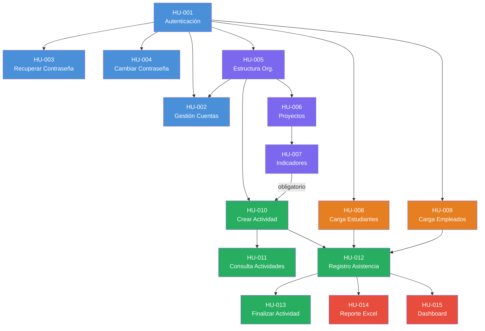

# Mapa de Historias de Usuario — SIBE

---

## 1. Descripción del Artefacto

El **Mapa de Historias de Usuario** (User Story Map) es una técnica de visualización bidimensional que organiza las historias del producto a lo largo de dos ejes:

- **Eje horizontal (Backbone):** Representa el flujo narrativo del usuario a través de las grandes actividades o épicas del sistema, ordenadas de izquierda a derecha según la secuencia lógica de uso.
- **Eje vertical (Releases / Prioridad):** Organiza las historias dentro de cada actividad por cortes de entrega (releases), de arriba (más prioritario/fundamental) hacia abajo (menos prioritario/complementario).

Este mapa permite identificar el **Walking Skeleton** (esqueleto mínimo funcional), planificar entregas incrementales y garantizar que cada release aporte valor de extremo a extremo.

---

## 2. Backbone — Actividades del Usuario

El backbone del sistema SIBE se compone de **5 actividades principales** que representan el flujo completo del usuario dentro de la plataforma:

| # | Actividad (Épica) | Código | Descripción del flujo |
|---|---|---|---|
| A1 | Gestión de Acceso y Cuentas | ACC | Autenticarse, gestionar usuarios y credenciales |
| A2 | Configuración Estratégica y Organizacional | ORG | Consultar estructura, definir proyectos e indicadores |
| A3 | Administración de Participantes | PAR | Cargar y mantener la base de estudiantes y empleados |
| A4 | Ciclo de Vida de Actividades | ACT | Crear, consultar, ejecutar y cerrar actividades |
| A5 | Analítica y Explotación de Datos | ANA | Generar reportes y visualizar métricas en dashboard |

### Flujo Narrativo del Backbone


---

## 3. Mapa Bidimensional de Historias

### 3.1 Representación Visual

```
┌─────────────────────────────────────────────────────────────────────────────────────────────────────┐
│                                    B A C K B O N E  (Flujo del Usuario →)                          │
├──────────────────┬──────────────────┬──────────────────┬──────────────────┬──────────────────────────┤
│  🔐 A1: ACCESO   │ 🏛️ A2: CONFIG    │  👥 A3: PARTIC.  │  📋 A4: ACTIVID. │  📊 A5: ANALÍTICA       │
│    Y CUENTAS     │   ORGANIZACIONAL │   PARTICIPANTES  │    ACTIVIDADES   │   Y REPORTES            │
╞══════════════════╪══════════════════╪══════════════════╪══════════════════╪══════════════════════════╡
│ RELEASE 1        │                  │                  │                  │                          │
│ (Fundación)      │                  │                  │                  │                          │
│                  │                  │                  │                  │                          │
│  ┌────────────┐  │  ┌────────────┐  │  ┌────────────┐  │  ┌────────────┐  │  ┌──────────────────┐   │
│  │  HU-001    │  │  │  HU-005    │  │  │  HU-008    │  │  │  HU-010    │  │  │  HU-015          │   │
│  │  Autent.   │  │  │  Consulta  │  │  │  Carga     │  │  │  Crear/    │  │  │  Dashboard       │   │
│  │  Login     │  │  │  Estructura│  │  │  Estudiantes│ │  │  Editar    │  │  │  Métricas        │   │
│  │  P:1       │  │  │  Organiz.  │  │  │  Excel     │  │  │  Actividad │  │  │  Participación   │   │
│  └────────────┘  │  │  P:5       │  │  │  P:8       │  │  │  P:10      │  │  │  P:15            │   │
│                  │  └────────────┘  │  └────────────┘  │  └────────────┘  │  └──────────────────┘   │
│  ┌────────────┐  │  ┌────────────┐  │  ┌────────────┐  │  ┌────────────┐  │                          │
│  │  HU-002    │  │  │  HU-006    │  │  │  HU-009    │  │  │  HU-012    │  │                          │
│  │  Gestión   │  │  │  Gestión   │  │  │  Carga     │  │  │  Registro  │  │                          │
│  │  Cuentas   │  │  │  Proyectos │  │  │  Empleados │  │  │  Asistencia│  │                          │
│  │  (CRUD)    │  │  │  Plan Des. │  │  │  Excel     │  │  │  RFID/Doc  │  │                          │
│  │  P:2       │  │  │  P:6       │  │  │  P:9       │  │  │  P:12      │  │                          │
│  └────────────┘  │  └────────────┘  │  └────────────┘  │  └────────────┘  │                          │
│                  │  ┌────────────┐  │                  │                  │                          │
│                  │  │  HU-007    │  │                  │                  │                          │
│                  │  │  Indicadores│ │                  │                  │                          │
│                  │  │  Estratég. │  │                  │                  │                          │
│                  │  │  P:7       │  │                  │                  │                          │
│                  │  └────────────┘  │                  │                  │                          │
├──────────────────┼──────────────────┼──────────────────┼──────────────────┼──────────────────────────┤
│ RELEASE 2        │                  │                  │                  │                          │
│ (Operativo)      │                  │                  │                  │                          │
│                  │                  │                  │                  │                          │
│  ┌────────────┐  │                  │                  │  ┌────────────┐  │  ┌──────────────────┐   │
│  │  HU-003    │  │                  │                  │  │  HU-011    │  │  │  HU-014          │   │
│  │  Recuperar │  │                  │                  │  │  Consulta  │  │  │  Reporte         │   │
│  │  Contraseña│  │                  │                  │  │  Activid.  │  │  │  Detallado       │   │
│  │  (Olvido)  │  │                  │                  │  │  por       │  │  │  Asistencias     │   │
│  │  P:3       │  │                  │                  │  │  Contexto  │  │  │  Excel           │   │
│  └────────────┘  │                  │                  │  │  P:11      │  │  │  P:14            │   │
│                  │                  │                  │  └────────────┘  │  └──────────────────┘   │
│                  │                  │                  │  ┌────────────┐  │                          │
│                  │                  │                  │  │  HU-013    │  │                          │
│                  │                  │                  │  │  Finalizar │  │                          │
│                  │                  │                  │  │  Actividad │  │                          │
│                  │                  │                  │  │  P:13      │  │                          │
│                  │                  │                  │  └────────────┘  │                          │
├──────────────────┼──────────────────┼──────────────────┼──────────────────┼──────────────────────────┤
│ RELEASE 3        │                  │                  │                  │                          │
│ (Maduración)     │                  │                  │                  │                          │
│                  │                  │                  │                  │                          │
│  ┌────────────┐  │                  │                  │                  │                          │
│  │  HU-004    │  │                  │                  │                  │                          │
│  │  Cambio    │  │                  │                  │                  │                          │
│  │  Contraseña│  │                  │                  │                  │                          │
│  │  (Autent.) │  │                  │                  │                  │                          │
│  │  P:4       │  │                  │                  │                  │                          │
│  └────────────┘  │                  │                  │                  │                          │
└──────────────────┴──────────────────┴──────────────────┴──────────────────┴──────────────────────────┘
```

### 3.2 Diagrama Mermaid del Mapa

```mermaid
block-beta
    columns 5
    
    block:header1:1
        h1["🔐 A1: Acceso y Cuentas"]
    end
    block:header2:1
        h2["🏛️ A2: Config. Organizacional"]
    end
    block:header3:1
        h3["👥 A3: Participantes"]
    end
    block:header4:1
        h4["📋 A4: Actividades"]
    end
    block:header5:1
        h5["📊 A5: Analítica"]
    end

    block:r1a1:1
        r1h1["HU-001 Autenticación"]
        r1h2["HU-002 Gestión Cuentas"]
    end
    block:r1a2:1
        r1h5["HU-005 Estructura Org."]
        r1h6["HU-006 Proyectos"]
        r1h7["HU-007 Indicadores"]
    end
    block:r1a3:1
        r1h8["HU-008 Carga Estudiantes"]
        r1h9["HU-009 Carga Empleados"]
    end
    block:r1a4:1
        r1h10["HU-010 Crear Actividad"]
        r1h12["HU-012 Registro RFID"]
    end
    block:r1a5:1
        r1h15["HU-015 Dashboard"]
    end
    
    block:r2a1:1
        r2h3["HU-003 Recuperar Contraseña"]
    end
    block:r2a2:1
        r2empty["—"]
    end
    block:r2a3:1
        r2empty2["—"]
    end
    block:r2a4:1
        r2h11["HU-011 Consulta Actividades"]
        r2h13["HU-013 Finalizar Actividad"]
    end
    block:r2a5:1
        r2h14["HU-014 Reporte Excel"]
    end

    block:r3a1:1
        r3h4["HU-004 Cambiar Contraseña"]
    end
    block:r3a2:1
        r3empty["—"]
    end
    block:r3a3:1
        r3empty2["—"]
    end
    block:r3a4:1
        r3empty3["—"]
    end
    block:r3a5:1
        r3empty4["—"]
    end

    style h1 fill:#4A90D9,color:#fff
    style h2 fill:#7B68EE,color:#fff
    style h3 fill:#E67E22,color:#fff
    style h4 fill:#27AE60,color:#fff
    style h5 fill:#E74C3C,color:#fff
```



---

## 4. Definición de Releases

### Release 1 — Fundación (Walking Skeleton)

> **Objetivo:** Establecer el flujo mínimo de extremo a extremo: un usuario se autentica, se configura la estructura organizacional, se crean proyectos, acciones e indicadores (requisitos obligatorios para actividades), se cargan participantes (estudiantes y empleados), se crea y ejecuta una actividad con registro de asistencia, y se visualizan métricas básicas.

| Historia | Nombre | Actividad | Justificación |
|----------|--------|-----------|---------------|
| HU-001 | Autenticación y Login | A1: Acceso | Sin autenticación no existe acceso al sistema. Puerta de entrada obligatoria. |
| HU-002 | Gestión de Cuentas de Usuario | A1: Acceso | Se necesitan usuarios con roles para que el sistema sea operable. Habilita RBAC. |
| HU-005 | Consultar Estructura Organizacional | A2: Config. | Las Áreas y Subáreas son prerequisito para asignar usuarios y crear actividades. |
| HU-006 | Gestión de Proyectos del Plan de Desarrollo | A2: Config. | Los proyectos son prerequisito para crear acciones, que a su vez son prerequisito para crear indicadores. |
| HU-007 | Gestión de Indicadores Estratégicos | A2: Config. | Los indicadores son **obligatorios** para crear actividades. Sin indicadores no se puede registrar ninguna actividad. |
| HU-008 | Carga Masiva de Estudiantes (Excel) | A3: Participantes | Sin participantes en la BD no se puede registrar asistencia. Los estudiantes son el público principal. |
| HU-009 | Carga Masiva de Empleados (Excel) | A3: Participantes | Completa la base de participantes internos (docentes, administrativos, operativos). Se desarrolla junto con HU-008. |
| HU-010 | Creación y Edición de Actividades | A4: Actividades | La actividad es la entidad central del negocio. Requiere indicador asociado obligatoriamente. |
| HU-012 | Registro de Asistencia en Vivo (RFID/Doc) | A4: Actividades | Flujo core de valor: registrar asistencia es la razón de ser del sistema SIBE. |
| HU-015 | Dashboard de Métricas de Participación | A5: Analítica | Cierra el ciclo de valor: permite visualizar resultados inmediatamente tras registrar asistencias. |

**Historias incluidas:** 10 · **Cobertura del backbone:** 5/5 actividades

### Release 2 — Operativo (Capacidad Completa)

> **Objetivo:** Completar las capacidades operativas del sistema: recuperación de acceso, consulta contextual de actividades, cierre formal y reportes descargables.

| Historia | Nombre | Actividad | Justificación |
|----------|--------|-----------|---------------|
| HU-003 | Recuperación de Contraseña (Olvido) | A1: Acceso | Autonomía del usuario para recuperar acceso sin intervención del administrador. |
| HU-011 | Consulta de Actividades por Contexto Org. | A4: Actividades | Cada rol ve solo lo que le corresponde (Dirección, Área, Subárea). Habilita gobernanza. |
| HU-013 | Finalización y Cierre de Actividad | A4: Actividades | Cierra ciclo de vida: la actividad pasa de EN_CURSO a FINALIZADA, bloqueando registros posteriores. |
| HU-014 | Reporte Detallado de Asistencia (Excel) | A5: Analítica | Permite exportar datos de asistencia para auditoría e indicadores institucionales. |

**Historias incluidas:** 4 · **Cobertura del backbone:** 2/5 actividades

### Release 3 — Maduración (Robustez)

> **Objetivo:** Agregar capacidades de madurez: gestión proactiva de credenciales para autonomía del usuario.

| Historia | Nombre | Actividad | Justificación |
|----------|--------|-----------|---------------|
| HU-004 | Cambio de Contraseña (Usuario Autenticado) | A1: Acceso | Autogestión preventiva de seguridad. Menor prioridad que el flujo de olvido (HU-003). |

**Historias incluidas:** 1 · **Cobertura del backbone:** 1/5 actividades

---

## 5. Walking Skeleton (Esqueleto Mínimo Funcional)

El Walking Skeleton define la ruta mínima de valor que atraviesa TODO el backbone de extremo a extremo:


**Flujo narrativo del Walking Skeleton:**

1. El **Administrador de Dirección** inicia sesión en el sistema (**HU-001**).
2. El sistema carga la estructura organizacional (Direcciones, Áreas, Subáreas) desde la BD (**HU-005**).
3. El administrador crea proyectos del plan de desarrollo con sus acciones (**HU-006**).
4. El administrador crea indicadores estratégicos vinculados a los proyectos (**HU-007**). Este paso es **obligatorio** para poder crear actividades.
5. El administrador carga los archivos Excel de estudiantes y empleados vigentes para el semestre (**HU-008**, **HU-009**).
6. El administrador crea una actividad, asignando área, colaborador, **indicador obligatorio** y fechas de ejecución (**HU-010**).
7. El **Colaborador** (o Admin. de Dirección / Admin. de Área) inicia la actividad y registra asistencia de participantes vía RFID o documento (**HU-012**).
8. El administrador visualiza en el dashboard las métricas de participación resultantes (**HU-015**).

> Este flujo de 6 historias demuestra la propuesta de valor completa del sistema: **desde la configuración inicial hasta la visualización de resultados**.

---

## 6. Detalle de Historias por Celda del Mapa

### A1 — Gestión de Acceso y Cuentas

| Release | Historia | Prioridad | Roles involucrados | Dependencias |
|---------|----------|-----------|---------------------|--------------|
| R1 | HU-001 — Autenticación y Login | 1 | Todos los roles | Ninguna (punto de entrada) |
| R1 | HU-002 — Gestión de Cuentas de Usuario (CRUD) | 2 | Admin. Dirección | HU-001, HU-005 (lista de áreas) |
| R2 | HU-003 — Recuperación de Contraseña (Olvido) | 3 | Todos los roles | HU-001 (usuarios existentes) |
| R3 | HU-004 — Cambio de Contraseña (Autenticado) | 4 | Todos los roles | HU-001 (sesión activa) |

### A2 — Configuración Estratégica y Organizacional

| Release | Historia | Prioridad | Roles involucrados | Dependencias |
|---------|----------|-----------|---------------------|--------------|
| R1 | HU-005 — Consultar Estructura Organizacional | 5 | Admin. Dirección, Admin. Área | HU-001 |
| R1 | HU-006 — Gestión de Proyectos del Plan de Desarrollo | 6 | Admin. Dirección | HU-001, HU-005 |
| R1 | HU-007 — Gestión de Indicadores Estratégicos | 7 | Admin. Dirección | HU-006 (vincular a proyectos y acciones). **Obligatorio** para poder crear actividades. |

### A3 — Administración de Participantes

| Release | Historia | Prioridad | Roles involucrados | Dependencias |
|---------|----------|-----------|---------------------|--------------|
| R1 | HU-008 — Carga Masiva de Estudiantes (Excel) | 8 | Admin. Dirección | HU-001 |
| R1 | HU-009 — Carga Masiva de Empleados (Excel) | 9 | Admin. Dirección | HU-001. Se desarrolla junto con HU-008. |

### A4 — Ciclo de Vida de Actividades (Core)

| Release | Historia | Prioridad | Roles involucrados | Dependencias |
|---------|----------|-----------|---------------------|--------------|
| R1 | HU-010 — Creación y Edición de Actividades | 10 | Admin. Dirección, Admin. Área | HU-005 (área), HU-007 (indicador **obligatorio**) |
| R2 | HU-011 — Consulta de Actividades por Contexto Org. | 11 | Todos los roles | HU-010 (actividades existentes) |
| R1 | HU-012 — Registro de Asistencia en Vivo (RFID/Doc) | 12 | Admin. Dirección, Admin. Área, Colaborador | HU-010 (ejecución), HU-008/HU-009 (participantes) |
| R2 | HU-013 — Finalización y Cierre de Actividad | 13 | Admin. Dirección, Admin. Área, Colaborador | HU-012 (actividad en curso) |

### A5 — Analítica y Explotación de Datos

| Release | Historia | Prioridad | Roles involucrados | Dependencias |
|---------|----------|-----------|---------------------|--------------|
| R2 | HU-014 — Reporte Detallado de Asistencia (Excel) | 14 | Admin. Dirección, Admin. Área | HU-012 (asistencias registradas) |
| R1 | HU-015 — Dashboard de Métricas de Participación | 15 | Admin. Dirección, Admin. Área | HU-012 (asistencias registradas) |

---

## 7. Grafo de Dependencias entre Historias



---

## 8. Matriz de Trazabilidad: Historias ↔ Requerimientos ↔ Procesos

| Historia | Requerimientos Funcionales | Requerimientos No Funcionales | Procesos de Negocio |
|----------|---------------------------|-------------------------------|---------------------|
| HU-001 | RF-001-B | RNF-004 (Autenticación), RNF-005 (Protección) | BP-01 |
| HU-002 | RF-002, RF-003, RF-003-B, RF-005 | RNF-004 (RBAC) | BP-02 |
| HU-003 | RF-004-B | RNF-004 (Seguridad), RNF-005 (Protección) | BP-03 |
| HU-004 | RF-004-B | RNF-004 (Seguridad) | BP-04 |
| HU-005 | RF-006, RF-013 | RNF-002 (Rendimiento) | BP-05 |
| HU-006 | — (Gestión de proyectos) | RNF-006 (Documentación) | BP-06 |
| HU-007 | — (Gestión de indicadores) | RNF-006 (Documentación) | BP-07 |
| HU-008 | RF-014 | RNF-002 (Rendimiento) | BP-08 |
| HU-009 | RF-014 | RNF-002 (Rendimiento) | BP-09 |
| HU-010 | RF-001, RF-004 | RNF-001 (Usabilidad) | BP-10 |
| HU-011 | RF-001, RF-004, RF-006, RF-013 | RNF-001 (Usabilidad), RNF-002 (Rendimiento) | BP-11 |
| HU-012 | RF-011, RF-014 | RNF-002 (Rendimiento), RNF-003 (Disponibilidad) | BP-12 |
| HU-013 | RF-001, RF-004 | RNF-003 (Disponibilidad) | BP-13 |
| HU-014 | RF-007, RF-008, RF-009 | RNF-002 (Rendimiento) | BP-14 |
| HU-015 | RF-007, RF-008, RF-009 | RNF-001 (Usabilidad), RNF-002 (Rendimiento) | BP-15, BP-16 |

---

## 9. Distribución Cuantitativa

### Por Release

| Release | # Historias | Actividades cubiertas | Descripción |
|---------|-------------|----------------------|-------------|
| R1 — Fundación | 10 | A1, A2, A3, A4, A5 (5/5) | Walking Skeleton completo. Incluye proyectos, indicadores (obligatorios), carga masiva de estudiantes y empleados, y flujo core de actividades. |
| R2 — Operativo | 4 | A1, A4, A5 (3/5) | Capacidades operativas: recuperación de acceso, consulta contextual, cierre de actividades, reportes. |
| R3 — Maduración | 1 | A1 (1/5) | Robustez de seguridad: cambio proactivo de contraseña. |
| **Total** | **15** | — | — |

### Por Actividad del Backbone

| Actividad | # Historias | Historias |
|-----------|-------------|-----------|
| A1: Acceso y Cuentas | 4 | HU-001, HU-002, HU-003, HU-004 |
| A2: Config. Organizacional | 3 | HU-005, HU-006, HU-007 |
| A3: Participantes | 2 | HU-008, HU-009 |
| A4: Actividades (Core) | 4 | HU-010, HU-011, HU-012, HU-013 |
| A5: Analítica | 2 | HU-014, HU-015 |

### Por Rol Principal

| Rol | Historias donde es actor principal |
|-----|-----------------------------------|
| Administrador de Dirección | HU-002, HU-005, HU-006, HU-007, HU-008, HU-009, HU-010, HU-011, HU-012, HU-013, HU-014, HU-015 |
| Administrador de Área | HU-010, HU-011, HU-012, HU-013, HU-014, HU-015 |
| Colaborador | HU-011, HU-012, HU-013, HU-015 |
| Todos los roles | HU-001, HU-003, HU-004 |

---

## 10. Observaciones y Decisiones de Priorización

1. **HU-012 (Registro Asistencia RFID) en Release 1 a pesar de prioridad 12:** La prioridad numérica refleja el orden secuencial de documentación, no la criticidad de negocio. El registro de asistencia es el **valor central** (core value) del sistema SIBE, por lo tanto se incluye en el Walking Skeleton, no en un release posterior.

2. **HU-015 (Dashboard) en Release 1 a pesar de prioridad 15:** Se incluye para cerrar el ciclo de valor de extremo a extremo. Sin visualización de resultados, el sistema no demuestra su propuesta de valor completa.

3. **HU-002 (Gestión de Cuentas) en Release 1:** Aunque el Login (HU-001) podría operar con un usuario semilla, la gestión de cuentas es necesaria para crear colaboradores que ejecuten actividades.

4. **HU-007 (Indicadores) como dependencia obligatoria de HU-010:** Una actividad **debe** tener un indicador asociado. Por lo tanto, los indicadores (HU-007), los proyectos (HU-006) y las acciones son prerequisitos obligatorios que se incluyen en Release 1.

5. **HU-008 y HU-009 (Carga masiva) en Release 1 juntas:** La carga masiva de estudiantes y empleados se desarrolla de forma conjunta por compartir la misma arquitectura de procesamiento Excel.

6. **Ausencia de historias en R3 para A2, A3, A4 y A5:** Estas actividades quedan completas entre R1 y R2. La Release 3 focaliza únicamente en robustecer la seguridad de acceso.

---

## 11. Glosario del Mapa

| Término | Definición |
|---------|-----------|
| **Backbone** | Eje horizontal del mapa: secuencia de grandes actividades del usuario que representan el flujo narrativo del sistema. |
| **Release** | Corte horizontal de entrega planificada que agrupa un conjunto de historias que aportan valor cohesivo. |
| **Walking Skeleton** | El subconjunto mínimo de historias que atraviesa todo el backbone de extremo a extremo, demostrando el flujo de valor completo. |
| **Actividad (Épica)** | Agrupación funcional de historias que cubre una capacidad de negocio del sistema. |
| **Prioridad (P:n)** | Orden secuencial de las historias según el backlog documentado (1 = más prioritaria). |
| **R1, R2, R3** | Identificadores de las tres releases planificadas: Fundación, Operativo y Maduración. |