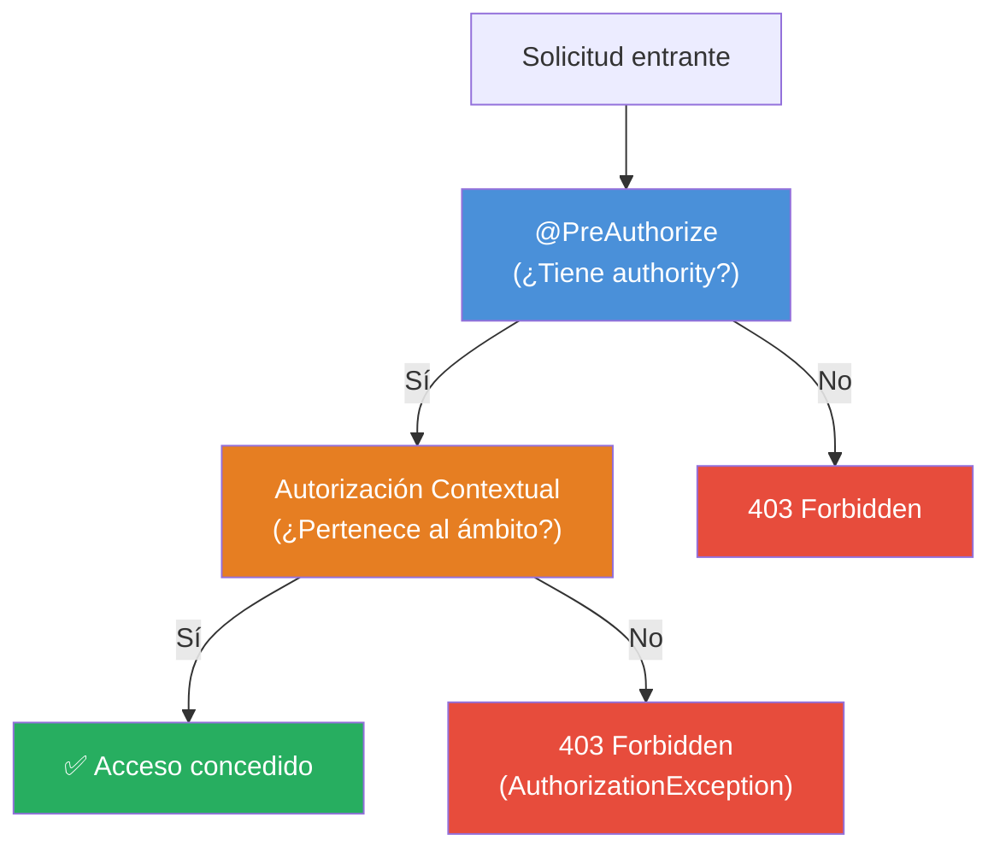
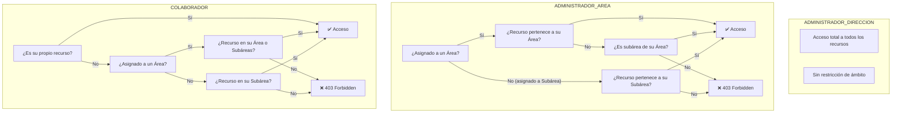
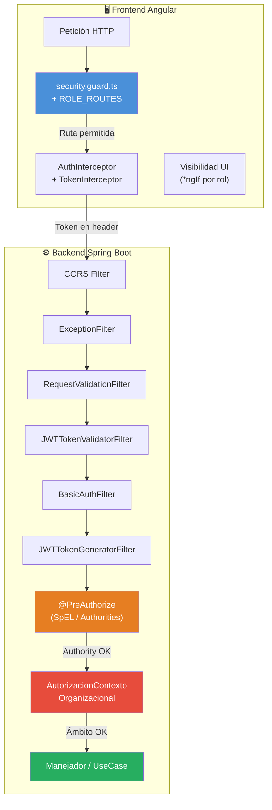

# Matriz de Roles por Operaciones — SIBE

---

## 1. Descripción del Artefacto

La **Matriz de Roles por Operaciones** documenta de forma exhaustiva qué operaciones puede ejecutar cada rol del sistema SIBE, tanto a nivel de API REST (backend) como a nivel de interfaz de usuario (frontend). Este artefacto constituye la referencia canónica de control de acceso.

---

## 2. Definición de Roles y Privilegios CRUD

### 2.1 Roles del Sistema

| Rol | Código | Descripción |
|-----|--------|-------------|
| Administrador de Dirección | `ADMINISTRADOR_DIRECCION` | Gestión global del sistema. Acceso total a todas las áreas, subáreas y operaciones. Puede ejecutar actividades en cualquier ámbito. |
| Administrador de Área | `ADMINISTRADOR_AREA` | Gestión de su área asignada y sus subáreas. Acceso de lectura a recursos globales. Puede ejecutar actividades en su ámbito. |
| Colaborador | `COLABORADOR` | Operador de actividades en su área o subárea asignada. Acceso de lectura y ejecución de actividades. |

### 2.2 Privilegios CRUD por Rol (Data Loader)

Cada rol tiene authorities compuestas `{ROL}_{OPERACION}`:

| Rol | Crear | Consultar | Modificar | Eliminar | Authorities generadas |
|-----|:-----:|:---------:|:---------:|:--------:|----------------------|
| ADMINISTRADOR_DIRECCION | ✅ | ✅ | ✅ | ✅ | `ADMINISTRADOR_DIRECCION_CREATE`, `_READ`, `_UPDATE`, `_DELETE` |
| ADMINISTRADOR_AREA | ✅ | ✅ | ✅ | ✅ | `ADMINISTRADOR_AREA_CREATE`, `_READ`, `_UPDATE`, `_DELETE` |
| COLABORADOR | ✅ | ✅ | ✅ | ❌ | `COLABORADOR_CREATE`, `_READ`, `_UPDATE` |

> **Nota:** Aunque `ADMINISTRADOR_AREA` tiene `DELETE` en su data loader, **ningún endpoint** del sistema le concede acceso a operaciones de eliminación. El privilegio existe en BD pero no se aplica en la capa de autorización.

### 2.3 Expresiones de Autorización Compuestas

| Constante | Expresión SpEL | Roles permitidos |
|-----------|----------------|------------------|
| `HAS_ADMIN_CREATE_AUTHORITY` | `hasAuthority('ADMINISTRADOR_DIRECCION_CREATE')` | Admin. Dirección |
| `HAS_ADMIN_DELETE_AUTHORITY` | `hasAuthority('ADMINISTRADOR_DIRECCION_DELETE')` | Admin. Dirección |
| `HAS_USER_OR_ADMIN_UPDATE_AUTHORITY` | `COLABORADOR_UPDATE or ADMIN_DIRECCION_UPDATE` | Colaborador, Admin. Dirección |
| `HAS_AREA_ADMIN_OR_ADMIN_CREATE_AUTHORITY` | `ADMIN_DIRECCION_CREATE or ADMIN_AREA_CREATE` | Admin. Dirección, Admin. Área |
| `HAS_AREA_ADMIN_OR_ADMIN_UPDATE_AUTHORITY` | `ADMIN_DIRECCION_UPDATE or ADMIN_AREA_UPDATE` | Admin. Dirección, Admin. Área |
| `HAS_USER_OR_AREA_ADMIN_OR_ADMIN_GET_AUTHORITY` | `COLABORADOR_READ or ADMIN_DIRECCION_READ or ADMIN_AREA_READ` | Los 3 roles |
| `HAS_USER_OR_AREA_ADMIN_OR_ADMIN_UPDATE_AUTHORITY` | `COLABORADOR_UPDATE or ADMIN_DIRECCION_UPDATE or ADMIN_AREA_UPDATE` | Los 3 roles |

---

## 3. Matriz de Operaciones REST — Backend

### Leyenda

| Símbolo | Significado |
|---------|-------------|
| ✅ | Acceso permitido (por `@PreAuthorize`) |
| ❌ | Acceso denegado |
| 🌐 | Endpoint público (sin autenticación) |
| 🔒 | Requiere solo autenticación (sin restricción de rol) |

### 3.1 Autenticación y Recuperación de Credenciales

| # | Operación | Verbo | Endpoint | Admin. Dirección | Admin. Área | Colaborador | Público |
|---|-----------|-------|----------|:----------------:|:-----------:|:-----------:|:-------:|
| 1 | Login | REQUEST | `/login` | 🔒 | 🔒 | 🔒 | ❌ |
| 2 | Solicitar código recuperación | POST | `/usuarios/recuperacion/solicitar/{correo}` | 🌐 | 🌐 | 🌐 | 🌐 |
| 3 | Validar código recuperación | POST | `/usuarios/recuperacion/validarCodigo` | 🌐 | 🌐 | 🌐 | 🌐 |
| 4 | Recuperar contraseña | PUT | `/usuarios/recuperacion/recuperarClave` | 🌐 | 🌐 | 🌐 | 🌐 |

### 3.2 Gestión de Usuarios

| # | Operación | Verbo | Endpoint | Admin. Dirección | Admin. Área | Colaborador |
|---|-----------|-------|----------|:----------------:|:-----------:|:-----------:|
| 5 | Consultar todos los usuarios | GET | `/usuarios` | ✅ | ✅ | ✅ |
| 6 | Consultar usuario por ID | GET | `/usuarios/usuario/id/{id}` | ✅ | ✅ | ✅ |
| 7 | Consultar usuario por correo | GET | `/usuarios/usuario/correo/{correo}` | ✅ | ✅ | ✅ |
| 8 | Crear usuario | POST | `/usuarios` | ✅ | ❌ | ❌ |
| 9 | Modificar usuario | PUT | `/usuarios/usuario/{id}` | ✅ | ❌ | ❌ |
| 10 | Modificar contraseña (autenticado) | PUT | `/usuarios/modificar/clave` | ✅ | ✅ | ✅ |
| 11 | Eliminar usuario | DELETE | `/usuarios/usuario/{id}` | ✅ | ❌ | ❌ |

### 3.3 Estructura Organizacional (Consultas)

| # | Operación | Verbo | Endpoint | Admin. Dirección | Admin. Área | Colaborador |
|---|-----------|-------|----------|:----------------:|:-----------:|:-----------:|
| 12 | Consultar direcciones | GET | `/direcciones` | ✅ | ✅ | ✅ |
| 13 | Consultar detalle dirección | GET | `/direcciones/detalle/{id}` | ✅ | ✅ | ✅ |
| 14 | Consultar dirección por nombre | GET | `/direcciones/nombre/{nombre}` | ✅ | ✅ | ✅ |
| 15 | Consultar áreas | GET | `/areas` | ✅ | ✅ | ✅ |
| 16 | Consultar detalle área | GET | `/areas/detalle/{id}` | ✅ | ✅ | ✅ |
| 17 | Consultar área por nombre | GET | `/areas/nombre/{nombre}` | ✅ | ✅ | ✅ |
| 18 | Consultar subáreas | GET | `/subareas` | ✅ | ✅ | ✅ |
| 19 | Consultar detalle subárea | GET | `/subareas/detalle/{id}` | ✅ | ✅ | ✅ |
| 20 | Consultar subárea por nombre | GET | `/subareas/nombre/{nombre}` | ✅ | ✅ | ✅ |
| 21 | Contar usuarios por organización | GET | `/organizacion/{id}/usuarios/contar` | ✅ | ✅ | ✅ |

### 3.4 Catálogos del Sistema (Consultas)

| # | Operación | Verbo | Endpoint | Admin. Dirección | Admin. Área | Colaborador |
|---|-----------|-------|----------|:----------------:|:-----------:|:-----------:|
| 22 | Consultar tipos de usuario | GET | `/tipos_usuario` | ✅ | ✅ | ✅ |
| 23 | Consultar tipos de identificación | GET | `/tipos_identificacion` | ✅ | ✅ | ✅ |
| 24 | Consultar tipos de indicador | GET | `/tipos_indicador` | ✅ | ✅ | ✅ |
| 25 | Consultar temporalidades | GET | `/temporalidades` | ✅ | ✅ | ✅ |
| 26 | Consultar públicos de interés | GET | `/publicos_interes` | ✅ | ✅ | ✅ |

### 3.5 Proyectos y Acciones del Plan de Desarrollo

| # | Operación | Verbo | Endpoint | Admin. Dirección | Admin. Área | Colaborador |
|---|-----------|-------|----------|:----------------:|:-----------:|:-----------:|
| 27 | Consultar proyectos | GET | `/proyectos` | ✅ | ✅ | ✅ |
| 28 | Crear proyecto | POST | `/proyectos` | ✅ | ❌ | ❌ |
| 29 | Modificar proyecto | PUT | `/proyectos/{id}` | ✅ | ❌ | ❌ |
| 30 | Consultar acciones | GET | `/acciones` | ✅ | ✅ | ✅ |
| 31 | Crear acción | POST | `/acciones` | ✅ | ❌ | ❌ |
| 32 | Modificar acción | PUT | `/acciones/{id}` | ✅ | ❌ | ❌ |

### 3.6 Indicadores Estratégicos

| # | Operación | Verbo | Endpoint | Admin. Dirección | Admin. Área | Colaborador |
|---|-----------|-------|----------|:----------------:|:-----------:|:-----------:|
| 33 | Consultar indicadores | GET | `/indicadores` | ✅ | ✅ | ✅ |
| 34 | Consultar indicadores para actividades | GET | `/indicadores/actividades` | ✅ | ✅ | ✅ |
| 35 | Crear indicador | POST | `/indicadores` | ✅ | ❌ | ❌ |
| 36 | Modificar indicador | PUT | `/indicadores/{id}` | ✅ | ❌ | ❌ |

### 3.7 Carga Masiva de Participantes

| # | Operación | Verbo | Endpoint | Admin. Dirección | Admin. Área | Colaborador |
|---|-----------|-------|----------|:----------------:|:-----------:|:-----------:|
| 37 | Cargar estudiantes (Excel) | POST | `/carga_masiva/estudiantes` | ✅ | ❌ | ❌ |
| 38 | Cargar empleados (Excel) | POST | `/carga_masiva/empleados` | ✅ | ❌ | ❌ |

### 3.8 Consulta de Miembros (Participantes)

| # | Operación | Verbo | Endpoint | Admin. Dirección | Admin. Área | Colaborador |
|---|-----------|-------|----------|:----------------:|:-----------:|:-----------:|
| 39 | Buscar miembro por identificación | GET | `/miembros/identificacion/{id}` | ✅ | ✅ | ✅ |
| 40 | Buscar miembro por carnet RFID | GET | `/miembros/carnet/{carnet}` | ✅ | ✅ | ✅ |

### 3.9 Ciclo de Vida de Actividades

| # | Operación | Verbo | Endpoint | Admin. Dirección | Admin. Área | Colaborador |
|---|-----------|-------|----------|:----------------:|:-----------:|:-----------:|
| 41 | Crear actividad | POST | `/actividades` | ✅ | ✅² | ❌ |
| 42 | Modificar actividad | PUT | `/actividades/{id}` | ✅ | ✅² | ❌ |
| 43 | Iniciar actividad (EN_CURSO) | PUT | `/actividades/iniciar/{id}` | ✅ | ✅ | ✅ |
| 44 | Finalizar actividad (FINALIZADA) | PUT | `/actividades/finalizar/{id}` | ✅ | ✅ | ✅ |
| 45 | Cancelar actividad (CANCELADA) | PUT | `/actividades/cancelar/{id}` | ✅ | ✅ | ✅ |

> ² El Admin. de Área solo puede crear/modificar actividades en su propia área. La autorización contextual valida `areaDeActividad == contexto.areaId`.

### 3.10 Consulta de Actividades y Ejecuciones

| # | Operación | Verbo | Endpoint | Admin. Dirección | Admin. Área | Colaborador |
|---|-----------|-------|----------|:----------------:|:-----------:|:-----------:|
| 46 | Consultar actividades por área | GET | `/actividades/area/{id}` | ✅ | ✅³ | ✅³ |
| 47 | Consultar actividades por dirección | GET | `/actividades/direccion/{id}` | ✅ | ✅³ | ✅³ |
| 48 | Consultar actividades por subárea | GET | `/actividades/subarea/{id}` | ✅ | ✅³ | ✅³ |
| 49 | Consultar ejecuciones de actividad | GET | `/actividades/ejecuciones/{id}` | ✅ | ✅ | ✅ |
| 50 | Consultar participantes por ejecución | GET | `/actividades/ejecuciones/ejecucion/participantes/{id}` | ✅ | ✅ | ✅ |

> ³ Aunque el `@PreAuthorize` permite los 3 roles, la autorización contextual restringe la consulta al ámbito organizacional del usuario: el Admin. Área ve solo su área y subáreas; el Colaborador ve su área y subáreas asignadas, o solo su subárea si se asigna directamente.

### 3.11 Analítica y Dashboard (Estadísticas de Ejecuciones Finalizadas)

| # | Operación | Verbo | Endpoint | Admin. Dirección | Admin. Área | Colaborador |
|---|-----------|-------|----------|:----------------:|:-----------:|:-----------:|
| 51 | Consultar meses de ejecuciones | GET | `/actividades/ejecuciones/finalizadas/meses` | ✅ | ✅ | ✅ |
| 52 | Consultar años de ejecuciones | GET | `/actividades/ejecuciones/finalizadas/annos` | ✅ | ✅ | ✅ |
| 53 | Consultar semestres | GET | `.../finalizadas/semestres` | ✅ | ✅ | ✅ |
| 54 | Consultar centros de costos | GET | `.../finalizadas/centros-costos` | ✅ | ✅ | ✅ |
| 55 | Consultar tipos de participantes | GET | `.../finalizadas/tipos-participantes` | ✅ | ✅ | ✅ |
| 56 | Consultar programas académicos | GET | `.../finalizadas/programas-academicos` | ✅ | ✅ | ✅ |
| 57 | Consultar niveles de formación | GET | `.../finalizadas/niveles-formacion` | ✅ | ✅ | ✅ |
| 58 | Consultar indicadores finalizados | GET | `.../finalizadas/indicadores` | ✅ | ✅ | ✅ |
| 59 | Contar participantes totales | POST | `.../finalizadas/participantes/conteo` | ✅ | ✅ | ✅ |
| 60 | Contar asistencias totales | POST | `.../finalizadas/asistencias/conteo` | ✅ | ✅ | ✅ |
| 61 | Contar ejecuciones totales | POST | `.../finalizadas/conteo` | ✅ | ✅ | ✅ |
| 62 | Estadísticas por estructura | POST | `.../finalizadas/participantes/estadisticas-estructura` | ✅ | ✅ | ✅ |
| 63 | Estadísticas por mes | POST | `.../finalizadas/participantes/estadisticas-mes` | ✅ | ✅ | ✅ |
| 64 | Contar población total | POST | `.../finalizadas/poblacion/conteo` | ✅ | ✅ | ✅ |

---

## 4. Matriz de Acceso a Rutas — Frontend

### 4.1 Protección de Rutas (Angular Guards)

| Ruta | Guard | Admin. Dirección | Admin. Área | Colaborador | Sin autenticación |
|------|-------|:----------------:|:-----------:|:-----------:|:-----------------:|
| `/login` | `publicRouteGuard` | Redirige a `/home` | Redirige a `/home` | Redirige a `/home` | ✅ |
| `/recuperar-contrasena` | `publicRouteGuard` | Redirige a `/home` | Redirige a `/home` | Redirige a `/home` | ✅ |
| `/home` | `securityGuard` | ✅ | ✅ | ✅ | Redirige a `/login` |
| `/home/area-bienestar` | `securityGuard` (hereda) | ✅ | ✅ | ✅ | Redirige a `/login` |
| `/home/area-evangelizacion` | `securityGuard` (hereda) | ✅ | ✅ | ✅ | Redirige a `/login` |
| `/home/area-hogar-santa-maria` | `securityGuard` (hereda) | ✅ | ✅ | ✅ | Redirige a `/login` |
| `/home/area-servicio-atencion` | `securityGuard` (hereda) | ✅ | ✅ | ✅ | Redirige a `/login` |
| `/home/area-bienestar/sub-area-*` | `securityGuard` (hereda) | ✅ | ✅ | ✅ | Redirige a `/login` |
| `/home/asistencia-actividad-direccion` | `securityGuard` (hereda) | ✅ | ✅ | ✅ | Redirige a `/login` |
| `/home/.../asistencia-actividad-area-*` | `securityGuard` (hereda) | ✅ | ✅ | ✅ | Redirige a `/login` |
| `/home/.../asistencia-actividad-subarea-*` | `securityGuard` (hereda) | ✅ | ✅ | ✅ | Redirige a `/login` |
| `/gestionar-direccion` | `securityGuard` + `ROLE_ROUTES` | ✅ | ❌ → `/home` | ❌ → `/home` | Redirige a `/login` |
| `/gestionar-usuarios` | `securityGuard` + `ROLE_ROUTES` | ✅ | ❌ → `/home` | ❌ → `/home` | Redirige a `/login` |
| `/gestionar-indicadores` | `securityGuard` + `ROLE_ROUTES` | ✅ | ❌ → `/home` | ❌ → `/home` | Redirige a `/login` |

### 4.2 Mapa de Restricción por Rol en `ROLE_ROUTES`

Definido en `security.guard.ts`:

```typescript
const ROLE_ROUTES: Record<string, string[]> = {
  '/gestionar-direccion':   ['ADMINISTRADOR_DIRECCION'],
  '/gestionar-usuarios':    ['ADMINISTRADOR_DIRECCION'],
  '/gestionar-indicadores': ['ADMINISTRADOR_DIRECCION'],
};
```

Las rutas `/home/**` no tienen restricción de rol explícita — cualquier usuario autenticado accede. La visibilidad de datos se controla mediante la autorización contextual del backend.

---

## 5. Autorización Contextual (Capa de Dominio)

La clase `AutorizacionContextoOrganizacionalServicio` implementa una segunda capa de autorización que opera **después** del `@PreAuthorize`. Mientras `@PreAuthorize` verifica el **tipo de operación** (CREATE/READ/UPDATE/DELETE), la autorización contextual verifica el **ámbito organizacional** (a qué dirección/área/subárea pertenece el recurso).

### 5.1 Reglas de Autorización Contextual



### 5.2 Matriz de Acceso Contextual por Recurso

| Recurso | Admin. Dirección | Admin. Área | Colaborador |
|---------|:----------------:|:-----------:|:-----------:|
| **Dirección** | ✅ Cualquier dirección | ❌ | ❌ |
| **Área** | ✅ Cualquier área | ✅ Solo su área (`areaId == contexto.areaId`) | ✅ Solo su área asignada (si se le asigna a un área) |
| **Subárea** | ✅ Cualquier subárea | ✅ Solo subáreas de su área | ✅ Subáreas de su área asignada, o solo su subárea si se asigna directamente |
| **Actividad** | ✅ Cualquier actividad | ✅ Actividades de su área o subáreas de su área | ✅ Actividades de su área y subáreas asignadas, o de su subárea si se asigna directamente |
| **Ejecución de Actividad** | ✅ Cualquier ejecución | ✅ Hereda del acceso a la actividad padre | ✅ Hereda del acceso a la actividad padre |
| **Usuario** | ✅ Cualquier usuario | ✅ Usuarios de su misma área | ✅ Solo a sí mismo (`usuarioId == contexto.identificador`) |

### 5.3 Flujo de Validación por Rol



---

## 6. Matriz de Visibilidad de UI (Frontend)

### 6.1 Menú de Navegación y Módulos

| Elemento UI | Ruta asociada | Admin. Dirección | Admin. Área | Colaborador |
|------------|---------------|:----------------:|:-----------:|:-----------:|
| Home / Dashboard | `/home` | ✅ Visible | ✅ Visible | ✅ Visible |
| Navegación por Áreas | `/home/area-*` | ✅ Todas las áreas | ✅ Todas las áreas | ✅ Todas las áreas |
| Navegación por Subáreas | `/home/area-bienestar/sub-area-*` | ✅ Todas | ✅ Todas | ✅ Todas |
| Gestionar Dirección | `/gestionar-direccion` | ✅ Visible | ❌ Oculto (guard) | ❌ Oculto (guard) |
| Gestionar Usuarios | `/gestionar-usuarios` | ✅ Visible | ❌ Oculto (guard) | ❌ Oculto (guard) |
| Gestionar Indicadores | `/gestionar-indicadores` | ✅ Visible | ❌ Oculto (guard) | ❌ Oculto (guard) |
| Recuperar Contraseña | `/recuperar-contrasena` | N/A (solo público) | N/A (solo público) | N/A (solo público) |

### 6.2 Acciones en Componentes

| Componente | Acción | Admin. Dirección | Admin. Área | Colaborador |
|-----------|--------|:----------------:|:-----------:|:-----------:|
| Header | Cambiar Contraseña | ✅ | ✅ | ✅ |
| Header | Cerrar Sesión | ✅ | ✅ | ✅ |
| Gestión Usuarios | Registrar nuevo usuario | ✅ | ❌ | ❌ |
| Gestión Usuarios | Editar usuario | ✅ | ❌ | ❌ |
| Gestión Usuarios | Eliminar usuario | ✅ | ❌ | ❌ |
| Registro Usuario | Selector de Departamento | ✅ (cuando tipoUsuario es Admin. Dirección) | N/A | N/A |
| Registro Usuario | Selector de Área/Subárea | ✅ (cuando tipoUsuario es Admin. Área o Colaborador) | N/A | N/A |
| Gestión Indicadores | Crear proyecto | ✅ | ❌ | ❌ |
| Gestión Indicadores | Editar proyecto | ✅ | ❌ | ❌ |
| Gestión Indicadores | Crear indicador | ✅ | ❌ | ❌ |
| Gestión Indicadores | Editar indicador | ✅ | ❌ | ❌ |
| Gestión Indicadores | Crear acción | ✅ | ❌ | ❌ |
| Gestión Indicadores | Editar acción | ✅ | ❌ | ❌ |
| Actividades (cualquier contexto) | Crear actividad | ✅ | ✅ | ❌ |
| Actividades (cualquier contexto) | Editar actividad | ✅ | ✅ | ❌ |
| Actividades (cualquier contexto) | Iniciar registro asistencia | ✅ | ✅ | ✅ |
| Actividades (cualquier contexto) | Finalizar actividad | ✅ | ✅ | ✅ |
| Actividades (cualquier contexto) | Cancelar actividad | ✅ | ✅ | ✅ |
| Carga Masiva | Cargar estudiantes (Excel) | ✅ | ❌ | ❌ |
| Carga Masiva | Cargar empleados (Excel) | ✅ | ❌ | ❌ |
| Dashboard / Gráficas | Ver métricas globales (Dirección) | ✅ | ❌ | ❌ |
| Dashboard / Gráficas | Ver métricas de área | ✅ | ✅ (solo su área asignada) | ✅ (solo su área asignada) |
| Dashboard / Gráficas | Ver métricas de subárea | ✅ | ✅ (todas las subáreas de su área, o solo su subárea si se asigna directamente) | ✅ (subáreas de su área asignada, o solo su subárea si se asigna directamente) |

---

## 7. Resumen Consolidado por Capacidad Funcional

| Capacidad Funcional | Operación | Admin. Dirección | Admin. Área | Colaborador |
|---------------------|-----------|:----------------:|:-----------:|:-----------:|
| **Autenticación** | Login | ✅ | ✅ | ✅ |
| | Recuperar contraseña (olvido) | ✅ (público) | ✅ (público) | ✅ (público) |
| | Cambiar contraseña (autenticado) | ✅ | ✅ | ✅ |
| **Gestión de Usuarios** | Crear usuario | ✅ | ❌ | ❌ |
| | Consultar usuarios | ✅ | ✅ | ✅ |
| | Modificar usuario | ✅ (cualquiera) | ❌ | ❌ |
| | Eliminar/Deshabilitar usuario | ✅ | ❌ | ❌ |
| **Estructura Organizacional** | Consultar direcciones/áreas/subáreas | ✅ | ✅ | ✅ |
| **Plan de Desarrollo** | Consultar proyectos y acciones | ✅ | ✅ | ✅ |
| | Crear/Modificar proyectos | ✅ | ❌ | ❌ |
| | Crear/Modificar acciones | ✅ | ❌ | ❌ |
| **Indicadores** | Consultar indicadores | ✅ | ✅ (solo API, sin acceso UI) | ✅ |
| | Crear/Modificar indicadores | ✅ | ❌ | ❌ |
| **Participantes** | Carga masiva estudiantes | ✅ | ❌ | ❌ |
| | Carga masiva empleados | ✅ | ❌ | ❌ |
| | Buscar miembro (RFID/documento) | ✅ | ✅ | ✅ |
| **Actividades** | Crear actividad | ✅ (cualquier área) | ✅ (solo su área) | ❌ |
| | Modificar actividad | ✅ | ✅ (solo su área) | ❌ |
| | Consultar actividades | ✅ (todas) | ✅ (su área y subáreas) | ✅ (su área y subáreas asignadas, o su subárea) |
| | Iniciar registro asistencia | ✅ | ✅ | ✅ |
| | Registrar asistencia (RFID/Doc/Externo) | ✅ | ✅ | ✅ |
| | Finalizar actividad | ✅ | ✅ | ✅ |
| | Cancelar actividad | ✅ | ✅ | ✅ |
| **Analítica** | Dashboard de métricas | ✅ (global) | ✅ (su área o subárea asignada) | ✅ (su área o subárea asignada) |
| | Filtros de estadísticas | ✅ | ✅ | ✅ |
| | Generar reporte Excel | ✅ (global) | ✅ (su área) | ❌ |

---

## 8. Token JWT — Información Transportada por Rol

El token JWT generado en el login contiene los siguientes claims que habilitan la autorización en cada capa:

| Claim | Descripción | Admin. Dir. | Admin. Área | Colaborador |
|-------|-------------|:-----------:|:-----------:|:-----------:|
| `email` | Correo del usuario | ✅ | ✅ | ✅ |
| `id` | UUID del usuario (Persona) | ✅ | ✅ | ✅ |
| `authorities` | Lista CSV de authorities CRUD | `ADMINISTRADOR_DIRECCION_CREATE, _READ, _UPDATE, _DELETE, ADMINISTRADOR_DIRECCION` | `ADMINISTRADOR_AREA_CREATE, _READ, _UPDATE, _DELETE, ADMINISTRADOR_AREA` | `COLABORADOR_CREATE, _READ, _UPDATE, COLABORADOR` |
| `rol` | Código del rol | `ADMINISTRADOR_DIRECCION` | `ADMINISTRADOR_AREA` | `COLABORADOR` |
| `direccionId` | UUID de la dirección | ✅ (siempre presente) | ❌ (siempre null) | ❌ (siempre null) |
| `areaId` | UUID del área | ❌ (normalmente null) | ✅ (presente si asignado a un área) | ✅ (presente si asignado a un área) |
| `subareaId` | UUID de la subárea | ❌ (normalmente null) | ✅ (presente si asignado a una subárea) | ✅ (presente si asignado a una subárea) |

> **Nota:** Un Administrador de Área puede ser asignado a un área o a una subárea específica. Si está asignado a un área, `areaId` estará presente y `subareaId` será null. Si está asignado a una subárea, `subareaId` estará presente y `areaId` será null. El mismo comportamiento aplica para el Colaborador.

---

## 9. Diagrama de Arquitectura de Seguridad



---

## 10. Trazabilidad: Roles ↔ Historias de Usuario

| Rol | Historias donde es actor principal | HU donde solo tiene acceso de lectura |
|-----|------------------------------------|---------------------------------------|
| **Admin. Dirección** | HU-001, HU-002, HU-003, HU-004, HU-005, HU-006, HU-007, HU-008, HU-009, HU-010, HU-011, HU-013, HU-014, HU-015 | — |
| **Admin. Área** | HU-001, HU-003, HU-004, HU-005, HU-006, HU-010, HU-011, HU-013, HU-014, HU-015 | HU-007 (solo lectura de indicadores) |
| **Colaborador** | HU-001, HU-003, HU-004, HU-011, HU-012, HU-013 | HU-005 (consulta estructura), HU-015 (dashboard su subárea) |

---

## 11. Glosario

| Término | Definición |
|---------|-----------|
| **Authority** | Cadena que Spring Security evalúa para autorizar una operación. Formato: `{ROL}_{OPERACION}`. |
| **@PreAuthorize** | Anotación de Spring Security que evalúa una expresión SpEL antes de ejecutar un método del controlador. |
| **Guard (Angular)** | Función `CanActivateFn` que intercepta la navegación en el frontend y decide si permite o bloquea el acceso a una ruta. |
| **ROLE_ROUTES** | Mapa en `security.guard.ts` que asocia rutas del frontend con los roles que pueden accederlas. |
| **Autorización contextual** | Validación en la capa de dominio que verifica si el recurso solicitado pertenece al ámbito organizacional del usuario autenticado. |
| **Claims JWT** | Atributos incluidos en el token JWT (`email`, `id`, `authorities`, `rol`, `direccionId`, `areaId`, `subareaId`). |
| **Data Loader** | Componente que precarga los registros de `TipoUsuario` en la BD al iniciar la aplicación. |
| **SpEL** | Spring Expression Language — lenguaje de expresiones usado en `@PreAuthorize`. |