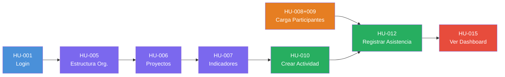
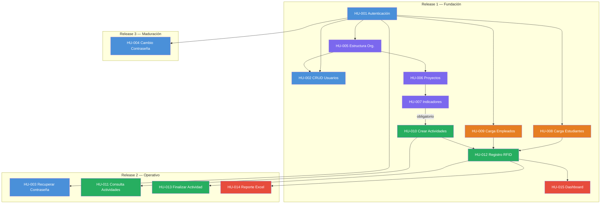
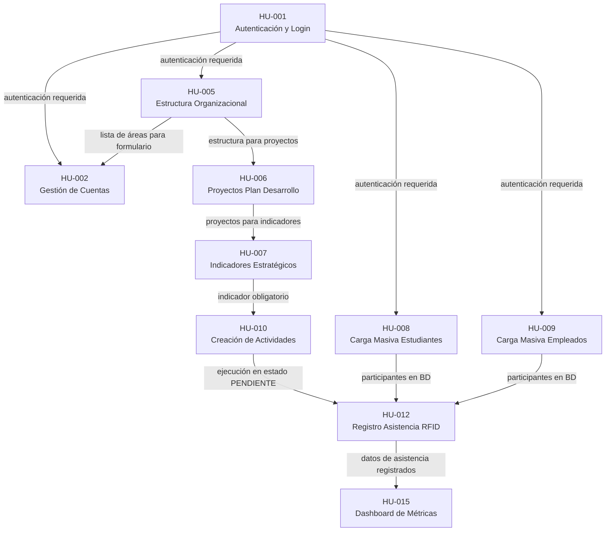
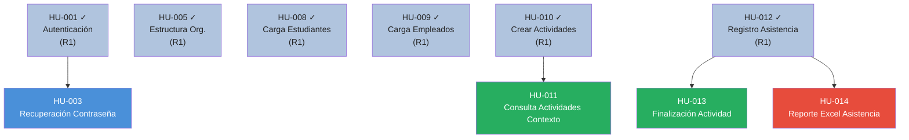
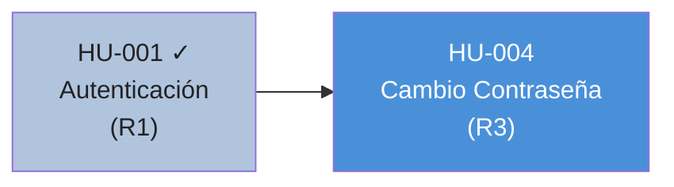

# Plan de Liberaciones del Producto — SIBE

---

## 1. Descripción del Artefacto

El **Plan de Liberaciones del Producto** (Product Release Plan) es el artefacto que descompone la entrega del sistema SIBE en **incrementos funcionales planificados** (releases), cada uno con un objetivo de negocio definido, un alcance funcional delimitado, criterios de entrada y salida verificables, y un análisis de riesgos asociado.

Este documento se construye a partir del [Mapa de Historias de Usuario](10.mapa_de_historias_de_usuario.md) (artefacto 10) como fuente primaria, enriquecido con:

- La [Matriz de Comandos por Impacto](12.matriz_de_comandos_por_impacto.md) (artefacto 12) para la evaluación de complejidad técnica por historia.
- La [Especificación de Requerimientos](15.requerimientos.md) (artefacto 15) para la trazabilidad RF/RNF.
- Las [Historias de Usuario](16.historias_de_usuario.md) (artefacto 16) para el detalle de alcance y criterios de aceptación.

### 1.1 Propósito

| Pregunta | Respuesta que provee este artefacto |
|----------|-------------------------------------|
| ¿Cuántos releases componen el producto? | 3 releases: Fundación, Operativo y Maduración. |
| ¿Qué historias contiene cada release y por qué? | Alcance funcional detallado con justificación de inclusión. |
| ¿Cuál es la ruta crítica de dependencias? | Grafo de dependencias intra-release y cross-release. |
| ¿Qué complejidad técnica tiene cada release? | Evaluación por historia basada en comandos, entidades y transaccionalidad. |
| ¿Cuándo se puede declarar un release como terminado? | Criterios de entrada y salida verificables. |
| ¿Cuál es el estado actual de implementación? | Estado de completitud por historia de usuario. |

---

## 2. Estrategia de Liberación

### 2.1 Principios Rectores

| # | Principio | Aplicación en SIBE |
|---|-----------|-------------------|
| 1 | **Valor de extremo a extremo desde el primer release** | Release 1 implementa el Walking Skeleton: un flujo completo desde login hasta dashboard de métricas, tocando las 5 actividades del backbone. |
| 2 | **Cada release opera de forma autónoma** | Un release desplegado sin los siguientes debe ser funcional por sí mismo; no existen historias parciales entre releases. |
| 3 | **Dependencias resueltas antes del consumo** | Ninguna historia se incluye en un release si sus dependencias no están en el mismo release o en uno anterior. |
| 4 | **Riesgo técnico frontalizado** | Las operaciones de mayor complejidad transaccional (carga masiva, registro RFID) se incluyen en releases tempranos para detectar problemas de integración cuanto antes. |
| 5 | **Incremento decreciente** | Cada release sucesivo es más pequeño (10 → 4 → 1 historias), reflejando que el grueso del valor se entrega tempranamente. |

### 2.2 Modelo de Entrega

```
┌──────────────────────────────────────────────────────────────────────────────────┐
│                          PLAN DE LIBERACIONES — SIBE                            │
├─────────────────────┬─────────────────────┬──────────────────────────────────────┤
│   RELEASE 1         │   RELEASE 2         │   RELEASE 3                         │
│   Fundación         │   Operativo         │   Maduración                        │
│   (Walking Skeleton)│   (Cap. Completa)   │   (Robustez)                        │
│                     │                     │                                      │
│   10 HU · 5/5 back.│   4 HU · 4/5 back. │   1 HU · 1/5 back.                  │
│   15 comandos       │   5 comandos        │   1 comando                          │
│   42 escenarios     │   15 escenarios     │   4 escenarios                       │
│                     │                     │                                      │
│   Flujo completo    │   Operación         │   Seguridad proactiva               │
│   login → dashboard │   autónoma total    │   de credenciales                    │
└─────────────────────┴─────────────────────┴──────────────────────────────────────┘
         ▲                     ▲                          ▲
         │                     │                          │
    Base funcional        Expansión operativa      Consolidación y madurez
```

### 2.3 Distribución Cuantitativa

| Indicador | R1 Fundación | R2 Operativo | R3 Maduración | **Total** |
|-----------|:------------:|:------------:|:-------------:|:---------:|
| Historias de Usuario | 10 | 4 | 1 | **15** |
| Cobertura del Backbone | 5/5 (100 %) | 4/5 (80 %) | 1/5 (20 %) | 5/5 |
| Comandos de escritura | 15 | 5 | 1 | **21** |
| Escenarios de aceptación | 42 | 15 | 4 | **61** |
| Complejidad dominante | Alta | Media | Baja | — |

---

## 3. Resumen del Backbone y Walking Skeleton

### 3.1 Backbone del Sistema

El backbone de SIBE se compone de **5 actividades principales** que representan el flujo completo del usuario:

| # | Actividad (Épica) | Código | Descripción |
|---|-------------------|--------|-------------|
| A1 | Gestión de Acceso y Cuentas | ACC | Autenticarse, gestionar usuarios y credenciales |
| A2 | Configuración Estratégica y Organizacional | ORG | Consultar estructura, definir proyectos e indicadores |
| A3 | Administración de Participantes | PAR | Cargar y mantener la base de estudiantes y empleados |
| A4 | Ciclo de Vida de Actividades | ACT | Crear, consultar, ejecutar y cerrar actividades |
| A5 | Analítica y Explotación de Datos | ANA | Generar reportes y visualizar métricas en dashboard |

### 3.2 Walking Skeleton (Release 1)

El Walking Skeleton es el subconjunto mínimo de historias que atraviesa **todo** el backbone de extremo a extremo:



**Flujo narrativo:** El Administrador inicia sesión → consulta la estructura organizacional → crea acciones y proyectos del plan de desarrollo → define indicadores estratégicos (obligatorios para actividades) → carga el archivo Excel de estudiantes y empleados → crea una actividad asociada a un indicador con fechas programadas → el Colaborador inicia la actividad y registra asistencia RFID → el Administrador visualiza métricas de participación en el dashboard.

---

## 4. Panorama General de Releases

### 4.1 Distribución de Historias por Release y Actividad

| Actividad del Backbone | R1 Fundación | R2 Operativo | R3 Maduración |
|--------------------------|:------------:|:------------:|:-------------:|
| A1 — Acceso y Cuentas | HU-001, HU-002 | HU-003 | HU-004 |
| A2 — Config. Estratégica | HU-005, HU-006, HU-007 | — | — |
| A3 — Participantes | HU-008, HU-009 | — | — |
| A4 — Actividades (Core) | HU-010, HU-012 | HU-011, HU-013 | — |
| A5 — Analítica | HU-015 | HU-014 | — |

### 4.2 Grafo Global de Dependencias entre Releases



### 4.3 Ruta Crítica Cross-Release

La cadena de dependencias más larga que atraviesa los tres releases:

```
HU-001 (R1) → HU-005 (R1) → HU-006 (R1) → HU-007 (R1) → HU-010 (R1) → HU-012 (R1) → HU-015 (R1)
```

Toda la ruta crítica del producto se resuelve dentro del Release 1, lo que refleja que la cadena de valor completa —desde la autenticación hasta el dashboard de métricas, pasando por la configuración estratégica obligatoria— se entrega en la primera liberación.

---

## 5. Release 1 — Fundación (Walking Skeleton)

### 5.1 Objetivo y Tema

**Tema:** Fundación de la plataforma — establecer el esqueleto funcional de extremo a extremo.

**Objetivo:** Demostrar, en un único ciclo de entrega, que la cadena de valor completa del sistema SIBE funciona de principio a fin: desde que un usuario se autentica hasta que un administrador visualiza métricas de participación. Este release no persigue amplitud funcional, sino profundidad vertical: cada capa (autenticación, configuración estratégica, carga de datos, planificación, ejecución y analítica) debe operar de forma articulada y producir valor observable para la Dirección de Bienestar y Evangelización.

La metáfora del *Walking Skeleton* es deliberada: el sistema debe ser capaz de "caminar" —ejecutar un flujo de negocio completo— aunque todavía no pueda "correr". Las diez historias de usuario que componen este release son el conjunto mínimo e irreducible para que ese flujo exista: retirar cualquiera de ellas rompe la cadena. Los indicadores estratégicos (HU-007) son **obligatorios** para la creación de actividades (HU-010), lo que exige que toda la configuración estratégica (Acciones → Proyectos → Indicadores) esté disponible desde el primer release.

**Historias incluidas:** 10 · **Cobertura del backbone:** 5/5 actividades

---

### 5.2 Alcance Funcional Detallado

| Código | Nombre | Actividad del Backbone | Alcance Resumido | Roles Involucrados | Escenarios de Aceptación |
|--------|--------|------------------------|------------------|--------------------|--------------------------|
| HU-001 | Autenticación de Usuarios y Cierre de Sesión | A1 — Acceso | Formulario de login con validación de credenciales, generación de JWT, control de sesión activa y logout. Es la puerta de entrada a toda la aplicación; sin sesión válida ninguna otra historia es accesible. | ADMINISTRADOR_DIRECCION, ADMINISTRADOR_AREA, COLABORADOR | 3 |
| HU-002 | Gestión de Cuentas de Usuario (CRUD) | A1 — Acceso | Permite al Administrador de Dirección crear usuarios asignándoles rol y área, modificar sus datos y reutilizar la baja lógica (deshabilitación) o baja física según la existencia de historial. Incluye cifrado BCrypt y vinculación organizacional. | ADMINISTRADOR_DIRECCION | 5 |
| HU-005 | Consultar la Estructura Organizacional | A2 — Configuración | Expone endpoints de solo lectura para consultar Direcciones, Áreas y Subáreas. Actúa como servicio transversal que alimenta los desplegables de HU-002 y HU-010, habilitando la navegación por contexto organizacional. | ADMINISTRADOR_DIRECCION, ADMINISTRADOR_AREA, COLABORADOR | 5 |
| HU-006 | Gestión de Proyectos del Plan de Desarrollo | A2 — Configuración | CRUD completo de Acciones (entidades base sin cascadas) y Proyectos (vinculados a N acciones vía tabla de unión `ProyectoAccion`). Marco estratégico del que dependen indicadores y, por ende, actividades. | ADMINISTRADOR_DIRECCION | 5 |
| HU-007 | Gestión de Indicadores Estratégicos | A2 — Configuración | Permite crear, consultar y modificar indicadores estratégicos asociados a proyectos del plan de desarrollo. Cada indicador tiene: nombre, tipo, temporalidad, proyecto vinculado y N públicos de interés. **Obligatorio** para la creación de actividades (HU-010). | ADMINISTRADOR_DIRECCION | 5 |
| HU-008 | Carga Masiva de Estudiantes desde Excel | A3 — Participantes | Procesamiento atómico de un archivo `.xlsx` semestral proveniente de sistemas universitarios: upsert por número de documento, desactivación de registros ausentes y reporte de errores por fila con rollback total ante inconsistencias. | ADMINISTRADOR_DIRECCION | 3 |
| HU-009 | Carga Masiva de Empleados desde Excel | A3 — Participantes | Upload de `.xlsx` con upsert transaccional por número de documento. Tres entidades en cascada por fila: `Empleado`, `EmpleadoRelacionLaboral`, `EmpleadoCentroCostos`. Validación mediante cuatro motores de dominio. | ADMINISTRADOR_DIRECCION | 3 |
| HU-010 | Creación y Edición de Actividades y su Programación de Fechas | A4 — Actividades | Permite crear actividades con datos maestros (nombre, objetivo, semestre, **indicador obligatorio**, área, colaborador) y programar N fechas de ejecución, generando automáticamente N instancias de `EjecucionActividad` en estado `PENDIENTE`. Soporta edición de actividades existentes y adición de nuevas fechas. | ADMINISTRADOR_DIRECCION, ADMINISTRADOR_AREA | 4 |
| HU-012 | Registro de Asistencia en Vivo (Kiosco RFID/Documento) | A4 — Actividades | Inicia la ejecución de una actividad (`PENDIENTE` → `EN_CURSO`), habilita el modo kiosco y registra asistencia en tiempo real por lectura RFID de carnet, búsqueda por número de documento o registro manual de participante externo. Incluye detección de duplicados e identificación fallida. | COLABORADOR, ADMINISTRADOR_AREA | 6 |
| HU-015 | Visualización de Métricas de Participación en Dashboard | A5 — Analítica | Presenta tarjetas KPI con totales de participantes y actividades completadas, desglosadas por estructura organizacional (Dirección / Área / Subárea) y filtradas por periodo, tipo de participante y tipo de actividad. Visualización mediante gráficas Chart.js. | ADMINISTRADOR_DIRECCION, ADMINISTRADOR_AREA | 3 |

---

### 5.3 Evaluación de Complejidad Técnica

| Código | # Comandos | # Entidades Impactadas | Nivel Transaccional | Justificación |
|--------|-----------|------------------------|---------------------|---------------|
| HU-001 | 1 (Login) | 1 (Usuario — lectura + token) | 🟢 Baja | Operación de solo lectura contra la entidad Usuario; la única escritura es el almacenamiento del JWT en el cliente. Sin efectos secundarios en base de datos. |
| HU-002 | 3 (Guardar, Modificar, Eliminar Usuario) | 3 (Usuario, vínculo de rol, vínculo de Área) | 🟡 Media | Cada operación de escritura involucra la entidad principal más dos relaciones de binding (rol y área organizacional). La eliminación requiere evaluación de integridad referencial para decidir entre baja lógica y baja física. |
| HU-005 | 0 (solo consultas) | 3 (Dirección, Área, Subárea — lectura) | 🟢 Baja | Exclusivamente queries de proyección; no hay escrituras ni efectos secundarios. La complejidad reside en la resolución de variantes de endpoint (`/detalle`, `/nombre`), no en transaccionalidad. |
| HU-006 | 4 (Guardar/Modificar Acción + Guardar/Modificar Proyecto) | 3 (Acción, Proyecto, ProyectoAccion join) | 🟡 Media | Lógica de diff sobre `ProyectoAccion` para calcular inserts/deletes en tabla de unión durante modificación. Sin efectos externos. |
| HU-007 | 2 (Guardar + Modificar Indicador) | 6 (Indicador + 4 @OneToOne + N @OneToMany PublicoInteres) | 🟡 Media | Profundidad de cascada JPA significativa. La creación y actualización propagan cambios a 5+ entidades hijas. Bajo volumen esperado de registros, pero la complejidad reside en la correcta orquestación de cascadas. |
| HU-008 | 1 (Cargar Masivamente Estudiantes) | N (Estudiante por fila del Excel) | 🔴 Alta | Un único comando desencadena hasta miles de operaciones upsert dentro de una sola transacción. El servicio `ProcesadorArchivoEstudianteServicio` valida esquema, detecta duplicados intrafichero y aplica rollback total ante el primer error, requiriendo gestión explícita de transacciones y memoria. |
| HU-009 | 1 (Cargar Masivamente Empleados) | N × 3 (Empleado + RelacionLaboral + CentroCostos por fila) | 🔴 Alta | Procesamiento de alto volumen con tres tablas en cascada por fila. Validación por cuatro motores de dominio. Rollback total ante primer error. |
| HU-010 | 2 (Guardar Actividad, Modificar Actividad) | 1 + N (Actividad + N × EjecucionActividad) | 🟡 Media | La creación de una actividad genera en cascada N registros de `EjecucionActividad` (uno por fecha programada). La edición puede añadir nuevas ejecuciones sin afectar las existentes, lo que exige lógica de diferencial. |
| HU-012 | 2 (Iniciar Actividad + Registrar Asistencia) | 3 (EjecucionActividad, Participante, Asistencia) | 🟡 Media | `IniciarActividad` es un cambio de estado simple (🟢). El registro de asistencia individual es un insert simple con lookup previo, pero la concurrencia de múltiples escaneos simultáneos y la detección de duplicados incrementan la exigencia operativa total a 🟡. |
| HU-015 | 0 (solo consultas de agregación) | 4 (Asistencia, EjecucionActividad, Actividad, Área — lectura) | 🟢 Baja | Consultas agregadas de conteo con filtros dinámicos; sin escrituras. La complejidad reside en el diseño de las queries JOIN multi-tabla y en la gestión de filtros opcionales en el backend. |

**Resumen de complejidad del Release 1:**

| Nivel | Historias | % del Release |
|-------|-----------|---------------|
| 🔴 Alta | HU-008, HU-009 | 20 % |
| 🟡 Media | HU-002, HU-006, HU-007, HU-010, HU-012 | 50 % |
| 🟢 Baja | HU-001, HU-005, HU-015 | 30 % |

> **Valoración global:** Complejidad **Alta**. El Release 1 contiene dos componentes de riesgo transaccional elevado (HU-008 y HU-009), cinco historias de complejidad media incluyendo la configuración estratégica completa (Acciones, Proyectos, Indicadores), y tres historias de baja complejidad. El mayor desafío de integración es la cadena de dependencias obligatorias HU-005 → HU-006 → HU-007 → HU-010.

---

### 5.4 Grafo de Dependencias Internas



**Descripción narrativa de la cadena de dependencias:**

HU-001 es el nodo raíz del grafo: toda interacción con el sistema requiere sesión autenticada. Desde HU-001 se bifurcan las ramas iniciales:

- **Rama de configuración:** HU-001 → HU-005 → HU-002. La estructura organizacional debe estar disponible antes de poder crear usuarios, ya que el formulario de creación requiere seleccionar un Área del catálogo.
- **Rama estratégica:** HU-005 → HU-006 → HU-007 → HU-010. La cadena obligatoria: la estructura habilita proyectos, los proyectos habilitan indicadores, y los indicadores son requisito para crear actividades.
- **Rama de participantes:** HU-001 → HU-008 / HU-009. La carga masiva de estudiantes y empleados es independiente de la rama estratégica y puede ejecutarse en paralelo.
- **Rama core:** HU-010 → HU-012 → HU-015. Las actividades generan ejecuciones; las ejecuciones son el contexto en que se registra asistencia; la asistencia registrada alimenta el dashboard.

El punto de convergencia crítico es HU-012 que depende de HU-010 (que exista una ejecución), HU-008 y HU-009 (que existan participantes en la base de datos). Ambas ramas deben completarse antes de poder validar el registro de asistencia.

---

### 5.5 Ruta Crítica

**Cadena de dependencias más larga dentro del Release 1:**

```
HU-001 → HU-005 → HU-006 → HU-007 → HU-010 → HU-012 → HU-015
```

| Posición | Historia | Justificación de posición en la cadena |
|----------|----------|----------------------------------------|
| 1 | HU-001 | Precondición absoluta; ninguna historia puede iniciarse sin autenticación funcional. |
| 2 | HU-005 | Sus endpoints son requeridos por HU-006 para el contexto organizacional y por HU-002 para la asignación de usuarios. |
| 3 | HU-006 | Crea las acciones y proyectos del plan de desarrollo que son prerequisito para HU-007. |
| 4 | HU-007 | Los indicadores estratégicos son **obligatorios** para crear actividades (HU-010). Sin indicadores, no hay actividades. |
| 5 | HU-010 | Crea las `EjecucionActividad` en estado `PENDIENTE` que HU-012 necesita para poder iniciar una actividad. |
| 6 | HU-012 | El core del sistema; solo puede validarse después de HU-010 (ejecución existe) y HU-008/HU-009 (participantes en BD). |
| 7 | HU-015 | El dashboard solo muestra datos reales después de que HU-012 haya registrado al menos una asistencia. |

**Longitud de la ruta:** 6 aristas — la secuencia más larga posible dentro del Release 1.

**Por qué esta es la ruta crítica:** Cualquier bloqueo en uno de estos nodos congela todo el trabajo posterior en la cadena. La rama estratégica (HU-005 → HU-006 → HU-007) es especialmente crítica porque es un prerrequisito obligatorio para HU-010. Adicionalmente, HU-012 actúa como cuello de botella porque convergen la rama estratégica y la rama de participantes (HU-008, HU-009).

---

### 5.6 Criterios de Entrada y Salida

#### Criterios de Entrada (Pre-condiciones para iniciar R1)

| # | Criterio | Verificable por |
|---|----------|-----------------|
| CE-01 | El entorno de desarrollo está configurado: Spring Boot ejecuta sin errores, Angular compila, la BD de desarrollo es accesible. | Equipo técnico — `./gradlew bootRun` exitoso |
| CE-02 | La base de datos de desarrollo tiene la estructura organizacional inicial precargada (al menos una Dirección, sus Áreas y Subáreas). | DBA / Script de seed validado |
| CE-03 | Los requerimientos RF y RNF asociados al Release 1 han sido revisados y aceptados por el Product Owner. | Product Owner — firma en acta |
| CE-04 | Todos las Historias de Usuario de R1 tienen criterios de aceptación completos y sin ambigüedades. | Tech Lead / Scrum Master |
| CE-05 | El equipo de desarrollo tiene acceso al repositorio, al lector RFID de prueba y a un archivo `.xlsx` de ejemplo con datos de estudiantes. | Tech Lead |
| CE-06 | El stack tecnológico (Java 17+, Spring Boot 3.x, Angular 17+, PostgreSQL) ha sido aprobado y documentado. | Arquitecto |

#### Criterios de Salida (Post-condiciones para declarar R1 completo)

| # | Criterio | Verificable por |
|---|----------|-----------------|
| CS-01 | Las 10 historias de usuario de R1 están implementadas en backend y frontend y fusionadas en la rama principal. | Revisión de código / CI pipeline verde |
| CS-02 | La cobertura de pruebas unitarias e integración del backend es ≥ 90 %. | Reporte JaCoCo |
| CS-03 | Todos los escenarios de aceptación de las 10 HU han sido validados y aprobados por el Product Owner. | Acta de revisión de sprint |
| CS-04 | El flujo completo Walking Skeleton es ejecutable de extremo a extremo: Login → Estructura → Acciones → Proyectos → Indicadores → Carga Participantes → Actividad → Asistencia RFID → Dashboard. | Demo en entorno de staging |
| CS-05 | No existen defectos de severidad crítica ni alta abiertos al momento del cierre. | Gestor de incidencias |
| CS-06 | La integración RFID ha sido probada con el hardware real (lector físico) al menos en un escenario de asistencia exitosa. | Equipo técnico + Product Owner |
| CS-07 | Los endpoints de la API están documentados en Swagger/OpenAPI y accesibles en el entorno de desarrollo. | Tech Lead |

#### Definición de Done (DoD) por Historia de Usuario

Una Historia de Usuario se considera **terminada** (Done) cuando cumple **todos** los siguientes criterios:

1. **Implementación completa:** El código de backend (comando/consulta + manejador + caso de uso + adaptador de infraestructura) y el componente de frontend están escritos y compilando sin errores.
2. **Pruebas pasando:** Las pruebas unitarias del dominio y las pruebas de integración del controlador REST están escritas y en verde.
3. **Criterios de aceptación validados:** El Product Owner ha revisado y aprobado cada escenario de aceptación definido en la historia, ya sea en una demo o en revisión directa.
4. **Integración verificada:** El frontend consume correctamente el endpoint de backend correspondiente en el entorno de desarrollo.
5. **Seguridad aplicada:** Los endpoints están protegidos por el filtro JWT y el control de roles RBAC; ningún recurso protegido es accesible sin token válido.
6. **Sin deuda técnica bloqueante:** No existen `TODO` o `FIXME` que bloqueen el funcionamiento de otra historia del mismo release.

---

### 5.7 Trazabilidad a Requerimientos

| HU | Requisitos Funcionales | Requisitos No Funcionales | Proceso de Negocio |
|----|------------------------|--------------------------|-------------------|
| HU-001 | RF-001-B | RNF-004, RNF-005 | BP-01 |
| HU-002 | RF-002, RF-003, RF-003-B, RF-005 | RNF-004 | BP-02 |
| HU-005 | RF-006, RF-013 | RNF-002 | BP-05 |
| HU-006 | — (gestión estratégica interna) | RNF-006 | BP-06 |
| HU-007 | — (capa estratégica sin RF explícito) | RNF-006 | BP-07 |
| HU-008 | RF-014 | RNF-002 | BP-08 |
| HU-009 | RF-014 | RNF-002 | BP-09 |
| HU-010 | RF-001, RF-004 | RNF-001 | BP-10 |
| HU-012 | RF-011, RF-014 | RNF-002, RNF-003 | BP-12 |
| HU-015 | RF-007, RF-008, RF-009 | RNF-001, RNF-002 | BP-15 |

---

### 5.8 Estado de Implementación

| Código | Historia | Backend | Frontend | Pruebas | Estado |
|--------|----------|:-------:|:--------:|:-------:|:------:|
| HU-001 | Autenticación y Login | ✅ | ✅ | ✅ 96 % cobertura | ✅ Terminado |
| HU-002 | Gestión de Cuentas de Usuario | ✅ | ✅ | ✅ 96 % cobertura | ✅ Terminado |
| HU-005 | Consultar Estructura Organizacional | ✅ | ✅ | ✅ 96 % cobertura | ✅ Terminado |
| HU-006 | Gestión de Proyectos del Plan de Desarrollo | ✅ | ✅ | ✅ 96 % cobertura | ✅ Terminado |
| HU-007 | Gestión de Indicadores Estratégicos | ✅ | ✅ | ✅ 96 % cobertura | ✅ Terminado |
| HU-008 | Carga Masiva de Estudiantes (Excel) | ✅ | ✅ | ✅ 96 % cobertura | ✅ Terminado |
| HU-009 | Carga Masiva de Empleados (Excel) | ✅ | ✅ | ✅ 96 % cobertura | ✅ Terminado |
| HU-010 | Creación y Edición de Actividades | ✅ | ✅ | ✅ 96 % cobertura | ✅ Terminado |
| HU-012 | Registro de Asistencia en Vivo (RFID/Doc) | ✅ | ✅ | ✅ 96 % cobertura | ✅ Terminado |
| HU-015 | Dashboard de Métricas de Participación | ✅ | ✅ | ✅ 96 % cobertura | ✅ Terminado |

> **Release 1 — Fundación está completamente implementado.** Las 10 historias de usuario han concluido en backend (arquitectura hexagonal + CQRS), frontend (Angular) y pruebas automatizadas, con una cobertura de backend del **96 %**. El flujo completo Walking Skeleton `Login → Estructura Organizacional → Acciones → Proyectos → Indicadores → Carga de Participantes → Creación de Actividad → Registro de Asistencia RFID → Dashboard de Métricas` es operativo y validado.

---

## 6. Release 2 — Operativo (Capacidad Completa)

### 6.1 Objetivo y Tema

**Tema:** Operatividad y Madurez Funcional — completar las capacidades operativas del sistema sobre la base del Walking Skeleton.

**Objetivo:** Completar las capacidades operativas del sistema SIBE sobre la base funcional establecida por Release 1. Esta entrega incorpora la recuperación autónoma de acceso, la consulta contextualizada de actividades por rol y contexto organizacional, el cierre formal del ciclo de vida de las actividades y la generación de reportes de asistencia descargables en formato Excel.

Con este release, el equipo de bienestar puede operar SIBE de forma completamente autónoma: sin depender del administrador para tareas de recuperación de acceso, con el cierre formal de actividades sellando la trazabilidad de asistencia, y con evidencia exportable para indicadores institucionales.

**Historias incluidas:** 4 · **Cobertura del backbone:** 4/5 actividades

---

### 6.2 Alcance Funcional Detallado

| Código | Nombre | Actividad | Alcance Resumido | Roles Involucrados | # Escenarios |
|--------|--------|-----------|------------------|--------------------|-------------|
| HU-003 | Recuperación de Contraseña (Olvido) | A1: Acceso | Flujo de tres pasos: solicitar código → validar código (ventana ≤5 min) → establecer nueva contraseña. Envío de email asíncrono (`@Async` + `JavaMailSender`). Mensajes genéricos para prevenir enumeración de usuarios. | Todos los roles | 5 |
| HU-011 | Consulta de Actividades por Contexto Organizacional | A4: Actividades | `ADMINISTRADOR_DIRECCION` visualiza todas (endpoint `por-direccion`). `ADMINISTRADOR_AREA` ve solo su área (`por-area`). `COLABORADOR` ve su área asignada o su subárea (`por-subarea`). Drill-down a fechas de ejecución. Control mediante autorización contextual organizacional. | Todos los roles | 4 |
| HU-013 | Finalización y Cierre de Actividad | A4: Actividades | `Finalizar`: cambio de estado `EN_CURSO → FINALIZADA` + registro masivo en lote (N inserts de `RegistroAsistencia`). `Cancelar`: rollback `EN_CURSO → PENDIENTE`. Bloqueo de registros posteriores en estado `FINALIZADA`. | COLABORADOR | 3 |
| HU-014 | Reporte Detallado de Asistencia (Excel) | A5: Analítica | Generación de reporte `.xlsx` completamente en el cliente (`ExcelReportService` + librería `xlsx`). Filtrado por Dirección / Área / Subárea. Sin endpoint dedicado de reporte en backend; reutiliza endpoints de R1. | ADMINISTRADOR_DIRECCION, ADMINISTRADOR_AREA | 3 |

**Total: 4 historias · 15 escenarios de aceptación · Cobertura backbone 4/5**

---

### 6.3 Evaluación de Complejidad Técnica

| Código | # Comandos | # Entidades Impactadas | Nivel Transaccional | Justificación |
|--------|-----------|------------------------|---------------------|---------------|
| HU-003 | 3 (Solicitar, Validar, Recuperar) | 3 (Usuario, PeticionRecuperacionClave, email ext.) | 🟡 Media (riesgo 🔴 por SMTP) | Lógica interna media; el envío asíncrono de email por SMTP es un efecto secundario externo irreversible. Fallo en SMTP deja estado inconsistente (petición creada, correo no entregado). |
| HU-006 | 4 (Guardar/Modificar Acción + Guardar/Modificar Proyecto) | 3 (Acción, Proyecto, ProyectoAccion join) | 🟡 Media | Lógica de diff sobre `ProyectoAccion` para calcular inserts/deletes en tabla de unión durante modificación. Sin efectos externos. |
| HU-009 | 1 (Cargar Masivamente Empleados) | N × 3 (Empleado + RelacionLaboral + CentroCostos por fila) | 🔴 Alta | Procesamiento de alto volumen con tres tablas en cascada por fila. Validación por cuatro motores de dominio. Rollback total ante primer error. |
| HU-011 | 0 (solo consultas) | 2 (Actividad, EjecucionActividad — lectura) | 🟡 Media | Solo lectura, pero el riesgo principal es de confidencialidad: validación incorrecta de contexto podría exponer actividades de áreas no autorizadas. |
| HU-013 | 2 (Finalizar + Cancelar Actividad) | N + 1 (EjecucionActividad + N × RegistroAsistencia) | 🔴 Alta | `Finalizar` combina un cambio de estado terminal con N inserts atómicos. Estado `FINALIZADA` es irrecuperable; amplifica el impacto de cualquier error. `Cancelar` es 🟢 Baja (solo rollback de estado). |
| HU-014 | 0 (generación client-side) | 0 escrituras; lectura vía endpoints R1 | 🟢 Baja | Sin transacciones en backend. Riesgo residual: construcción del workbook en memoria del navegador puede fallar con datasets muy grandes. |

**Resumen de complejidad del Release 2:**

| Nivel | Historias | Detalle |
|-------|-----------|---------|
| 🔴 Alta | HU-003 (por SMTP), HU-009, HU-013 | 3 historias con riesgo elevado por causas distintas |
| 🟡 Media | HU-006, HU-011 | 2 historias con complejidad acotada |
| 🟢 Baja | HU-014 | 1 historia de solo lectura client-side |

> **Valoración global:** Complejidad **Media-Alta**. Tres historias presentan riesgo 🔴 por causas cualitativamente distintas: efecto secundario externo irreversible (HU-003), alto volumen con cascadas transaccionales (HU-009) y N inserts atómicos en estado terminal (HU-013). Los esfuerzos de prueba deben concentrarse en estos tres comandos.

---

### 6.4 Grafo de Dependencias Internas



**Observación clave:** No existen dependencias internas *hard* entre las 4 historias de R2. Todas dependen exclusivamente de historias de R1 (ya completamente implementadas). Esto significa que las 4 historias de R2 pueden desarrollarse y verificarse en paralelo, sin bloqueos entre sí.

---

### 6.5 Ruta Crítica

Dado que Release 1 está completamente implementado, las dependencias externas de R2 están resueltas. La ruta crítica dentro de R2 se determina por la **complejidad técnica** y el **riesgo de implementación**:

| Prioridad | Historia | Riesgo | Justificación |
|:---------:|----------|:------:|---------------|
| 1 | HU-013 | 🔴 | N inserts atómicos en estado terminal irreversible |
| 2 | HU-003 | 🔴 | 3 comandos encadenados + SMTP externo asíncrono |
| 3 | HU-011 | 🟡 | Autorización contextual por contexto organizacional |
| 4 | HU-014 | 🟢 | Solo lectura, generación client-side |

**Camino de mayor valor de negocio acumulado:** HU-013 → HU-011 → HU-014 (cierra actividades → consulta contextual → evidencia exportable).

---

### 6.6 Criterios de Entrada y Salida

#### Criterios de Entrada

| # | Criterio | Estado |
|---|----------|--------|
| E1 | Release 1 completamente implementado y desplegado | ✅ Completado |
| E2 | Modelo de datos R1 estable con datos de referencia para pruebas | ✅ Completado |
| E3 | Infraestructura SMTP configurada y probada (para HU-003) | Verificar antes de HU-003 |
| E4 | Al menos una ejecución de actividad en estado `EN_CURSO` con asistencias (para HU-013 y HU-014) | Datos de prueba R1 |

#### Criterios de Salida

| # | Criterio |
|---|----------|
| S1 | Las 4 historias han superado la totalidad de sus 15 escenarios de aceptación. |
| S2 | Los 5 comandos de R2 tienen cobertura de pruebas unitarias e integración en el backend. |
| S3 | El flujo extremo a extremo de HU-003 (solicitar → validar → recuperar) funciona con servidor SMTP real, incluyendo expiración del código a los 5 minutos. |
| S4 | Las consultas de HU-011 verifican correctamente el contexto organizacional: ningún rol obtiene actividades fuera de su ámbito. |
| S5 | La finalización de HU-013 es atómica: si cualquier insert falla, ningún registro parcial persiste. |
| S6 | El reporte de HU-014 genera correctamente un `.xlsx` descargable con estructura Dirección → Área → Actividad → Participantes. |
| S7 | La suite de pruebas de Release 1 pasa al 100 % sin regresiones. |

---

### 6.7 Trazabilidad a Requerimientos

| HU | Requisitos Funcionales | Requisitos No Funcionales | Proceso de Negocio |
|----|------------------------|--------------------------|-------------------|
| HU-003 | RF-004-B | RNF-004, RNF-005 | BP-03 |
| HU-011 | RF-001, RF-004, RF-006, RF-013 | RNF-001, RNF-002 | BP-11 |
| HU-013 | RF-001, RF-004 | RNF-003 | BP-13 |
| HU-014 | RF-007, RF-008, RF-009 | RNF-002 | BP-14 |

---

### 6.8 Estado de Implementación

| Código | Historia | Backend | Frontend | Pruebas | Estado |
|--------|----------|:-------:|:--------:|:-------:|:------:|
| HU-003 | Recuperación de Contraseña (Olvido) | ✅ | ✅ | ✅ | ✅ Terminado |
| HU-011 | Consulta de Actividades por Contexto Org. | ✅ | ✅ | ✅ | ✅ Terminado |
| HU-013 | Finalización y Cierre de Actividad | ✅ | ✅ | ✅ | ✅ Terminado |
| HU-014 | Reporte Detallado de Asistencia (Excel) | ⚠️ Client-side | ✅ | ✅ | ✅ Terminado |

> **Release 2 — Operativo está completamente implementado.** Las 4 historias de usuario están en estado `Completado`. SIBE alcanza su capacidad operativa plena: ciclo de vida de actividades con cierre formal, consulta contextual por rol, y evidencia exportable en Excel.

---

## 7. Release 3 — Maduración (Robustez y Estrategia)

### 7.1 Objetivo y Tema

**Tema:** Consolidación de madurez — robustez de seguridad operativa.

**Objetivo:** Consolidar la madurez funcional de SIBE en el frente de **seguridad operativa** sobre credenciales de usuarios autenticados, cerrando el ciclo completo de gestión de contraseñas con un mecanismo de cambio proactivo.

El Release 3 no amplía el backbone completo del producto como lo hicieron los Releases 1 y 2, sino que profundiza una capacidad ya existente para cerrar una brecha de madurez:

- Cierra el ciclo completo de gestión de credenciales con un mecanismo de cambio proactivo de contraseña.

**Historias incluidas:** 1 · **Cobertura del backbone:** 1/5 actividades (A1 Acceso)

---

### 7.2 Alcance Funcional Detallado

| Código | Nombre | Actividad | Alcance Resumido | Roles Involucrados | # Escenarios |
|--------|--------|-----------|------------------|--------------------|-------------|
| HU-004 | Cambio de Contraseña (Autenticado) | A1: Acceso | Permite que un usuario autenticado cambie su propia contraseña validando la clave actual mediante BCrypt, aplicando políticas de seguridad (8+ caracteres, mayúscula, número, símbolo) a la nueva clave y verificando que nueva ≠ actual. | Todos los roles | 4 |

**Total: 1 historia · 4 escenarios de aceptación**

#### Alcance específico de HU-004

- Validación de contraseña actual mediante comparación segura con BCrypt (`PasswordEncoder.matches()`).
- Verificación de política mínima: longitud ≥ 8, al menos una mayúscula, un número y un símbolo.
- Validación de que la nueva contraseña sea distinta de la actual (`ValorInvalidoExcepcion(CLAVE_IGUAL)`).
- Actualización persistente de la credencial del usuario autenticado.
- **NO incluye:** recuperación por olvido (HU-003), administración de contraseñas por terceros, historial de contraseñas previas.

---

### 7.3 Evaluación de Complejidad Técnica

| Código | # Comandos | # Entidades Impactadas | Nivel Transaccional | Justificación |
|--------|-----------|------------------------|---------------------|---------------|
| HU-004 | 1 (Modificar Clave) | 1 (Usuario — UPDATE) | 🟢 Baja | Afecta una sola entidad con reglas acotadas de validación y uso de BCrypt. Sin cascadas, sin efectos externos, sin concurrencia significativa. |
| HU-007 | 2 (Guardar + Modificar Indicador) | 6 (Indicador + 4 @OneToOne + N @OneToMany PublicoInteres) | 🟡 Media | Profundidad de cascada JPA significativa. La creación y actualización propagan cambios a 5+ entidades hijas. Bajo volumen esperado de registros, pero la complejidad reside en la correcta orquestación de cascadas. |

**Resumen de complejidad del Release 3:**

| Nivel | Historias | Detalle |
|-------|-----------|---------|
| 🟡 Media | HU-007 | Cascadas JPA profundas, permisos diferenciados |
| 🟢 Baja | HU-004 | Operación simple sobre una entidad |

> **Valoración global:** Complejidad **Media-Baja**. Release de consolidación sin procesamiento masivo ni flujos concurrentes. El riesgo principal está en la correcta consistencia de cascadas de HU-007 y en la coherencia de políticas de contraseña entre frontend y backend de HU-004.

---

### 7.4 Grafo de Dependencias



**Interpretación:**
- HU-004 depende únicamente de HU-001 (sesión activa). Es completamente independiente del resto del sistema.

---

### 7.5 Criterios de Entrada y Salida

#### Criterios de Entrada

| # | Criterio | Estado |
|---|----------|--------|
| E1 | Releases 1 y 2 completamente implementados. | ✅ Completado |
| E2 | HU-006 operativa con proyectos consultables para vinculación de indicadores. | ✅ Completado |
| E3 | Backend de seguridad funcional con BCrypt/JWT. | ✅ Completado |
| E4 | UI de configuración y navegación estabilizada. | ✅ Completado |

#### Criterios de Salida

| # | Criterio |
|---|----------|
| S1 | Los 4 escenarios de aceptación de HU-004 aprobados por el Product Owner. |
| S2 | `PUT /usuarios/modificar/clave` operativo con validación de contraseña actual, políticas y no-reutilización. |
| S3 | Suite de pruebas de R1 y R2 sin regresiones. |

---

### 7.6 Trazabilidad a Requerimientos

| HU | Requisitos Funcionales | Requisitos No Funcionales | Proceso de Negocio |
|----|------------------------|--------------------------|-------------------|
| HU-004 | RF-004-B (completa alcance: cambio proactivo) | RNF-004 | BP-04 |

**Notas:**
- HU-004 completa el alcance práctico de RF-004-B, cubriendo tanto recuperación por olvido (HU-003, R2) como cambio proactivo desde sesión autenticada.

---

### 7.7 Estado de Implementación

| Código | Historia | Backend | Frontend | Pruebas | Estado |
|--------|----------|:-------:|:--------:|:-------:|:------:|
| HU-004 | Cambio de Contraseña (Autenticado) | ✅ | ✅ | ✅ | ✅ Terminado |

> **Release 3 — Maduración está completamente implementado.** La historia del release está en estado `Completado`. Con esta entrega, el producto alcanza **15/15 historias completadas**, con una cobertura de pruebas backend del **96 %**. Release 3 actúa como release de cierre de madurez, completando la gestión de credenciales.

---

## 8. Análisis Transversal de Releases

### 8.1 Ruta Crítica Global

La ruta crítica global del producto atraviesa los tres releases y representa la cadena más larga de dependencia funcional:


**Interpretación estratégica:** Toda la ruta crítica se resuelve dentro del Release 1. La capacidad de medir impacto institucional (indicadores) se alcanza desde la primera liberación, ya que los indicadores son **obligatorios** para la creación de actividades.

### 8.2 Evolución de Capacidades por Release

| Release | Tema | Qué agrega al producto | Backbone | Comandos | Escenarios |
|---------|------|------------------------|:--------:|:--------:|:----------:|
| R1 Fundación | Walking Skeleton | Login, gestión usuarios, estructura organizacional, acciones, proyectos, indicadores estratégicos, carga de estudiantes y empleados, creación de actividades, registro asistencia RFID, dashboard base | 5/5 | 15 | 42 |
| R2 Operativo | Capacidad Completa | Recuperación contraseña, consulta contextual, cierre de actividades, reportes Excel | 4/5 | 5 | 15 |
| R3 Maduración | Robustez | Cambio proactivo de contraseña | 1/5 | 1 | 4 |
| **Total** | — | **Sistema completo** | **5/5** | **21** | **61** |

**Lectura evolutiva:**
- **R1** entrega valor de extremo a extremo incluyendo toda la configuración estratégica y la carga completa de participantes.
- **R2** completa la operación cotidiana y la evidencia exportable para indicadores institucionales.
- **R3** refina la seguridad de credenciales sin expandir el flujo core.

### 8.3 Cobertura Acumulada de Requerimientos

#### Requerimientos Funcionales

| Release | RF nuevos cubiertos | RF acumulados |
|---------|------------|---------------|
| R1 | RF-001-B, RF-001, RF-002, RF-003, RF-003-B, RF-004, RF-005, RF-006, RF-007, RF-008, RF-009, RF-011, RF-013, RF-014 | 14 RF |
| R2 | RF-004-B | 15 RF |
| R3 | Consolida RF-004-B (alcance completo) | 15 RF |

#### Requerimientos No Funcionales

| Release | RNF nuevos cubiertos | RNF acumulados |
|---------|------------|----------------|
| R1 | RNF-001, RNF-002, RNF-003, RNF-004, RNF-005, RNF-006 | 6 RNF |
| R2 | — | 6 RNF |
| R3 | Fortalece RNF-004 | 6 RNF |

> **Observación:** El mayor volumen de cobertura funcional se alcanza en R1 (14 de 15 RF y los 6 RNF). R2 y R3 completan y profundizan los requerimientos restantes.

---

## 9. Métricas e Indicadores de Progreso

### 9.1 KPI de Salud del Release

| KPI | Definición | Propósito |
|-----|------------|-----------|
| Cobertura de historias | HU completadas / HU planificadas | Medir cumplimiento funcional |
| Cobertura del backbone | Actividades cubiertas / 5 | Medir aporte estructural al flujo de valor |
| Escenarios aprobados | Escenarios pasados / escenarios definidos | Medir calidad funcional observable |
| Cobertura de pruebas backend | Líneas o ramas cubiertas (JaCoCo) | Protección ante regresiones técnicas |
| Defectos críticos abiertos | Conteo absoluto al cierre | Medir riesgo residual de salida |
| Defectos mayores abiertos | Conteo absoluto al cierre | Medir estabilidad operativa |
| Éxito de comandos clave | Ejecuciones exitosas / ejecuciones totales | Medir confiabilidad transaccional |
| Tiempo de respuesta P95 | Percentil 95 en ms por endpoint | Medir percepción de rendimiento |
| Cobertura de permisos RBAC | Escenarios de autorización verificados / definidos | Medir gobernanza funcional |
| Regresiones post-release | Defectos introducidos por la liberación | Medir estabilidad entre releases |

### 9.2 Valores Objetivo por Release

| KPI | R1 Fundación | R2 Operativo | R3 Maduración |
|-----|:------------:|:------------:|:-------------:|
| Cobertura de historias | 100 % (10/10) | 100 % (4/4) | 100 % (1/1) |
| Cobertura del backbone | 5/5 | 4/5 | 1/5 |
| Escenarios aprobados | 42/42 | 15/15 | 4/4 |
| Cobertura mínima backend | ≥ 70 % | ≥ 85 % | ≥ 90 % |
| Defectos críticos al cierre | 0 | 0 | 0 |
| Defectos mayores al cierre | ≤ 2 | ≤ 2 | ≤ 1 |
| Éxito de comandos clave | ≥ 95 % | ≥ 97 % | ≥ 98 % |
| Tiempo de respuesta P95 | ≤ 2.000 ms | ≤ 2.000 ms | ≤ 1.500 ms |
| Cobertura de permisos RBAC | ≥ 90 % | ≥ 95 % | 100 % |
| Regresiones post-release | ≤ 3 | ≤ 2 | ≤ 1 |

### 9.3 Estado Actual vs. Objetivo

| KPI | Objetivo R3 | Estado Actual | Resultado |
|-----|:-----------:|:-------------:|:---------:|
| Cobertura de historias | 100 % | 15/15 (100 %) | ✅ |
| Cobertura del backbone | 5/5 | 5/5 | ✅ |
| Escenarios aprobados | 61/61 | 61/61 | ✅ |
| Cobertura backend | ≥ 90 % | 96 % | ✅ |
| Defectos críticos | 0 | 0 | ✅ |

---

## 10. Glosario

| Término | Definición |
|---------|-----------|
| **Backbone** | Eje horizontal del mapa de historias: secuencia de grandes actividades del usuario que representan el flujo narrativo del sistema. |
| **Walking Skeleton** | Primera versión mínima del sistema que atraviesa todo el backbone y demuestra viabilidad integral. |
| **Release** | Agrupación planificada de historias de usuario entregadas como una unidad funcional coherente. |
| **HU** | Historia de Usuario; describe una necesidad funcional desde la perspectiva de un rol. |
| **RF** | Requerimiento Funcional; especifica una capacidad observable que el sistema debe ofrecer. |
| **RNF** | Requerimiento No Funcional; especifica atributos de calidad como rendimiento, seguridad o mantenibilidad. |
| **CQRS** | Separación entre operaciones de escritura (commands) y lectura (queries) dentro de la arquitectura. |
| **Arquitectura Hexagonal** | Estilo arquitectónico que separa dominio, aplicación e infraestructura mediante puertos y adaptadores. |
| **Comando** | Operación que modifica el estado del sistema, como guardar, modificar o finalizar. |
| **Consulta** | Operación que obtiene información sin modificar el estado del sistema. |
| **CRUD** | Operaciones de crear, leer, actualizar y eliminar sobre una entidad. |
| **RBAC** | Control de acceso basado en roles; determina qué puede hacer cada tipo de usuario. |
| **BCrypt** | Algoritmo de hash usado para almacenar y validar contraseñas de forma segura. |
| **JWT** | JSON Web Token; token utilizado para representar autenticación/autorización de un usuario en sesión. |
| **Cascada JPA** | Persistencia automática de entidades relacionadas a partir de una entidad principal en JPA. |
| **Indicador Estratégico** | Medida institucional asociada a un proyecto, usada para evaluar impacto o cumplimiento. |
| **Proyecto del Plan de Desarrollo** | Unidad estratégica institucional que agrupa objetivos y acciones de bienestar. |
| **Público de Interés** | Segmento poblacional sobre el cual aplica un indicador o actividad. |
| **Ruta Crítica** | Cadena de dependencias cuya secuencia determina el orden mínimo de construcción de capacidades. |
| **Deuda Técnica** | Decisiones o carencias técnicas que no impiden operar, pero aumentan riesgo o costo de evolución futura. |
| **DoD** | Definition of Done; criterios que deben cumplirse para considerar una historia como terminada. |