# Flujo de Transacciones en Diagramas de Actividades — SIBE

---

## Resumen General

| Total de Flujos Documentados | Dominios Funcionales | Estado General |
| ---------------------------- | -------------------- | -------------- |
| 21                           | 4                    | Completado     |

---

## 1. Descripción del Artefacto

Este artefacto documenta los **flujos de transacciones** del sistema SIBE (Sistema de Información de Bienestar y Evangelización) mediante diagramas de actividades modelados en sintaxis **Mermaid (`flowchart TD`)**. Cada diagrama traza el camino completo de una operación de comando desde la entrada HTTP hasta la persistencia en base de datos, incluyendo:

- **Punto de entrada HTTP**: método, URI y anotaciones de seguridad (`@PreAuthorize`).
- **Cadena de filtros de seguridad**: validación de JWT, autorización por rol y autorización por contexto organizacional.
- **Capa de aplicación**: manejadores, fábricas y transformación de comandos.
- **Capa de dominio**: casos de uso, motores de validación, servicios de dominio y puertos de repositorio.
- **Capa de infraestructura**: implementaciones de DAO, operaciones JPA y efectos secundarios (envío de correo, cifrado BCrypt).
- **Caminos de error**: excepciones específicas con sus códigos HTTP correspondientes.

---

## 2. Metodología y Convenciones

### 2.1 Notación Utilizada

| Elemento | Sintaxis Mermaid | Significado |
|----------|-----------------|-------------|
| `([texto])` | Nodo redondeado (stadium) | Inicio / Fin del flujo |
| `[texto]` | Rectángulo | Acción o procesamiento |
| `{"texto"}` | Diamante (rombo) | Punto de decisión / validación |
| `[/texto/]` | Paralelogramo | Excepción o error lanzado |
| `subgraph` | Agrupación | Límite de capa arquitectónica |

### 2.2 Convenciones de Color en Máquinas de Estado

| Clase CSS | Color de Fondo | Significado |
|-----------|---------------|-------------|
| `estado` | Azul claro (`#dbeafe`) | Estado base / inicial |
| `estadoActivo` | Amarillo claro (`#fef9c3`) | Estado activo / en progreso |
| `estadoFinal` | Verde claro (`#dcfce7`) | Estado terminal / completado |

### 2.3 Estructura de Cada Flujo

Cada operación documentada incluye:
1. **Descripción narrativa**: contexto funcional y aspectos técnicos relevantes.
2. **Diagrama Mermaid**: flujo completo desde HTTP hasta persistencia con caminos de éxito y error.
3. **Tabla de responsabilidades**: mapeo Capa → Clase → Responsabilidad para trazabilidad arquitectónica.

### 2.4 Organización por Dominio Funcional

| # | Dominio Funcional | Operaciones |
|---|-------------------|-------------|
| 3 | Gestión de Acceso y Cuentas | 8 (Login, CRUD Usuario, Modificar Clave, Recuperación de Clave) |
| 4 | Configuración Estratégica y Organizacional | 6 (CRUD Acción, CRUD Proyecto, CRUD Indicador) |
| 5 | Administración de Participantes | 2 (Carga Masiva Estudiantes, Carga Masiva Empleados) |
| 6 | Ciclo de Vida de Actividades | 5 + Máquina de Estados (Guardar, Modificar, Iniciar, Finalizar, Cancelar) |

---

## 3. Gestión de Acceso y Cuentas

### 17.1.1 Login (Autenticación)

El flujo de autenticación combina tres fases: la validación previa de la cabecera HTTP Basic por `RequestValidationBeforeFilter`, la verificación de credenciales y construcción del token de autenticación por `UsernamePwdAuthenticationProvider`, y la generación del JWT con claims organizacionales por `JWTTokenGeneratorFilter`. El controlador extrae el correo del `Principal` resultante y delega al caso de uso para retornar el UUID del usuario autenticado.

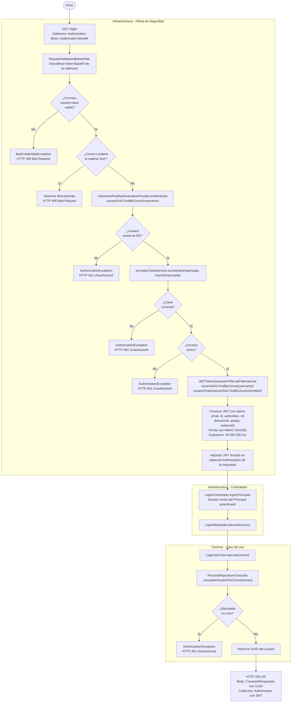

| Capa | Clase | Responsabilidad |
|------|-------|-----------------|
| Infraestructura — Filtro | `RequestValidationBeforeFilter` | Decodifica la cabecera Basic, valida el formato `usuario:clave` y rechaza correos de prueba |
| Infraestructura — Seguridad | `UsernamePwdAuthenticationProvider` | Verifica credenciales contra BD y construye el token de autenticación de Spring Security |
| Infraestructura — Filtro | `JWTTokenGeneratorFilter` | Genera y firma el JWT con claims organizacionales (rol, area, subarea, direccion) |
| Infraestructura — Controlador | `LoginControlador` | Extrae el correo del `Principal` autenticado y delega al manejador |
| Aplicación — Manejador | `LoginManejador` | Orquesta la llamada al caso de uso y encapsula la respuesta |
| Dominio — Caso de Uso | `LoginUseCase` | Valida la existencia del usuario por correo y retorna su UUID |
| Dominio — Puerto | `PersonaRepositorioConsulta` | Consulta el modelo de dominio `Usuario` por correo electrónico |

---

### 17.1.2 Guardar Usuario (Crear)

La creación de usuario atraviesa tres fábricas de aplicación que generan identificadores UUID únicos y resuelven tipos de catálogo antes de llegar al caso de uso. El servicio de autorización organizacional determina si el solicitante tiene acceso al área destino. La clave se almacena cifrada con BCrypt y el vínculo organizacional se persiste en `UsuarioOrganizacion` con el tipo de rama correspondiente (DIRECCION, AREA o SUBAREA).

```mermaid
flowchart TD
    INICIO([Inicio]) --> REQ

    subgraph HTTP["Infraestructura - HTTP y Seguridad"]
        REQ["POST /usuarios\nCabecera: Authorization JWT"]
        REQ --> JV["JWTTokenValidatorFilter\nValidar firma, expiracion y claims del JWT"]
        JV --> CV1{"¿JWT\nvalido?"}
        CV1 -- No --> ER1["BadCredentialsException\nHTTP 401 Unauthorized"]
        CV1 -- Si --> PERM["@PreAuthorize\nverificar autoridad: ADMINISTRADOR_DIRECCION_CREATE"]
        PERM --> CV2{"¿Tiene\npermisos?"}
        CV2 -- No --> ER2["AccessDeniedException\nHTTP 403 Forbidden"]
        CV2 -- Si --> CTRLG["UsuarioComandoControlador.guardar(UsuarioComando)"]
    end

    subgraph APLIC["Aplicacion - Manejador y Fabricas"]
        CTRLG --> MAN["GuardarUsuarioManejador.ejecutar(UsuarioComando)"]
        MAN --> FAB1["UsuarioFabrica.construir(comando)\nGenerar UUID unico para Usuario\nConsultar TipoUsuario por identificador"]
        FAB1 --> FAB2["PersonaFabrica.construir(comando)\nGenerar UUID unico para Persona\nDelegar construccion de Identificacion"]
        FAB2 --> FAB3["IdentificacionFabrica.construir(numero, tipoId)\nGenerar UUID unico para Identificacion\nConsultar TipoIdentificacion por identificador"]
        FAB3 --> AREA["Convertir area: textoAUUID(comando.getArea())\nConvertir tipoArea: TipoArea.valueOf(...)"]
    end

    subgraph UC["Dominio - Caso de Uso"]
        AREA --> AUT["AutorizacionContextoOrganizacionalServicio\n.validarAccesoAArea(areaId)\nVerificar contexto segun rol:\nADMIN_DIRECCION: acceso libre\nADMIN_AREA: acceso a su area con subareas o subarea asignada\nCOLABORADOR: acceso a su area con subareas o subarea asignada\nNota: ninguno excepto Admin Direccion accede a Direccion"]
        AUT --> CV3{"¿Tiene acceso\norganizacional?"}
        CV3 -- No --> ER3["AuthorizationException\nHTTP 403 Forbidden"]
        CV3 -- Si --> MOT1["MOTOR_USUARIO.ejecutar(usuario, CREAR)\nValidar: formato correo, patron clave\nlongitudes minimas y maximas"]
        MOT1 --> CV4{"¿Validaciones\nUsuario OK?"}
        CV4 -- No --> ER4["ValorInvalidoExcepcion\nHTTP 422"]
        CV4 -- Si --> MOT2["MOTOR_IDENTIFICACION.ejecutar(identificacion, CREAR)\nValidar: patron numero, longitud permitida"]
        MOT2 --> CV5{"¿Validaciones\nIdentificacion OK?"}
        CV5 -- No --> ER5["ValorInvalidoExcepcion\nHTTP 422"]
        CV5 -- Si --> MOT3["MOTOR_PERSONA.ejecutar(persona, CREAR)\nValidar: nombres, apellidos,\ncorreo, longitudes"]
        MOT3 --> CV6{"¿Validaciones\nPersona OK?"}
        CV6 -- No --> ER6["ValorInvalidoExcepcion\nHTTP 422"]
        CV6 -- Si --> DUP1["PersonaRepositorioConsulta\n.consultarUsuarioPorCorreo(correo)"]
        DUP1 --> CV7{"¿Correo ya\nregistrado?"}
        CV7 -- Si --> ER7["ValorDuplicadoExcepcion\nHTTP 409 Conflict"]
        CV7 -- No --> DUP2["PersonaRepositorioConsulta\n.consultarPersonaPorDocumento(numeroIdentificacion)"]
        DUP2 --> CV8{"¿Documento ya\nregistrado?"}
        CV8 -- Si --> ER8["ValorDuplicadoExcepcion\nHTTP 409 Conflict"]
        CV8 -- No --> ENC["EncriptarClaveServicio.ejecutar(clave)\nCifrar con BCrypt"]
        ENC --> REPO1["PersonaRepositorioComando\n.agregarNuevoUsuario(usuario, persona, claveHash)\nPersistir Persona + Usuario en BD"]
        REPO1 --> VINC["VincularUsuarioConAreaService.ejecutar\n(identificador, areaId, tipoArea)\nPersistir UsuarioOrganizacion segun rol:\nAdmin Direccion: vincularConDireccion\nAdmin Area: vincularConArea o vincularConSubarea\nColaborador: vincularConArea o vincularConSubarea\nNota: Admin Area y Colaborador NO se vinculan a Direccion"]
    end

    VINC --> RESP["HTTP 201 Created\nBody: ComandoRespuesta con UUID del nuevo usuario"]
```

| Capa | Clase | Responsabilidad |
|------|-------|-----------------|
| Infraestructura — Filtro | `JWTTokenValidatorFilter` | Valida firma, expiración y extrae claims del JWT al contexto de seguridad |
| Infraestructura — Controlador | `UsuarioComandoControlador` | Recibe el `UsuarioComando` y delega al manejador |
| Aplicación — Manejador | `GuardarUsuarioManejador` | Orquesta las tres fábricas y llama al caso de uso |
| Aplicación — Fábrica | `UsuarioFabrica` | Genera UUID único para `Usuario` y resuelve `TipoUsuario` |
| Aplicación — Fábrica | `PersonaFabrica` | Genera UUID único para `Persona` y coordina `IdentificacionFabrica` |
| Aplicación — Fábrica | `IdentificacionFabrica` | Genera UUID único para `Identificacion` y resuelve `TipoIdentificacion` |
| Dominio — Servicio | `AutorizacionContextoOrganizacionalServicio` | Valida que el usuario autenticado tenga acceso al área organizacional destino |
| Dominio — Motor | `MotoresFabrica.MOTOR_USUARIO` | Ejecuta reglas de validación del modelo `Usuario` para operación CREAR |
| Dominio — Motor | `MotoresFabrica.MOTOR_IDENTIFICACION` | Ejecuta reglas de validación del modelo `Identificacion` para operación CREAR |
| Dominio — Motor | `MotoresFabrica.MOTOR_PERSONA` | Ejecuta reglas de validación del modelo `Persona` para operación CREAR |
| Dominio — Caso de Uso | `GuardarUsuarioUseCase` | Orquesta autorización, validaciones, encriptación y persistencia |
| Dominio — Servicio | `EncriptarClaveServicio` | Cifra la clave con BCrypt antes de persistir |
| Dominio — Servicio | `VincularUsuarioConAreaService` | Crea el vínculo organizacional del usuario según el tipo de área |
| Dominio — Puerto | `PersonaRepositorioComando` | Persiste `Persona`, `Usuario` y `UsuarioOrganizacion` |

---

### 17.1.3 Modificar Usuario

La modificación recupera el estado actual del usuario desde la BD en la capa de fábricas para construir el objeto de actualización sin perder datos no editables (como la clave o el estado activo). Las validaciones de unicidad excluyen al propio usuario para permitir que mantenga su mismo correo o documento. El vínculo organizacional se reemplaza atómicamente al cambiar el área destino.

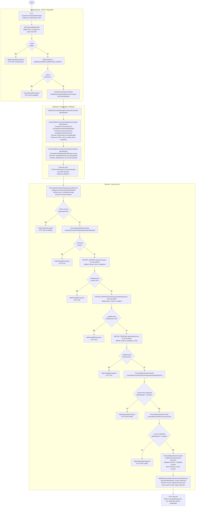

| Capa | Clase | Responsabilidad |
|------|-------|-----------------|
| Infraestructura — Filtro | `JWTTokenValidatorFilter` | Valida firma y claims del JWT |
| Infraestructura — Controlador | `UsuarioComandoControlador` | Recibe el comando y el identificador de ruta; delega al manejador |
| Aplicación — Manejador | `ModificarUsuarioManejador` | Coordina las fábricas de actualización y llama al caso de uso |
| Aplicación — Fábrica | `UsuarioFabrica` | Recupera datos actuales del `Usuario` y construye el objeto de actualización |
| Aplicación — Fábrica | `PersonaFabrica` | Recupera la `Identificacion` actual y construye el objeto de actualización |
| Dominio — Servicio | `AutorizacionContextoOrganizacionalServicio` | Valida acceso organizacional al usuario objetivo |
| Dominio — Motor | `MotoresFabrica.MOTOR_USUARIO/PERSONA/IDENTIFICACION` | Ejecuta reglas de validación de actualización sobre los respectivos modelos |
| Dominio — Caso de Uso | `ModificarUsuarioUseCase` | Orquesta validaciones de unicidad (excluyendo self) y persistencia |
| Dominio — Servicio | `ModificarVinculacionUsuarioConAreaService` | Reemplaza el vínculo organizacional del usuario |
| Dominio — Puerto | `PersonaRepositorioComando` | Persiste los cambios en `Persona` y `Usuario` |

---

### 17.1.4 Eliminar Usuario (Borrado Lógico)

El borrado de usuario es puramente lógico: el registro no se elimina físicamente de la base de datos; en cambio, la implementación del repositorio localiza la entidad `Usuario` por correo y establece `estaActivo = false` antes de persistirla. El servicio de autorización restringe esta operación exclusivamente al rol `ADMINISTRADOR_DIRECCION`.

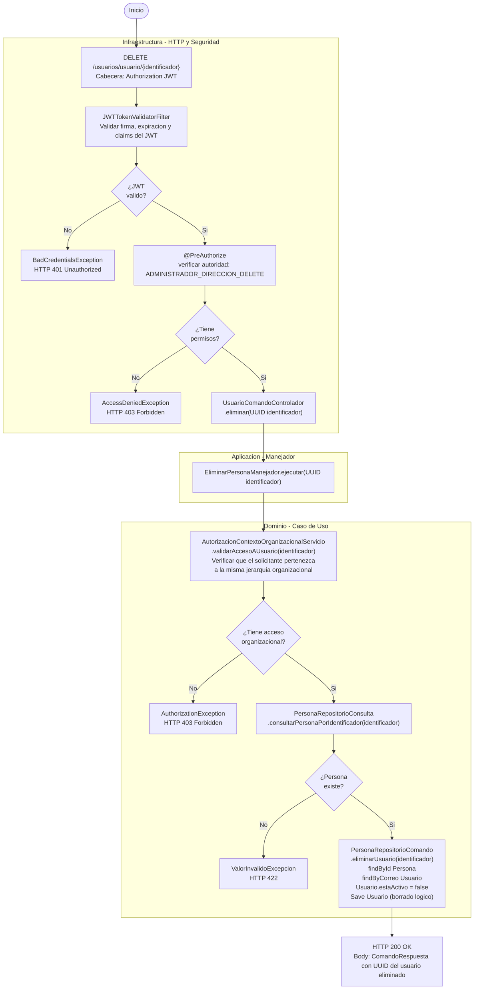

| Capa | Clase | Responsabilidad |
|------|-------|-----------------|
| Infraestructura — Filtro | `JWTTokenValidatorFilter` | Valida firma y claims del JWT |
| Infraestructura — Controlador | `UsuarioComandoControlador` | Extrae el `UUID` de ruta y delega al manejador |
| Aplicación — Manejador | `EliminarPersonaManejador` | Puente delgado: delega directamente al caso de uso sin transformación |
| Dominio — Servicio | `AutorizacionContextoOrganizacionalServicio` | Valida que el solicitante tenga acceso al usuario objetivo |
| Dominio — Caso de Uso | `EliminarUsuarioUseCase` | Valida existencia y ejecuta el borrado lógico |
| Dominio — Puerto | `PersonaRepositorioComando` | Implementa el borrado lógico: establece `estaActivo = false` y persiste |

---

### 17.1.5 Modificar Clave (Usuario Autenticado)

Esta operación permite a un usuario autenticado cambiar su propia clave, verificando primero la clave antigua contra el hash BCrypt almacenado. La secuencia de validaciones garantiza que la nueva clave sea diferente a la anterior, que el formato cumpla las reglas del dominio y que el valor se almacene siempre cifrado. El acceso organizacional restringe que un usuario solo pueda modificar su propia clave salvo los administradores.

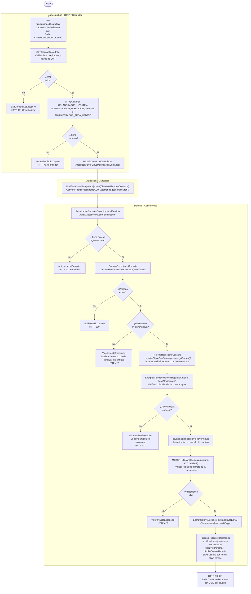

| Capa | Clase | Responsabilidad |
|------|-------|-----------------|
| Infraestructura — Filtro | `JWTTokenValidatorFilter` | Valida firma y claims del JWT |
| Infraestructura — Controlador | `UsuarioComandoControlador` | Recibe el `ClaveModificacionComando` y delega al manejador |
| Aplicación — Manejador | `ModificarClaveManejador` | Convierte el identificador de texto a `UUID` y delega al caso de uso |
| Dominio — Servicio | `AutorizacionContextoOrganizacionalServicio` | Valida que el solicitante tenga acceso al usuario objetivo |
| Dominio — Caso de Uso | `ModificarClaveUseCase` | Orquesta la verificación de clave antigua, validaciones de formato y encriptación |
| Dominio — Servicio | `EncriptarClaveServicio` | Verifica la clave antigua con `existe()` y cifra la nueva con `ejecutar()` |
| Dominio — Motor | `MotoresFabrica.MOTOR_USUARIO` | Valida las reglas de formato para la nueva clave (operación ACTUALIZAR) |
| Dominio — Puerto | `PersonaRepositorioConsulta` | Consulta la existencia de la persona y recupera el hash almacenado |
| Dominio — Puerto | `PersonaRepositorioComando` | Persiste el nuevo hash de clave en la entidad `Usuario` |

---

### 17.1.6 Solicitar Código de Recuperación

Este es el primer paso del flujo de recuperación de clave; opera sin JWT porque el usuario no puede autenticarse. El sistema genera un código alfanumérico de 6 caracteres a partir de un UUID aleatorio, lo cifra con BCrypt para su almacenamiento seguro, y lo envía en texto plano al correo registrado. La petición se persiste con marca temporal para permitir la validación de caducidad en el paso siguiente.

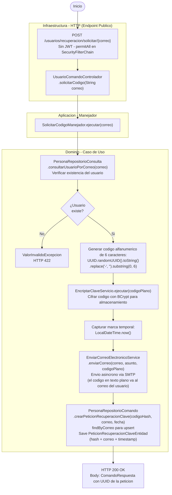

| Capa | Clase | Responsabilidad |
|------|-------|-----------------|
| Infraestructura — Controlador | `UsuarioComandoControlador` | Expone el endpoint público con el correo como parámetro de ruta |
| Aplicación — Manejador | `SolicitarCodigoManejador` | Delega directamente al caso de uso sin transformación adicional |
| Dominio — Caso de Uso | `SolicitarCodigoUseCase` | Genera el código, lo cifra, envía el correo y persiste la petición |
| Dominio — Servicio | `EncriptarClaveServicio` | Cifra el código alfanumérico con BCrypt antes de persistirlo |
| Dominio — Servicio | `EnviarCorreoElectronicoService` | Envía el código en texto plano al correo del usuario vía SMTP |
| Dominio — Puerto | `PersonaRepositorioConsulta` | Verifica la existencia del usuario por correo electrónico |
| Dominio — Puerto | `PersonaRepositorioComando` | Crea o actualiza la entidad `PeticionRecuperacionClaveEntidad` |

---

### 17.1.7 Validar Código de Recuperación

Este es el segundo paso del flujo de recuperación. Compara el código ingresado contra el hash BCrypt almacenado y verifica que la diferencia temporal entre la creación y el momento actual no supere los 5 minutos. Si ambas condiciones se cumplen, elimina la petición de la base de datos para garantizar que el código sea de un solo uso.

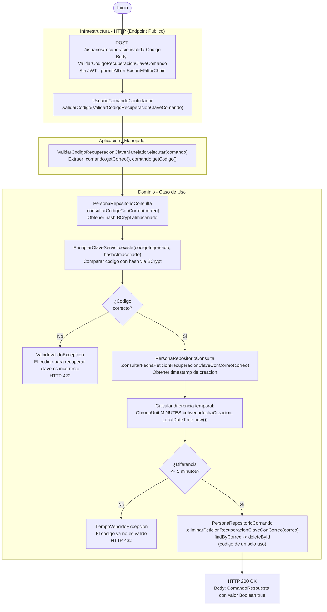

| Capa | Clase | Responsabilidad |
|------|-------|-----------------|
| Infraestructura — Controlador | `UsuarioComandoControlador` | Expone el endpoint público y recibe el comando de validación |
| Aplicación — Manejador | `ValidarCodigoRecuperacionClaveManejador` | Extrae correo y código del comando y delega al caso de uso |
| Dominio — Caso de Uso | `ValidarCodigoRecuperacionClaveUseCase` | Verifica el código BCrypt, valida la ventana de 5 minutos y elimina la petición |
| Dominio — Servicio | `EncriptarClaveServicio` | Compara el código ingresado con el hash almacenado mediante BCrypt |
| Dominio — Puerto | `PersonaRepositorioConsulta` | Consulta el hash almacenado y el timestamp de la petición de recuperación |
| Dominio — Puerto | `PersonaRepositorioComando` | Elimina la petición de recuperación tras la validación exitosa |

---

### 17.1.8 Recuperar Clave

Este es el tercer y último paso del flujo de recuperación. Opera sin JWT sobre el correo del usuario que ya fue validado en el paso anterior. El caso de uso carga la instancia del modelo de dominio `Usuario`, actualiza la clave en el modelo, aplica el motor de reglas de actualización y persiste el nuevo hash BCrypt directamente buscando por correo.

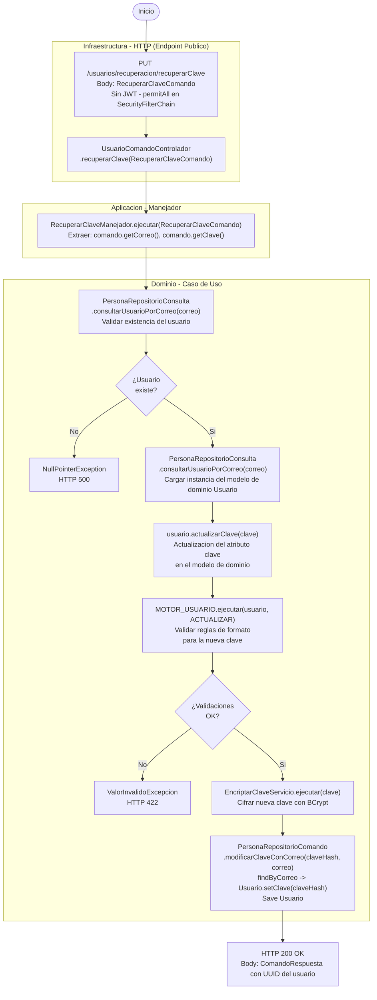

| Capa | Clase | Responsabilidad |
|------|-------|-----------------|
| Infraestructura — Controlador | `UsuarioComandoControlador` | Expone el endpoint público y recibe el comando de recuperación |
| Aplicación — Manejador | `RecuperarClaveManejador` | Extrae correo y clave nueva del comando y delega al caso de uso |
| Dominio — Caso de Uso | `RecuperarClaveUseCase` | Valida existencia, actualiza el modelo, aplica motor de reglas y persiste |
| Dominio — Motor | `MotoresFabrica.MOTOR_USUARIO` | Valida el formato de la nueva clave (operación ACTUALIZAR) |
| Dominio — Servicio | `EncriptarClaveServicio` | Cifra la nueva clave con BCrypt antes de persistirla |
| Dominio — Puerto | `PersonaRepositorioConsulta` | Verifica la existencia del usuario y carga su modelo de dominio |
| Dominio — Puerto | `PersonaRepositorioComando` | Persiste el nuevo hash de clave localizando al usuario por correo |

---

## 4. Configuración Estratégica y Organizacional

### 17.2.1 Guardar Acción

Registra una nueva acción estratégica en el sistema mediante una petición POST autenticada. La fábrica genera un identificador único (UUID) verificando que no exista colisión antes de delegar al caso de uso. El caso de uso valida las reglas de negocio del dominio y garantiza unicidad del detalle antes de persistir.

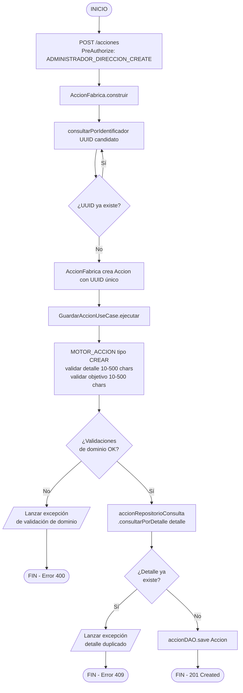

| Capa | Clase | Responsabilidad |
|---|---|---|
| Infraestructura (REST) | `AccionManejador` | Recibe HTTP POST, delega a fábrica y caso de uso |
| Dominio (Fábrica) | `AccionFabrica` | Genera UUID único y construye el objeto de dominio `Accion` |
| Dominio (Motor) | `MOTOR_ACCION` | Aplica reglas de validación sobre detalle y objetivo |
| Aplicación (UseCase) | `GuardarAccionUseCase` | Orquesta validación de unicidad y persistencia |
| Infraestructura (DAO) | `accionDAO` | Persiste la entidad `Accion` en la base de datos |

---

### 17.2.2 Modificar Acción

Actualiza los datos de una acción existente mediante petición PUT autenticada. La fábrica construye el objeto de actualización y el caso de uso verifica unicidad del detalle excluyendo el propio registro. Finalmente recupera la entidad gestionada por JPA y la guarda con los nuevos valores.

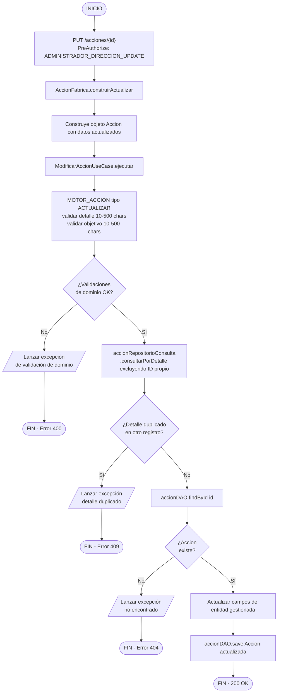

| Capa | Clase | Responsabilidad |
|---|---|---|
| Infraestructura (REST) | `AccionManejador` | Recibe HTTP PUT con ID y cuerpo, delega a fábrica y caso de uso |
| Dominio (Fábrica) | `AccionFabrica` | Construye el objeto `Accion` de actualización con los nuevos valores |
| Dominio (Motor) | `MOTOR_ACCION` | Valida las reglas de dominio sobre detalle y objetivo |
| Aplicación (UseCase) | `ModificarAccionUseCase` | Verifica existencia, unicidad excluyendo self, y guarda |
| Infraestructura (DAO) | `accionDAO` | Recupera y persiste la entidad `Accion` gestionada por JPA |

---

### 17.2.3 Guardar Proyecto

Registra un nuevo proyecto asociado a un conjunto de acciones estratégicas. La fábrica recupera las acciones por sus identificadores antes de construir el objeto de dominio. El caso de uso valida unicidad del número de proyecto y persiste en cascada las relaciones `ProyectoAccion`.

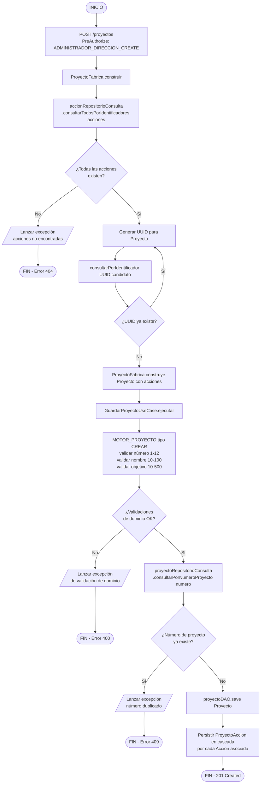

| Capa | Clase | Responsabilidad |
|---|---|---|
| Infraestructura (REST) | `ProyectoManejador` | Recibe HTTP POST, delega a fábrica y caso de uso |
| Dominio (Fábrica) | `ProyectoFabrica` | Consulta acciones, genera UUID y construye el objeto `Proyecto` |
| Dominio (Motor) | `MOTOR_PROYECTO` | Valida número, nombre y objetivo del proyecto |
| Aplicación (UseCase) | `GuardarProyectoUseCase` | Orquesta unicidad del número y persistencia con cascada |
| Infraestructura (DAO) | `proyectoDAO` | Persiste `Proyecto` y `ProyectoAccion` en cascada |

---

### 17.2.4 Modificar Proyecto

Actualiza los datos de un proyecto existente y sus acciones asociadas. El caso de uso verifica primero la existencia del registro, luego aplica validaciones de dominio y comprueba unicidad del número excluyendo el propio proyecto. La relación `ProyectoAccion` se actualiza mediante merge.

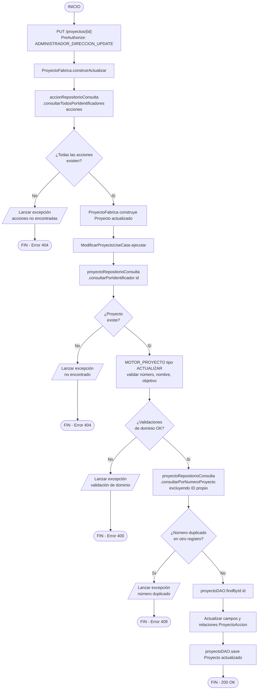

| Capa | Clase | Responsabilidad |
|---|---|---|
| Infraestructura (REST) | `ProyectoManejador` | Recibe HTTP PUT con ID y cuerpo, delega a fábrica y caso de uso |
| Dominio (Fábrica) | `ProyectoFabrica` | Carga acciones y construye el objeto `Proyecto` de actualización |
| Dominio (Motor) | `MOTOR_PROYECTO` | Valida número, nombre y objetivo |
| Aplicación (UseCase) | `ModificarProyectoUseCase` | Verifica existencia, unicidad del número y guarda |
| Infraestructura (DAO) | `proyectoDAO` | Recupera y persiste `Proyecto` con sus relaciones actualizadas |

---

### 17.2.5 Guardar Indicador

Registra un nuevo indicador de gestión asociando tipo, temporalidad, proyecto y públicos de interés. La fábrica realiza múltiples lookups de entidades relacionadas antes de construir el agregado. El caso de uso valida unicidad del nombre y persiste en cascada todas las relaciones del indicador.

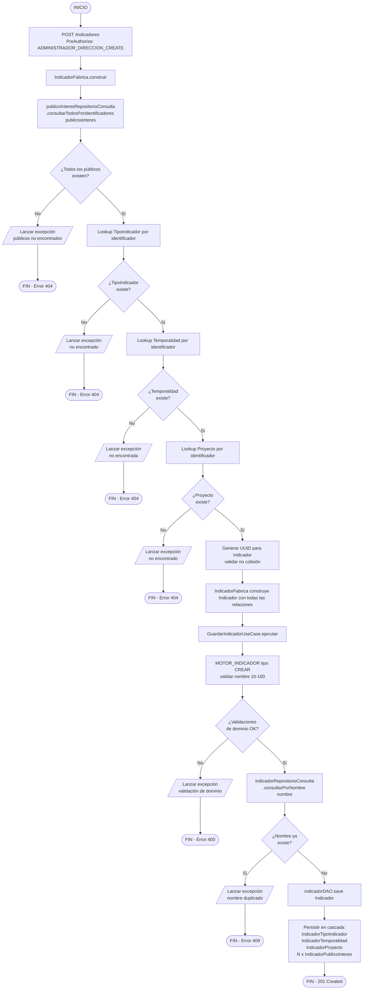

| Capa | Clase | Responsabilidad |
|---|---|---|
| Infraestructura (REST) | `IndicadorManejador` | Recibe HTTP POST y delega a fábrica y caso de uso |
| Dominio (Fábrica) | `IndicadorFabrica` | Resuelve entidades relacionadas, genera UUID y construye el agregado `Indicador` |
| Dominio (Motor) | `MOTOR_INDICADOR` | Valida el nombre del indicador según reglas de dominio |
| Aplicación (UseCase) | `GuardarIndicadorUseCase` | Verifica unicidad del nombre y persiste con todas las cascadas |
| Infraestructura (DAO) | `indicadorDAO` | Persiste `Indicador` y sus relaciones de asociación en cascada |

---

### 17.2.6 Modificar Indicador

Actualiza los datos de un indicador existente manteniendo la coherencia de sus relaciones. El caso de uso verifica la existencia del registro, aplica validaciones y comprueba unicidad del nombre excluyendo el propio indicador. La persistencia se realiza mediante merge para manejar las relaciones actualizadas.

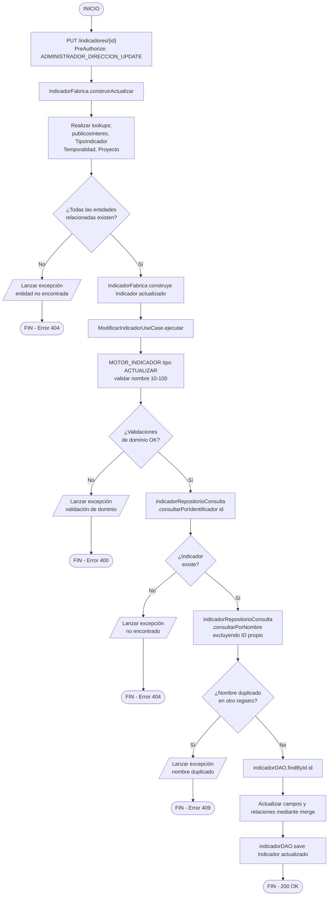

| Capa | Clase | Responsabilidad |
|---|---|---|
| Infraestructura (REST) | `IndicadorManejador` | Recibe HTTP PUT con ID y cuerpo, delega a fábrica y caso de uso |
| Dominio (Fábrica) | `IndicadorFabrica` | Resuelve entidades relacionadas y construye el objeto `Indicador` de actualización |
| Dominio (Motor) | `MOTOR_INDICADOR` | Valida las reglas de dominio sobre el nombre |
| Aplicación (UseCase) | `ModificarIndicadorUseCase` | Verifica existencia, unicidad del nombre excluyendo self y guarda con merge |
| Infraestructura (DAO) | `indicadorDAO` | Recupera y persiste el `Indicador` actualizado con sus relaciones |

---

## 5. Administración de Participantes

### 17.3.1 Carga Masiva de Estudiantes

Procesa un archivo Excel con múltiples registros de estudiantes aplicando una lógica de upsert por número de identificación. Para cada fila se determina si la ciudad de residencia ya existe o debe crearse, y si el estudiante es nuevo (INSERT) o ya existe (UPDATE). Cualquier error de formato o validación revierte la transacción completa.

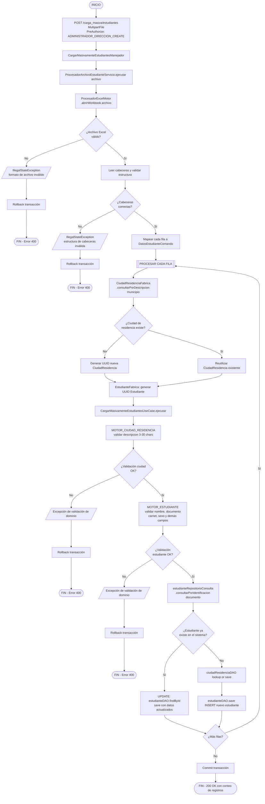

| Capa | Clase | Responsabilidad |
|---|---|---|
| Infraestructura (REST) | `CargarMasivamenteEstudiantesManejador` | Recibe MultipartFile y coordina el procesamiento |
| Infraestructura (Servicio) | `ProcesadorArchivoEstudianteServicio` | Invoca el motor de Excel y transforma filas en comandos |
| Infraestructura (Motor) | `ProcesadorExcelMotor` | Lee el workbook, valida cabeceras y mapea filas a `DatosEstudianteComando` |
| Dominio (Fábrica) | `CiudadResidenciaFabrica` | Busca ciudad existente o genera UUID para nueva ciudad |
| Dominio (Fábrica) | `EstudianteFabrica` | Genera UUID y construye el objeto de dominio `Estudiante` |
| Dominio (Motor) | `MOTOR_CIUDAD_RESIDENCIA` | Valida descripción de la ciudad |
| Dominio (Motor) | `MOTOR_ESTUDIANTE` | Valida todos los campos del estudiante |
| Aplicación (UseCase) | `CargarMasivamenteEstudiantesUseCase` | Aplica lógica upsert y orquesta persistencia |
| Infraestructura (DAO) | `estudianteDAO`, `ciudadResidenciaDAO` | Persisten o actualizan las entidades en la base de datos |

---

### 17.3.2 Carga Masiva de Empleados

Procesa un archivo Excel con registros de empleados aplicando upsert similar al de estudiantes, pero con la complejidad adicional de resolver tres entidades auxiliares: ciudad de residencia, relación laboral y centro de costos. Cada entidad auxiliar se crea si no existe, con sus propias validaciones de dominio. Cualquier error revierte la transacción completa.

```mermaid
flowchart TD
    A([INICIO]) --> B["POST /carga_masiva/empleados\nMultipartFile\nPreAuthorize: ADMINISTRADOR_DIRECCION_CREATE"]
    B --> C[CargarMasivamenteEmpleadosManejador]
    C --> D[ProcesadorArchivoEmpleadoServicio.ejecutar archivo]
    D --> E[ProcesadorExcelMotor\n.abrirWorkbook archivo]
    E --> F{¿Archivo Excel\nválido?}
    F -- No --> ERR0[/IllegalStateException\nformato inválido/]
    ERR0 --> ROLLBACK0[Rollback transacción]
    ROLLBACK0 --> Z0([FIN - Error 400])
    F -- Sí --> G[Leer cabeceras y mapear\nfilas a DatosEmpleadoComando]
    G --> H[[PROCESAR CADA FILA]]
    H --> I[CiudadResidenciaFabrica\n.consultarPorDescripcion municipio]
    I --> J{¿Ciudad\nexiste?}
    J -- No --> K[Generar UUID nueva CiudadResidencia]
    J -- Sí --> L[Reutilizar CiudadResidencia]
    K --> M[RelacionLaboralFabrica\n.consultarPorCodigo codigo]
    L --> M
    M --> N{¿RelacionLaboral\nexiste?}
    N -- No --> O[Generar UUID nueva RelacionLaboral\nvalidar codigo 2-4 chars\ndescripcion 5-20 chars]
    N -- Sí --> P[Reutilizar RelacionLaboral]
    O --> Q[CentroCostosFabrica\n.consultarPorCodigo codigo]
    P --> Q
    Q --> R{¿CentroCostos\nexiste?}
    R -- No --> S[Generar UUID nuevo CentroCostos\nvalidar codigo 4-6 chars\ndescripcion 3-100 chars]
    R -- Sí --> T[Reutilizar CentroCostos]
    S --> U[EmpleadoFabrica: generar UUID Empleado]
    T --> U
    U --> V[CargarMasivamenteEmpleadosUseCase.ejecutar]
    V --> W[MOTOR_CIUDAD_RESIDENCIA\nMOTOR_RELACION_LABORAL\nMOTOR_CENTRO_COSTOS\nMOTOR_EMPLEADO: validaciones]
    W --> X{¿Todas las\nvalidaciones OK?}
    X -- No --> ERR1[/Excepción de validación de dominio/]
    ERR1 --> ROLLBACK1[Rollback transacción]
    ROLLBACK1 --> Z1([FIN - Error 400])
    X -- Sí --> Y[empleadoRepositorioConsulta\n.consultarPorIdentificacion documento]
    Y --> Z{¿Empleado ya\nexiste?}
    Z -- Sí --> AA[UPDATE: empleadoDAO.findById\nsave con datos actualizados]
    Z -- No --> AB[ciudadResidenciaDAO lookup or save]
    AB --> AC[relacionLaboralDAO lookup or save]
    AC --> AD[centroCostosDAO lookup or save]
    AD --> AE[empleadoDAO.save INSERT nuevo empleado]
    AA --> NEXT{¿Más filas?}
    AE --> NEXT
    NEXT -- Sí --> H
    NEXT -- No --> AF[Commit transacción]
    AF --> AG([FIN - 200 OK con conteo de registros])
```

| Capa | Clase | Responsabilidad |
|---|---|---|
| Infraestructura (REST) | `CargarMasivamenteEmpleadosManejador` | Recibe MultipartFile y coordina el procesamiento |
| Infraestructura (Servicio) | `ProcesadorArchivoEmpleadoServicio` | Invoca el motor de Excel y transforma filas en comandos |
| Infraestructura (Motor) | `ProcesadorExcelMotor` | Lee el workbook y mapea filas a `DatosEmpleadoComando` |
| Dominio (Fábrica) | `CiudadResidenciaFabrica` | Busca ciudad existente o prepara nueva |
| Dominio (Fábrica) | `RelacionLaboralFabrica` | Busca relación laboral por código o prepara nueva |
| Dominio (Fábrica) | `CentroCostosFabrica` | Busca centro de costos por código o prepara nuevo |
| Dominio (Fábrica) | `EmpleadoFabrica` | Genera UUID y construye el objeto de dominio `Empleado` |
| Dominio (Motor) | `MOTOR_CIUDAD_RESIDENCIA`, `MOTOR_RELACION_LABORAL`, `MOTOR_CENTRO_COSTOS`, `MOTOR_EMPLEADO` | Validan cada entidad según reglas de dominio |
| Aplicación (UseCase) | `CargarMasivamenteEmpleadosUseCase` | Aplica lógica upsert y orquesta persistencia de todas las entidades |
| Infraestructura (DAO) | `empleadoDAO`, `ciudadResidenciaDAO`, `relacionLaboralDAO`, `centroCostosDAO` | Persisten o actualizan las entidades en la base de datos |

---

## 6. Ciclo de Vida de Actividades

### 17.4.0 Máquina de Estados (EjecuciónActividad)

El siguiente diagrama resume las transiciones de estado válidas para una `EjecucionActividad`. El estado inicial es siempre `PENDIENTE` al crear la actividad; desde `EN_CURSO` se puede avanzar a `FINALIZADA` o retroceder a `PENDIENTE` mediante cancelación.

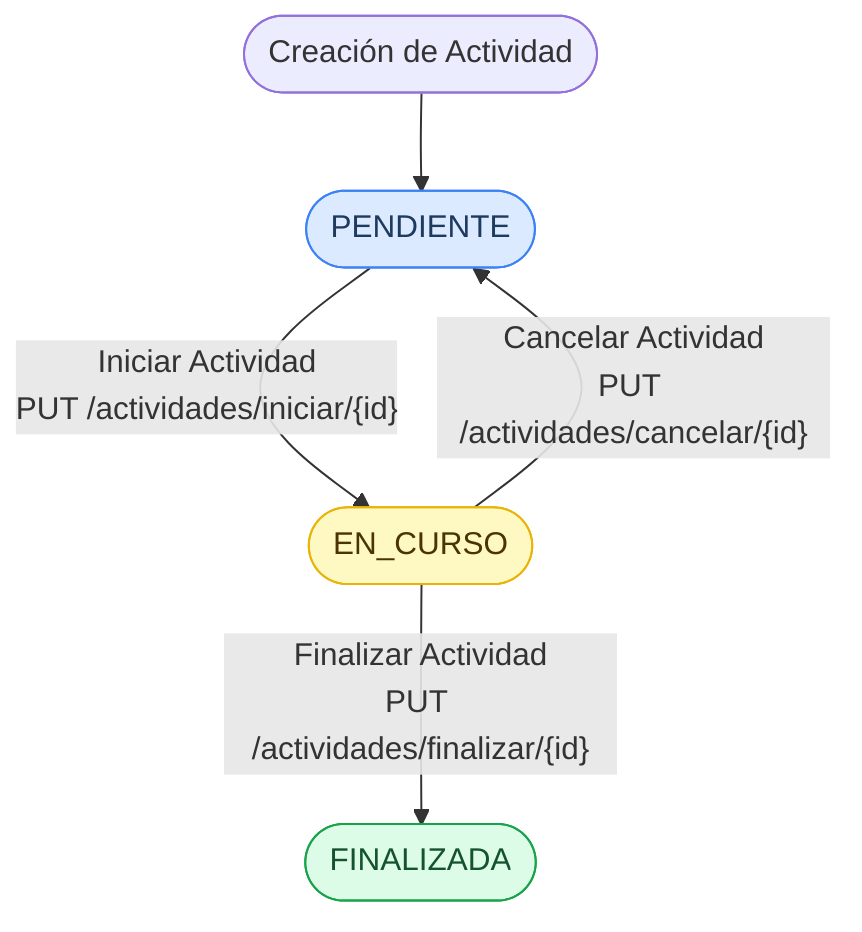

---

### 17.4.1 Guardar Actividad

Registra una nueva actividad de gestión con sus ejecuciones programadas, vinculándola al nodo organizacional del actor autenticado. La autorización organizacional verifica que el usuario tenga acceso al nodo indicado (DIRECCION, AREA o SUBAREA) antes de persistir. Se crean tantas `EjecucionActividad` en estado `PENDIENTE` como fechas se hayan proporcionado.

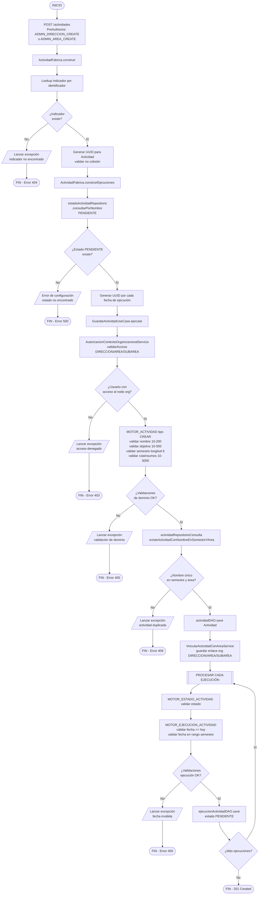

| Capa | Clase | Responsabilidad |
|---|---|---|
| Infraestructura (REST) | `ActividadManejador` | Recibe HTTP POST y delega a fábrica y caso de uso |
| Dominio (Fábrica) | `ActividadFabrica` | Resuelve Indicador, genera UUIDs y construye `Actividad` con sus `EjecucionActividad` |
| Dominio (Servicio) | `AutorizacionContextoOrganizacionalServicio` | Valida que el actor tenga acceso al nodo organizacional indicado |
| Dominio (Motor) | `MOTOR_ACTIVIDAD` | Valida nombre, objetivo, semestre y rutaInsumos |
| Dominio (Motor) | `MOTOR_EJECUCION_ACTIVIDAD` | Valida cada fecha de ejecución respecto a hoy y al rango del semestre |
| Aplicación (UseCase) | `GuardarActividadUseCase` | Orquesta autorización, unicidad, persistencia y vinculación organizacional |
| Dominio (Servicio) | `VincularActividadConAreaService` | Persiste el enlace entre la actividad y el nodo organizacional |
| Infraestructura (DAO) | `actividadDAO`, `ejecucionActividadDAO` | Persisten `Actividad` y cada `EjecucionActividad` |

---

### 17.4.2 Modificar Actividad

Actualiza los datos de una actividad existente, incluyendo su vinculación organizacional y sus ejecuciones programadas. El caso de uso primero valida acceso al nodo actual, luego al nuevo nodo, verifica unicidad de nombre excluyendo el propio registro y finalmente reemplaza la vinculación organizacional. Las ejecuciones se actualizan por lote mediante el mapeador.

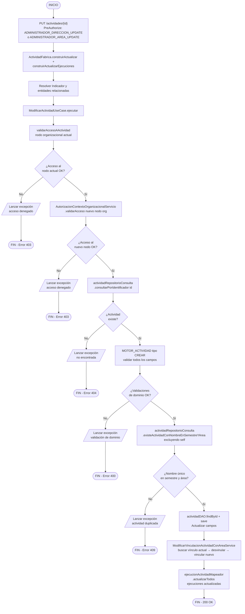

| Capa | Clase | Responsabilidad |
|---|---|---|
| Infraestructura (REST) | `ActividadManejador` | Recibe HTTP PUT con ID y cuerpo, delega a fábrica y caso de uso |
| Dominio (Fábrica) | `ActividadFabrica` | Construye objeto `Actividad` actualizado con sus ejecuciones |
| Dominio (Servicio) | `AutorizacionContextoOrganizacionalServicio` | Valida acceso al nodo organizacional actual y al nuevo |
| Dominio (Motor) | `MOTOR_ACTIVIDAD` | Valida campos de la actividad |
| Aplicación (UseCase) | `ModificarActividadUseCase` | Orquesta validación de acceso, unicidad, persistencia y cambio de vínculo |
| Dominio (Servicio) | `ModificarVinculacionActividadConAreaService` | Elimina el vínculo organizacional anterior y crea el nuevo |
| Infraestructura (Mapeador) | `ejecucionActividadMapeador` | Actualiza en lote las ejecuciones de actividad |
| Infraestructura (DAO) | `actividadDAO` | Recupera y persiste la entidad `Actividad` actualizada |

---

### 17.4.3 Iniciar Actividad

Cambia el estado de una `EjecucionActividad` de `PENDIENTE` a `EN_CURSO`, registrando la hora exacta de inicio. Antes de la transición valida que la ejecución exista y que efectivamente se encuentre en estado `PENDIENTE`. Disponible para colaboradores y administradores con permiso de actualización.

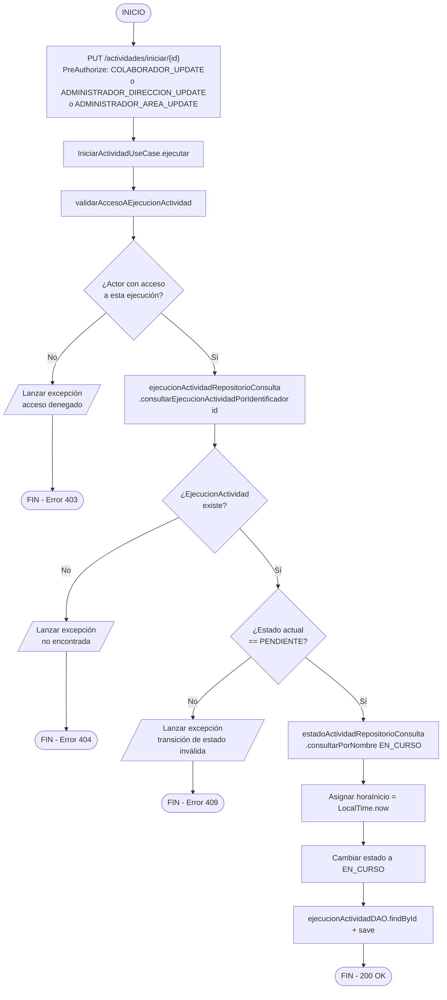

| Capa | Clase | Responsabilidad |
|---|---|---|
| Infraestructura (REST) | `ActividadManejador` | Recibe HTTP PUT al endpoint de inicio y delega al caso de uso |
| Dominio (Servicio) | `validarAccesoAEjecucionActividad` | Verifica que el actor autenticado tenga acceso a la ejecución |
| Aplicación (UseCase) | `IniciarActividadUseCase` | Valida estado `PENDIENTE`, registra hora de inicio y transiciona a `EN_CURSO` |
| Infraestructura (DAO) | `ejecucionActividadDAO` | Recupera la ejecución gestionada por JPA y persiste el cambio de estado |

---

### 17.4.4 Finalizar Actividad

Cierra una `EjecucionActividad` en estado `EN_CURSO` registrando fecha y hora de finalización, y persiste la lista completa de participantes con sus registros de asistencia. Para cada participante la fábrica determina si existe un `Miembro` previo (interno o externo) y si existe un `Participante` en el semestre para evitar duplicados. Si el participante es nuevo, se insertan tanto el `Participante` como su `RegistroAsistencia`.

```mermaid
flowchart TD
    A([INICIO]) --> B["PUT /actividades/finalizar/{id}\nBody: List ParticipanteComando\nPreAuthorize: COLABORADOR_UPDATE\no ADMINISTRADOR_DIRECCION_UPDATE\no ADMINISTRADOR_AREA_UPDATE"]
    B --> C[ParticipanteFabrica.construirParticipantes]
    C --> D[[CONSTRUIR CADA PARTICIPANTE]]
    D --> E[participanteRepositorioConsulta\n.consultarPorDocumentoYSemestre]
    E --> F{¿Participante\nexiste en semestre?}
    F -- Sí --> G[Reutilizar Participante existente]
    F -- No --> H{¿Participante\nexterno?}
    H -- Sí --> I[Generar UUID Miembro externo]
    H -- No --> J[miembroRepositorioConsulta\n.consultarPorIdentificacion]
    J --> K{¿Miembro\ninterno encontrado?}
    K -- Sí --> L[Vincular Miembro interno existente]
    K -- No --> M[Error de referencia de miembro]
    I --> N[Generar UUID Participante nuevo]
    L --> N
    G --> NEXT_P{¿Más participantes?}
    N --> NEXT_P
    NEXT_P -- Sí --> D
    NEXT_P -- No --> O[FinalizarActividadUseCase.ejecutar]
    O --> P[validarAccesoAEjecucionActividad]
    P --> Q{¿Actor con\nacceso?}
    Q -- No --> ERR0[/Lanzar excepción\nacceso denegado/]
    ERR0 --> Z0([FIN - Error 403])
    Q -- Sí --> R[ejecucionActividadRepositorioConsulta\n.consultarEjecucionActividadPorIdentificador]
    R --> S{¿EjecucionActividad\nexiste?}
    S -- No --> ERR1[/Lanzar excepción\nno encontrada/]
    ERR1 --> Z1([FIN - Error 404])
    S -- Sí --> T{¿Estado actual\n== EN_CURSO?}
    T -- No --> ERR2[/Lanzar excepción\ntransición de estado inválida/]
    ERR2 --> Z2([FIN - Error 409])
    T -- Sí --> U[estadoActividadRepositorioConsulta\n.consultarPorNombre FINALIZADA]
    U --> V[Asignar fechaRealizacion = LocalDate.now\nAsignar horaFin = LocalTime.now]
    V --> W[Cambiar estado a FINALIZADA]
    W --> X[ejecucionActividadDAO.findById + save]
    X --> Y[[PROCESAR CADA PARTICIPANTE]]
    Y --> Z3[RegistrarParticipanteService\n.consultarPorDocumentoMiembro]
    Z3 --> AA{¿Participante\nya registrado?}
    AA -- No --> AB[participanteDAO.save nuevo Participante]
    AA -- Sí --> AC[Reutilizar Participante registrado]
    AB --> AD[Generar UUID RegistroAsistencia]
    AC --> AD
    AD --> AE[registroAsistenciaRepositorioComando.guardar]
    AE --> AF{¿Más participantes?}
    AF -- Sí --> Y
    AF -- No --> AG([FIN - 200 OK])
```

| Capa | Clase | Responsabilidad |
|---|---|---|
| Infraestructura (REST) | `ActividadManejador` | Recibe HTTP PUT con lista de participantes y delega a fábrica y caso de uso |
| Dominio (Fábrica) | `ParticipanteFabrica` | Resuelve o genera cada `Participante` y su `Miembro` (interno o externo) |
| Dominio (Servicio) | `validarAccesoAEjecucionActividad` | Verifica que el actor autenticado tenga acceso a la ejecución |
| Aplicación (UseCase) | `FinalizarActividadUseCase` | Valida estado `EN_CURSO`, registra cierre y orquesta la persistencia de participantes |
| Dominio (Servicio) | `RegistrarParticipanteService` | Verifica si el participante existe y lo persiste si es nuevo |
| Infraestructura (DAO) | `ejecucionActividadDAO` | Persiste el cambio de estado a `FINALIZADA` con fechas y hora |
| Infraestructura (DAO) | `participanteDAO` | Persiste nuevos participantes evitando duplicados |
| Infraestructura (DAO) | `registroAsistenciaRepositorioComando` | Persiste el registro de asistencia de cada participante |

---

### 17.4.5 Cancelar Actividad

Revierte el estado de una `EjecucionActividad` de `EN_CURSO` de vuelta a `PENDIENTE`, efectuando un rollback del inicio de la actividad. Valida que la ejecución exista y que esté en estado `EN_CURSO` antes de ejecutar la transición inversa. No elimina datos; simplemente restablece el estado para permitir un nuevo inicio posterior.

```mermaid
flowchart TD
    A([INICIO]) --> B["PUT /actividades/cancelar/{id}\nPreAuthorize: COLABORADOR_UPDATE\no ADMINISTRADOR_DIRECCION_UPDATE\no ADMINISTRADOR_AREA_UPDATE"]
    B --> C[CancelarActividadUseCase.ejecutar]
    C --> D[validarAccesoAEjecucionActividad]
    D --> E{¿Actor con\nacceso?}
    E -- No --> ERR0[/Lanzar excepción\nacceso denegado/]
    ERR0 --> Z0([FIN - Error 403])
    E -- Sí --> F[ejecucionActividadRepositorioConsulta\n.consultarEjecucionActividadPorIdentificador id]
    F --> G{¿EjecucionActividad\nexiste?}
    G -- No --> ERR1[/Lanzar excepción\nno encontrada/]
    ERR1 --> Z1([FIN - Error 404])
    G -- Sí --> H{¿Estado actual\n== EN_CURSO?}
    H -- No --> ERR2[/Lanzar excepción\ntransición de estado inválida/]
    ERR2 --> Z2([FIN - Error 409])
    H -- Sí --> I[estadoActividadRepositorioConsulta\n.consultarPorNombre PENDIENTE]
    I --> J[Cambiar estado a PENDIENTE rollback de inicio]
    J --> K[ejecucionActividadDAO.findById + save]
    K --> L([FIN - 200 OK])
```

| Capa | Clase | Responsabilidad |
|---|---|---|
| Infraestructura (REST) | `ActividadManejador` | Recibe HTTP PUT al endpoint de cancelación y delega al caso de uso |
| Dominio (Servicio) | `validarAccesoAEjecucionActividad` | Verifica que el actor autenticado tenga acceso a la ejecución |
| Aplicación (UseCase) | `CancelarActividadUseCase` | Valida estado `EN_CURSO` y ejecuta la transición de retorno a `PENDIENTE` |
| Infraestructura (DAO) | `ejecucionActividadDAO` | Recupera la ejecución gestionada por JPA y persiste el cambio de estado |

---

## 7. Análisis Transversal de Flujos

### 7.1 Patrones Arquitectónicos Recurrentes

| Patrón | Descripción | Operaciones que lo Aplican |
|--------|-------------|---------------------------|
| **Generación UUID con anti-colisión** | Las fábricas generan UUIDs y consultan el repositorio para verificar que no exista colisión antes de asignar | Guardar Usuario, Guardar Acción, Guardar Proyecto, Guardar Indicador, Guardar Actividad |
| **Motor de validación por tipo de operación** | `MotoresFabrica` ejecuta reglas de validación según `TipoOperacion.CREAR` o `TipoOperacion.ACTUALIZAR` | Todas las operaciones CRUD |
| **Autorización organizacional contextual** | `AutorizacionContextoOrganizacionalServicio` valida acceso según la jerarquía DIRECCION → AREA → SUBAREA | Guardar/Modificar/Eliminar Usuario, Guardar/Modificar Actividad, Iniciar/Finalizar/Cancelar Actividad |
| **Vinculación organizacional atómica** | Los servicios `VincularXConAreaService` y `ModificarVinculacionXConAreaService` gestionan el enlace entre entidades y nodos organizacionales | Guardar/Modificar Usuario, Guardar/Modificar Actividad |
| **Validación de unicidad excluyendo self** | En operaciones de modificación, las consultas de duplicados excluyen el registro propio por UUID | Modificar Usuario, Modificar Acción, Modificar Proyecto, Modificar Indicador, Modificar Actividad |
| **Upsert por identificación** | Las cargas masivas determinan INSERT o UPDATE según si el documento de identificación ya existe en el sistema | Carga Masiva Estudiantes, Carga Masiva Empleados |
| **Transacción atómica con rollback total** | `@Transactional` en la interfaz del manejador garantiza que cualquier excepción revierta todos los cambios | Todas las operaciones de comando |

### 7.2 Modelo de Seguridad por Capas

```
┌─────────────────────────────────────────────┐
│ Capa 1: Filtro JWT (JWTTokenValidatorFilter) │
│   → Validación de firma HMAC-SHA256         │
│   → Verificación de expiración              │
│   → Extracción de claims al SecurityContext  │
├─────────────────────────────────────────────┤
│ Capa 2: Autorización por Rol (@PreAuthorize) │
│   → ADMINISTRADOR_DIRECCION_*               │
│   → ADMINISTRADOR_AREA_*                    │
│   → COLABORADOR_*                           │
├─────────────────────────────────────────────┤
│ Capa 3: Autorización Organizacional         │
│   → AutorizacionContextoOrganizacionalServ. │
│   → Validación de acceso a área/dirección   │
│   → Restricción jerárquica por nodo org.    │
├─────────────────────────────────────────────┤
│ Capa 4: Validación de Dominio (Motores)     │
│   → Reglas de formato y longitud            │
│   → Unicidad de campos clave                │
│   → Integridad referencial de dominio       │
└─────────────────────────────────────────────┘
```

### 7.3 Mapa de Códigos HTTP por Tipo de Error

| Código HTTP | Tipo de Error | Ejemplo en Flujos |
|-------------|--------------|-------------------|
| **400** | Formato de entrada inválido / Archivo Excel malformado | Login (formato Basic), Carga Masiva (cabeceras incorrectas) |
| **401** | Credenciales incorrectas / JWT inválido o expirado | Login, cualquier endpoint protegido |
| **403** | Permisos insuficientes (rol o contexto organizacional) | Guardar/Modificar/Eliminar Usuario, CRUD Actividades |
| **404** | Entidad referenciada no encontrada | Modificar Acción/Proyecto/Indicador, Finalizar Actividad |
| **409** | Conflicto de unicidad (duplicado) o transición de estado inválida | Guardar con campo duplicado, Iniciar actividad ya en curso |
| **422** | Regla de validación de dominio violada | Longitudes fuera de rango, formato de clave incorrecto |
| **500** | Error no controlado (NullPointerException en flujos de recuperación) | Recuperar Clave cuando usuario no existe |

---

## 8. Glosario Técnico

| Término | Definición |
|---------|-----------|
| **BCrypt** | Función de hash adaptativa para cifrado de claves y códigos; utilizada por `EncriptarClaveServicio` |
| **CQRS** | Command Query Responsibility Segregation — separación de las operaciones de lectura (consulta) y escritura (comando) |
| **DAO** | Data Access Object — interfaz JPA para operaciones de persistencia en la capa de infraestructura |
| **JWT** | JSON Web Token — token de autenticación firmado con HMAC-SHA256 que porta claims de identidad y rol |
| **Motor** | Componente de dominio (`MotoresFabrica`) que encapsula un conjunto de reglas de validación por modelo y tipo de operación |
| **Nodo Organizacional** | Punto en la jerarquía DIRECCION → AREA → SUBAREA que determina el alcance de acceso de un usuario |
| **Puerto** | Interfaz de dominio que define el contrato de acceso a datos; implementada en la capa de infraestructura |
| **Upsert** | Operación que inserta un nuevo registro si no existe o actualiza el existente, determinado por clave de negocio |
| **UUID** | Universally Unique Identifier — identificador de 128 bits generado por las fábricas con verificación anti-colisión |

---

## 9. Índice de Operaciones

| # | Operación | Sección | Método HTTP | Endpoint | Requiere JWT |
|---|-----------|---------|-------------|----------|-------------|
| 1 | Login | 17.1.1 | GET | `/login` | No (Basic Auth) |
| 2 | Guardar Usuario | 17.1.2 | POST | `/usuarios` | Sí |
| 3 | Modificar Usuario | 17.1.3 | PUT | `/usuarios/usuario/{id}` | Sí |
| 4 | Eliminar Usuario | 17.1.4 | DELETE | `/usuarios/usuario/{id}` | Sí |
| 5 | Modificar Clave | 17.1.5 | PUT | `/usuarios/modificar/clave` | Sí |
| 6 | Solicitar Código | 17.1.6 | POST | `/usuarios/recuperacion/solicitar/{correo}` | No |
| 7 | Validar Código | 17.1.7 | POST | `/usuarios/recuperacion/validarCodigo` | No |
| 8 | Recuperar Clave | 17.1.8 | PUT | `/usuarios/recuperacion/recuperarClave` | No |
| 9 | Guardar Acción | 17.2.1 | POST | `/acciones` | Sí |
| 10 | Modificar Acción | 17.2.2 | PUT | `/acciones/{id}` | Sí |
| 11 | Guardar Proyecto | 17.2.3 | POST | `/proyectos` | Sí |
| 12 | Modificar Proyecto | 17.2.4 | PUT | `/proyectos/{id}` | Sí |
| 13 | Guardar Indicador | 17.2.5 | POST | `/indicadores` | Sí |
| 14 | Modificar Indicador | 17.2.6 | PUT | `/indicadores/{id}` | Sí |
| 15 | Carga Masiva Estudiantes | 17.3.1 | POST | `/carga_masiva/estudiantes` | Sí |
| 16 | Carga Masiva Empleados | 17.3.2 | POST | `/carga_masiva/empleados` | Sí |
| 17 | Guardar Actividad | 17.4.1 | POST | `/actividades` | Sí |
| 18 | Modificar Actividad | 17.4.2 | PUT | `/actividades/{id}` | Sí |
| 19 | Iniciar Actividad | 17.4.3 | PUT | `/actividades/iniciar/{id}` | Sí |
| 20 | Finalizar Actividad | 17.4.4 | PUT | `/actividades/finalizar/{id}` | Sí |
| 21 | Cancelar Actividad | 17.4.5 | PUT | `/actividades/cancelar/{id}` | Sí |
