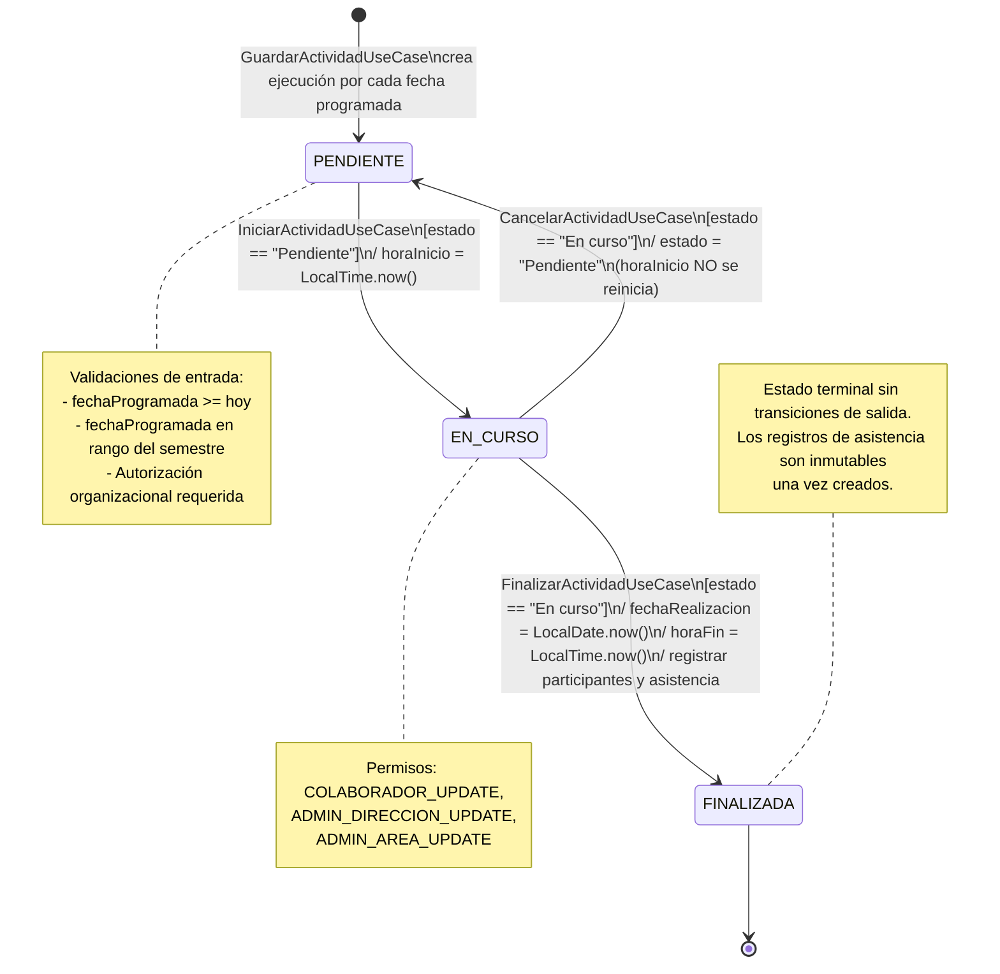
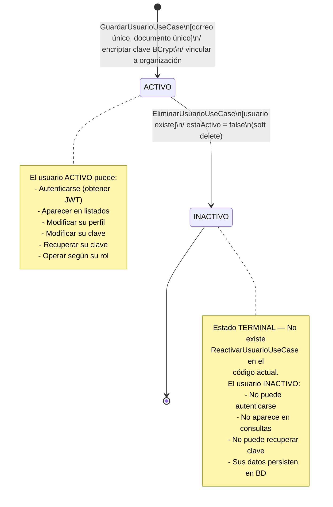
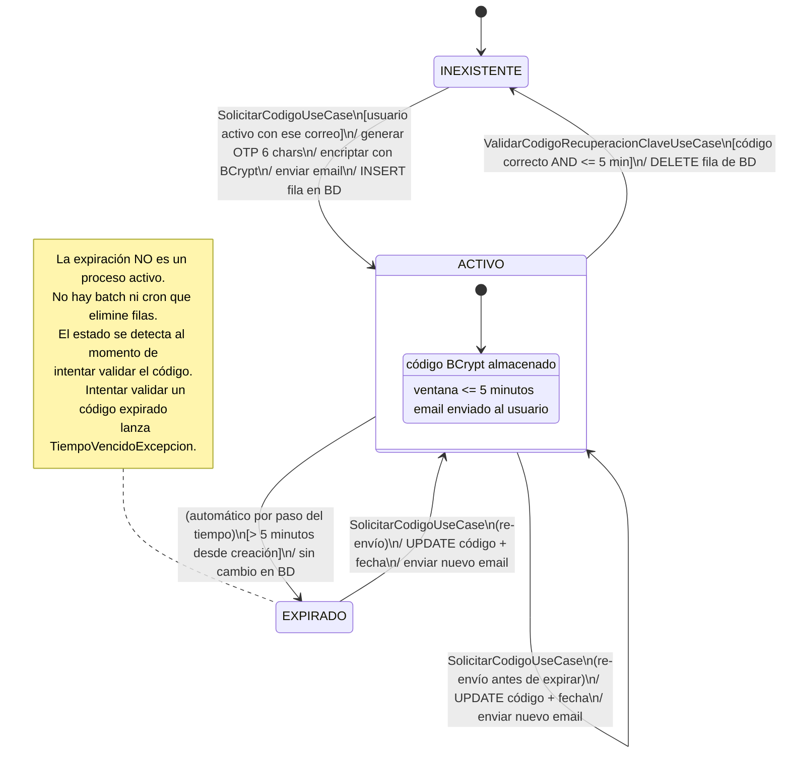
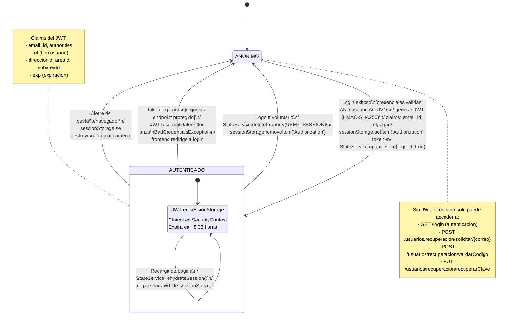
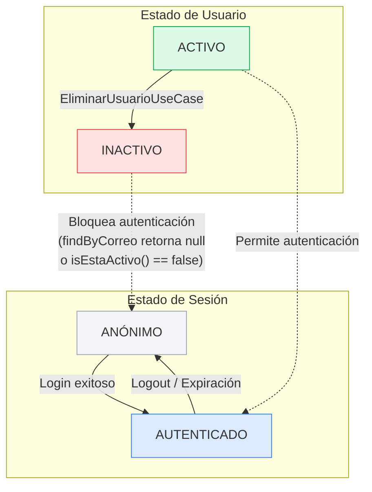
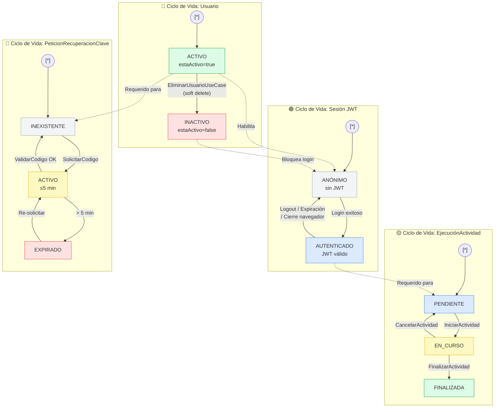

# Flujo de Estados en Diagramas de Estado — SIBE

---

## Resumen General

| Entidades con Ciclo de Vida | Total de Estados | Total de Transiciones | Estado General |
| --------------------------- | ---------------- | --------------------- | -------------- |
| 4                           | 11               | 12                    | Completado     |

---

## 1. Descripción del Artefacto

Este artefacto documenta los **diagramas de estado** (UML State Machine Diagrams) de todas las entidades del sistema SIBE (Sistema de Información de Bienestar y Evangelización) que poseen un **ciclo de vida con estados discretos**. A diferencia del artefacto 17 que traza flujos de transacciones (actividades), este artefacto modela el **comportamiento reactivo** de cada entidad a lo largo del tiempo: cómo responde a eventos externos y bajo qué condiciones transiciona entre estados.

Cada diagrama de estado incluye:

- **Estados**: condiciones estables en las que la entidad permanece hasta recibir un evento.
- **Transiciones**: cambios de un estado a otro provocados por un disparador.
- **Guardas (guards)**: condiciones booleanas que deben cumplirse para que la transición se ejecute.
- **Acciones**: efectos secundarios que se ejecutan durante la transición (cambios en campos, persistencia, notificaciones).
- **Estado inicial y estados terminales**: puntos de entrada y finales del ciclo de vida.

---

## 2. Metodología y Convenciones

### 2.1 Notación Utilizada

Los diagramas emplean la sintaxis **Mermaid `stateDiagram-v2`**, que es el estándar para máquinas de estado en documentación técnica renderizable.

| Elemento | Sintaxis Mermaid | Significado |
|----------|-----------------|-------------|
| `[*] --> Estado` | Pseudoestado inicial | Punto de entrada al ciclo de vida |
| `Estado --> [*]` | Estado terminal | Punto de finalización sin transiciones de salida |
| `EstadoA --> EstadoB` | Transición | Cambio de estado provocado por un evento |
| `EstadoA --> EstadoB : evento` | Transición rotulada | Transición con el disparador que la causa |
| `state Estado { }` | Estado compuesto | Estado que contiene subestados internos |
| `note right of Estado` | Nota | Información adicional sobre un estado |

### 2.2 Convención de Documentación por Entidad

Cada entidad con ciclo de vida se documenta con:

1. **Ficha técnica**: ubicación en el código fuente (capa, clase, tabla BD).
2. **Catálogo de estados**: lista exhaustiva con nombre lógico, valor en código y campo de almacenamiento.
3. **Diagrama de estado Mermaid**: representación visual completa con `stateDiagram-v2`.
4. **Tabla de transiciones**: formato estructurado con disparador, guarda, acción y campos afectados.
5. **Efectos colaterales del estado**: cómo el estado actual de la entidad afecta el comportamiento de otras operaciones.

### 2.3 Clasificación de Entidades

| Categoría | Criterio | Entidades |
|-----------|----------|-----------|
| **Con ciclo de vida** | Poseen campo(s) de estado y transiciones explícitas entre valores discretos | `EjecucionActividad`, `Usuario`, `PeticionRecuperacionClave`, `Sesión de Usuario (JWT)` |
| **Sin ciclo de vida** | Entidades puramente descriptivas sin transiciones de estado | `Actividad`, `Proyecto`, `Indicador`, `Accion`, `Participante`, `RegistroAsistencia`, `UsuarioOrganizacion`, `EstadoActividad` (lookup), `TipoUsuario` (lookup) |

---

## 3. EjecucionActividad — Ciclo de Vida de Ejecución

### 3.1 Ficha Técnica

| Aspecto | Detalle |
|---------|---------|
| **Modelo de dominio** | `co.edu.uco.sibe.dominio.modelo.EjecucionActividad` |
| **Objeto estado** | `co.edu.uco.sibe.dominio.modelo.EstadoActividad` (entidad separada con UUID + nombre) |
| **Entidad JPA** | `EjecucionActividadEntidad` → tabla `ejecucion_actividad` |
| **Relación con estado** | `EjecucionActividadEstadoActividadEntidad` → tabla `ejecucion_actividad_estado_actividad` (`@OneToOne`, `CascadeType.ALL`) |
| **Tabla lookup** | `estado_actividad` (id + nombre) — pre-sembrada por `EstadoActividadDataLoader` al iniciar la aplicación |
| **Constantes** | `DatoConstante.PENDIENTE = "Pendiente"`, `DatoConstante.EN_CURSO = "En curso"`, `DatoConstante.FINALIZADA = "Finalizada"` |
| **Tipo de almacenamiento** | No es enum Java; es entidad de BD con lookup por nombre |

### 3.2 Catálogo de Estados

| Estado | Valor Exacto en Código | Constante | Descripción |
|--------|----------------------|-----------|-------------|
| **PENDIENTE** | `"Pendiente"` | `DatoConstante.PENDIENTE` | Estado inicial al crear una ejecución. La actividad está programada pero no ha comenzado. |
| **EN_CURSO** | `"En curso"` | `DatoConstante.EN_CURSO` | La actividad se está ejecutando activamente. Se registró la hora de inicio. |
| **FINALIZADA** | `"Finalizada"` | `DatoConstante.FINALIZADA` | La actividad completó su ejecución. Se registraron fecha de realización, hora de fin y participantes. |

### 3.3 Diagrama de Estado



### 3.4 Tabla de Transiciones

| ID | Origen | Destino | Disparador | Guarda | Acciones | Campos Afectados |
|----|--------|---------|-----------|--------|----------|-----------------|
| T1 | `[inicial]` | PENDIENTE | `GuardarActividadUseCase.ejecutar()` via `ActividadFabrica.construirEjecuciones()` | `fechaProgramada >= hoy` AND `fecha en rango semestre` AND `autorizacionServicio.validarAcceso()` | Persistir `EjecucionActividad` con estado "Pendiente" via `actividadRepositorioComando.guardarEjecucion()` | `fechaProgramada`, `estado` ← "Pendiente" |
| T2 | PENDIENTE | EN_CURSO | `IniciarActividadUseCase.ejecutar(UUID idEjecucion)` | `estado.getNombre().equals("Pendiente")` — si no: `InvalidOperationException("Solo se puede iniciar una actividad en estado pendiente.")` AND `autorizacionServicio.validarAccesoAEjecucionActividad(id)` | `ejecucion.actualizarHoraInicio(LocalTime.now())` → `ejecucion.actualizarEstado(EN_CURSO)` → `actividadRepositorioComando.modificarEjecucion(ejecucion)` | `horaInicio` ← `LocalTime.now()`, `estado` ← "En curso" |
| T3 | EN_CURSO | FINALIZADA | `FinalizarActividadUseCase.ejecutar(UUID idEjecucion, List<Participante>)` | `estado.getNombre().equals("En curso")` — si no: `InvalidOperationException` AND `autorizacionServicio.validarAccesoAEjecucionActividad(id)` | 1. `ejecucion.actualizarFechaRealizacion(LocalDate.now())` 2. `ejecucion.actualizarHoraFin(LocalTime.now())` 3. `ejecucion.actualizarEstado(FINALIZADA)` 4. `modificarEjecucion()` 5. Por cada participante: `registrarParticipanteService.ejecutar()` + `registroAsistenciaRepositorioComando.guardar()` | `fechaRealizacion` ← hoy, `horaFin` ← ahora, `estado` ← "Finalizada", filas creadas en `registro_asistencia` |
| T4 | EN_CURSO | PENDIENTE | `CancelarActividadUseCase.ejecutar(UUID idEjecucion)` | `estado.getNombre().equals("En curso")` — si no: `InvalidOperationException("Solo se puede cancelar una actividad en estado en curso.")` | `ejecucion.actualizarEstado(PENDIENTE)` → `actividadRepositorioComando.modificarEjecucion(ejecucion)` | `estado` ← "Pendiente" (**`horaInicio` NO se reinicia** — conserva el valor del inicio anterior) |

### 3.5 Efectos Colaterales del Estado

| Estado Actual | Efecto en Otras Operaciones |
|---------------|---------------------------|
| **PENDIENTE** | `ModificarActividadUseCase` puede actualizar `fechaProgramada` (validando que sea ≥ hoy). Las ejecuciones en estado pendiente son candidatas para inicio. |
| **EN_CURSO** | No se puede modificar la fecha programada. La ejecución está bloqueada para edición de datos temporales. Solo se permite finalizar o cancelar. |
| **FINALIZADA** | La ejecución es de solo lectura. Los registros de asistencia asociados son inmutables. No existe operación para revertir una finalización. |

---

## 4. Usuario — Ciclo de Vida de Activación

### 4.1 Ficha Técnica

| Aspecto | Detalle |
|---------|---------|
| **Modelo de dominio** | `co.edu.uco.sibe.dominio.modelo.Usuario` |
| **Entidad JPA** | `UsuarioEntidad` → tabla `usuario`, columna `esta_activo` (boolean) |
| **Casos de uso** | `GuardarUsuarioUseCase` (creación), `EliminarUsuarioUseCase` (desactivación) |
| **Tipo de almacenamiento** | Campo booleano `estaActivo` en la tabla `usuario` |
| **Filtro de consulta** | `PersonaRepositorioConsultaImplementacion` filtra usuarios inactivos retornando `null` |

### 4.2 Catálogo de Estados

| Estado | Valor en Código | Campo BD | Descripción |
|--------|---------------|----------|-------------|
| **ACTIVO** | `estaActivo = true` | `usuario.esta_activo = true` | El usuario puede autenticarse, operar y ser visible en consultas. |
| **INACTIVO** | `estaActivo = false` | `usuario.esta_activo = false` | Borrado lógico. El usuario es invisible para el sistema pero su data persiste en BD. |

### 4.3 Diagrama de Estado



### 4.4 Tabla de Transiciones

| ID | Origen | Destino | Disparador | Guarda | Acciones | Campos Afectados |
|----|--------|---------|-----------|--------|----------|-----------------|
| T1 | `[inicial]` | ACTIVO | `GuardarUsuarioUseCase.ejecutar(Usuario, Persona, UUID area, TipoArea)` | Correo no existente AND documento no existente AND validaciones `MOTOR_USUARIO`, `MOTOR_IDENTIFICACION`, `MOTOR_PERSONA` con `TipoOperacion.CREAR` AND `autorizacionServicio.validarAccesoAArea(areaId)` | 1. `encriptarClaveServicio.ejecutar(clave)` → hash BCrypt 2. `personaRepositorioComando.agregarNuevoUsuario(usuario, persona, claveHash)` 3. `vincularUsuarioConAreaService.ejecutar(id, areaId, tipoArea)` | `estaActivo` ← `true`, `clave` ← hash BCrypt, fila en `usuario_organizacion` |
| T2 | ACTIVO | INACTIVO | `EliminarUsuarioUseCase.ejecutar(UUID identificador)` | `personaRepositorioConsulta.consultarPersonaPorIdentificador(id)` ≠ null — si es null: `ValorInvalidoExcepcion("No existe usuario con identificador...")` AND `autorizacionServicio.validarAccesoAUsuario(id)` AND `@PreAuthorize ADMINISTRADOR_DIRECCION_DELETE` | `usuarioEntidad.setEstaActivo(false)` → `usuarioDAO.save(usuarioEntidad)` — **NO borra la fila** | `esta_activo` ← `false` |

### 4.5 Efectos Colaterales del Estado INACTIVO

El estado INACTIVO tiene un efecto de cascada silenciosa sobre múltiples operaciones del sistema, implementado mediante un patrón de filtro en la capa de repositorio:

```java
// Patrón aplicado en TODOS los métodos de PersonaRepositorioConsultaImplementacion:
var usuarioEntidad = usuarioDAO.findByCorreo(entidad.getCorreo());
if (!usuarioEntidad.isEstaActivo()) {
    return null;  // Usuario inactivo es tratado como inexistente
}
```

| Operación Afectada | Comportamiento con Usuario INACTIVO |
|--------------------|-------------------------------------|
| **Login** | `UsernamePwdAuthenticationProvider` → `findByCorreo` retorna entidad pero `isEstaActivo() == false` → lanza `AuthorizationException` |
| **Consultas de usuario** | `consultarUsuarioPorCorreo()`, `consultarPersonaPorIdentificador()` → retornan `null` → el usuario es invisible |
| **Modificar clave** | `consultarPersonaPorIdentificador()` retorna `null` → `NullPointerException` |
| **Solicitar código de recuperación** | `consultarUsuarioPorCorreo()` retorna `null` → `ValorInvalidoExcepcion` |
| **Modificar usuario** | `consultarPersonaPorIdentificador()` retorna `null` → `ValorInvalidoExcepcion` |

---

## 5. PeticionRecuperacionClave — Ciclo de Vida de Solicitud OTP

### 5.1 Ficha Técnica

| Aspecto | Detalle |
|---------|---------|
| **Entidad JPA** | `PeticionRecuperacionClaveEntidad` → tabla `peticion_recuperacion_clave` |
| **Campos** | `identificador` (UUID), `codigo` (hash BCrypt del OTP), `correo` (String), `fecha` (LocalDateTime) |
| **Casos de uso** | `SolicitarCodigoUseCase` (creación), `ValidarCodigoRecuperacionClaveUseCase` (validación y eliminación) |
| **Tipo de almacenamiento** | **Sin campo de estado explícito**. Los estados se derivan de la existencia de la fila y la relación temporal entre `fecha` y el momento actual. |
| **Ventana de validez** | 5 minutos desde la creación (`ChronoUnit.MINUTES.between(fecha, now) <= 5`) |

### 5.2 Catálogo de Estados

| Estado | Condición en BD | Descripción |
|--------|----------------|-------------|
| **INEXISTENTE** | No hay fila en `peticion_recuperacion_clave` para ese correo | No hay solicitud activa de recuperación. Estado inicial y final. |
| **ACTIVO** | Fila presente AND `ChronoUnit.MINUTES.between(fecha, LocalDateTime.now()) <= 5` | El código OTP es válido para ser verificado. Ventana de 5 minutos activa. |
| **EXPIRADO** | Fila presente AND `ChronoUnit.MINUTES.between(fecha, LocalDateTime.now()) > 5` | El código OTP ha caducado. La fila permanece en BD pero ya no es utilizable. |

### 5.3 Diagrama de Estado



### 5.4 Tabla de Transiciones

| ID | Origen | Destino | Disparador | Guarda | Acciones | Campos Afectados |
|----|--------|---------|-----------|--------|----------|-----------------|
| T1 | INEXISTENTE | ACTIVO | `SolicitarCodigoUseCase.ejecutar(correo)` | `consultarUsuarioPorCorreo(correo)` ≠ null (usuario activo) | 1. Generar código: `UUID.randomUUID().toString().replace("-","").substring(0,6)` 2. `encriptarClaveServicio.ejecutar(codigo)` → hash BCrypt 3. `enviarCorreoElectronicoService.enviarCorreo(correo, asunto, codigoPlano)` 4. `personaRepositorioComando.crearPeticionRecuperacionClave(hash, correo, LocalDateTime.now())` — INSERT | `codigo` ← hash BCrypt, `correo` ← email, `fecha` ← ahora |
| T2 | ACTIVO | INEXISTENTE | `ValidarCodigoRecuperacionClaveUseCase.ejecutar(correo, codigo)` | `encriptarClaveServicio.existe(codigo, codigoCifrado) == true` AND `ChronoUnit.MINUTES.between(fecha, now) <= 5` — si código incorrecto: `ValorInvalidoExcepcion` — si tiempo > 5 min: `TiempoVencidoExcepcion` | `peticionRecuperacionClaveDAO.deleteById(entidad.getIdentificador())` — fila eliminada de BD | Fila completa eliminada |
| T3 | ACTIVO | EXPIRADO | *(Automático por paso del tiempo)* | `ChronoUnit.MINUTES.between(fecha, now) > 5` | Ninguna acción en BD. La expiración se detecta lazily al intentar validar. | Sin cambios en BD |
| T4 | EXPIRADO | ACTIVO | `SolicitarCodigoUseCase.ejecutar(correo)` (re-envío) | `consultarUsuarioPorCorreo(correo)` ≠ null | Misma secuencia que T1, pero como la fila ya existe para ese correo, se ejecuta UPDATE en lugar de INSERT | `codigo` ← nuevo hash, `fecha` ← ahora (se reinicia la ventana) |
| T5 | ACTIVO | ACTIVO | `SolicitarCodigoUseCase.ejecutar(correo)` (re-envío antes de expirar) | `consultarUsuarioPorCorreo(correo)` ≠ null | UPDATE del código y fecha. El código anterior queda invalidado. | `codigo` ← nuevo hash, `fecha` ← ahora |

### 5.5 Efectos Colaterales del Estado

| Estado | Efecto |
|--------|--------|
| **INEXISTENTE** | `ValidarCodigoRecuperacionClaveUseCase` falla al intentar consultar el hash almacenado — lanza excepción. El flujo de `RecuperarClaveUseCase` (paso 3) no tiene guarda contra la ausencia de petición previa. |
| **ACTIVO** | Único estado en el que `ValidarCodigoRecuperacionClaveUseCase` puede retornar `true`. Una vez validado exitosamente, la fila se elimina y el cliente procede al paso 3 (cambiar clave). |
| **EXPIRADO** | `ValidarCodigoRecuperacionClaveUseCase` lanza `TiempoVencidoExcepcion`. La fila permanece en BD indefinidamente hasta que el usuario re-solicite un código (lo cual la sobreescribe). |

---

## 6. Sesión de Usuario (JWT) — Ciclo de Vida de Autenticación

### 6.1 Ficha Técnica

| Aspecto | Detalle |
|---------|---------|
| **Backend — Generación** | `JWTTokenGeneratorFilter` (filtro de Spring Security en cadena de autenticación) |
| **Backend — Validación** | `JWTTokenValidatorFilter` (filtro de Spring Security en cadena de solicitudes protegidas) |
| **Frontend — Modelo** | `src/app/feature/login/model/user-session.model.ts` → interfaz `UserSession` |
| **Frontend — Servicio de estado** | `src/app/shared/service/state.service.ts` → `StateService` (BehaviorSubject reactivo) |
| **Almacenamiento en cliente** | `sessionStorage['Authorization']` (token JWT Bearer) |
| **Algoritmo de firma** | HMAC-SHA256 (clave simétrica compartida) |
| **Expiración del token** | `now + 30,000,000 ms` ≈ 8.33 horas |

### 6.2 Catálogo de Estados

| Estado | Condición | `UserSession.logged` |
|--------|-----------|---------------------|
| **ANÓNIMO** | No hay JWT válido en `sessionStorage`. No hay token en el `SecurityContext` del backend. | `false` (o inexistente) |
| **AUTENTICADO** | JWT válido presente en `sessionStorage` y reenviado en cada petición HTTP. Claims disponibles en el `SecurityContext`. | `true` |

### 6.3 Diagrama de Estado



### 6.4 Tabla de Transiciones

| ID | Origen | Destino | Disparador | Guarda | Acciones | Artefactos Afectados |
|----|--------|---------|-----------|--------|----------|---------------------|
| T1 | ANÓNIMO | AUTENTICADO | `GET /login` con cabecera `Authorization: Basic <base64>` | `RequestValidationBeforeFilter`: formato válido AND correo no contiene "test" → `UsernamePwdAuthenticationProvider`: usuario existe AND clave correcta AND `estaActivo == true` | **Backend:** `JWTTokenGeneratorFilter` genera JWT con claims organizacionales → adjunta en cabecera `Authorization` de respuesta. **Frontend:** `StateService.updateState(USER_SESSION, {logged: true, ...claims})` → `sessionStorage.setItem('Authorization', token)` | `sessionStorage`, `SecurityContext`, `StateService.state$` BehaviorSubject |
| T2 | AUTENTICADO | ANÓNIMO | Logout voluntario (acción del usuario en el frontend) | Ninguna | `StateService.deleteProperty(USER_SESSION)` → `sessionStorage.removeItem('Authorization')` → redirección a pantalla de login | `sessionStorage` vaciado, `StateService` reiniciado |
| T3 | AUTENTICADO | ANÓNIMO | Solicitud HTTP a endpoint protegido con token expirado | `JWTTokenValidatorFilter` detecta `exp < now` | Backend lanza `BadCredentialsException` → HTTP 401 → frontend intercepta respuesta 401 → redirige a login | `SecurityContext` no se establece, frontend limpia estado local |
| T4 | AUTENTICADO | ANÓNIMO | Cierre de pestaña o navegador | Implícito por el comportamiento de `sessionStorage` | `sessionStorage` se destruye automáticamente al cerrar la pestaña/ventana (comportamiento estándar del navegador) | Todo el estado de sesión perdido |
| T5 | AUTENTICADO | AUTENTICADO | Recarga de página (F5 / navegación) | JWT presente y parseable en `sessionStorage` | `StateService.rehydrateSession()` → re-parsea el JWT almacenado → restaura el estado del `BehaviorSubject` | `StateService.state$` restaurado |

### 6.5 Interacción con el Estado de Usuario

El ciclo de vida de la sesión JWT está **directamente acoplado** al estado de `Usuario`:



| Escenario | Resultado |
|-----------|-----------|
| Usuario ACTIVO intenta login con credenciales correctas | → AUTENTICADO |
| Usuario INACTIVO intenta login | → Permanece ANÓNIMO (`AuthorizationException`) |
| Usuario AUTENTICADO es desactivado mientras tiene sesión activa | → Continúa AUTENTICADO hasta que el JWT expire o se intente una operación que requiera re-verificación. **El JWT ya emitido sigue siendo válido.** |

---

## 7. Diagrama de Estado Compuesto del Sistema

El siguiente diagrama integra los cuatro ciclos de vida en una vista unificada que muestra sus interdependencias:



### 7.1 Dependencias entre Ciclos de Vida

| Ciclo de Vida Dependiente | Depende de | Tipo de Dependencia | Descripción |
|--------------------------|-----------|---------------------|-------------|
| Sesión JWT | Usuario | **Prerequisito** | Solo un Usuario en estado ACTIVO puede transicionar una Sesión de ANÓNIMO a AUTENTICADO |
| EjecucionActividad | Sesión JWT | **Prerequisito** | Todas las transiciones de estado de EjecucionActividad requieren un JWT válido (estado AUTENTICADO) |
| EjecucionActividad | Usuario | **Autorización** | El usuario autenticado debe tener acceso organizacional a la ejecución para poder transicionarla |
| PeticionRecuperacionClave | Usuario | **Prerequisito parcial** | Solo un Usuario ACTIVO puede solicitar un código OTP; pero la solicitud opera SIN JWT (endpoint público) |

---

## 8. Entidades Sin Ciclo de Vida Stateful

Las entidades no poseen campos de estado ni transiciones entre valores discretos. Se incluyen para completitud y trazabilidad de la evaluación.

| Entidad | Razón de Exclusión |
|---------|-------------------|
| `Actividad` | Entidad puramente descriptiva (nombre, objetivo, semestre, fechaCreacion). Su "estado" se deriva del estado de sus `EjecucionActividad` hijas, no de un campo propio. |
| `Proyecto` | Solo datos descriptivos (numeroProyecto, nombre, objetivo, lista de acciones). Sin campo de estado. |
| `Indicador` | Solo datos descriptivos (naturaleza, tipología, nombre). Sin campo de estado. |
| `Accion` | Solo datos descriptivos (detalle, objetivo). Sin campo de estado. |
| `Participante` / `ParticipanteInterno` / `ParticipanteExterno` | Entidades de registro creadas ad-hoc durante `FinalizarActividadUseCase`. Sin transiciones posteriores. |
| `RegistroAsistencia` | Registro inmutable creado en `FinalizarActividadUseCase`. No se actualiza ni elimina una vez creado. |
| `UsuarioOrganizacion` | Representa la vinculación usuario ↔ nodo organizacional. Se crea al guardar usuario, se reemplaza atómicamente al modificar. Sin estados discretos. |
| `EstadoActividad` | Es el **objeto estado** en sí mismo (lookup table: id + nombre). Contiene los valores posibles pero no tiene ciclo de vida propio. |
| `TipoUsuario` | Lookup table de catálogo. Valores pre-sembrados. Sin transiciones. |
| `TipoIdentificacion` | Lookup table de catálogo. Valores estáticos. |
| `CiudadResidencia` | Entidad auxiliar creada bajo demanda en cargas masivas. Sin campo de estado. |
| `RelacionLaboral` | Entidad auxiliar creada bajo demanda. Sin campo de estado. |
| `CentroCostos` | Entidad auxiliar creada bajo demanda. Sin campo de estado. |

---

## 9. Matriz Consolidada de Estados y Transiciones

### 9.1 Todos los Estados del Sistema

| # | Entidad | Estado | Tipo | Persistencia |
|---|---------|--------|------|-------------|
| 1 | EjecucionActividad | PENDIENTE | Inicial | Tabla pivot `ejecucion_actividad_estado_actividad` → FK a `estado_actividad` |
| 2 | EjecucionActividad | EN_CURSO | Intermedio | Tabla pivot (misma) |
| 3 | EjecucionActividad | FINALIZADA | Terminal | Tabla pivot (misma) |
| 4 | Usuario | ACTIVO | Inicial | Columna `usuario.esta_activo = true` |
| 5 | Usuario | INACTIVO | Terminal | Columna `usuario.esta_activo = false` |
| 6 | PeticionRecuperacionClave | INEXISTENTE | Inicial / Terminal | Ausencia de fila en BD |
| 7 | PeticionRecuperacionClave | ACTIVO | Intermedio | Fila presente + `fecha` dentro de ventana de 5 min |
| 8 | PeticionRecuperacionClave | EXPIRADO | Intermedio (recuperable) | Fila presente + `fecha` fuera de ventana |
| 9 | Sesión JWT | ANÓNIMO | Inicial | Ausencia de token en `sessionStorage` |
| 10 | Sesión JWT | AUTENTICADO | Intermedio | Token JWT en `sessionStorage` + `StateService.state$` |
| 11 | — | — | — | — |

### 9.2 Todas las Transiciones del Sistema

| # | Entidad | Origen | Destino | Disparador | Reversible |
|---|---------|--------|---------|-----------|------------|
| 1 | EjecucionActividad | [inicial] | PENDIENTE | `GuardarActividadUseCase` | — |
| 2 | EjecucionActividad | PENDIENTE | EN_CURSO | `IniciarActividadUseCase` | Sí (via cancelación) |
| 3 | EjecucionActividad | EN_CURSO | FINALIZADA | `FinalizarActividadUseCase` | No |
| 4 | EjecucionActividad | EN_CURSO | PENDIENTE | `CancelarActividadUseCase` | Sí (puede reiniciarse) |
| 5 | Usuario | [inicial] | ACTIVO | `GuardarUsuarioUseCase` | — |
| 6 | Usuario | ACTIVO | INACTIVO | `EliminarUsuarioUseCase` | No (sin reactivación) |
| 7 | PeticionRecuperacionClave | INEXISTENTE | ACTIVO | `SolicitarCodigoUseCase` | — |
| 8 | PeticionRecuperacionClave | ACTIVO | INEXISTENTE | `ValidarCodigoRecuperacionClaveUseCase` | — |
| 9 | PeticionRecuperacionClave | ACTIVO | EXPIRADO | (automático por tiempo) | Sí (re-solicitar) |
| 10 | PeticionRecuperacionClave | EXPIRADO | ACTIVO | `SolicitarCodigoUseCase` (re-envío) | — |
| 11 | Sesión JWT | ANÓNIMO | AUTENTICADO | Login exitoso | — |
| 12 | Sesión JWT | AUTENTICADO | ANÓNIMO | Logout / Expiración / Cierre | — |

---

## 10. Glosario Técnico

| Término | Definición |
|---------|-----------|
| **Estado (State)** | Condición estable en la que una entidad permanece hasta recibir un evento que provoque una transición. |
| **Transición** | Cambio de un estado a otro provocado por un disparador y condicionado por una guarda. |
| **Guarda (Guard)** | Condición booleana que debe evaluarse como verdadera para que una transición se ejecute. |
| **Disparador (Trigger)** | Evento o acción que inicia una transición. En SIBE corresponde a la invocación de un caso de uso. |
| **Estado Terminal** | Estado sin transiciones de salida. La entidad permanece en este estado indefinidamente. |
| **Estado Inicial** | Pseudoestado que indica el punto de entrada al ciclo de vida de una entidad. |
| **Soft Delete** | Patrón de borrado lógico donde el registro no se elimina físicamente sino que se marca como inactivo. |
| **OTP** | One-Time Password — código alfanumérico de un solo uso generado para la recuperación de clave. |
| **JWT** | JSON Web Token — token de autenticación firmado que porta claims de identidad, rol y organización. |
| **Lazy Expiration** | Patrón donde la expiración no se ejecuta activamente sino que se detecta al momento de la consulta. |
| **Lookup Table** | Tabla de base de datos con valores pre-sembrados que sirve como catálogo de referencia. |
