# 21. Arquitectura de Referencia

## 1. Propósito y Alcance

Este documento describe la arquitectura de referencia del sistema SIBE (Sistema de Información de Bienestar y Evangelización), sirviendo como guía técnica autoritativa para comprender, mantener y evolucionar la solución. Está construido a partir del análisis exhaustivo del código fuente (backend y frontend) y de los artefactos de documentación del proyecto.

**Audiencia:** Arquitectos de software, desarrolladores, equipo de operaciones, auditores técnicos y stakeholders con interés en la estructura técnica del sistema.

**Alcance:** Cubre las vistas arquitectónicas (contexto, contenedores, componentes, datos, seguridad, despliegue), las decisiones arquitectónicas implementadas, los atributos de calidad medibles, las restricciones técnicas y los riesgos arquitectónicos identificados.

---

## 2. Contexto del Sistema

### 2.1 Descripción General

SIBE es una aplicación web diseñada para digitalizar la gestión de actividades y asistencia de la Dirección de Bienestar y Evangelización de la Universidad Católica de Oriente (UCO). Reemplaza procesos manuales basados en planillas de papel, Google Forms, CheckPoint y AccuClass.

### 2.2 Diagrama de Contexto (C4 — Nivel 0)

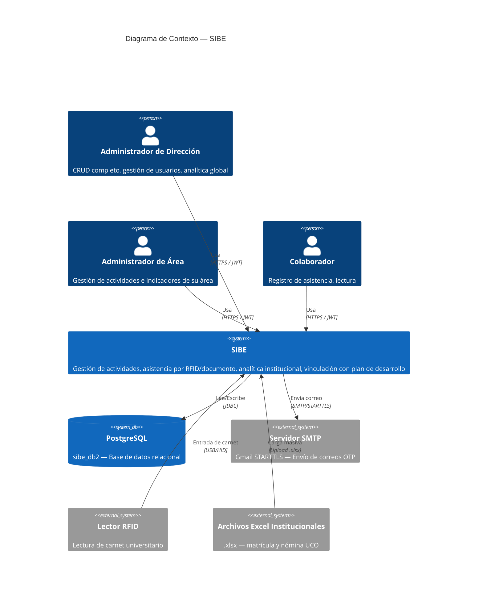
```mermaid
C4Context
    title Diagrama de Contexto — SIBE

    Person(adminDir, "Administrador de Dirección", "CRUD completo, gestión de usuarios, analítica global")
    Person(adminArea, "Administrador de Área", "Gestión de actividades e indicadores de su área")
    Person(colab, "Colaborador", "Registro de asistencia, lectura")

    System(sibe, "SIBE", "Gestión de actividades, asistencia por RFID/documento, analítica institucional, vinculación con plan de desarrollo")

    SystemDb(postgres, "PostgreSQL", "sibe_db2 — Base de datos relacional")
    System_Ext(smtp, "Servidor SMTP", "Gmail STARTTLS — Envío de correos OTP")
    System_Ext(rfid, "Lector RFID", "Lectura de carnet universitario")
    System_Ext(excel, "Archivos Excel Institucionales", ".xlsx — matrícula y nómina UCO")

    Rel(adminDir, sibe, "Usa", "HTTPS / JWT")
    Rel(adminArea, sibe, "Usa", "HTTPS / JWT")
    Rel(colab, sibe, "Usa", "HTTPS / JWT")
    Rel(sibe, postgres, "Lee/Escribe", "JDBC")
    Rel(sibe, smtp, "Envía correo", "SMTP/STARTTLS")
    Rel(rfid, sibe, "Entrada de carnet", "USB/HID")
    Rel(excel, sibe, "Carga masiva", "Upload .xlsx")
```

### 2.3 Stakeholders y Roles del Sistema

| Rol | Alcance | Permisos |
|-----|---------|----------|
| **Administrador de Dirección** | Acceso completo a todas las áreas y subáreas | CRUD completo + gestión de usuarios + analítica global |
| **Administrador de Área** | Restringido a su área/subárea asignada | Crear/leer/actualizar actividades e indicadores de su área |
| **Colaborador** | Operacional dentro de su área | Lectura + registro de asistencia + actualización de su perfil |
| **Participante** | Actor externo (estudiantes, empleados, externos) | No accede al sistema; su asistencia es registrada por un operador |

### 2.4 Estructura Organizacional Soportada

```
Dirección de Bienestar y Evangelización
├── Área de Bienestar
│   ├── Deportes
│   ├── Cancha Sintética
│   ├── Gimnasio
│   ├── Extensión Cultural
│   ├── Banda Sinfónica
│   ├── Unidad de Salud
│   ├── Acompañamiento Psicosocial
│   └── Trabajo Social
├── Área de Evangelización
├── Área de Hogar Santa María
└── Área de Servicio y Atención al Usuario
```

---

## 3. Stack Tecnológico

### 3.1 Backend

| Tecnología | Versión | Propósito |
|------------|---------|-----------|
| Java | 17 | Lenguaje y runtime |
| Spring Boot | 3.5.0 | Framework de aplicación |
| Spring Security | 6.x (BOM) | Autenticación, autorización, cadena de filtros |
| Spring Data JPA | BOM | ORM y acceso a datos |
| Spring Mail | BOM | Envío de correo electrónico (SMTP) |
| JJWT | 0.11.2 | Generación y validación de JWT |
| Apache POI OOXML | 5.4.0 | Procesamiento de archivos Excel (.xlsx) |
| Lombok | compileOnly | Reducción de boilerplate |
| PostgreSQL Driver | runtime | Base de datos de producción |
| H2 | runtime | Base de datos embebida para desarrollo/test |
| JUnit 5 | BOM | Framework de testing |
| JaCoCo | Plugin Gradle | Cobertura de código (HTML/XML/CSV) |

### 3.2 Frontend

| Tecnología | Versión | Propósito |
|------------|---------|-----------|
| Angular | 16.2.x | Framework SPA (NgModule-based, no standalone) |
| TypeScript | 5.1.3 | Lenguaje tipado |
| RxJS | 7.8.0 | Programación reactiva |
| Bootstrap | 5.3.6 | CSS framework y utilidades |
| Bootstrap Icons | 1.13.1 | Iconografía |
| Chart.js | 4.5.0 | Visualización de datos (dashboards) |
| chartjs-plugin-datalabels | 2.2.0 | Etiquetas en gráficos |
| xlsx (SheetJS) | 0.18.5 | Generación de Excel en cliente |
| ngx-cookie-service | 16.1.0 | Acceso a cookies del navegador |
| Swiper | 11.2.10 | Componente slider/carrusel |
| Karma / Jasmine | 6.4.x / 4.6.x | Testing unitario |

### 3.3 Infraestructura

| Componente | Detalle |
|------------|---------|
| Base de datos (producción) | PostgreSQL 16 — `sibe_db2`, puerto `5432` |
| Base de datos (desarrollo/test) | H2 en memoria |
| Servidor backend | Tomcat embebido, puerto `8080`, context-path `/api` |
| Servidor frontend (dev) | Angular CLI dev server con proxy a `:8080/api` |
| Servidor frontend (producción) | Nginx Alpine — sirve SPA + proxy reverso `/api` → backend |
| Contenedorización | Docker multi-stage (backend: `gradle:8-jdk17` → `eclipse-temurin:17-jre-alpine`; frontend: `node:18-alpine` → `nginx:alpine`) |
| Orquestación | Docker Compose — 3 servicios: `db` (PostgreSQL 16), `backend` (Spring Boot), `frontend` (Nginx + Angular) |
| Configuración externalizada | `application.properties` con sintaxis `${VAR:default}` + archivo `.env` para Docker Compose |
| Evolución de esquema | `hibernate.ddl-auto=update` + DataLoaders ordenados (idempotentes) |
| Correo electrónico | SMTP Gmail, puerto 587, STARTTLS |
| Hardware periférico | Lectores RFID para carnets universitarios |

---

## 4. Vista de Contenedores (C4 — Nivel 1)

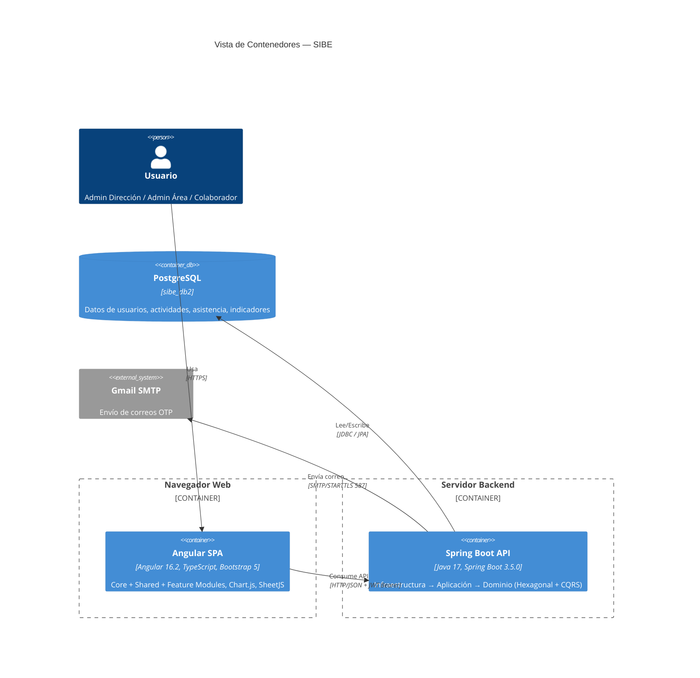
```mermaid
C4Container
    title Vista de Contenedores — SIBE

    Person(user, "Usuario", "Admin Dirección / Admin Área / Colaborador")

    Container_Boundary(browser, "Navegador Web") {
        Container(spa, "Angular SPA", "Angular 16.2, TypeScript, Bootstrap 5", "Core + Shared + Feature Modules, Chart.js, SheetJS")
    }

    Container_Boundary(server, "Servidor Backend") {
        Container(api, "Spring Boot API", "Java 17, Spring Boot 3.5.0", "Infraestructura → Aplicación → Dominio (Hexagonal + CQRS)")
    }

    ContainerDb(db, "PostgreSQL", "sibe_db2", "Datos de usuarios, actividades, asistencia, indicadores")
    System_Ext(smtp, "Gmail SMTP", "Envío de correos OTP")

    Rel(user, spa, "Usa", "HTTPS")
    Rel(spa, api, "Consume API", "HTTP/JSON + JWT Bearer")
    Rel(api, db, "Lee/Escribe", "JDBC / JPA")
    Rel(api, smtp, "Envía correo", "SMTP/STARTTLS 587")
```

### 4.1 Comunicación entre Contenedores

| Origen | Destino | Protocolo | Mecanismo |
|--------|---------|-----------|-----------|
| Frontend → Backend | HTTP/REST | JSON sobre HTTPS; JWT en header `Authorization` |
| Backend → PostgreSQL | JDBC | Spring Data JPA / Hibernate |
| Backend → SMTP | SMTP/STARTTLS | Spring Mail (Gmail puerto 587) |
| Frontend → RFID | USB/HID | El lector RFID envía caracteres como entrada de teclado al campo del formulario |
| Frontend → Excel | Local | Generación de archivos .xlsx con SheetJS en el navegador |

---

## 5. Vista de Componentes — Backend

### 5.1 Arquitectura Hexagonal (Puertos y Adaptadores)

El backend implementa una **Arquitectura Hexagonal** estricta con tres capas claramente delimitadas y una regla de dependencia unidireccional: `infraestructura → aplicación → dominio`.

```
┌──────────────────────────────────────────────────────────────────┐
│                      INFRAESTRUCTURA                             │
│                                                                   │
│  ┌──────────────┐  ┌──────────────┐  ┌────────────────────────┐  │
│  │ Controladores│  │  Seguridad   │  │  Adaptadores JPA       │  │
│  │ (REST API)   │  │  (Filtros,   │  │  ┌──────────────────┐  │  │
│  │ ┌─Comando──┐ │  │   JWT,       │  │  │ Entidades (44)   │  │  │
│  │ │ 6 ctrls  │ │  │   RBAC)      │  │  │ DAOs (43)        │  │  │
│  │ ├─Consulta─┤ │  │              │  │  │ Mapeadores (44)  │  │  │
│  │ │ 15 ctrls │ │  └──────────────┘  │  │ Repos Cmd (19)   │  │  │
│  │ ├─Login────┤ │                     │  │ Repos Qry (24)   │  │  │
│  │ │ 1 ctrl   │ │  ┌──────────────┐  │  └──────────────────┘  │  │
│  │ └──────────┘ │  │ Configuración│  │                         │  │
│  └──────────────┘  │ ┌─Beans─────┐│  │  ┌──────────────────┐  │  │
│                     │ │UseCaseBean││  │  │ Servicios Infra  │  │  │
│                     │ │ServiceBean││  │  │ ┌─Excel Motor──┐ │  │  │
│                     │ │EncriptBean││  │  │ │ POI Processor│ │  │  │
│                     │ ├─DataLoad──┤│  │  │ ├─Email SMTP──┤ │  │  │
│                     │ │ 10 loaders││  │  │ │MailSender   │ │  │  │
│                     │ └───────────┘│  │  │ ├─Contexto────┤ │  │  │
│                     └──────────────┘  │  │ │UsuarioProv. │ │  │  │
│                                       │  │ └──────────────┘ │  │  │
│                                       │  └──────────────────┘  │  │
│  ┌──────────────────────────────────┐                          │  │
│  │  Error Handler (@ControllerAdvice)│                         │  │
│  └──────────────────────────────────┘                          │  │
├───────────────────────────────────┬──────────────────────────────┤
│              APLICACIÓN           │                              │
│                                   │                              │
│  ┌─────────────────┐  ┌──────────┴────────┐  ┌──────────────┐  │
│  │ Manejadores Cmd │  │ Manejadores Query │  │ Comandos     │  │
│  │ (29 handlers)   │  │ (54 handlers)     │  │ (22 POJOs)   │  │
│  │ @Transactional  │  │ @Transactional    │  │              │  │
│  │ en interfaz     │  │ (readOnly=true)   │  │ Fábricas (n) │  │
│  └─────────────────┘  └───────────────────┘  └──────────────┘  │
│                                                                  │
│  ┌───────────────────────────────────────────────────────────┐   │
│  │ Interfaces Transversales:                                 │   │
│  │  ManejadorComandoRespuesta<C,R>       @Transactional      │   │
│  │  ManejadorComandoParametroRespuesta   @Transactional      │   │
│  │  ManejadorParametroRespuesta<P,R>     @Transactional(RO)  │   │
│  │  ManejadorRespuesta<R>                @Transactional(RO)  │   │
│  └───────────────────────────────────────────────────────────┘   │
├──────────────────────────────────────────────────────────────────┤
│                       DOMINIO                                    │
│  (Zero imports de Spring/JPA — solo Lombok + Java estándar)      │
│                                                                   │
│  ┌──────────────┐  ┌──────────────┐  ┌────────────────────────┐  │
│  │ Modelos (33) │  │ DTOs (30)    │  │ Use Cases              │  │
│  │ Inmutables   │  │ Proyección   │  │ ┌─Comando (30)───────┐ │  │
│  │ construir()  │  │ de consulta  │  │ │ Guardar, Modificar, │ │  │
│  │              │  │              │  │ │ Eliminar, Iniciar,  │ │  │
│  │              │  │              │  │ │ Finalizar, Cancelar │ │  │
│  │              │  │              │  │ ├─Consulta (34)──────┤ │  │
│  │              │  │              │  │ │ Consultar, Listar,  │ │  │
│  │              │  │              │  │ │ Buscar, Contar      │ │  │
│  │              │  │              │  │ └────────────────────┘ │  │
│  ├──────────────┤  ├──────────────┤  ├────────────────────────┤  │
│  │ Puertos      │  │ Reglas (28)  │  │ Servicios Dominio (7) │  │
│  │ ┌─Cmd (19)─┐ │  │ MotorRegla   │  │ AutorizaciónContexto  │  │
│  │ │Reposit.  │ │  │ MotoresFábr. │  │ ContarUsuarios        │  │
│  │ ├─Qry (24)─┤ │  │ TipoOperac.  │  │ VincularUsuarioÁrea  │  │
│  │ │Reposit.  │ │  │              │  │ VincularActividadÁrea │  │
│  │ ├─Svc (3)──┤ │  │              │  │ RegistrarParticipante │  │
│  │ │Encriptar │ │  │              │  │                        │  │
│  │ │Correo    │ │  │              │  │                        │  │
│  │ │Contexto  │ │  │              │  │                        │  │
│  │ └─────────┘ │  │              │  │                        │  │
│  ├──────────────┤  └──────────────┘  └────────────────────────┘  │
│  │ Transversal  │                                                 │
│  │ ┌Constantes (12)   Excepciones (8)   Utilitarios (5)┐        │
│  │ └───────────────────────────────────────────────────┘         │
│  └──────────────┘                                                 │
└───────────────────────────────────────────────────────────────────┘
```

### 5.2 CQRS — Separación Comando/Consulta

SIBE implementa **CQRS estructural** en todas las capas. La separación no es eventual (sin event sourcing) sino paquetizada: las rutas de escritura y lectura son paquetes independientes en cada capa.

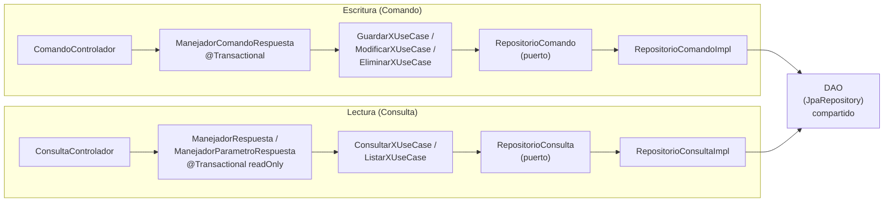
```mermaid
flowchart LR
    subgraph Escritura ["Escritura (Comando)"]
        direction TB
        CC[ComandoControlador] --> MC["ManejadorComandoRespuesta\n@Transactional"]
        MC --> UC["GuardarXUseCase /\nModificarXUseCase /\nEliminarXUseCase"]
        UC --> PC["RepositorioComando\n(puerto)"]
        PC --> IC[RepositorioComandoImpl]
    end

    subgraph Lectura ["Lectura (Consulta)"]
        direction TB
        CQ[ConsultaControlador] --> MQ["ManejadorRespuesta /\nManejadorParametroRespuesta\n@Transactional readOnly"]
        MQ --> UQ["ConsultarXUseCase /\nListarXUseCase"]
        UQ --> PQ["RepositorioConsulta\n(puerto)"]
        PQ --> IQ[RepositorioConsultaImpl]
    end

    IC --> DAO["DAO\n(JpaRepository)\ncompartido"]
    IQ --> DAO
```

**Flujo de un comando (escritura):**
1. `POST /api/actividades` → `ActividadComandoControlador` (con `@PreAuthorize`)
2. → `GuardarActividadManejador.ejecutar(ActividadComando)` (abre transacción)
3. → `GuardarActividadUseCase.ejecutar(Actividad)` (valida reglas, autorización contextual)
4. → `ActividadRepositorioComando.guardar(Actividad)` (puerto)
5. → `ActividadRepositorioComandoImplementacion.guardar()` (mapea a entidad JPA, persiste)
6. → Retorna `ComandoRespuesta<UUID>` con el identificador generado

**Flujo de una consulta (lectura):**
1. `GET /api/actividades/area/{id}` → `ActividadConsultaControlador` (con `@PreAuthorize`)
2. → `ConsultarActividadesPorAreaManejador.ejecutar(UUID)` (transacción readOnly)
3. → `ConsultarActividadesPorAreaUseCase.ejecutar(UUID)` (autorización contextual)
4. → `ActividadRepositorioConsulta.consultarPorArea(UUID)` (puerto)
5. → `ActividadRepositorioConsultaImplementacion` (mapea entidades a DTOs)
6. → Retorna `List<ActividadDTO>`

### 5.3 Cableado de Dependencias

Los use cases y servicios de dominio **no son Spring Beans**. Son POJOs instanciados explícitamente mediante clases `@Configuration`:

- **`UseCaseBean.java`** — Declara cada use case como `@Bean` con inyección explícita de puertos por constructor.
- **`ServiceBean.java`** — Declara cada servicio de dominio como `@Bean`.
- **`EncriptarClaveBean.java`** — Declara el `BCryptPasswordEncoder`.

Esto garantiza que el paquete `dominio` no tiene ninguna dependencia de Spring.

### 5.4 Motor de Reglas de Dominio

SIBE implementa un motor de validación propio en la capa de dominio:

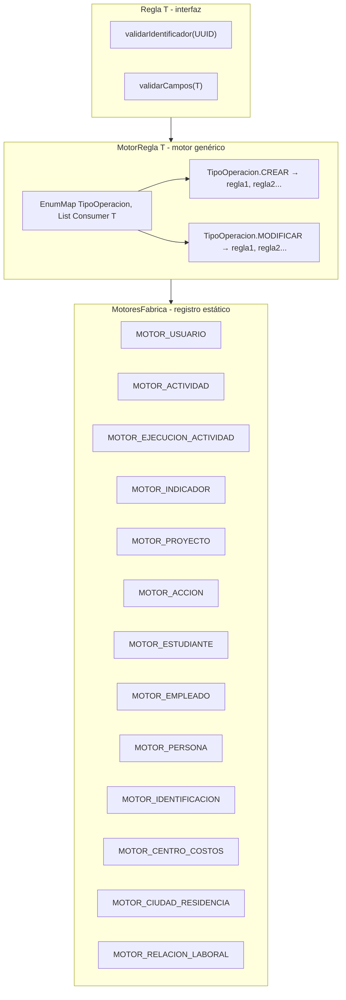
```mermaid
flowchart TD
    subgraph Regla ["Regla T - interfaz"]
        R1["validarIdentificador(UUID)"]
        R2["validarCampos(T)"]
    end

    subgraph Motor ["MotorRegla T - motor genérico"]
        EM["EnumMap TipoOperacion, List Consumer T"]
        EM --> CREAR["TipoOperacion.CREAR → regla1, regla2..."]
        EM --> MOD["TipoOperacion.MODIFICAR → regla1, regla2..."]
    end

    subgraph Fabrica ["MotoresFabrica - registro estático"]
        M1[MOTOR_USUARIO]
        M2[MOTOR_ACTIVIDAD]
        M3[MOTOR_EJECUCION_ACTIVIDAD]
        M4[MOTOR_INDICADOR]
        M5[MOTOR_PROYECTO]
        M6[MOTOR_ACCION]
        M7[MOTOR_ESTUDIANTE]
        M8[MOTOR_EMPLEADO]
        M9[MOTOR_PERSONA]
        M10[MOTOR_IDENTIFICACION]
        M11[MOTOR_CENTRO_COSTOS]
        M12[MOTOR_CIUDAD_RESIDENCIA]
        M13[MOTOR_RELACION_LABORAL]
    end

    Regla --> Motor
    Motor --> Fabrica
```

- **28 implementaciones de `Regla`** (una por modelo de dominio), cada una como singleton vía `obtenerInstancia()`.
- **Utilitarios de validación:** `ValidadorTexto`, `ValidadorObjeto`, `ValidadorNumero`, `UtilFecha`, `UtilUUID`.
- Los use cases invocan `motorRegla.ejecutar(objeto, TipoOperacion.CREAR)` antes de persistir.

### 5.5 Manejo de Excepciones

#### Capa de Dominio — Excepciones Propias

| Excepción | Propósito | HTTP Status |
|-----------|-----------|:-----------:|
| `ValorObligatorioExcepcion` | Campo requerido nulo o vacío | 400 |
| `LongitudExcepcion` | Texto fuera de rango permitido | 400 |
| `PatronExcepcion` | Formato inválido (regex) | 400 |
| `ValorDuplicadoExcepcion` | Violación de unicidad de negocio | 400 |
| `ValorInvalidoExcepcion` | Valor no permitido por regla de negocio | 400 |
| `TiempoVencidoExcepcion` | OTP expirado | 400 |
| `TecnicoExcepcion` | Error técnico inesperado | 500 |

#### Capa de Infraestructura — Manejo Global

- **`ManejadorError`** (`@ControllerAdvice`): Utiliza un `ConcurrentHashMap<String, Integer>` que mapea nombre de excepción → código HTTP. Retorna `Error { nombreExcepcion, mensaje }` como JSON.
- **`ExceptionFilter`** (filtro de seguridad): Captura excepciones del filter chain — `BadCredentialsException` → 400, `AuthorizationException` → 401, otras → 500.

---

## 6. Vista de Componentes — Frontend

### 6.1 Arquitectura Core / Shared / Feature

El frontend sigue una arquitectura modular de tres capas con **lazy loading** agresivo:

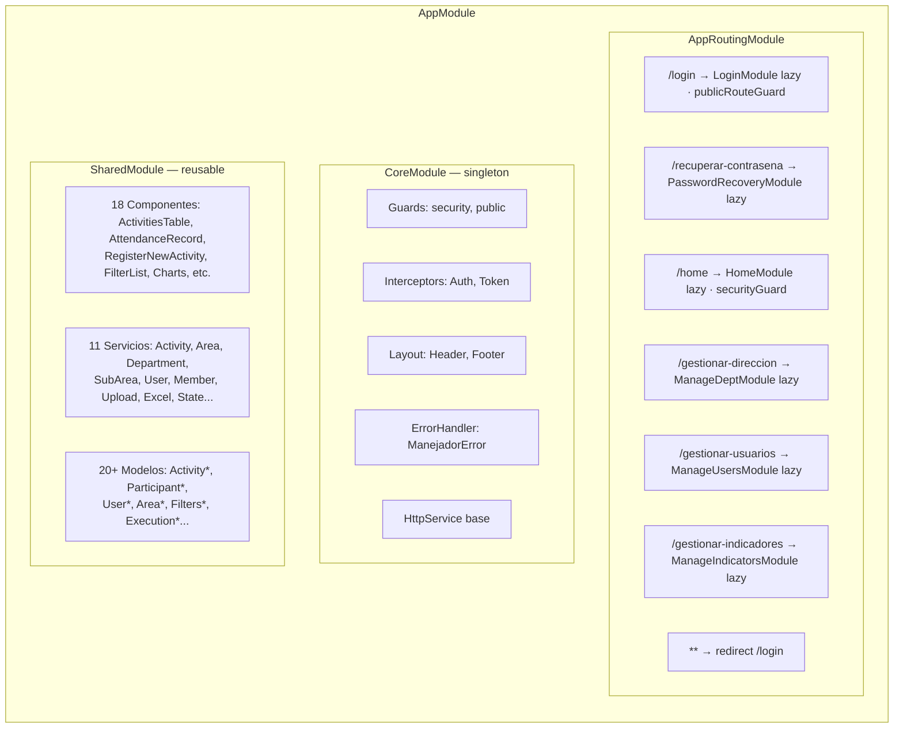
```mermaid
flowchart TD
    subgraph AppModule ["AppModule"]
        direction TB
        subgraph Routing ["AppRoutingModule"]
            R1["/login → LoginModule lazy · publicRouteGuard"]
            R2["/recuperar-contrasena → PasswordRecoveryModule lazy"]
            R3["/home → HomeModule lazy · securityGuard"]
            R4["/gestionar-direccion → ManageDeptModule lazy"]
            R5["/gestionar-usuarios → ManageUsersModule lazy"]
            R6["/gestionar-indicadores → ManageIndicatorsModule lazy"]
            R7["** → redirect /login"]
        end

        subgraph Core ["CoreModule — singleton"]
            G["Guards: security, public"]
            I["Interceptors: Auth, Token"]
            L["Layout: Header, Footer"]
            EH["ErrorHandler: ManejadorError"]
            HS["HttpService base"]
        end

        subgraph Shared ["SharedModule — reusable"]
            SC["18 Componentes: ActivitiesTable, AttendanceRecord,\nRegisterNewActivity, FilterList, Charts, etc."]
            SS["11 Servicios: Activity, Area, Department,\nSubArea, User, Member, Upload, Excel, State..."]
            SM["20+ Modelos: Activity*, Participant*,\nUser*, Area*, Filters*, Execution*..."]
        end
    end
```

### 6.2 Regla de Dependencias entre Módulos

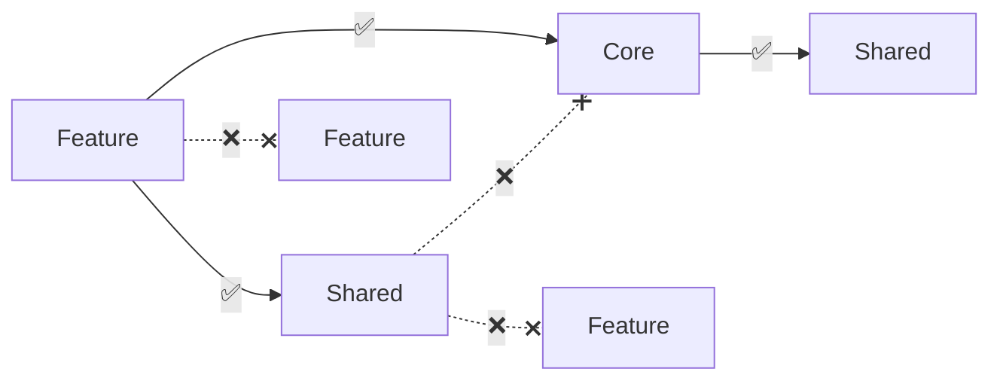
```mermaid
flowchart LR
    Feature -->|"✅"| Core
    Feature -->|"✅"| Shared
    Feature -.-x|"❌"| Feature2[Feature]
    Shared -.-x|"❌"| Core
    Shared -.-x|"❌"| Feature3[Feature]
    Core -->|"✅"| Shared2[Shared]
```

### 6.3 Feature Modules y Lazy Loading

SIBE implementa **lazy loading de hasta 3 niveles de profundidad**:

| Módulo | Ruta | Guard | Nivel |
|--------|------|-------|:-----:|
| `LoginModule` | `/login` | `publicRouteGuard` | 1 |
| `PasswordRecoveryModule` | `/recuperar-contrasena` | `publicRouteGuard` | 1 |
| `HomeModule` | `/home` | `securityGuard` | 1 |
| `ManageDepartmentModule` | `/gestionar-direccion` | `securityGuard` | 1 |
| `ManageUsersModule` | `/gestionar-usuarios` | `securityGuard` | 1 |
| `ManageIndicatorsModule` | `/gestionar-indicadores` | `securityGuard` | 1 |
| `BienestarAreaModule` | `/home/area-bienestar` | heredado | 2 |
| `EvangelizacionAreaModule` | `/home/area-evangelizacion` | heredado | 2 |
| `HogarAreaModule` | `/home/area-hogar-santa-maria` | heredado | 2 |
| `ServicioAreaModule` | `/home/area-servicio-atencion` | heredado | 2 |
| `DeportesSubAreaModule` | `/home/area-bienestar/sub-area-deportes` | heredado | 3 |
| `CanchaSubAreaModule` | `/home/area-bienestar/sub-area-cancha-sintetica` | heredado | 3 |
| `GimnasioSubAreaModule` | `/home/area-bienestar/sub-area-gimnasio` | heredado | 3 |
| `ExtensionSubAreaModule` | `/home/area-bienestar/sub-area-extension-cultural` | heredado | 3 |
| `BandaSubAreaModule` | `/home/area-bienestar/sub-area-banda-sinfonica` | heredado | 3 |
| `UnidadSubAreaModule` | `/home/area-bienestar/sub-area-unidad-de-salud` | heredado | 3 |
| `AcompanamientoSubAreaModule` | `/home/area-bienestar/sub-area-acompanamiento-psicosocial` | heredado | 3 |
| `TrabajoSocialSubAreaModule` | `/home/area-bienestar/sub-area-trabajo-social` | heredado | 3 |

Cada módulo de área/subárea sigue el mismo patrón de componentes: componente raíz del área + filtros + tabla de actividades + paneles de estadísticas (top/bottom) + componente de registro de asistencia.

### 6.4 Gestión de Estado

SIBE **no usa NgRx**. El estado se gestiona mediante un `StateService` centralizado basado en `BehaviorSubject<Map<StateProps, any>>`:

```typescript
// Patrón de estado
StateService (providedIn: 'root')
├── stateProps: Map<StateProps, any>
├── state: BehaviorSubject<Map>
├── updateState(prop, value)     // Mutación + push
├── getState(prop)               // Lectura síncrona
├── select<T>(prop): Observable  // Stream reactivo con distinctUntilChanged
├── deleteProperty(prop)         // Eliminación + push
└── rehydrateSession()           // Rehidratación desde sessionStorage al construir
```

**Estado actual:** Un solo key — `StateProps.USER_SESSION` — que almacena `UserSession { correo, identificador, authorities[], logged, rol, direccionId, areaId, subareaId }`.

**Persistencia:** `sessionStorage` (se destruye al cerrar la pestaña — seguridad implícita). En recarga de página, `rehydrateSession()` decodifica el JWT almacenado y reconstruye la sesión.

### 6.5 Comunicación HTTP

Todos los servicios de dominio extienden `HttpService` (Core), que envuelve `HttpClient` con métodos tipados:

| Método | Propósito |
|--------|-----------|
| `doGet<T>(url)` | GET simple |
| `doGetById<T>(url, id)` | GET por UUID |
| `doGetByEmail<T>(url, email)` | GET por correo |
| `doPost<T>(url, body)` | POST con cuerpo |
| `doPut<T>(url, id, body)` | PUT con cuerpo |
| `doPutWithOutBody<T>(url, id)` | PUT sin cuerpo (cambios de estado) |
| `doDelete<T>(url, id)` | DELETE por UUID |
| `doGetParameters<T>(url, params)` | GET con HttpParams |
| `doPostWithOutBody<T>(url)` | POST sin cuerpo |
| `doRequestMapping<T>(url)` | GET genérico |

---

## 7. Vista de Datos

### 7.1 Modelo Entidad-Relación

El esquema de persistencia se basa en **44 entidades JPA** organizadas en 5 subdominios, todas con `UUID` como clave primaria.

#### Subdominio 1: Gestión de Usuarios y Autenticación

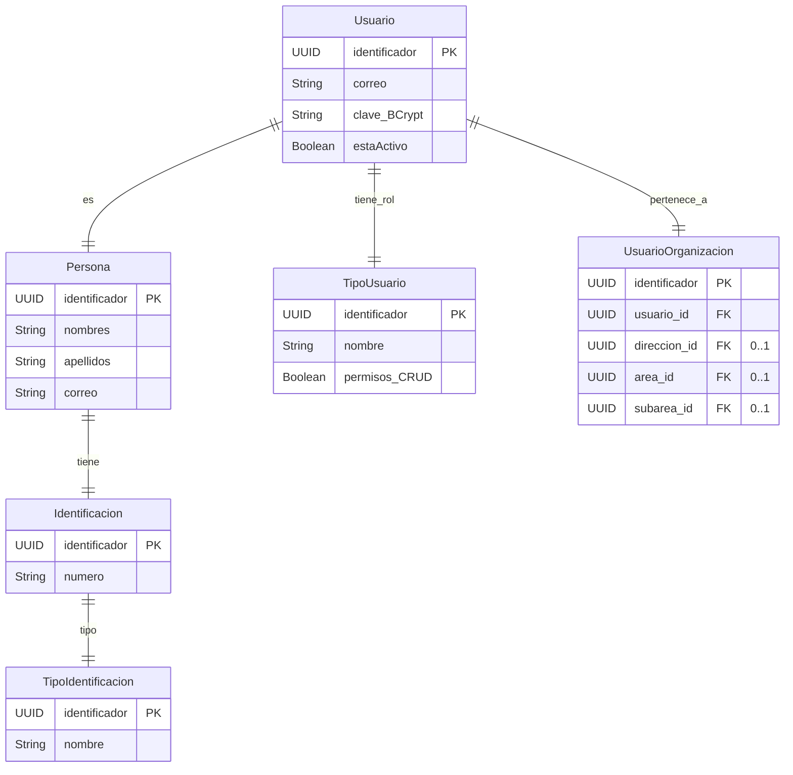
```mermaid
erDiagram
    Persona {
        UUID identificador PK
        String nombres
        String apellidos
        String correo
    }
    Identificacion {
        UUID identificador PK
        String numero
    }
    TipoIdentificacion {
        UUID identificador PK
        String nombre
    }
    Usuario {
        UUID identificador PK
        String correo
        String clave_BCrypt
        Boolean estaActivo
    }
    TipoUsuario {
        UUID identificador PK
        String nombre
        Boolean permisos_CRUD
    }
    UsuarioOrganizacion {
        UUID identificador PK
        UUID usuario_id FK
        UUID direccion_id FK "0..1"
        UUID area_id FK "0..1"
        UUID subarea_id FK "0..1"
    }

    Persona ||--|| Identificacion : tiene
    Identificacion ||--|| TipoIdentificacion : tipo
    Usuario ||--|| Persona : es
    Usuario ||--|| TipoUsuario : tiene_rol
    Usuario ||--|| UsuarioOrganizacion : pertenece_a
```

#### Subdominio 2: Estructura Organizacional

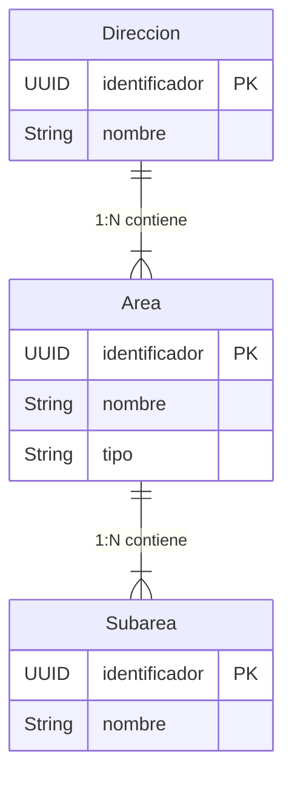
```mermaid
erDiagram
    Direccion {
        UUID identificador PK
        String nombre
    }
    Area {
        UUID identificador PK
        String nombre
        String tipo
    }
    Subarea {
        UUID identificador PK
        String nombre
    }

    Direccion ||--|{ Area : "1:N contiene"
    Area ||--|{ Subarea : "1:N contiene"
```

#### Subdominio 3: Comunidad Universitaria (Herencia JOINED)

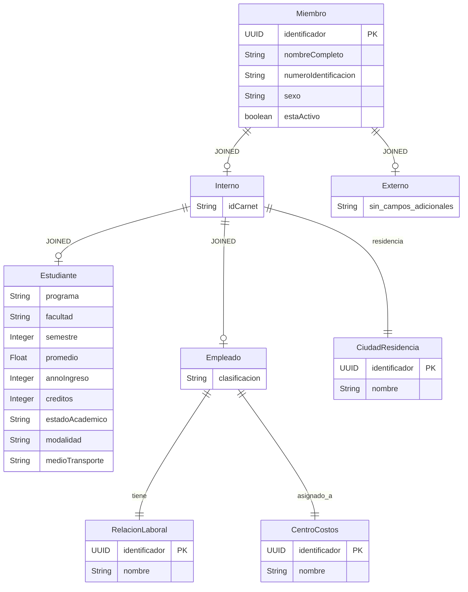
```mermaid
erDiagram
    Miembro {
        UUID identificador PK
        String nombreCompleto
        String numeroIdentificacion
        String sexo
        boolean estaActivo
    }
    Interno {
        String idCarnet
    }
    Externo {
        String sin_campos_adicionales
    }
    Estudiante {
        String programa
        String facultad
        Integer semestre
        Float promedio
        Integer annoIngreso
        Integer creditos
        String estadoAcademico
        String modalidad
        String medioTransporte
    }
    Empleado {
        String clasificacion
    }
    CiudadResidencia {
        UUID identificador PK
        String nombre
    }
    RelacionLaboral {
        UUID identificador PK
        String nombre
    }
    CentroCostos {
        UUID identificador PK
        String nombre
    }

    Miembro ||--o| Interno : "JOINED"
    Miembro ||--o| Externo : "JOINED"
    Interno ||--o| Estudiante : "JOINED"
    Interno ||--o| Empleado : "JOINED"
    Interno ||--|| CiudadResidencia : residencia
    Empleado ||--|| RelacionLaboral : tiene
    Empleado ||--|| CentroCostos : asignado_a
```

#### Subdominio 4: Configuración Estratégica

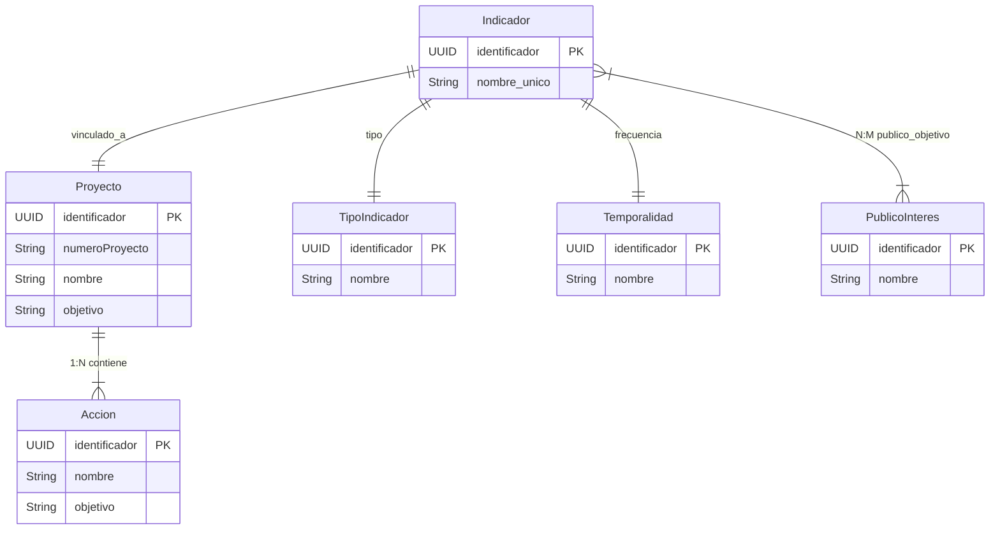
```mermaid
erDiagram
    Proyecto {
        UUID identificador PK
        String numeroProyecto
        String nombre
        String objetivo
    }
    Accion {
        UUID identificador PK
        String nombre
        String objetivo
    }
    Indicador {
        UUID identificador PK
        String nombre_unico
    }
    TipoIndicador {
        UUID identificador PK
        String nombre
    }
    Temporalidad {
        UUID identificador PK
        String nombre
    }
    PublicoInteres {
        UUID identificador PK
        String nombre
    }

    Proyecto ||--|{ Accion : "1:N contiene"
    Indicador ||--|| Proyecto : vinculado_a
    Indicador ||--|| TipoIndicador : tipo
    Indicador ||--|| Temporalidad : frecuencia
    Indicador }|--|{ PublicoInteres : "N:M publico_objetivo"
```

#### Subdominio 5: Actividades y Asistencia (Núcleo)

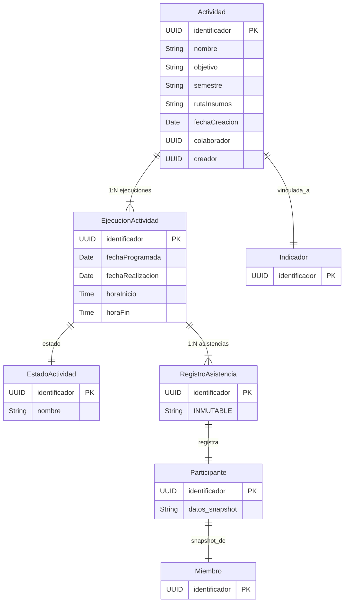
```mermaid
erDiagram
    Actividad {
        UUID identificador PK
        String nombre
        String objetivo
        String semestre
        String rutaInsumos
        Date fechaCreacion
        UUID colaborador
        UUID creador
    }
    EjecucionActividad {
        UUID identificador PK
        Date fechaProgramada
        Date fechaRealizacion
        Time horaInicio
        Time horaFin
    }
    EstadoActividad {
        UUID identificador PK
        String nombre
    }
    RegistroAsistencia {
        UUID identificador PK
        String INMUTABLE
    }
    Participante {
        UUID identificador PK
        String datos_snapshot
    }
    Indicador {
        UUID identificador PK
    }
    Miembro {
        UUID identificador PK
    }

    Actividad ||--|| Indicador : vinculada_a
    Actividad ||--|{ EjecucionActividad : "1:N ejecuciones"
    EjecucionActividad ||--|| EstadoActividad : estado
    EjecucionActividad ||--|{ RegistroAsistencia : "1:N asistencias"
    RegistroAsistencia ||--|| Participante : registra
    Participante ||--|| Miembro : snapshot_de
```

> **Nota:** Cada `Actividad` se vincula a exactamente 1 nivel organizacional mediante tablas de asociación: `direccion_actividad`, `area_actividad` o `sub_area_actividad`. `Participante` usa herencia JOINED hacia `ParticipanteEstudiante`, `ParticipanteEmpleado`, `ParticipanteExterno` y `ParticipanteInterno`.

### 7.2 Patrón de Snapshot Temporal

SIBE implementa un **patrón de snapshot temporal** mediante la dualidad Miembro/Participante:

- **`Miembro`** representa los datos maestros actuales del individuo (actualizados semestralmente vía carga masiva).
- **`Participante`** es un snapshot inmutable que captura el estado del miembro en el momento del registro de asistencia.
- **`RegistroAsistencia`** vincula un `Participante` con una `EjecuciónActividad` y es **inmutable** — nunca se actualiza ni elimina.

Esto garantiza que cambios posteriores en los datos maestros (ej. un estudiante cambia de programa académico) no alteren el historial de asistencia.

### 7.3 Estrategia de Herencia JPA

| Jerarquía | Estrategia | Tablas generadas |
|-----------|------------|------------------|
| `Miembro` → `Interno` / `Externo` | `JOINED` | `miembro`, `interno`, `externo` |
| `Interno` → `Estudiante` / `Empleado` | `JOINED` | `estudiante`, `empleado` |
| `Participante` → `ParticipanteEstudiante` / `ParticipanteEmpleado` / `ParticipanteExterno` / `ParticipanteInterno` | `JOINED` | `participante`, `participante_estudiante`, etc. |

### 7.4 Tablas de Asociación (Join Tables)

| Tabla | Relación | Propósito |
|-------|----------|-----------|
| `direccion_actividad` | Dirección ↔ Actividad | Actividades a nivel de dirección |
| `area_actividad` | Área ↔ Actividad | Actividades a nivel de área |
| `sub_area_actividad` | Subárea ↔ Actividad | Actividades a nivel de subárea |
| `usuario_tipo_usuario` | Usuario ↔ TipoUsuario | Rol del usuario |
| `identificacion_tipo_identificacion` | Identificación ↔ TipoIdentificación | Tipo de documento |
| `indicador_proyecto` | Indicador ↔ Proyecto | Proyecto del indicador |
| `indicador_tipo_indicador` | Indicador ↔ TipoIndicador | Tipo del indicador |
| `indicador_temporalidad` | Indicador ↔ Temporalidad | Frecuencia del indicador |
| `indicador_publico_interes` | Indicador ↔ PúblicoInterés | Público objetivo (N:M) |
| `empleado_centro_costos` | Empleado ↔ CentroCostos | Centro de costos |
| `empleado_relacion_laboral` | Empleado ↔ RelaciónLaboral | Relación laboral |
| `interno_ciudad_residencia` | Interno ↔ CiudadResidencia | Ciudad de residencia |

### 7.5 Evolución del Esquema

| Mecanismo | Implementación |
|-----------|----------------|
| DDL automático | `spring.jpa.hibernate.ddl-auto=update` — Hibernate genera/actualiza tablas automáticamente |
| Datos de referencia | 10 `DataLoader` (implementan `CommandLineRunner` con `@Order`) siembran datos si no existen |
| Orden de carga | `TipoUsuario` (1) → ... → `UsuarioAdministrador` (10) |
| Migraciones versionadas | **No implementadas** — pendiente Flyway/Liquibase para producción |

---

## 8. Vista de Seguridad

### 8.1 Modelo de Seguridad por Capas

```
┌────────────────────────────────────────────────────────────────────────┐
│ CAPA 0 — TRANSPORTE                                                   │
│  TLS 1.3+ (requerido para producción)                                 │
│  CORS: origen permitido = http://localhost:4200                        │
│  CSRF deshabilitado (JWT stateless, no auto-enviado por navegador)    │
├────────────────────────────────────────────────────────────────────────┤
│ CAPA 1 — CADENA DE FILTROS (Spring Security Filter Chain)             │
│                                                                        │
│  ExceptionFilter                                                       │
│       ↓                                                                │
│  RequestValidationBeforeFilter (decodifica/valida Basic Auth)          │
│       ↓                                                                │
│  AuthoritiesLoggingAtFilter (log de intentos)                          │
│       ↓                                                                │
│  JWTTokenValidatorFilter (valida JWT → SecurityContext)                │
│       ↓                                                                │
│  BasicAuthenticationFilter (Spring built-in)                           │
│       ↓                                                                │
│  AuthoritiesLoggingAfterFilter (log de authorities)                    │
│       ↓                                                                │
│  JWTTokenGeneratorFilter (genera JWT post-login)                       │
├────────────────────────────────────────────────────────────────────────┤
│ CAPA 2 — AUTORIZACIÓN POR ROL (@PreAuthorize)                         │
│                                                                        │
│  Expresiones SpEL en controladores:                                    │
│  ┌──────────────────────────────────────────────────────────────────┐  │
│  │ HAS_ADMIN_CREATE_AUTHORITY                                       │  │
│  │ HAS_AREA_ADMIN_OR_ADMIN_CREATE_AUTHORITY                        │  │
│  │ HAS_USER_OR_AREA_ADMIN_OR_ADMIN_GET_AUTHORITY                   │  │
│  │ HAS_USER_OR_ADMIN_UPDATE_AUTHORITY                              │  │
│  │ HAS_USER_OR_AREA_ADMIN_OR_ADMIN_UPDATE_AUTHORITY                │  │
│  │ HAS_ADMIN_DELETE_AUTHORITY                                      │  │
│  └──────────────────────────────────────────────────────────────────┘  │
├────────────────────────────────────────────────────────────────────────┤
│ CAPA 3 — AUTORIZACIÓN POR CONTEXTO ORGANIZACIONAL                     │
│                                                                        │
│  AutorizacionContextoOrganizacionalServicio (servicio de dominio)      │
│  ┌──────────────────────────────────────────────────────────────────┐  │
│  │ Extrae claims JWT: rol, direccionId, areaId, subareaId          │  │
│  │ ADMINISTRADOR_DIRECCION → acceso irrestricto                    │  │
│  │ ADMINISTRADOR_AREA → solo su área asignada                      │  │
│  │ COLABORADOR → solo lectura en su área                           │  │
│  │ Métodos: validarAccesoAArea(), validarAccesoAUsuario(),         │  │
│  │          validarAccesoAEjecucionActividad()                     │  │
│  │ Violación → HTTP 403 Forbidden                                  │  │
│  └──────────────────────────────────────────────────────────────────┘  │
└────────────────────────────────────────────────────────────────────────┘
```

### 8.2 Autenticación — Flujo de Login

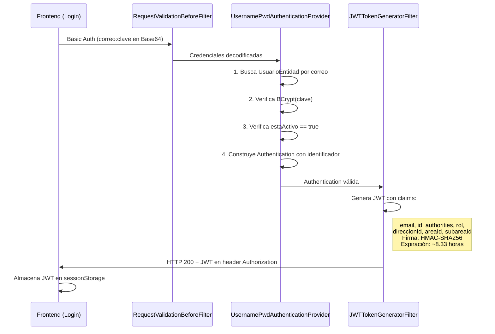
```mermaid
sequenceDiagram
    participant FE as Frontend (Login)
    participant RVF as RequestValidationBeforeFilter
    participant AP as UsernamePwdAuthenticationProvider
    participant JTG as JWTTokenGeneratorFilter

    FE->>RVF: Basic Auth (correo:clave en Base64)
    RVF->>AP: Credenciales decodificadas
    AP->>AP: 1. Busca UsuarioEntidad por correo
    AP->>AP: 2. Verifica BCrypt(clave)
    AP->>AP: 3. Verifica estaActivo == true
    AP->>AP: 4. Construye Authentication con identificador
    AP->>JTG: Authentication válida
    JTG->>JTG: Genera JWT con claims:
    Note right of JTG: email, id, authorities, rol,<br/>direccionId, areaId, subareaId<br/>Firma: HMAC-SHA256<br/>Expiración: ~8.33 horas
    JTG->>FE: HTTP 200 + JWT en header Authorization
    FE->>FE: Almacena JWT en sessionStorage
```

### 8.3 Claims del JWT

| Claim | Tipo | Descripción |
|-------|------|-------------|
| `email` | String | Correo del usuario autenticado |
| `id` | UUID | Identificador único del usuario |
| `authorities` | String | Authorities separadas por coma (ej. `ADMINISTRADOR_AREA_CREATE,ADMINISTRADOR_AREA_READ,ADMINISTRADOR_AREA_UPDATE`) |
| `rol` | String | Código del rol (ej. `ADMINISTRADOR_AREA`) |
| `direccionId` | UUID | ID de la dirección asignada (si aplica) |
| `areaId` | UUID | ID del área asignada (si aplica) |
| `subareaId` | UUID | ID de la subárea asignada (si aplica) |
| `exp` | Long | Timestamp de expiración (30,000,000 ms desde emisión) |

### 8.4 Roles y Permisos Granulares

| Rol | CREATE | READ | UPDATE | DELETE |
|-----|:------:|:----:|:------:|:------:|
| `ADMINISTRADOR_DIRECCION` | ✅ | ✅ | ✅ | ✅ |
| `ADMINISTRADOR_AREA` | ✅ | ✅ | ✅ | ❌ |
| `COLABORADOR` | ❌ | ✅ | ✅* | ❌ |

*Colaborador UPDATE está limitado a su propio perfil y a registrar asistencia.

### 8.5 Seguridad en el Frontend

| Componente | Mecanismo |
|------------|-----------|
| `securityGuard` | Valida JWT en `sessionStorage`, verifica expiración, valida rol contra ruta |
| `publicRouteGuard` | Redirige usuarios autenticados lejos de `/login` y `/recuperar-contrasena` |
| `AuthInterceptor` | Inyecta Basic Auth (login) o Bearer JWT (peticiones subsiguientes) |
| `TokenInterceptor` | Verifica expiración del token; fuerza logout en 401 o token expirado |
| `StateService` | Rehidrata sesión desde `sessionStorage` al recargar; `sessionStorage` se destruye al cerrar pestaña |

### 8.6 Endpoints Públicos (Sin JWT)

| Método | Endpoint | Propósito |
|--------|----------|-----------|
| `*` | `/login` | Autenticación inicial (Basic Auth) |
| `POST` | `/usuarios/recuperacion/solicitar/{correo}` | Solicitar código OTP |
| `POST` | `/usuarios/recuperacion/validarCodigo` | Validar código OTP |
| `PUT` | `/usuarios/recuperacion/recuperarClave` | Restablecer contraseña |

### 8.7 Contraseñas y OTP

| Aspecto | Implementación |
|---------|----------------|
| Hashing de contraseñas | BCrypt vía `BCryptPasswordEncoder` |
| Hashing de OTP | BCrypt (mismo encoder) |
| Validez del OTP | 5 minutos |
| Entrega del OTP | Correo electrónico vía SMTP (Gmail, STARTTLS) |
| Eliminación del OTP | Se elimina tras validación exitosa |

---

## 9. Vista de Integración — Catálogo de API REST

Context path: `/api` — Base URL: `http://localhost:8080/api`

### 9.1 Autenticación

| Método | Endpoint | Auth | Descripción |
|--------|----------|------|-------------|
| `*` | `/login` | Basic | Login → genera JWT |

### 9.2 Usuarios

| Método | Endpoint | Autoridad | Descripción |
|--------|----------|-----------|-------------|
| `POST` | `/usuarios` | ADMIN_CREATE | Crear usuario |
| `PUT` | `/usuarios/usuario/{id}` | UPDATE (any) | Modificar usuario |
| `PUT` | `/usuarios/modificar/clave` | UPDATE (any) | Cambiar contraseña propia |
| `DELETE` | `/usuarios/usuario/{id}` | ADMIN_DELETE | Eliminar usuario (soft delete) |
| `GET` | `/usuarios` | READ (any) | Listar usuarios |
| `GET` | `/usuarios/usuario/id/{id}` | READ (any) | Buscar por UUID |
| `GET` | `/usuarios/usuario/correo/{correo}` | READ (any) | Buscar por correo |

### 9.3 Recuperación de Contraseña (Público)

| Método | Endpoint | Auth | Descripción |
|--------|----------|------|-------------|
| `POST` | `/usuarios/recuperacion/solicitar/{correo}` | Público | Solicitar código OTP |
| `POST` | `/usuarios/recuperacion/validarCodigo` | Público | Validar código OTP |
| `PUT` | `/usuarios/recuperacion/recuperarClave` | Público | Restablecer contraseña |

### 9.4 Actividades

| Método | Endpoint | Autoridad | Descripción |
|--------|----------|-----------|-------------|
| `POST` | `/actividades` | CREATE (area-admin+) | Crear actividad |
| `PUT` | `/actividades/{id}` | UPDATE (area-admin+) | Modificar actividad |
| `PUT` | `/actividades/iniciar/{id}` | UPDATE (any) | Iniciar ejecución → EN_CURSO |
| `PUT` | `/actividades/finalizar/{id}` | UPDATE (any) | Finalizar con participantes |
| `PUT` | `/actividades/cancelar/{id}` | UPDATE (any) | Cancelar ejecución → PENDIENTE |
| `GET` | `/actividades/area/{id}` | READ (any) | Actividades por área |
| `GET` | `/actividades/direccion/{id}` | READ (any) | Actividades por dirección |
| `GET` | `/actividades/subarea/{id}` | READ (any) | Actividades por subárea |
| `GET` | `/actividades/ejecuciones/{id}` | READ (any) | Ejecuciones de una actividad |
| `GET` | `/actividades/ejecuciones/ejecucion/participantes/{id}` | READ (any) | Participantes por ejecución |

### 9.5 Estadísticas (Todas POST con filtros, READ any)

| Endpoint | Descripción |
|----------|-------------|
| `/actividades/ejecuciones/finalizadas/participantes/conteo` | Total participantes únicos |
| `/actividades/ejecuciones/finalizadas/asistencias/conteo` | Total registros de asistencia |
| `/actividades/ejecuciones/finalizadas/conteo` | Total ejecuciones finalizadas |
| `/actividades/ejecuciones/finalizadas/participantes/estadisticas-estructura` | Estadísticas por estructura organizacional |
| `/actividades/ejecuciones/finalizadas/participantes/estadisticas-mes` | Estadísticas por mes |
| `/actividades/ejecuciones/finalizadas/poblacion/conteo` | Población total (para cobertura) |

### 9.6 Filtros de Estadísticas (Todos GET, READ any)

| Endpoint | Retorna |
|----------|---------|
| `/actividades/ejecuciones/finalizadas/meses` | Meses disponibles |
| `/actividades/ejecuciones/finalizadas/annos` | Años disponibles |
| `/actividades/ejecuciones/finalizadas/semestres` | Semestres disponibles |
| `/actividades/ejecuciones/finalizadas/centros-costos` | Centros de costos |
| `/actividades/ejecuciones/finalizadas/tipos-participantes` | Tipos de participante |
| `/actividades/ejecuciones/finalizadas/programas-academicos` | Programas académicos |
| `/actividades/ejecuciones/finalizadas/niveles-formacion` | Niveles de formación |
| `/actividades/ejecuciones/finalizadas/indicadores` | Indicadores estratégicos |

### 9.7 Plan Estratégico

| Método | Endpoint | Autoridad | Descripción |
|--------|----------|-----------|-------------|
| `POST` | `/proyectos` | CREATE (dir-admin) | Crear proyecto |
| `PUT` | `/proyectos/{id}` | UPDATE (dir-admin) | Modificar proyecto |
| `GET` | `/proyectos` | READ (any) | Listar proyectos |
| `POST` | `/acciones` | CREATE (dir-admin) | Crear acción |
| `PUT` | `/acciones/{id}` | UPDATE (dir-admin) | Modificar acción |
| `GET` | `/acciones` | READ (any) | Listar acciones |
| `POST` | `/indicadores` | CREATE (dir-admin) | Crear indicador |
| `PUT` | `/indicadores/{id}` | UPDATE (dir-admin) | Modificar indicador |
| `GET` | `/indicadores` | READ (any) | Listar indicadores |
| `GET` | `/indicadores/actividades` | READ (any) | Indicadores vinculables a actividades |

### 9.8 Estructura Organizacional

| Método | Endpoint | Autoridad | Descripción |
|--------|----------|-----------|-------------|
| `GET` | `/direcciones` | READ (any) | Listar direcciones |
| `GET` | `/direcciones/detalle/{id}` | READ (any) | Detalle de dirección |
| `GET` | `/direcciones/nombre/{nombre}` | READ (any) | Dirección por nombre |
| `GET` | `/areas` | READ (any) | Listar áreas |
| `GET` | `/areas/detalle/{id}` | READ (any) | Detalle de área |
| `GET` | `/areas/nombre/{nombre}` | READ (any) | Área por nombre |
| `GET` | `/subareas` | READ (any) | Listar subáreas |
| `GET` | `/subareas/detalle/{id}` | READ (any) | Detalle de subárea |
| `GET` | `/subareas/nombre/{nombre}` | READ (any) | Subárea por nombre |

### 9.9 Miembros y Carga Masiva

| Método | Endpoint | Autoridad | Descripción |
|--------|----------|-----------|-------------|
| `GET` | `/miembros/identificacion/{id}` | READ (any) | Buscar miembro por documento |
| `GET` | `/miembros/carnet/{carnet}` | READ (any) | Buscar miembro por carnet RFID |
| `POST` | `/carga_masiva/empleados` | CREATE (dir-admin) | Carga masiva de empleados (Excel) |
| `POST` | `/carga_masiva/estudiantes` | CREATE (dir-admin) | Carga masiva de estudiantes (Excel) |
| `GET` | `/organizacion/{id}/usuarios/contar` | READ (any) | Contar usuarios por unidad org. |

### 9.10 Datos de Referencia (Todos GET, READ any)

| Endpoint | Retorna |
|----------|---------|
| `/tipos_identificacion` | Tipos de identificación (CC, TI, etc.) |
| `/tipos_usuario` | Tipos de usuario (con flags CRUD) |
| `/temporalidades` | Temporalidades (Mensual, Semestral, Anual) |
| `/tipos_indicador` | Tipos de indicador |
| `/publicos_interes` | Públicos de interés |

---

## 10. Máquinas de Estados

### 10.1 EjecuciónActividad — Ciclo de Vida de Ejecución

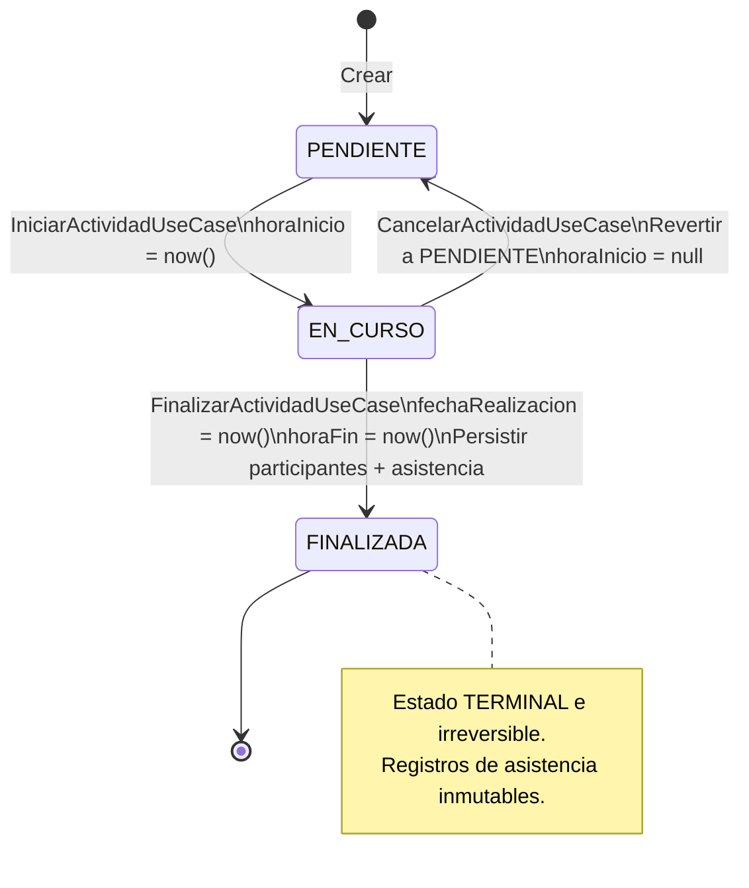
```mermaid
stateDiagram-v2
    [*] --> PENDIENTE : Crear
    PENDIENTE --> EN_CURSO : IniciarActividadUseCase\nhoraInicio = now()
    EN_CURSO --> PENDIENTE : CancelarActividadUseCase\nRevertir a PENDIENTE\nhoraInicio = null
    EN_CURSO --> FINALIZADA : FinalizarActividadUseCase\nfechaRealizacion = now()\nhoraFin = now()\nPersistir participantes + asistencia
    FINALIZADA --> [*]

    note right of FINALIZADA
        Estado TERMINAL e irreversible.
        Registros de asistencia inmutables.
    end note
```

**Reglas:**
- FINALIZADA es **terminal e irreversible**. Los registros de asistencia son inmutables una vez creados.
- La cancelación revierte a PENDIENTE y **resetea** `horaInicio` a su estado inicial, sin dejar valores residuales.
- Solo ejecuciones PENDIENTE pueden ser editadas.

### 10.2 Usuario — Ciclo de Activación

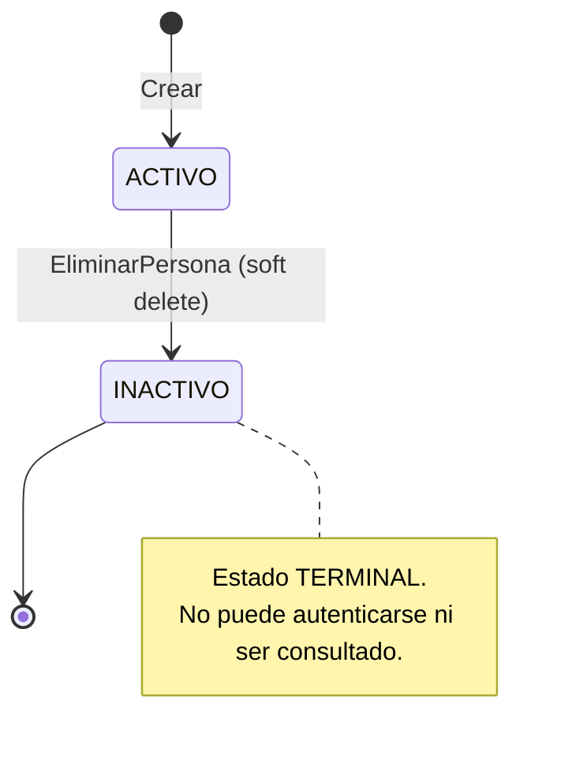
```mermaid
stateDiagram-v2
    [*] --> ACTIVO : Crear
    ACTIVO --> INACTIVO : EliminarPersona (soft delete)
    INACTIVO --> [*]

    note right of INACTIVO
        Estado TERMINAL.
        No puede autenticarse ni ser consultado.
    end note
```

**Efectos del estado INACTIVO:**
- No puede autenticarse (filtrado en `UsernamePwdAuthenticationProvider`).
- Invisible en todas las consultas.
- No puede modificar perfil ni recuperar contraseña.
- Sus actividades históricas permanecen vinculadas.

### 10.3 PeticiónRecuperaciónClave — Ciclo OTP

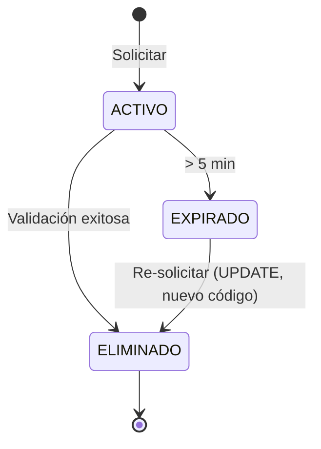
```mermaid
stateDiagram-v2
    [*] --> ACTIVO : Solicitar
    ACTIVO --> EXPIRADO : > 5 min
    ACTIVO --> ELIMINADO : Validación exitosa
    EXPIRADO --> ELIMINADO : Re-solicitar (UPDATE, nuevo código)
    ELIMINADO --> [*]
```

### 10.4 Sesión JWT — Ciclo de Autenticación

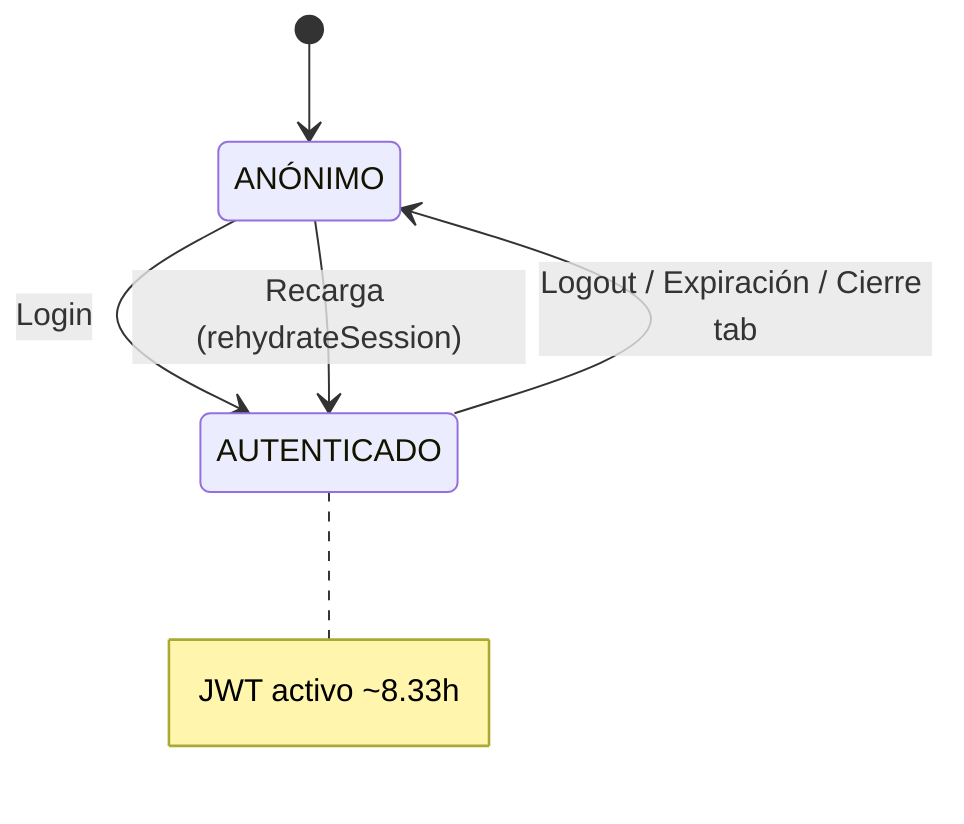
```mermaid
stateDiagram-v2
    [*] --> ANÓNIMO
    ANÓNIMO --> AUTENTICADO : Login
    AUTENTICADO --> ANÓNIMO : Logout / Expiración / Cierre tab
    ANÓNIMO --> AUTENTICADO : Recarga (rehydrateSession)

    note right of AUTENTICADO
        JWT activo ~8.33h
    end note
```

---

## 11. Vista de Despliegue

### 11.1 Topología de Despliegue

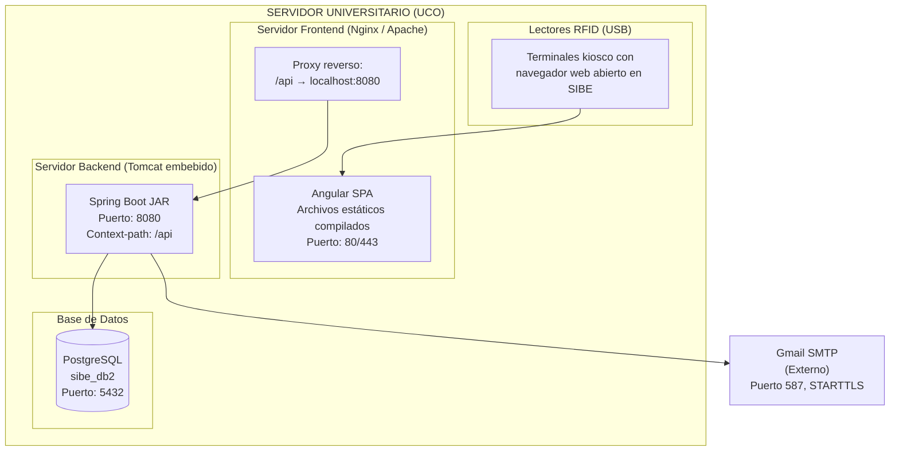
```mermaid
flowchart TD
    subgraph UCO["SERVIDOR UNIVERSITARIO (UCO)"]
        subgraph FE_SRV["Servidor Frontend (Nginx / Apache)"]
            SPA["Angular SPA\nArchivos estáticos compilados\nPuerto: 80/443"]
            PROXY["Proxy reverso:\n/api → localhost:8080"]
        end

        subgraph BE_SRV["Servidor Backend (Tomcat embebido)"]
            JAR["Spring Boot JAR\nPuerto: 8080\nContext-path: /api"]
        end

        subgraph DB_SRV["Base de Datos"]
            PG[("PostgreSQL\nsibe_db2\nPuerto: 5432")]
        end

        subgraph RFID_SRV["Lectores RFID (USB)"]
            RFID["Terminales kiosco con\nnavegador web abierto en SIBE"]
        end

        PROXY --> JAR
        JAR --> PG
        RFID --> SPA
    end

    GMAIL["Gmail SMTP\n(Externo)\nPuerto 587, STARTTLS"]
    JAR --> GMAIL
```

### 11.2 Configuración de Desarrollo

| Componente | Puerto | Configuración |
|------------|--------|---------------|
| Angular CLI dev server | 4200 | `proxy.conf.json`: `/api` → `localhost:8080` |
| Spring Boot (Tomcat) | 8080 | `server.servlet.context-path=/api` |
| PostgreSQL | 5432 | `sibe_db2` |
| H2 Console | (embebido) | Disponible para tests |

### 11.3 Configuraciones Pendientes para Producción

| Aspecto | Estado actual | Acción requerida |
|---------|---------------|------------------|
| CORS | Hardcoded `localhost:4200` | Externalizar a variable de entorno |
| JWT Secret | Hardcoded en `SeguridadConstante.java` | Mover a variable de entorno o vault |
| SMTP Credentials | En `application.properties` | Externalizar a variable de entorno |
| Admin Seed Password | En `DatoConstante.java` | Cambiar en primer despliegue |
| DDL Auto | `update` | Migrar a Flyway/Liquibase |
| `environment.prod.ts` | No existe | Crear con endpoint de producción |

---

## 12. Concerns Transversales

### 12.1 Transaccionalidad

| Aspecto | Implementación |
|---------|----------------|
| Declaración | `@Transactional` en interfaces de manejadores (`ManejadorComandoRespuesta`, etc.) |
| Escrituras | Transacción completa al nivel del handler; rollback automático ante excepción |
| Lecturas | `@Transactional(readOnly = true)` en interfaces de consulta |
| Atomicidad de carga masiva | Un archivo Excel = una transacción atómica; fallo parcial revierte todo |
| Lazy loading JPA | `spring.jpa.open-in-view=false` — sin Open Session in View |

### 12.2 Procesamiento de Archivos Excel

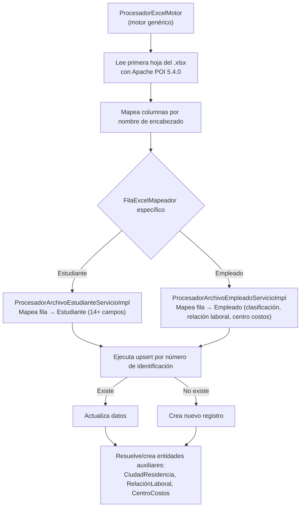
```mermaid
flowchart TD
    A["ProcesadorExcelMotor\n(motor genérico)"] --> B["Lee primera hoja del .xlsx\ncon Apache POI 5.4.0"]
    B --> C["Mapea columnas por nombre de encabezado"]
    C --> D{"FilaExcelMapeador específico"}
    D -->|Estudiante| E["ProcesadorArchivoEstudianteServicioImpl\nMapea fila → Estudiante (14+ campos)"]
    D -->|Empleado| F["ProcesadorArchivoEmpleadoServicioImpl\nMapea fila → Empleado (clasificación, relación laboral, centro costos)"]
    E --> G["Ejecuta upsert por número de identificación"]
    F --> G
    G -->|Existe| H["Actualiza datos"]
    G -->|No existe| I["Crea nuevo registro"]
    H --> J["Resuelve/crea entidades auxiliares:\nCiudadResidencia, RelaciónLaboral, CentroCostos"]
    I --> J
```

### 12.3 Envío de Correo Electrónico

| Aspecto | Detalle |
|---------|---------|
| Habilitación | `@EnableAsync` en la clase principal |
| Implementación | `EnviarCorreoElectronicoServiceMailSender` implementa `EnviarCorreoElectronicoService` (puerto de dominio) |
| Tecnología | `JavaMailSender` (Spring Mail) |
| Servidor | SMTP Gmail, puerto 587, STARTTLS |
| Caso de uso | Envío de código OTP de recuperación de contraseña |

### 12.4 Generación de UUIDs

```java
UtilUUID.generar(Predicate<UUID> verificadorExistencia)
// Loop anti-colisión: genera UUID aleatorio, verifica contra repositorio,
// repite si ya existe. Garantiza unicidad a nivel de aplicación.
```

### 12.5 Siembra de Datos de Referencia (DataLoaders)

| Orden | DataLoader | Datos |
|:-----:|------------|-------|
| 1 | `TipoUsuarioDataLoader` | ADMINISTRADOR_DIRECCION, ADMINISTRADOR_AREA, COLABORADOR |
| 2 | `TipoIdentificacionDataLoader` | CC, TI, Pasaporte, etc. |
| 3 | `TipoIndicadorDataLoader` | Tipos de indicador |
| 4 | `TemporalidadDataLoader` | Mensual, Semestral, Anual |
| 5 | `EstadoActividadDataLoader` | Pendiente, En Curso, Finalizada |
| 6 | `PublicoInteresDataLoader` | Públicos de interés |
| 7 | `DireccionDataLoader` | Dirección de Bienestar y Evangelización |
| 8 | `AreaDataLoader` | 4 áreas |
| 9 | `SubareaDataLoader` | 8+ subáreas |
| 10 | `UsuarioAdministradorDataLoader` | Usuario administrador inicial |

### 12.6 Generación de Reportes Excel (Frontend)

- **Tecnología:** SheetJS (`xlsx` 0.18.5) ejecutado en el navegador.
- **Servicio:** `ExcelReportService` consume datos de `DepartmentService`, `AreaService`, `SubAreaService`.
- **Salida:** Archivo `.xlsx` descargado directamente sin roundtrip al backend.
- **Estructura:** Filas por Dirección/Área/Subárea/Actividad/Ejecución/Participante.

### 12.7 Dashboards y Visualización

- **Tecnología:** Chart.js 4.5.0 + chartjs-plugin-datalabels 2.2.0.
- **Componentes:** `TotalParticipantsComponent`, `CompletedActivitiesComponent`, `TotalParticipantsMonthsComponent`.
- **Filtros dinámicos:** Año, semestre, mes, programa académico, centro de costos, relación laboral, indicador estratégico, nivel de formación.
- **Datos:** Solo ejecuciones FINALIZADA son contabilizadas.

---

## 13. Decisiones Arquitectónicas (ADRs)

### DA-01 — Arquitectura Hexagonal con Puertos y Adaptadores

| Aspecto | Detalle |
|---------|---------|
| **Decisión** | Backend en 3 capas: `dominio` (modelos, puertos, use cases, reglas) → `aplicación` (handlers, fábricas, comandos) → `infraestructura` (controladores, DAOs, seguridad, config) |
| **Alternativas descartadas** | Arquitectura tradicional por capas (acoplamiento dominio-infra); Clean Architecture pura (ceremonia excesiva para el alcance) |
| **Medida de éxito** | 0 imports de Spring/JPA en paquetes `dominio` |
| **Drivers** | AC-07 Mantenibilidad, RT-11, DN-10 |

### DA-02 — CQRS Estructural en Todas las Capas

| Aspecto | Detalle |
|---------|---------|
| **Decisión** | Separar controladores, handlers, puertos y use cases en paquetes `comando` y `consulta` en cada capa |
| **Alternativas descartadas** | Controlador único por recurso; CQRS con event sourcing (complejidad innecesaria) |
| **Drivers** | AC-08, RT-12 |

### DA-03 — Transacciones Declarativas en Interfaces de Handler

| Aspecto | Detalle |
|---------|---------|
| **Decisión** | `@Transactional` en la interfaz `ManejadorComandoRespuesta<C,R>.ejecutar()`; `@Transactional(readOnly=true)` en interfaces de consulta |
| **Alternativas descartadas** | `@Transactional` en use cases (acoplaría dominio a Spring); en repositorios (granularidad insuficiente) |
| **Drivers** | AC-12, AC-07, RT-13 |

### DA-04 — Motor de Validación por Operación (MotoresFabrica)

| Aspecto | Detalle |
|---------|---------|
| **Decisión** | Centralizar reglas de validación en motores estáticos pre-construidos en `MotoresFabrica`, ejecutados por `TipoOperacion` CREAR/MODIFICAR |
| **Alternativas descartadas** | Spring Validation en controladores; validación ad-hoc por use case |
| **Motores** | 13 motores (uno por entidad principal) con 28 implementaciones de `Regla` |
| **Drivers** | AC-07, AC-06 |

### DA-05 — Generación de UUID con Loop Anti-Colisión

| Aspecto | Detalle |
|---------|---------|
| **Decisión** | `UtilUUID.generar(Predicate<UUID>)` verifica existencia en repositorio antes de asignar |
| **Drivers** | AC-07, AC-11 |

### DA-06 — Seguridad Stateless con JWT + HTTP Basic

| Aspecto | Detalle |
|---------|---------|
| **Decisión** | Autenticación inicial vía HTTP Basic; JWT firmado con HMAC-SHA256 conteniendo claims de identidad, rol y contexto organizacional |
| **Alternativas descartadas** | Sesiones servidor; OAuth2/OIDC (infraestructura excesiva) |
| **Claims** | email, id, authorities, rol, direccionId, areaId, subareaId |
| **Expiración** | ~8.33 horas |
| **Drivers** | AC-04, RT-09, RT-10 |

### DA-07 — Autorización de Doble Capa (Rol + Contexto Organizacional)

| Aspecto | Detalle |
|---------|---------|
| **Decisión** | Capa 1: `@PreAuthorize` con SpEL en controladores; Capa 2: `AutorizacionContextoOrganizacionalServicio` en use cases verificando pertenencia organizacional |
| **Alternativas descartadas** | RBAC simple; Spring Security ACL; Row-level security en BD |
| **Drivers** | AC-05, AC-14 |

### DA-08 — Eliminación Lógica de Usuarios (Soft Delete)

| Aspecto | Detalle |
|---------|---------|
| **Decisión** | Campo `estaActivo` booleano; usuarios inactivos filtrados en todas las consultas |
| **Efecto** | Preservación del historial de actividades asociadas |
| **Drivers** | AC-11 |

### DA-09 — Datos de Referencia Sembrados por DataLoaders

| Aspecto | Detalle |
|---------|---------|
| **Decisión** | `CommandLineRunner` con `@Order` para pre-poblar datos de referencia; `hibernate.ddl-auto=update` |
| **Alternativas descartadas** | Flyway/Liquibase (no implementado); SQL scripts manuales; `data.sql` |
| **Drivers** | RT-05, DN-10 |

### DA-10 — Frontend Core/Shared/Feature con Lazy Loading

| Aspecto | Detalle |
|---------|---------|
| **Decisión** | `CoreModule` (singleton, guards, interceptors, layout); `SharedModule` (componentes reutilizables); Feature modules (lazy-loaded por ruta) |
| **Regla** | Feature → Core/Shared ✅; Feature → Feature ❌ |
| **Profundidad** | Hasta 3 niveles de lazy loading (App → Home → Area → SubArea) |
| **Drivers** | AC-09, AC-01, RT-04 |

### DA-11 — Estado Frontend con BehaviorSubject + sessionStorage

| Aspecto | Detalle |
|---------|---------|
| **Decisión** | `StateService` centralizado con `BehaviorSubject`; rehidratación desde `sessionStorage`; sin NgRx |
| **Seguridad** | `sessionStorage` se destruye al cerrar pestaña |
| **Drivers** | AC-04, DN-06 |

### DA-12 — Interceptores HTTP Duales en Frontend

| Aspecto | Detalle |
|---------|---------|
| **Decisión** | `AuthInterceptor` (inyecta credenciales Basic o Bearer JWT); `TokenInterceptor` (verifica expiración, fuerza logout) |
| **Drivers** | AC-04, DA-06 |

### DA-13 — Motor de Procesamiento Excel Reutilizable

| Aspecto | Detalle |
|---------|---------|
| **Decisión** | `ProcesadorExcelMotor` genérico con `FilaExcelMapeador<T>`; implementaciones específicas para estudiantes y empleados |
| **Drivers** | AC-13, RT-14 |

### DA-14 — Manejo Centralizado de Excepciones

| Aspecto | Detalle |
|---------|---------|
| **Decisión** | `@ControllerAdvice` con mapa estático excepción→HTTP code; `ExceptionFilter` para errores en cadena de filtros |
| **Drivers** | AC-07, AC-06 |

### DA-15 — CORS Restringido a Origen Conocido

| Aspecto | Detalle |
|---------|---------|
| **Decisión** | `setAllowedOrigins("http://localhost:4200")`; `AllowCredentials(true)`; expone header `Authorization` |
| **Drivers** | AC-06, RT-07 |

### DA-16 — API Stateless con CSRF Deshabilitado

| Aspecto | Detalle |
|---------|---------|
| **Decisión** | `csrf.disable()` + `SessionCreationPolicy.STATELESS` |
| **Justificación** | JWT en header `Authorization` no es auto-enviado por el navegador; CSRF irrelevante |
| **Drivers** | AC-06 |

### DA-17 — Guards con Validación de Rol en Frontend

| Aspecto | Detalle |
|---------|---------|
| **Decisión** | `securityGuard` valida JWT y mapea rutas restringidas a roles permitidos; `publicRouteGuard` redirige usuarios autenticados |
| **Mapa de roles** | `/gestionar-direccion` → ADMIN_DIRECCION; `/gestionar-usuarios` → ADMIN_DIRECCION; `/gestionar-indicadores` → ADMIN_DIRECCION |
| **Drivers** | AC-01, AC-05 |

### DA-18 — Chart.js para Dashboards + xlsx para Exportación Excel en Cliente

| Aspecto | Detalle |
|---------|---------|
| **Decisión** | Chart.js 4.5.0 para visualización; xlsx 0.18.5 para generación de Excel sin roundtrip al backend |
| **Drivers** | DN-02 |

---

## 14. Atributos de Calidad

### 14.1 Escenarios de Calidad (Modelo SEI/Bass)

| ID | Atributo | Estímulo | Medida | Estado |
|----|----------|----------|--------|--------|
| AC-01 | **Usabilidad** | Usuario navega a cualquier módulo principal | ≤ 3 clics desde home | Implementado |
| AC-02 | **Rendimiento** | Usuario autenticado navega, datos se cargan | < 2 segundos con ≤ 200 usuarios concurrentes | Diseñado |
| AC-03 | **Disponibilidad** | Comunidad accede durante periodo académico | 99.9% uptime (excluyendo mantenimiento) | Diseñado |
| AC-04 | **Seguridad — Authn** | Intento de acceso no autenticado | Solo credenciales de usuario activo obtienen JWT; BCrypt; TLS 1.3+ | Implementado |
| AC-05 | **Seguridad — Authz** | Usuario opera sobre un recurso | `@PreAuthorize` (rol) + `AutorizacionContextoOrganizacional` (contexto); 0 bypasses | Implementado |
| AC-06 | **Seguridad — OWASP** | Intento SQL injection, XSS, CSRF | 0 vulnerabilidades explotables OWASP Top 10 | Parcialmente implementado |
| AC-07 | **Mantenibilidad — Hexagonal** | Cambio en lógica de negocio o infraestructura | 0 imports Spring/JPA en `dominio`; use cases via `@Configuration` | Implementado |
| AC-08 | **Mantenibilidad — CQRS** | Modificar lógica de escritura sin afectar lectura | Rutas comando/consulta independientes en todas las capas | Implementado |
| AC-09 | **Mantenibilidad — Frontend** | Agregar/modificar un dominio funcional | Cambios confinados al Feature module afectado; Core y Shared sin impacto | Implementado |
| AC-10 | **Testabilidad** | CI ejecuta suite de tests | JUnit 5 + JaCoCo (backend); Karma + Jasmine (frontend) | Implementado |
| AC-11 | **Integridad de datos** | Registro de asistencia | Registros inmutables; eliminación de usuario es lógica (soft delete) | Implementado |
| AC-12 | **Confiabilidad** | Fallo parcial durante comando multi-paso | `@Transactional` en handler garantiza rollback; cargas masivas atómicas | Implementado |
| AC-13 | **Escalabilidad** | Carga semestral de Excel | Procesamiento completo sin degradación; Apache POI 5.4.0 | Implementado |
| AC-14 | **Confidencialidad** | Usuario accede datos de otra unidad org. | HTTP 403; 0 fugas entre unidades organizacionales | Implementado |

---

## 15. Restricciones Técnicas

| ID | Restricción | Implementación |
|----|-------------|----------------|
| RT-01 | Solo web, sin mobile nativo | Angular SPA |
| RT-02 | Java 17 mínimo | `build.gradle: JavaLanguageVersion.of(17)` |
| RT-03 | Spring Boot 3.5.0 | `build.gradle` |
| RT-04 | Angular 16.2.x | `package.json: "@angular/core": "^16.2.0"` |
| RT-05 | PostgreSQL en producción | `jdbc:postgresql://localhost:5432/sibe_db2` |
| RT-06 | H2 para desarrollo/test | `runtimeOnly 'com.h2database:h2'` |
| RT-07 | Despliegue en servidores internos UCO | CORS configurado para `localhost:4200` |
| RT-08 | Lectores RFID como periférico requerido | Flujo de asistencia por carnet; fallback por documento |
| RT-09 | JWT con HMAC-SHA256 stateless | `JWTTokenGeneratorFilter` con JJWT 0.11.2 |
| RT-10 | BCrypt para passwords y OTP | `EncriptarClaveServicio` + `BCryptPasswordEncoder` |
| RT-11 | Arquitectura Hexagonal en backend | Paquetes `dominio`, `aplicación`, `infraestructura` |
| RT-12 | CQRS como patrón de separación | Paquetes `comando` / `consulta` separados |
| RT-13 | Use cases via `@Configuration`, no component scan | `UseCaseBean.java` con `@Bean` explícito |
| RT-14 | Apache POI 5.4.0 para Excel | `implementation 'org.apache.poi:poi-ooxml:5.4.0'` |
| RT-15 | Spring Mail para correo institucional | SMTP Gmail puerto 587 |

---

## 16. Estructura del Proyecto

### 17.1 Backend — Paquetes principales

```
co.edu.uco.sibe/
├── Application.java (@SpringBootApplication, @EnableAsync)
├── aplicacion/
│   ├── comando/                    22 command POJOs (DTOs de entrada)
│   │   ├── fabrica/                Fábricas de transformación
│   │   └── manejador/              29 manejadores de comando
│   ├── consulta/                   54 manejadores de consulta
│   ├── puerto/servicio/            Puertos de servicio de aplicación
│   └── transversal/
│       ├── ComandoRespuesta.java   Wrapper genérico de respuesta
│       └── manejador/              4 interfaces handler con @Transactional
├── dominio/
│   ├── dto/                        30 DTOs de consulta
│   ├── enums/                      TipoArea, TipoInterno, TipoParticipante, TipoPrograma
│   ├── modelo/                     33 modelos de dominio (inmutables, construir())
│   ├── puerto/
│   │   ├── comando/                19 puertos de repositorio de comando
│   │   ├── consulta/               24 puertos de repositorio de consulta
│   │   └── servicio/               3 puertos de servicio (Encriptar, Correo, Contexto)
│   ├── regla/                      28 reglas + MotorRegla + MotoresFabrica
│   ├── service/                    7 servicios de dominio
│   ├── transversal/
│   │   ├── constante/              12 clases de constantes
│   │   ├── excepcion/              8 excepciones personalizadas
│   │   └── utilitarios/            5 clases de utilidades
│   └── usecase/
│       ├── comando/                30 use cases de escritura
│       └── consulta/               34 use cases de lectura
└── infraestructura/
    ├── adaptador/
    │   ├── dao/                    43 interfaces JpaRepository
    │   ├── entidad/                44 entidades JPA (@Entity)
    │   ├── mapeador/               44 mapeadores (Entidad ↔ Modelo/DTO)
    │   ├── repositorio/
    │   │   ├── comando/            19 implementaciones de puertos de escritura
    │   │   └── consulta/           24 implementaciones de puertos de lectura
    │   └── servicio/               6 implementaciones de puertos de servicio
    ├── configuracion/
    │   ├── bean/                   UseCaseBean, ServiceBean, EncriptarClaveBean
    │   └── dataloader/             10 DataLoaders + fábrica
    ├── controlador/
    │   ├── LoginControlador.java
    │   ├── comando/                6 controladores de comando
    │   └── consulta/               15 controladores de consulta
    ├── error/                      ManejadorError (@ControllerAdvice) + Error record
    └── seguridad/
        ├── configuration/          ProjectSecurityConfig, AuthenticationProvider
        └── filter/                 6 filtros de seguridad
```

### 17.2 Frontend — Estructura de Módulos

```
src/app/
├── app.module.ts                   Módulo raíz
├── app-routing.module.ts           Rutas raíz (lazy loading)
├── app.component.ts/html/scss      Componente raíz (router-outlet)
├── core/
│   ├── core.module.ts              Singleton (guards, interceptors, layout)
│   ├── guard/                      security.guard.ts, public-route.guard.ts
│   ├── interceptor/                auth-interceptor.ts, token-interceptor.ts, manejador-error.ts
│   ├── model/                      usuario.model.ts, menu-item.model.ts, options.model.ts
│   └── service/                    http.service.ts (base para todos los servicios)
├── shared/
│   ├── shared.module.ts            Componentes y servicios reutilizables
│   ├── components/                 18 componentes compartidos
│   ├── model/                      20+ interfaces (Request/Response)
│   └── service/                    11 servicios (providedIn: root)
└── feature/
    ├── login/                      LoginModule (lazy, publicRouteGuard)
    ├── password-recovery/          PasswordRecoveryModule (lazy, publicRouteGuard)
    ├── home/                       HomeModule (lazy, securityGuard)
    │   ├── components/             Dashboard, filtros, estadísticas
    │   └── [area modules]/         4 áreas (lazy nivel 2)
    │       └── [subarea modules]/  8 subáreas bajo Bienestar (lazy nivel 3)
    ├── manage-department/          ManageDepartmentModule (lazy, securityGuard)
    ├── manage-users/               ManageUsersModule (lazy, securityGuard)
    └── manage-indicators/          ManageIndicatorsModule (lazy, securityGuard)
```

---

## 17. Métricas de Cobertura y Testing

### 18.1 Backend (JUnit 5 + JaCoCo)

| Área de prueba | Cantidad | Tipo |
|----------------|:--------:|------|
| Use cases de comando | 30 | Unitario |
| Use cases de consulta | 34 | Unitario |
| Reglas de dominio | 28 | Unitario |
| Manejadores de comando | 29 | Unitario |
| Controladores de comando | 6 | Slice (MockMvc) |
| Controladores de consulta | 15 + Login | Slice (MockMvc) |
| Test data builders | 8 | Soporte |
| Integración | 1 (context load) | Integración |
| **Total estimado** | **~151** | — |

**Patrón de testing:** Test Data Builder + Arrange-Act-Assert (3A).

**Cobertura:** JaCoCo genera reportes en HTML, XML y CSV bajo `build/jacocoHtml/`.

### 18.2 Frontend (Karma + Jasmine)

- Configuración basada en Angular CLI estándar.
- Cobertura disponible bajo `coverage/sibe-frontend/`.

---

## 18. Trazabilidad con Artefactos del Proyecto

| Artefacto fuente | Elementos utilizados en este documento |
|-------------------|-----------------------------------------|
| [1. Visión](./1.vision.md) | Contexto del sistema, stakeholders, alternativas reemplazadas |
| [4. Modelo de Procesos del Negocio](./4.modelo_de_procesos_del_negocio.md) | Estructura organizacional, procesos operacionales, ciclo de vida de actividades |
| [5. Modelo de Dominio](./5.modelo_de_dominio_anemico.md) | Subdominios, entidades, relaciones, reglas de dominio |
| [15. Requerimientos](./15.requerimientos.md) | RF, RNF, RN → Atributos de calidad y restricciones técnicas |
| [17. Flujo de Transacciones](./17.flujo_de_transacciones_en_diagramas_de_actividades.md) | Flujos de autenticación y gestión de usuarios |
| [18. Flujo de Estados](./18.flujo_de_estados_en_diagramas_de_estado.md) | Máquinas de estados de EjecuciónActividad, Usuario, OTP, JWT |
| [19. Drivers Arquitectónicos](./19.drivers_arquitectonicos.md) | Drivers de negocio, ADRs, atributos de calidad, riesgos |
| [20. Alternativas de Solución](./20.alternativas_de_solucion.md) | Justificación de la solución a medida |
| [Coding Standards](../architecture/coding-standards.md) | Convenciones de nomenclatura y estándares de código |
