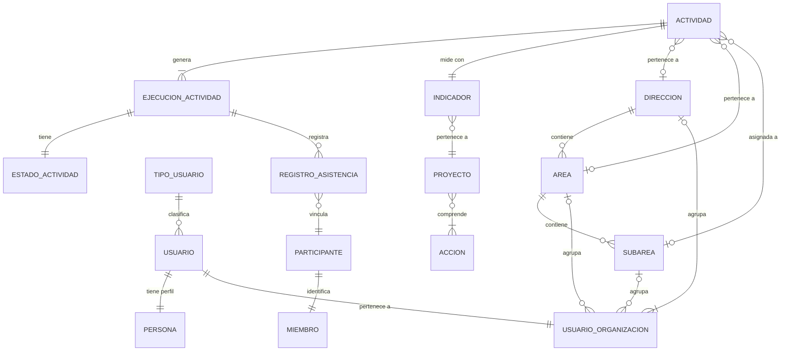
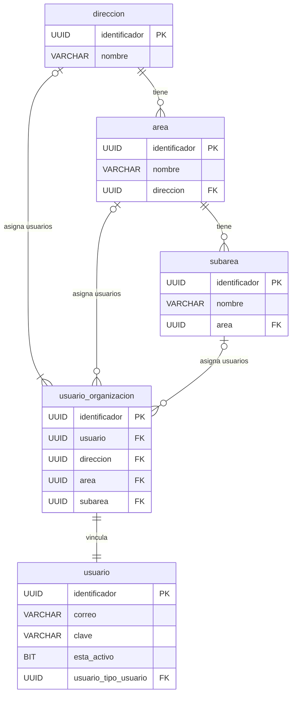
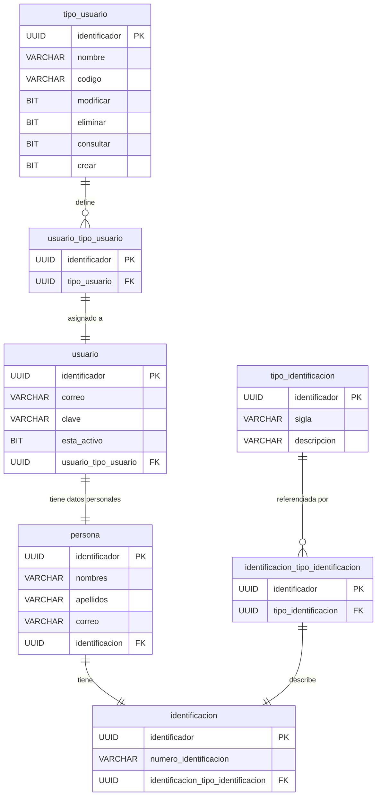
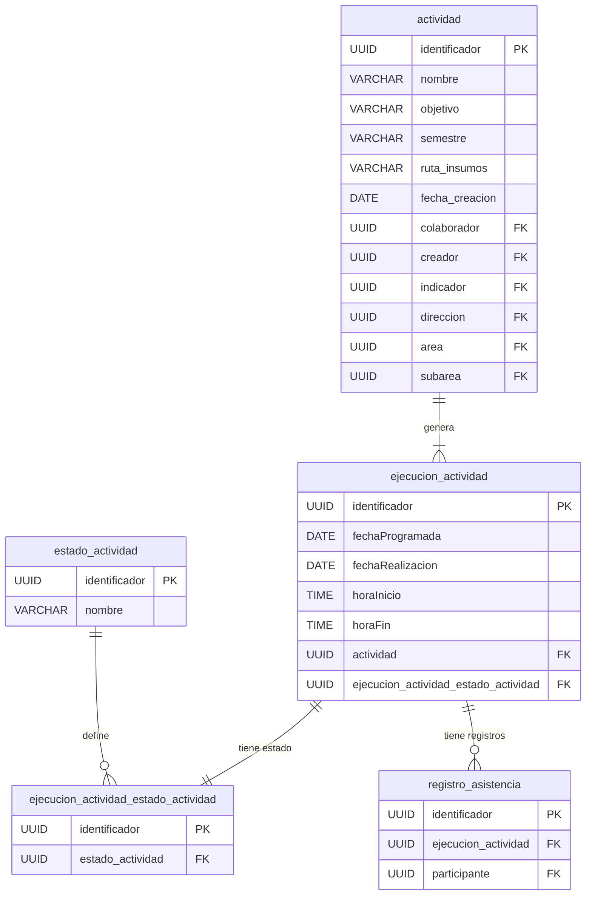
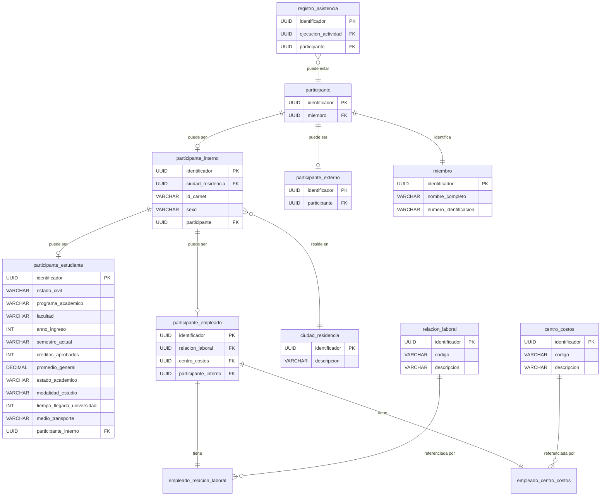
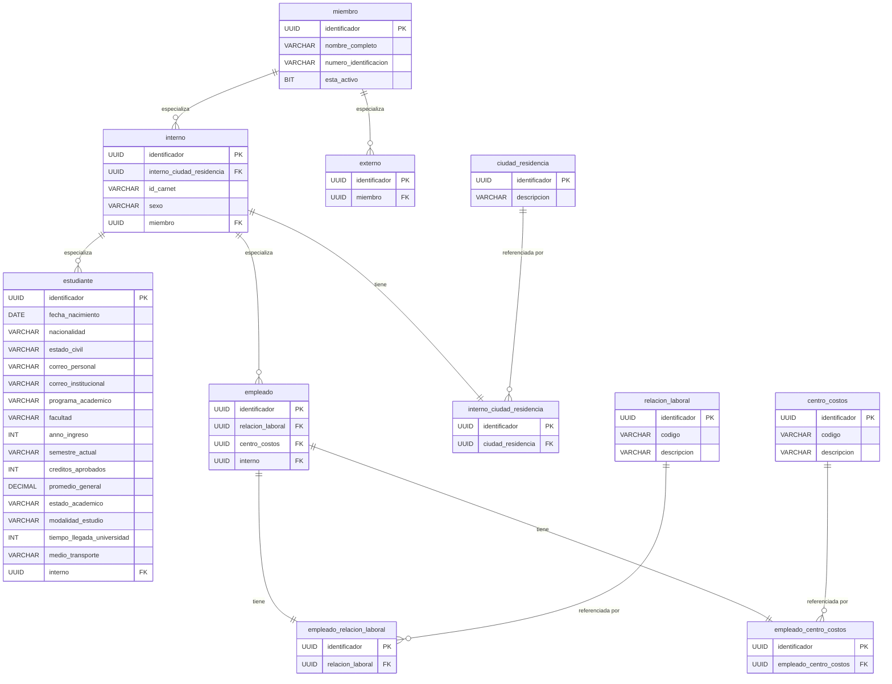
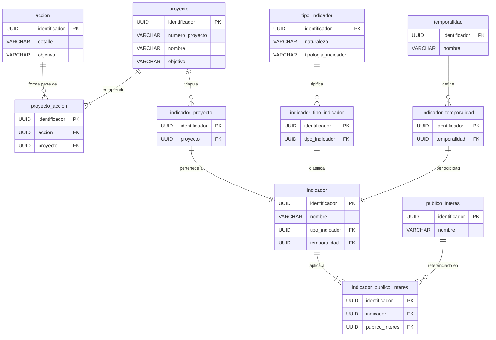

# Artefacto 24 — Diagrama del Modelo Entidad-Relación

| Campo | Detalle |
|-------|---------|
| **Proyecto** | SIBE — Sistema de Información de Bienestar y Evangelización |
| **Tipo** | Diagrama del Modelo Entidad-Relación (MER) |
| **Versión** | 1.0.0 |
| **Fecha** | 2026-03-27 |
| **Origen** | Migrado desde `docs/deprecated_docs/Diagrama entidad relacion.drawio` |
| **Herramienta original** | draw.io 29.6.1 — diagrama ER con notación crow's foot |

---

## Tabla de Contenidos

1. [Introducción](#1-introducción)
2. [Resumen de Entidades por Dominio](#2-resumen-de-entidades-por-dominio)
3. [Vista General del Modelo (Nivel Conceptual)](#3-vista-general-del-modelo-nivel-conceptual)
4. [Diagramas Detallados por Dominio](#4-diagramas-detallados-por-dominio)
   - [4.1 Dominio: Estructura Organizacional](#41-dominio-estructura-organizacional)
   - [4.2 Dominio: Usuarios e Identificación](#42-dominio-usuarios-e-identificación)
   - [4.3 Dominio: Actividades y Ejecuciones](#43-dominio-actividades-y-ejecuciones)
   - [4.4 Dominio: Participantes y Registro de Asistencia](#44-dominio-participantes-y-registro-de-asistencia)
   - [4.5 Dominio: Miembros (Base de Datos Institucional)](#45-dominio-miembros-base-de-datos-institucional)
   - [4.6 Dominio: Indicadores, Proyectos y Acciones](#46-dominio-indicadores-proyectos-y-acciones)
5. [Catálogo Completo de Entidades](#5-catálogo-completo-de-entidades)
6. [Inventario de Relaciones](#6-inventario-de-relaciones)
7. [Leyenda de Notación](#7-leyenda-de-notación)

---

## 1. Introducción

Este artefacto documenta el **Modelo Entidad-Relación (MER)** del sistema SIBE, migrado desde el diagrama original en formato draw.io a formato Markdown con diagramas Mermaid. Describe la estructura de datos persistente del sistema: las 43 entidades que componen el esquema relacional, sus atributos, claves primarias (PK), claves foráneas (FK) y las 48 relaciones que las conectan.

El modelo está organizado en **seis dominios funcionales** que reflejan los bounded contexts del sistema:

| Dominio | Propósito |
|---------|-----------|
| **Estructura Organizacional** | Dirección, Áreas y Subáreas de Bienestar; vinculación de usuarios a la jerarquía |
| **Usuarios e Identificación** | Credenciales de acceso, datos personales y tipos de identificación |
| **Actividades y Ejecuciones** | Planificación y ejecución de actividades con máquina de estados |
| **Participantes y Asistencia** | Registro de asistentes con sus perfiles (estudiante, empleado, externo) |
| **Miembros** | Base de datos institucional UCO de estudiantes y empleados activos |
| **Indicadores, Proyectos y Acciones** | Jerarquía estratégica para vinculación con el plan de desarrollo institucional |

> **Nota técnica:** Todas las claves primarias (`identificador`) son de tipo `UUID` generado por la aplicación. El esquema relacional es gestionado automáticamente por Hibernate con `ddl-auto=update`.

---

## 2. Resumen de Entidades por Dominio

| # | Entidad | Dominio | Tipo |
|---|---------|---------|------|
| 1 | `direccion` | Organización | Maestra |
| 2 | `area` | Organización | Maestra |
| 3 | `subarea` | Organización | Maestra |
| 4 | `usuario_organizacion` | Organización | Asociación (join) |
| 5 | `usuario` | Usuarios | Principal |
| 6 | `persona` | Usuarios | Extensión 1:1 |
| 7 | `tipo_usuario` | Usuarios | Catálogo |
| 8 | `usuario_tipo_usuario` | Usuarios | Asociación |
| 9 | `identificacion` | Identificación | Detalle |
| 10 | `tipo_identificacion` | Identificación | Catálogo |
| 11 | `identificacion_tipo_identificacion` | Identificación | Asociación |
| 12 | `actividad` | Actividades | Principal |
| 13 | `ejecucion_actividad` | Actividades | Detalle |
| 14 | `estado_actividad` | Actividades | Catálogo |
| 15 | `ejecucion_actividad_estado_actividad` | Actividades | Asociación |
| 16 | `registro_asistencia` | Asistencia | Transaccional |
| 17 | `participante` | Asistencia | Principal |
| 18 | `participante_interno` | Asistencia | Especialización |
| 19 | `participante_externo` | Asistencia | Especialización |
| 20 | `participante_estudiante` | Asistencia | Especialización |
| 21 | `participante_empleado` | Asistencia | Especialización |
| 22 | `miembro` | Miembros | Principal |
| 23 | `interno` | Miembros | Especialización |
| 24 | `externo` | Miembros | Especialización |
| 25 | `estudiante` | Miembros | Especialización |
| 26 | `empleado` | Miembros | Especialización |
| 27 | `ciudad_residencia` | Miembros | Catálogo |
| 28 | `interno_ciudad_residencia` | Miembros | Asociación |
| 29 | `relacion_laboral` | Miembros | Catálogo |
| 30 | `empleado_relacion_laboral` | Miembros | Asociación |
| 31 | `centro_costos` | Miembros | Catálogo |
| 32 | `empleado_centro_costos` | Miembros | Asociación |
| 33 | `indicador` | Indicadores | Principal |
| 34 | `tipo_indicador` | Indicadores | Catálogo |
| 35 | `temporalidad` | Indicadores | Catálogo |
| 36 | `publico_interes` | Indicadores | Catálogo |
| 37 | `proyecto` | Indicadores | Principal |
| 38 | `accion` | Indicadores | Principal |
| 39 | `proyecto_accion` | Indicadores | Asociación |
| 40 | `indicador_tipo_indicador` | Indicadores | Asociación |
| 41 | `indicador_temporalidad` | Indicadores | Asociación |
| 42 | `indicador_proyecto` | Indicadores | Asociación |
| 43 | `indicador_publico_interes` | Indicadores | Asociación |

---

## 3. Vista General del Modelo (Nivel Conceptual)

El siguiente diagrama muestra las **entidades principales** y sus relaciones directas, omitiendo las tablas de asociación intermedias para mayor legibilidad. Representa la vista conceptual del modelo de negocio.



---

## 4. Diagramas Detallados por Dominio

### 4.1 Dominio: Estructura Organizacional

Modela la jerarquía institucional de la Dirección de Bienestar y Evangelización de la UCO y la vinculación de usuarios a sus nodos.



**Descripción de relaciones:**

| Relación | Cardinalidad | Descripción |
|----------|-------------|-------------|
| `direccion` → `area` | 1:N | Una dirección tiene una o muchas áreas |
| `area` → `subarea` | 0:N | Un área tiene cero o muchas subáreas |
| `direccion` → `usuario_organizacion` | 1:N | Una dirección agrupa muchos registros de asignación |
| `area` → `usuario_organizacion` | 0:N | Un área agrupa cero o muchos registros de asignación |
| `subarea` → `usuario_organizacion` | 0:N | Una subárea agrupa cero o muchos registros de asignación |
| `usuario_organizacion` → `usuario` | 1:1 | Cada asignación referencia exactamente un usuario |

---

### 4.2 Dominio: Usuarios e Identificación

Modela las credenciales de acceso al sistema, los datos personales de los usuarios y el tipo de documento de identidad.



**Descripción de relaciones:**

| Relación | Cardinalidad | Descripción |
|----------|-------------|-------------|
| `tipo_usuario` → `usuario_tipo_usuario` | 0:N | Un tipo usuario puede asignarse a muchos usuarios |
| `usuario_tipo_usuario` → `usuario` | 1:1 | Un usuario solo puede ser de un tipo |
| `usuario` → `persona` | 1:1 | Cada usuario tiene exactamente una persona asociada |
| `persona` → `identificacion` | 1:1 | Cada persona tiene exactamente un documento de identidad |
| `tipo_identificacion` → `identificacion_tipo_identificacion` | 0:N | Un tipo identificación puede asignarse a muchas identificaciones |
| `identificacion_tipo_identificacion` → `identificacion` | 1:1 | Una identificación solo puede ser de un tipo |

---

### 4.3 Dominio: Actividades y Ejecuciones

Modela el ciclo de vida de las actividades de bienestar: planificación, múltiples fechas de ejecución, estado de cada ejecución y registro de asistencia.



**Máquina de estados de `ejecucion_actividad`:**

```
PENDIENTE ──[iniciar]──▶ EN_CURSO ──[finalizar + participantes]──▶ FINALIZADA
                                  └──[cancelar]──▶ PENDIENTE
```

**Nota sobre `actividad`:**
- `colaborador` y `creador` son FKs a la tabla `usuario`.
- `indicador`, `direccion`, `area`, `subarea` son FKs a sus respectivas tablas.
- Una actividad puede tener múltiples fechas programadas; cada fecha genera un registro `ejecucion_actividad`.

---

### 4.4 Dominio: Participantes y Registro de Asistencia

Modela la jerarquía de especialización de los participantes que asisten a las ejecuciones de actividades. Se utiliza el patrón de herencia de tabla por tipo (TPT — Table Per Type).



**Jerarquía de participantes:**

```
participante (puede ser interno o externo)
├── participante_interno (con carnet UCO y ciudad de residencia)
│   ├── participante_estudiante (datos académicos completos)
│   └── participante_empleado (relación laboral y centro de costos)
│       ├── empleado_relacion_laboral → relacion_laboral
│       └── empleado_centro_costos → centro_costos
└── participante_externo (persona sin vínculo UCO)
```

**Importante:** La tabla `registro_asistencia` actúa como **snapshot inmutable** del participante al momento del registro. Una vez registrada la asistencia, los datos del participante no se modifican retroactivamente.

---

### 4.5 Dominio: Miembros (Base de Datos Institucional)

Modela la base de datos de estudiantes y empleados activos de la UCO, cargados semestralmente desde archivos Excel. Es la fuente de consulta para identificar participantes en el registro de asistencia.



**Jerarquía de especialización de miembros:**

```
miembro (nombre completo, número de identificación)
├── interno (con carnet UCO y ciudad de residencia)
│   ├── estudiante (datos académicos completos, 16 atributos)
│   └── empleado (relación laboral y centro de costos)
└── externo (persona sin vínculo UCO)
```

**Proceso de carga masiva:** Esta base de datos se actualiza semestralmente mediante carga de archivos `.xlsx` desde los sistemas académicos y de nómina de la UCO. El proceso es idempotente (upsert por `numero_identificacion`).

---

### 4.6 Dominio: Indicadores, Proyectos y Acciones

Modela la jerarquía estratégica del plan de desarrollo institucional, que vincula las actividades operativas con los indicadores de gestión y con los proyectos y acciones del plan UCO.



**Jerarquía estratégica:**

```
PROYECTO (numero_proyecto, nombre, objetivo)
└── ACCION (detalle, objetivo)  [M:N via proyecto_accion]
    └── INDICADOR (nombre, tipo, temporalidad)
        └── ACTIVIDAD  [FK indicador en actividad]
```

**Catálogos del dominio:**

| Catálogo | Valores (sembradores) |
|----------|----------------------|
| `tipo_indicador` | Eficiencia, Capacidad Instalada, Eficacia, Efectividad, Valor |
| `temporalidad` | Diaria, Semanal, Mensual, Trimestral, Semestral, Anual |
| `publico_interes` | Registros Calificados, Acreditación, ISO, Ministerio de Educación, Plan Pastoral |

---

## 5. Catálogo Completo de Entidades

### 5.1 `actividad`

| Clave | Columna | Tipo | Descripción |
|-------|---------|------|-------------|
| PK | `identificador` | UUID | Identificador único generado por la aplicación |
| | `nombre` | VARCHAR(30) | Nombre descriptivo de la actividad |
| | `objetivo` | VARCHAR(30) | Objetivo y justificación de la actividad |
| | `semestre` | VARCHAR(30) | Semestre académico (ej: `2026-1`) |
| | `ruta_insumos` | VARCHAR(30) | URL o ruta a los materiales de apoyo |
| | `fecha_creacion` | DATE | Fecha de registro de la actividad |
| FK | `colaborador` | UUID | Referencia a `usuario` — responsable operativo |
| FK | `creador` | UUID | Referencia a `usuario` — quien creó la actividad |
| FK | `indicador` | UUID | Referencia a `indicador` — KPI asociado |
| FK | `direccion` | UUID | Referencia a `direccion` — ámbito institucional |
| FK | `area` | UUID | Referencia a `area` — área propietaria |
| FK | `subarea` | UUID | Referencia a `subarea` — subárea propietaria |

---

### 5.2 `ejecucion_actividad`

| Clave | Columna | Tipo | Descripción |
|-------|---------|------|-------------|
| PK | `identificador` | UUID | Identificador único |
| | `fechaProgramada` | DATE | Fecha planificada para la ejecución |
| | `fechaRealizacion` | DATE | Fecha en que se realizó efectivamente |
| | `horaInicio` | TIME | Hora de inicio de la ejecución |
| | `horaFin` | TIME | Hora de finalización de la ejecución |
| FK | `actividad` | UUID | Referencia a la actividad padre |
| FK | `ejecucion_actividad_estado_actividad` | UUID | Referencia al estado actual (PENDIENTE / EN_CURSO / FINALIZADA) |

---

### 5.3 `estado_actividad`

| Clave | Columna | Tipo | Descripción |
|-------|---------|------|-------------|
| PK | `identificador` | UUID | Identificador único |
| | `nombre` | VARCHAR(15) | Nombre del estado: `PENDIENTE`, `EN_CURSO`, `FINALIZADA` |

---

### 5.4 `ejecucion_actividad_estado_actividad`

| Clave | Columna | Tipo | Descripción |
|-------|---------|------|-------------|
| PK | `identificador` | UUID | Identificador único |
| FK | `estado_actividad` | UUID | Referencia al catálogo de estados de actividad |

---

### 5.5 `registro_asistencia`

| Clave | Columna | Tipo | Descripción |
|-------|---------|------|-------------|
| PK | `identificador` | UUID | Identificador único |
| FK | `ejecucion_actividad` | UUID | Ejecución a la que corresponde el registro |
| FK | `participante` | UUID | Participante que asistió |

---

### 5.6 `usuario`

| Clave | Columna | Tipo | Descripción |
|-------|---------|------|-------------|
| PK | `identificador` | UUID | Identificador único |
| | `correo` | VARCHAR(100) | Correo institucional — único en el sistema |
| | `clave` | VARCHAR(255) | Contraseña cifrada con BCrypt |
| | `esta_activo` | BIT | Indicador de borrado lógico (soft delete) |
| FK | `usuario_tipo_usuario` | UUID | Referencia al rol del usuario |

---

### 5.7 `persona`

| Clave | Columna | Tipo | Descripción |
|-------|---------|------|-------------|
| PK | `identificador` | UUID | Identificador único (mismo UUID que `usuario`) |
| | `nombres` | VARCHAR(50) | Primer nombre y segundo nombre |
| | `apellidos` | VARCHAR(50) | Apellidos |
| | `correo` | VARCHAR(100) | Correo institucional |
| FK | `identificacion` | UUID | Referencia al documento de identidad |

---

### 5.8 `tipo_usuario`

| Clave | Columna | Tipo | Descripción |
|-------|---------|------|-------------|
| PK | `identificador` | UUID | Identificador único |
| | `nombre` | VARCHAR(30) | Nombre del tipo (ej: Administrador de área) |
| | `codigo` | VARCHAR(30) | Código de autoridad Spring Security |
| | `modificar` | BIT | ¿Puede modificar? |
| | `eliminar` | BIT | ¿Puede eliminar? |
| | `consultar` | BIT | ¿Puede consultar? |
| | `crear` | BIT | ¿Puede crear? |

---

### 5.9 `usuario_tipo_usuario`

| Clave | Columna | Tipo | Descripción |
|-------|---------|------|-------------|
| PK | `identificador` | UUID | Identificador único |
| FK | `tipo_usuario` | UUID | Referencia al tipo de usuario (rol) |

---

### 5.10 `usuario_organizacion`

| Clave | Columna | Tipo | Descripción |
|-------|---------|------|-------------|
| PK | `identificador` | UUID | Identificador único |
| FK | `usuario` | UUID | Usuario vinculado |
| FK | `direccion` | UUID | Dirección asignada (opcional) |
| FK | `area` | UUID | Área asignada (opcional) |
| FK | `subarea` | UUID | Subárea asignada (opcional) |

---

### 5.11 `identificacion`

| Clave | Columna | Tipo | Descripción |
|-------|---------|------|-------------|
| PK | `identificador` | UUID | Identificador único |
| | `numero_identificacion` | VARCHAR(12) | Número del documento de identidad |
| FK | `identificacion_tipo_identificacion` | UUID | Referencia al tipo de identificación |

---

### 5.12 `tipo_identificacion`

| Clave | Columna | Tipo | Descripción |
|-------|---------|------|-------------|
| PK | `identificador` | UUID | Identificador único |
| | `sigla` | VARCHAR(6) | Sigla del tipo (CC, TI, CE) |
| | `descripcion` | VARCHAR(30) | Descripción completa del tipo |

---

### 5.13 `identificacion_tipo_identificacion`

| Clave | Columna | Tipo | Descripción |
|-------|---------|------|-------------|
| PK | `identificador` | UUID | Identificador único |
| FK | `tipo_identificacion` | UUID | Referencia al tipo de identificación |

---

### 5.14 `direccion`

| Clave | Columna | Tipo | Descripción |
|-------|---------|------|-------------|
| PK | `identificador` | UUID | Identificador único |
| | `nombre` | VARCHAR(70) | Nombre de la dirección institucional |

---

### 5.15 `area`

| Clave | Columna | Tipo | Descripción |
|-------|---------|------|-------------|
| PK | `identificador` | UUID | Identificador único |
| | `nombre` | VARCHAR(70) | Nombre del área |
| FK | `direccion` | UUID | Dirección a la que pertenece |

---

### 5.16 `subarea`

| Clave | Columna | Tipo | Descripción |
|-------|---------|------|-------------|
| PK | `identificador` | UUID | Identificador único |
| | `nombre` | VARCHAR(70) | Nombre de la subárea |
| FK | `area` | UUID | Área a la que pertenece |

---

### 5.17 `participante`

| Clave | Columna | Tipo | Descripción |
|-------|---------|------|-------------|
| PK | `identificador` | UUID | Identificador único |
| FK | `miembro` | UUID | Referencia a la ficha del miembro UCO |

---

### 5.18 `participante_interno`

| Clave | Columna | Tipo | Descripción |
|-------|---------|------|-------------|
| PK | `identificador` | UUID | Identificador único |
| FK | `ciudad_residencia` | UUID | Ciudad de residencia del participante |
| | `id_carnet` | VARCHAR(20) | Código del carnet UCO |
| | `sexo` | VARCHAR(1) | Sexo (M/F) |
| FK | `participante` | UUID | Referencia al participante base |

---

### 5.19 `participante_externo`

| Clave | Columna | Tipo | Descripción |
|-------|---------|------|-------------|
| PK | `identificador` | UUID | Identificador único |
| FK | `participante` | UUID | Referencia al participante base |

---

### 5.20 `participante_estudiante`

| Clave | Columna | Tipo | Descripción |
|-------|---------|------|-------------|
| PK | `identificador` | UUID | Identificador único |
| | `estado_civil` | VARCHAR(15) | Estado civil |
| | `programa_academico` | VARCHAR(100) | Programa en que está matriculado |
| | `facultad` | VARCHAR(50) | Facultad del programa |
| | `anno_ingreso` | INT | Año de ingreso a la universidad |
| | `semestre_actual` | VARCHAR(5) | Semestre en curso al momento del registro |
| | `creditos_aprobados` | INT | Créditos académicos aprobados |
| | `promedio_general` | DECIMAL(10,2) | Promedio académico acumulado |
| | `estado_academico` | VARCHAR(10) | Estado (activo, suspendido, etc.) |
| | `modalidad_estudio` | VARCHAR(50) | Presencial / virtual |
| | `tiempo_llegada_universidad` | INT | Tiempo de llegada en minutos |
| | `medio_transporte` | VARCHAR(30) | Medio de transporte utilizado |
| FK | `participante_interno` | UUID | Referencia a participante_interno padre |

---

### 5.21 `participante_empleado`

| Clave | Columna | Tipo | Descripción |
|-------|---------|------|-------------|
| PK | `identificador` | UUID | Identificador único |
| FK | `relacion_laboral` | UUID | Tipo de relación laboral con la UCO |
| FK | `centro_costos` | UUID | Centro de costos al que pertenece |
| FK | `participante_interno` | UUID | Referencia a participante_interno padre |

---

### 5.22 `miembro`

| Clave | Columna | Tipo | Descripción |
|-------|---------|------|-------------|
| PK | `identificador` | UUID | Identificador único |
| | `nombre_completo` | VARCHAR(100) | Nombre completo del miembro |
| | `numero_identificacion` | VARCHAR(12) | Número de documento de identidad |
| | `esta_activo` | BIT | Indicador de vigencia del miembro (activo/inactivo) |

---

### 5.23 `interno`

| Clave | Columna | Tipo | Descripción |
|-------|---------|------|-------------|
| PK | `identificador` | UUID | Identificador único |
| FK | `interno_ciudad_residencia` | UUID | Ciudad de residencia |
| | `id_carnet` | VARCHAR(20) | Número de carnet UCO |
| | `sexo` | VARCHAR(1) | Sexo del miembro (M/F) |
| FK | `miembro` | UUID | Referencia al miembro base |

---

### 5.24 `externo`

| Clave | Columna | Tipo | Descripción |
|-------|---------|------|-------------|
| PK | `identificador` | UUID | Identificador único |
| FK | `miembro` | UUID | Referencia al miembro base |

---

### 5.25 `estudiante`

| Clave | Columna | Tipo | Descripción |
|-------|---------|------|-------------|
| PK | `identificador` | UUID | Identificador único |
| | `fecha_nacimiento` | DATE | Fecha de nacimiento |
| | `nacionalidad` | VARCHAR(50) | Nacionalidad |
| | `estado_civil` | VARCHAR(15) | Estado civil |
| | `correo_personal` | VARCHAR(100) | Correo personal no institucional |
| | `correo_institucional` | VARCHAR(100) | Correo UCO |
| | `programa_academico` | VARCHAR(100) | Programa académico de matrícula |
| | `facultad` | VARCHAR(50) | Facultad del programa |
| | `anno_ingreso` | INT | Año de ingreso a la UCO |
| | `semestre_actual` | VARCHAR(5) | Semestre cursado actualmente |
| | `creditos_aprobados` | INT | Total de créditos aprobados |
| | `promedio_general` | DECIMAL(10,2) | Promedio académico acumulado |
| | `estado_academico` | VARCHAR(10) | Activo, suspendido, etc. |
| | `modalidad_estudio` | VARCHAR(50) | Presencial / virtual |
| | `tiempo_llegada_universidad` | INT | Minutos de traslado |
| | `medio_transporte` | VARCHAR(30) | Tipo de transporte utilizado |
| FK | `interno` | UUID | Referencia al miembro interno padre |

---

### 5.26 `empleado`

| Clave | Columna | Tipo | Descripción |
|-------|---------|------|-------------|
| PK | `identificador` | UUID | Identificador único |
| FK | `relacion_laboral` | UUID | Tipo de relación con la institución |
| FK | `centro_costos` | UUID | Centro de costos asignado |
| FK | `interno` | UUID | Referencia al miembro interno padre |

---

### 5.27 `ciudad_residencia`

| Clave | Columna | Tipo | Descripción |
|-------|---------|------|-------------|
| PK | `identificador` | UUID | Identificador único |
| | `descripcion` | VARCHAR(30) | Nombre de la ciudad |

---

### 5.28 `relacion_laboral`

| Clave | Columna | Tipo | Descripción |
|-------|---------|------|-------------|
| PK | `identificador` | UUID | Identificador único |
| | `codigo` | VARCHAR(4) | Código de la relación laboral |
| | `descripcion` | VARCHAR(20) | Descripción (contrato, planta, etc.) |

---

### 5.29 `centro_costos`

| Clave | Columna | Tipo | Descripción |
|-------|---------|------|-------------|
| PK | `identificador` | UUID | Identificador único |
| | `codigo` | VARCHAR(6) | Código del centro de costos |
| | `descripcion` | VARCHAR(100) | Nombre o descripción del centro |

---

### 5.30 `indicador`

| Clave | Columna | Tipo | Descripción |
|-------|---------|------|-------------|
| PK | `identificador` | UUID | Identificador único |
| | `nombre` | VARCHAR(100) | Nombre descriptivo del indicador |
| FK | `tipo_indicador` | UUID | Tipo de indicador (Eficacia, Eficiencia, etc.) |
| FK | `temporalidad` | UUID | Frecuencia de medición (mensual, semestral, etc.) |

---

### 5.31 `tipo_indicador`

| Clave | Columna | Tipo | Descripción |
|-------|---------|------|-------------|
| PK | `identificador` | UUID | Identificador único |
| | `naturaleza` | VARCHAR(20) | Naturaleza del indicador |
| | `tipologia_indicador` | VARCHAR(15) | Tipología: Eficacia, Eficiencia, Efectividad, Valor, Capacidad |

---

### 5.32 `temporalidad`

| Clave | Columna | Tipo | Descripción |
|-------|---------|------|-------------|
| PK | `identificador` | UUID | Identificador único |
| | `nombre` | VARCHAR(30) | Nombre: Diaria, Semanal, Mensual, Trimestral, Semestral, Anual |

---

### 5.33 `proyecto`

| Clave | Columna | Tipo | Descripción |
|-------|---------|------|-------------|
| PK | `identificador` | UUID | Identificador único |
| | `numero_proyecto` | VARCHAR(12) | Número de referencia del proyecto |
| | `nombre` | VARCHAR(100) | Nombre del proyecto |
| | `objetivo` | VARCHAR(500) | Objetivo estratégico del proyecto |

---

### 5.34 `accion`

| Clave | Columna | Tipo | Descripción |
|-------|---------|------|-------------|
| PK | `identificador` | UUID | Identificador único |
| | `detalle` | VARCHAR(500) | Descripción detallada de la acción |
| | `objetivo` | VARCHAR(500) | Objetivo de la acción en el plan |

---

### 5.35 `publico_interes`

| Clave | Columna | Tipo | Descripción |
|-------|---------|------|-------------|
| PK | `identificador` | UUID | Identificador único |
| | `nombre` | VARCHAR(50) | Nombre del público (MEN, Acreditación, ISO, etc.) |

---

### 5.36 Tablas de Asociación (Join Tables)

Las siguientes tablas materializan relaciones M:N del modelo de negocio:

| Tabla | Entidad A | Entidad B |
|-------|-----------|-----------|
| `proyecto_accion` | proyecto | accion |
| `indicador_tipo_indicador` | indicador | tipo_indicador |
| `indicador_temporalidad` | indicador | temporalidad |
| `indicador_proyecto` | indicador | proyecto |
| `indicador_publico_interes` | indicador | publico_interes |
| `usuario_organizacion` | usuario | direccion / area / subarea |
| `usuario_tipo_usuario` | usuario | tipo_usuario |
| `identificacion_tipo_identificacion` | identificacion | tipo_identificacion |
| `ejecucion_actividad_estado_actividad` | ejecucion_actividad | estado_actividad |
| `registro_asistencia` | ejecucion_actividad | participante |
| `interno_ciudad_residencia` | interno | ciudad_residencia |
| `empleado_relacion_laboral` | empleado | relacion_laboral |
| `empleado_centro_costos` | empleado | centro_costos |

---

## 6. Inventario de Relaciones

La siguiente tabla documenta las **48 relaciones** del diagrama original, con la notación crow's foot correspondiente.

**Notación:** `||` = uno obligatorio · `o|` = uno opcional · `|{` = uno o muchos · `o{` = cero o muchos

| # | Entidad Origen | Cardinalidad Origen | Cardinalidad Destino | Entidad Destino | Descripción |
|---|---------------|-------------------|---------------------|-----------------|-------------|
| 1 | `subarea` | `\|\|` | `o{` | `usuario_organizacion` | Una subárea agrupa cero o muchas asignaciones |
| 2 | `tipo_usuario` | `\|\|` | `o{` | `usuario_tipo_usuario` | Un tipo de usuario tiene varios registros de tipo |
| 3 | `usuario` | `\|\|` | `\|\|` | `persona` | Un usuario está relacionado exactamente a una persona |
| 4 | `persona` | `\|\|` | `\|\|` | `identificacion` | Una persona tiene exactamente un documento de identidad|
| 5 | `usuario_organizacion` | `\|\|` | `\|\|` | `usuario` | Cada asignación referencia exactamente un usuario |
| 6 | `area` | `\|\|` | `o{` | `usuario_organizacion` | Un área agrupa cero o muchas asignaciones |
| 7 | `area` | `\|\|` | `o{` | `subarea` | Un área tiene cero o muchas subáreas |
| 8 | `direccion` | `\|\|` | `\|{` | `usuario_organizacion` | Una dirección agrupa una o muchas asignaciones |
| 9 | `direccion` | `\|\|` | `o{` | `area` | Una dirección tiene cero o muchas áreas |
| 10 | `identificacion_tipo_identificacion` | `\|\|` | `\|\|` | `identificacion` | Una identificación solo puede ser de un tipo |
| 11 | `actividad` | `o{` | `\|\|` | `direccion` | Cero o muchas actividades pertenecen a una dirección |
| 12 | `actividad` | `o{` | `\|\|` | `area` | Cero o muchas actividades pertenecen a un área |
| 13 | `actividad` | `o{` | `\|\|` | `subarea` | Cero o muchas actividades pertenecen a una subárea |
| 14 | `ejecucion_actividad` | `\|{` | `\|\|` | `actividad` | Una o muchas ejecuciones pertenecen a una actividad |
| 15 | `ejecucion_actividad_estado_actividad` | `\|\|` | `\|\|` | `ejecucion_actividad` | Una ejecución actividad solo puede tener un estado |
| 16 | `estado_actividad` | `\|\|` | `o{` | `ejecucion_actividad_estado_actividad` | Un estado actividad puede estar en cero o muchas ejecuciones |
| 17 | `tipo_identificacion` | `\|\|` | `o{` | `identificacion_tipo_identificacion` | Un tipo de identificación puede estar en varias identifiaciones |
| 18 | `usuario_tipo_usuario` | `\|\|` | `\|\|` | `usuario` | Un usuario solo puede ser de un tipo |
| 19 | `registro_asistencia` | `o{` | `\|\|` | `ejecucion_actividad` | Una ejecución actividad puede tener cero o muchos registros de asistencia |
| 20 | `registro_asistencia` | `o{` | `\|\|` | `participante` | Cero o muchos registros por participante |
| 21 | `interno` | `\|\|` | `\|\|` | `miembro` | Un interno tiene exactamente un miembro base |
| 22 | `estudiante` | `\|\|` | `\|\|` | `interno` | Un estudiante tiene exactamente un interno base |
| 23 | `empleado` | `\|\|` | `\|\|` | `interno` | Un empleado tiene exactamente un interno base |
| 24 | `ciudad_residencia` | `\|\|` | `o{` | `interno_ciudad_residencia` | Una ciudad puede ser habitada por varios internos |
| 25 | `interno_ciudad_residencia` | `\|\|` | `\|\|` | `interno` | Un interno solo puede habitar una ciudad |
| 26 | `accion` | `\|\|` | `o{` | `proyecto_accion` | Una acción puede estar en cero o muchos proyectos |
| 27 | `proyecto_accion` | `\|\|` | `\|{` | `proyecto` | Un registro vincula a uno o muchos proyectos |
| 28 | `tipo_indicador` | `\|\|` | `o{` | `indicador_tipo_indicador` | Un tipo indicador puede estar en cero o muchos indicadores |
| 29 | `indicador_tipo_indicador` | `\|\|` | `\|\|` | `indicador` | Un indicador solo puede ser de un tipo |
| 30 | `temporalidad` | `\|\|` | `o{` | `indicador_temporalidad` | Una temporalidad puede estar en cero o muchos indicadores |
| 31 | `indicador_temporalidad` | `\|\|` | `\|\|` | `indicador` | Un indicador solo puede tener una temporalidad |
| 32 | `proyecto` | `\|\|` | `o{` | `indicador_proyecto` | Un proyecto puede ser referenciado por cero o muchos indicadores |
| 33 | `indicador_proyecto` | `\|\|` | `\|\|` | `indicador` | Un indicador solo puede referenciar a un proyecto |
| 34 | `publico_interes` | `\|\|` | `o{` | `indicador_publico_interes` | Un público está en cero o muchos indicadores |
| 35 | `indicador_publico_interes` | `\|{` | `\|\|` | `indicador` | Un indicador puede tener uno o varios público interés |
| 36 | `participante` | `\|\|` | `\|\|` | `miembro` | Un participante es identificado exactamente por un miembro |
| 37 | `participante` | `\|\|` | `o\|` | `participante_externo` | Un participante puede ser externo |
| 38 | `participante_interno` | `o\|` | `\|\|` | `participante` | Un participante interno referencia su base |
| 39 | `participante_interno` | `\|\|` | `\|\|` | `ciudad_residencia` | Un participante interno tiene ciudad de residencia |
| 40 | `participante_estudiante` | `o\|` | `\|\|` | `participante_interno` | Un est. referencia su participante interno |
| 41 | `participante_empleado` | `o\|` | `\|\|` | `participante_interno` | Un empl. referencia su participante interno |
| 42 | `externo` | `o\|` | `\|\|` | `miembro` | Un externo tiene exactamente un miembro base |
| 43 | `relacion_laboral` | `\|\|` | `o{` | `empleado_relacion_laboral` | Una relación laboral puede ser referenciada por cero o varios empleados |
| 44 | `empleado_relacion_laboral` | `\|\|` | `\|\|` | `empleado` | Un empleado solo puede tener una relación laboral |
| 45 | `empleado_relacion_laboral` | `\|\|` | `\|\|` | `participante_empleado` | Un participante empleado solo puede tener una relación laboral |
| 46 | `centro_costos` | `\|\|` |  `o{` | `empleado_centro_costos` | Un centro de costos puede ser referenciado por cero o varios empleados |
| 47 | `empleado_centro_costos` | `\|\|` | `\|\|` | `empleado` | Un empleado solo puede tener un centro de costos |
| 48 | `empleado_centro_costos` | `\|\|` | `\|\|` | `participante_empleado` | Un participante empleado solo puede tener un centro de costos |

---

## 7. Leyenda de Notación

### Notación Crow's Foot (usada en el diagrama draw.io original)

| Símbolo | Significado |
|---------|------------|
| `\|\|` (doble barra) | Exactamente uno (obligatorio) |
| `o\|` (círculo-barra) | Cero o uno (opcional) |
| `\|<` (barra-crow) | Uno o muchos (obligatorio al menos uno) |
| `o<` (círculo-crow) | Cero o muchos (opcional) |

### Notación Mermaid erDiagram

| Símbolo | Significado |
|---------|------------|
| `\|\|` | Exactamente uno |
| `o\|` | Cero o uno |
| `\|{` | Uno o muchos |
| `o{` | Cero o muchos |
| `}o` | Cero o muchos (lado izquierdo) |

### Tipos de Entidad

| Tipo | Descripción |
|------|------------|
| **Principal** | Entidad de negocio con identidad propia |
| **Detalle** | Entidad subordinada que extiende una entidad principal |
| **Especialización** | Sub-tipo dentro de una jerarquía de herencia |
| **Catálogo** | Tabla de referencia estática (datos sembradores) |
| **Asociación** | Tabla que materializa una relación M:N |
| **Transaccional** | Tabla que registra eventos de negocio |


