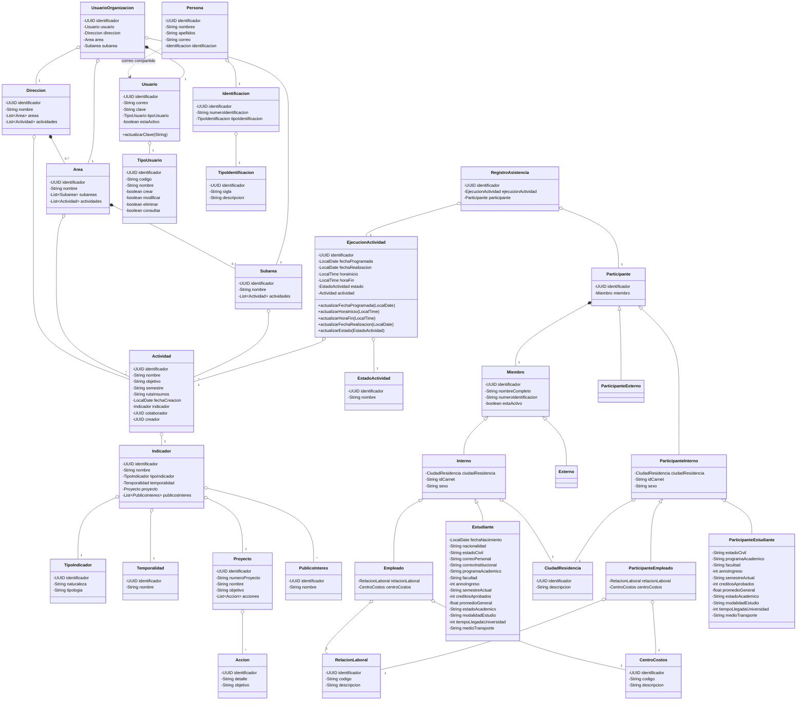
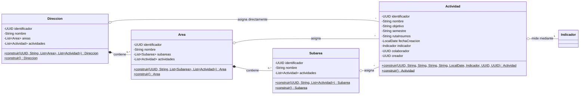
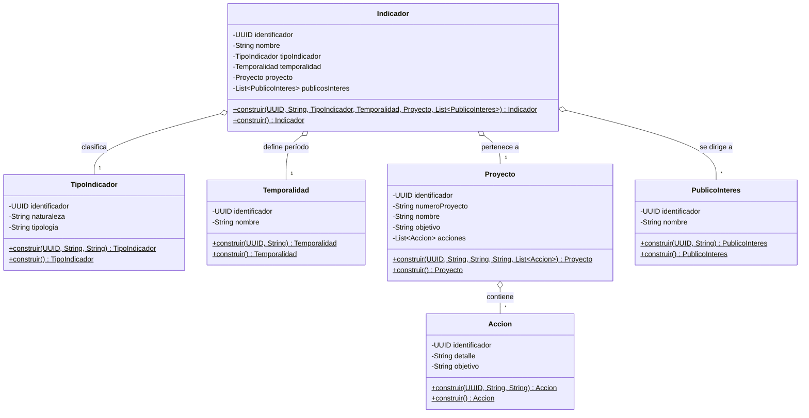
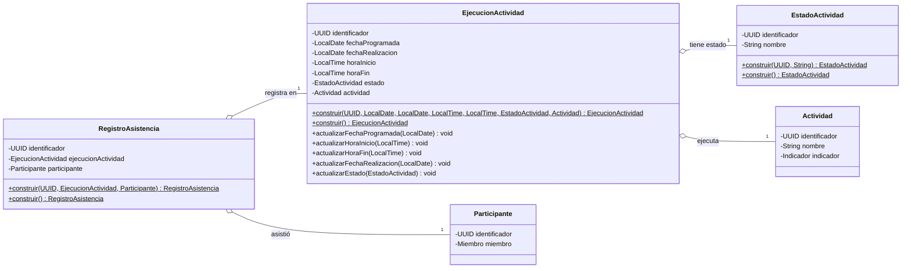
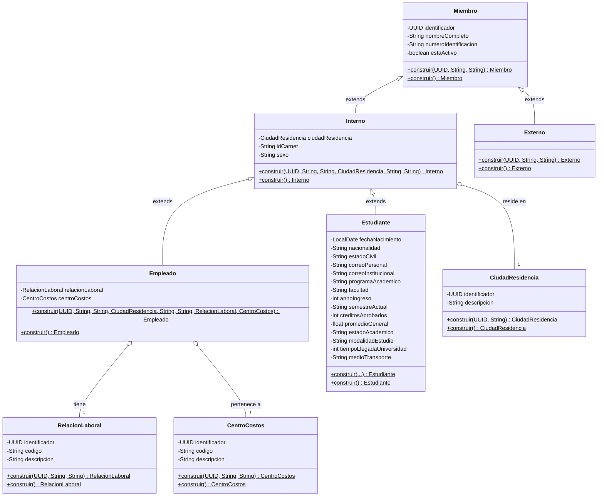
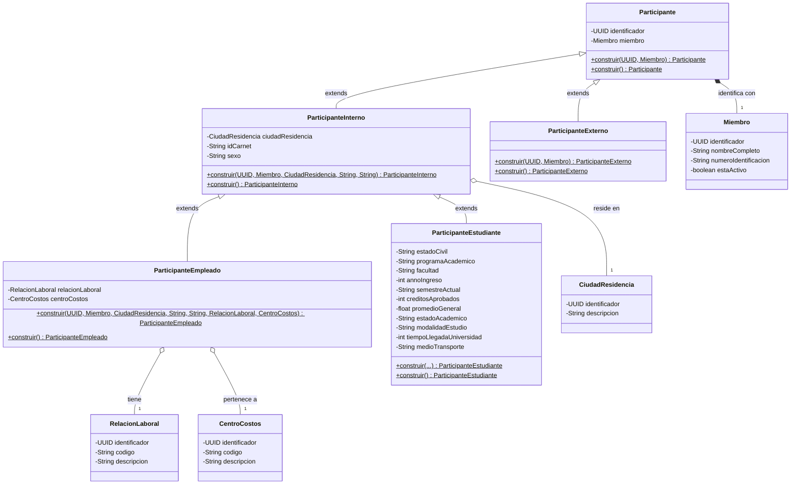
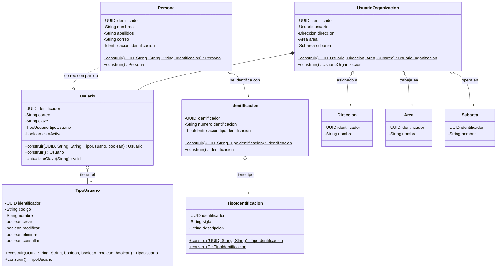

# 24. Diagrama de Clases del Dominio — SIBE

| Metadato              | Valor                                                         |
|-----------------------|---------------------------------------------------------------|
| **Proyecto**          | SIBE — Sistema de Información de Bienestar y Evangelización              |
| **Total de Clases**   | 32                                                            |
| **Formato Diagramas** | Mermaid `classDiagram`                                        |
| **Versión**           | 1.0                                                           |

---

## Tabla de Contenido

1. [Visión General](#1-visión-general)
2. [Inventario de Clases](#2-inventario-de-clases)
3. [Convenciones de Modelado](#3-convenciones-de-modelado)
4. [Diagrama General — Vista Completa](#4-diagrama-general--vista-completa)
5. [Subdominio: Estructura Organizacional](#5-subdominio-estructura-organizacional)
6. [Subdominio: Configuración Estratégica — Indicadores y Proyectos](#6-subdominio-configuración-estratégica--indicadores-y-proyectos)
7. [Subdominio: Ejecución de Actividades y Asistencia](#7-subdominio-ejecución-de-actividades-y-asistencia)
8. [Subdominio: Comunidad Universitaria — Miembros](#8-subdominio-comunidad-universitaria--miembros)
9. [Subdominio: Participantes en Actividades](#9-subdominio-participantes-en-actividades)
10. [Subdominio: Autenticación, Autorización e Identidad](#10-subdominio-autenticación-autorización-e-identidad)
11. [Matriz de Relaciones](#11-matriz-de-relaciones)
12. [Patrones de Diseño Identificados](#12-patrones-de-diseño-identificados)

---

## 1. Visión General

El modelo de dominio de SIBE está compuesto por **32 clases** organizadas en el paquete `co.edu.uco.sibe.dominio.modelo`. Estas clases representan las entidades centrales de la Dirección de Bienestar y Evangelización, cubriendo desde la estructura organizacional de la universidad hasta el registro de asistencia a actividades mediante RFID.

El modelo se organiza lógicamente en **6 subdominios funcionales**:

| # | Subdominio                          | Clases | Descripción                                                          |
|---|-------------------------------------|--------|----------------------------------------------------------------------|
| 1 | Estructura Organizacional           | 4      | Jerarquía: Dirección → Área → Subárea → Actividad                   |
| 2 | Configuración Estratégica           | 6      | Indicadores, proyectos, acciones, temporalidad y públicos de interés |
| 3 | Ejecución de Actividades            | 3      | Ejecución programada, estados y registro de asistencia               |
| 4 | Comunidad Universitaria (Miembros)  | 8      | Jerarquía de miembros: internos, externos, empleados, estudiantes    |
| 5 | Participantes en Actividades        | 5      | Jerarquía paralela de participantes que asisten a ejecuciones        |
| 6 | Autenticación e Identidad           | 6      | Usuarios, roles, personas y contexto organizacional                  |

---

## 2. Inventario de Clases

| #  | Clase                  | Herencia                          | Campos Propios | Métodos Mutadores        |
|----|------------------------|-----------------------------------|----------------|--------------------------|
| 1  | `Accion`               | —                                 | 3              | —                        |
| 2  | `Actividad`            | —                                 | 9              | —                        |
| 3  | `Area`                 | —                                 | 4              | —                        |
| 4  | `CentroCostos`         | —                                 | 3              | —                        |
| 5  | `CiudadResidencia`     | —                                 | 2              | —                        |
| 6  | `Direccion`            | —                                 | 4              | —                        |
| 7  | `EjecucionActividad`   | —                                 | 7              | `actualizarXxx()` × 5   |
| 8  | `Empleado`             | `extends Interno`                 | 2              | —                        |
| 9  | `EstadoActividad`      | —                                 | 2              | —                        |
| 10 | `Estudiante`           | `extends Interno`                 | 15             | —                        |
| 11 | `Externo`              | `extends Miembro`                 | 0              | —                        |
| 12 | `Identificacion`       | —                                 | 3              | —                        |
| 13 | `Indicador`            | —                                 | 6              | —                        |
| 14 | `Interno`              | `extends Miembro`                 | 3              | —                        |
| 15 | `Miembro`              | —                                 | 4              | —                        |
| 16 | `Participante`         | —                                 | 2              | —                        |
| 17 | `ParticipanteEmpleado` | `extends ParticipanteInterno`     | 2              | —                        |
| 18 | `ParticipanteEstudiante`| `extends ParticipanteInterno`    | 11             | —                        |
| 19 | `ParticipanteExterno`  | `extends Participante`            | 0              | —                        |
| 20 | `ParticipanteInterno`  | `extends Participante`            | 3              | —                        |
| 21 | `Persona`              | —                                 | 5              | —                        |
| 22 | `Proyecto`             | —                                 | 5              | —                        |
| 23 | `PublicoInteres`       | —                                 | 2              | —                        |
| 24 | `RegistroAsistencia`   | —                                 | 3              | —                        |
| 25 | `RelacionLaboral`      | —                                 | 3              | —                        |
| 26 | `Subarea`              | —                                 | 3              | —                        |
| 27 | `Temporalidad`         | —                                 | 2              | —                        |
| 28 | `TipoIdentificacion`   | —                                 | 3              | —                        |
| 29 | `TipoIndicador`        | —                                 | 3              | —                        |
| 30 | `TipoUsuario`          | —                                 | 7              | —                        |
| 31 | `Usuario`              | —                                 | 5              | `actualizarClave()`      |
| 32 | `UsuarioOrganizacion`  | —                                 | 5              | —                        |

---

## 3. Convenciones de Modelado

### 3.1 Patrones aplicados en todas las clases

| Patrón                         | Descripción                                                                                                        |
|--------------------------------|--------------------------------------------------------------------------------------------------------------------|
| **Constructor privado**        | Todas las clases usan `private` constructor, impidiendo instanciación directa                                      |
| **Factory Method estático**    | Método `construir(...)` con parámetros y `construir()` sin parámetros (valores por defecto)                        |
| **Lombok `@Getter`**           | Todos los campos exponen getters automáticos vía Lombok. No se generan setters                                     |
| **Inmutabilidad preferida**    | Solo `EjecucionActividad` y `Usuario` poseen métodos `actualizarXxx()` que mutan estado interno                    |
| **Validación en construcción** | Se aplican utilidades transversales (`obtenerTextoPorDefecto`, `obtenerObjetoPorDefecto`) en el factory method      |

### 3.2 Notación Mermaid utilizada

| Símbolo       | Significado              | Ejemplo                                    |
|---------------|--------------------------|--------------------------------------------|
| `<\|--`       | Herencia (extends)       | `Miembro <\|-- Interno`                    |
| `*--`         | Composición (obligatorio)| `Direccion *-- Area`                       |
| `o--`         | Agregación (opcional)    | `Actividad o-- Indicador`                  |
| `..>`         | Dependencia              | `Persona ..> Usuario`                      |
| `-`           | Visibilidad privada      | `- identificador: UUID`                    |
| `+`           | Visibilidad pública      | `+ construir() Actividad$`                 |

---

## 4. Diagrama General — Vista Completa

> **Nota**: Este diagrama muestra la totalidad de las 32 clases y sus relaciones. Para mayor legibilidad, consultar los diagramas por subdominio en las secciones posteriores.



---

## 5. Subdominio: Estructura Organizacional

### 5.1 Descripción

Representa la jerarquía administrativa de la universidad para la organización de actividades de bienestar. Una **Dirección** contiene **Áreas**, cada Área contiene **Subáreas**, y tanto Áreas como Subáreas pueden tener **Actividades** asignadas. La Dirección también puede tener actividades directas.

### 5.2 Diagrama



### 5.3 Detalle de Clases

#### `Direccion`

| Campo         | Tipo               | Descripción                                 |
|---------------|--------------------|---------------------------------------------|
| identificador | `UUID`             | Identificador único de la dirección          |
| nombre        | `String`           | Nombre de la dirección administrativa        |
| areas         | `List<Area>`       | Áreas que componen esta dirección            |
| actividades   | `List<Actividad>`  | Actividades asignadas directamente           |

#### `Area`

| Campo         | Tipo               | Descripción                                 |
|---------------|--------------------|---------------------------------------------|
| identificador | `UUID`             | Identificador único del área                 |
| nombre        | `String`           | Nombre del área                              |
| subareas      | `List<Subarea>`    | Subáreas que componen esta área              |
| actividades   | `List<Actividad>`  | Actividades asignadas al área                |

#### `Subarea`

| Campo         | Tipo               | Descripción                                 |
|---------------|--------------------|---------------------------------------------|
| identificador | `UUID`             | Identificador único de la subárea            |
| nombre        | `String`           | Nombre de la subárea                         |
| actividades   | `List<Actividad>`  | Actividades asignadas a la subárea           |

#### `Actividad`

| Campo          | Tipo         | Descripción                                           |
|----------------|--------------|-------------------------------------------------------|
| identificador  | `UUID`       | Identificador único de la actividad                    |
| nombre         | `String`     | Nombre descriptivo de la actividad                     |
| objetivo       | `String`     | Objetivo que persigue la actividad                     |
| semestre       | `String`     | Semestre académico de ejecución                        |
| rutaInsumos    | `String`     | Ruta a los recursos/insumos de la actividad            |
| fechaCreacion  | `LocalDate`  | Fecha de creación del registro                         |
| indicador      | `Indicador`  | Indicador de medición asociado                         |
| colaborador    | `UUID`       | Referencia al usuario colaborador                      |
| creador        | `UUID`       | Referencia al usuario creador                          |

---

## 6. Subdominio: Configuración Estratégica — Indicadores y Proyectos

### 6.1 Descripción

Define la configuración de indicadores de gestión, su tipología, temporalidad, los proyectos institucionales a los que se asocian, y los públicos de interés. Este subdominio alimenta la medición de impacto de las actividades de bienestar.

### 6.2 Diagrama



### 6.3 Detalle de Clases

#### `Indicador`

| Campo            | Tipo                    | Descripción                                    |
|------------------|-------------------------|------------------------------------------------|
| identificador    | `UUID`                  | Identificador único del indicador              |
| nombre           | `String`                | Nombre del indicador                           |
| tipoIndicador    | `TipoIndicador`        | Clasificación del tipo de indicador            |
| temporalidad     | `Temporalidad`         | Período de medición                            |
| proyecto         | `Proyecto`              | Proyecto institucional asociado                |
| publicosInteres  | `List<PublicoInteres>`  | Públicos objetivo del indicador                |

#### `TipoIndicador`

| Campo         | Tipo     | Descripción                            |
|---------------|----------|----------------------------------------|
| identificador | `UUID`   | Identificador único                    |
| naturaleza    | `String` | Naturaleza del indicador (ej. gestión) |
| tipologia     | `String` | Tipología del indicador                |

#### `Temporalidad`

| Campo         | Tipo     | Descripción                               |
|---------------|----------|-------------------------------------------|
| identificador | `UUID`   | Identificador único                       |
| nombre        | `String` | Nombre del período (ej. semestral, anual) |

#### `Proyecto`

| Campo          | Tipo            | Descripción                          |
|----------------|-----------------|--------------------------------------|
| identificador  | `UUID`          | Identificador único del proyecto     |
| numeroProyecto | `String`        | Código o número del proyecto         |
| nombre         | `String`        | Nombre del proyecto institucional    |
| objetivo       | `String`        | Objetivo del proyecto                |
| acciones       | `List<Accion>`  | Acciones estratégicas del proyecto   |

#### `Accion`

| Campo         | Tipo     | Descripción                       |
|---------------|----------|-----------------------------------|
| identificador | `UUID`   | Identificador único               |
| detalle       | `String` | Descripción detallada de la acción|
| objetivo      | `String` | Objetivo de la acción             |

#### `PublicoInteres`

| Campo         | Tipo     | Descripción                                |
|---------------|----------|--------------------------------------------|
| identificador | `UUID`   | Identificador único                        |
| nombre        | `String` | Nombre del público de interés              |

---

## 7. Subdominio: Ejecución de Actividades y Asistencia

### 7.1 Descripción

Modela la ejecución concreta de actividades programadas y el registro de asistencia de participantes mediante RFID. `EjecucionActividad` es la **única clase del modelo (junto con `Usuario`) que permite mutación de estado** a través de métodos `actualizarXxx()`.

### 7.2 Diagrama



### 7.3 Detalle de Clases

#### `EjecucionActividad`

| Campo             | Tipo              | Descripción                              |
|-------------------|-------------------|------------------------------------------|
| identificador     | `UUID`            | Identificador único                      |
| fechaProgramada   | `LocalDate`       | Fecha planificada de ejecución           |
| fechaRealizacion  | `LocalDate`       | Fecha real de ejecución                  |
| horaInicio        | `LocalTime`       | Hora de inicio programada                |
| horaFin           | `LocalTime`       | Hora de finalización programada          |
| estado            | `EstadoActividad` | Estado actual de la ejecución            |
| actividad         | `Actividad`       | Actividad que se ejecuta                 |

**Métodos mutadores:**

| Método                                     | Descripción                            |
|--------------------------------------------|----------------------------------------|
| `actualizarFechaProgramada(LocalDate)`     | Modifica la fecha programada           |
| `actualizarHoraInicio(LocalTime)`          | Modifica la hora de inicio             |
| `actualizarHoraFin(LocalTime)`             | Modifica la hora de fin                |
| `actualizarFechaRealizacion(LocalDate)`    | Registra la fecha real de ejecución    |
| `actualizarEstado(EstadoActividad)`        | Cambia el estado de la ejecución       |

#### `EstadoActividad`

| Campo         | Tipo     | Descripción                                           |
|---------------|----------|-------------------------------------------------------|
| identificador | `UUID`   | Identificador único                                   |
| nombre        | `String` | Nombre del estado (ej. Pendiente, En curso, Finalizada)|

#### `RegistroAsistencia`

| Campo               | Tipo                  | Descripción                                  |
|---------------------|-----------------------|----------------------------------------------|
| identificador       | `UUID`                | Identificador único del registro             |
| ejecucionActividad  | `EjecucionActividad`  | Ejecución en la que se registró asistencia   |
| participante        | `Participante`        | Participante que asistió                     |

---

## 8. Subdominio: Comunidad Universitaria — Miembros

### 8.1 Descripción

Modela la jerarquía de miembros de la comunidad universitaria. `Miembro` es la raíz abstracta con dos ramas: **Interno** (con carnet, ciudad de residencia y sexo) que se especializa en **Empleado** y **Estudiante**, y **Externo** que representa visitantes o personas ajenas a la universidad.

### 8.2 Diagrama



### 8.3 Detalle de Clases

#### `Miembro` (raíz de jerarquía)

| Campo                | Tipo     | Descripción                            |
|----------------------|----------|----------------------------------------|
| identificador        | `UUID`   | Identificador único del miembro        |
| nombreCompleto       | `String` | Nombre completo del miembro            |
| numeroIdentificacion | `String` | Número de documento de identidad       |
| estaActivo           | `boolean`| Indicador de vigencia (activo/inactivo)|

#### `Interno` (extends `Miembro`)

| Campo             | Tipo               | Descripción                     |
|-------------------|--------------------|---------------------------------|
| ciudadResidencia  | `CiudadResidencia` | Ciudad donde reside             |
| idCarnet          | `String`           | Identificador del carnet RFID   |
| sexo              | `String`           | Sexo del miembro interno        |

#### `Empleado` (extends `Interno`)

| Campo           | Tipo              | Descripción                       |
|-----------------|-------------------|-----------------------------------|
| relacionLaboral | `RelacionLaboral` | Tipo de vínculo laboral           |
| centroCostos    | `CentroCostos`    | Centro de costos al que pertenece |

#### `Estudiante` (extends `Interno`)

| Campo                    | Tipo        | Descripción                                  |
|--------------------------|-------------|----------------------------------------------|
| fechaNacimiento          | `LocalDate` | Fecha de nacimiento                          |
| nacionalidad             | `String`    | País de nacionalidad                         |
| estadoCivil              | `String`    | Estado civil                                 |
| correoPersonal           | `String`    | Correo electrónico personal                  |
| correoInstitucional      | `String`    | Correo electrónico institucional             |
| programaAcademico        | `String`    | Programa académico que cursa                 |
| facultad                 | `String`    | Facultad a la que pertenece                  |
| annoIngreso              | `int`       | Año de ingreso a la universidad              |
| semestreActual           | `String`    | Semestre que cursa actualmente               |
| creditosAprobados        | `int`       | Total de créditos aprobados                  |
| promedioGeneral          | `float`     | Promedio académico acumulado                 |
| estadoAcademico          | `String`    | Estado académico actual                      |
| modalidadEstudio         | `String`    | Modalidad (presencial, virtual, etc.)        |
| tiempoLlegadaUniversidad | `int`       | Tiempo de desplazamiento (minutos)           |
| medioTransporte          | `String`    | Medio de transporte utilizado                |

#### `Externo` (extends `Miembro`)

> Hereda todos los campos de `Miembro`. No agrega campos propios.

#### `CiudadResidencia`

| Campo         | Tipo     | Descripción                    |
|---------------|----------|--------------------------------|
| identificador | `UUID`   | Identificador único            |
| descripcion   | `String` | Nombre de la ciudad            |

#### `RelacionLaboral`

| Campo         | Tipo     | Descripción                          |
|---------------|----------|--------------------------------------|
| identificador | `UUID`   | Identificador único                  |
| codigo        | `String` | Código de la relación laboral        |
| descripcion   | `String` | Descripción del vínculo laboral      |

#### `CentroCostos`

| Campo         | Tipo     | Descripción                          |
|---------------|----------|--------------------------------------|
| identificador | `UUID`   | Identificador único                  |
| codigo        | `String` | Código del centro de costos          |
| descripcion   | `String` | Descripción del centro de costos     |

---

## 9. Subdominio: Participantes en Actividades

### 9.1 Descripción

Define una **jerarquía paralela a Miembro** para representar la participación en actividades. `Participante` contiene una referencia a `Miembro` (composición) y se especializa en `ParticipanteInterno` (con datos de carnet), `ParticipanteEmpleado`, `ParticipanteEstudiante` y `ParticipanteExterno`. Esta separación permite registrar datos de asistencia específicos por tipo sin acoplar la jerarquía de miembros.

### 9.2 Diagrama



### 9.3 Detalle de Clases

#### `Participante` (raíz de jerarquía)

| Campo         | Tipo      | Descripción                                     |
|---------------|-----------|-------------------------------------------------|
| identificador | `UUID`    | Identificador único de la participación          |
| miembro       | `Miembro` | Miembro de la comunidad que participa            |

#### `ParticipanteInterno` (extends `Participante`)

| Campo            | Tipo               | Descripción                    |
|------------------|--------------------|--------------------------------|
| ciudadResidencia | `CiudadResidencia` | Ciudad de residencia           |
| idCarnet         | `String`           | Identificador del carnet RFID  |
| sexo             | `String`           | Sexo del participante          |

#### `ParticipanteEmpleado` (extends `ParticipanteInterno`)

| Campo           | Tipo              | Descripción                       |
|-----------------|-------------------|-----------------------------------|
| relacionLaboral | `RelacionLaboral` | Tipo de vínculo laboral           |
| centroCostos    | `CentroCostos`    | Centro de costos asignado         |

#### `ParticipanteEstudiante` (extends `ParticipanteInterno`)

| Campo                    | Tipo    | Descripción                               |
|--------------------------|---------|-------------------------------------------|
| estadoCivil              | `String`| Estado civil                              |
| programaAcademico        | `String`| Programa académico                        |
| facultad                 | `String`| Facultad del estudiante                   |
| annoIngreso              | `int`   | Año de ingreso                            |
| semestreActual           | `String`| Semestre actual                           |
| creditosAprobados        | `int`   | Créditos aprobados acumulados             |
| promedioGeneral          | `float` | Promedio académico                        |
| estadoAcademico          | `String`| Estado académico actual                   |
| modalidadEstudio         | `String`| Modalidad de estudio                      |
| tiempoLlegadaUniversidad | `int`   | Tiempo de desplazamiento (minutos)        |
| medioTransporte          | `String`| Medio de transporte                       |

#### `ParticipanteExterno` (extends `Participante`)

> Hereda todos los campos de `Participante`. No agrega campos propios.

---

## 10. Subdominio: Autenticación, Autorización e Identidad

### 10.1 Descripción

Gestiona la autenticación de usuarios, sus roles (con permisos CRUD granulares), la información personal (`Persona`) con su identificación documental, y la asignación organizacional que vincula a un usuario con una dirección, área y subárea específicas.

### 10.2 Diagrama



### 10.3 Detalle de Clases

#### `Usuario`

| Campo        | Tipo          | Descripción                           |
|--------------|---------------|---------------------------------------|
| identificador| `UUID`        | Identificador único                   |
| correo       | `String`      | Correo electrónico (login)            |
| clave        | `String`      | Contraseña del usuario                |
| tipoUsuario  | `TipoUsuario` | Rol y permisos asignados             |
| estaActivo   | `boolean`     | Estado de activación de la cuenta     |

**Método mutador:** `actualizarClave(String clave)` — Permite cambiar la contraseña del usuario.

#### `TipoUsuario`

| Campo         | Tipo      | Descripción                                  |
|---------------|-----------|----------------------------------------------|
| identificador | `UUID`    | Identificador único                          |
| codigo        | `String`  | Código del tipo de usuario                   |
| nombre        | `String`  | Nombre descriptivo del rol                   |
| crear         | `boolean` | Permiso para crear registros                 |
| modificar     | `boolean` | Permiso para modificar registros             |
| eliminar      | `boolean` | Permiso para eliminar registros              |
| consultar     | `boolean` | Permiso para consultar registros             |

#### `Persona`

| Campo          | Tipo             | Descripción                        |
|----------------|------------------|------------------------------------|
| identificador  | `UUID`           | Identificador único                |
| nombres        | `String`         | Nombres de la persona              |
| apellidos      | `String`         | Apellidos de la persona            |
| correo         | `String`         | Correo electrónico                 |
| identificacion | `Identificacion` | Documento de identificación        |

#### `Identificacion`

| Campo                | Tipo                 | Descripción                         |
|----------------------|----------------------|-------------------------------------|
| identificador        | `UUID`               | Identificador único                 |
| numeroIdentificacion | `String`             | Número de documento                 |
| tipoIdentificacion   | `TipoIdentificacion` | Tipo de documento (CC, TI, CE, etc.)|

#### `TipoIdentificacion`

| Campo         | Tipo     | Descripción                              |
|---------------|----------|------------------------------------------|
| identificador | `UUID`   | Identificador único                      |
| sigla         | `String` | Sigla del tipo (ej. CC, TI, CE)          |
| descripcion   | `String` | Descripción del tipo de identificación   |

#### `UsuarioOrganizacion`

| Campo         | Tipo        | Descripción                                        |
|---------------|-------------|----------------------------------------------------|
| identificador | `UUID`      | Identificador único                                |
| usuario       | `Usuario`   | Usuario del sistema                                |
| direccion     | `Direccion` | Dirección organizacional asignada                  |
| area          | `Area`      | Área donde opera                                   |
| subarea       | `Subarea`   | Subárea específica de operación                    |

---

## 11. Matriz de Relaciones

### 11.1 Relaciones de Herencia

| Clase Base          | Clase Derivada          | Tipo                |
|---------------------|-------------------------|---------------------|
| `Miembro`           | `Interno`               | `extends`           |
| `Miembro`           | `Externo`               | `extends`           |
| `Interno`           | `Empleado`              | `extends`           |
| `Interno`           | `Estudiante`            | `extends`           |
| `Participante`      | `ParticipanteInterno`   | `extends`           |
| `Participante`      | `ParticipanteExterno`   | `extends`           |
| `ParticipanteInterno`| `ParticipanteEmpleado` | `extends`           |
| `ParticipanteInterno`| `ParticipanteEstudiante`| `extends`          |

### 11.2 Relaciones de Composición (obligatorias — ciclo de vida dependiente)

| Clase Contenedora    | Clase Contenida | Cardinalidad | Descripción                                     |
|----------------------|-----------------|--------------|-------------------------------------------------|
| `Direccion`          | `Area`          | `0..*`       | Una dirección contiene cero o más áreas          |
| `Area`               | `Subarea`       | `0..*`       | Un área contiene cero o más subáreas            |
| `Participante`       | `Miembro`       | `1`          | Todo participante referencia un miembro          |
| `UsuarioOrganizacion`| `Usuario`       | `1`          | Context organizacional posee referencia al usuario|

### 11.3 Relaciones de Agregación (opcionales — ciclo de vida independiente)

| Clase Origen           | Clase Destino         | Cardinalidad | Descripción                          |
|------------------------|-----------------------|--------------|--------------------------------------|
| `Actividad`            | `Indicador`           | `1`          | Indicador asociado                   |
| `Direccion`            | `Actividad`           | `*`          | Actividades directas                 |
| `Area`                 | `Actividad`           | `*`          | Actividades del área                 |
| `Subarea`              | `Actividad`           | `*`          | Actividades de la subárea            |
| `Indicador`            | `TipoIndicador`       | `1`          | Tipo del indicador                   |
| `Indicador`            | `Temporalidad`        | `1`          | Período de medición                  |
| `Indicador`            | `Proyecto`            | `1`          | Proyecto asociado                    |
| `Indicador`            | `PublicoInteres`      | `*`          | Públicos objetivo                    |
| `Proyecto`             | `Accion`              | `*`          | Acciones estratégicas                |
| `EjecucionActividad`   | `EstadoActividad`     | `1`          | Estado actual                        |
| `EjecucionActividad`   | `Actividad`           | `1`          | Actividad ejecutada                  |
| `RegistroAsistencia`   | `EjecucionActividad`  | `1`          | Ejecución donde se registró          |
| `RegistroAsistencia`   | `Participante`        | `1`          | Participante que asistió             |
| `Usuario`              | `TipoUsuario`         | `1`          | Rol del usuario                      |
| `Persona`              | `Identificacion`      | `1`          | Documento de identidad               |
| `Identificacion`       | `TipoIdentificacion`  | `1`          | Tipo de documento                    |
| `Interno`              | `CiudadResidencia`    | `1`          | Ciudad de residencia                 |
| `Empleado`             | `RelacionLaboral`     | `1`          | Vínculo laboral                      |
| `Empleado`             | `CentroCostos`        | `1`          | Centro de costos                     |
| `ParticipanteInterno`  | `CiudadResidencia`    | `1`          | Ciudad de residencia                 |
| `ParticipanteEmpleado` | `RelacionLaboral`     | `1`          | Vínculo laboral                      |
| `ParticipanteEmpleado` | `CentroCostos`        | `1`          | Centro de costos                     |
| `UsuarioOrganizacion`  | `Direccion`           | `1`          | Dirección asignada                   |
| `UsuarioOrganizacion`  | `Area`                | `1`          | Área asignada                        |
| `UsuarioOrganizacion`  | `Subarea`             | `1`          | Subárea asignada                     |

### 11.4 Relaciones de Dependencia

| Clase Origen | Clase Destino | Tipo         | Descripción                                        |
|--------------|---------------|--------------|----------------------------------------------------|
| `Persona`    | `Usuario`     | Dependencia  | Comparten campo `correo` como vínculo implícito     |

---

## 12. Patrones de Diseño Identificados

### 12.1 Factory Method Estático

Todas las 32 clases implementan el patrón **Factory Method** con dos variantes:

```java
// Variante con parámetros (construcción con datos)
public static NombreClase construir(param1, param2, ...) { ... }

// Variante sin parámetros (valores por defecto)
public static NombreClase construir() { ... }
```

El constructor privado impide instanciación directa, garantizando que toda creación pase por validaciones transversales.

### 12.2 Rich Domain Model (parcial)

Las clases `EjecucionActividad` y `Usuario` encapsulan comportamiento de negocio mediante métodos `actualizarXxx()`, alineándose con un **Modelo de Dominio Rico**. Las demás clases son **Value Objects inmutables** o entidades de solo lectura.

### 12.3 Jerarquía Paralela (Miembro ↔ Participante)

Se identifica una **estructura espejo** entre las jerarquías:

| Miembro (identidad)   | Participante (participación)     |
|------------------------|----------------------------------|
| `Miembro`              | `Participante` (+ ref. Miembro)  |
| `Interno`              | `ParticipanteInterno`            |
| `Empleado`             | `ParticipanteEmpleado`           |
| `Estudiante`           | `ParticipanteEstudiante`         |
| `Externo`              | `ParticipanteExterno`            |

Esta separación permite que la identidad del miembro sea independiente de su participación en actividades, habilitando consultas y reportes desacoplados.

### 12.4 Validación Defensiva en Construcción

Los factory methods aplican utilidades transversales del paquete `co.edu.uco.sibe.dominio.transversal.utilitarios`:

| Utilidad                       | Propósito                                              |
|--------------------------------|--------------------------------------------------------|
| `obtenerTextoPorDefecto()`     | Retorna `VACIO` si el String es nulo                   |
| `obtenerObjetoPorDefecto()`    | Retorna instancia por defecto si el objeto es nulo     |
| `obtenerNumeroPorDefecto()`    | Retorna `CERO` si el número es nulo                    |
| `obtenerValorFechaPorDefecto()`| Retorna fecha por defecto si es nula                   |
| `obtenerValorDefecto()` (UUID) | Genera UUID por defecto                                |

