# 25. Diagrama de Componentes — SIBE

| Metadato              | Valor                                                                      |
|-----------------------|----------------------------------------------------------------------------|
| **Proyecto**          | SIBE — Sistema de Información de Bienestar y Evangelización                |
| **Backend**           | Java 17 · Spring Boot 3.5.0 · Arquitectura Hexagonal + CQRS               |
| **Frontend**          | Angular 16.2 · Lazy Loading por Feature · SharedModule                     |
| **Base de Datos**     | PostgreSQL 5432 (`sibe_db2`) · H2 en tests                                |
| **Formato Diagramas** | Mermaid (`C4Context`, `C4Container`, `C4Component`, `flowchart`, `graph`)  |
| **Versión**           | 1.0                                                                        |

---

## Tabla de Contenido

- [25. Diagrama de Componentes — SIBE](#25-diagrama-de-componentes--sibe)
  - [Tabla de Contenido](#tabla-de-contenido)
  - [1. Visión General del Sistema](#1-visión-general-del-sistema)
  - [2. Diagrama de Contexto (Nivel 1 — C4)](#2-diagrama-de-contexto-nivel-1--c4)
  - [3. Diagrama de Contenedores (Nivel 2 — C4)](#3-diagrama-de-contenedores-nivel-2--c4)
    - [Resumen de Tecnologías por Contenedor](#resumen-de-tecnologías-por-contenedor)
  - [4. Componentes del Backend — Vista General](#4-componentes-del-backend--vista-general)
  - [5. Componente: Capa de Infraestructura — Controladores REST](#5-componente-capa-de-infraestructura--controladores-rest)
    - [5.1 Diagrama](#51-diagrama)
    - [5.2 Inventario de Controladores de Comando](#52-inventario-de-controladores-de-comando)
    - [5.3 Inventario de Controladores de Consulta](#53-inventario-de-controladores-de-consulta)
  - [6. Componente: Capa de Infraestructura — Seguridad y Filtros](#6-componente-capa-de-infraestructura--seguridad-y-filtros)
    - [6.1 Diagrama de Cadena de Filtros](#61-diagrama-de-cadena-de-filtros)
    - [6.2 Configuración de Seguridad](#62-configuración-de-seguridad)
  - [7. Componente: Capa de Aplicación — Manejadores CQRS](#7-componente-capa-de-aplicación--manejadores-cqrs)
    - [7.1 Diagrama](#71-diagrama)
    - [7.2 Patrón de Ejecución](#72-patrón-de-ejecución)
  - [8. Componente: Capa de Dominio — Use Cases y Reglas](#8-componente-capa-de-dominio--use-cases-y-reglas)
    - [8.1 Diagrama](#81-diagrama)
    - [8.2 Inventario de Use Cases de Comando (31)](#82-inventario-de-use-cases-de-comando-31)
    - [8.3 Motor de Reglas de Negocio](#83-motor-de-reglas-de-negocio)
  - [9. Componente: Capa de Infraestructura — Persistencia](#9-componente-capa-de-infraestructura--persistencia)
    - [9.1 Diagrama](#91-diagrama)
    - [9.2 DAOs Representativos](#92-daos-representativos)
  - [10. Componente: Capa de Infraestructura — Servicios Externos](#10-componente-capa-de-infraestructura--servicios-externos)
    - [10.1 Diagrama](#101-diagrama)
  - [11. Componente: Configuración y Arranque](#11-componente-configuración-y-arranque)
    - [11.1 Diagrama](#111-diagrama)
    - [11.2 Orden de Carga de Datos Semilla](#112-orden-de-carga-de-datos-semilla)
  - [12. Componentes del Frontend — Vista General](#12-componentes-del-frontend--vista-general)
  - [13. Componente: Core Module](#13-componente-core-module)
    - [13.1 Diagrama Detallado](#131-diagrama-detallado)
    - [13.2 Flujo de Interceptores](#132-flujo-de-interceptores)
  - [14. Componente: Feature Modules](#14-componente-feature-modules)
    - [14.1 Árbol de Módulos Lazy-Loaded](#141-árbol-de-módulos-lazy-loaded)
    - [14.2 Resumen de Feature Modules](#142-resumen-de-feature-modules)
  - [15. Componente: Shared Module](#15-componente-shared-module)
    - [15.1 Diagrama](#151-diagrama)
    - [15.2 Servicios Compartidos y sus Endpoints](#152-servicios-compartidos-y-sus-endpoints)
  - [16. Diagrama de Integración Frontend ↔ Backend](#16-diagrama-de-integración-frontend--backend)
  - [17. Mapa de Endpoints REST](#17-mapa-de-endpoints-rest)
    - [17.1 Endpoints de Comando (Escritura)](#171-endpoints-de-comando-escritura)
    - [17.2 Endpoints de Consulta (Lectura)](#172-endpoints-de-consulta-lectura)
  - [18. Flujo de Datos — Request Completo](#18-flujo-de-datos--request-completo)
    - [18.1 Flujo de Comando (Escritura)](#181-flujo-de-comando-escritura)
    - [18.2 Flujo de Consulta (Lectura)](#182-flujo-de-consulta-lectura)
  - [19. Inventario Cuantitativo de Componentes](#19-inventario-cuantitativo-de-componentes)
    - [19.1 Backend](#191-backend)
    - [19.2 Frontend](#192-frontend)
    - [19.3 Resumen Global](#193-resumen-global)

---

## 1. Visión General del Sistema

SIBE es una aplicación web de tres capas que gestiona actividades de la Dirección de Bienestar y Evangelización y el registro de asistencia mediante RFID. El sistema se compone de:

- **Frontend SPA** — Angular 16.2 con lazy loading, comunicación HTTP hacia la API REST
- **Backend API** — Spring Boot 3.5.0 con arquitectura hexagonal (puertos y adaptadores) y segregación CQRS de comandos/consultas
- **Base de Datos** — PostgreSQL como almacén principal, H2 para entorno de pruebas

La arquitectura sigue los principios de **Domain-Driven Design (DDD)** con una clara separación en tres capas concéntricas: dominio (núcleo), aplicación (orquestación), e infraestructura (adaptadores externos).

---

## 2. Diagrama de Contexto (Nivel 1 — C4)

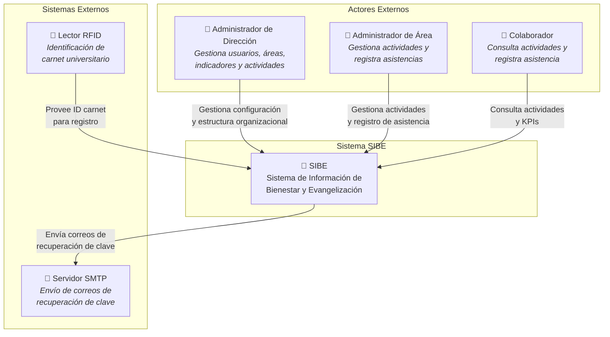

---

## 3. Diagrama de Contenedores (Nivel 2 — C4)

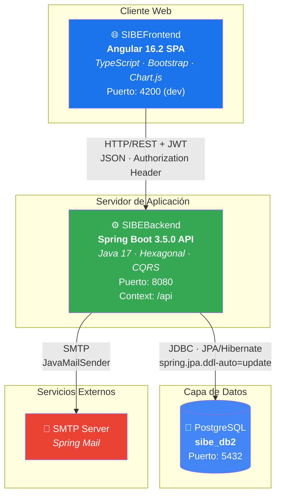

### Resumen de Tecnologías por Contenedor

| Contenedor     | Tecnología         | Puerto | Protocolo        | Dependencias Clave                              |
|----------------|--------------------|--------|------------------|-------------------------------------------------|
| **Frontend**   | Angular 16.2       | 4200   | HTTP             | Bootstrap, Chart.js, xlsx, jwt-decode, Swiper    |
| **Backend**    | Spring Boot 3.5.0  | 8080   | HTTP REST + JWT  | Spring Security, Data JPA, jjwt, POI, Mail       |
| **Base Datos** | PostgreSQL         | 5432   | JDBC             | DDL auto-update, JPA/Hibernate                   |
| **SMTP**       | Servidor de correo | 587    | SMTP             | Spring Mail                                      |

---

## 4. Componentes del Backend — Vista General

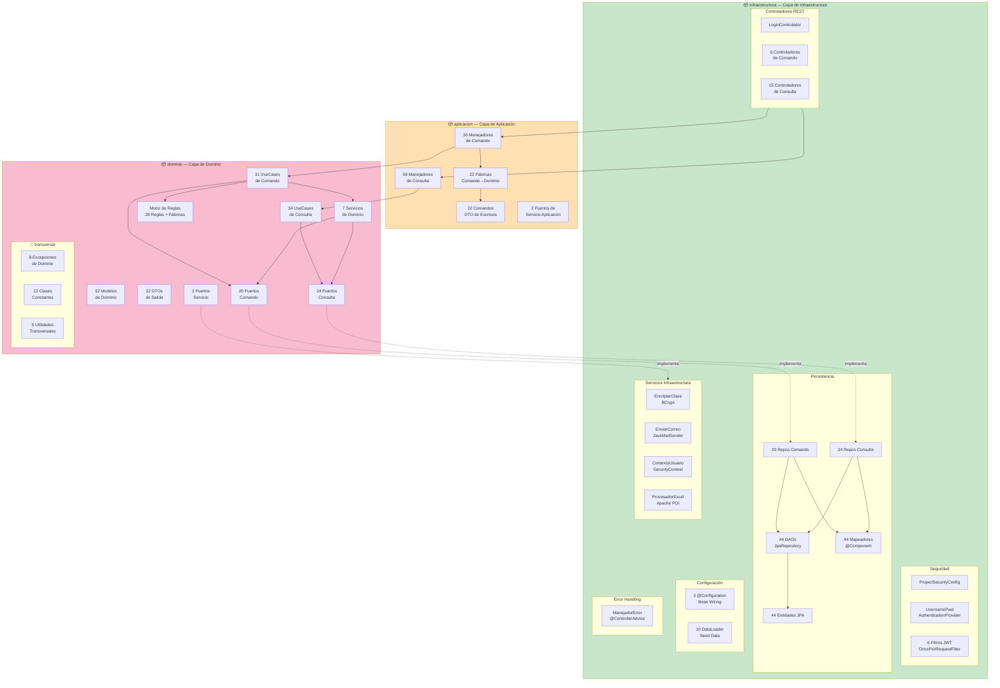

---

## 5. Componente: Capa de Infraestructura — Controladores REST

### 5.1 Diagrama

```mermaid
graph LR
    subgraph Comando["Controladores de Comando (6)"]
        UC["UsuarioComandoControlador<br/>/usuarios"]
        AC["ActividadComandoControlador<br/>/actividades"]
        AccC["AccionComandoControlador<br/>/acciones"]
        IC["IndicadorComandoControlador<br/>/indicadores"]
        PC["ProyectoComandoControlador<br/>/proyectos"]
        CM["CargaMasivaControlador<br/>/carga_masiva"]
    end

    subgraph Consulta["Controladores de Consulta (15)"]
        UQ["UsuarioConsultarControlador"]
        AQ["ActividadConsultaControlador"]
        AreaQ["AreaConsultaControlador"]
        DQ["DireccionConsultaControlador"]
        SQ["SubareaConsultaControlador"]
        IQ["IndicadorConsultaControlador"]
        PQ["ProyectoConsultaControlador"]
        AccQ["AccionConsultaControlador"]
        MQ["MiembroConsultaControlador"]
        OQ["OrganizacionConsultaControlador"]
        PIQ["PublicoInteresConsultaControlador"]
        TmpQ["TemporalidadConsultaControlador"]
        TIQ["TipoIdentificacionConsultaControlador"]
        TIndQ["TipoIndicadorConsultaControlador"]
        TUQ["TipoUsuarioConsultaControlador"]
    end

    Login["LoginControlador<br/>/login"]

    Login --> Auth["Autenticación<br/>@PreAuthorize"]
    Comando --> Auth
    Consulta --> Auth
```

### 5.2 Inventario de Controladores de Comando

| Controlador                    | Base Path         | Métodos                                                                              |
|--------------------------------|-------------------|--------------------------------------------------------------------------------------|
| `UsuarioComandoControlador`    | `/usuarios`       | `guardar`, `modificar`, `modificarClave`, `eliminar`, `solicitarCodigo`, `validarCodigo`, `recuperarClave` |
| `ActividadComandoControlador`  | `/actividades`    | `guardar`, `modificar`, `iniciar`, `finalizar`, `cancelar`                           |
| `AccionComandoControlador`     | `/acciones`       | `guardar`, `modificar`                                                               |
| `IndicadorComandoControlador`  | `/indicadores`    | `guardar`, `modificar`                                                               |
| `ProyectoComandoControlador`   | `/proyectos`      | `guardar`, `modificar`                                                               |
| `CargaMasivaControlador`       | `/carga_masiva`   | `cargarMasivamenteEmpleados`, `cargarMasivamenteEstudiantes`                         |

### 5.3 Inventario de Controladores de Consulta

| Controlador                         | Base Path               | Operaciones Principales                                    |
|-------------------------------------|--------------------------|------------------------------------------------------------|
| `UsuarioConsultarControlador`       | `/usuarios`              | Listar todos, listar paginado, por ID, por correo          |
| `ActividadConsultaControlador`      | `/actividades`           | Por dirección, área, subárea (c/u con paginado), ejecuciones, participantes, estadísticas, conteos, filtros |
| `AreaConsultaControlador`           | `/areas`                 | Listar, por nombre, detalle por ID                         |
| `DireccionConsultaControlador`      | `/direcciones`           | Listar, por nombre, detalle por ID                         |
| `SubareaConsultaControlador`        | `/subareas`              | Listar, por nombre, detalle por ID                         |
| `IndicadorConsultaControlador`      | `/indicadores`           | Listar paginado, listar todos, para actividades                    |
| `ProyectoConsultaControlador`       | `/proyectos`             | Listar paginado                                            |
| `AccionConsultaControlador`         | `/acciones`              | Listar paginado                                            |
| `MiembroConsultaControlador`        | `/miembros`              | Por identificación, por carnet                             |
| `OrganizacionConsultaControlador`   | `/organizacion`          | Contar usuarios por estructura organizacional       |
| `PublicoInteresConsultaControlador` | `/publicos_interes`      | Listar todos                                               |
| `TemporalidadConsultaControlador`   | `/temporalidades`        | Listar todas                                               |
| `TipoIdentificacionConsultaControlador` | `/tipos_identificacion` | Listar todos                                           |
| `TipoIndicadorConsultaControlador`  | `/tipos_indicador`       | Listar todos                                               |
| `TipoUsuarioConsultaControlador`    | `/tipos_usuario`         | Listar todos                                               |

---

## 6. Componente: Capa de Infraestructura — Seguridad y Filtros

### 6.1 Diagrama de Cadena de Filtros

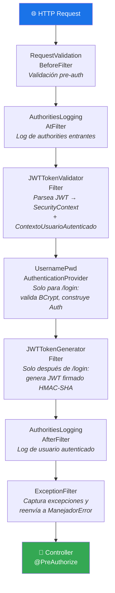

### 6.2 Configuración de Seguridad

| Aspecto                  | Configuración                                                    |
|--------------------------|------------------------------------------------------------------|
| **Session Management**   | Stateless (`STATELESS`)                                          |
| **CSRF**                 | Deshabilitado                                                    |
| **CORS**                 | Habilitado (permite orígenes configurados)                       |
| **Method Security**      | `@EnableMethodSecurity(securedEnabled=true, jsr250Enabled=true)` |
| **JWT Signing**          | HMAC-SHA (clave simétrica)                                       |
| **Password Encoding**    | BCrypt via `PasswordEncoder` bean                                |
| **Authority Model**      | `HAS_ADMIN_CREATE_AUTHORITY`, `HAS_ADMIN_MODIFY_AUTHORITY`, etc. |

---

## 7. Componente: Capa de Aplicación — Manejadores CQRS

### 7.1 Diagrama

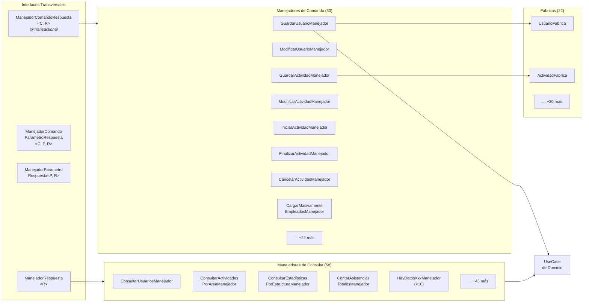

### 7.2 Patrón de Ejecución

```
Controlador.método()
  → @PreAuthorize (validación de rol)
  → Manejador.ejecutar(Comando)
    → Fábrica.construir(Comando) → Modelo de Dominio
    → UseCase.ejecutar(Modelo)
      → MotoresFabrica.MOTOR_XXX.ejecutar(modelo, TipoOperacion.CREAR)
      → AutorizaciónContextoOrganizacional.validarAcceso(...)
      → RepositorioPuerto.guardar(modelo)
    ← ComandoRespuesta<UUID>
```

---

## 8. Componente: Capa de Dominio — Use Cases y Reglas

### 8.1 Diagrama

```mermaid
graph TB
    subgraph UseCases["Use Cases"]
        subgraph CmdUC["Comando (31)"]
            GuardarUsr["GuardarUsuario<br/>UseCase"]
            GuardarAct["GuardarActividad<br/>UseCase"]
            IniciarAct["IniciarActividad<br/>UseCase"]
            FinalizarAct["FinalizarActividad<br/>UseCase"]
            CargaEmpl["CargarMasivamente<br/>EmpleadosUseCase"]
            Login["LoginUseCase"]
            RecClave["RecuperarClave<br/>UseCase"]
            OtrosCU["... +24 más"]
        end
        subgraph QryUC["Consulta (34)"]
            ConsUsuarios["ConsultarUsuarios<br/>UseCase"]
            ConsEstadist["ConsultarEstadísticas<br/>UseCase"]
            ContPoblacion["ContarPoblación<br/>TotalUseCase"]
            OtrosQU["... +31 más"]
        end
    end

    subgraph MotorReglas["Motor de Reglas de Negocio"]
        MF["MotoresFabrica<br/><i>28 motores estáticos</i>"]
        MR["MotorRegla&lt;T&gt;<br/><i>EnumMap&lt;TipoOperacion,<br/>List&lt;Consumer&lt;T&gt;&gt;&gt;</i>"]
        Reglas["28 XxxRegla<br/><i>validarIdentificador()<br/>validarCampos()</i>"]
    end

    subgraph DomSvcs["Servicios de Dominio (7)"]
        AuthCtx["Autorización<br/>ContextoOrganizacional"]
        VincUsr["VincularUsuario<br/>ConAreaService"]
        ModVinc["ModificarVinculación<br/>UsuarioConAreaService"]
        VincAct["VincularActividad<br/>ConAreaService"]
        RegPart["RegistrarParticipante<br/>Service"]
        ContUsr["ContarUsuariosPor<br/>OrganizaciónService"]
        ModVincAct["ModificarVinculación<br/>ActividadConAreaService"]
    end

    subgraph Puertos["Puertos (Interfaces)"]
        PC["20 Puertos Comando<br/><i>XxxRepositorioComando</i>"]
        PQ["24 Puertos Consulta<br/><i>XxxRepositorioConsulta</i>"]
        PS["3 Puertos Servicio<br/><i>EncriptarClave, Contexto,<br/>EnviarCorreo</i>"]
    end

    GuardarUsr --> MF
    GuardarUsr --> AuthCtx
    GuardarUsr --> PC
    GuardarAct --> MF
    GuardarAct --> VincAct
    Login --> PS
    ConsUsuarios --> PQ
    MF --> MR
    MR --> Reglas
    DomSvcs --> PC
    DomSvcs --> PQ
```

### 8.2 Inventario de Use Cases de Comando (31)

| Categoría          | Use Cases                                                                                                         |
|--------------------|-------------------------------------------------------------------------------------------------------------------|
| **Usuarios**       | `GuardarUsuario`, `ModificarUsuario`, `EliminarUsuario`, `Login`, `ModificarClave`, `ModificarContrasena`, `SolicitarCodigo`, `ValidarCodigoRecuperacionClave`, `RecuperarClave` |
| **Actividades**    | `GuardarActividad`, `ModificarActividad`, `IniciarActividad`, `CancelarActividad`, `FinalizarActividad`           |
| **Estructura Org.**| `GuardarDireccion`, `GuardarArea`, `GuardarSubarea`                                                               |
| **Indicadores**    | `GuardarIndicador`, `ModificarIndicador`, `GuardarProyecto`, `ModificarProyecto`, `GuardarAccion`, `ModificarAccion` |
| **Catálogos**      | `GuardarTipoUsuario`, `GuardarTipoIdentificacion`, `GuardarTipoIndicador`, `GuardarTemporalidad`, `GuardarEstadoActividad`, `GuardarPublicoInteres` |
| **Carga Masiva**   | `CargarMasivamenteEmpleados`, `CargarMasivamenteEstudiantes`                                                      |

### 8.3 Motor de Reglas de Negocio

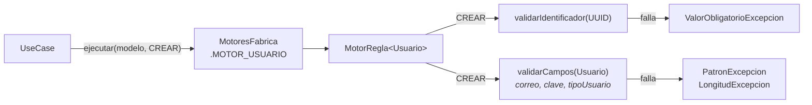

---

## 9. Componente: Capa de Infraestructura — Persistencia

### 9.1 Diagrama

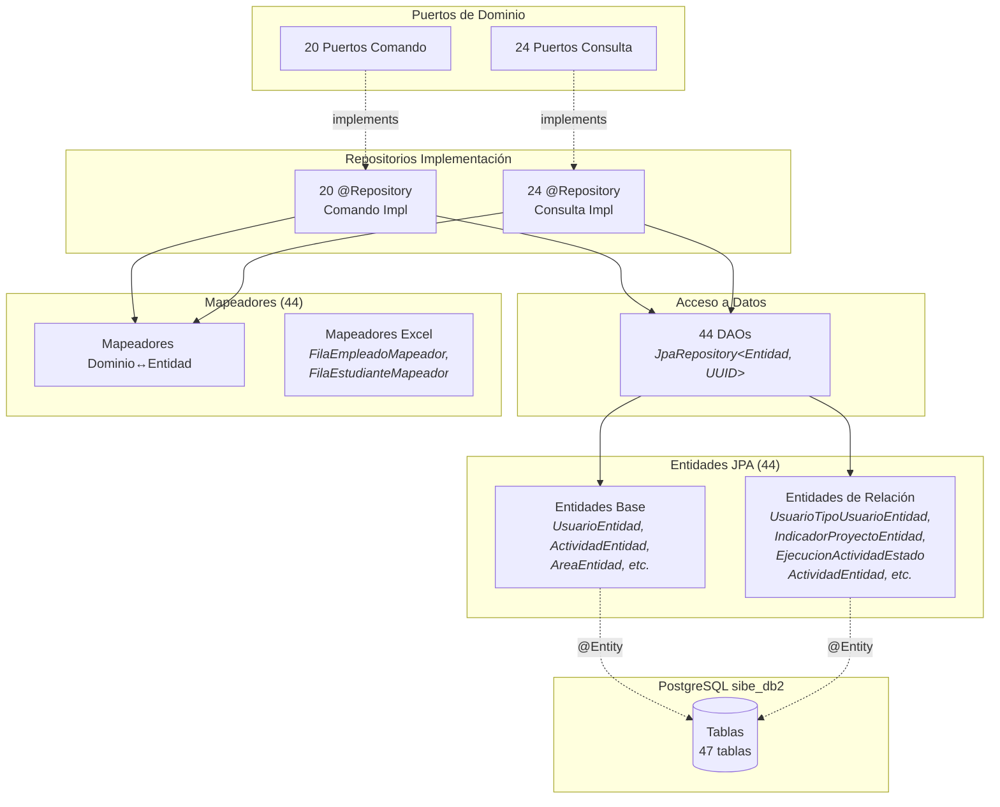

### 9.2 DAOs Representativos

| DAO                           | Entidad                           | Queries Custom Relevantes                                                |
|-------------------------------|-----------------------------------|--------------------------------------------------------------------------|
| `UsuarioDAO`                  | `UsuarioEntidad`                  | `findByCorreo(String)`                                                   |
| `UsuarioOrganizacionDAO`      | `UsuarioOrganizacionEntidad`      | `findByUsuario()`, `countByDireccionIdentificador()`, `countByAreaIdentificador()` |
| `EjecucionActividadDAO`       | `EjecucionActividadEntidad`       | Consultas de ejecuciones por actividad y estado                          |
| `ParticipanteDAO`             | `ParticipanteEntidad`             | Consultas por ejecución y tipo de participante                           |
| `RegistroAsistenciaDAO`       | `RegistroAsistenciaEntidad`       | Conteos de asistencia por estructura organizacional                      |
| `PeticionRecuperacionClaveDAO`| `PeticionRecuperacionClaveEntidad`| `findByCorreo()`, validación de código temporal                          |

---

## 10. Componente: Capa de Infraestructura — Servicios Externos

### 10.1 Diagrama

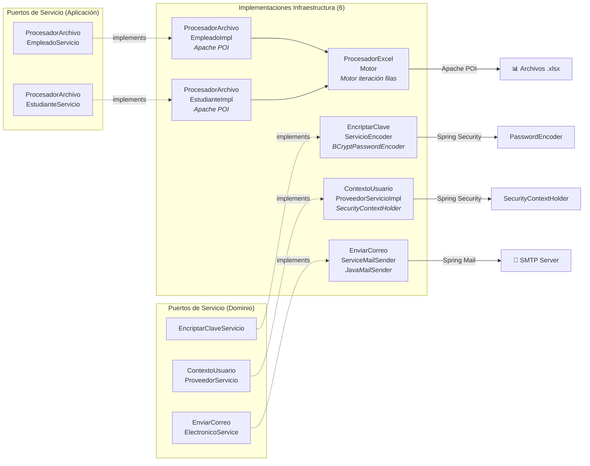

---

## 11. Componente: Configuración y Arranque

### 11.1 Diagrama

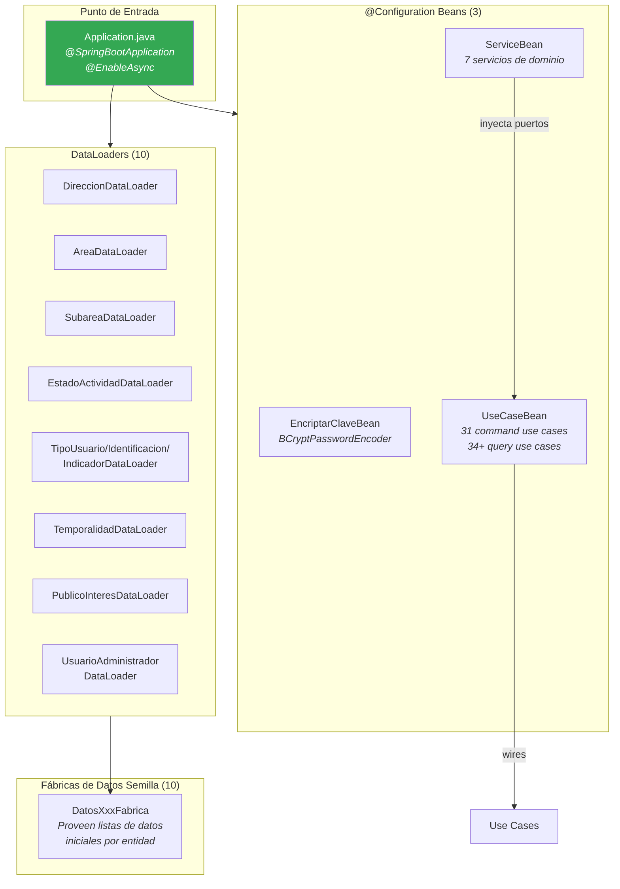

### 11.2 Orden de Carga de Datos Semilla

| # | DataLoader                        | Datos que carga                                                       |
|---|-----------------------------------|-----------------------------------------------------------------------|
| 1 | `DireccionDataLoader`             | Dirección de Bienestar y Evangelización                               |
| 2 | `AreaDataLoader`                  | 4 áreas: Bienestar, Evangelización, Hogar Santa María, Servicio       |
| 3 | `SubareaDataLoader`               | 8 subáreas de Bienestar (Deportes, Gimnasio, Banda, etc.)             |
| 4 | `EstadoActividadDataLoader`       | Estados: Pendiente, En Curso, Finalizada                              |
| 5 | `TipoUsuarioDataLoader`           | Tipos de usuario con permisos CRUD                                    |
| 6 | `TipoIdentificacionDataLoader`    | CC, TI, CE                                                            |
| 7 | `TipoIndicadorDataLoader`         | Tipos de indicadores de gestión                                       |
| 8 | `TemporalidadDataLoader`          | Temporalidades (Semestral, Anual, etc.)                               |
| 9 | `PublicoInteresDataLoader`        | Públicos de interés predefinidos                                      |
| 10| `UsuarioAdministradorDataLoader`  | Usuario admin por defecto                                             |

---

## 12. Componentes del Frontend — Vista General

```mermaid
graph TB
    subgraph AppRoot["🌐 AppModule"]
        AppComp["AppComponent<br/><i>Shell raíz</i>"]
        Router["AppRoutingModule<br/><i>Lazy Loading</i>"]
    end

    subgraph Core["📦 CoreModule"]
        Header["HeaderComponent"]
        Footer["FooterComponent"]
        HttpSvc["HttpService<br/><i>Wrapper HttpClient</i>"]
        AuthInt["AuthInterceptor<br/><i>Agrega Authorization</i>"]
        TokenInt["TokenInterceptor<br/><i>Agrega Bearer JWT</i>"]
        SecGuard["SecurityGuard<br/><i>Valida JWT + rol</i>"]
        PubGuard["PublicRouteGuard<br/><i>Redirige si autenticado</i>"]
        ErrHandler["ManejadorError<br/><i>ErrorHandler global</i>"]
    end

    subgraph Features["📦 Feature Modules (Lazy Loaded)"]
        Login["LoginModule<br/><i>/login</i>"]
        PwdRec["PasswordRecoveryModule<br/><i>/recuperar-contrasena</i>"]
        Home["HomeModule<br/><i>/home + 4 áreas + 8 subáreas</i>"]
        MgmtDept["ManageDepartmentModule<br/><i>/gestionar-direccion</i>"]
        MgmtUsers["ManageUsersModule<br/><i>/gestionar-usuarios</i>"]
        MgmtInd["ManageIndicatorsModule<br/><i>/gestionar-indicadores</i>"]
    end

    subgraph Shared["📦 SharedModule"]
        ActTable["ActivitiesTableComponent"]
        ActInfo["ActivityInfoComponent"]
        AttRec["AttendanceRecordComponent"]
        RegAct["RegisterNewActivityComponent"]
        EditAct["EditActivityComponent"]
        Filter["FilterListComponent"]
        DataViz["DataVisualization<br/><i>Chart.js: participantes,<br/>actividades, histórico</i>"]
        ChgPwd["ChangePasswordComponent"]
        Upload["UploadDatabaseComponent"]
        ExtPart["ExternalParticipantComponent"]
        ExcelRpt["ExcelReportService"]
        StateSvc["StateService<br/><i>Sesión desde JWT</i>"]
    end

    AppRoot --> Core
    AppRoot --> Features
    Features --> Shared
    Core --> AppRoot

    style AppRoot fill:#1a73e8,color:#fff
    style Core fill:#fbbc04,color:#000
    style Features fill:#34a853,color:#fff
    style Shared fill:#ea4335,color:#fff
```

---

## 13. Componente: Core Module

### 13.1 Diagrama Detallado

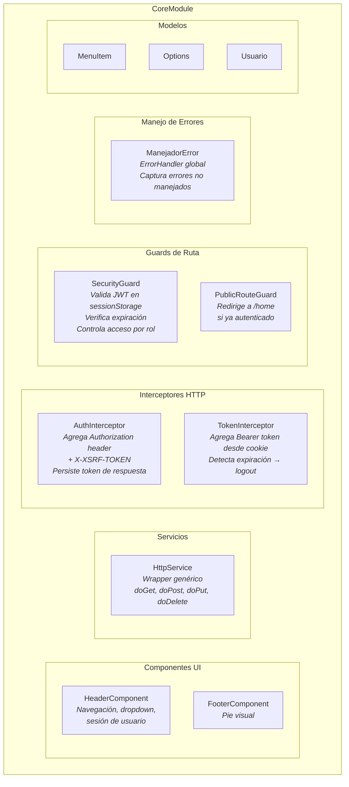

### 13.2 Flujo de Interceptores

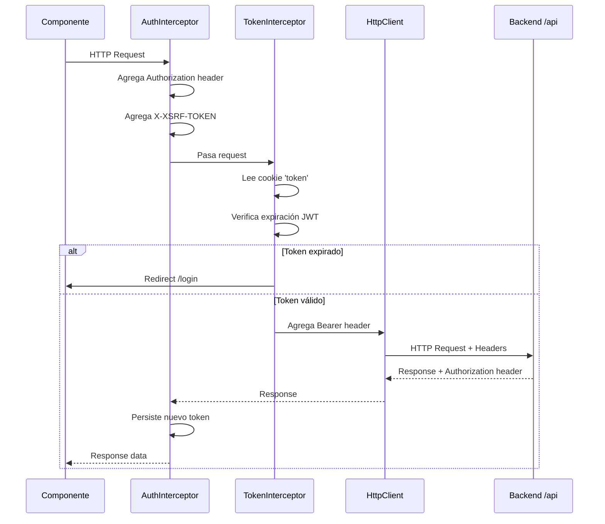

---

## 14. Componente: Feature Modules

### 14.1 Árbol de Módulos Lazy-Loaded

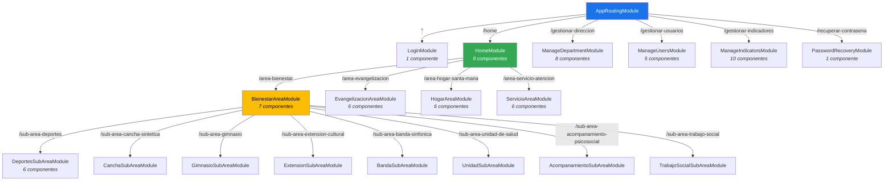

### 14.2 Resumen de Feature Modules

| Módulo                    | Ruta                        | Componentes | Guard           | Descripción                                          |
|---------------------------|-----------------------------|-------------|-----------------|------------------------------------------------------|
| `LoginModule`             | `/login`                    | 1           | PublicRouteGuard | Formulario de autenticación correo/clave             |
| `PasswordRecoveryModule`  | `/recuperar-contrasena`     | 1           | PublicRouteGuard | Wizard 3 pasos: solicitar código → validar → cambiar |
| `HomeModule`              | `/home`                     | 9           | SecurityGuard   | Dashboard principal con KPIs y actividades            |
| `BienestarAreaModule`     | `/home/area-bienestar`      | 7 + 8 subs  | SecurityGuard   | Área Bienestar con 8 subáreas lazy-loaded            |
| `EvangelizacionAreaModule`| `/home/area-evangelizacion`  | 6           | SecurityGuard   | Área Evangelización                                   |
| `HogarAreaModule`         | `/home/area-hogar-santa-maria`| 6         | SecurityGuard   | Hogar Santa María                                     |
| `ServicioAreaModule`      | `/home/area-servicio-atencion`| 6          | SecurityGuard   | Servicio y Atención al Usuario                       |
| `ManageDepartmentModule`  | `/gestionar-direccion`      | 8           | SecurityGuard   | Gestión de dirección, carga masiva Excel             |
| `ManageUsersModule`       | `/gestionar-usuarios`       | 5           | SecurityGuard   | CRUD de usuarios con estructura organizacional       |
| `ManageIndicatorsModule`  | `/gestionar-indicadores`    | 10          | SecurityGuard   | CRUD de indicadores, proyectos y acciones            |
| 8× SubArea Modules        | `/home/area-bienestar/sub-area-*` | 6 c/u | SecurityGuard | Una por subárea de Bienestar                         |

---

## 15. Componente: Shared Module

### 15.1 Diagrama

```mermaid
graph TB
    subgraph SharedModule["SharedModule"]
        subgraph UIComponents["Componentes UI Reutilizables"]
            ActTable["ActivitiesTableComponent<br/><i>Tabla de actividades con<br/>paginación, filtro, orden</i>"]
            ActInfo["ActivityInfoComponent<br/><i>Detalle de actividad</i>"]
            AttRec["AttendanceRecordComponent<br/><i>Registro de asistencia RFID<br/>+ cierre/cancelación</i>"]
            RegAct["RegisterNewActivityComponent<br/><i>Formulario nueva actividad</i>"]
            EditAct["EditActivityComponent<br/><i>Edición de actividad<br/>y ejecuciones</i>"]
            Filter["FilterListComponent<br/><i>Filtros analíticos globales</i>"]
            ExtPart["ExternalParticipantComponent<br/><i>Modal participante externo</i>"]
            ChgPwd["ChangePasswordComponent<br/><i>Modal cambio contraseña</i>"]
            Upload["UploadDatabaseComponent<br/><i>Modal carga Excel masiva</i>"]
            DataViz["DataVisualization<br/><i>3 sub-componentes Chart.js</i>"]
            AreaBtns["AreaButtonsComponent<br/><i>Toolbar con exportación Excel</i>"]
            PrimBtn["PrimaryButtonComponent"]
            Sep["SeparatorComponent"]
            AreaImg["AreaTopImageComponent"]
            GoToArea["GoToAreaButtonComponent"]
            DateSel["DateSelectorComponent"]
        end

        subgraph Services["Servicios Compartidos (11)"]
            ActSvc["ActivityService<br/><i>25+ endpoints de actividades</i>"]
            AreaSvc["AreaService<br/><i>GET /areas</i>"]
            DeptSvc["DepartmentService<br/><i>GET /direcciones</i>"]
            SubSvc["SubAreaService<br/><i>GET /subareas</i>"]
            UserSvc["UserService<br/><i>CRUD /usuarios</i>"]
            UTypeS["UserTypeService<br/><i>GET /tipos_usuario</i>"]
            IdTypeS["IdentificationTypeService<br/><i>GET /tipos_identificacion</i>"]
            MemberS["UniversityMemberService<br/><i>GET /miembros</i>"]
            UploadS["UploadDatabaseService<br/><i>POST /carga_masiva</i>"]
            ExcelS["ExcelReportService<br/><i>Genera .xlsx en cliente</i>"]
            StateS["StateService<br/><i>Rehidrata sesión JWT</i>"]
        end

        subgraph Models["Modelos (21)"]
            ModelList["Activity, ActivityExecution,<br/>ActivityState, Area, SubArea,<br/>Department, User, UserType,<br/>Participant, Employee, Student,<br/>UniversityMember, Identification,<br/>IdentificationType, CostCenter,<br/>EmploymentRelationship, Filters,<br/>FechaProgramada, Password,<br/>Response, State (enum)"]
        end
    end

    UIComponents --> Services
    Services -->|"HttpService"| API["Backend /api"]

    style SharedModule fill:#ea4335,color:#fff
```

### 15.2 Servicios Compartidos y sus Endpoints

| Servicio                    | Endpoints Backend Consumidos                                                                              |
|-----------------------------|-----------------------------------------------------------------------------------------------------------|
| `ActivityService`           | POST/PUT `/actividades`, GET por dirección/área/subárea, ejecuciones, participantes, conteos, estadísticas, filtros dinámicos (~25 endpoints) |
| `AreaService`               | GET `/areas`, `/areas/nombre/{n}`, `/areas/detalle/{id}`                                                  |
| `DepartmentService`         | GET `/direcciones`, `/direcciones/nombre/{n}`, `/direcciones/detalle/{id}`                                |
| `SubAreaService`            | GET `/subareas`, `/subareas/nombre/{n}`, `/subareas/detalle/{id}`                                         |
| `UserService`               | GET/POST/PUT/DELETE `/usuarios`, `/usuarios/usuario/{id}`, `/usuarios/usuario/correo/{c}`, PUT modificar clave |
| `UserTypeService`           | GET `/tipos_usuario`                                                                                      |
| `IdentificationTypeService` | GET `/tipos_identificacion`                                                                               |
| `UniversityMemberService`   | GET `/miembros/identificacion/{id}`, `/miembros/carnet/{carnet}`                                          |
| `UploadDatabaseService`     | POST `/carga_masiva/empleados`, `/carga_masiva/estudiantes`                                               |
| `LoginService` (feature)    | GET `/login`                                                                                               |
| `PasswordRecoveryService`   | POST solicitar, POST validar, PUT recuperar                                                                |
| `ActionService` (feature)   | GET/POST/PUT `/acciones`                                                                                   |
| `ProjectService` (feature)  | GET/POST/PUT `/proyectos`                                                                                  |
| `IndicatorService` (feature)| GET/POST/PUT `/indicadores`                                                                                |
| `FrequencyService` (feature)| GET `/temporalidades`                                                                                      |
| `IndicatorTypeService`      | GET `/tipos_indicador`                                                                                     |
| `InterestedPublicService`   | GET `/publicos_interes`                                                                                    |

---

## 16. Diagrama de Integración Frontend ↔ Backend

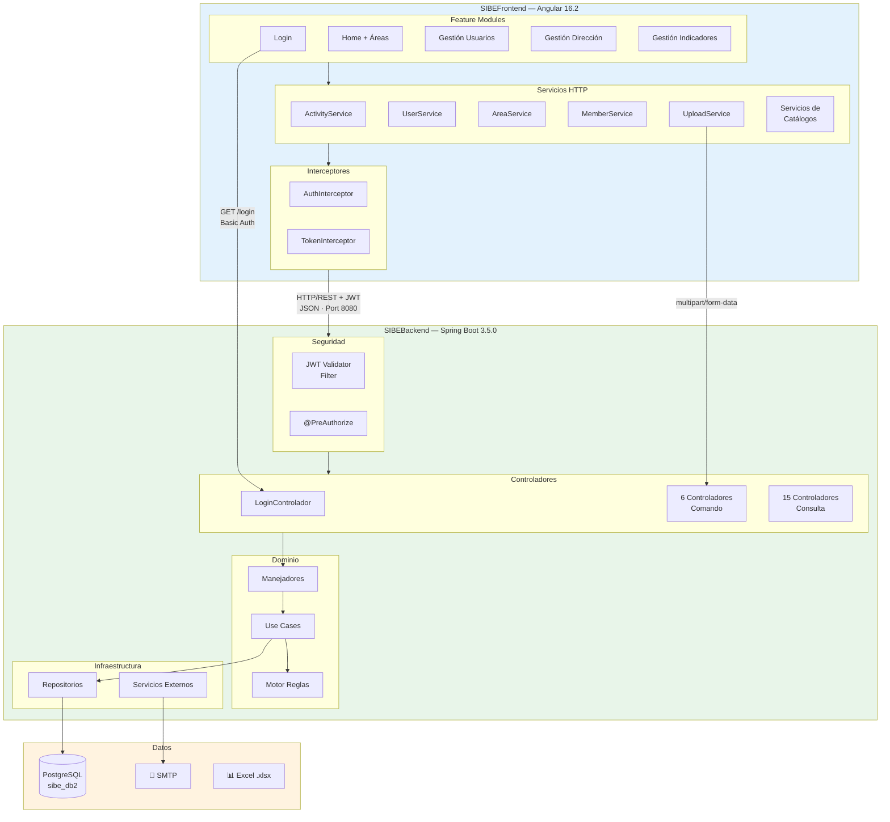

---

## 17. Mapa de Endpoints REST

### 17.1 Endpoints de Comando (Escritura)

| Recurso          | Método | Endpoint                                         | Descripción                          |
|------------------|--------|--------------------------------------------------|--------------------------------------|
| **Usuarios**     | POST   | `/api/usuarios`                                  | Crear usuario                        |
|                  | PUT    | `/api/usuarios/usuario/{id}`                     | Modificar usuario                    |
|                  | DELETE | `/api/usuarios/usuario/{id}`                     | Eliminar usuario                     |
|                  | PUT    | `/api/usuarios/modificar/clave`                  | Cambiar contraseña                   |
|                  | POST   | `/api/usuarios/recuperacion/solicitar/{correo}`  | Solicitar código recuperación        |
|                  | POST   | `/api/usuarios/recuperacion/validarCodigo`       | Validar código                       |
|                  | POST   | `/api/usuarios/recuperacion/recuperarClave`      | Completar recuperación               |
| **Actividades**  | POST   | `/api/actividades`                               | Crear actividad                      |
|                  | PUT    | `/api/actividades/{id}`                          | Modificar actividad                  |
|                  | PUT    | `/api/actividades/iniciar/{id}`                  | Iniciar actividad                    |
|                  | PUT    | `/api/actividades/cancelar/{id}`                 | Cancelar actividad                   |
|                  | PUT    | `/api/actividades/finalizar/{id}`                | Finalizar actividad                  |
| **Acciones**     | POST   | `/api/acciones`                                  | Crear acción                         |
|                  | PUT    | `/api/acciones/{id}`                             | Modificar acción                     |
| **Indicadores**  | POST   | `/api/indicadores`                               | Crear indicador                      |
|                  | PUT    | `/api/indicadores/{id}`                          | Modificar indicador                  |
| **Proyectos**    | POST   | `/api/proyectos`                                 | Crear proyecto                       |
|                  | PUT    | `/api/proyectos/{id}`                            | Modificar proyecto                   |
| **Carga Masiva** | POST   | `/api/carga_masiva/empleados`                    | Carga Excel de empleados             |
|                  | POST   | `/api/carga_masiva/estudiantes`                  | Carga Excel de estudiantes           |
| **Login**        | GET    | `/api/login`                                     | Autenticación (Basic → JWT)          |

### 17.2 Endpoints de Consulta (Lectura)

| Recurso              | Método | Endpoint                                                          | Descripción                              |
|----------------------|--------|-------------------------------------------------------------------|------------------------------------------|
| **Usuarios**         | GET    | `/api/usuarios`                                                   | Listar usuarios                          |
|                      | GET    | `/api/usuarios/paginado`                                          | Listar paginado (`?tipoUsuario&pagina&tamano&excluir`) |
|                      | GET    | `/api/usuarios/usuario/id/{identificador}`                        | Consultar por ID                         |
|                      | GET    | `/api/usuarios/usuario/correo/{correo}`                           | Consultar por correo                     |
| **Actividades**      | GET    | `/api/actividades/direccion/{identificador}`                      | Por dirección                            |
|                      | GET    | `/api/actividades/direccion/{identificador}/paginado`             | Por dirección paginado                   |
|                      | GET    | `/api/actividades/area/{identificador}`                           | Por área                                 |
|                      | GET    | `/api/actividades/area/{identificador}/paginado`                  | Por área paginado                        |
|                      | GET    | `/api/actividades/subarea/{identificador}`                        | Por subárea                              |
|                      | GET    | `/api/actividades/subarea/{identificador}/paginado`               | Por subárea paginado                     |
|                      | GET    | `/api/actividades/ejecuciones/{identificador}`                    | Ejecuciones de actividad                 |
|                      | GET    | `/api/actividades/ejecuciones/{identificador}/paginado`           | Ejecuciones paginado                     |
|                      | GET    | `/api/actividades/ejecuciones/ejecucion/participantes/{id}`       | Participantes de ejecución               |
|                      | GET    | `/api/actividades/ejecuciones/ejecucion/participantes/{id}/paginado` | Participantes paginado                |
|                      | GET    | `/api/actividades/ejecuciones/finalizadas/meses`                  | Meses con ejecuciones finalizadas        |
|                      | GET    | `/api/actividades/ejecuciones/finalizadas/annos`                  | Años con ejecuciones finalizadas         |
|                      | GET    | `/api/actividades/ejecuciones/finalizadas/semestres`              | Semestres en ejecuciones finalizadas     |
|                      | GET    | `/api/actividades/ejecuciones/finalizadas/centros-costos`         | Centros de costos en ejecuciones         |
|                      | GET    | `/api/actividades/ejecuciones/finalizadas/tipos-participantes`    | Tipos de participantes en ejecuciones    |
|                      | GET    | `/api/actividades/ejecuciones/finalizadas/programas-academicos`   | Programas académicos en ejecuciones      |
|                      | GET    | `/api/actividades/ejecuciones/finalizadas/niveles-formacion`      | Niveles de formación en ejecuciones      |
|                      | GET    | `/api/actividades/ejecuciones/finalizadas/indicadores`            | Indicadores en ejecuciones finalizadas   |
|                      | POST   | `/api/actividades/ejecuciones/finalizadas/participantes/conteo`   | Conteo participantes (filtro)            |
|                      | POST   | `/api/actividades/ejecuciones/finalizadas/asistencias/conteo`     | Conteo asistencias (filtro)              |
|                      | POST   | `/api/actividades/ejecuciones/finalizadas/conteo`                 | Conteo ejecuciones (filtro)              |
|                      | POST   | `/api/actividades/ejecuciones/finalizadas/poblacion/conteo`       | Conteo población (filtro)                |
|                      | POST   | `/api/actividades/ejecuciones/finalizadas/participantes/estadisticas-estructura` | Estadísticas por estructura |
|                      | POST   | `/api/actividades/ejecuciones/finalizadas/participantes/estadisticas-mes`         | Estadísticas por mes       |
| **Áreas**            | GET    | `/api/areas`                                                      | Listar áreas                             |
|                      | GET    | `/api/areas/nombre/{nombre}`                                      | Buscar por nombre                        |
|                      | GET    | `/api/areas/detalle/{identificador}`                              | Detalle de área                          |
| **Direcciones**      | GET    | `/api/direcciones`                                                | Listar direcciones                       |
|                      | GET    | `/api/direcciones/nombre/{nombre}`                                | Buscar por nombre                        |
|                      | GET    | `/api/direcciones/detalle/{identificador}`                        | Detalle de dirección                     |
| **Subáreas**         | GET    | `/api/subareas`                                                   | Listar subáreas                          |
|                      | GET    | `/api/subareas/nombre/{nombre}`                                   | Buscar por nombre                        |
|                      | GET    | `/api/subareas/detalle/{identificador}`                           | Detalle de subárea                       |
| **Indicadores**      | GET    | `/api/indicadores`                                                | Listar indicadores paginado (`?pagina&tamano`) |
|                      | GET    | `/api/indicadores/todos`                                          | Listar todos sin paginar                 |
|                      | GET    | `/api/indicadores/actividades`                                    | Indicadores para actividades             |
| **Proyectos**        | GET    | `/api/proyectos`                                                  | Listar proyectos paginado (`?pagina&tamano`) |
| **Acciones**         | GET    | `/api/acciones`                                                   | Listar acciones paginado (`?pagina&tamano`) |
| **Miembros**         | GET    | `/api/miembros/identificacion/{identificacion}`                   | Buscar por identificación                |
|                      | GET    | `/api/miembros/carnet/{carnet}`                                   | Buscar por carnet RFID                   |
| **Organización**     | GET    | `/api/organizacion/{identificador}/usuarios/contar`               | Contar usuarios por estructura           |
| **Catálogos**        | GET    | `/api/tipos_usuario`                                              | Tipos de usuario                         |
|                      | GET    | `/api/tipos_identificacion`                                       | Tipos de identificación                  |
|                      | GET    | `/api/tipos_indicador`                                            | Tipos de indicador                       |
|                      | GET    | `/api/temporalidades`                                             | Temporalidades                           |
|                      | GET    | `/api/publicos_interes`                                           | Públicos de interés                      |

---

## 18. Flujo de Datos — Request Completo

### 18.1 Flujo de Comando (Escritura)

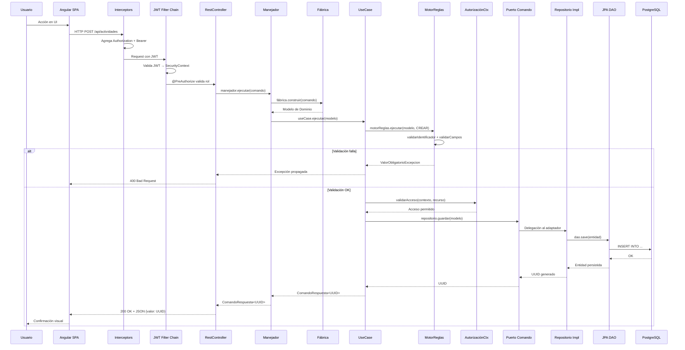

### 18.2 Flujo de Consulta (Lectura)

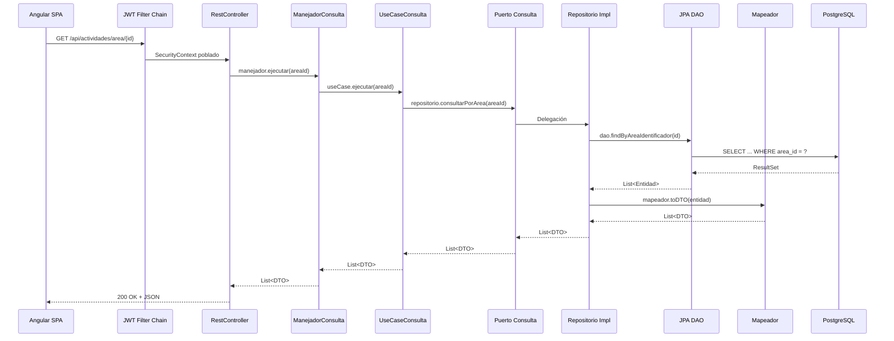

---

## 19. Inventario Cuantitativo de Componentes

### 19.1 Backend

| Capa                | Subcategoría                    | Cantidad |
|---------------------|---------------------------------|----------|
| **Infraestructura** | Controladores Comando           | 6        |
|                     | Controladores Consulta          | 15       |
|                     | Login Controller                | 1        |
|                     | Filtros de Seguridad            | 6        |
|                     | Config Security                 | 2        |
|                     | DAOs (JpaRepository)            | 45       |
|                     | Entidades JPA                   | 44       |
|                     | Mapeadores                      | 44       |
|                     | Repositorios Comando Impl       | 19       |
|                     | Repositorios Consulta Impl      | 24       |
|                     | Servicios Infraestructura       | 6        |
|                     | Configuración Bean              | 3        |
|                     | DataLoaders                     | 10       |
|                     | Fábricas Datos Semilla          | 10       |
|                     | Error Handling                  | 2        |
| **Aplicación**      | Comandos (DTOs entrada)         | 22       |
|                     | Fábricas Comando→Dominio        | 22       |
|                     | Manejadores Comando             | 29       |
|                     | Manejadores Consulta            | 55       |
|                     | Interfaces Handler              | 4        |
|                     | Puertos Servicio Aplicación     | 2        |
| **Dominio**         | Modelos de Dominio              | 31       |
|                     | DTOs de Salida                  | 31       |
|                     | Enums                           | 4        |
|                     | Puertos Comando                 | 19       |
|                     | Puertos Consulta                | 24       |
|                     | Puertos Servicio                | 3        |
|                     | Use Cases Comando               | 30       |
|                     | Use Cases Consulta              | 34       |
|                     | Reglas de Negocio               | 28       |
|                     | Fábricas Motor Reglas           | 28       |
|                     | Servicios de Dominio            | 7        |
|                     | Excepciones                     | 8        |
|                     | Constantes                      | 12       |
|                     | Utilidades                      | 5        |
| **Total Backend**   |                                 | **~660** |

### 19.2 Frontend

| Categoría            | Subcategoría                       | Cantidad |
|----------------------|------------------------------------|----------|
| **Modules**          | AppModule                          | 1        |
|                      | CoreModule                         | 1        |
|                      | SharedModule                       | 1        |
|                      | Feature Modules (top-level)        | 6        |
|                      | Área Modules                       | 4        |
|                      | SubÁrea Modules                    | 8        |
| **Components**       | Core (Header, Footer)              | 2        |
|                      | Shared (reutilizables)             | 18       |
|                      | Login                              | 1        |
|                      | Password Recovery                  | 1        |
|                      | Home + Áreas + SubÁreas            | ~75      |
|                      | Manage Department                  | 8        |
|                      | Manage Users                       | 5        |
|                      | Manage Indicators                  | 10       |
| **Services**         | Core                               | 2        |
|                      | Shared                             | 11       |
|                      | Feature-specific                   | 8        |
| **Guards**           |                                    | 2        |
| **Interceptors**     |                                    | 2        |
| **Error Handler**    |                                    | 1        |
| **Models/Interfaces**|                                    | ~30      |
| **Total Frontend**   |                                    | **~220** |

### 19.3 Resumen Global

| Contenedor     | Archivos Fuente Aprox. | Lenguaje   |
|----------------|------------------------|-----------|
| **Backend**    | ~670                   | Java 17    |
| **Frontend**   | ~220                   | TypeScript |
| **Total**      | **~890**               |            |

