# 26. Diagrama de Paquetes — SIBE

| Metadato              | Valor                                                                      |
|-----------------------|----------------------------------------------------------------------------|
| **Proyecto**          | SIBE — Sistema de Información de Bienestar y Evangelización                |
| **Backend**           | Java 17 · Spring Boot 3.5.0 · Arquitectura Hexagonal + CQRS               |
| **Frontend**          | Angular 16.2 · Lazy Loading por Feature · Core/Shared/Feature Pattern      |
| **Base de Datos**     | PostgreSQL 5432 (`sibe_db2`)                                               |
| **Formato Diagramas** | Mermaid (`graph`, `flowchart`)                                             |
| **Versión**           | 1.0                                                                        |

---

## Tabla de Contenido

- [26. Diagrama de Paquetes — SIBE](#26-diagrama-de-paquetes--sibe)
  - [Tabla de Contenido](#tabla-de-contenido)
  - [1. Visión General](#1-visión-general)
    - [Convenciones de Notación](#convenciones-de-notación)
    - [Métricas Globales](#métricas-globales)
  - [2. Diagrama de Paquetes Global — Sistema Completo](#2-diagrama-de-paquetes-global--sistema-completo)
  - [3. Backend — Paquete Raíz y Capas Principales](#3-backend--paquete-raíz-y-capas-principales)
    - [3.1 Diagrama Jerárquico de Capas](#31-diagrama-jerárquico-de-capas)
    - [3.2 Inventario Completo de Paquetes Backend](#32-inventario-completo-de-paquetes-backend)
  - [4. Backend — Capa de Dominio (`dominio`)](#4-backend--capa-de-dominio-dominio)
    - [4.1 Diagrama de Paquetes del Dominio](#41-diagrama-de-paquetes-del-dominio)
    - [4.2 Responsabilidades por Sub-Paquete](#42-responsabilidades-por-sub-paquete)
  - [5. Backend — Capa de Aplicación (`aplicacion`)](#5-backend--capa-de-aplicación-aplicacion)
    - [5.1 Diagrama de Paquetes de Aplicación](#51-diagrama-de-paquetes-de-aplicación)
    - [5.2 Flujo de Dependencia Intra-Capa](#52-flujo-de-dependencia-intra-capa)
  - [6. Backend — Capa de Infraestructura (`infraestructura`)](#6-backend--capa-de-infraestructura-infraestructura)
    - [6.1 Diagrama de Paquetes de Infraestructura](#61-diagrama-de-paquetes-de-infraestructura)
    - [6.2 Responsabilidades por Sub-Paquete](#62-responsabilidades-por-sub-paquete)
  - [7. Backend — Dependencias entre Paquetes](#7-backend--dependencias-entre-paquetes)
    - [7.1 Diagrama de Dependencias entre Capas](#71-diagrama-de-dependencias-entre-capas)
    - [7.2 Regla de Dependencia (Dependency Rule)](#72-regla-de-dependencia-dependency-rule)
  - [8. Backend — Paquetes de Test](#8-backend--paquetes-de-test)
    - [8.1 Diagrama de Correspondencia Producción ↔ Test](#81-diagrama-de-correspondencia-producción--test)
    - [8.2 Inventario de Paquetes de Test](#82-inventario-de-paquetes-de-test)
  - [9. Frontend — Paquete Raíz y Módulos Principales](#9-frontend--paquete-raíz-y-módulos-principales)
    - [9.1 Diagrama General de Módulos](#91-diagrama-general-de-módulos)
  - [10. Frontend — Core Module (`core/`)](#10-frontend--core-module-core)
    - [10.1 Diagrama de Paquetes del Core](#101-diagrama-de-paquetes-del-core)
    - [10.2 Contenido por Directorio](#102-contenido-por-directorio)
  - [11. Frontend — Shared Module (`shared/`)](#11-frontend--shared-module-shared)
    - [11.1 Diagrama de Paquetes del Shared](#111-diagrama-de-paquetes-del-shared)
    - [11.2 Inventario de Componentes Compartidos](#112-inventario-de-componentes-compartidos)
  - [12. Frontend — Feature Modules (`feature/`)](#12-frontend--feature-modules-feature)
    - [12.1 Diagrama de Paquetes de Features](#121-diagrama-de-paquetes-de-features)
    - [12.2 Estructura Interna por Feature Module](#122-estructura-interna-por-feature-module)
  - [13. Frontend — Home Module y Sub-Módulos de Área](#13-frontend--home-module-y-sub-módulos-de-área)
    - [13.1 Diagrama de Paquetes del Home](#131-diagrama-de-paquetes-del-home)
    - [13.2 Sub-Módulos de SubÁrea (Bienestar)](#132-sub-módulos-de-subárea-bienestar)
    - [13.3 Inventario de Componentes por SubÁrea](#133-inventario-de-componentes-por-subárea)
  - [14. Frontend — Dependencias entre Módulos](#14-frontend--dependencias-entre-módulos)
    - [14.1 Diagrama de Dependencias](#141-diagrama-de-dependencias)
    - [14.2 Tabla de Dependencias entre Módulos](#142-tabla-de-dependencias-entre-módulos)
  - [15. Matriz de Dependencias Cruzadas Backend ↔ Frontend](#15-matriz-de-dependencias-cruzadas-backend--frontend)
    - [15.1 Correspondencia de Paquetes](#151-correspondencia-de-paquetes)
    - [15.2 Flujo de Paquetes en un Request](#152-flujo-de-paquetes-en-un-request)
  - [16. Inventario Cuantitativo de Paquetes](#16-inventario-cuantitativo-de-paquetes)
    - [16.1 Backend — Resumen por Capa](#161-backend--resumen-por-capa)
    - [16.2 Backend — Distribución por Tipo de Artefacto](#162-backend--distribución-por-tipo-de-artefacto)
    - [16.3 Frontend — Resumen por Tipo de Módulo](#163-frontend--resumen-por-tipo-de-módulo)
    - [16.4 Frontend — Archivos por Directorio Principal](#164-frontend--archivos-por-directorio-principal)
  - [17. Principios Arquitectónicos Evidenciados](#17-principios-arquitectónicos-evidenciados)
    - [17.1 Principios en el Backend](#171-principios-en-el-backend)
    - [17.2 Principios en el Frontend](#172-principios-en-el-frontend)

---

## 1. Visión General

El **Diagrama de Paquetes** documenta la organización lógica del código fuente en agrupaciones jerárquicas (paquetes Java y módulos/directorios Angular), mostrando las dependencias y relaciones de contención entre ellos. Este artefacto complementa el Diagrama de Componentes (artefacto 26) al enfocarse en la **estructura estática de organización del código**.

### Convenciones de Notación

| Símbolo       | Significado                                                |
|---------------|------------------------------------------------------------|
| `📦`          | Paquete o módulo                                           |
| `→`           | Dependencia (el origen depende del destino)                |
| `-.->` / `..>`| Dependencia inversa o implementación de interfaz           |
| `(N)`         | Número de archivos/clases directos en el paquete           |
| `[R]`         | Paquete con módulo de routing                              |

### Métricas Globales

| Métrica                                | Backend (Java)    | Frontend (TypeScript) |
|----------------------------------------|-------------------|-----------------------|
| **Archivos fuente (producción)**       | 653               | 387                   |
| **Archivos de test**                   | 378               | ~150 (spec.ts)        |
| **Paquetes / Directorios con código**  | 51                | ~80                   |
| **Paquetes de test**                   | 38                | Colocados con fuente  |
| **Profundidad máxima de anidamiento**  | 7 niveles         | 8 niveles             |

---

## 2. Diagrama de Paquetes Global — Sistema Completo

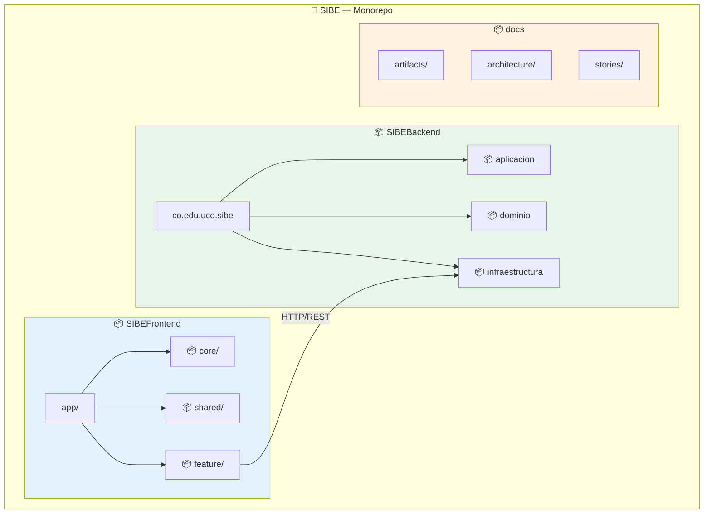

---

## 3. Backend — Paquete Raíz y Capas Principales

### 3.1 Diagrama Jerárquico de Capas

```mermaid
graph TB
    subgraph root["co.edu.uco.sibe (1)"]
        App["Application.java<br/><i>@SpringBootApplication</i>"]

        subgraph aplicacion["📦 aplicacion — Capa de Aplicación"]
            appCmd["📦 comando (22)"]
            appCmdFab["📦 comando.fabrica (22)"]
            appCmdMan["📦 comando.manejador (30)"]
            appCon["📦 consulta (58)"]
            appPto["📦 puerto.servicio (2)"]
            appTrv["📦 transversal (1)"]
            appTrvMan["📦 transversal.manejador (4)"]
        end

        subgraph dominio["📦 dominio — Capa de Dominio"]
            domDTO["📦 dto (32)"]
            domEnum["📦 enums (4)"]
            domMod["📦 modelo (32)"]
            domPtoCmd["📦 puerto.comando (20)"]
            domPtoCon["📦 puerto.consulta (24)"]
            domPtoSvc["📦 puerto.servicio (3)"]
            domRegla["📦 regla (2)"]
            domReglaFab["📦 regla.fabrica (2)"]
            domReglaFabImpl["📦 regla.fabrica.impl (28)"]
            domReglaImpl["📦 regla.implementacion (28)"]
            domReglaMotor["📦 regla.motor (1)"]
            domSvc["📦 service (7)"]
            domUCCmd["📦 usecase.comando (31)"]
            domUCCon["📦 usecase.consulta (34)"]
            domConst["📦 transversal.constante (12)"]
            domExc["📦 transversal.excepcion (8)"]
            domUtil["📦 transversal.utilitarios (5)"]
        end

        subgraph infraestructura["📦 infraestructura — Capa de Infraestructura"]
            infDAO["📦 adaptador.dao (44)"]
            infEnt["📦 adaptador.entidad (44)"]
            infMap["📦 adaptador.mapeador (46)"]
            infRepCmd["📦 adaptador.repositorio.comando (20)"]
            infRepCon["📦 adaptador.repositorio.consulta (24)"]
            infSvc["📦 adaptador.servicio (6)"]
            infBean["📦 configuracion.bean (3)"]
            infDL["📦 configuracion.dataloader (11)"]
            infDLFab["📦 configuracion.dataloader.fabrica (10)"]
            infCtrlLogin["📦 controlador (1)"]
            infCtrlCmd["📦 controlador.comando (6)"]
            infCtrlCon["📦 controlador.consulta (15)"]
            infErr["📦 error (2)"]
            infSecConf["📦 seguridad.configuration (2)"]
            infSecFilt["📦 seguridad.filter (6)"]
        end
    end

    %% Regla de Dependencia: Infraestructura → Aplicación → Dominio
    infraestructura -->|"depende de"| aplicacion
    aplicacion -->|"depende de"| dominio
    infraestructura -->|"implementa puertos de"| dominio

    style aplicacion fill:#ffe0b2
    style dominio fill:#f8bbd0
    style infraestructura fill:#c8e6c9
```

### 3.2 Inventario Completo de Paquetes Backend

| # | Paquete (FQN)                                                         | Clases | Rol                                      |
|---|-----------------------------------------------------------------------|--------|------------------------------------------|
| 1 | `co.edu.uco.sibe`                                                     | 1      | Punto de entrada `Application`           |
| 2 | `co.edu.uco.sibe.aplicacion.comando`                                  | 22     | DTOs de comando (entrada)                |
| 3 | `co.edu.uco.sibe.aplicacion.comando.fabrica`                          | 22     | Fábricas Comando → Modelo de Dominio     |
| 4 | `co.edu.uco.sibe.aplicacion.comando.manejador`                        | 30     | Manejadores de comando (orquestadores)   |
| 5 | `co.edu.uco.sibe.aplicacion.consulta`                                 | 58     | Manejadores de consulta                  |
| 6 | `co.edu.uco.sibe.aplicacion.puerto.servicio`                          | 2      | Puertos de servicio de aplicación        |
| 7 | `co.edu.uco.sibe.aplicacion.transversal`                              | 1      | `ComandoRespuesta` wrapper               |
| 8 | `co.edu.uco.sibe.aplicacion.transversal.manejador`                    | 4      | Interfaces handler genéricas             |
| 9 | `co.edu.uco.sibe.dominio.dto`                                         | 32     | DTOs de salida (lectura)                 |
| 10| `co.edu.uco.sibe.dominio.enums`                                       | 4      | Enumeraciones de dominio                 |
| 11| `co.edu.uco.sibe.dominio.modelo`                                      | 32     | Modelos de dominio (entidades negocio)   |
| 12| `co.edu.uco.sibe.dominio.puerto.comando`                              | 20     | Puertos de escritura (interfaces)        |
| 13| `co.edu.uco.sibe.dominio.puerto.consulta`                             | 24     | Puertos de lectura (interfaces)          |
| 14| `co.edu.uco.sibe.dominio.puerto.servicio`                             | 3      | Puertos de servicios externos            |
| 15| `co.edu.uco.sibe.dominio.regla`                                       | 2      | `Regla`, `TipoOperacion`                |
| 16| `co.edu.uco.sibe.dominio.regla.fabrica`                               | 2      | `MotorFabrica`, `MotoresFabrica`         |
| 17| `co.edu.uco.sibe.dominio.regla.fabrica.implementacion`                | 28     | Fábricas de motores por entidad          |
| 18| `co.edu.uco.sibe.dominio.regla.implementacion`                        | 28     | Reglas de validación por entidad         |
| 19| `co.edu.uco.sibe.dominio.regla.motor`                                 | 1      | `MotorRegla<T>` genérico                 |
| 20| `co.edu.uco.sibe.dominio.service`                                     | 7      | Servicios de dominio                     |
| 21| `co.edu.uco.sibe.dominio.usecase.comando`                             | 31     | Casos de uso de escritura                |
| 22| `co.edu.uco.sibe.dominio.usecase.consulta`                            | 34     | Casos de uso de lectura                  |
| 23| `co.edu.uco.sibe.dominio.transversal.constante`                       | 12     | Clases de constantes                     |
| 24| `co.edu.uco.sibe.dominio.transversal.excepcion`                       | 8      | Excepciones de dominio                   |
| 25| `co.edu.uco.sibe.dominio.transversal.utilitarios`                     | 5      | Utilidades (fecha, UUID, validadores)    |
| 26| `co.edu.uco.sibe.infraestructura.adaptador.dao`                       | 44     | DAOs `JpaRepository`                     |
| 27| `co.edu.uco.sibe.infraestructura.adaptador.entidad`                   | 44     | Entidades JPA `@Entity`                  |
| 28| `co.edu.uco.sibe.infraestructura.adaptador.mapeador`                  | 46     | Mapeadores Entidad ↔ Dominio            |
| 29| `co.edu.uco.sibe.infraestructura.adaptador.repositorio.comando`       | 20     | Implementaciones de puertos comando      |
| 30| `co.edu.uco.sibe.infraestructura.adaptador.repositorio.consulta`      | 24     | Implementaciones de puertos consulta     |
| 31| `co.edu.uco.sibe.infraestructura.adaptador.servicio`                  | 6      | Implementaciones de puertos servicio     |
| 32| `co.edu.uco.sibe.infraestructura.configuracion.bean`                  | 3      | Beans `@Configuration`                   |
| 33| `co.edu.uco.sibe.infraestructura.configuracion.dataloader`            | 11     | DataLoaders de datos semilla             |
| 34| `co.edu.uco.sibe.infraestructura.configuracion.dataloader.fabrica`    | 10     | Fábricas de datos semilla                |
| 35| `co.edu.uco.sibe.infraestructura.controlador`                         | 1      | `LoginControlador`                       |
| 36| `co.edu.uco.sibe.infraestructura.controlador.comando`                 | 6      | Controladores REST de comando            |
| 37| `co.edu.uco.sibe.infraestructura.controlador.consulta`                | 15     | Controladores REST de consulta           |
| 38| `co.edu.uco.sibe.infraestructura.error`                               | 2      | `ManejadorError`, `Error`                |
| 39| `co.edu.uco.sibe.infraestructura.seguridad.configuration`             | 2      | Security config + AuthProvider           |
| 40| `co.edu.uco.sibe.infraestructura.seguridad.filter`                    | 6      | Filtros JWT `OncePerRequestFilter`       |
|   | **Total paquetes con código**                                         | **40** | **653 clases**                           |

> *Nota: 11 paquetes adicionales son estructurales (sin clases directas), totalizando 51 paquetes.*

---

## 4. Backend — Capa de Dominio (`dominio`)

### 4.1 Diagrama de Paquetes del Dominio

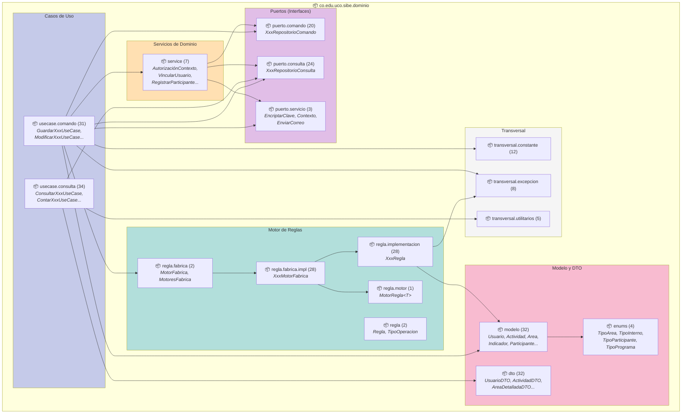

### 4.2 Responsabilidades por Sub-Paquete

| Sub-Paquete          | Archivos | Responsabilidad                                                             |
|----------------------|----------|-----------------------------------------------------------------------------|
| `modelo`             | 32       | Objetos de dominio con lógica de negocio encapsulada                        |
| `dto`                | 32       | Objetos de transferencia para lectura (inmutables, sin lógica)              |
| `enums`              | 4        | Clasificaciones tipificadas del dominio                                     |
| `puerto.comando`     | 20       | Contratos de escritura hacia persistencia                                   |
| `puerto.consulta`    | 24       | Contratos de lectura desde persistencia                                     |
| `puerto.servicio`    | 3        | Contratos de servicios técnicos (encriptar, contexto, correo)               |
| `usecase.comando`    | 31       | Orquestación de operaciones de escritura con validación y reglas            |
| `usecase.consulta`   | 34       | Orquestación de operaciones de lectura                                      |
| `regla`              | 2        | Contratos base del motor de reglas (`Regla`, `TipoOperacion`)              |
| `regla.motor`        | 1        | Motor genérico `MotorRegla<T>` con `EnumMap<TipoOperacion, List<Consumer>>`|
| `regla.fabrica`      | 2        | Registro singleton de motores por entidad                                   |
| `regla.fabrica.impl` | 28       | Fábricas específicas que construyen motores para cada entidad               |
| `regla.impl`         | 28       | Reglas concretas de validación de campos por entidad                        |
| `service`            | 7        | Servicios de dominio que orquestan lógica entre múltiples agregados         |
| `transversal.const`  | 12       | Constantes del sistema (endpoints, mensajes, seguridad)                     |
| `transversal.exc`    | 8        | Jerarquía de excepciones de dominio                                         |
| `transversal.util`   | 5        | Utilidades puras (validación, fecha, UUID)                                  |

### 4.3 Flujo de Dependencia Intra-Capa

```
usecase.comando (31)
    ├── usa → modelo (32)               // Opera sobre modelos de dominio
    ├── usa → puerto.comando (20)       // Persiste cambios
    ├── usa → puerto.consulta (24)      // Consulta para validaciones
    ├── usa → puerto.servicio (3)       // Servicios externos (encriptar, correo)
    ├── usa → regla.fabrica (2)         // Valida con motor de reglas
    ├── usa → service (7)              // Delega en servicios de dominio
    ├── usa → transversal.constante     // Constantes del sistema
    └── usa → transversal.excepcion     // Lanza excepciones de negocio

usecase.consulta (34)
    ├── usa → puerto.consulta (24)      // Lee datos
    ├── usa → dto (32)                  // Retorna DTOs de salida
    └── usa → transversal.utilitarios   // Conversiones

service (7)
    ├── usa → puerto.comando (20)       // Persiste
    ├── usa → puerto.consulta (24)      // Consulta
    └── usa → puerto.servicio (3)       // Servicios externos

regla.fabrica.impl (28)
    ├── usa → regla.motor (1)           // Construye MotorRegla<T>
    └── usa → regla.implementacion (28) // Registra reglas concretas

regla.implementacion (28)
    ├── usa → modelo (32)               // Valida campos del modelo
    └── usa → transversal.excepcion (8) // Lanza excepciones
```

---

## 5. Backend — Capa de Aplicación (`aplicacion`)

### 5.1 Diagrama de Paquetes de Aplicación

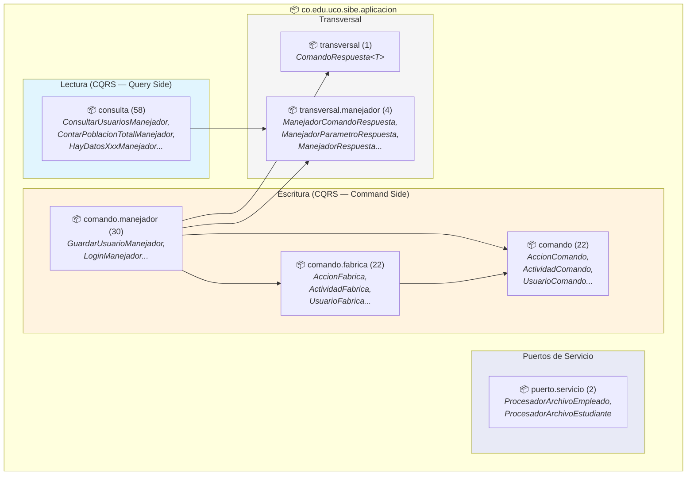

### 5.2 Flujo de Dependencia Intra-Capa

```
comando.manejador (30)
    ├── usa → comando (22)          // Recibe DTO de entrada
    ├── usa → comando.fabrica (22)  // Transforma DTO → Modelo
    ├── usa → transversal (1)       // Retorna ComandoRespuesta<T>
    └── usa → dominio.usecase.comando  // Delega a UseCase

consulta (58)
    ├── usa → transversal.manejador (4) // Implementa interfaz
    └── usa → dominio.usecase.consulta  // Delega a UseCase

puerto.servicio (2)
    └── implementado por → infraestructura.adaptador.servicio
```

---

## 6. Backend — Capa de Infraestructura (`infraestructura`)

### 6.1 Diagrama de Paquetes de Infraestructura

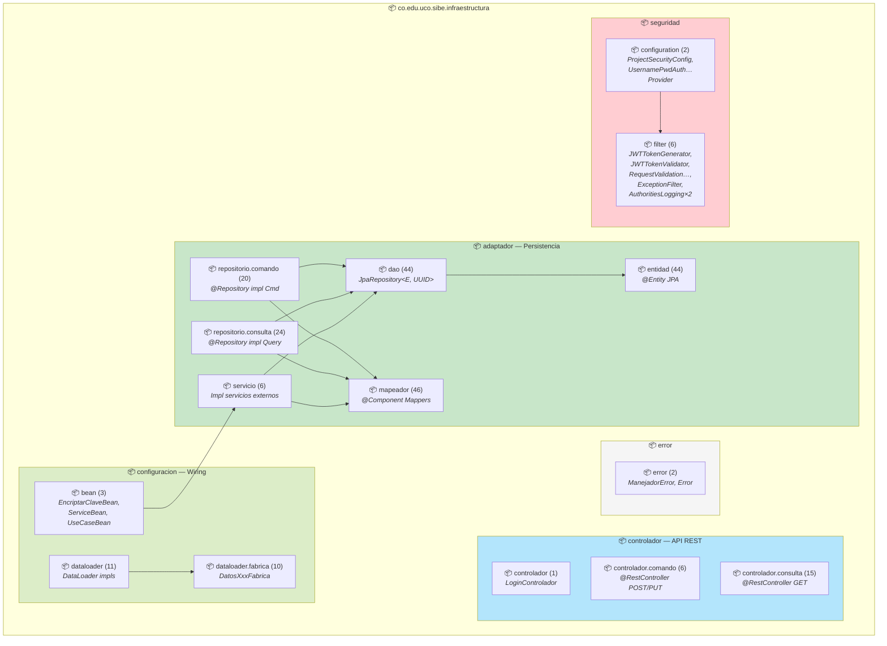

### 6.2 Responsabilidades por Sub-Paquete

| Sub-Paquete               | Archivos | Responsabilidad                                              |
|---------------------------|----------|--------------------------------------------------------------|
| `adaptador.dao`           | 44       | Interfaces Spring Data JPA para acceso a datos               |
| `adaptador.entidad`       | 44       | Entidades JPA con mapeo ORM a PostgreSQL                     |
| `adaptador.mapeador`      | 46       | Conversión bidireccional Entidad JPA ↔ Modelo de Dominio    |
| `adaptador.repo.comando`  | 20       | Implementación de puertos de escritura del dominio           |
| `adaptador.repo.consulta` | 24       | Implementación de puertos de lectura del dominio             |
| `adaptador.servicio`      | 6        | Implementaciones de servicios técnicos (BCrypt, Mail, POI)   |
| `configuracion.bean`      | 3        | Wiring de beans: servicios, use cases, password encoder      |
| `configuracion.dataloader`| 11       | Carga inicial de datos semilla al arrancar la aplicación     |
| `configuracion.dl.fabrica`| 10       | Fábricas que proveen datos semilla por entidad               |
| `controlador`             | 1        | Controlador de login (autenticación)                         |
| `controlador.comando`     | 6        | Controladores REST para operaciones de escritura             |
| `controlador.consulta`    | 15       | Controladores REST para operaciones de lectura               |
| `error`                   | 2        | `@ControllerAdvice` para manejo global de excepciones        |
| `seguridad.configuration` | 2        | Configuración Spring Security y proveedor de autenticación   |
| `seguridad.filter`        | 6        | Cadena de filtros JWT para autenticación/autorización         |

### 6.3 Flujo de Dependencia Intra-Capa

```
controlador.comando (6) + controlador.consulta (15)
    └── usa → aplicacion.comando.manejador / aplicacion.consulta
            (inyección de dependencia por constructor)

adaptador.repositorio.comando (20)
    ├── implementa → dominio.puerto.comando (20)
    ├── usa → adaptador.dao (44)
    └── usa → adaptador.mapeador (46)

adaptador.repositorio.consulta (24)
    ├── implementa → dominio.puerto.consulta (24)
    ├── usa → adaptador.dao (44)
    └── usa → adaptador.mapeador (46)

adaptador.servicio (6)
    ├── implementa → dominio.puerto.servicio (3)
    ├── implementa → aplicacion.puerto.servicio (2)
    ├── usa → adaptador.dao (44)
    └── usa → adaptador.mapeador (46)

configuracion.bean (3)
    └── wires → dominio.service + dominio.usecase.*

configuracion.dataloader (11)
    ├── usa → configuracion.dataloader.fabrica (10)
    └── usa → aplicacion.comando.manejador

seguridad.filter (6)
    ├── usa → dominio.transversal.constante
    └── usa → seguridad.configuration (2)
```

---

## 7. Backend — Dependencias entre Paquetes

### 7.1 Diagrama de Dependencias entre Capas

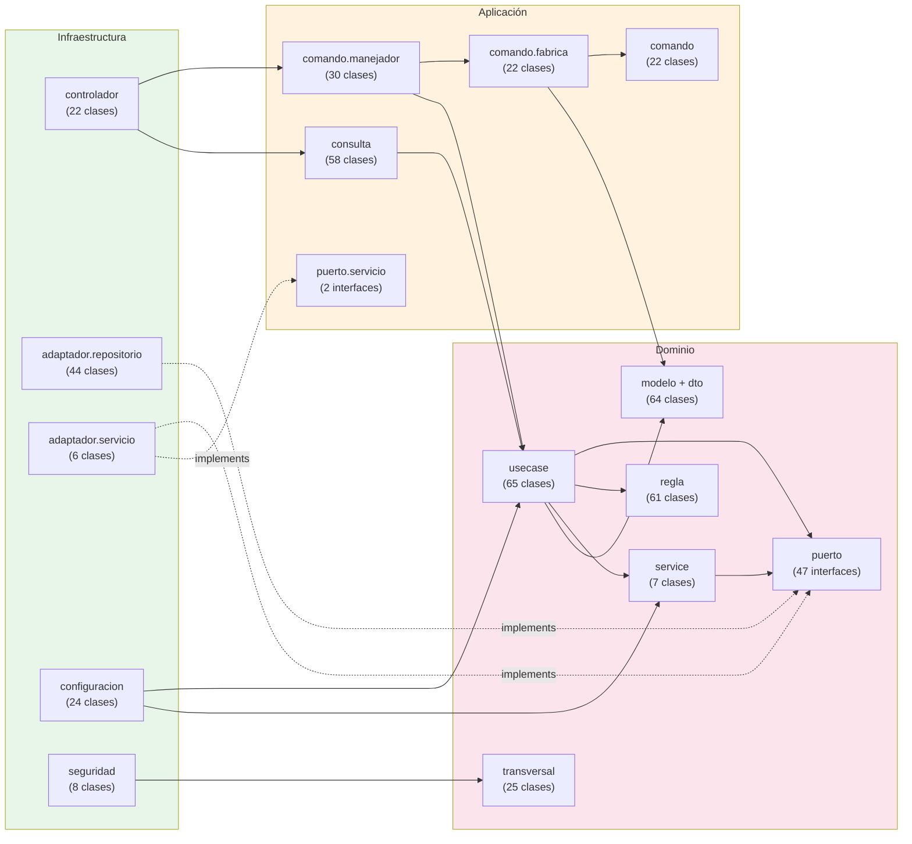

### 7.2 Regla de Dependencia (Dependency Rule)

La dependencia fluye **siempre hacia adentro**, siguiendo la Regla de Dependencia de Clean Architecture:

```
Infraestructura → Aplicación → Dominio
      ↓                            ↑
      └────── implementa ──────────┘
              (puertos)
```

| Relación                               | Tipo                    | Mecanismo               |
|----------------------------------------|-------------------------|-------------------------|
| Controlador → Manejador                | Dependencia directa     | `@Autowired`            |
| Manejador → UseCase                    | Dependencia directa     | Constructor injection   |
| UseCase → Puerto                       | Dependencia de interfaz | Inversión de dependencia|
| Repositorio Impl → Puerto              | Implementación          | `implements`            |
| Repositorio Impl → DAO                 | Dependencia directa     | `@Autowired`            |
| Config Bean → UseCase / Service        | Wiring                  | `@Bean` factory         |

---

## 8. Backend — Paquetes de Test

### 8.1 Diagrama de Correspondencia Producción ↔ Test

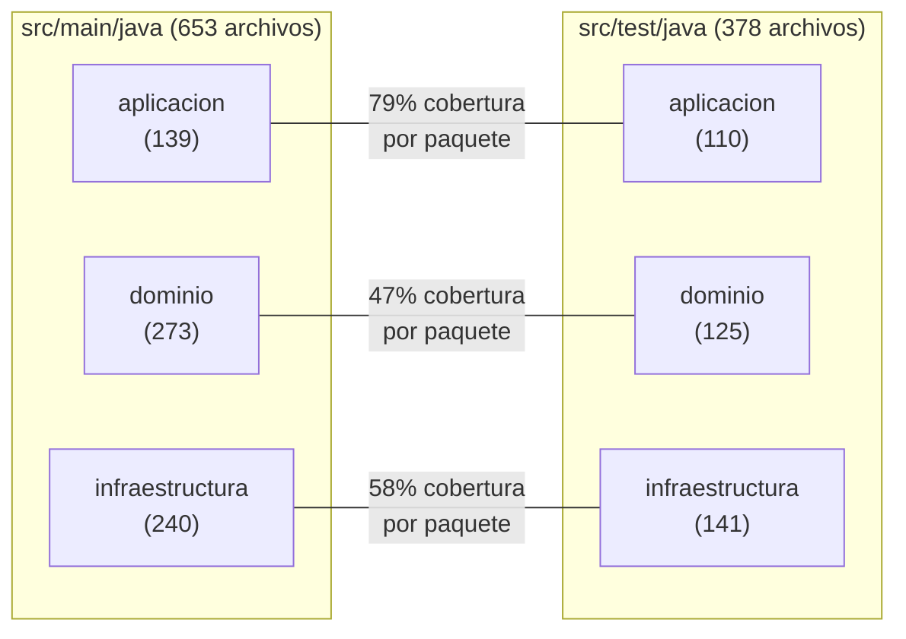

### 8.2 Inventario de Paquetes de Test

| Paquete Test                                              | Tests | Producción Correspondiente               |
|-----------------------------------------------------------|-------|------------------------------------------|
| `aplicacion.comando.fabrica`                              | 22    | 22 fábricas (100%)                       |
| `aplicacion.comando.manejador`                            | 30    | 30 manejadores (100%)                    |
| `aplicacion.consulta`                                     | 58    | 58 manejadores consulta (100%)           |
| `dominio.modelo`                                          | 10    | 32 modelos (31%)                         |
| `dominio.regla.implementacion`                            | 28    | 28 reglas (100%)                         |
| `dominio.service`                                         | 7     | 7 servicios (100%)                       |
| `dominio.testdatabuilder`                                 | 8     | *Builders de prueba*                     |
| `dominio.transversal.constante`                           | 2     | 12 constantes (17%)                      |
| `dominio.transversal.utilitarios`                         | 5     | 5 utilidades (100%)                      |
| `dominio.usecase.comando`                                 | 31    | 31 use cases (100%)                      |
| `dominio.usecase.consulta`                                | 34    | 34 use cases (100%)                      |
| `infraestructura.adaptador.entidad`                       | 1     | 44 entidades (2%)                        |
| `infraestructura.adaptador.mapeador`                      | 45    | 46 mapeadores (98%)                      |
| `infraestructura.adaptador.repositorio.comando`           | 19    | 20 repos (95%)                           |
| `infraestructura.adaptador.repositorio.consulta`          | 24    | 24 repos (100%)                          |
| `infraestructura.adaptador.repositorio.util`              | 1     | *Utilidad de paginación*                 |
| `infraestructura.adaptador.servicio`                      | 6     | 6 servicios (100%)                       |
| `infraestructura.configuracion.bean`                      | 3     | 3 beans (100%)                           |
| `infraestructura.configuracion.dataloader`                | 10    | 11 dataloaders (91%)                     |
| `infraestructura.configuracion.dataloader.fabrica`        | 1     | 10 fábricas (10%)                        |
| `infraestructura.controlador`                             | 1     | 1 login (100%)                           |
| `infraestructura.controlador.comando`                     | 6     | 6 controladores (100%)                   |
| `infraestructura.controlador.consulta`                    | 15    | 15 controladores (100%)                  |
| `infraestructura.error`                                   | 1     | 2 clases (50%)                           |
| `infraestructura.seguridad.configuration`                 | 2     | 2 clases (100%)                          |
| `infraestructura.seguridad.filter`                        | 6     | 6 filtros (100%)                         |
| **Total**                                                 |**378**| **Cobertura: 58% general**               |

---

## 9. Frontend — Paquete Raíz y Módulos Principales

### 9.1 Diagrama General de Módulos

```mermaid
graph TB
    subgraph root["📦 app/ (4 archivos)"]
        AppModule["AppModule<br/><i>app.module.ts</i>"]
        AppRouting["AppRoutingModule<br/><i>app-routing.module.ts [R]</i>"]
        AppComp["AppComponent<br/><i>app.component.ts</i>"]
    end

    subgraph core["📦 core/ (21 archivos)"]
        CoreModule["CoreModule"]
        coreComp["📦 components/<br/><i>header, footer</i>"]
        coreGuard["📦 guard/<br/><i>security, public-route</i>"]
        coreInt["📦 interceptor/<br/><i>auth, token, error</i>"]
        coreModel["📦 model/<br/><i>MenuItem, Options, Usuario</i>"]
        coreSvc["📦 service/<br/><i>CoreService, HttpService</i>"]
    end

    subgraph shared["📦 shared/ (64 archivos)"]
        SharedModule["SharedModule"]
        sharedComp["📦 components/<br/><i>18 componentes reutilizables</i>"]
        sharedModel["📦 model/<br/><i>21 interfaces/modelos</i>"]
        sharedSvc["📦 service/<br/><i>11 servicios HTTP</i>"]
    end

    subgraph feature["📦 feature/ (~302 archivos)"]
        login["📦 login/ [R]"]
        pwdRec["📦 password-recovery/ [R]"]
        home["📦 home/ [R]"]
        mgmtDept["📦 manage-department/ [R]"]
        mgmtUsers["📦 manage-users/ [R]"]
        mgmtInd["📦 manage-indicators/ [R]"]
    end

    AppModule --> CoreModule
    AppModule -->|"imports"| SharedModule
    AppRouting -->|"lazy load"| feature

    login --> SharedModule
    pwdRec --> SharedModule
    home --> SharedModule
    mgmtDept --> SharedModule
    mgmtUsers --> SharedModule
    mgmtInd --> SharedModule

    feature --> core

    style root fill:#1a73e8,color:#fff
    style core fill:#fbbc04,color:#000
    style shared fill:#ea4335,color:#fff
    style feature fill:#34a853,color:#fff
```

---

## 10. Frontend — Core Module (`core/`)

### 10.1 Diagrama de Paquetes del Core

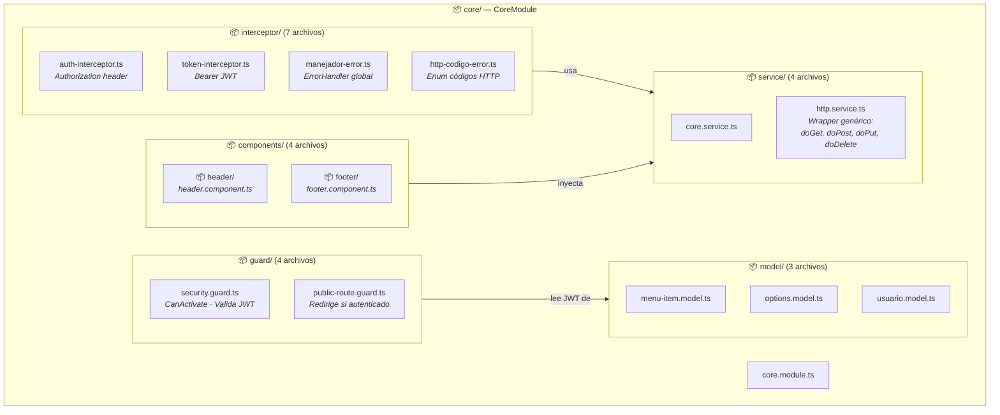

### 10.2 Contenido por Directorio

| Directorio        | TS Prod | TS Spec | Archivos Clave                                             |
|-------------------|---------|---------|------------------------------------------------------------|
| `components/`     | 2       | 2       | `HeaderComponent`, `FooterComponent`                       |
| `guard/`          | 2       | 2       | `SecurityGuard`, `PublicRouteGuard`                        |
| `interceptor/`    | 3       | 2+      | `AuthInterceptor`, `TokenInterceptor`, `ManejadorError`, `HttpCodigoError` |
| `model/`          | 3       | 0       | `MenuItem`, `Options`, `Usuario`                           |
| `service/`        | 2       | 2       | `CoreService`, `HttpService`                               |

---

## 11. Frontend — Shared Module (`shared/`)

### 11.1 Diagrama de Paquetes del Shared

```mermaid
graph TB
    subgraph shared["📦 shared/ — SharedModule"]
        sharedModule["shared.module.ts"]

        subgraph components["📦 components/ (38 archivos)"]
            actTable["📦 activities-table/"]
            actInfo["📦 activity-info/"]
            areaBtn["📦 area-buttons/"]
            areaImg["📦 area-top-image/"]
            attRec["📦 attendance-record/"]
            chgPwd["📦 change-password/"]
            dateSel["📦 date-selector/"]
            editAct["📦 edit-activity/"]
            extPart["📦 external-participant/"]
            filter["📦 filter-list/"]
            goToArea["📦 go-to-area-button/"]
            primBtn["📦 primary-button/"]
            regAct["📦 register-new-activity/"]
            separator["📦 separator/"]
            upload["📦 upload-database/"]

            subgraph dataViz["📦 data-visualization/"]
                compAct["📦 completed-activities/"]
                totalP["📦 total-participants/"]
                totalPM["📦 total-participants-months/"]
            end
        end

        subgraph model["📦 model/ (21 archivos)"]
            models["activity · activity-execution<br/>activity-state · area · subarea<br/>department · user · user-type<br/>participant · employee · student<br/>university-member · identification<br/>identification-type · cost-center<br/>employment-relationship · filters<br/>fecha-programada · password<br/>response · state (enum)"]
        end

        subgraph service["📦 service/ (22 archivos)"]
            actSvc["activity.service"]
            areaSvc["area.service"]
            deptSvc["department.service"]
            subSvc["subarea.service"]
            userSvc["user.service"]
            userTypeSvc["user-type.service"]
            idTypeSvc["identification-type.service"]
            memberSvc["university-member.service"]
            uploadSvc["upload-database.service"]
            excelSvc["excel-report.service"]
            stateSvc["state.service"]
        end
    end

    components -->|"inyecta"| service
    components -->|"importa"| model
    service -->|"usa"| model

    style components fill:#ffcdd2
    style model fill:#e1bee7
    style service fill:#b3e5fc
```

### 11.2 Inventario de Componentes Compartidos

| Directorio              | Archivos TS | Propósito                                           |
|-------------------------|-------------|-----------------------------------------------------|
| `activities-table/`     | 2           | Tabla paginada de actividades                       |
| `activity-info/`        | 2           | Modal de detalle de actividad                       |
| `area-buttons/`         | 2           | Toolbar con exportación Excel                       |
| `area-top-image/`       | 2           | Banner de área                                      |
| `attendance-record/`    | 2           | Registro de asistencia RFID                         |
| `change-password/`      | 2           | Modal de cambio de clave                            |
| `date-selector/`        | 2           | Selector de rango de fechas                         |
| `edit-activity/`        | 2           | Edición de actividad y ejecuciones                  |
| `external-participant/` | 2           | Registro de participante externo                    |
| `filter-list/`          | 2           | Filtros analíticos dinámicos                        |
| `go-to-area-button/`    | 2           | Botón de navegación a área                          |
| `primary-button/`       | 2           | Botón estilizado reutilizable                       |
| `register-new-activity/`| 2           | Formulario de nueva actividad                       |
| `separator/`            | 2           | Separador visual                                    |
| `upload-database/`      | 2           | Modal de carga masiva Excel                         |
| `data-visualization/`   | 6           | 3 sub-componentes Chart.js                          |

---

## 12. Frontend — Feature Modules (`feature/`)

### 12.1 Diagrama de Paquetes de Features

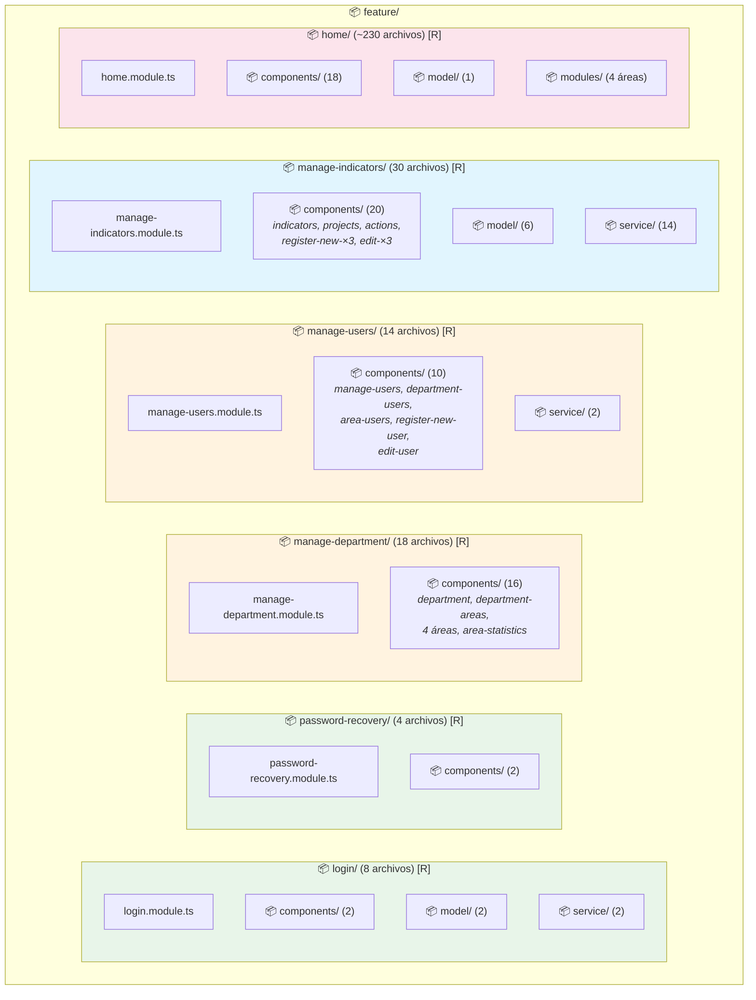

### 12.2 Estructura Interna por Feature Module

| Feature Module       | TS Archivos | Sub-Paquetes                                   | Routing |
|----------------------|-------------|-------------------------------------------------|---------|
| `login/`             | 8           | `components/`, `model/`, `service/`             | Si      |
| `password-recovery/` | 4           | `components/`                                   | Si      |
| `manage-department/` | 18          | `components/` (8 sub-dirs)                      | Si      |
| `manage-users/`      | 14          | `components/` (5 sub-dirs), `service/`          | Si      |
| `manage-indicators/` | 30          | `components/` (10 sub-dirs), `model/`, `service/`| Si     |
| `home/`              | ~230        | `components/`, `model/`, `modules/` (4+8 submódulos)| Si |

---

## 13. Frontend — Home Module y Sub-Módulos de Área

### 13.1 Diagrama de Paquetes del Home

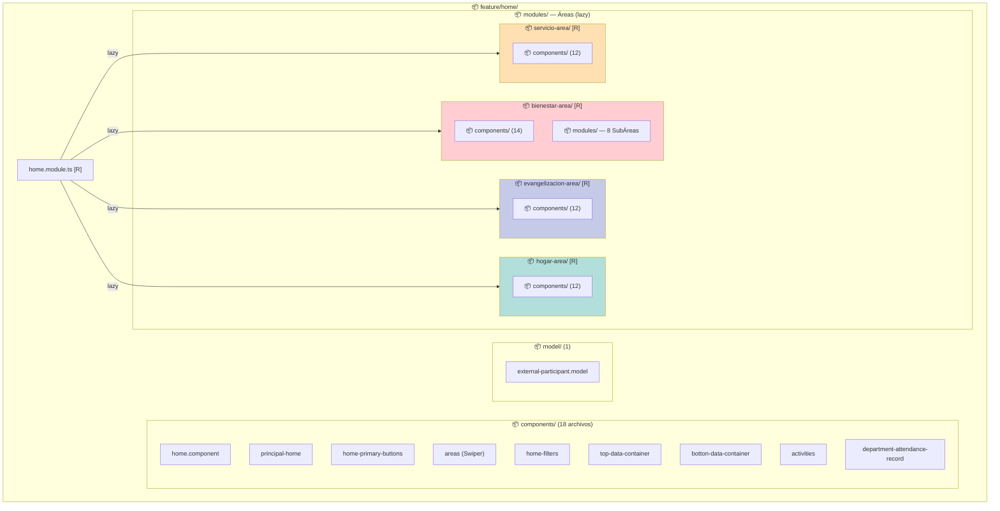

### 13.2 Sub-Módulos de SubÁrea (Bienestar)

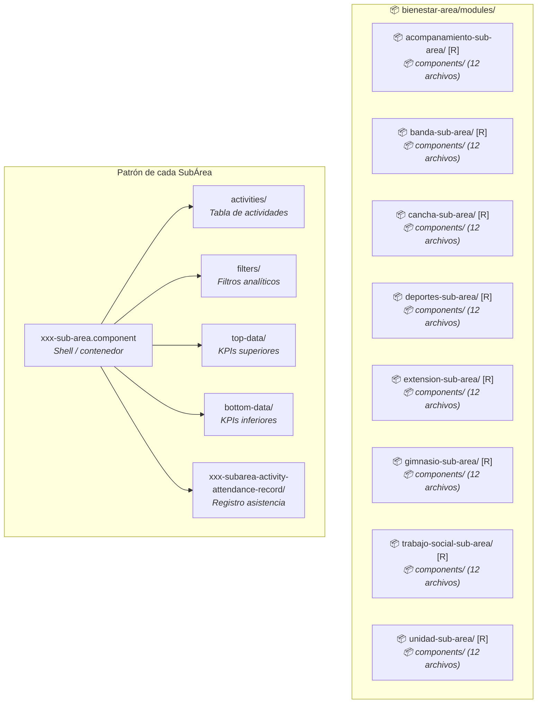

### 13.3 Inventario de Componentes por SubÁrea

Cada una de las 8 sub-áreas sigue un patrón idéntico con 6 componentes:

| Componente                                | Propósito                                 |
|-------------------------------------------|-------------------------------------------|
| `xxx-sub-area.component`                  | Shell contenedor de la vista de subárea   |
| `activities.component`                    | Tabla de actividades filtrada por subárea |
| `filters.component`                       | Filtros de año, semestre, mes             |
| `top-data.component`                      | KPIs: actividades completadas, participantes|
| `bottom-data.component`                   | KPIs: estadísticas por mes                |
| `xxx-subarea-activity-attendance-record`   | Registro de asistencia de actividad       |

**Sub-áreas**: Acompañamiento Psicosocial, Banda Sinfónica, Cancha Sintética, Deportes, Extensión Cultural, Gimnasio, Trabajo Social, Unidad de Salud.

---

## 14. Frontend — Dependencias entre Módulos

### 14.1 Diagrama de Dependencias

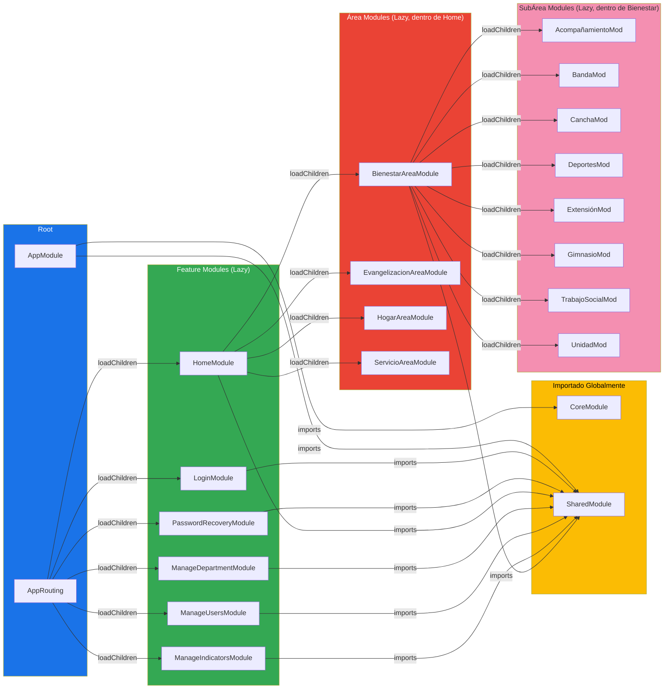

### 14.2 Tabla de Dependencias entre Módulos

| Módulo Consumidor        | Depende de (imports)                 | Carga Lazy (loadChildren)                    |
|--------------------------|--------------------------------------|----------------------------------------------|
| `AppModule`              | `CoreModule`, `SharedModule`         | `LoginModule`, `PasswordRecoveryModule`, `HomeModule`, `ManageDepartmentModule`, `ManageUsersModule`, `ManageIndicatorsModule` |
| `HomeModule`             | `SharedModule`                       | `BienestarAreaModule`, `EvangelizacionAreaModule`, `HogarAreaModule`, `ServicioAreaModule` |
| `BienestarAreaModule`    | `SharedModule`                       | 8 SubÁrea Modules                            |
| Feature Modules (×6)     | `SharedModule`                       | —                                            |
| SubÁrea Modules (×8)     | `SharedModule`                       | —                                            |

---

## 15. Matriz de Dependencias Cruzadas Backend ↔ Frontend

### 15.1 Correspondencia de Paquetes

| Paquete Frontend (Angular)   | Servicio Angular             | Paquete Backend Consumido                        |
|------------------------------|------------------------------|--------------------------------------------------|
| `feature/login/`             | `LoginService`               | `controlador.LoginControlador`                   |
| `feature/password-recovery/` | `PasswordRecoveryService`    | `controlador.comando.UsuarioComandoControlador`  |
| `feature/home/`              | `ActivityService`            | `controlador.consulta.ActividadConsultaControlador` + `controlador.comando.ActividadComandoControlador` |
| `feature/manage-department/` | `DepartmentService`, `ActivityService`, `UploadDatabaseService` | `controlador.consulta.DireccionConsultaControlador` + `controlador.consulta.ActividadConsultaControlador` + `controlador.comando.CargaMasivaControlador` |
| `feature/manage-users/`      | `UserService`                | `controlador.comando.UsuarioComandoControlador` + `controlador.consulta.UsuarioConsultarControlador` |
| `feature/manage-indicators/` | `IndicatorService`, `ProjectService`, `ActionService` | `controlador.comando.IndicadorComandoControlador` + `controlador.comando.ProyectoComandoControlador` + `controlador.comando.AccionComandoControlador` + controladores consulta análogos |
| `shared/service/`            | `AreaService`, `SubAreaService` | `controlador.consulta.AreaConsultaControlador` + `controlador.consulta.SubareaConsultaControlador` |
| `shared/service/`            | `UserTypeService`, `IdentificationTypeService` | `controlador.consulta.TipoUsuarioConsultaControlador` + `controlador.consulta.TipoIdentificacionConsultaControlador` |
| `shared/service/`            | `UploadDatabaseService`      | `controlador.comando.CargaMasivaControlador`     |
| `shared/service/`            | `UniversityMemberService`    | `controlador.consulta.MiembroConsultaControlador` |
| `shared/service/`            | `ActivityService`            | `controlador.consulta.ActividadConsultaControlador` + `controlador.comando.ActividadComandoControlador` |

### 15.2 Flujo de Paquetes en un Request

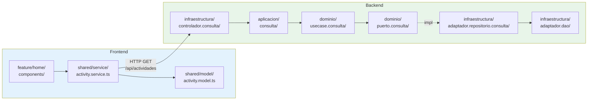

---

## 16. Inventario Cuantitativo de Paquetes

### 16.1 Backend — Resumen por Capa

| Capa              | Paquetes con Código | Paquetes Estructurales | Clases | % del Total |
|-------------------|---------------------|------------------------|--------|-------------|
| **Dominio**       | 17                  | 4                      | 273    | 42%         |
| **Aplicación**    | 6                   | 2                      | 139    | 21%         |
| **Infraestructura**| 15                 | 5                      | 240    | 37%         |
| **Raíz**          | 1                   | 0                      | 1      | <1%         |
| **Total**         | **40**              | **11**                 | **653**| **100%**    |

### 16.2 Backend — Distribución por Tipo de Artefacto

| Tipo de Artefacto              | Ubicación                              | Cantidad |
|--------------------------------|----------------------------------------|----------|
| Modelos de dominio             | `dominio.modelo`                       | 32       |
| DTOs de salida                 | `dominio.dto`                          | 32       |
| Comandos DTO de entrada        | `aplicacion.comando`                   | 22       |
| Fábricas de comando            | `aplicacion.comando.fabrica`           | 22       |
| Manejadores de comando         | `aplicacion.comando.manejador`         | 30       |
| Manejadores de consulta         | `aplicacion.consulta`                  | 58       |
| Use Cases (comando + consulta) | `dominio.usecase.*`                    | 65       |
| Motor de reglas completo        | `dominio.regla.*`                      | 59       |
| Servicios de dominio            | `dominio.service`                      | 7        |
| Puertos (todas las interfaces) | `dominio.puerto.*`                     | 47       |
| Entidades JPA                   | `infraestructura.adaptador.entidad`    | 44       |
| DAOs JPA                       | `infraestructura.adaptador.dao`        | 44       |
| Mapeadores                      | `infraestructura.adaptador.mapeador`   | 46       |
| Repositorios implementación     | `infraestructura.adaptador.repositorio`| 44       |
| Controladores REST              | `infraestructura.controlador.*`        | 22       |
| Seguridad                       | `infraestructura.seguridad.*`          | 8        |
| Configuración                   | `infraestructura.configuracion.*`      | 24       |
| Transversal                     | `dominio.transversal.*`                | 25       |
| **Total**                       |                                        | **653**  |

### 16.3 Frontend — Resumen por Tipo de Módulo

| Tipo de Módulo     | Cantidad | Archivos TS  | Routing |
|--------------------|----------|-------------- |---------|
| **AppModule**      | 1        | 4             | Si      |
| **CoreModule**     | 1        | 21            | No      |
| **SharedModule**   | 1        | 64            | No      |
| **Feature Modules**| 6        | ~76           | Si ×6   |
| **Área Modules**   | 4        | ~56           | Si ×4   |
| **SubÁrea Modules**| 8        | ~112          | Si ×8   |
| **Modelos**        | —        | ~30           | —       |
| **Servicios**      | —        | ~24           | —       |
| **Total**          | **21**   | **~387**      |         |

### 16.4 Frontend — Archivos por Directorio Principal

| Directorio                    | TS Archivos |
|-------------------------------|-------------|
| `app/` (raíz)                 | 4           |
| `app/core/`                   | 21          |
| `app/shared/`                 | 64          |
| `app/feature/login/`          | 8           |
| `app/feature/password-recovery/` | 4        |
| `app/feature/home/` (raíz)    | 21          |
| `app/feature/home/modules/bienestar-area/` | 16  |
| `app/feature/home/modules/bienestar-area/modules/` (8×14) | ~112 |
| `app/feature/home/modules/evangelizacion-area/` | 14 |
| `app/feature/home/modules/hogar-area/` | 14 |
| `app/feature/home/modules/servicio-area/` | 14 |
| `app/feature/manage-department/` | 18       |
| `app/feature/manage-users/`   | 14          |
| `app/feature/manage-indicators/` | 30       |
| **Total**                     | **~387**    |

---

## 17. Principios Arquitectónicos Evidenciados

### 17.1 Principios en el Backend

| Principio                       | Evidencia en Paquetes                                                     |
|---------------------------------|---------------------------------------------------------------------------|
| **Regla de Dependencia**        | `infraestructura` → `aplicacion` → `dominio` (nunca al revés)            |
| **Inversión de Dependencia**    | `dominio.puerto.*` son interfaces; `infraestructura.adaptador.*` las implementa |
| **Segregación Comando/Consulta**| `comando.*` y `consulta` son paquetes completamente separados en cada capa |
| **Encapsulamiento de Dominio**  | 273 clases en `dominio` sin dependencia de Spring ni JPA                  |
| **Single Responsibility**       | Un paquete por responsabilidad: `fabrica`, `manejador`, `regla`, `motor`  |
| **Motor de Reglas Extensible**  | `regla.fabrica.implementacion` permite agregar nuevas reglas por entidad  |
| **Datos Semilla Separados**     | `dataloader` + `dataloader.fabrica` aíslan datos iniciales de la lógica   |

### 17.2 Principios en el Frontend

| Principio                      | Evidencia en Paquetes                                                     |
|--------------------------------|---------------------------------------------------------------------------|
| **Core/Shared/Feature Pattern**| 3 módulos principales con responsabilidades claras                        |
| **Lazy Loading**               | Todos los feature modules se cargan bajo demanda (`loadChildren`)         |
| **Encapsulamiento de Features**| Cada feature tiene sus propios `components/`, `model/`, `service/`        |
| **Reutilización**              | `SharedModule` con 18 componentes y 11 servicios usados por todos        |
| **Separación de Concerns**     | Guards, interceptors, error handler aislados en `core/`                   |
| **Consistencia de Patrones**   | Las 8 sub-áreas replican exactamente el mismo patrón de 6 componentes    |
| **Modelo-Servicio Centralizado**| `shared/model/` + `shared/service/` evitan duplicación entre features    |

