# 27. Diagrama de Secuencia — SIBE

| Metadato              | Valor                                                                      |
|-----------------------|----------------------------------------------------------------------------|
| **Proyecto**          | SIBE — Sistema de Información de Bienestar y Evangelización                |
| **Backend**           | Java 17 · Spring Boot 3.5.0 · Arquitectura Hexagonal + CQRS               |
| **Frontend**          | Angular 16.2 · Interceptores HTTP · Guards de Ruta                         |
| **Seguridad**         | JWT Stateless · Basic Auth → Token · BCrypt                                |
| **Formato Diagramas** | Mermaid (`sequenceDiagram`)                                                |
| **Versión**           | 1.0                                                                        |

---

## Tabla de Contenido

- [27. Diagrama de Secuencia — SIBE](#27-diagrama-de-secuencia--sibe)
  - [Tabla de Contenido](#tabla-de-contenido)
  - [1. Visión General](#1-visión-general)
    - [Convenciones de Notación](#convenciones-de-notación)
    - [Flujos Documentados](#flujos-documentados)
  - [2. SD-01 — Autenticación (Login Completo)](#2-sd-01--autenticación-login-completo)
    - [2.1 Descripción](#21-descripción)
    - [2.2 Diagrama de Secuencia](#22-diagrama-de-secuencia)
    - [2.3 Almacenamiento de Tokens](#23-almacenamiento-de-tokens)
  - [3. SD-02 — Validación de Token JWT en Requests Autenticados](#3-sd-02--validación-de-token-jwt-en-requests-autenticados)
    - [3.1 Descripción](#31-descripción)
    - [3.2 Diagrama de Secuencia](#32-diagrama-de-secuencia)
  - [4. SD-03 — Crear Actividad (Flujo de Comando/Escritura)](#4-sd-03--crear-actividad-flujo-de-comandoescritura)
    - [4.1 Descripción](#41-descripción)
    - [4.2 Diagrama de Secuencia](#42-diagrama-de-secuencia)
  - [5. SD-04 — Consultar Actividades por Área (Flujo de Consulta/Lectura)](#5-sd-04--consultar-actividades-por-área-flujo-de-consultalectura)
    - [5.1 Descripción](#51-descripción)
    - [5.2 Diagrama de Secuencia](#52-diagrama-de-secuencia)
  - [6. SD-05 — Ciclo de Vida de Actividad (Iniciar → Finalizar/Cancelar)](#6-sd-05--ciclo-de-vida-de-actividad-iniciar--finalizarcancelar)
    - [6.1 Descripción](#61-descripción)
    - [6.2 Diagrama — Iniciar Actividad](#62-diagrama--iniciar-actividad)
    - [6.3 Diagrama — Finalizar Actividad con Participantes](#63-diagrama--finalizar-actividad-con-participantes)
  - [7. SD-06 — Recuperación de Contraseña (3 Pasos)](#7-sd-06--recuperación-de-contraseña-3-pasos)
    - [7.1 Descripción](#71-descripción)
    - [7.2 Diagrama de Secuencia](#72-diagrama-de-secuencia)
  - [8. SD-07 — Carga Masiva de Datos Excel](#8-sd-07--carga-masiva-de-datos-excel)
    - [8.1 Descripción](#81-descripción)
    - [8.2 Diagrama de Secuencia](#82-diagrama-de-secuencia)
  - [9. SD-08 — Autorización por Contexto Organizacional](#9-sd-08--autorización-por-contexto-organizacional)
    - [9.1 Descripción](#91-descripción)
    - [9.2 Diagrama de Secuencia](#92-diagrama-de-secuencia)
  - [10. SD-09 — Motor de Reglas de Validación](#10-sd-09--motor-de-reglas-de-validación)
    - [10.1 Descripción](#101-descripción)
    - [10.2 Diagrama de Secuencia](#102-diagrama-de-secuencia)
  - [11. SD-10 — Manejo de Errores (Flujo Completo)](#11-sd-10--manejo-de-errores-flujo-completo)
    - [11.1 Descripción](#111-descripción)
    - [11.2 Diagrama de Secuencia](#112-diagrama-de-secuencia)
    - [11.3 Mapeo de Excepciones a Códigos HTTP](#113-mapeo-de-excepciones-a-códigos-http)
  - [12. SD-11 — Navegación y Guards de Ruta (Frontend)](#12-sd-11--navegación-y-guards-de-ruta-frontend)
    - [12.1 Descripción](#121-descripción)
    - [12.2 Diagrama de Secuencia](#122-diagrama-de-secuencia)
  - [13. SD-12 — Consulta de Dashboard con KPIs y Filtros](#13-sd-12--consulta-de-dashboard-con-kpis-y-filtros)
    - [13.1 Descripción](#131-descripción)
    - [13.2 Diagrama de Secuencia](#132-diagrama-de-secuencia)
  - [14. SD-13 — CRUD de Usuarios](#14-sd-13--crud-de-usuarios)
    - [14.1 Diagrama — Crear Usuario](#141-diagrama--crear-usuario)
    - [14.2 Diagrama — Modificar y Eliminar Usuario](#142-diagrama--modificar-y-eliminar-usuario)
  - [15. Catálogo de Participantes por Diagrama](#15-catálogo-de-participantes-por-diagrama)
    - [15.1 Participantes Frontend](#151-participantes-frontend)
    - [15.2 Participantes Backend](#152-participantes-backend)
    - [15.3 Participantes Externos](#153-participantes-externos)

---

## 1. Visión General

Este artefacto documenta los **diagramas de secuencia** principales del sistema SIBE, trazando las interacciones exactas entre los participantes (actores, componentes frontend, capas backend y base de datos) para los flujos más representativos del sistema.

### Convenciones de Notación

| Elemento             | Significado                                                    |
|----------------------|----------------------------------------------------------------|
| Rectángulo sólido    | Participante activo (componente, clase, sistema externo)       |
| Línea continua →     | Mensaje síncrono (llamada directa)                             |
| Línea punteada -->>  | Respuesta / retorno                                            |
| Rectángulo sobre línea | Activación (período de procesamiento)                        |
| `alt` / `else`       | Flujo alternativo (condicional)                                |
| `loop`               | Iteración                                                      |
| `opt`                | Paso opcional                                                  |
| `Note`               | Anotación explicativa                                          |

### Flujos Documentados

| ID    | Nombre                                    | Tipo       | Capas Involucradas                |
|-------|-------------------------------------------|------------|-----------------------------------|
| SD-01 | Autenticación (Login)                     | Comando    | Frontend → Seguridad → API → DB  |
| SD-02 | Validación JWT                            | Seguridad  | Frontend → Filtros → Controller   |
| SD-03 | Crear Actividad                           | Comando    | Frontend → API → Dominio → DB    |
| SD-04 | Consultar Actividades por Área            | Consulta   | Frontend → API → Dominio → DB    |
| SD-05 | Ciclo de Vida de Actividad                | Comando    | Frontend → API → Dominio → DB    |
| SD-06 | Recuperación de Contraseña                | Comando    | Frontend → API → Dominio → SMTP  |
| SD-07 | Carga Masiva Excel                        | Comando    | Frontend → API → POI → DB        |
| SD-08 | Autorización Contexto Organizacional      | Dominio    | UseCase → Servicio → Puertos     |
| SD-09 | Motor de Reglas                           | Dominio    | UseCase → Motor → Reglas          |
| SD-10 | Manejo de Errores                         | Transversal| Filtro → Controller → Frontend    |
| SD-11 | Navegación y Guards                       | Frontend   | Router → Guard → Storage          |
| SD-12 | Dashboard KPIs                            | Consulta   | Frontend → API múltiple → DB     |
| SD-13 | CRUD de Usuarios                          | Mixto      | Frontend → API → Dominio → DB    |

---

## 2. SD-01 — Autenticación (Login Completo)

### 2.1 Descripción

Flujo completo de autenticación desde que el usuario ingresa credenciales en el formulario de login hasta que obtiene un JWT y es redirigido al dashboard. Involucra la cadena de filtros de Spring Security, el proveedor de autenticación, la generación del token JWT, y la persistencia del token en el frontend.

### 2.2 Diagrama de Secuencia

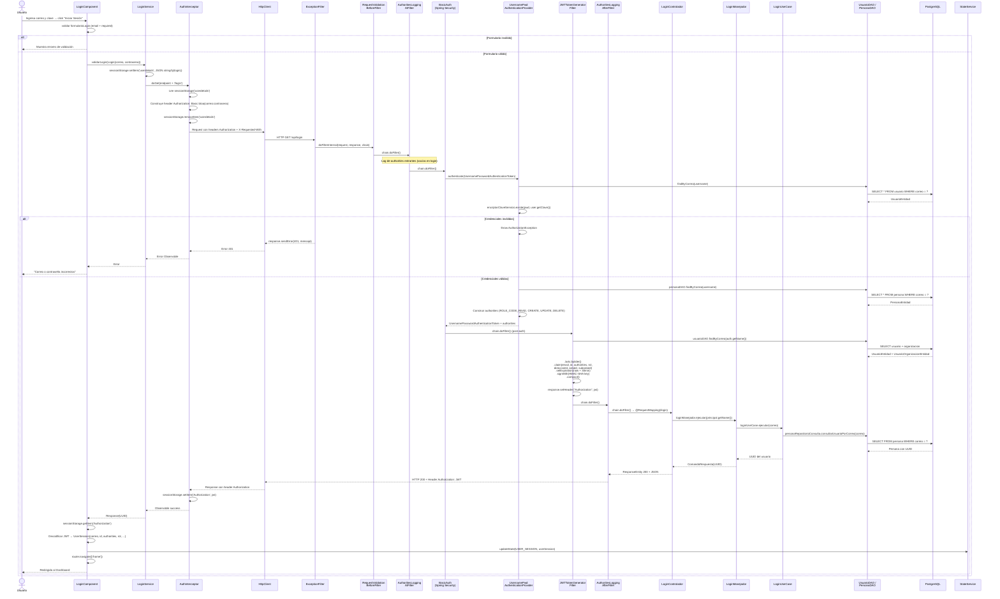

### 2.3 Almacenamiento de Tokens

| Paso | Operación                                    | Storage         |
|------|----------------------------------------------|-----------------|
| 1    | `LoginService` guarda credenciales           | sessionStorage(`userdetails`) |
| 2    | `AuthInterceptor` lee y elimina credenciales | sessionStorage(`userdetails`) → `removeItem` |
| 3    | `AuthInterceptor` captura JWT de respuesta   | sessionStorage(`Authorization`) |
| 4    | `LoginComponent` lee JWT para decodificar    | sessionStorage(`Authorization`) |
| 5    | `StateService` rehidrata sesión desde JWT    | sessionStorage(`Authorization`) |

---

## 3. SD-02 — Validación de Token JWT en Requests Autenticados

### 3.1 Descripción

Flujo de un request HTTP autenticado desde el frontend, mostrando cómo los interceptores agregan el token y cómo la cadena de filtros del backend lo valida antes de llegar al controlador.

### 3.2 Diagrama de Secuencia

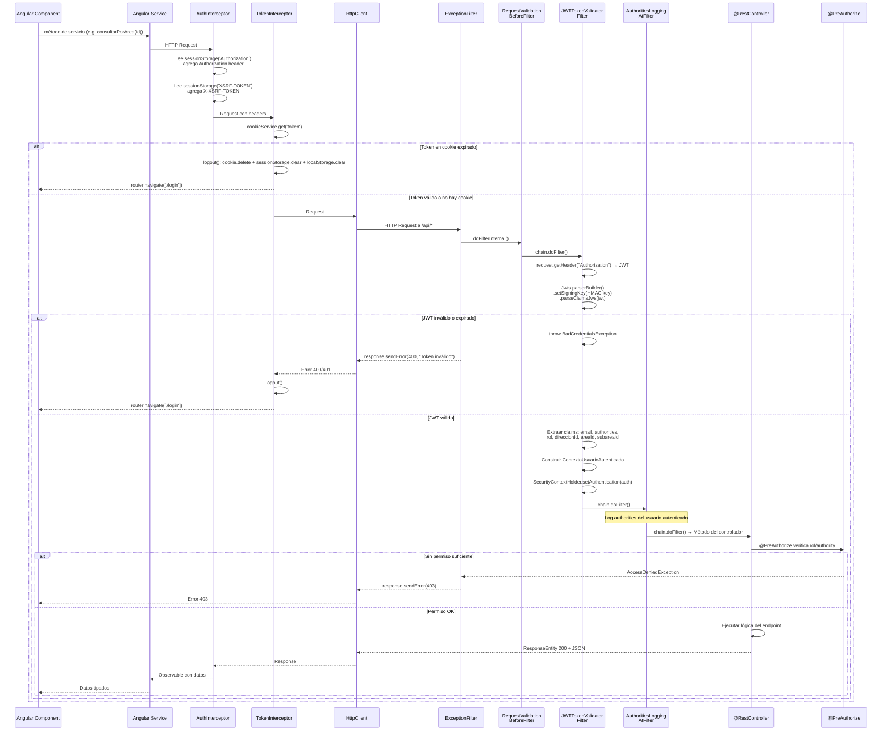

---

## 4. SD-03 — Crear Actividad (Flujo de Comando/Escritura)

### 4.1 Descripción

Flujo CQRS de escritura completo: desde la UI del frontend hasta la persistencia en base de datos, pasando por la fábrica, el motor de reglas, la autorización organizacional y la vinculación de la actividad con el área correspondiente.

### 4.2 Diagrama de Secuencia

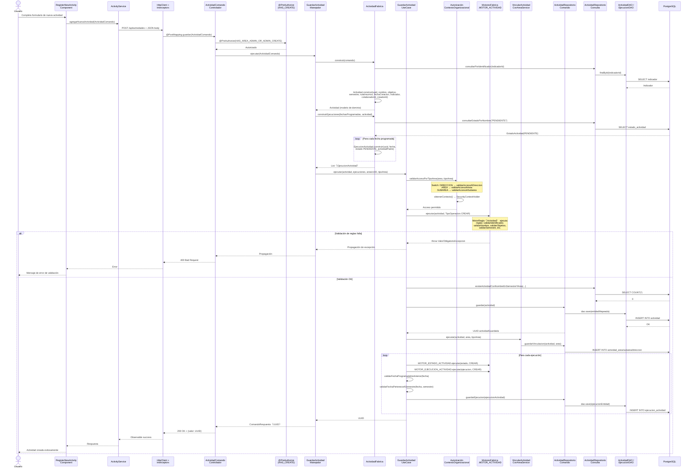

---

## 5. SD-04 — Consultar Actividades por Área (Flujo de Consulta/Lectura)

### 5.1 Descripción

Flujo CQRS de lectura: consulta de actividades filtradas por un área específica, con validación de autorización organizacional.

### 5.2 Diagrama de Secuencia

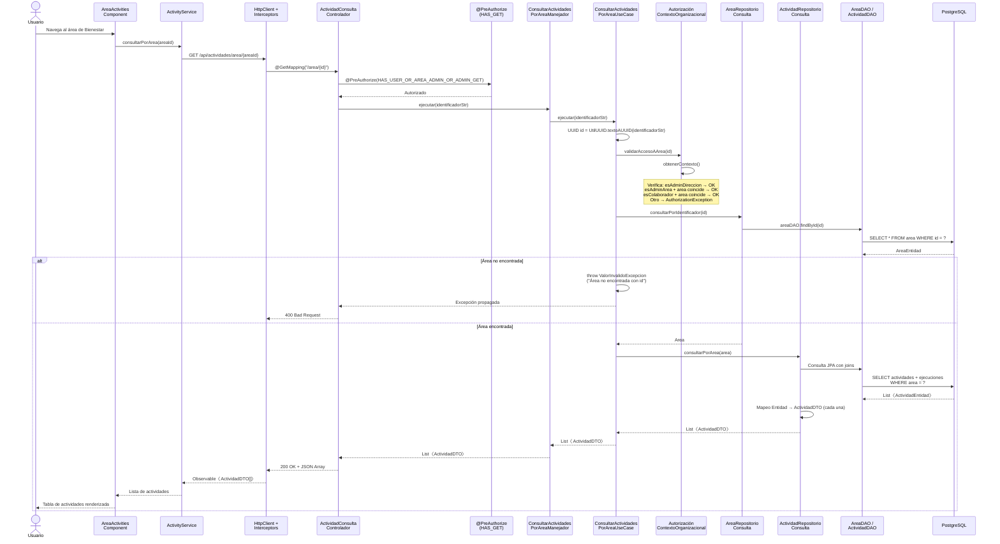

---

## 6. SD-05 — Ciclo de Vida de Actividad (Iniciar → Finalizar/Cancelar)

### 6.1 Descripción

Flujo que cubre los cambios de estado de una actividad: **Iniciar** (PENDIENTE → INICIADA), **Finalizar** (INICIADA → FINALIZADA con registro de participantes) y **Cancelar** (INICIADA → PENDIENTE). El estado **CANCELADA** no existe en el sistema.

### 6.2 Diagrama — Iniciar Actividad

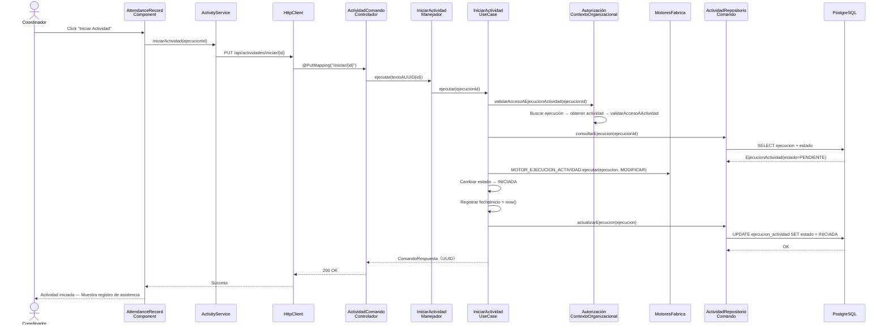

### 6.3 Diagrama — Finalizar Actividad con Participantes

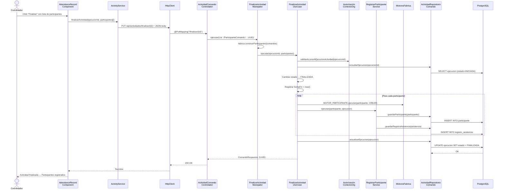

---

## 7. SD-06 — Recuperación de Contraseña (3 Pasos)

### 7.1 Descripción

Flujo de recuperación de contraseña en 3 pasos secuenciales: solicitar código por correo, validar código recibido, y cambiar la contraseña. Los 3 endpoints son públicos (`permitAll`).

### 7.2 Diagrama de Secuencia

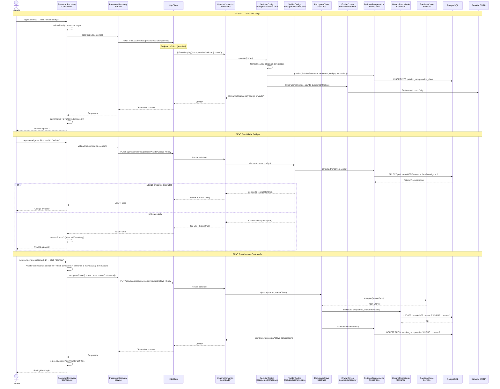

---

## 8. SD-07 — Carga Masiva de Datos Excel

### 8.1 Descripción

Flujo de carga masiva de empleados o estudiantes desde un archivo Excel (.xlsx), procesado con Apache POI en el backend.

### 8.2 Diagrama de Secuencia

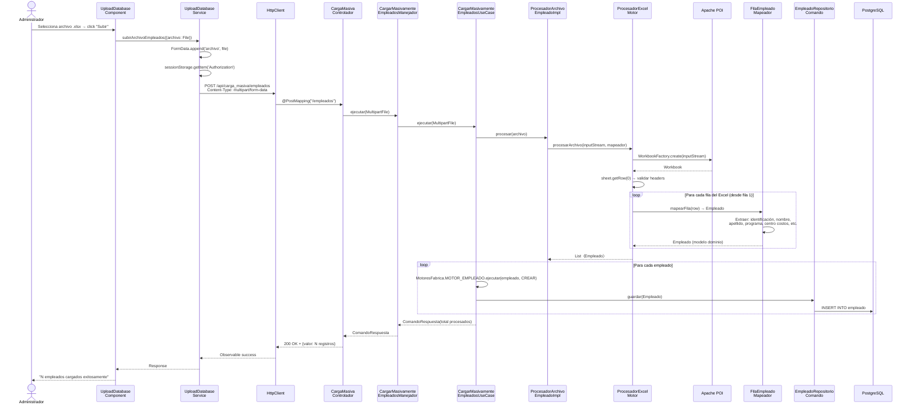

---

## 9. SD-08 — Autorización por Contexto Organizacional

### 9.1 Descripción

Flujo del servicio de dominio `AutorizacionContextoOrganizacionalServicio`, que determina si el usuario autenticado tiene acceso a un recurso según su rol y posición en la jerarquía organizacional.

### 9.2 Diagrama de Secuencia

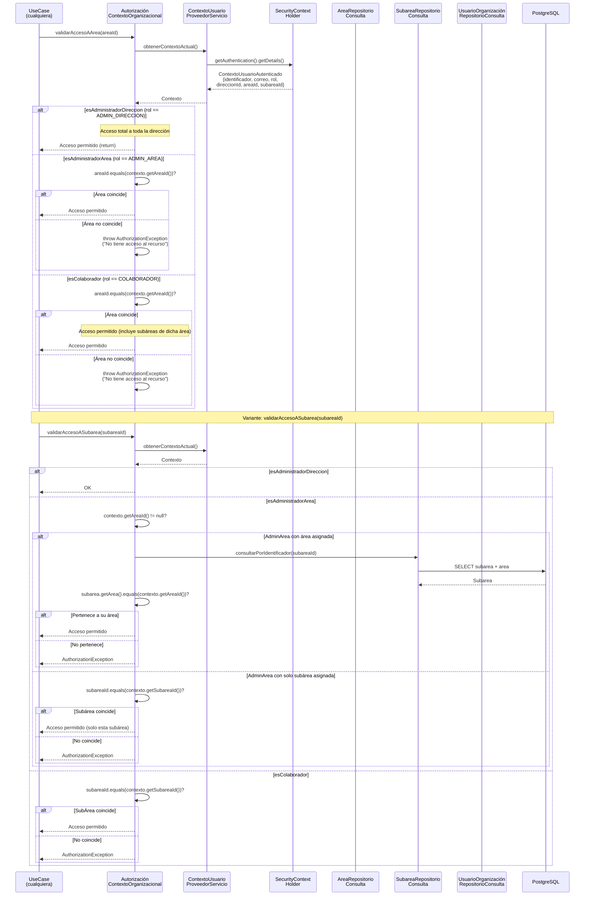

---

## 10. SD-09 — Motor de Reglas de Validación

### 10.1 Descripción

Flujo interno del motor de reglas que ejecuta validaciones de negocio sobre modelos de dominio usando el patrón Strategy con `Consumer<T>`.

### 10.2 Diagrama de Secuencia

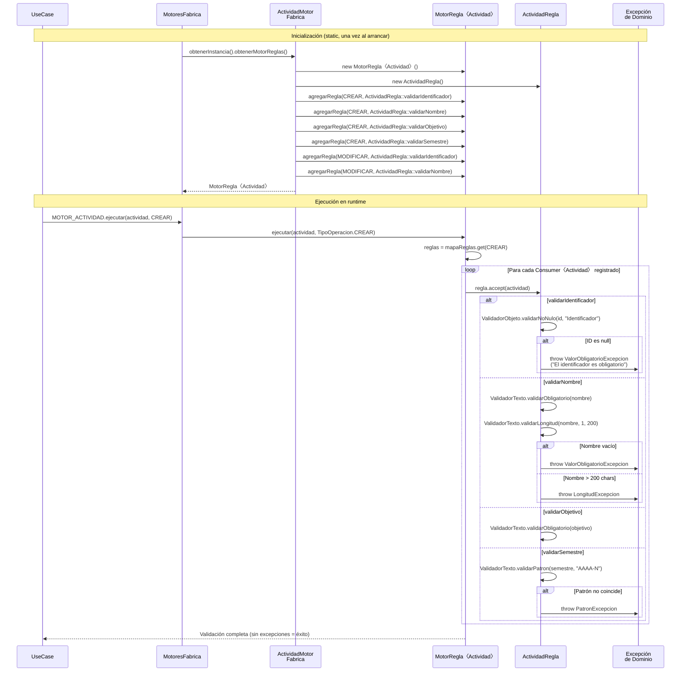

---

## 11. SD-10 — Manejo de Errores (Flujo Completo)

### 11.1 Descripción

Flujo de propagación y manejo de errores desde el dominio hasta el frontend, involucrando la cadena de filtros, el `@ControllerAdvice` y los interceptores Angular.

### 11.2 Diagrama de Secuencia

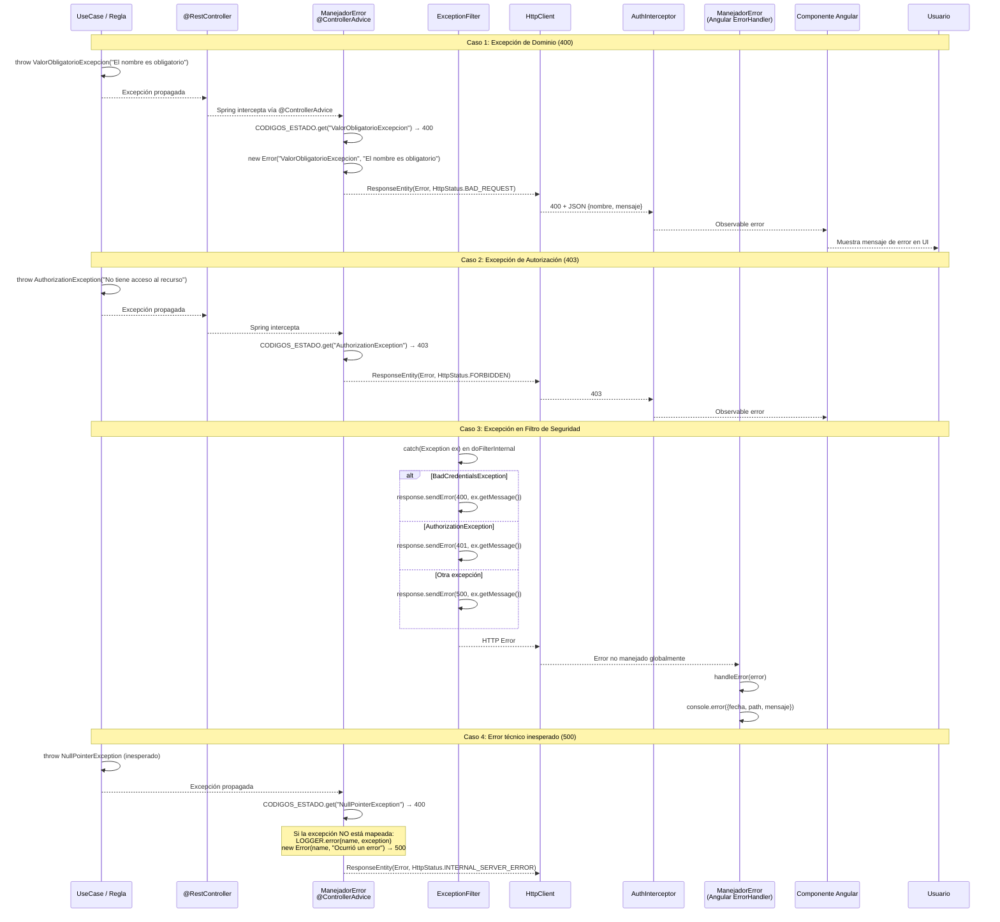

### 11.3 Mapeo de Excepciones a Códigos HTTP

| Excepción Backend                | Código HTTP | Significado                    |
|----------------------------------|-------------|--------------------------------|
| `ValorObligatorioExcepcion`      | 400         | Campo requerido faltante       |
| `LongitudExcepcion`             | 400         | Longitud fuera de rango        |
| `PatronExcepcion`               | 400         | Formato no coincide            |
| `ValorDuplicadoExcepcion`       | 400         | Recurso duplicado              |
| `ValorInvalidoExcepcion`        | 400         | Valor de negocio inválido      |
| `NullPointerException`          | 400         | Error de programación          |
| `AuthorizationException`        | 403         | Sin permisos                   |
| `TecnicoExcepcion`              | 500         | Error técnico interno          |
| `UnsupportedOperationException`  | 500         | Operación no soportada         |
| *Cualquier otra*                 | 500         | Error no mapeado               |

---

## 12. SD-11 — Navegación y Guards de Ruta (Frontend)

### 12.1 Descripción

Flujo de decisión cuando el usuario navega a una ruta, mostrando cómo el `securityGuard` valida el token JWT, la expiración y los roles antes de permitir el acceso.

### 12.2 Diagrama de Secuencia

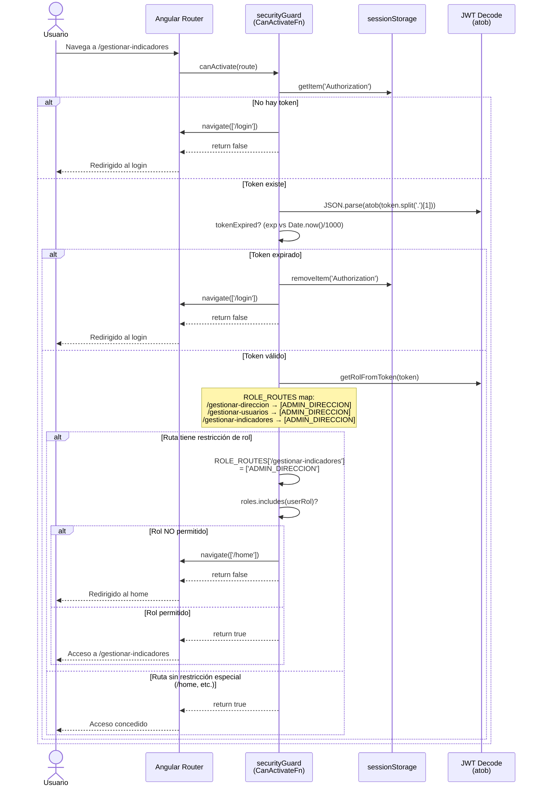

---

## 13. SD-12 — Consulta de Dashboard con KPIs y Filtros

### 13.1 Descripción

Flujo de carga del dashboard principal donde se realizan múltiples consultas paralelas para obtener KPIs, estadísticas y filtros dinámicos.

### 13.2 Diagrama de Secuencia

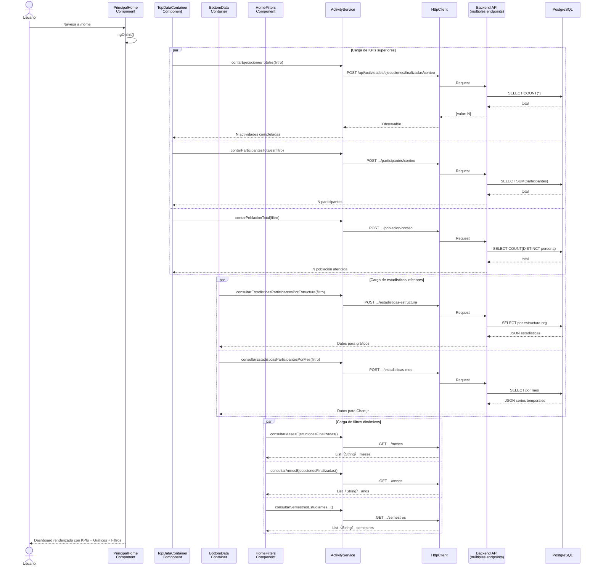

---

## 14. SD-13 — CRUD de Usuarios

### 14.1 Diagrama — Crear Usuario

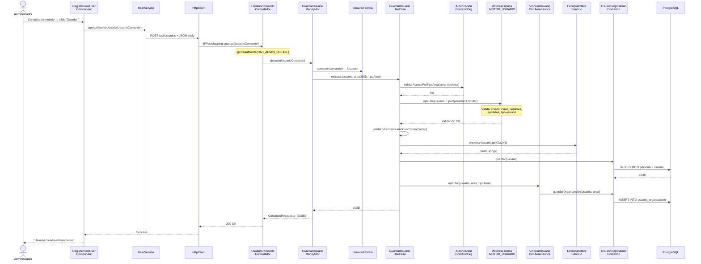

### 14.2 Diagrama — Modificar y Eliminar Usuario

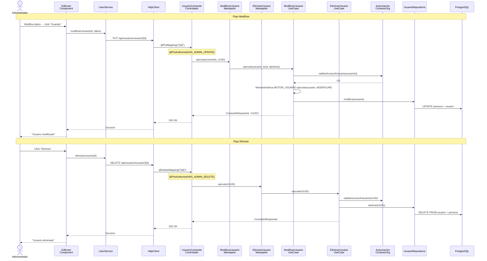

---

## 15. Catálogo de Participantes por Diagrama

### 15.1 Participantes Frontend

| Participante                 | Tipo          | Diagramas          | Descripción                                           |
|------------------------------|---------------|--------------------|-------------------------------------------------------|
| `LoginComponent`             | Component     | SD-01              | Formulario de autenticación con FormBuilder            |
| `LoginService`               | Service       | SD-01              | GET `/login` con Basic Auth via sessionStorage         |
| `AuthInterceptor`            | Interceptor   | SD-01, SD-02       | Agrega Authorization + captura JWT de respuesta        |
| `TokenInterceptor`           | Interceptor   | SD-02              | Lee cookie `token`, verifica expiración                |
| `ManejadorError` (FE)        | ErrorHandler  | SD-10              | Global handler: log + mapeo de códigos HTTP            |
| `securityGuard`              | Guard         | SD-11              | Valida JWT + rol + expiración para rutas protegidas    |
| `publicRouteGuard`           | Guard         | SD-11              | Redirige a `/home` si ya autenticado                   |
| `HttpService`                | Service       | SD-02, SD-03, SD-04| Wrapper genérico HTTP con `Content-Type: application/json` |
| `StateService`               | Service       | SD-01              | BehaviorSubject + rehidratación de sesión JWT          |
| `ActivityService`            | Service       | SD-03,04,05,12     | 25+ endpoints REST de actividades                      |
| `UserService`                | Service       | SD-13              | CRUD de usuarios via REST                              |
| `PasswordRecoveryService`    | Service       | SD-06              | 3 endpoints de recuperación de clave                   |
| `UploadDatabaseService`      | Service       | SD-07              | Upload multipart de archivos Excel                     |
| `RegisterNewActivityComp`    | Component     | SD-03              | Formulario de nueva actividad                          |
| `AttendanceRecordComp`       | Component     | SD-05              | Registro asistencia: iniciar/finalizar/cancelar        |
| `PasswordRecoveryComp`       | Component     | SD-06              | Wizard 3 pasos                                        |
| `UploadDatabaseComp`         | Component     | SD-07              | Modal de carga masiva                                  |
| `PrincipalHomeComp`          | Component     | SD-12              | Shell del dashboard con KPIs                           |

### 15.2 Participantes Backend

| Participante                        | Capa           | Diagramas               | Descripción                                    |
|-------------------------------------|----------------|-------------------------|------------------------------------------------|
| `LoginControlador`                  | Infraestructura| SD-01                   | `@RequestMapping(LOGIN_API)`                   |
| `ActividadComandoControlador`       | Infraestructura| SD-03, SD-05            | POST/PUT actividades                           |
| `ActividadConsultaControlador`      | Infraestructura| SD-04, SD-12            | GET actividades por estructura                 |
| `UsuarioComandoControlador`         | Infraestructura| SD-06, SD-13            | CRUD usuarios + recuperación clave             |
| `CargaMasivaControlador`           | Infraestructura| SD-07                   | Upload Excel multipart                         |
| `UsernamePwdAuthenticationProvider` | Seguridad      | SD-01                   | Valida credenciales BCrypt + builds authorities |
| `JWTTokenGeneratorFilter`           | Seguridad      | SD-01                   | Genera JWT HMAC-SHA post-login                 |
| `JWTTokenValidatorFilter`           | Seguridad      | SD-02                   | Parsea/valida JWT, puebla SecurityContext       |
| `ExceptionFilter`                   | Seguridad      | SD-01, SD-02, SD-10     | Captura excepciones en filtros → sendError     |
| `ManejadorError` (BE)               | Infraestructura| SD-10                   | `@ControllerAdvice` + mapa excepción → HTTP    |
| `GuardarActividadManejador`         | Aplicación     | SD-03                   | Orquesta fábrica + use case                    |
| `ActividadFabrica`                  | Aplicación     | SD-03                   | Construye Actividad + Ejecuciones              |
| `GuardarActividadUseCase`           | Dominio        | SD-03                   | Reglas + autorización + persistencia            |
| `ConsultarActividadesPorAreaUseCase`| Dominio        | SD-04                   | Autorización + consulta                        |
| `AutorizaciónContextoOrganizacional`| Dominio        | SD-03,04,05,08,13       | Valida acceso por rol + jerarquía              |
| `MotoresFabrica` / `MotorRegla`    | Dominio        | SD-03,05,07,09,13       | Registry estático de reglas por entidad        |
| `VincularActividadConAreaService`   | Dominio        | SD-03                   | Asocia actividad con estructura organizacional |
| `RegistrarParticipanteService`      | Dominio        | SD-05                   | Persiste participante + registro asistencia    |
| `ProcesadorExcelMotor`              | Infraestructura| SD-07                   | Apache POI para iterar filas Excel             |

### 15.3 Participantes Externos

| Participante   | Tipo      | Diagramas | Protocolo     |
|----------------|-----------|-----------|---------------|
| PostgreSQL     | Base Datos| Todos     | JDBC/JPA      |
| Servidor SMTP  | Servicio  | SD-06     | SMTP          |
| sessionStorage | Storage   | SD-01,02,11| Browser API  |
| Cookie         | Storage   | SD-02     | Browser API   |
