# 28. Diagrama de Despliegue — SIBE

| Metadato              | Valor                                                                              |
|-----------------------|------------------------------------------------------------------------------------|
| **Proyecto**          | SIBE — Sistema de Información de Bienestar y Evangelización                                   |
| **Backend**           | Java 17 · Spring Boot 3.5.0 · Gradle 8.13 · Tomcat Embebido                       |
| **Frontend**          | Angular 16.2 · Node.js · nginx (producción) · webpack-dev-server (desarrollo)      |
| **Base de Datos**     | PostgreSQL (producción) · H2 In-Memory (pruebas)                                   |
| **Servicios Externos**| Gmail SMTP (smtp.gmail.com:587)                                                    |
| **Formato Diagramas** | Mermaid (`C4Deployment`, `flowchart`, `block-beta`)                                |
| **Versión**           | 1.0                                                                                |

---

## Tabla de Contenido

1. [Visión General](#1-visión-general)
2. [Topología de Despliegue — Desarrollo Local](#2-topología-de-despliegue--desarrollo-local)
3. [Topología de Despliegue — Producción (Propuesta)](#3-topología-de-despliegue--producción-propuesta)
4. [Nodo: Cliente (Navegador Web)](#4-nodo-cliente-navegador-web)
5. [Nodo: Servidor Frontend](#5-nodo-servidor-frontend)
6. [Nodo: Servidor Backend (API)](#6-nodo-servidor-backend-api)
7. [Nodo: Servidor de Base de Datos](#7-nodo-servidor-de-base-de-datos)
8. [Nodo: Servidor SMTP (Correo Electrónico)](#8-nodo-servidor-smtp-correo-electrónico)
9. [Comunicación entre Nodos — Protocolos y Puertos](#9-comunicación-entre-nodos--protocolos-y-puertos)
10. [Configuración de Red y Seguridad](#10-configuración-de-red-y-seguridad)
11. [Artefactos de Despliegue](#11-artefactos-de-despliegue)
12. [Pipeline de Build y Artefactos Generados](#12-pipeline-de-build-y-artefactos-generados)
13. [Ambientes de Ejecución](#13-ambientes-de-ejecución)
14. [Diagrama de Despliegue Completo — Vista Integrada](#14-diagrama-de-despliegue-completo--vista-integrada)
15. [Matriz de Puertos y Endpoints](#15-matriz-de-puertos-y-endpoints)
16. [Requisitos de Infraestructura](#16-requisitos-de-infraestructura)

---

## 1. Visión General

El diagrama de despliegue describe la **distribución física y lógica** de los artefactos de software sobre los nodos de infraestructura, incluyendo los protocolos de comunicación, puertos, entornos de ejecución y dependencias de servicios externos.

### Arquitectura de Despliegue

SIBE sigue una arquitectura **cliente-servidor de 3 capas** con separación explícita entre presentación (SPA Angular), lógica de negocio (API REST Spring Boot) y persistencia (PostgreSQL).

| Capa          | Tecnología                      | Artefacto Desplegable            |
|---------------|--------------------------------|----------------------------------|
| Presentación  | Angular 16.2 SPA               | `dist/sibe-frontend/` (HTML/JS/CSS) |
| API / Negocio | Spring Boot 3.5.0 (Java 17)    | `sibe-0.0.1-SNAPSHOT.jar` (Fat JAR) |
| Persistencia  | PostgreSQL                      | Base de datos `sibe_db2`          |
| Correo        | Gmail SMTP                      | Servicio externo (smtp.gmail.com) |

### Convenciones del Diagrama

| Elemento                | Representación UML            | Descripción                              |
|-------------------------|-------------------------------|------------------------------------------|
| `<<device>>`            | Nodo físico o virtual         | Máquina, VM o contenedor                 |
| `<<executionEnvironment>>`| Entorno de ejecución        | JVM, Node.js, Motor del navegador        |
| `<<artifact>>`          | Artefacto desplegable         | JAR, HTML, SQL, archivo de configuración |
| `<<communicate>>`       | Asociación entre nodos        | Protocolo y puerto de comunicación       |

---

## 2. Topología de Despliegue — Desarrollo Local

### 2.1 Descripción

En el entorno de desarrollo local, todos los nodos ejecutan en la misma máquina del desarrollador. El frontend usa un servidor de desarrollo de Angular (`ng serve`) con proxy inverso hacia el backend, eliminando problemas de CORS en desarrollo.

### 2.2 Diagrama

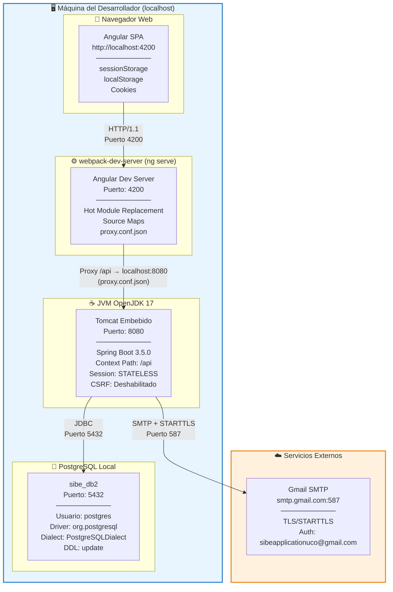

### 2.3 Configuración del Proxy de Desarrollo

Extraída de `SIBEFrontend/proxy.conf.json`:

```json
{
  "/api": {
    "target": "http://localhost:8080",
    "secure": false,
    "changeOrigin": true,
    "logLevel": "debug"
  }
}
```

**Efecto**: Todas las peticiones del frontend que coincidan con el prefijo `/api` son redirigidas al backend en `localhost:8080`, evitando la necesidad de CORS en desarrollo. En producción, esta redirección se manejaría vía nginx o un reverse proxy equivalente.

---

## 3. Topología de Despliegue — Producción (Docker Compose)

### 3.1 Descripción

Arquitectura de despliegue implementada con **Docker Compose**, compuesta por 3 contenedores orquestados en una red interna Docker. El frontend Nginx actúa como punto de entrada único, sirviendo la SPA Angular y haciendo proxy reverso hacia el backend Spring Boot. La configuración se parametriza mediante variables de entorno (archivo `.env`).

### 3.2 Diagrama

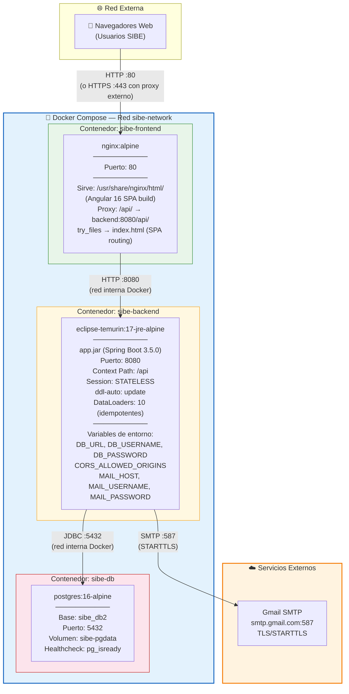

### 3.3 Archivos de Configuración Docker

| Archivo | Ubicación | Propósito |
|---------|-----------|-----------|
| `docker-compose.yml` | Raíz del proyecto (`SIBE/`) | Orquestación de los 3 servicios |
| `Dockerfile` (backend) | `SIBEBackend/Dockerfile` | Build multi-stage: `gradle:8-jdk17` → `eclipse-temurin:17-jre-alpine` |
| `Dockerfile` (frontend) | `SIBEFrontend/Dockerfile` | Build multi-stage: `node:18-alpine` → `nginx:alpine` |
| `nginx.conf` | `SIBEFrontend/nginx.conf` | Configuración de Nginx (SPA routing + proxy `/api`) |
| `.env.example` | Raíz del proyecto | Plantilla de variables de entorno |
| `.env` | Raíz del proyecto (NO versionado) | Variables de entorno reales (en `.gitignore`) |

### 3.4 Flujo de Despliegue con Docker Compose

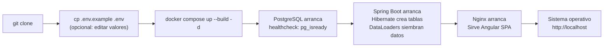

---

## 4. Nodo: Cliente (Navegador Web)

### 4.1 Especificación del Nodo

| Propiedad               | Valor                                                     |
|--------------------------|-----------------------------------------------------------|
| **Tipo**                 | `<<device>>` Dispositivo del usuario final                |
| **Plataforma**           | Navegador web moderno (Chrome, Firefox, Edge, Safari)     |
| **Requisito mínimo**     | ES2015+ (Angular 16 requirement), JavaScript habilitado   |
| **Entorno de ejecución** | Motor JavaScript del navegador (V8, SpiderMonkey, etc.)   |

### 4.2 Artefactos Residentes

| Artefacto                | Tipo         | Descripción                                       |
|--------------------------|--------------|---------------------------------------------------|
| `index.html`             | HTML         | Punto de entrada SPA                              |
| `main.*.js`              | JavaScript   | Bundle principal Angular (lazy loading)           |
| `polyfills.*.js`         | JavaScript   | Polyfills (zone.js)                               |
| `styles.*.css`           | CSS          | Estilos globales (Bootstrap + SCSS compilado)     |
| `runtime.*.js`           | JavaScript   | Runtime de webpack para lazy loading              |
| `*.chunk.js` (×N)        | JavaScript   | Feature modules lazy-loaded                       |

### 4.3 Almacenamiento en el Cliente

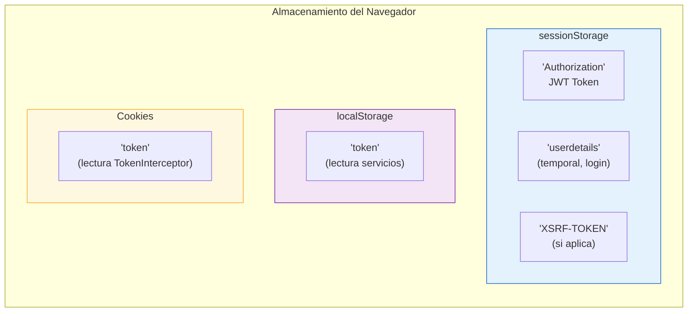

| Clave           | Storage          | Escritor                   | Lector(es)                                    | Ciclo de Vida           |
|-----------------|------------------|----------------------------|-----------------------------------------------|-------------------------|
| `Authorization` | sessionStorage   | `AuthInterceptor`          | `AuthInterceptor`, `securityGuard`, `StateService`, servicios | Por sesión (pestaña)   |
| `userdetails`   | sessionStorage   | `LoginService`             | `AuthInterceptor` (lee y elimina)             | Transitorio (1 request) |
| `token`         | Cookie           | Backend (Set-Cookie) / App | `TokenInterceptor`                             | Según expiración cookie |
| `token`         | localStorage     | App                        | `ActivityService`, `UserService`, `UploadDatabaseService` | Persistente             |

---

## 5. Nodo: Servidor Frontend

### 5.1 Ambiente de Desarrollo

| Propiedad               | Valor                                                     |
|--------------------------|-----------------------------------------------------------|
| **Tipo**                 | `<<executionEnvironment>>` webpack-dev-server              |
| **Comando de inicio**    | `ng serve --proxy-config proxy.conf.json -o`              |
| **Puerto**               | `4200`                                                     |
| **Funcionalidades**      | HMR, Source Maps, Live Reload, Proxy Inverso              |
| **Output Path**          | En memoria (no genera archivos en disco)                  |

### 5.2 Ambiente de Producción (Build)

| Propiedad               | Valor                                                     |
|--------------------------|-----------------------------------------------------------|
| **Comando de build**     | `ng build --configuration production`                     |
| **Output Path**          | `dist/sibe-frontend/`                                      |
| **Optimizaciones**       | Tree-shaking, AoT compilation, output hashing, minificación|
| **Budgets**              | Initial: warning 500KB / error 1MB · Component style: warning 2KB / error 4KB |
| **Servido por**          | nginx u otro servidor HTTP estático                       |

### 5.3 Diagrama — Artefactos del Build Frontend

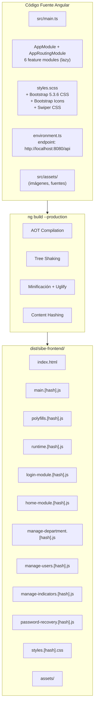

### 5.4 Feature Modules (Lazy-Loaded)

| Módulo                    | Ruta                   | Guard            | Chunk Generado                        |
|---------------------------|------------------------|------------------|---------------------------------------|
| `LoginModule`             | `/login`               | `publicRouteGuard`| `login-module.[hash].js`             |
| `HomeModule`              | `/home`                | `securityGuard`  | `home-module.[hash].js`               |
| `ManageDepartmentModule`  | `/gestionar-direccion` | `securityGuard`  | `manage-department-module.[hash].js`  |
| `ManageUsersModule`       | `/gestionar-usuarios`  | `securityGuard`  | `manage-users-module.[hash].js`       |
| `ManageIndicatorsModule`  | `/gestionar-indicadores`| `securityGuard` | `manage-indicators-module.[hash].js`  |
| `PasswordRecoveryModule`  | `/recuperar-contrasena`| `publicRouteGuard`| `password-recovery-module.[hash].js` |

---

## 6. Nodo: Servidor Backend (API)

### 6.1 Especificación del Nodo

| Propiedad               | Valor                                                          |
|--------------------------|----------------------------------------------------------------|
| **Tipo**                 | `<<executionEnvironment>>` JVM OpenJDK 17                      |
| **Servidor embebido**    | Apache Tomcat (incluido en Spring Boot 3.5.0)                  |
| **Puerto HTTP**          | `8080`                                                          |
| **Context Path**         | `/api`                                                          |
| **Política de sesión**   | `STATELESS` (sin sesión del lado servidor)                     |
| **Concurrencia**         | `@EnableAsync` habilitado para operaciones asíncronas          |
| **Artefacto**            | `sibe-0.0.1-SNAPSHOT.jar` (Spring Boot Fat JAR)               |
| **Build tool**           | Gradle 8.13                                                    |
| **Grupo Maven**          | `co.edu.uco`                                                   |
| **Nombre del Proyecto**  | `sibe`                                                         |

### 6.2 Diagrama — Composición Interna del Nodo Backend

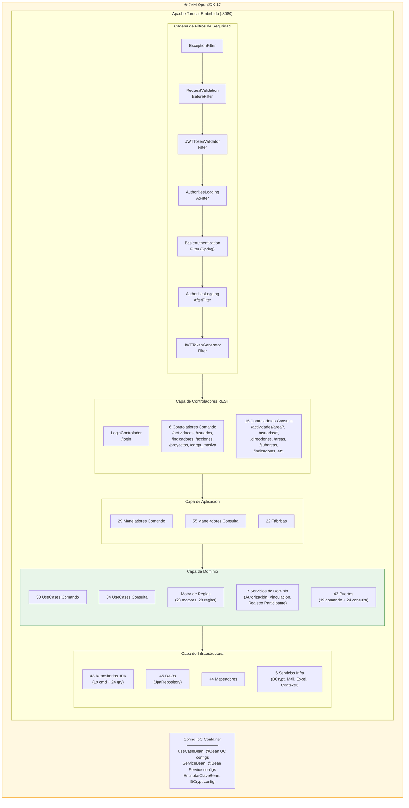

### 6.3 Dependencias del Runtime (build.gradle)

| Dependencia                                | Versión   | Propósito                              |
|--------------------------------------------|-----------|----------------------------------------|
| `spring-boot-starter-web`                  | 3.5.0     | Tomcat embebido, Spring MVC REST       |
| `spring-boot-starter-data-jpa`             | 3.5.0     | Hibernate ORM, JPA, connection pooling |
| `spring-boot-starter-security`             | 3.5.0     | Spring Security, filtros, @PreAuthorize|
| `spring-boot-starter-mail`                 | 3.5.0     | JavaMailSender para SMTP               |
| `io.jsonwebtoken:jjwt-api/impl/jackson`    | 0.11.2    | Generación y validación de JWT         |
| `org.postgresql:postgresql`                | (runtime) | Driver JDBC PostgreSQL                 |
| `com.h2database:h2`                        | (runtime) | BD embebida para pruebas               |
| `org.projectlombok:lombok`                 | (compile) | Generación de código (Getter, etc.)    |
| `org.apache.poi:poi-ooxml`                 | 5.4.0     | Lectura de archivos Excel (.xlsx)      |

### 6.4 Configuración del Servidor (`application.properties`)

```properties
# Servidor
spring.application.name = Login
server.port = 8080
server.servlet.context-path = /api

# Base de Datos
spring.datasource.url = jdbc:postgresql://localhost:5432/sibe_db2
spring.datasource.dbname = sibe_db2
spring.datasource.username = postgres
spring.datasource.driver-class-name = org.postgresql.Driver

# JPA / Hibernate
spring.jpa.properties.hibernate.dialect = org.hibernate.dialect.PostgreSQLDialect
spring.jpa.open-in-view = false
spring.jpa.hibernate.ddl-auto = update
spring.main.allow-bean-definition-overriding = true

# Correo Electrónico
spring.mail.host = smtp.gmail.com
spring.mail.port = 587
spring.mail.properties.mail.smtp.auth = true
spring.mail.properties.mail.smtp.starttls.enable = true
```

---

## 7. Nodo: Servidor de Base de Datos

### 7.1 Especificación del Nodo

| Propiedad               | Valor                                                     |
|--------------------------|-----------------------------------------------------------|
| **Tipo**                 | `<<device>>` Servidor de base de datos                    |
| **SGBD**                 | PostgreSQL (versión recomendada: 15+)                     |
| **Puerto**               | `5432`                                                     |
| **Base de datos**        | `sibe_db2`                                                 |
| **Driver JDBC**          | `org.postgresql.Driver`                                    |
| **Dialecto Hibernate**   | `org.hibernate.dialect.PostgreSQLDialect`                  |
| **DDL Auto**             | `update` (Hibernate genera/actualiza esquema automáticamente)|

### 7.2 Diagrama — Esquema de Entidades JPA (45 tablas)

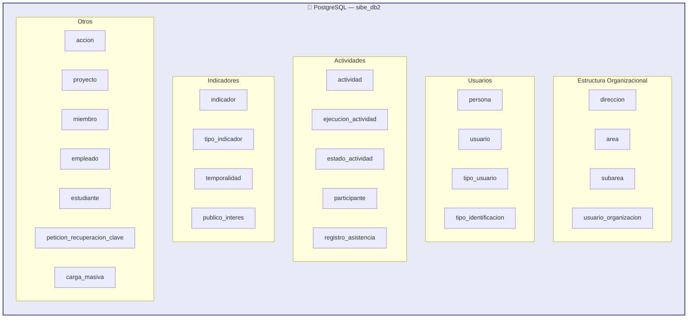

### 7.3 Configuración por Ambiente

| Ambiente      | URL JDBC                                             | Driver          | Dialecto        | DDL Auto       |
|---------------|------------------------------------------------------|-----------------|-----------------|----------------|
| **Desarrollo**| `jdbc:postgresql://localhost:5432/sibe_db2`          | `org.postgresql`| PostgreSQLDialect| `update`       |
| **Pruebas**   | `jdbc:h2:mem:testdb;DB_CLOSE_DELAY=-1`              | `org.h2.Driver` | H2Dialect       | `create-drop`  |
| **Producción**| `jdbc:postgresql://<host-prod>:5432/sibe_db2`        | `org.postgresql`| PostgreSQLDialect| `validate`*    |

> \* Para producción se recomienda `validate` o `none` con migraciones gestionadas externamente (ej: Flyway/Liquibase).

---

## 8. Nodo: Servidor SMTP (Correo Electrónico)

### 8.1 Especificación del Nodo

| Propiedad               | Valor                                                     |
|--------------------------|-----------------------------------------------------------|
| **Tipo**                 | `<<externalService>>` Servicio de correo externo          |
| **Servidor**             | `smtp.gmail.com`                                           |
| **Puerto**               | `587`                                                      |
| **Protocolo**            | SMTP con STARTTLS                                          |
| **Autenticación**        | `spring.mail.properties.mail.smtp.auth = true`             |
| **Cifrado**              | `spring.mail.properties.mail.smtp.starttls.enable = true`  |
| **Usuario**              | `sibeapplicationuco@gmail.com`                             |
| **Uso**                  | Envío de códigos de recuperación de contraseña             |

### 8.2 Flujo de Comunicación SMTP

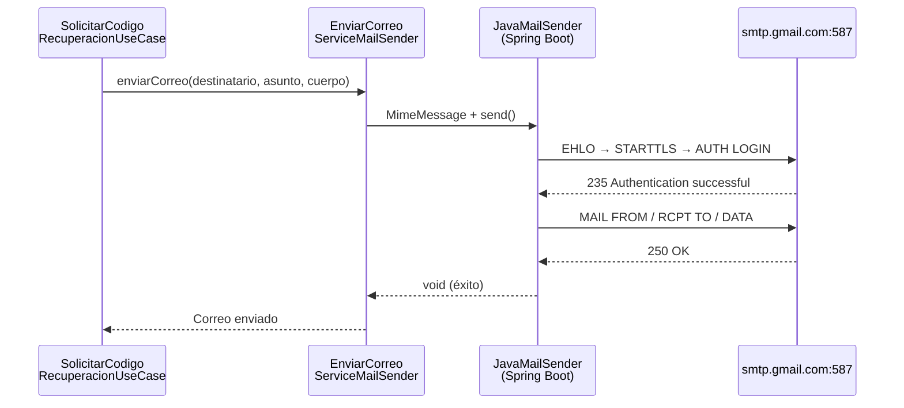

---

## 9. Comunicación entre Nodos — Protocolos y Puertos

### 9.1 Diagrama de Protocolos de Red

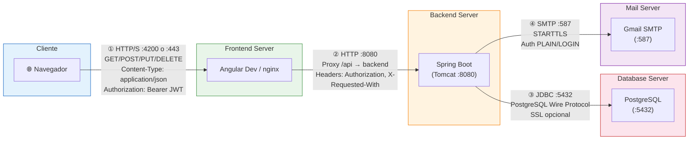

### 9.2 Tabla de Comunicación

| # | Origen              | Destino              | Protocolo          | Puerto | Dirección | Datos Transportados                            |
|---|---------------------|----------------------|--------------------|--------|-----------|------------------------------------------------|
| ① | Navegador           | Frontend Server      | HTTP/S             | 4200/443| →        | HTML, JS, CSS, API requests (JSON)             |
| ② | Frontend Server     | Backend API          | HTTP               | 8080   | →         | REST JSON, headers (Authorization, Content-Type)|
| ③ | Backend API         | PostgreSQL           | JDBC (TCP)         | 5432   | ↔         | SQL queries, result sets                        |
| ④ | Backend API         | Gmail SMTP           | SMTP + STARTTLS    | 587    | →         | Correos de recuperación de contraseña           |

### 9.3 Headers HTTP Relevantes

| Header              | Dirección  | Valor                                    | Descripción                            |
|---------------------|------------|------------------------------------------|----------------------------------------|
| `Authorization`     | Request →  | `Basic btoa(correo:clave)` (login)       | Autenticación inicial HTTP Basic       |
| `Authorization`     | Request →  | JWT token (post-login)                   | Token de sesión para requests autenticados|
| `Authorization`     | ← Response | JWT generado por `JWTTokenGeneratorFilter`| Token retornado tras login exitoso     |
| `Content-Type`      | Request →  | `application/json`                       | Cuerpo JSON en peticiones REST         |
| `Content-Type`      | Request →  | `multipart/form-data`                    | Carga masiva de archivos Excel         |
| `X-Requested-With`  | Request →  | `XMLHttpRequest`                         | Identificador de petición AJAX         |

---

## 10. Configuración de Red y Seguridad

### 10.1 CORS (Cross-Origin Resource Sharing)

Configurado en `ProjectSecurityConfig.java`:

| Parámetro            | Valor                          | Fuente                          |
|----------------------|--------------------------------|---------------------------------|
| **Allowed Origins**  | `http://localhost:4200`        | `SeguridadConstante.LOCAL_FRONT_URL`|
| **Allowed Methods**  | `*` (todos)                    | `Collections.singletonList("*")`|
| **Allowed Headers**  | `*` (todos)                    | `Collections.singletonList("*")`|
| **Allow Credentials**| `true`                         | `config.setAllowCredentials(true)`|
| **Exposed Headers**  | `Authorization`                | `SeguridadConstante.JWT_HEADER` |
| **Max Age**          | `3600` segundos                | `TRES_MIL_SEICIENTOS_LONG`      |

### 10.2 Seguridad de la Aplicación

| Aspecto                | Configuración                                                    |
|------------------------|------------------------------------------------------------------|
| **Gestión de Sesión**  | `SessionCreationPolicy.STATELESS` — Sin sesión del lado servidor |
| **CSRF**               | Deshabilitado (`AbstractHttpConfigurer::disable`) — API stateless|
| **Autenticación**      | HTTP Basic (solo login) → JWT (requests subsiguientes)           |
| **Autorización**       | `@PreAuthorize` con SpEL a nivel de controlador                  |
| **Cifrado de Claves**  | BCrypt via `PasswordEncoder` (Spring Security)                   |
| **Firma JWT**          | HMAC-SHA con clave simétrica de 256 bits                         |
| **Expiración JWT**     | 30 minutos                                                       |
| **Seguridad de método**| `@EnableMethodSecurity(securedEnabled=true, jsr250Enabled=true)` |

### 10.3 Cadena de Filtros de Seguridad

```mermaid
flowchart LR
    REQ["HTTP Request"] --> F1["① ExceptionFilter<br/>(BEFORE Basic)"]
    F1 --> F2["② RequestValidation<br/>BeforeFilter<br/>(BEFORE Basic)"]
    F2 --> F3["③ JWTTokenValidator<br/>Filter<br/>(BEFORE Basic)"]
    F3 --> F4["④ AuthoritiesLogging<br/>AtFilter<br/>(AT Basic)"]
    F4 --> F5["⑤ BasicAuthentication<br/>Filter<br/>(Spring Built-in)"]
    F5 --> F6["⑥ AuthoritiesLogging<br/>AfterFilter<br/>(AFTER Basic)"]
    F6 --> F7["⑦ JWTTokenGenerator<br/>Filter<br/>(AFTER Basic)"]
    F7 --> CTRL["@RestController"]

    style F1 fill:#ffcdd2,stroke:#c62828
    style F3 fill:#c8e6c9,stroke:#2e7d32
    style F5 fill:#bbdefb,stroke:#1565c0
    style F7 fill:#fff9c4,stroke:#f9a825
```

### 10.4 Endpoints Públicos vs. Protegidos

| Patrón de Endpoint                             | Método | Acceso        | Descripción                   |
|------------------------------------------------|--------|---------------|-------------------------------|
| `/api/usuarios/recuperacion/solicitar/{correo}` | POST   | `permitAll`   | Solicitar código de recuperación|
| `/api/usuarios/recuperacion/validarCodigo`      | POST   | `permitAll`   | Validar código ingresado       |
| `/api/usuarios/recuperacion/recuperarClave`     | PUT    | `permitAll`   | Cambiar contraseña             |
| `/api/login`                                    | GET    | `authenticated`| Login con HTTP Basic → JWT    |
| `/api/**` (todo lo demás)                       | *      | `authenticated`| Requiere JWT válido            |

---

## 11. Artefactos de Despliegue

### 11.1 Inventario de Artefactos

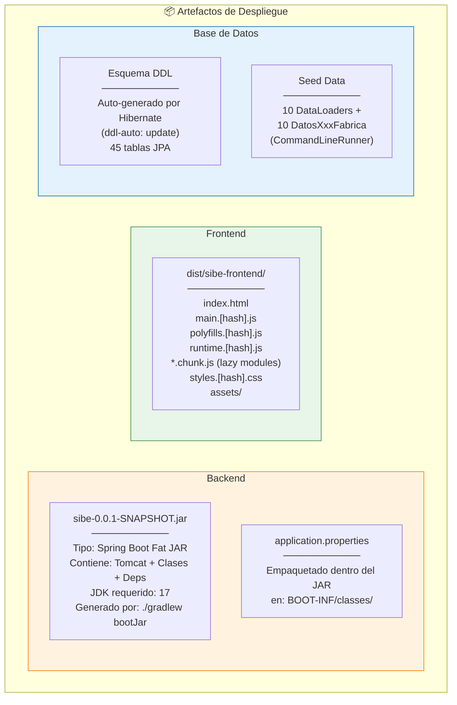

### 11.2 Tabla de Artefactos

| Artefacto                      | Tipo           | Generado por             | Destino de Despliegue      | Tamaño Estimado |
|--------------------------------|----------------|--------------------------|----------------------------|-----------------|
| `sibe-0.0.1-SNAPSHOT.jar`     | Fat JAR        | `./gradlew bootJar`     | Contenedor `sibe-backend`  | ~50-80 MB       |
| `dist/sibe-frontend/`         | Directorio     | `ng build --production` | Contenedor `sibe-frontend` (nginx) | ~2-5 MB |
| `application.properties`       | Config         | Manual / CI              | Dentro del JAR (con `${VAR:default}`) | ~1 KB |
| `environment.prod.ts`          | Config         | Manual                   | Compilado en `main.js` (endpoint `/api`) | ~100 B |
| `docker-compose.yml`           | Docker         | Manual                   | Raíz del proyecto          | ~2 KB           |
| `SIBEBackend/Dockerfile`       | Docker         | Manual                   | Build multi-stage backend  | ~500 B          |
| `SIBEFrontend/Dockerfile`      | Docker         | Manual                   | Build multi-stage frontend | ~500 B          |
| `SIBEFrontend/nginx.conf`      | Config         | Manual                   | Dentro del contenedor frontend | ~500 B       |
| `.env.example`                  | Config         | Manual                   | Plantilla para `.env`      | ~500 B          |
| Esquema DDL                    | SQL implícito  | Hibernate Auto DDL       | PostgreSQL (contenedor `sibe-db`) | N/A      |
| Datos semilla                  | Data Loaders   | `CommandLineRunner`      | PostgreSQL (primera ejecución)| N/A           |

---

## 12. Pipeline de Build y Artefactos Generados

### 12.1 Pipeline de Build — Backend

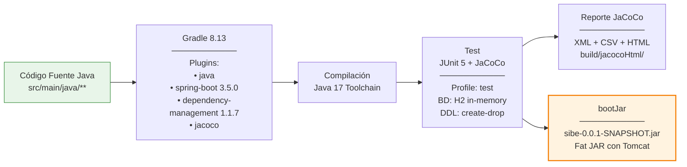

### 12.2 Pipeline de Build — Frontend

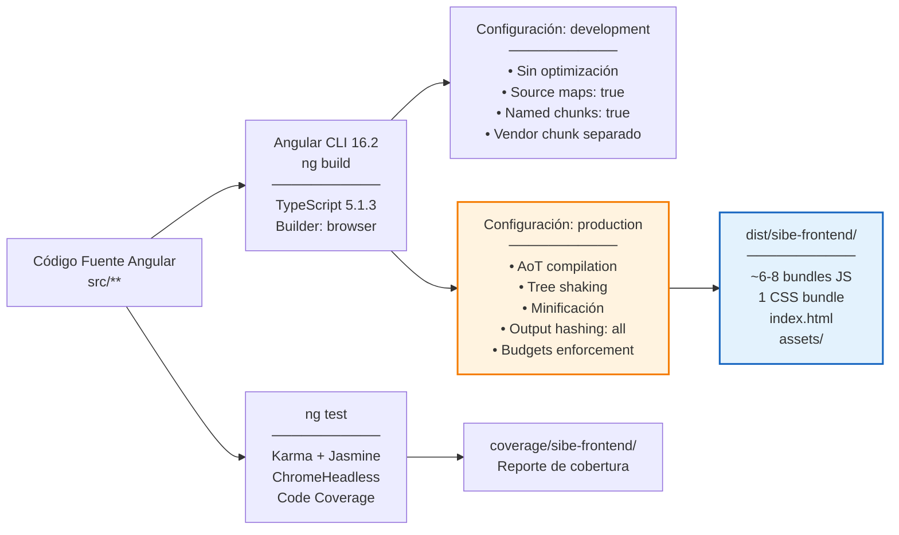

### 12.3 Comandos de Build

| Acción                        | Comando                                          | Artefacto Generado                      |
|-------------------------------|--------------------------------------------------|-----------------------------------------|
| Build backend                 | `./gradlew bootJar`                              | `build/libs/sibe-0.0.1-SNAPSHOT.jar`   |
| Test backend + cobertura      | `./gradlew test`                                 | `build/jacocoHtml/index.html`           |
| Build frontend (producción)   | `ng build --configuration production`            | `dist/sibe-frontend/`                   |
| Build frontend (desarrollo)   | `ng build --configuration development`           | `dist/sibe-frontend/` (sin optimizar)   |
| Test frontend + cobertura     | `ng test --browsers=ChromeHeadless --watch=false --code-coverage` | `coverage/sibe-frontend/` |
| Servir frontend (desarrollo)  | `ng serve --proxy-config proxy.conf.json -o`     | En memoria (HMR)                        |
| Ejecutar backend              | `java -jar build/libs/sibe-0.0.1-SNAPSHOT.jar`  | Servidor activo en :8080                |

---

## 13. Ambientes de Ejecución

### 13.1 Tabla Comparativa de Ambientes

| Propiedad              | Desarrollo (Local)                     | Pruebas (Test)                   | Producción (Docker Compose)            |
|------------------------|----------------------------------------|----------------------------------|----------------------------------------|
| **Frontend Server**    | `ng serve` (webpack-dev-server :4200)  | ChromeHeadless (Karma)           | nginx:alpine :80 (contenedor `sibe-frontend`) |
| **Backend Server**     | Tomcat embebido :8080                  | Spring context (test slice)      | eclipse-temurin:17-jre-alpine :8080 (contenedor `sibe-backend`) |
| **Base de Datos**      | PostgreSQL local :5432                 | H2 in-memory                     | postgres:16-alpine :5432 (contenedor `sibe-db`, volumen `sibe-pgdata`) |
| **DDL Strategy**       | `update` (auto-genera)                 | `create-drop` (recrea cada test) | `update` (configurable vía `DDL_AUTO`) |
| **CORS Origin**        | `http://localhost:4200`                | N/A                              | Configurable vía `CORS_ALLOWED_ORIGINS` (default: `http://localhost:4200,http://localhost`) |
| **SSL/TLS**            | No                                     | No                               | Configurar con reverse proxy externo si se requiere |
| **JWT Key**            | Clave hardcoded en constante           | Misma clave (test)               | Misma clave (externalizable en futuro) |
| **SMTP**               | Gmail SMTP (smtp.gmail.com:587)        | Mock / deshabilitado             | Configurable vía `MAIL_HOST/USERNAME/PASSWORD` |
| **Logging**            | Console (INFO)                         | Console (DEBUG)                  | `docker compose logs -f backend`       |
| **Profile Spring**     | default                                | `test` (`@ActiveProfiles`)       | default (con env vars)                 |
| **Despliegue**         | `./gradlew bootRun` + `ng serve`       | `./gradlew test` + `ng test`     | `docker compose up --build -d`         |

### 13.2 Diagrama Comparativo

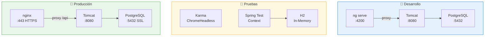

---

## 14. Diagrama de Despliegue Completo — Vista Integrada

### 14.1 Diagrama UML de Despliegue (Desarrollo)

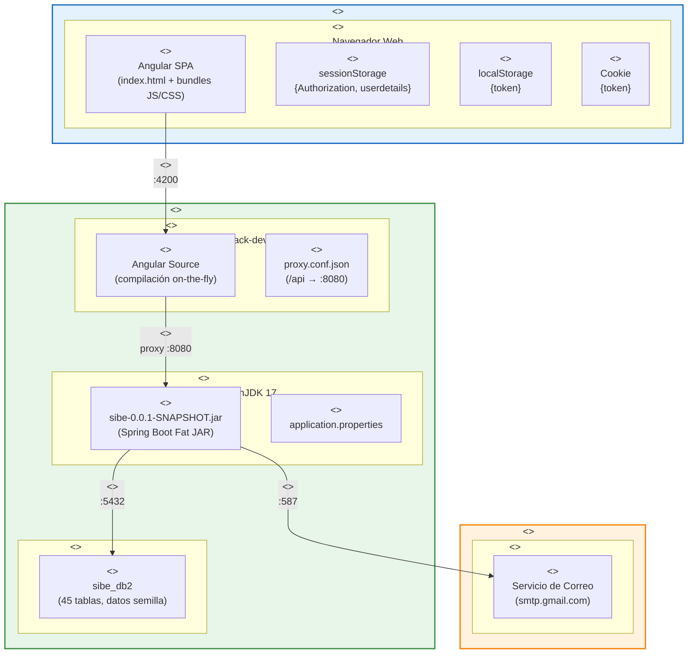

### 14.2 Diagrama UML de Despliegue (Producción — Propuesta)

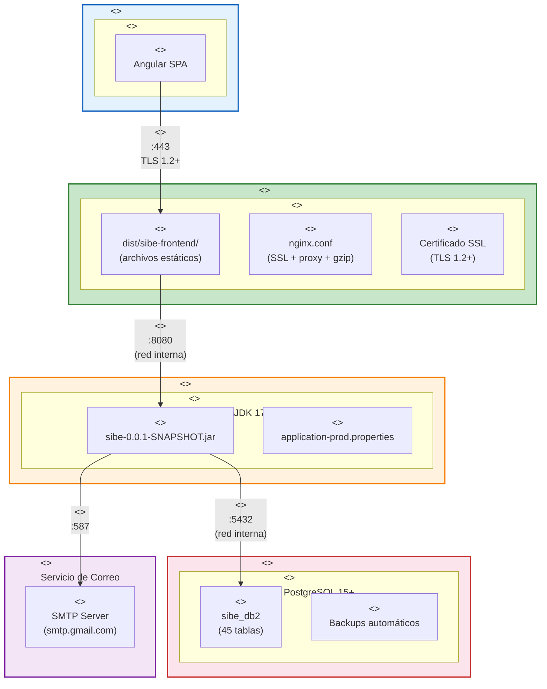

---

## 15. Matriz de Puertos y Endpoints

### 15.1 Puertos de Red

| Servicio              | Puerto | Protocolo    | Ambiente          | Nota                                     |
|-----------------------|--------|--------------|-------------------|------------------------------------------|
| Angular Dev Server    | 4200   | HTTP         | Desarrollo        | webpack-dev-server con HMR               |
| nginx                 | 443    | HTTPS        | Producción        | SSL termination + reverse proxy          |
| nginx                 | 80     | HTTP         | Producción        | Redirect → 443                           |
| Spring Boot / Tomcat  | 8080   | HTTP         | Todos             | API REST, context-path `/api`            |
| PostgreSQL            | 5432   | TCP (JDBC)   | Dev + Prod        | Wire protocol PostgreSQL                 |
| H2 In-Memory          | N/A    | Embebido     | Test              | Sin puerto de red (en proceso)           |
| Gmail SMTP            | 587    | SMTP + TLS   | Dev + Prod        | STARTTLS obligatorio                     |

### 15.2 Endpoints REST del Backend (resumen agrupado)

| Grupo              | Base Path             | Métodos HTTP        | # Endpoints | Acceso        |
|--------------------|-----------------------|---------------------|-------------|---------------|
| Login              | `/api/login`          | GET                 | 1           | Authenticated |
| Usuarios           | `/api/usuarios`       | GET, POST, PUT, DELETE| ~8        | Mixto         |
| Recuperación Clave | `/api/usuarios/recuperacion` | POST, PUT    | 3           | Public        |
| Actividades        | `/api/actividades`    | GET, POST, PUT      | ~20         | Authenticated |
| Direcciones        | `/api/direcciones`    | GET                 | ~3          | Authenticated |
| Áreas              | `/api/areas`          | GET                 | ~3          | Authenticated |
| Subáreas           | `/api/subareas`       | GET                 | ~3          | Authenticated |
| Indicadores        | `/api/indicadores`    | GET, POST, PUT      | ~5          | Authenticated |
| Acciones           | `/api/acciones`       | GET, POST, PUT      | ~4          | Authenticated |
| Proyectos          | `/api/proyectos`      | GET, POST, PUT      | ~4          | Authenticated |
| Carga Masiva       | `/api/carga_masiva`   | POST                | ~2          | Authenticated |
| Organización       | `/api/organizacion`   | GET                 | ~2          | Authenticated |
| Miembros           | `/api/miembros`       | GET                 | ~2          | Authenticated |
| Tipos (catálogos)  | `/api/tipos_*`        | GET                 | ~4          | Authenticated |
| Temporalidades     | `/api/temporalidades` | GET                 | ~2          | Authenticated |
| Públicos Interés   | `/api/publicos_interes`| GET                | ~2          | Authenticated |

---

## 16. Requisitos de Infraestructura

### 16.1 Requisitos Mínimos — Desarrollo

| Componente     | Requisito                                              |
|----------------|--------------------------------------------------------|
| **OS**         | Windows 10+, macOS 12+, o Linux (Ubuntu 20.04+)       |
| **JDK**        | OpenJDK 17 (requerido por `java.toolchain`)            |
| **Node.js**    | 16.x - 18.x (requisito Angular 16)                    |
| **npm**        | 8.x+                                                   |
| **Gradle**     | 8.13 (se descarga automáticamente vía wrapper)          |
| **PostgreSQL** | 12+ (compatible con `PostgreSQLDialect`)               |
| **RAM**        | ≥ 8 GB                                                 |
| **Disco**      | ≥ 2 GB libres (dependencias + build)                   |
| **Navegador**  | Chrome 90+, Firefox 90+, Edge 90+, Safari 15+         |

### 16.2 Requisitos Mínimos — Producción (Propuesta)

| Componente       | Requisito                                              |
|------------------|--------------------------------------------------------|
| **Servidor App** | 2 vCPU, 2 GB RAM, JDK 17, 10 GB disco                 |
| **Servidor Web** | 1 vCPU, 512 MB RAM, nginx 1.24+, 1 GB disco           |
| **Servidor BD**  | 2 vCPU, 4 GB RAM, PostgreSQL 15+, 50 GB SSD           |
| **Red**          | Puerto 443 (público), 8080 y 5432 (internos)          |
| **Certificado**  | SSL/TLS válido (Let's Encrypt o institucional)         |
| **DNS**          | Dominio configurado apuntando al servidor web          |

