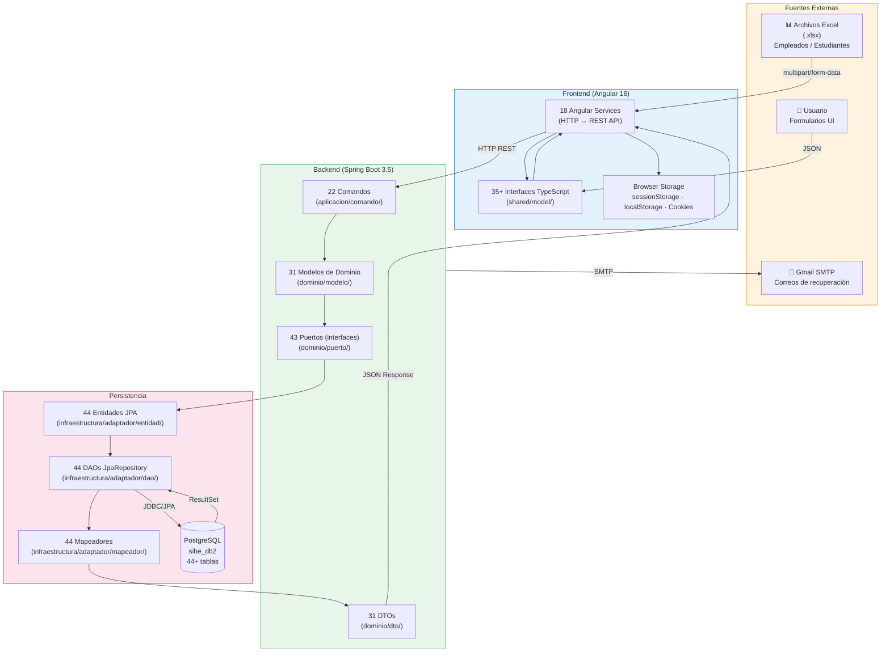
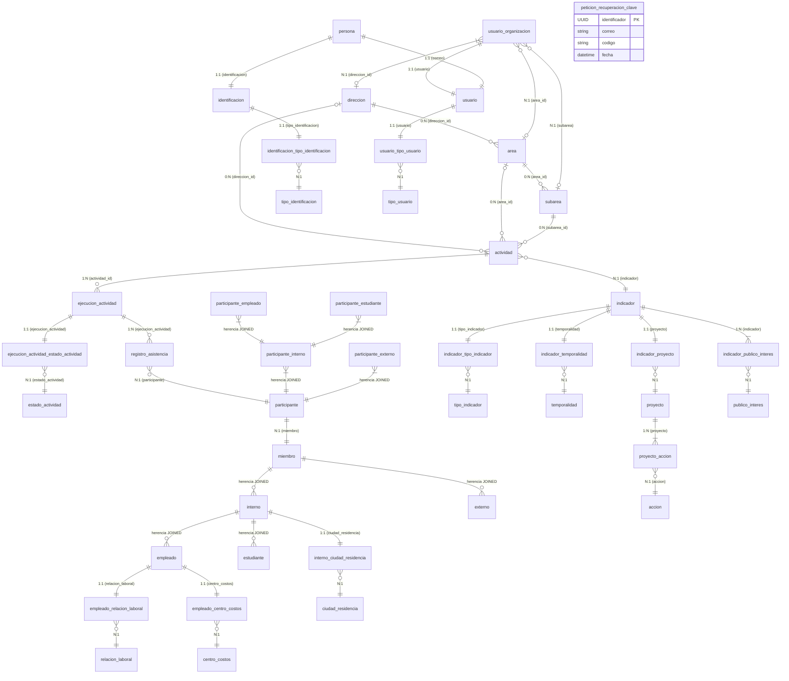
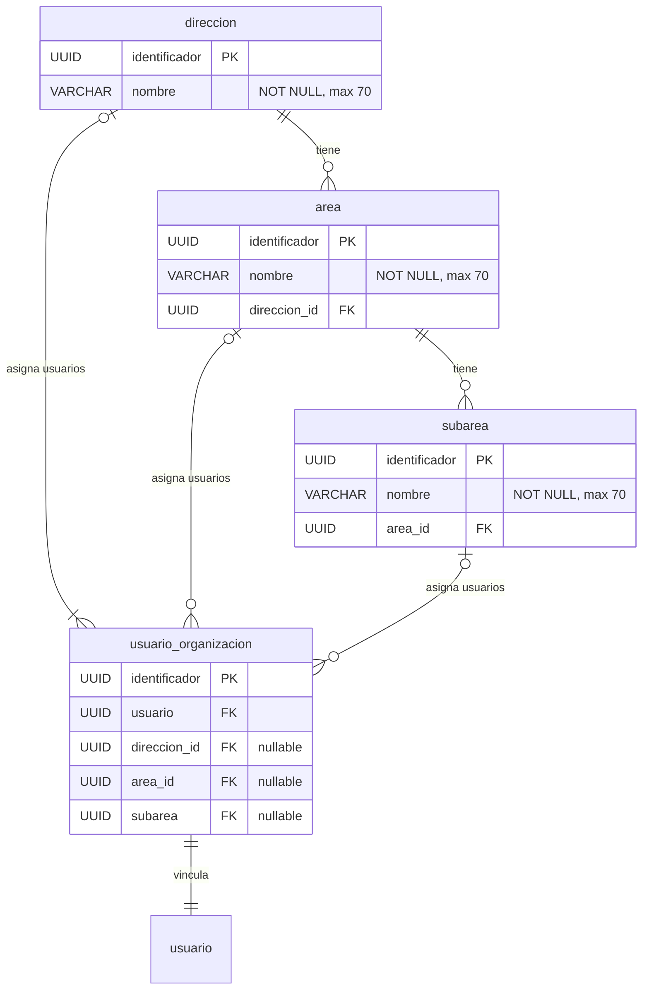
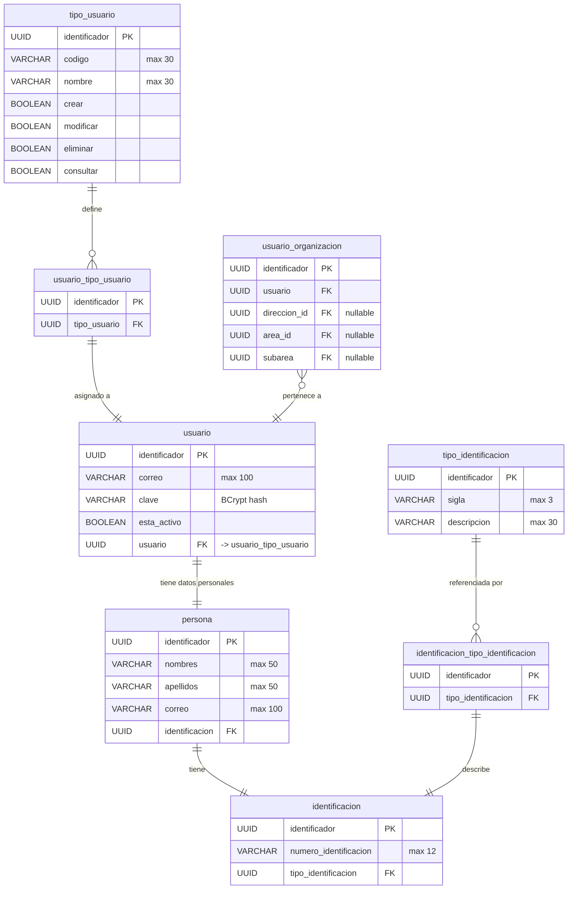
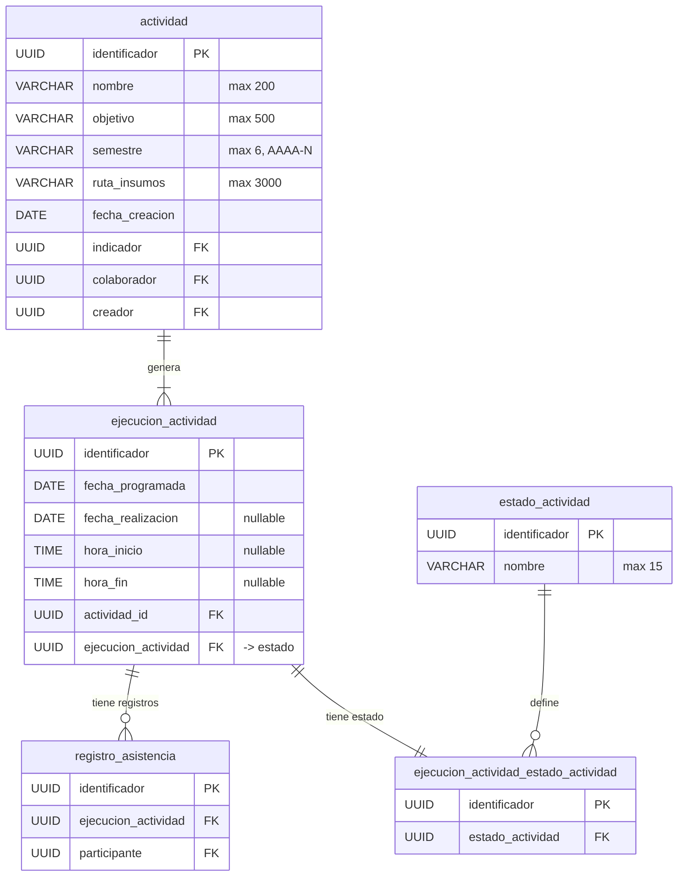
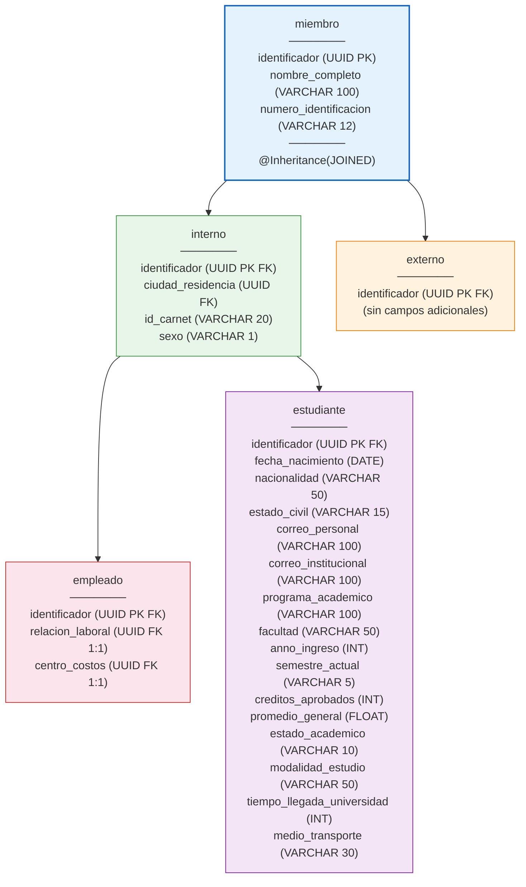
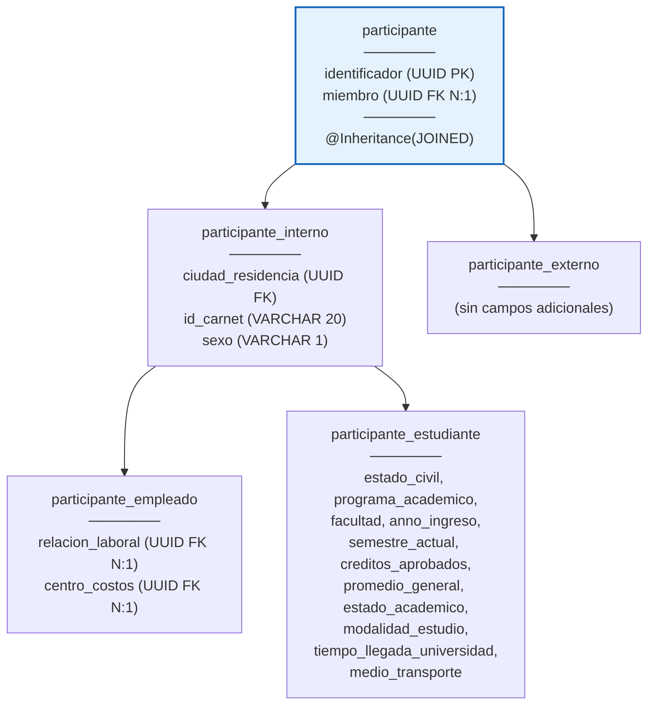
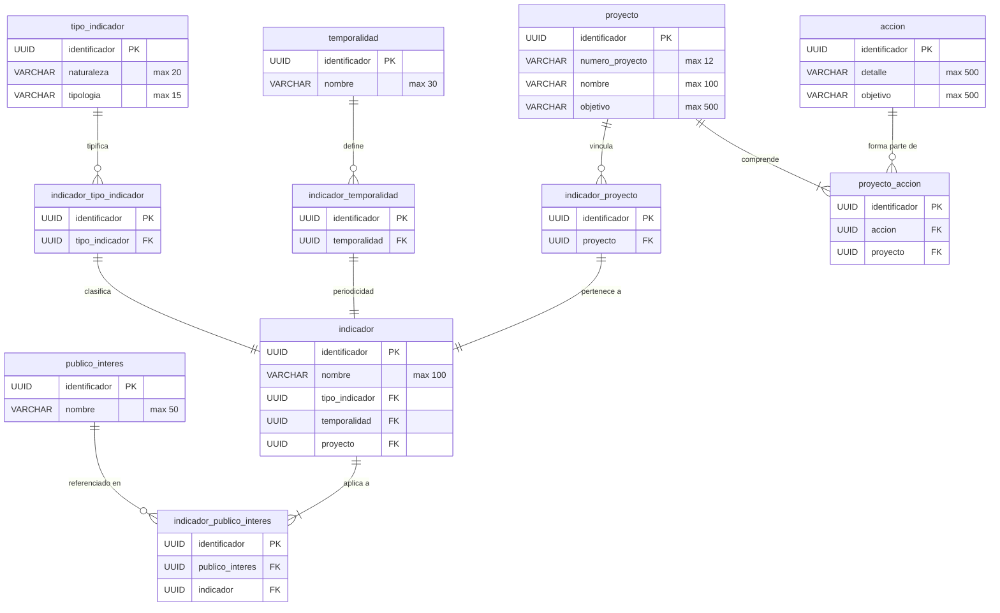
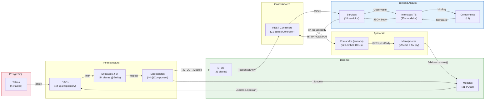

# 29. Modelo de Fuente de Información — SIBE

| Metadato              | Valor                                                                              |
|-----------------------|------------------------------------------------------------------------------------|
| **Proyecto**          | SIBE — Sistema de Información de Bienestar y Evangelización                                   |
| **SGBD**              | PostgreSQL (producción) · H2 In-Memory (pruebas)                                   |
| **ORM**               | Hibernate 6 + Spring Data JPA · DDL Auto: `update`                                 |
| **Entidades JPA**     | 44 clases de entidad · 44 interfaces DAO                                           |
| **DTOs**              | 31 DTOs backend · 35+ interfaces frontend                                          |
| **Versión**           | 1.0                                                                                |

---

## Tabla de Contenido

1. [Visión General](#1-visión-general)
2. [Fuentes de Información del Sistema](#2-fuentes-de-información-del-sistema)
3. [Modelo Entidad-Relación (ER Completo)](#3-modelo-entidad-relación-er-completo)
4. [Dominio: Estructura Organizacional](#4-dominio-estructura-organizacional)
5. [Dominio: Usuarios y Autenticación](#5-dominio-usuarios-y-autenticación)
6. [Dominio: Actividades y Ejecuciones](#6-dominio-actividades-y-ejecuciones)
7. [Dominio: Miembros y Participantes](#7-dominio-miembros-y-participantes)
8. [Dominio: Indicadores, Proyectos y Acciones](#8-dominio-indicadores-proyectos-y-acciones)
9. [Dominio: Catálogos y Datos de Referencia](#9-dominio-catálogos-y-datos-de-referencia)
10. [Tablas de Relación (Join Tables)](#10-tablas-de-relación-join-tables)
11. [Estrategia de Herencia JPA](#11-estrategia-de-herencia-jpa)
12. [Datos Semilla (Seed Data)](#12-datos-semilla-seed-data)
13. [Flujo de Datos: Backend → Frontend](#13-flujo-de-datos-backend--frontend)
14. [Mapeo de Modelos Backend ↔ Frontend](#14-mapeo-de-modelos-backend--frontend)
15. [Almacenamiento en el Cliente (Frontend)](#15-almacenamiento-en-el-cliente-frontend)
16. [Fuentes de Datos Externas](#16-fuentes-de-datos-externas)
17. [Diccionario de Datos Consolidado](#17-diccionario-de-datos-consolidado)

---

## 1. Visión General

El **Modelo de Fuente de Información** documenta todas las fuentes de datos del sistema SIBE, incluyendo la base de datos relacional, los modelos de dominio, los objetos de transferencia (DTOs), los datos de referencia (catálogos), los datos semilla, y las fuentes de información externas. Este artefacto establece la trazabilidad completa del dato desde su origen hasta su presentación al usuario.

### Clasificación de Fuentes

| Tipo de Fuente               | Tecnología                | Descripción                                        |
|------------------------------|---------------------------|----------------------------------------------------|
| **Primaria (Persistencia)**  | PostgreSQL + Hibernate JPA| 44 entidades mapeadas a tablas relacionales         |
| **Dominio (Modelos)**        | Java POJOs                | 31 modelos de dominio con constructores estáticos   |
| **Transferencia (DTOs)**     | Java DTOs + TS Interfaces | 31 DTOs backend, 35+ interfaces frontend            |
| **Referencia (Catálogos)**   | Seed Data (DataLoaders)   | 10 catálogos precargados al arrancar                |
| **Temporal (Sesión)**        | sessionStorage/localStorage| JWT, sesión de usuario, tokens                     |
| **Externa (SMTP)**           | Gmail SMTP                | Envío de correos de recuperación de contraseña      |
| **Masiva (Excel)**           | Apache POI (.xlsx)        | Carga masiva de empleados y estudiantes             |

---

## 2. Fuentes de Información del Sistema

### 2.1 Diagrama General de Flujo de Datos



---

## 3. Modelo Entidad-Relación (ER Completo)

### 3.1 Diagrama ER — Vista General



---

## 4. Dominio: Estructura Organizacional

### 4.1 Tablas

#### `direccion`

| Columna          | Tipo         | Restricciones           | Descripción                    |
|------------------|--------------|-------------------------|--------------------------------|
| `identificador`  | UUID         | PK, NOT NULL, no update | Identificador único            |
| `nombre`         | VARCHAR(70)  | NOT NULL                | Nombre de la dirección         |

#### `area`

| Columna          | Tipo         | Restricciones           | Descripción                    |
|------------------|--------------|-------------------------|--------------------------------|
| `identificador`  | UUID         | PK, NOT NULL, no update | Identificador único            |
| `nombre`         | VARCHAR(70)  | NOT NULL                | Nombre del área                |

**Relaciones**: `area` ← FK `direccion_id` referencia `direccion.identificador` (1:N)

#### `subarea`

| Columna          | Tipo         | Restricciones           | Descripción                    |
|------------------|--------------|-------------------------|--------------------------------|
| `identificador`  | UUID         | PK, NOT NULL, no update | Identificador único            |
| `nombre`         | VARCHAR(70)  | NOT NULL                | Nombre de la subárea           |

**Relaciones**: `subarea` ← FK `area_id` en `area` (1:N vía @JoinColumn)

### 4.2 Diagrama



---

## 5. Dominio: Usuarios y Autenticación

### 5.1 Tablas

#### `persona`

| Columna          | Tipo         | Restricciones           | Descripción                    |
|------------------|--------------|-------------------------|--------------------------------|
| `identificador`  | UUID         | PK                      | Identificador único            |
| `nombres`        | VARCHAR(50)  | NOT NULL                | Nombres de la persona          |
| `apellidos`      | VARCHAR(50)  | NOT NULL                | Apellidos de la persona        |
| `correo`         | VARCHAR(100) | NOT NULL                | Correo electrónico             |
| `identificacion` | UUID         | FK, NOT NULL, cascade ALL| Ref. a `identificacion`       |

#### `identificacion`

| Columna               | Tipo         | Restricciones    | Descripción                    |
|-----------------------|--------------|------------------|--------------------------------|
| `identificador`       | UUID         | PK               | Identificador único            |
| `numero_identificacion`| VARCHAR(12) | NOT NULL         | Número de documento            |
| `tipo_identificacion` | UUID         | FK, cascade ALL  | Ref. tabla puente → `tipo_identificacion` |

#### `usuario`

| Columna          | Tipo         | Restricciones           | Descripción                    |
|------------------|--------------|-------------------------|--------------------------------|
| `identificador`  | UUID         | PK                      | Identificador único            |
| `correo`         | VARCHAR(100) | NOT NULL                | Correo para login              |
| `clave`          | VARCHAR      | NOT NULL                | Hash BCrypt de la contraseña   |
| `esta_activo`    | BOOLEAN      | NOT NULL                | Estado activo/inactivo         |
| `usuario`        | UUID         | FK, cascade ALL         | Ref. a `usuario_tipo_usuario`  |

#### `usuario_organizacion`

| Columna          | Tipo | Restricciones     | Descripción                         |
|------------------|------|-------------------|-------------------------------------|
| `identificador`  | UUID | PK                | Identificador único                 |
| `usuario`        | UUID | FK, NOT NULL      | Ref. a `usuario`                    |
| `direccion_id`   | UUID | FK, nullable      | Ref. a `direccion` (si aplica)      |
| `area_id`        | UUID | FK, nullable      | Ref. a `area` (si aplica)           |
| `subarea`        | UUID | FK, nullable      | Ref. a `subarea` (si aplica)        |

#### `peticion_recuperacion_clave`

| Columna          | Tipo          | Restricciones | Descripción                         |
|------------------|---------------|---------------|-------------------------------------|
| `identificador`  | UUID          | PK            | Identificador único                 |
| `correo`         | VARCHAR(100)  | NOT NULL      | Correo del solicitante              |
| `codigo`         | VARCHAR       | NOT NULL      | Código de recuperación (6 dígitos)  |
| `fecha`          | TIMESTAMP     |               | Fecha/hora de la solicitud          |

### 5.2 Diagrama



---

## 6. Dominio: Actividades y Ejecuciones

### 6.1 Tablas

#### `actividad`

| Columna          | Tipo          | Restricciones           | Descripción                          |
|------------------|---------------|-------------------------|--------------------------------------|
| `identificador`  | UUID          | PK, NOT NULL, no update | Identificador único                  |
| `nombre`         | VARCHAR(200)  | NOT NULL                | Nombre de la actividad               |
| `objetivo`       | VARCHAR(500)  | NOT NULL                | Objetivo de la actividad             |
| `semestre`       | VARCHAR(6)    | NOT NULL                | Semestre (formato AAAA-N)            |
| `ruta_insumos`   | VARCHAR(3000) | NOT NULL                | Ruta a los materiales/insumos        |
| `fecha_creacion` | DATE          | NOT NULL                | Fecha de creación                    |
| `indicador`      | UUID          | FK (ManyToOne)          | Ref. a `indicador`                   |
| `colaborador`    | UUID          | FK (JoinColumn)         | UUID del colaborador asignado        |
| `creador`        | UUID          | FK (JoinColumn)         | UUID del usuario creador             |

#### `ejecucion_actividad`

| Columna            | Tipo      | Restricciones           | Descripción                       |
|--------------------|-----------|-------------------------|-----------------------------------|
| `identificador`    | UUID      | PK, NOT NULL, no update | Identificador único               |
| `fecha_programada` | DATE      | NOT NULL                | Fecha planificada                 |
| `fecha_realizacion`| DATE      | nullable                | Fecha de ejecución real           |
| `hora_inicio`      | TIME      | nullable                | Hora de inicio                    |
| `hora_fin`         | TIME      | nullable                | Hora de finalización              |
| `ejecucion_actividad`| UUID   | FK, cascade ALL (1:1)   | Ref. a estado                     |
| `actividad_id`     | UUID      | FK, NOT NULL (N:1 LAZY) | Ref. a `actividad`                |

#### `estado_actividad`

| Columna          | Tipo         | Restricciones | Descripción          |
|------------------|--------------|---------------|----------------------|
| `identificador`  | UUID         | PK            | Identificador único  |
| `nombre`         | VARCHAR(15)  | NOT NULL      | Nombre del estado    |

**Valores posibles**: `Pendiente`, `En curso`, `Finalizada`

#### `registro_asistencia`

| Columna              | Tipo | Restricciones        | Descripción                        |
|----------------------|------|----------------------|------------------------------------|
| `identificador`      | UUID | PK                   | Identificador único                |
| `ejecucion_actividad`| UUID | FK, NOT NULL (N:1)   | Ref. a `ejecucion_actividad`       |
| `participante`       | UUID | FK, NOT NULL (N:1)   | Ref. a `participante`              |

### 6.2 Diagrama



---

## 7. Dominio: Miembros y Participantes

### 7.1 Jerarquía de Herencia — Miembros

La estrategia de herencia es **JOINED** (tabla por subclase con joins).



### 7.2 Jerarquía de Herencia — Participantes

Estructura paralela a miembros, usada para registrar la participación en actividades con datos snapshot.



### 7.3 Tablas de Apoyo

| Tabla                        | Columnas                              | Relación                          |
|------------------------------|---------------------------------------|------------------------------------|
| `centro_costos`              | identificador, codigo(6), descripcion(100) | Catálogo de centros de costos |
| `relacion_laboral`           | identificador, codigo(4), descripcion(20)  | Catálogo de relaciones laborales |
| `ciudad_residencia`          | identificador, descripcion(30)        | Catálogo de ciudades              |
| `interno_ciudad_residencia`  | identificador, ciudad_residencia FK   | Tabla puente interno ↔ ciudad     |
| `empleado_relacion_laboral`  | identificador, relacion_laboral FK    | Tabla puente empleado ↔ rel.lab.  |
| `empleado_centro_costos`     | identificador, empleado_centro_costos FK | Tabla puente empleado ↔ c.costos |

---

## 8. Dominio: Indicadores, Proyectos y Acciones

### 8.1 Tablas

#### `indicador`

| Columna          | Tipo         | Restricciones             | Descripción                    |
|------------------|--------------|---------------------------|--------------------------------|
| `identificador`  | UUID         | PK, NOT NULL, no update   | Identificador único            |
| `nombre`         | VARCHAR(100) | NOT NULL                  | Nombre del indicador           |
| `tipo_indicador` | UUID         | FK (1:1 LAZY, cascade ALL)| Ref. tabla puente              |
| `temporalidad`   | UUID         | FK (1:1 LAZY, cascade ALL)| Ref. tabla puente              |
| `proyecto`       | UUID         | FK (1:1 LAZY, cascade ALL)| Ref. tabla puente              |

#### `proyecto`

| Columna          | Tipo         | Restricciones           | Descripción                    |
|------------------|--------------|-------------------------|--------------------------------|
| `identificador`  | UUID         | PK, NOT NULL, no update | Identificador único            |
| `numero_proyecto`| VARCHAR(12)  | NOT NULL                | Código del proyecto            |
| `nombre`         | VARCHAR(100) | NOT NULL                | Nombre del proyecto            |
| `objetivo`       | VARCHAR(500) | NOT NULL                | Objetivo del proyecto          |

#### `accion`

| Columna          | Tipo         | Restricciones           | Descripción                    |
|------------------|--------------|-------------------------|--------------------------------|
| `identificador`  | UUID         | PK, NOT NULL, no update | Identificador único            |
| `detalle`        | VARCHAR(500) | NOT NULL                | Detalle de la acción           |
| `objetivo`       | VARCHAR(500) | NOT NULL                | Objetivo de la acción          |

### 8.2 Diagrama



---

## 9. Dominio: Catálogos y Datos de Referencia

Los catálogos son tablas de **solo lectura operativa** que almacenan valores predefinidos del sistema.

| Catálogo             | Tabla                | Campos Clave                    | # Registros Seed |
|----------------------|----------------------|---------------------------------|-------------------|
| Tipos de Usuario     | `tipo_usuario`       | codigo, nombre, permisos CRUD   | 3                 |
| Tipos de Identificación | `tipo_identificacion` | sigla, descripcion           | 3                 |
| Temporalidades       | `temporalidad`       | nombre                          | 5                 |
| Estados de Actividad | `estado_actividad`   | nombre                          | 3                 |
| Públicos de Interés  | `publico_interes`    | nombre                          | 5                 |
| Tipos de Indicador   | `tipo_indicador`     | naturaleza, tipologia           | 5                 |
| Centros de Costos    | `centro_costos`      | codigo, descripcion             | Dinámico (Excel)  |
| Relaciones Laborales | `relacion_laboral`   | codigo, descripcion             | Dinámico (Excel)  |
| Ciudades de Residencia| `ciudad_residencia` | descripcion                     | Dinámico (Excel)  |

### 9.1 Enumeraciones del Dominio

| Enum Java           | Valores                        | Uso                                    |
|---------------------|--------------------------------|----------------------------------------|
| `TipoArea`          | DIRECCION, AREA, SUBAREA       | Nivel organizacional de vinculación     |
| `TipoInterno`       | ESTUDIANTE, EMPLEADO           | Subclasificación de miembros internos   |
| `TipoParticipante`  | INTERNO, EXTERNO               | Clasificación de participantes          |
| `TipoPrograma`      | PREGRADO, POSTGRADO            | Nivel de formación académica            |

---

## 10. Tablas de Relación (Join Tables)

El sistema utiliza **join tables** para relaciones muchos-a-muchos y tablas puente para composiciones 1:1.

### 10.1 Join Tables N:M

| Join Table            | FK Izquierda                | FK Derecha                  | Propósito                                |
|-----------------------|-----------------------------|-----------------------------|------------------------------------------|
| `direccion_actividad` | `direccion_id` → direccion  | `actividad` → actividad     | Actividades vinculadas a dirección       |
| `area_actividad`      | `area_id` → area            | `actividad` → actividad     | Actividades vinculadas a área            |
| `subarea_actividad`   | `subarea` → subarea         | `actividad` → actividad     | Actividades vinculadas a subárea         |

### 10.2 Tablas Puente 1:1 / N:1 (Value Object Pattern)

| Tabla Puente                          | FK Principal             | FK Catálogo                  | Cardinalidad |
|---------------------------------------|--------------------------|------------------------------|-------------|
| `identificacion_tipo_identificacion`  | (owned by identificacion)| tipo_identificacion          | N:1         |
| `usuario_tipo_usuario`                | (owned by usuario)       | tipo_usuario                 | N:1         |
| `ejecucion_actividad_estado_actividad`| (owned by ejecucion)     | estado_actividad             | N:1         |
| `indicador_tipo_indicador`            | (owned by indicador)     | tipo_indicador               | N:1         |
| `indicador_temporalidad`              | (owned by indicador)     | temporalidad                 | N:1         |
| `indicador_proyecto`                  | (owned by indicador)     | proyecto                     | N:1         |
| `indicador_publico_interes`           | (owned by indicador)     | publico_interes              | N:1 (×N)    |
| `interno_ciudad_residencia`           | (owned by interno)       | ciudad_residencia            | N:1         |
| `empleado_relacion_laboral`           | (owned by empleado)      | relacion_laboral             | N:1         |
| `empleado_centro_costos`              | (owned by empleado)      | centro_costos                | N:1         |
| `proyecto_accion`                     | (owned by proyecto)      | accion                       | N:1         |

---

## 11. Estrategia de Herencia JPA

### 11.1 Jerarquía `miembro` (JOINED)

```
miembro (@Inheritance JOINED)
├── interno (@PrimaryKeyJoinColumn)
│   ├── empleado (@PrimaryKeyJoinColumn)
│   └── estudiante (@PrimaryKeyJoinColumn)
└── externo (@PrimaryKeyJoinColumn)
```

**Implicación SQL**: Un `SELECT` de `empleado` genera un `JOIN` entre `miembro`, `interno` y `empleado`.

### 11.2 Jerarquía `participante` (JOINED)

```
participante (@Inheritance JOINED)
├── participante_interno (@PrimaryKeyJoinColumn)
│   ├── participante_empleado (@PrimaryKeyJoinColumn)
│   └── participante_estudiante (@PrimaryKeyJoinColumn)
└── participante_externo (@PrimaryKeyJoinColumn)
```

**Propósito dual**: El sistema mantiene dos jerarquías paralelas (miembro y participante) para permitir que los datos del participante sean un **snapshot** al momento de la participación, independiente de cambios posteriores en los datos del miembro.

### 11.3 Tabla Resumen de Entidades por Jerarquía

| Jerarquía     | Entidades                                                          | Total Tablas |
|---------------|---------------------------------------------------------------------|-------------|
| Miembro       | miembro, interno, externo, empleado, estudiante                    | 5           |
| Participante  | participante, participante_interno, participante_externo, participante_empleado, participante_estudiante | 5 |
| Standalone    | Todas las demás (actividad, usuario, indicador, etc.)              | 37          |
| **Total**     |                                                                     | **47**      |

---

## 12. Datos Semilla (Seed Data)

### 12.1 Orden de Carga

Los DataLoaders se ejecutan vía `CommandLineRunner` con `@Order` explícito. Solo ejecutan si no existen datos previos en la tabla destino.

| Orden | DataLoader                    | Entidad Destino        | Registros | Condición                         |
|-------|-------------------------------|------------------------|-----------|-----------------------------------|
| 1     | `TipoUsuarioDataLoader`       | `tipo_usuario`         | 3         | Si tabla vacía                    |
| 2     | `TipoIdentificacionDataLoader`| `tipo_identificacion`  | 3         | Si tabla vacía                    |
| 3     | `TemporalidadDataLoader`       | `temporalidad`         | 6         | Si tabla vacía                    |
| 4     | `EstadoActividadDataLoader`    | `estado_actividad`     | 3         | Si tabla vacía                    |
| 5     | `PublicoInteresDataLoader`     | `publico_interes`      | 5         | Si tabla vacía                    |
| 6     | `TipoIndicadorDataLoader`      | `tipo_indicador`       | 5         | Si tabla vacía                    |
| 7     | `SubareaDataLoader`            | `subarea`              | 8         | Si tabla vacía                    |
| 8     | `AreaDataLoader`               | `area`                 | 4         | Si tabla vacía; vincula subáreas  |
| 9     | `DireccionDataLoader`          | `direccion`            | 1         | Si tabla vacía; vincula áreas     |
| 10    | `UsuarioAdministradorDataLoader`| `persona` + `usuario` + `usuario_organizacion` | 1 | Si tabla vacía |

### 12.2 Valores Exactos de Datos Semilla

#### Tipos de Usuario

| Código                  | Nombre                    | Crear | Modificar | Eliminar | Consultar |
|-------------------------|---------------------------|-------|-----------|----------|-----------|
| `ADMINISTRADOR_DIRECCION`| Administrador de dirección| ✅    | ✅        | ✅       | ✅        |
| `ADMINISTRADOR_AREA`    | Administrador de Area     | ✅    | ✅        | ✅       | ✅        |
| `COLABORADOR`           | Colaborador               | ✅    | ✅        | ❌       | ✅        |

#### Tipos de Identificación

| Sigla | Descripción             |
|-------|-------------------------|
| `CC`  | Cédula de Ciudadanía    |
| `TI`  | Tarjeta de Identidad    |
| `CE`  | Cédula de Extranjería   |

#### Temporalidades

| Nombre      |
|-------------|
| Diaria      |
| Semanal     |
| Mensual     |
| Trimestral  |
| Semestral   |
| Anual       |

#### Estados de Actividad

| Nombre      |
|-------------|
| Pendiente   |
| En curso    |
| Finalizada  |

#### Públicos de Interés

| Nombre                              |
|--------------------------------------|
| Registros calificados programa       |
| Acreditación institucional           |
| Certificaciones ISO                  |
| Ministerio de Educación             |
| Plan Pastoral Diosesano             |

#### Tipos de Indicador

| Naturaleza            | Tipología  |
|-----------------------|------------|
| Eficiencia            | Gestión    |
| Capacidad instalada   | Capacidad  |
| Eficacia              | Resultado  |
| Efectividad           | Resultado  |
| Valor                 | Impacto    |

#### Estructura Organizacional Inicial

| Dirección                                 | Áreas                                                                           |
|-------------------------------------------|---------------------------------------------------------------------------------|
| Dirección de Bienestar y Evangelización   | Bienestar, Evangelización, Hogar Juvenil Santa María, Servicio y atención al usuario |

| Área       | Subáreas                                                                                                |
|------------|---------------------------------------------------------------------------------------------------------|
| Bienestar  | Deportes, Cancha sintética, Extensión cultural, Banda Sinfónica, Gimnasio, Unidad de Salud, Acompañamiento psicosocial, Trabajo social |

#### Usuario Administrador Inicial

| Campo              | Valor                                       |
|--------------------|---------------------------------------------|
| Nombres            | Administrador                               |
| Apellidos          | UCO                                         |
| Correo             | *(no publicado — configurado en el servidor)*            |
| Clave              | *(no publicado — almacenada como hash BCrypt)*           |
| Tipo Identificación| CC (Cédula de Ciudadanía)                   |
| Nro. Identificación| 1111111111                                  |
| Tipo Usuario       | ADMINISTRADOR_DIRECCION                     |
| Vinculación        | Dirección de Bienestar y Evangelización      |

---

## 13. Flujo de Datos: Backend → Frontend

### 13.1 Diagrama de Transformación de Datos



---

## 14. Mapeo de Modelos Backend ↔ Frontend

### 14.1 Modelos de Lectura (Backend DTO → Frontend Interface)

| Backend DTO                    | Frontend Interface             | Endpoint REST                              |
|--------------------------------|--------------------------------|--------------------------------------------|
| `UsuarioDTO`                   | `UserResponse`                 | GET `/usuarios`                            |
| `PersonaDTO`                   | (interno, embebido en usuario) | —                                          |
| `IdentificacionDTO`            | `IdentificationResponse`       | Anidado en UserResponse                    |
| `TipoIdentificacionDTO`        | `IdentificationTypeResponse`   | GET `/tipos_identificacion`                |
| `TipoUsuarioDTO`               | `UserTypeResponse`             | GET `/tipos_usuario`                       |
| `UsuarioAreaDTO`                | `AreaResponse` (parcial)       | Anidado en UserResponse                    |
| `DireccionDTO`                  | `DepartmentResponse`           | GET `/direcciones`                         |
| `DireccionDetalladaDTO`         | `DepartmentDetailResponse`     | GET `/direcciones/detalle/{id}`            |
| `AreaDTO`                       | `AreaResponse`                 | GET `/areas`                               |
| `AreaDetalladaDTO`              | `AreaDetailResponse`           | GET `/areas/detalle/{id}`                  |
| `SubareaDTO`                    | `SubAreaResponse`              | GET `/subareas`                            |
| `SubareaDetalladaDTO`           | `SubAreaDetailResponse`        | GET `/subareas/detalle/{id}`               |
| `ActividadDTO`                  | `ActivityResponse`             | GET `/actividades/area/{id}`               |
| `ActividadDetalladaDTO`         | `ActivityDetailResponse`       | Anidado en vistas detalladas               |
| `EjecucionActividadDTO`         | `ActivityExecutionResponse`    | GET `/actividades/ejecuciones/{id}`        |
| `EjecucionActividadDetalladaDTO`| `ActivityExecutionDetailResponse`| Anidado en ActivityDetail                |
| `EstadoActividadDTO`            | `ActivityStateResponse`        | Anidado en ejecución                       |
| `ParticipanteDTO`               | `ParticipantResponse`          | GET `.../participantes/{id}`               |
| `MiembroDTO`                    | `UniversityMemberResponse`     | GET `/miembros/identificacion/{id}`        |
| `IndicadorDTO`                  | `IndicatorResponse`            | GET `/indicadores`                         |
| `TipoIndicadorDTO`              | `IndicatorTypeResponse`        | GET `/tipos_indicador`                     |
| `TemporalidadDTO`               | `FrequencyResponse`            | GET `/temporalidades`                      |
| `ProyectoDTO`                   | `ProjectResponse`              | GET `/proyectos`                           |
| `AccionDTO`                     | `ActionResponse`               | GET `/acciones`                            |
| `PublicoInteresDTO`             | `InterestedPublicResponse`     | GET `/publicos_interes`                    |
| `EstadisticaDTO`                | `StadisticAreasResponse`       | POST `.../estadisticas-estructura`         |
| `EstadisticaMesDTO`             | `StadisticMonthsResponse`      | POST `.../estadisticas-mes`                |
| `CentroCostosDTO`               | `CostCenterResponse`           | Anidado en participante                    |
| `RelacionLaboralDTO`            | `EmploymentRelationshipResponse`| Anidado en participante                   |

### 14.2 Modelos de Escritura (Frontend Interface → Backend Comando)

| Frontend Interface       | Backend Comando                          | Endpoint REST                       |
|--------------------------|------------------------------------------|-------------------------------------|
| `UserRequest`            | `UsuarioComando`                         | POST `/usuarios`                    |
| `EditUserRequest`        | `UsuarioModificacionComando`             | PUT `/usuarios/usuario/{id}`        |
| `EditPasswordRequest`    | `ClaveModificacionComando`               | PUT `/usuarios/modificar/clave`     |
| `ActivityRequest`        | `ActividadComando`                       | POST `/actividades`                 |
| `EditActivityRequest`    | `ActividadModificacionComando`           | PUT `/actividades/{id}`             |
| `ParticipantRequest`     | `ParticipanteComando`                    | PUT `/actividades/finalizar/{id}`   |
| `IndicatorRequest`       | `IndicadorComando`                       | POST `/indicadores`                 |
| `ProjectRequest`         | `ProyectoComando`                        | POST `/proyectos`                   |
| `EditProjectRequest`     | `ProyectoModificacionComando`            | PUT `/proyectos/{id}`               |
| `ActionRequest`          | `AccionComando`                          | POST `/acciones`                    |
| `FiltersRequest`         | `FiltroEstadisticaDTO`                   | POST `.../estadisticas-*`           |
| `CodeRequest`            | `ValidarCodigoRecuperacionClaveComando`  | POST `.../validarCodigo`            |
| `RestorePasswordRequest` | `RecuperarClaveComando`                  | PUT `.../recuperarClave`            |
| `EmployeeFileRequest`    | `MultipartFile`                          | POST `/carga_masiva/empleados`      |
| `StudentFileRequest`     | `MultipartFile`                          | POST `/carga_masiva/estudiantes`    |

### 14.3 Envoltorio de Respuesta

Todas las respuestas de escritura se envuelven en `ComandoRespuesta<T>` (backend) que se serializa como:

```json
{
  "valor": "<UUID o resultado>"
}
```

En el frontend se tipifica como `Response<T>` con `valor: T`.

---

## 15. Almacenamiento en el Cliente (Frontend)

### 15.1 Mapa de Almacenamiento

| Clave            | Storage          | Tipo de Dato    | Escritor                  | Lector(es)                                  | Ciclo de Vida         |
|------------------|------------------|-----------------|---------------------------|---------------------------------------------|-----------------------|
| `Authorization`  | sessionStorage   | JWT string      | `AuthInterceptor`         | AuthInterceptor, securityGuard, StateService, servicios | Sesión de pestaña   |
| `userdetails`    | sessionStorage   | JSON (Login)    | `LoginService`            | `AuthInterceptor` (lee y borra)             | Transitorio (1 req.)  |
| `XSRF-TOKEN`     | sessionStorage   | String          | App (si aplica)           | `AuthInterceptor`                           | Sesión de pestaña     |
| `token`          | Cookie           | JWT string      | Backend / App             | `TokenInterceptor`                          | Según expiración      |
| `token`          | localStorage     | JWT string      | App                       | ActivityService, UserService, UploadService | Persistente           |

### 15.2 Modelo de Sesión (derivado del JWT)

```typescript
interface UserSession {
  correo: string;
  identificador: string;
  authorities: string[];
  logged: boolean;
  rol: string;           // ADMINISTRADOR_DIRECCION | ADMINISTRADOR_AREA | COLABORADOR
  direccionId: string;
  areaId: string;
  subareaId: string;
}
```

El `StateService` mantiene este modelo en un `BehaviorSubject<Map>` con clave `UserSession`, rehidratado desde el JWT almacenado en sessionStorage al construirse.

---

## 16. Fuentes de Datos Externas

### 16.1 Archivos Excel (.xlsx) — Carga Masiva

| Fuente           | Formato   | Endpoint                          | Procesador Backend                           | Entidades Destino                    |
|------------------|-----------|-----------------------------------|----------------------------------------------|--------------------------------------|
| Empleados        | .xlsx     | POST `/carga_masiva/empleados`    | `ProcesadorArchivoEmpleadoServicioImpl`      | miembro, interno, empleado + catálogos asociados |
| Estudiantes      | .xlsx     | POST `/carga_masiva/estudiantes`  | `ProcesadorArchivoEstudianteServicioImpl`    | miembro, interno, estudiante + catálogos asociados |

**Procesamiento**: Apache POI 5.4.0 lee cada fila → `FilaEmpleadoMapeador` / `FilaEstudianteMapeador` → Motor de reglas valida → RepositorioComando persiste.

**Datos creados dinámicamente**: Las cargas masivas pueden crear registros nuevos de `centro_costos`, `relacion_laboral` y `ciudad_residencia` si no existen.

### 16.2 Servicio SMTP — Gmail

| Propiedad         | Valor                          |
|-------------------|--------------------------------|
| **Servidor**      | smtp.gmail.com                 |
| **Puerto**        | 587 (STARTTLS)                 |
| **Uso**           | Envío de códigos de recuperación de contraseña |
| **Implementación**| `EnviarCorreoElectronicoServiceMailSender` vía `JavaMailSender` |
| **Trigger**       | `SolicitarCodigoRecuperacionClaveUseCase.ejecutar()` |

### 16.3 JWT como Fuente de Contexto

El JWT generado por `JWTTokenGeneratorFilter` contiene claims que sirven como **fuente de contexto de autorización**:

| Claim          | Tipo    | Descripción                            |
|----------------|---------|----------------------------------------|
| `email`        | String  | Correo del usuario autenticado         |
| `id`           | UUID    | Identificador del usuario              |
| `authorities`  | Array   | Lista de permisos (ROL_OPERACION)      |
| `rol`          | String  | Rol del usuario                        |
| `direccionId`  | UUID    | ID de la dirección asignada            |
| `areaId`       | UUID    | ID del área asignada                   |
| `subareaId`    | UUID    | ID de la subárea asignada              |

---

## 17. Diccionario de Datos Consolidado

### 17.1 Inventario de Tablas (44 + join tables)

| #  | Tabla                                     | Tipo            | Herencia | Registros Seed | Dominio             |
|----|-------------------------------------------|-----------------|----------|----------------|---------------------|
| 1  | `direccion`                               | Entidad         | —        | 1              | Organización        |
| 2  | `area`                                    | Entidad         | —        | 4              | Organización        |
| 3  | `subarea`                                 | Entidad         | —        | 8              | Organización        |
| 4  | `persona`                                 | Entidad         | —        | 1              | Usuarios            |
| 5  | `identificacion`                          | Entidad         | —        | 1              | Usuarios            |
| 6  | `identificacion_tipo_identificacion`      | Tabla puente    | —        | 1              | Usuarios            |
| 7  | `tipo_identificacion`                     | Catálogo        | —        | 3              | Usuarios            |
| 8  | `usuario`                                 | Entidad         | —        | 1              | Autenticación       |
| 9  | `usuario_tipo_usuario`                    | Tabla puente    | —        | 1              | Autenticación       |
| 10 | `tipo_usuario`                            | Catálogo        | —        | 3              | Autenticación       |
| 11 | `usuario_organizacion`                    | Entidad (rel.)  | —        | 1              | Autorización        |
| 12 | `peticion_recuperacion_clave`             | Entidad         | —        | 0              | Autenticación       |
| 13 | `actividad`                               | Entidad         | —        | 0              | Actividades         |
| 14 | `ejecucion_actividad`                     | Entidad         | —        | 0              | Actividades         |
| 15 | `ejecucion_actividad_estado_actividad`    | Tabla puente    | —        | 0              | Actividades         |
| 16 | `estado_actividad`                        | Catálogo        | —        | 3              | Actividades         |
| 17 | `registro_asistencia`                     | Entidad (rel.)  | —        | 0              | Asistencia          |
| 18 | `miembro`                                 | Raíz herencia   | JOINED   | 0              | Miembros            |
| 19 | `interno`                                 | Subclase        | JOINED   | 0              | Miembros            |
| 20 | `externo`                                 | Subclase        | JOINED   | 0              | Miembros            |
| 21 | `empleado`                                | Subclase        | JOINED   | 0              | Miembros            |
| 22 | `estudiante`                              | Subclase        | JOINED   | 0              | Miembros            |
| 23 | `participante`                            | Raíz herencia   | JOINED   | 0              | Participantes       |
| 24 | `participante_interno`                    | Subclase        | JOINED   | 0              | Participantes       |
| 25 | `participante_externo`                    | Subclase        | JOINED   | 0              | Participantes       |
| 26 | `participante_empleado`                   | Subclase        | JOINED   | 0              | Participantes       |
| 27 | `participante_estudiante`                 | Subclase        | JOINED   | 0              | Participantes       |
| 28 | `interno_ciudad_residencia`               | Tabla puente    | —        | 0              | Miembros            |
| 29 | `ciudad_residencia`                       | Catálogo dinámico| —       | 0              | Miembros            |
| 30 | `empleado_relacion_laboral`               | Tabla puente    | —        | 0              | Miembros            |
| 31 | `relacion_laboral`                        | Catálogo dinámico| —       | 0              | Miembros            |
| 32 | `empleado_centro_costos`                  | Tabla puente    | —        | 0              | Miembros            |
| 33 | `centro_costos`                           | Catálogo dinámico| —       | 0              | Miembros            |
| 34 | `indicador`                               | Entidad         | —        | 0              | Indicadores         |
| 35 | `indicador_tipo_indicador`                | Tabla puente    | —        | 0              | Indicadores         |
| 36 | `tipo_indicador`                          | Catálogo        | —        | 5              | Indicadores         |
| 37 | `indicador_temporalidad`                  | Tabla puente    | —        | 0              | Indicadores         |
| 38 | `temporalidad`                            | Catálogo        | —        | 5              | Indicadores         |
| 39 | `indicador_proyecto`                      | Tabla puente    | —        | 0              | Indicadores         |
| 40 | `indicador_publico_interes`               | Tabla puente    | —        | 0              | Indicadores         |
| 41 | `publico_interes`                         | Catálogo        | —        | 5              | Indicadores         |
| 42 | `proyecto`                                | Entidad         | —        | 0              | Proyectos           |
| 43 | `proyecto_accion`                         | Tabla puente    | —        | 0              | Proyectos           |
| 44 | `accion`                                  | Entidad         | —        | 0              | Acciones            |
| —  | `direccion_actividad`                     | Join table N:M  | —        | 0              | Vinculación         |
| —  | `area_actividad`                          | Join table N:M  | —        | 0              | Vinculación         |
| —  | `subarea_actividad`                       | Join table N:M  | —        | 0              | Vinculación         |

### 17.2 Estadísticas del Modelo

| Métrica                              | Valor    |
|--------------------------------------|----------|
| Total tablas entidad                 | 44       |
| Total join tables N:M                | 3        |
| Total tablas puente 1:1/N:1          | 11       |
| Total tablas catálogo (seed estático)| 6        |
| Total tablas catálogo (dinámico)     | 3        |
| Total registros seed iniciales       | ~43      |
| Jerarquías de herencia JOINED        | 2        |
| Total niveles de herencia máximo     | 3        |
| Total DAOs con @Query custom         | 3        |
| Total DTOs backend                   | 31       |
| Total interfaces frontend            | 35+      |
| Total Angular services con HTTP      | 18       |