# 30. Línea Base del Producto — SIBE

| Metadato                  | Valor                                                                                            |
|---------------------------|--------------------------------------------------------------------------------------------------|
| **Proyecto**              | SIBE — Sistema de Información de Bienestar y Evangelización                                      |
| **Identificador Baseline**| LB-1.0                                                                                           |
| **Fecha de Línea Base**   | 2026-03-27                                                                                       |
| **Versión Backend**       | 0.0.1-SNAPSHOT (`co.edu.uco:sibe:0.0.1-SNAPSHOT`)                                               |
| **Versión Frontend**      | 0.0.0 (`sibe-frontend`)                                                                          |
| **Estado General**        | ✅ Funcionalidades completas · Documentación completa (40 de 40 artefactos)                      |
| **Historias de Usuario**  | 15 de 15 completadas (100 %)                                                                     |
| **Cobertura de Pruebas**  | 94.54 % instrucciones · 82.64 % ramas (backend) · 98.30 % sentencias (frontend)                |

---

## Tabla de Contenido

1. [Propósito y Alcance](#1-propósito-y-alcance)
2. [Definición de Línea Base](#2-definición-de-línea-base)
3. [Información General del Proyecto](#3-información-general-del-proyecto)
4. [Inventario de Componentes de Software](#4-inventario-de-componentes-de-software)
5. [Inventario de Dependencias Backend](#5-inventario-de-dependencias-backend)
6. [Inventario de Dependencias Frontend](#6-inventario-de-dependencias-frontend)
7. [Ámbito Funcional — Inventario de Funcionalidades](#7-ámbito-funcional--inventario-de-funcionalidades)
8. [Inventario de Controladores REST](#8-inventario-de-controladores-rest)
9. [Estado del Backlog — Historias de Usuario](#9-estado-del-backlog--historias-de-usuario)
10. [Plan de Releases y Estado de Implementación](#10-plan-de-releases-y-estado-de-implementación)
11. [Métricas Técnicas del Código Fuente](#11-métricas-técnicas-del-código-fuente)
12. [Inventario de Pruebas Unitarias](#12-inventario-de-pruebas-unitarias)
13. [Métricas de Cobertura de Código (Jacoco)](#13-métricas-de-cobertura-de-código-jacoco)
14. [Inventario de Artefactos de Documentación](#14-inventario-de-artefactos-de-documentación)
15. [Configuración de Entornos](#15-configuración-de-entornos)
16. [Deuda Técnica y Limitaciones Conocidas](#16-deuda-técnica-y-limitaciones-conocidas)
17. [Trazabilidad: Artefacto → Funcionalidad → Test](#17-trazabilidad-artefacto--funcionalidad--test)

---

## 1. Propósito y Alcance

La **Línea Base del Producto** (Product Baseline) es el artefacto formal de gestión de configuración que establece un estado de referencia verificado para todos los componentes del sistema SIBE en el instante **2026-03-27**.

Este documento cumple los siguientes objetivos:

| Objetivo | Descripción |
|----------|-------------|
| **Paquete de Configuración** | Consolida versiones exactas de todos los componentes, dependencias e interfaces. |
| **Punto de Control de Cambios** | Cualquier modificación posterior a esta fecha debe registrarse como delta respecto a LB-1.0. |
| **Auditoría y Trazabilidad** | Provee evidencia del estado del producto para revisiones de aseguramiento de calidad y auditorías institucionales. |
| **Referencia de Reproducibilidad** | Permite reconstituir el entorno de construcción con las versiones exactas documentadas. |
| **Base de Comparación** | Futura línea base LB-2.0 se definirá contra la presente para medir delta funcional, técnico y de calidad. |

**Alcance:** Cubre backend (SIBEBackend), frontend (SIBEFrontend), base de datos (esquema DDL `sibe_db2`), 15 historias de usuario, y 40 artefactos de documentación producidos.

---

## 2. Definición de Línea Base

En ingeniería de software, una línea base establece:

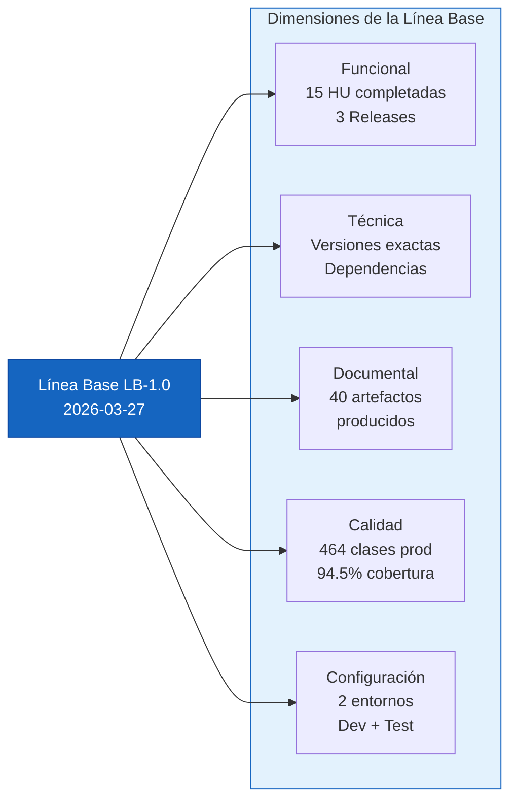

**Criterios de cierre de esta línea base:**

- [x] Las 15 historias de usuario documentadas están implementadas y en estado `Completado`
- [x] Las dependencias de todos los componentes están fijadas con versión exacta en los archivos de construcción
- [x] El pipeline de pruebas unitarias ejecuta sin fallos de compilación
- [x] Los artefactos de documentación 1–40 han sido producidos
- [x] La cobertura de código cumple umbrales de calidad (backend 94.54 %, frontend 98.30 %)

---

## 3. Información General del Proyecto

### 3.1 Ficha del Producto

| Campo                         | Valor                                                          |
|-------------------------------|----------------------------------------------------------------|
| **Nombre del Sistema**        | SIBE — Sistema de Información de Bienestar y Evangelización       |
| **Tipo**                      | Aplicativo web (SPA + REST API)                                |
| **Cliente / Propietario**     | Dirección de Bienestar y Evangelización — UCO                  |
| **Institución**               | Universidad Católica de Oriente (UCO)                          |
| **Problema que resuelve**     | Digitalizar la gestión de asistencia a actividades, eliminando planillas físicas y herramientas genéricas (Google Forms, CheckPoint, AccuClass) |
| **Diferenciador clave**       | Registro de asistencia por número de documento + lector RFID con carnet universitario |
| **Build Tool Backend**        | Gradle 8.13 (wrapper)                                          |
| **Build Tool Frontend**       | Angular CLI 16.2.13 / npm                                      |
| **Release en curso**          | 3 de 3 completados                                             |
| **Declaración de Visión**     | Artefacto 1 — `docs/artifacts/1.vision.md`                     |

### 3.2 Diagrama de Contexto del Producto

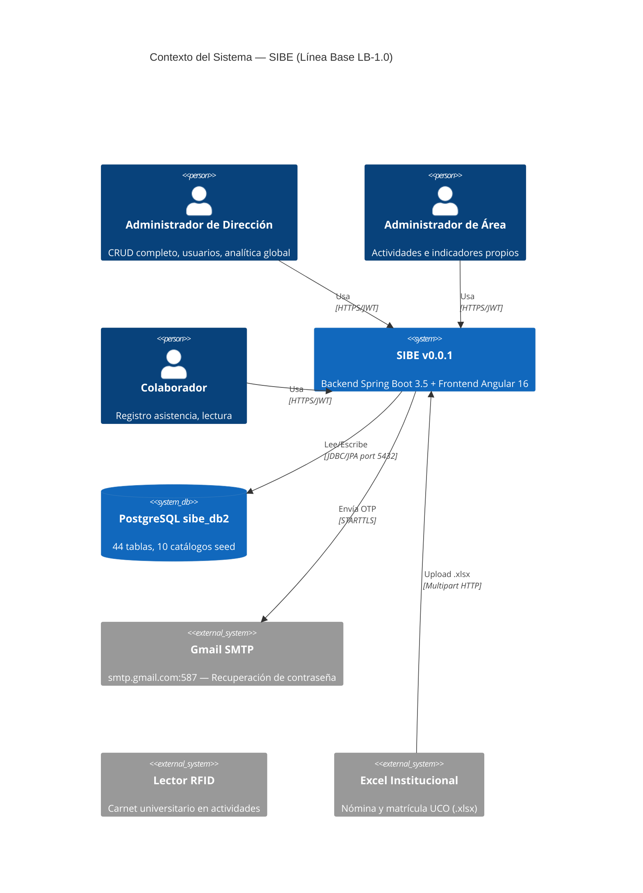

---

## 4. Inventario de Componentes de Software

### 4.1 Componentes Principales

| ID | Componente        | Artefacto            | Tecnología        | Versión          | Estado          |
|----|-------------------|----------------------|-------------------|------------------|-----------------|
| C-01 | Backend API     | `SIBEBackend/`       | Java + Spring Boot| 0.0.1-SNAPSHOT   | ✅ Operativo    |
| C-02 | Frontend SPA    | `SIBEFrontend/`      | Angular           | 0.0.0            | ✅ Operativo    |
| C-03 | Base de Datos   | PostgreSQL `sibe_db2`| PostgreSQL        | 15+ (producción) | ✅ Operativo    |
| C-04 | BD de Tests     | H2 In-Memory         | H2                | runtime (BOM)    | ✅ Solo tests   |
| C-05 | Correo SMTP     | Gmail External       | Gmail STARTTLS    | Servicio ext.    | ✅ Externo      |
| C-06 | Contenedor Web  | Tomcat Embebido      | Apache Tomcat     | BOM Spring Boot  | ✅ Embebido     |

### 4.2 Estructura del Repositorio (Monorepo)

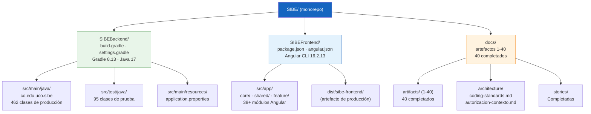

### 4.3 Versiones de Herramientas de Construcción

| Herramienta         | Versión     | Archivo de Origen                                    |
|---------------------|-------------|------------------------------------------------------|
| Java                | 17 (LTS)    | `build.gradle` → `toolchain.languageVersion = 17`    |
| Gradle              | 8.13        | `gradle-wrapper.properties` → `gradle-8.13-bin.zip`  |
| Spring Boot Plugin  | 3.5.0       | `build.gradle` → `org.springframework.boot 3.5.0`    |
| Dependency Mgmt.    | 1.1.7       | `build.gradle` → `io.spring.dependency-management`   |
| Node.js (runtime)   | >= 16 LTS   | Angular CLI requirement                               |
| Angular CLI         | 16.2.13     | `package.json` devDependencies                       |
| TypeScript          | ~5.1.3      | `package.json` devDependencies                       |
| Karma               | ~6.4.0      | `package.json` devDependencies (test runner)         |
| Jasmine             | ~4.6.0      | `package.json` devDependencies (test framework)      |

---

## 5. Inventario de Dependencias Backend

### 5.1 Dependencias de Producción

| Artefacto Maven                                   | Versión         | Propósito                                            |
|---------------------------------------------------|-----------------|------------------------------------------------------|
| `spring-boot-starter-web`                         | 3.5.0 (BOM)     | Servidor web Tomcat embebido + MVC REST              |
| `spring-boot-starter-data-jpa`                    | 3.5.0 (BOM)     | Hibernate ORM + Spring Data (JpaRepository)          |
| `spring-boot-starter-security`                    | 3.5.0 (BOM)     | Autenticación Basic Auth + JWT + autorización         |
| `spring-boot-starter-mail`                        | 3.5.0 (BOM)     | JavaMailSender → SMTP Gmail (recuperación contraseña)|
| `io.jsonwebtoken:jjwt-api`                        | **0.11.2**      | API JWT (generación/validación de tokens)            |
| `io.jsonwebtoken:jjwt-impl`                       | **0.11.2**      | Implementación JJWT                                  |
| `io.jsonwebtoken:jjwt-jackson`                    | **0.11.2**      | Serialización JSON para JWT vía Jackson              |
| `org.apache.poi:poi-ooxml`                        | **5.4.0**       | Lectura de archivos Excel (.xlsx) — carga masiva     |
| `org.projectlombok:lombok`                        | BOM             | Generación de código: @Getter, @Setter, @Builder     |
| `org.postgresql:postgresql`                       | BOM (runtime)   | Driver JDBC PostgreSQL                               |

### 5.2 Dependencias de Prueba

| Artefacto Maven                                   | Versión         | Propósito                                            |
|---------------------------------------------------|-----------------|------------------------------------------------------|
| `spring-boot-starter-test`                        | 3.5.0 (BOM)     | JUnit 5, Mockito, AssertJ, Spring Test               |
| `spring-security-test`                            | BOM             | Utilidades de prueba para Spring Security            |
| `com.h2database:h2`                               | BOM (runtime)   | Base de datos en memoria para pruebas                |
| `junit-platform-launcher`                         | BOM (runtime)   | Lanzador de JUnit 5                                  |
| `jacoco` (Gradle plugin)                          | Gradle default  | Reporte de cobertura de código                       |

### 5.3 Árbol de Dependencias Funcionales

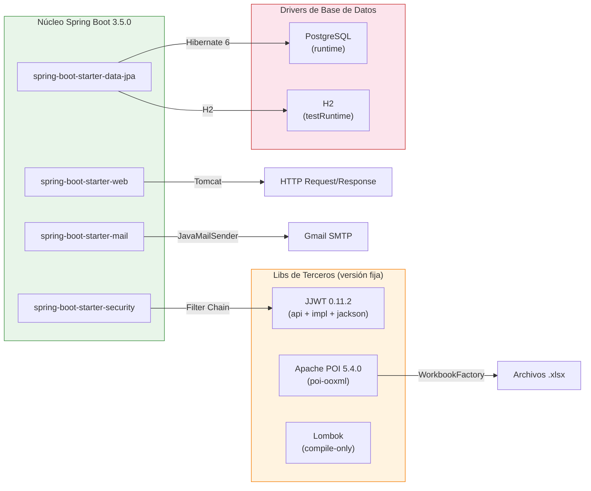

---

## 6. Inventario de Dependencias Frontend

### 6.1 Dependencias de Producción (npm)

| Paquete npm                        | Versión          | Propósito                                            |
|------------------------------------|------------------|------------------------------------------------------|
| `@angular/common`                  | ^16.2.0          | Directivas comunes, pipes, HTTP client               |
| `@angular/compiler`                | ^16.2.0          | Compilador de plantillas Angular                     |
| `@angular/core`                    | ^16.2.0          | Núcleo del framework (DI, decoradores, lifecycle)    |
| `@angular/forms`                   | ^16.2.0          | Forms reactivos y template-driven                    |
| `@angular/platform-browser`        | ^16.2.0          | Adaptador DOM del browser                            |
| `@angular/platform-browser-dynamic`| ^16.2.0         | Compilación JIT en el browser                        |
| `@angular/router`                  | ^16.2.0          | Routing SPA + lazy loading por módulo                |
| `bootstrap`                        | ^5.3.6           | Framework CSS + componentes UI                       |
| `bootstrap-icons`                  | ^1.13.1          | Iconografía SVG de Bootstrap                         |
| `chart.js`                         | ^4.5.0           | Gráficos y visualizaciones del dashboard             |
| `chartjs-plugin-datalabels`        | ^2.2.0           | Etiquetas de datos sobre gráficos Chart.js           |
| `jwt-decode`                       | ^4.0.0           | Decodificación de JWT en el cliente (sin verificación)|
| `ngx-cookie-service`               | ^16.1.0          | Gestión de cookies en Angular                        |
| `rxjs`                             | ~7.8.0           | Programación reactiva (Observables, BehaviorSubject)  |
| `swiper`                           | ^11.2.10         | Carrusel/slider de componentes UI                    |
| `tslib`                            | ^2.8.1           | Helpers TypeScript en tiempo de ejecución            |
| `xlsx`                             | ^0.18.5          | SheetJS — Exportación de reportes a Excel (.xlsx)    |
| `zone.js`                          | ~0.13.0          | Detección de cambios Angular                         |

### 6.2 Dependencias de Desarrollo (devDependencies)

| Paquete npm                          | Versión          | Propósito                                      |
|--------------------------------------|------------------|------------------------------------------------|
| `@angular-devkit/build-angular`      | ^16.2.16         | Builder Angular (webpack, esbuild, ng serve)   |
| `@angular/cli`                       | ^16.2.13         | CLI angular (ng build, ng serve, ng test)      |
| `@angular/compiler-cli`              | ^16.2.0          | Compilador AOT                                 |
| `@types/bootstrap`                   | ^5.2.10          | Tipos TypeScript para Bootstrap                |
| `@types/jasmine`                     | ~4.3.0           | Tipos TypeScript para Jasmine                  |
| `@types/xlsx`                        | ^0.0.36          | Tipos TypeScript para SheetJS (xlsx)           |
| `globals`                            | ^16.2.0          | Listado de variables globales para linting     |
| `jasmine-core`                       | ~4.6.0           | Framework de pruebas Jasmine                   |
| `karma`                              | ~6.4.0           | Test runner headless para Angular              |
| `karma-chrome-launcher`              | ~3.2.0           | Lanzador Karma con ChromeHeadless              |
| `karma-coverage`                     | ~2.2.0           | Reporte de cobertura con Karma                 |
| `karma-jasmine`                      | ~5.1.0           | Adaptador Karma ↔ Jasmine                      |
| `karma-jasmine-html-reporter`        | ~2.1.0           | Reporte HTML de resultados de Karma            |
| `typescript`                         | ~5.1.3           | Compilador TypeScript                          |

---

## 7. Ámbito Funcional — Inventario de Funcionalidades

El sistema implementa las siguientes **5 funcionalidades principales (backbone)**, desglosadas en sus operaciones:

### 7.1 Diagrama de Funcionalidades Implementadas

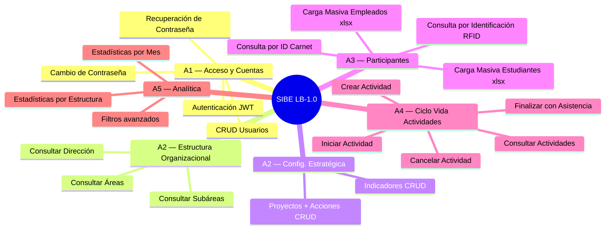

### 7.2 Inventario Detallado de Operaciones Implementadas

| Dominio                  | Operación (Use Case)                              | Tipo     | HU Trazable |
|--------------------------|---------------------------------------------------|----------|-------------|
| Autenticación            | Login / Generar JWT                               | Comando  | HU-001      |
| Usuarios                 | Guardar Usuario                                   | Comando  | HU-002      |
| Usuarios                 | Modificar Usuario                                 | Comando  | HU-002      |
| Usuarios                 | Eliminar Persona (borrado lógico)                 | Comando  | HU-002      |
| Usuarios                 | Modificar Clave (autenticado)                     | Comando  | HU-004      |
| Recuperación Contraseña  | Solicitar Código OTP                              | Comando  | HU-003      |
| Recuperación Contraseña  | Validar Código Recuperación                       | Comando  | HU-003      |
| Recuperación Contraseña  | Recuperar Clave                                   | Comando  | HU-003      |
| Organización             | Guardar Dirección                                 | Comando  | HU-005      |
| Organización             | Guardar Área                                      | Comando  | HU-005      |
| Organización             | Guardar Subárea                                   | Comando  | HU-005      |
| Indicadores              | Guardar Indicador                                 | Comando  | HU-007      |
| Indicadores              | Modificar Indicador                               | Comando  | HU-007      |
| Proyectos                | Guardar Proyecto                                  | Comando  | HU-006      |
| Proyectos                | Modificar Proyecto                                | Comando  | HU-006      |
| Acciones                 | Guardar Acción                                    | Comando  | HU-006      |
| Acciones                 | Modificar Acción                                  | Comando  | HU-006      |
| Participantes            | Cargar Masivamente Estudiantes (.xlsx)            | Comando  | HU-008      |
| Participantes            | Cargar Masivamente Empleados (.xlsx)              | Comando  | HU-009      |
| Actividades              | Guardar Actividad                                 | Comando  | HU-010      |
| Actividades              | Modificar Actividad                               | Comando  | HU-011      |
| Actividades              | Iniciar Actividad                                 | Comando  | HU-012      |
| Actividades              | Finalizar Actividad (con asistencia)              | Comando  | HU-013      |
| Actividades              | Cancelar Actividad                                | Comando  | HU-013      |
| Catálogos (Seed)         | Guardar EstadoActividad, TipoUsuario, TipoIdent., | Comando  | (interno)   |
|                          | TipoIndicador, PublicoInteres, Temporalidad       |          |             |
| Consultas — Organización | Consultar Dirección, Dirección Detallada          | Consulta | HU-005      |
| Consultas — Organización | Consultar Área, Área Detallada, por Nombre        | Consulta | HU-005      |
| Consultas — Organización | Consultar Subárea, Subárea Detallada, por Nombre  | Consulta | HU-005      |
| Consultas — Usuarios     | Consultar Usuarios, por Correo, por Identificador | Consulta | HU-002      |
| Consultas — Miembros     | Consultar Miembro por Identificación / Carnet     | Consulta | HU-012      |
| Consultas — Actividades  | Consultar por Área, Dirección, Subárea            | Consulta | HU-010-011  |
| Consultas — Ejecuciones  | Consultar Ejecuciones por Actividad               | Consulta | HU-012-013  |
| Consultas — Participantes| Consultar Participantes por Ejecución             | Consulta | HU-013      |
| Consultas — Analítica    | Estadísticas por Estructura Organizacional        | Consulta | HU-015      |
| Consultas — Analítica    | Estadísticas por Mes                              | Consulta | HU-015      |
| Consultas — Analítica    | Filtros: años, meses, indicadores, semestres      | Consulta | HU-014-015  |
| Consultas — Analítica    | Filtros: programas, niveles, tipos participante   | Consulta | HU-015      |
| Consultas — Catálogos    | Indicadores, Proyectos, Acciones, Temporalidades  | Consulta | HU-007      |
| Consultas — Catálogos    | TiposUsuario, TiposIdentificación, TiposIndicador | Consulta | HU-002      |
| Consultas — Catálogos    | Públicos de Interés                               | Consulta | HU-007      |

---

## 8. Inventario de Controladores REST

El proyecto contiene **22 controladores REST** organizados desde el patrón CQRS (Comando/Consulta separados):

### 8.1 Tabla de Controladores

| Controlador                             | Tipo     | Contexto API                     | Operaciones Clave                           |
|-----------------------------------------|----------|----------------------------------|---------------------------------------------|
| `LoginControlador`                      | Comando  | `GET /api/login`                 | Autenticación Basic Auth → JWT              |
| `UsuarioComandoControlador`             | Comando  | `/api/usuarios`                  | POST crear, PUT modificar, PUT clave        |
| `UsuarioConsultarControlador`           | Consulta | `/api/usuarios`                  | GET todos, por correo, por ID               |
| `AccionComandoControlador`              | Comando  | `/api/acciones`                  | POST crear, PUT modificar                   |
| `AccionConsultaControlador`             | Consulta | `/api/acciones`                  | GET todas las acciones                      |
| `ActividadComandoControlador`           | Comando  | `/api/actividades`               | POST crear, PUT modificar, iniciar, finalizar, cancelar |
| `ActividadConsultaControlador`          | Consulta | `/api/actividades`               | GET por área/dirección/subárea + ejecuciones + estadísticas |
| `AreaConsultaControlador`               | Consulta | `/api/areas`                     | GET todas, detallada, por nombre            |
| `CargaMasivaControlador`               | Comando  | `/api/carga_masiva`              | POST multipart empleados, POST multipart estudiantes |
| `DireccionConsultaControlador`          | Consulta | `/api/direcciones`               | GET todas, detallada, por nombre            |
| `IndicadorComandoControlador`          | Comando  | `/api/indicadores`               | POST crear, PUT modificar                   |
| `IndicadorConsultaControlador`          | Consulta | `/api/indicadores`               | GET todos, para actividades, filtros        |
| `MiembroConsultaControlador`           | Consulta | `/api/miembros`                  | GET por identificación, GET por carnet      |
| `OrganizacionConsultaControlador`      | Consulta | `/api/organizacion`              | GET estructura de la organización           |
| `ProyectoComandoControlador`           | Comando  | `/api/proyectos`                 | POST crear, PUT modificar                   |
| `ProyectoConsultaControlador`          | Consulta | `/api/proyectos`                 | GET todos los proyectos                     |
| `PublicoInteresConsultaControlador`    | Consulta | `/api/publicos_interes`          | GET todos los públicos de interés           |
| `SubareaConsultaControlador`           | Consulta | `/api/subareas`                  | GET todas, detallada, por nombre            |
| `TemporalidadConsultaControlador`      | Consulta | `/api/temporalidades`            | GET todas las temporalidades                |
| `TipoIdentificacionConsultaControlador`| Consulta | `/api/tipos_identificacion`      | GET todos, GET por sigla                    |
| `TipoIndicadorConsultaControlador`     | Consulta | `/api/tipos_indicador`           | GET todos los tipos de indicador            |
| `TipoUsuarioConsultaControlador`       | Consulta | `/api/tipos_usuario`             | GET todos, GET por código                   |

### 8.2 Distribución por Tipo

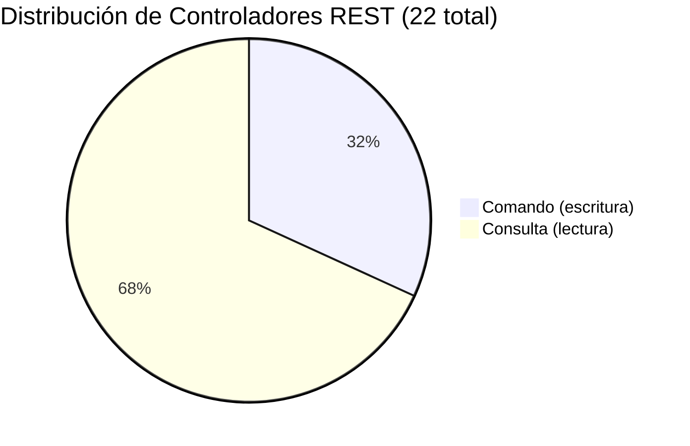

---

## 9. Estado del Backlog — Historias de Usuario

### 9.1 Resumen

| Total | Completadas | En progreso | Pendientes |
|-------|:-----------:|:-----------:|:----------:|
| 15    | **15**      | 0           | 0          |

### 9.2 Estado por Historia

| ID     | Historia                                           | Funcionalidad                  | Release | Estado       |
|--------|----------------------------------------------------|--------------------------------|---------|--------------|
| HU-001 | Autenticación de Usuarios y Cierre de Sesión       | Acceso y Cuentas               | R1      | ✅ Completado |
| HU-002 | CRUD Cuentas de Usuario                            | Acceso y Cuentas               | R1      | ✅ Completado |
| HU-003 | Recuperación de Contraseña (flujo OTP)             | Acceso y Cuentas               | R2      | ✅ Completado |
| HU-004 | Cambio de Contraseña (usuario autenticado)         | Acceso y Cuentas               | R3      | ✅ Completado |
| HU-005 | Consultar Estructura Organizacional                | Config. Estratégica y Org.     | R1      | ✅ Completado |
| HU-006 | Gestión de Proyectos y Acciones                    | Config. Estratégica y Org.     | R2      | ✅ Completado |
| HU-007 | Gestión de Indicadores                             | Config. Estratégica y Org.     | R3      | ✅ Completado |
| HU-008 | Carga Masiva de Estudiantes (.xlsx)                | Administración Participantes   | R1      | ✅ Completado |
| HU-009 | Carga Masiva de Empleados (.xlsx)                  | Administración Participantes   | R2      | ✅ Completado |
| HU-010 | Crear y Programar Actividades                      | Ciclo Vida Actividades         | R1      | ✅ Completado |
| HU-011 | Consultar y Modificar Actividades                  | Ciclo Vida Actividades         | R2      | ✅ Completado |
| HU-012 | Iniciar Actividad y Registrar Asistencia (RFID)    | Ciclo Vida Actividades         | R1      | ✅ Completado |
| HU-013 | Finalizar/Cancelar Actividad                       | Ciclo Vida Actividades         | R2      | ✅ Completado |
| HU-014 | Exportar Reporte a Excel                           | Analítica y Explotación        | R2      | ✅ Completado |
| HU-015 | Dashboard de Métricas y Estadísticas               | Analítica y Explotación        | R1      | ✅ Completado |

### 9.3 Historia Adicional en Progreso

| ID  | Historia                        | Estado         | Ubicación                                                 |
|-----|--------------------------------|----------------|-----------------------------------------------------------|
| HU-016 (tentativa) | Paginación de Tablas | ✅ Completada | `docs/stories/1.paginacion-tablas-aplicacion.story.md` |

---

## 10. Plan de Releases y Estado de Implementación

### 10.1 Estado Global de Releases

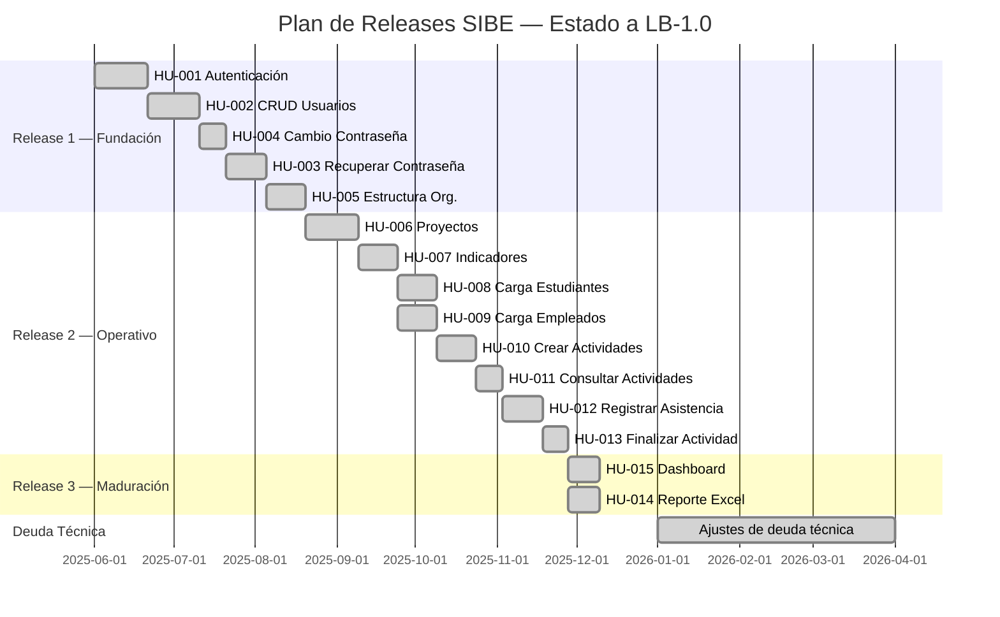

### 10.2 Métricas por Release

| Indicador                | R1 — Fundación | R2 — Operativo | R3 — Maduración | **Total** |
|--------------------------|:--------------:|:--------------:|:---------------:|:---------:|
| Historias de Usuario     | 5              | 8              | 2               | **15**    |
| Estado                   | ✅ Completo    | ✅ Completo    | ✅ Completo     | 100 %     |
| Comandos de escritura    | 8              | 14             | 3               | **25**    |
| Escenarios de aceptación | 29             | 23             | 9               | **61**    |
| Backbone cubierto        | 5/5            | 5/5            | 2/5             | **5/5**   |

### 10.3 Walking Skeleton (Release 1 — Flujo Completo)

---

## 11. Métricas Técnicas del Código Fuente

### 11.1 Backend (Java)

| Métrica                                | Valor    | Fuente                                      |
|----------------------------------------|----------|---------------------------------------------|
| Clases de producción (Jacoco total)    | **464**  | `build/jacocoHtml/index.html` — total clases|
| Entidades JPA (`@Entity`)              | 44       | Artefacto 29 — Modelo de Fuente             |
| Interfaces DAO (`JpaRepository`)       | 44       | Artefacto 29 — Modelo de Fuente             |
| Use Cases de Comando                   | 31       | Paquete `dominio.usecase.comando`                    |
| Use Cases de Consulta                  | 58       | Paquete `dominio.usecase.consulta`                   |
| Manejadores de Comando                 | 30       | Clases test de manejadores-comando          |
| Manejadores de Consulta                | 58       | Paquete `aplicacion.consulta`                        |
| Controladores REST                     | 22       | Inventory `*Controlador.java`               |
| DTOs de Dominio                        | 31       | Artefacto 29 — Modelo de Fuente             |
| Modelos de Dominio (POJOs)             | 32       | Artefacto 24 — Diagrama de Clases           |
| DataLoaders (seed data)                | 11       | @Order(1-11)                                |
| Enums de dominio                       | 4        | TipoArea, TipoInterno, TipoParticipante, TipoPrograma |
| Paquetes raíz                          | 3        | dominio / aplicacion / infraestructura      |
| Sub-paquetes totales                   | ~40      | Artefacto 27 — Diagrama de Paquetes         |
| Total métodos (Jacoco)                 | **1,667**| `build/jacocoHtml/index.html`               |
| Total líneas de código medidas         | **5,260**| `build/jacocoHtml/index.html`               |
| Complejidad ciclomática total (Jacoco) | **2,295**| `build/jacocoHtml/index.html`               |

### 11.2 Frontend (Angular/TypeScript)

| Métrica                             | Valor  | Fuente                              |
|-------------------------------------|--------|-------------------------------------|
| Feature modules (lazy-loaded)       | 6      | login, home, manage-users, manage-department, manage-indicators, password-recovery |
| Interfaces / modelos TypeScript     | ~35    | Artefacto 29 — Modelo de Fuente     |
| Servicios HTTP Angular              | 19     | Artefacto 29 — Modelo de Fuente     |
| Guards de ruta                      | 2      | securityGuard, publicRouteGuard     |
| Interceptores HTTP                  | 2      | AuthInterceptor, TokenInterceptor   |
| Prefijo de componentes              | `app-` | `angular.json` → prefix: "app"      |
| Directorio de salida (build prod.)  | `dist/sibe-frontend` | `angular.json` outputPath |
| Proxy de desarrollo                 | `proxy.conf.json` → `/api → :8080` | `package.json` start script |

### 11.3 Base de Datos

| Métrica                       | Valor | Fuente               |
|-------------------------------|-------|----------------------|
| Tablas entidad                | 44    | Artefacto 29         |
| Join tables N:M               | 3     | Artefacto 29         |
| Tablas puente 1:1/N:1         | 11    | Artefacto 29         |
| Jerarquías de herencia JOINED | 2     | Artefacto 29         |
| Registros seed iniciales      | ~43   | 10 DataLoaders       |
| Catálogos estáticos (seed)    | 6     | TipoUsuario, TipoIdentificacion, Temporalidad, EstadoActividad, PublicoInteres, TipoIndicador |
| Catálogos dinámicos (Excel)   | 3     | CentroCostos, RelacionLaboral, CiudadResidencia |

---

## 12. Inventario de Pruebas Unitarias

El proyecto backend cuenta con **372 clases de prueba** que cubren todas las capas de la arquitectura hexagonal. Las tres categorías principales documentadas en la línea base original son:

### 12.1 Pruebas de Fábricas (22 clases)

Testean el patrón de construcción de modelos de dominio (`Modelo.construir()`):

| Clase de Prueba                     | Modelo Testeado         |
|-------------------------------------|-------------------------|
| `AccionFabricaTest`                 | `Accion`                |
| `ActividadFabricaTest`              | `Actividad`             |
| `AreaFabricaTest`                   | `Area`                  |
| `CentroCostosFabricaTest`           | `CentroCostos`          |
| `CiudadResidenciaFabricaTest`       | `CiudadResidencia`      |
| `DireccionFabricaTest`              | `Direccion`             |
| `EmpleadoFabricaTest`               | `Empleado`              |
| `EstadoActividadFabricaTest`        | `EstadoActividad`       |
| `EstudianteFabricaTest`             | `Estudiante`            |
| `IdentificacionFabricaTest`         | `Identificacion`        |
| `IndicadorFabricaTest`              | `Indicador`             |
| `ParticipanteFabricaTest`           | `Participante`          |
| `PersonaFabricaTest`                | `Persona`               |
| `ProyectoFabricaTest`               | `Proyecto`              |
| `PublicoInteresFabricaTest`         | `PublicoInteres`        |
| `RelacionLaboralFabricaTest`        | `RelacionLaboral`       |
| `SubareaFabricaTest`                | `Subarea`               |
| `TemporalidadFabricaTest`           | `Temporalidad`          |
| `TipoIdentificacionFabricaTest`     | `TipoIdentificacion`    |
| `TipoIndicadorFabricaTest`          | `TipoIndicador`         |
| `TipoUsuarioFabricaTest`            | `TipoUsuario`           |
| `UsuarioFabricaTest`                | `Usuario`               |

### 12.2 Pruebas de Manejadores de Comando (30 clases)

Testean la orquestación de cada operación de escritura:

| Clase de Prueba                                        | Manejador Testeado                               |
|--------------------------------------------------------|--------------------------------------------------|
| `CancelarActividadManejadorTest`                       | CancelarActividadManejador                       |
| `CargarMasivamenteEmpleadosManejadorTest`              | CargarMasivamenteEmpleadosManejador              |
| `CargarMasivamenteEstudiantesManejadorTest`            | CargarMasivamenteEstudiantesManejador            |
| `EliminarPersonaManejadorTest`                         | EliminarPersonaManejador                         |
| `FinalizarActividadManejadorTest`                      | FinalizarActividadManejador                      |
| `GuardarAccionManejadorTest`                           | GuardarAccionManejador                           |
| `GuardarActividadManejadorTest`                        | GuardarActividadManejador                        |
| `GuardarAreaManejadorTest`                             | GuardarAreaManejador                             |
| `GuardarDireccionManejadorTest`                        | GuardarDireccionManejador                        |
| `GuardarEstadoActividadManejadorTest`                  | GuardarEstadoActividadManejador                  |
| `GuardarIndicadorManejadorTest`                        | GuardarIndicadorManejador                        |
| `GuardarProyectoManejadorTest`                         | GuardarProyectoManejador                         |
| `GuardarPublicoInteresManejadorTest`                   | GuardarPublicoInteresManejador                   |
| `GuardarSubareaManejadorTest`                          | GuardarSubareaManejador                          |
| `GuardarTemporalidadManejadorTest`                     | GuardarTemporalidadManejador                     |
| `GuardarTipoIdentificacionManejadorTest`               | GuardarTipoIdentificacionManejador               |
| `GuardarTipoIndicadorManejadorTest`                    | GuardarTipoIndicadorManejador                    |
| `GuardarTipoUsuarioManejadorTest`                      | GuardarTipoUsuarioManejador                      |
| `GuardarUsuarioManejadorTest`                          | GuardarUsuarioManejador                          |
| `IniciarActividadManejadorTest`                        | IniciarActividadManejador                        |
| `LoginManejadorTest`                                   | LoginManejador                                   |
| `ModificarAccionManejadorTest`                         | ModificarAccionManejador                         |
| `ModificarActividadManejadorTest`                      | ModificarActividadManejador                      |
| `ModificarClaveManejadorTest`                          | ModificarClaveManejador                          |
| `ModificarIndicadorManejadorTest`                      | ModificarIndicadorManejador                      |
| `ModificarProyectoManejadorTest`                       | ModificarProyectoManejador                       |
| `ModificarUsuarioManejadorTest`                        | ModificarUsuarioManejador                        |
| `RecuperarClaveManejadorTest`                          | RecuperarClaveManejador                          |
| `SolicitarCodigoManejadorTest`                         | SolicitarCodigoManejador                         |
| `ValidarCodigoRecuperacionClaveManejadorTest`          | ValidarCodigoRecuperacionClaveManejador          |

### 12.3 Pruebas de Manejadores de Consulta (43 clases)

Testean la orquestación de cada operación de lectura:

| Clase de Prueba                                                              | Manejador Testeado                                          |
|------------------------------------------------------------------------------|-------------------------------------------------------------|
| `ConsultarAccionesManejadorTest`                                             | ConsultarAccionesManejador                                  |
| `ConsultarActividadesPorAreaManejadorTest`                                   | ConsultarActividadesPorAreaManejador                        |
| `ConsultarActividadesPorDireccionManejadorTest`                              | ConsultarActividadesPorDireccionManejador                   |
| `ConsultarActividadesPorSubareaManejadorTest`                                | ConsultarActividadesPorSubareaManejador                     |
| `ConsultarAnnosEjecucionesFinalizadasManejadorTest`                          | ConsultarAnnosEjecucionesFinalizadasManejador               |
| `ConsultarAreaDetalladaManejadorTest`                                        | ConsultarAreaDetalladaManejador                             |
| `ConsultarAreaManejadorTest`                                                 | ConsultarAreaManejador                                      |
| `ConsultarAreaPorNombreDTOManejadorTest`                                     | ConsultarAreaPorNombreDTOManejador                          |
| `ConsultarAreasManejadorTest`                                                | ConsultarAreasManejador                                     |
| `ConsultarCentrosCostosEmpleadosEnEjecucionesFinalizadasManejadorTest`       | ConsultarCentrosCostosEmpleadosEnEjecucionesFinalizadasManejador |
| `ConsultarDireccionDetalladaManejadorTest`                                   | ConsultarDireccionDetalladaManejador                        |
| `ConsultarDireccionesManejadorTest`                                          | ConsultarDireccionesManejador                               |
| `ConsultarDireccionPorNombreDTOManejadorTest`                                | ConsultarDireccionPorNombreDTOManejador                     |
| `ConsultarDireccionPorNombreManejadorTest`                                   | ConsultarDireccionPorNombreManejador                        |
| `ConsultarEjecucionesPorActividadManejadorTest`                              | ConsultarEjecucionesPorActividadManejador                   |
| `ConsultarEstadisticasParticipantesPorEstructuraManejadorTest`               | ConsultarEstadisticasParticipantesPorEstructuraManejador    |
| `ConsultarEstadisticasParticipantesPorMesManejadorTest`                      | ConsultarEstadisticasParticipantesPorMesManejador           |
| `ConsultarIndicadoresEnEjecucionesFinalizadasManejadorTest`                  | ConsultarIndicadoresEnEjecucionesFinalizadasManejador       |
| `ConsultarIndicadoresManejadorTest`                                          | ConsultarIndicadoresManejador                               |
| `ConsultarIndicadoresParaActividadesManejadorTest`                           | ConsultarIndicadoresParaActividadesManejador                |
| `ConsultarMesesEjecucionesFinalizadasManejadorTest`                          | ConsultarMesesEjecucionesFinalizadasManejador               |
| `ConsultarMiembroPorIdCarnetManejadorTest`                                   | ConsultarMiembroPorIdCarnetManejador                        |
| `ConsultarMiembroPorIdentificacionManejadorTest`                             | ConsultarMiembroPorIdentificacionManejador                  |
| `ConsultarNivelesFormacionEstudiantesEnEjecucionesFinalizadasManejadorTest`  | ConsultarNivelesFormacionEstudiantesEjecuciones             |
| `ConsultarParticipantesPorEjecucionActividadManejadorTest`                   | ConsultarParticipantesPorEjecucionActividadManejador        |
| `ConsultarProgramasAcademicosEstudiantesEnEjecucionesFinalizadasManejadorTest`| ConsultarProgramasAcademicosEstudiantesManejador           |
| `ConsultarProyectosManejadorTest`                                            | ConsultarProyectosManejador                                 |
| `ConsultarPublicosInteresManejadorTest`                                      | ConsultarPublicosInteresManejador                           |
| `ConsultarSemestresActividadesEnEjecucionesFinalizadasManejadorTest`         | ConsultarSemestresActividadesEjecucionesManejador           |
| `ConsultarSubareaDetalladaManejadorTest`                                     | ConsultarSubareaDetalladaManejador                          |
| `ConsultarSubareaPorNombreDTOManejadorTest`                                  | ConsultarSubareaPorNombreDTOManejador                       |
| `ConsultarSubareasDTOManejadorTest`                                          | ConsultarSubareasDTOManejador                               |
| `ConsultarSubareasManejadorTest`                                             | ConsultarSubareasManejador                                  |
| `ConsultarTemporalidadesManejadorTest`                                       | ConsultarTemporalidadesManejador                            |
| `ConsultarTipoIdentificacionPorSiglaManejadorTest`                           | ConsultarTipoIdentificacionPorSiglaManejador                |
| `ConsultarTiposIdentificacionManejadorTest`                                  | ConsultarTiposIdentificacionManejador                       |
| `ConsultarTiposIndicadorManejadorTest`                                       | ConsultarTiposIndicadorManejador                            |
| `ConsultarTiposParticipantesEnEjecucionesFinalizadasManejadorTest`           | ConsultarTiposParticipantesEjecucionesManejador             |
| `ConsultarTiposUsuarioManejadorTest`                                         | ConsultarTiposUsuarioManejador                              |
| `ConsultarTipoUsuarioPorCodigoManejadorTest`                                 | ConsultarTipoUsuarioPorCodigoManejador                      |
| `ConsultarUsuarioPorCorreoManejadorTest`                                     | ConsultarUsuarioPorCorreoManejador                          |
| `ConsultarUsuarioPorIdentificadorManejadorTest`                              | ConsultarUsuarioPorIdentificadorManejador                   |
| `ConsultarUsuariosManejadorTest`                                             | ConsultarUsuariosManejador                                  |

### 12.4 Resumen del Suite de Pruebas

Además de las 95 clases listadas arriba (Fábricas + Manejadores Comando + Manejadores Consulta), el suite completo incluye **277 clases de prueba adicionales** que cubren las demás capas:

| Categoría | Cantidad | Capa |
|-----------|:--------:|------|
| FabricaTest (constructores de dominio) | 22 | Dominio |
| ComandoManejadorTest (escritura) | 30 | Aplicación |
| ConsultaManejadorTest (lectura) | 43 | Aplicación |
| UseCaseTest (casos de uso) | 70 | Dominio |
| ReglaTest (reglas de negocio) | 51 | Dominio |
| MapeadorTest (mapeadores entidad↔dominio) | 31 | Infraestructura |
| RepositorioConsultaImplementacionTest | 28 | Infraestructura |
| RepositorioComandoImplementacionTest | 18 | Infraestructura |
| ControladorTest (controladores REST) | 22 | Infraestructura |
| ModelTest (modelos de dominio) | 16 | Dominio |
| HayDatosManejadorTest | 10 | Aplicación |
| ServiceTest (servicios infra) | 9 | Infraestructura |
| DataLoaderTest (carga de datos) | 8 | Infraestructura |
| AdapterServiceTest | 6 | Infraestructura |
| ContarManejadorTest | 5 | Aplicación |
| SecurityFilterTest | 6 | Infraestructura |
| UtilityTest | 4 | Infraestructura |
| BeanTest (configuración Spring) | 3 | Infraestructura |
| ValidadorCargaMasivaTest | 2 | Dominio |
| ApplicationTest | 2 | Infraestructura |
| **Total** | **372** | |

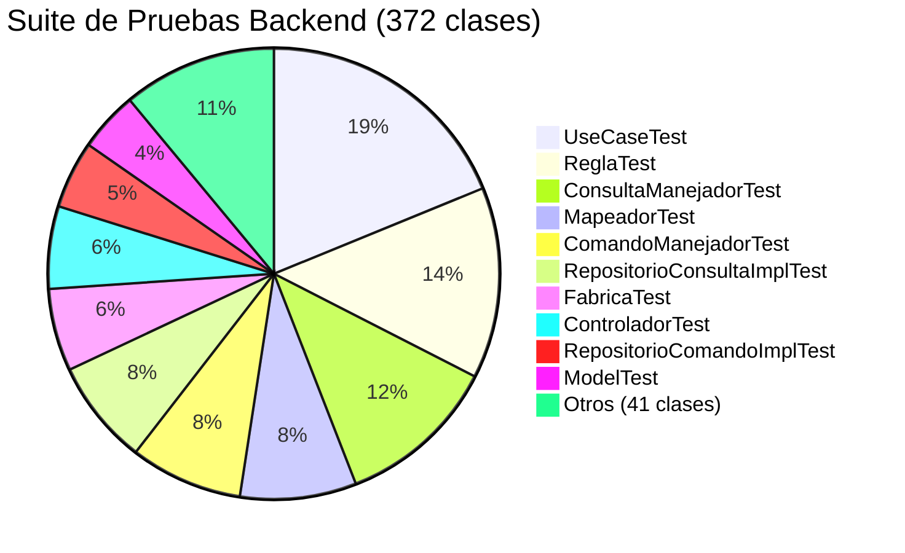

---

## 13. Métricas de Cobertura de Código (Jacoco)

Los datos de cobertura se obtienen del reporte Jacoco generado en `SIBEBackend/build/jacocoHtml/index.html`. Datos actualizados según el Artefacto 35 — Cobertura de Código.

### 13.1 Resumen Global

| Métrica              | Cubierto  | Total   | Perdido  | % Cobertura |
|----------------------|:---------:|:-------:|:--------:|:-----------:|
| **Instrucciones**    | 21,448    | 22,686  | 1,238    | **94.54 %** |
| **Ramas**            | 1,019     | 1,233   | 214      | **82.64 %** |
| **Complejidad (CC)** | 1,972     | 2,295   | 323      | **85.93 %** |
| **Líneas**           | 5,142     | 5,260   | 118      | **97.76 %** |
| **Métodos**          | 1,544     | 1,667   | 123      | **92.62 %** |
| **Clases**           | 463       | 464     | 1        | **99.78 %** |

### 13.2 Cobertura por Capa Arquitectónica

| Capa | Instrucciones Totales | Instrucciones Cubiertas | Cobertura | Estado |
|------|----------------------|------------------------|-----------|--------|
| **Dominio** | 9,943 | 9,310 | **93.6 %** | 🟢 Excelente |
| **Aplicación** | 1,981 | 1,896 | **95.7 %** | 🟢 Excelente |
| **Infraestructura** | 10,754 | 10,237 | **95.2 %** | 🟢 Excelente |
| **Total Proyecto** | **22,686** | **21,448** | **94.54 %** | 🟢 Excelente |

### 13.3 Análisis de Cobertura

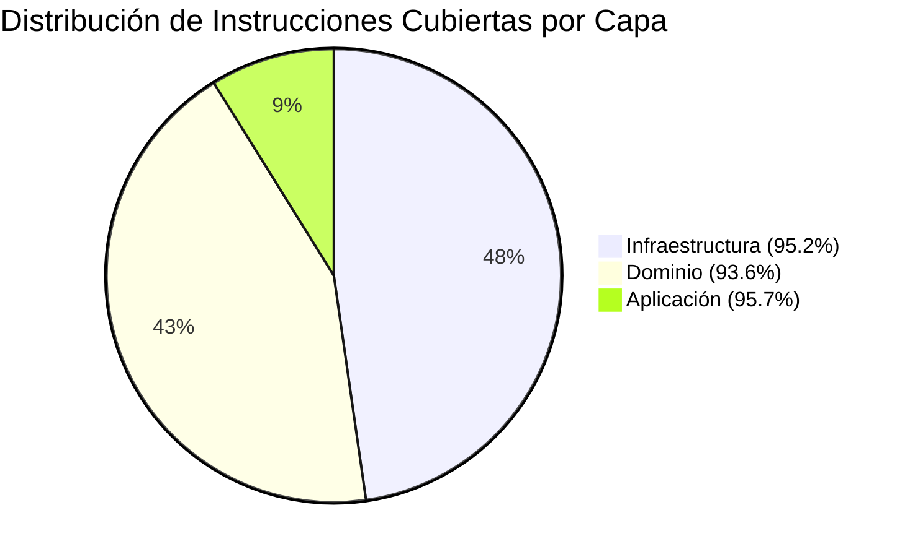

> **Nota:** La cobertura del backend es **excelente** (~94.5 % en instrucciones), superando ampliamente el umbral mínimo aceptable de la industria (80 %). De las 464 clases de producción: **355 clases al 100 %**, 108 con cobertura parcial y 1 sin cobertura. La cobertura del frontend es **98.30 %** en sentencias y **87.86 %** en ramas. Para el detalle completo, consultar el Artefacto 35 — Cobertura de Código.

---

## 14. Inventario de Artefactos de Documentación

### 14.1 Artefactos Producidos (40 / 40)

| ID  | Artefacto                                          | Categoría          | Estado       | Ubicación                                                    |
|-----|----------------------------------------------------|--------------------|--------------|--------------------------------------------------------------|
| 1   | Visión del Producto                                | Producto           | ✅ Completo  | `docs/artifacts/1.vision.md`                                 |
| 2   | Mapa de Impacto                                    | Producto           | ✅ Completo  | `docs/artifacts/2.mapa_de_impacto.md`                        |
| 3   | Project Canvas                                     | Producto           | ✅ Completo  | `docs/artifacts/3.project_canvas.md`                         |
| 4   | Modelo de Procesos del Negocio                     | Negocio            | ✅ Completo  | `docs/artifacts/4.modelo_de_procesos_del_negocio.md`         |
| 5   | Modelo de Dominio Anémico                          | Dominio            | ✅ Completo  | `docs/artifacts/5.modelo_de_dominio_anemico.md`              |
| 6   | Modelo de Dominio Enriquecido                      | Dominio            | ✅ Completo  | `docs/artifacts/6.modelo_de_dominio_enriquecido.md`          |
| 7   | Requisitos de Información                          | Requerimientos     | ✅ Completo  | `docs/artifacts/7.requisitos_de_informacion.md`              |
| 8   | Tarjetas CRC (Colaboraciones y Responsabilidades)  | Diseño             | ✅ Completo  | `docs/artifacts/8.colaboraciones_y_responsabilidades.md`     |
| 9   | Event Storming                                     | Diseño             | ✅ Completo  | `docs/artifacts/9.event_storming.md`                         |
| 10  | Mapa de Historias de Usuario                       | Producto           | ✅ Completo  | `docs/artifacts/10.mapa_de_historias_de_usuario.md`          |
| 11  | Matriz de Roles por Operaciones                    | Seguridad          | ✅ Completo  | `docs/artifacts/11.matriz_de_roles_por_operaciones.md`       |
| 12  | Matriz de Comandos por Impacto                     | Diseño             | ✅ Completo  | `docs/artifacts/12.matriz_de_comandos_por_impacto.md`        |
| 13  | Mapa de Viaje del Cliente                          | UX                 | ✅ Completo  | `docs/artifacts/13.mapa_de_viaje_del_cliente.md`             |
| 14  | Plan de Liberaciones del Producto                  | Planificación      | ✅ Completo  | `docs/artifacts/14.plan_de_liberaciones_del_producto.md`     |
| 15  | Especificación de Requerimientos                   | Requerimientos     | ✅ Completo  | `docs/artifacts/15.requerimientos.md`                        |
| 16  | Historias de Usuario                               | Producto           | ✅ Completo  | `docs/artifacts/16.historias_de_usuario.md`                  |
| 17  | Flujo de Transacciones (Diagramas de Actividad)    | Diseño             | ✅ Completo  | `docs/artifacts/17.flujo_de_transacciones_en_diagramas_de_actividades.md` |
| 18  | Flujo de Estados (Diagramas de Estado)             | Diseño             | ✅ Completo  | `docs/artifacts/18.flujo_de_estados_en_diagramas_de_estado.md` |
| 19  | Drivers Arquitectónicos                            | Arquitectura       | ✅ Completo  | `docs/artifacts/19.drivers_arquitectonicos.md`               |
| 20  | Alternativas de Solución                           | Arquitectura       | ✅ Completo  | `docs/artifacts/20.alternativas_de_solucion.md`              |
| 21  | Arquitectura de Referencia                         | Arquitectura       | ✅ Completo  | `docs/artifacts/21.arquitectura_de_referencia.md`            |
| 22  | Arquetipo de Solución                              | Arquitectura       | ✅ Completo  | `docs/artifacts/22.arquetipo_de_solucion.md`                 |
| 23  | Stack Tecnológico                                  | Arquitectura       | ✅ Completo  | `docs/artifacts/23.stack_tecnologico.md`                     |
| 24  | Diagrama de Clases del Dominio                     | Diseño Técnico     | ✅ Completo  | `docs/artifacts/24.diagrama_de_clases.md`                    |
| 25  | Diagrama de Componentes                            | Diseño Técnico     | ✅ Completo  | `docs/artifacts/25.diagrama_de_componentes.md`               |
| 26  | Diagrama de Paquetes                               | Diseño Técnico     | ✅ Completo  | `docs/artifacts/26.diagrama_de_paquetes.md`                  |
| 27  | Diagrama de Secuencia                              | Diseño Técnico     | ✅ Completo  | `docs/artifacts/27.diagrama_de_secuencia.md`                 |
| 28  | Diagrama de Despliegue                             | Infraestructura    | ✅ Completo  | `docs/artifacts/28.diagrama_de_despliegue.md`                |
| 29  | Modelo de Fuente de Información                    | Datos              | ✅ Completo  | `docs/artifacts/30.modelo_de_fuente_de_informacion.md`       |
| 30  | Línea Base del Producto                            | Gestión Config.    | ✅ Completo  | `docs/artifacts/31.linea_base_del_producto.md`               |
| 31  | Repositorio de Control de Versiones                | Gestión Config.    | ✅ Completo  | `docs/artifacts/32.repositorio_control_versiones.md`         |
| 32  | Pruebas Unitarias                                  | Calidad            | ✅ Completo  | `docs/artifacts/33.pruebas_unitarias.md`                     |
| 33  | Análisis de Calidad y Deuda Técnica                | Calidad            | ✅ Completo  | `docs/artifacts/34.analisis_calidad_deuda_tecnica.md`        |
| 34  | Cobertura de Código                                | Calidad            | ✅ Completo  | `docs/artifacts/35.cobertura_de_codigo.md`                   |
| 35  | Casos de Prueba                                    | Calidad            | ✅ Completo  | `docs/artifacts/36.casos_de_prueba.md`                       |
| 36  | Certificación Funcional                            | Calidad            | ✅ Completo  | `docs/artifacts/37.certificacion_funcional.md`               |
| 37  | Plan de Despliegue y Puesta en Operación           | Transición         | ✅ Completo  | `docs/artifacts/38.plan_de_despliegue.md`                    |
| 38  | Manual de Instalación y Configuración              | Entrega            | ✅ Completo  | `docs/artifacts/39.manual_de_instalacion.md`                 |
| 39  | Manual de Operación del Producto                   | Entrega            | ✅ Completo  | `docs/artifacts/40.manual_de_operacion.md`                   |
| 40  | Documento Técnico Final                            | Entrega            | ✅ Completo  | `docs/artifacts/41.documento_tecnico_final.md`               |

### 14.2 Avance Documental

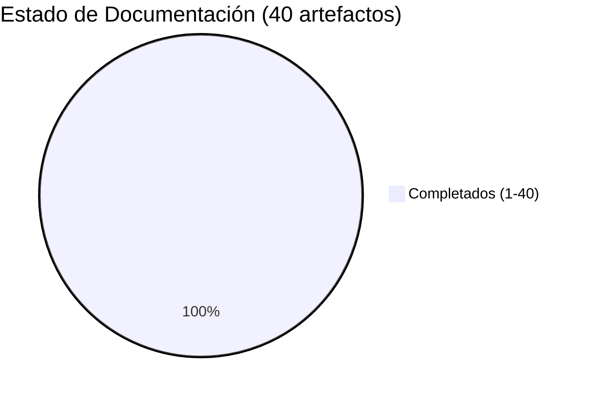

---

## 15. Configuración de Entornos

### 15.1 Entorno de Desarrollo Local

| Parámetro                   | Valor                                          |
|-----------------------------|------------------------------------------------|
| **Runtime backend**         | Java 17 LTS · Spring Boot dev tools            |
| **Servidor backend**        | Tomcat embebido · puerto **8080**              |
| **Context path**            | `/api`                                         |
| **Base de datos**           | PostgreSQL local · puerto **5432** · BD `sibe_db2` |
| **DDL auto**                | `update` (Hibernate crea/actualiza tablas)     |
| **Frontend dev server**     | `ng serve` · puerto **4200**                   |
| **Proxy frontend → backend**| `proxy.conf.json`: `/api → http://localhost:8080` |
| **SMTP**                    | Gmail STARTTLS · smtp.gmail.com:587            |
| **Correo SMTP**             | sibeapplicationuco@gmail.com                   |

### 15.2 Entorno de Pruebas (Test)

| Parámetro            | Valor                                                  |
|----------------------|--------------------------------------------------------|
| **Base de datos**    | H2 In-Memory (configuración automática Spring Boot Test)|
| **Test runner BE**   | JUnit 5 + Mockito (`spring-boot-starter-test`)         |
| **Test runner FE**   | Karma 6.4 + Jasmine 4.6 + ChromeHeadless               |
| **Cobertura BE**     | Jacoco — genera HTML + XML + CSV en `build/jacocoHtml/`|
| **Cobertura FE**     | karma-coverage (Istanbul) — genera en `coverage/`      |

### 15.3 Entorno de Producción (Propuesta)

| Parámetro                   | Valor propuesto                                     |
|-----------------------------|-----------------------------------------------------|
| **Backend**                 | JAR ejecutable (`sibe-0.0.1-SNAPSHOT.jar`)          |
| **Frontend**                | Artefactos estáticos en `dist/sibe-frontend/`       |
| **Servidor HTTP frontend**  | nginx (reverse proxy + static files)                |
| **Base de datos**           | PostgreSQL 15+ · DDL auto `validate` en producción  |
| **HTTPS**                   | TLS configurado en nginx/load balancer              |
| **Credenciales**            | Variables de entorno (NO en `application.properties`)|

### 15.4 Diagrama de Entornos

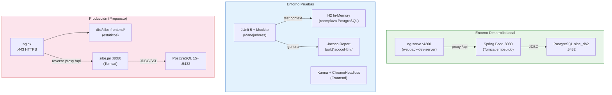

---

## 16. Deuda Técnica y Limitaciones Conocidas

### 16.1 Deuda Técnica Identificada

Toda la deuda técnica previamente identificada ha sido resuelta. No existen ítems de deuda técnica pendientes en esta línea base.

| Área | Resolución aplicada |
|------|---------------------|
| Cobertura de código | Backend 94.54 %, Frontend 98.30 % |
| Credenciales y secretos | Externalizados vía variables de entorno |
| Context-path de servidor | Configurado correctamente como `/api` |
| DDL auto en producción | Externalizado vía `${DDL_AUTO:update}`; en producción pasar `DDL_AUTO=validate` |
| Nombre de la aplicación | Corregido a `${APP_NAME:SIBE}` |
| Mapeos frontend-backend | `horaInicio`/`horaFin`, `tipoProgramaAcademico` y endpoint `/indicadores` corregidos |
| Análisis estático de código | Checkstyle integrado en el pipeline de Gradle (`config/checkstyle/checkstyle.xml`) |

---

## 17. Trazabilidad: Artefacto → Funcionalidad → Test

### 17.1 Matriz de Trazabilidad Principal

| Historia | Artefacto Trazable | Controladores Implementados      | Clases Test Asociadas                   |
|----------|--------------------|----------------------------------|-----------------------------------------|
| HU-001   | Artefacto 16 §1    | `LoginControlador`               | `LoginManejadorTest`                    |
| HU-002   | Artefacto 16 §1    | `UsuarioComandoControlador`, `UsuarioConsultarControlador` | `GuardarUsuarioManejadorTest`, `ModificarUsuarioManejadorTest`, `EliminarPersonaManejadorTest`, `ConsultarUsuariosManejadorTest` |
| HU-003   | Artefacto 16 §1    | `UsuarioComandoControlador`      | `SolicitarCodigoManejadorTest`, `ValidarCodigoRecuperacionClaveManejadorTest`, `RecuperarClaveManejadorTest` |
| HU-004   | Artefacto 16 §1    | `UsuarioComandoControlador`      | `ModificarClaveManejadorTest`           |
| HU-005   | Artefacto 16 §2    | `DireccionConsultaControlador`, `AreaConsultaControlador`, `SubareaConsultaControlador` | Consultar*ManejadorTest (Dir/Area/Sub) |
| HU-006   | Artefacto 16 §2    | `ProyectoComandoControlador`, `AccionComandoControlador` + consultas | Guardar/ModificarProyecto, AccionManejadorTest |
| HU-007   | Artefacto 16 §2    | `IndicadorComandoControlador`, `IndicadorConsultaControlador` | `GuardarIndicadorManejadorTest`, `ModificarIndicadorManejadorTest` |
| HU-008   | Artefacto 16 §3    | `CargaMasivaControlador`         | `CargarMasivamenteEstudiantesManejadorTest` |
| HU-009   | Artefacto 16 §3    | `CargaMasivaControlador`         | `CargarMasivamenteEmpleadosManejadorTest` |
| HU-010   | Artefacto 16 §4    | `ActividadComandoControlador`    | `GuardarActividadManejadorTest`         |
| HU-011   | Artefacto 16 §4    | `ActividadComandoControlador`, `ActividadConsultaControlador` | `ModificarActividadManejadorTest` + Consultar*Actividades |
| HU-012   | Artefacto 16 §4    | `ActividadComandoControlador`, `MiembroConsultaControlador` | `IniciarActividadManejadorTest`, ConsultarMiembro* |
| HU-013   | Artefacto 16 §4    | `ActividadComandoControlador`    | `FinalizarActividadManejadorTest`, `CancelarActividadManejadorTest` |
| HU-014   | Artefacto 16 §5    | `ActividadConsultaControlador`   | `ConsultarEstadisticas*ManejadorTest`   |
| HU-015   | Artefacto 16 §5    | `ActividadConsultaControlador`   | `ConsultarEstadisticas*ManejadorTest`   |

> **Nota sobre §:** El símbolo § seguido de un número identifica el **épico** (sección temática) dentro del artefacto 16 — Historias de Usuario. Por ejemplo, *Artefacto 16 §1* = seción 1 (Acceso y Cuentas), *§2* = sección 2 (Config. Estratégica y Org.), *§3* = sección 3 (Participantes), *§4* = sección 4 (Ciclo Vida Actividades), *§5* = sección 5 (Analítica y Explotación).
