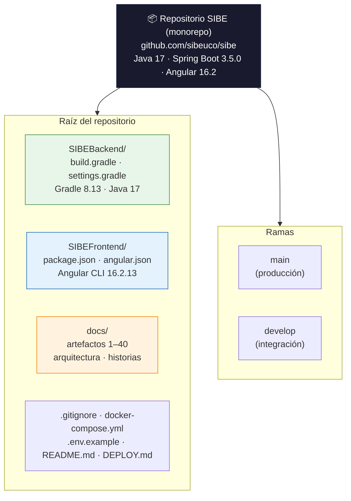
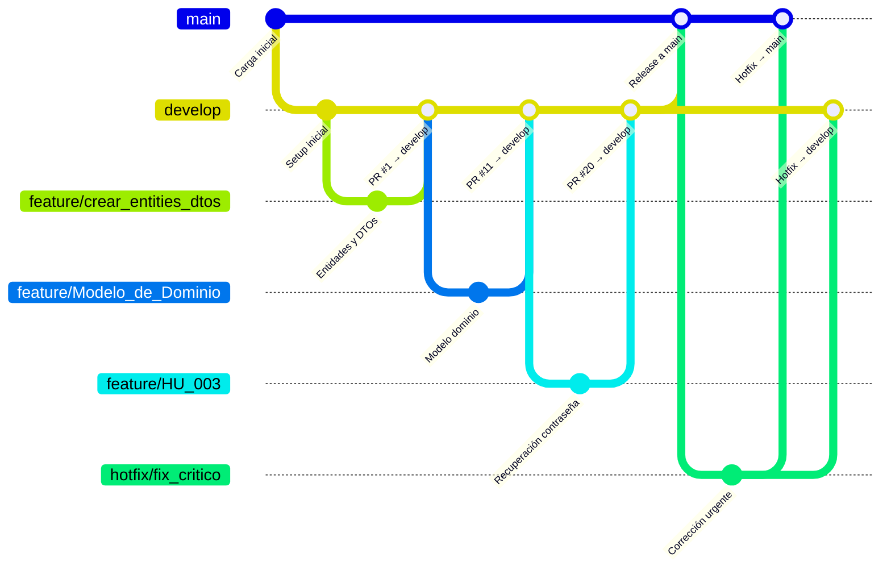
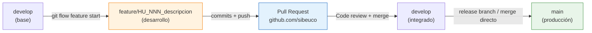
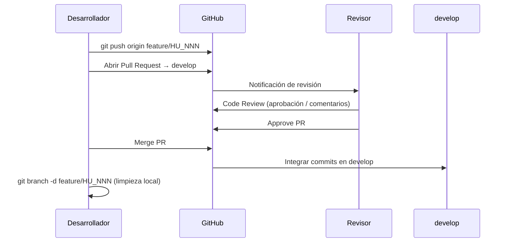
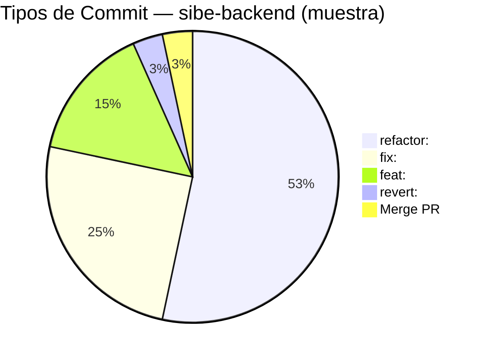
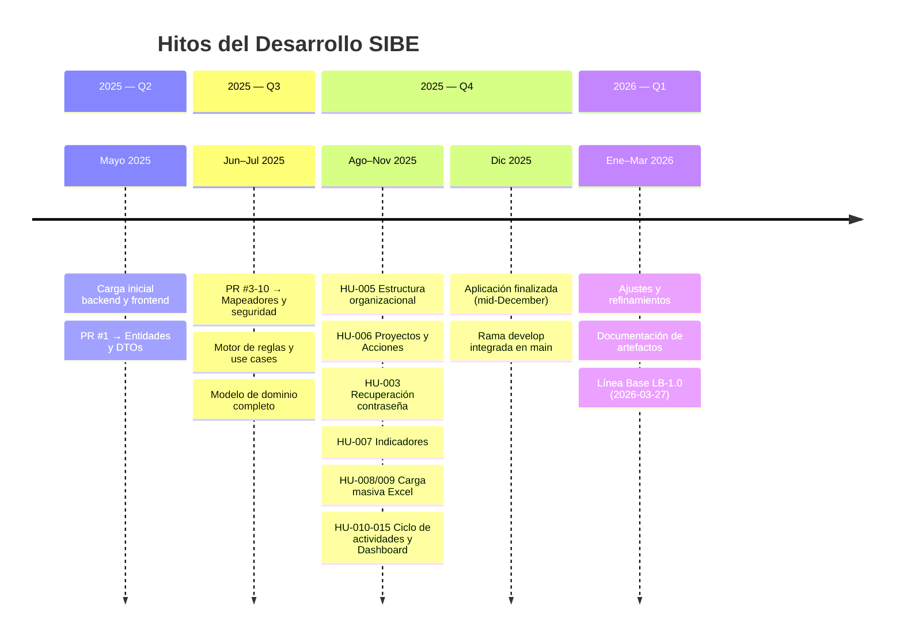

# 31. Repositorio de Control de Versiones — SIBE

| Metadato                | Valor                                                                           |
|-------------------------|---------------------------------------------------------------------------------|
| **Proyecto**            | SIBE — Sistema de Información de Bienestar y Evangelización           |
| **Organización GitHub** | sibeuco                                                                         |
| **Repositorio Backend** | SIBEBackend                                                            |
| **Repositorio Frontend**| SIBEFrontend                                                           |
| **Estrategia de Ramas** | Git Flow (main / develop / feature / release / hotfix)                          |
| **Convención de Commits**| Conventional Commits (`feat:`, `fix:`, `refactor:`, `revert:`)                 |
| **Plataforma**          | GitHub                                                                          |
| **Versión Línea Base**  | LB-1.0 — 2026-03-27                                                             |

---

## Tabla de Contenido

1. [Visión General](#1-visión-general)
2. [Repositorio Backend — sibe-backend](#2-repositorio-backend--sibe-backend)
3. [Repositorio Frontend — sibe-frontend](#3-repositorio-frontend--sibe-frontend)
4. [Estrategia de Branching (Git Flow)](#4-estrategia-de-branching-git-flow)
5. [Convención de Mensajes de Commit](#5-convención-de-mensajes-de-commit)
6. [Flujo de Trabajo con Pull Requests](#6-flujo-de-trabajo-con-pull-requests)
7. [Historial de Feature Branches por Historia de Usuario](#7-historial-de-feature-branches-por-historia-de-usuario)
8. [Estadísticas del Repositorio](#8-estadísticas-del-repositorio)
9. [Configuración de Archivos Ignorados (.gitignore)](#9-configuración-de-archivos-ignorados-gitignore)
10. [Configuración de Herramientas Locales](#10-configuración-de-herramientas-locales)

---

## 1. Visión General

El proyecto SIBE utiliza un **repositorio monorepo** alojado en GitHub bajo la organización `sibeuco`. Tanto el backend como el frontend residen en el mismo repositorio raíz, junto con la documentación del proyecto. Esta estructura centraliza el historial de cambios, la gestión de ramas y las revisiones de código en un único punto de control.



---

## 2. Repositorio Backend — sibe-backend

### 2.1 Ficha Técnica

| Campo                        | Valor                                                                      |
|------------------------------|----------------------------------------------------------------------------|
| **Rama principal**           | `main`                                                                     |
| **Rama de integración**      | `develop`                                                                  |
| **Rama activa actual**       | `develop`                                                                  |
| **HEAD remoto**              | `origin/main`                                                              |
| **Total de commits**         | 256                                                                        |
| **Primer commit**            | `2976e97` — "Carga inicial backen sibe"                                    |
| **Último commit (LB-1.0)**   | `7a5f1c7` — "refactor: se hace ajuste en los indicadores" (2026-03-26)     |
| **Rango de fechas**          | 2025-05-08 → 2026-03-26                                                    |
| **Pull Requests fusionados** | ≥ 21 (PR #1 → PR #21 documentados en log)                                  |
| **Total de tags**            | 0 (sin releases etiquetadas)                                               |

### 2.2 Descripción

Este repositorio contiene la **API REST** del sistema SIBE, implementada con arquitectura Hexagonal + CQRS en Java 17 / Spring Boot 3.5.0. Gestiona toda la lógica de negocio, persistencia en PostgreSQL, seguridad JWT y servicios externos (SMTP, carga Excel).

### 2.3 Cómo Clonar y Ejecutar

```bash
# Clonar el repositorio
git clone https://github.com/sibeuco/sibe-backend.git
cd sibe-backend

# Verificar rama de trabajo
git checkout develop

# Construir y ejecutar
./gradlew bootRun

# Ejecutar pruebas con reporte de cobertura
./gradlew test jacocoTestReport
```

> **Prerequisitos**: Java 17 JDK, PostgreSQL 15+ corriendo en `localhost:5432` con base de datos `sibe_db2`.

### 2.4 Estructura de Ramas Activas

| Rama               | Tipo           | Propósito                                                |
|--------------------|----------------|----------------------------------------------------------|
| `main`             | Principal      | Código estable listo para producción. Recibe merges desde `develop` vía PR. |
| `develop`          | Integración    | Rama de trabajo activa. Integra todas las features terminadas. Rama local actual. |

---

## 3. Repositorio Frontend — sibe-frontend

### 3.1 Ficha Técnica

| Campo                        | Valor                                                                        |
|------------------------------|------------------------------------------------------------------------------|
| **Rama principal**           | `main`                                                                       |
| **Rama de integración**      | `develop`                                                                    |
| **Rama activa actual**       | `develop`                                                                    |
| **HEAD remoto**              | `origin/main`                                                                |
| **Total de commits**         | 218                                                                          |
| **Primer commit**            | `96c6991` — "carga inicial del proyecto"                                     |
| **Último commit (LB-1.0)**   | `a1d78e9` — "refactor: se ajusta la opcion de agregar o modificar proyecto"  |
| **Rango de fechas**          | 2025-05-08 → 2026-03-27 (aprox.)                                             |
| **Pull Requests fusionados** | ≥ 50 (PR #1 → PR #50 documentados en log)                                   |
| **Total de tags**            | 0 (sin releases etiquetadas)                                                 |

### 3.2 Descripción

Este repositorio contiene la **Aplicación Web SPA** construida con Angular 16.2 / TypeScript 5.1.3. Implementa la interfaz de usuario, la navegación, los servicios HTTP de consumo de la API, los guards de seguridad, los interceptores JWT y los módulos de reportes.

### 3.3 Cómo Clonar y Ejecutar

```bash
# Clonar el repositorio
git clone https://github.com/sibeuco/sibe-frontend.git
cd sibe-frontend

# Verificar rama de trabajo
git checkout develop

# Instalar dependencias
npm install

# Iniciar servidor de desarrollo (con proxy hacia backend en :8080)
npm start
# Equivalente a: ng serve --proxy-config proxy.conf.json -o

# Ejecutar pruebas
npm test
# Equivalente a: ng test --browsers=ChromeHeadless --watch=false --code-coverage

# Construir para producción
npm run build
```

> **Prerequisitos**: Node.js >= 16 LTS, npm, Angular CLI 16.2.13 (`npm install -g @angular/cli@16.2.13`).  
> El servidor de desarrollo espera que la API backend esté disponible en `http://localhost:8080`.

### 3.4 Estructura de Ramas Activas

| Rama               | Tipo           | Propósito                                                |
|--------------------|----------------|----------------------------------------------------------|
| `main`             | Principal      | Código estable listo para producción. Recibe merges desde `develop` vía PR. |
| `develop`          | Integración    | Rama de trabajo activa. Integra todas las features terminadas. Rama local actual. |

---

## 4. Estrategia de Branching (Git Flow)

Ambos repositorios implementan **Git Flow** como estrategia de gestión de ramas. La configuración fue formalizada mediante `git flow init` con los prefijos estándar.

### 4.1 Diagrama de Git Flow



### 4.2 Configuración de Git Flow (Backend)

```ini
[gitflow "branch"]
    master  = main
    develop = develop

[gitflow "prefix"]
    feature = feature/
    release = release/
    hotfix  = hotfix/
    versiontag =
```

> La misma configuración aplica para el repositorio frontend.

### 4.3 Tipos de Ramas

| Tipo de Rama | Prefijo         | Base          | Merge hacia          | Propósito                                          |
|--------------|-----------------|---------------|----------------------|----------------------------------------------------|
| `main`       | (sin prefijo)   | —             | —                    | Código de producción. Siempre estable.             |
| `develop`    | (sin prefijo)   | `main`        | `main` (via release) | Integración continua de features terminadas.       |
| `feature/*`  | `feature/`      | `develop`     | `develop` (via PR)   | Desarrollo de una historia de usuario o mejora.    |
| `release/*`  | `release/`      | `develop`     | `main` + `develop`   | Preparación de una versión para producción.        |
| `hotfix/*`   | `hotfix/`       | `main`        | `main` + `develop`   | Corrección urgente de bug en producción.           |

### 4.4 Ciclo de Vida de una Feature



---

## 5. Convención de Mensajes de Commit

Ambos repositorios siguen la convención **Conventional Commits** adaptada al español para los mensajes descriptivos.

### 5.1 Formato

```
<tipo>: <descripción en español, imperativo, minúsculas>
```

### 5.2 Tipos Utilizados

| Tipo       | Propósito                                                              | Ejemplo del Historial                                  |
|------------|------------------------------------------------------------------------|--------------------------------------------------------|
| `feat:`    | Nueva funcionalidad o endpoint                                         | `feat: se agrega endpoint para contar actividades`     |
| `fix:`     | Corrección de bug                                                      | `fix: se ajusta la verificación de segundo nivel`      |
| `refactor:`| Refactorización sin cambio funcional                                   | `refactor: se extraen los literales a constantes`      |
| `revert:`  | Reversión de cambio anterior                                           | `revert: se elimina la paginación y cambios posteriores`|
| `chore:`   | Tareas de mantenimiento, sin código de producción                      | (disponible en convención, usado ocasionalmente)       |
| `test:`    | Adición o corrección de pruebas                                        | (usado mediante `feat: se agregan los tests`)          |
| `docs:`    | Documentación                                                          | `feat: se agrega archivo readme.md`                    |

### 5.3 Ejemplos Representativos del Historial

**Backend (`sibe-backend`):**
```
feat:     se agrega la gestion de indicadores y sus dependencias
feat:     se expone servicio para consultar participantes por ejecucion actividad
fix:      se soluciona bug del filtro de mes
refactor: se extraen los literales a constantes y enums
refactor: se ajustan permisos de creación de actividades
revert:   se elimina la paginación y todos los cambios posteriores
```

**Frontend (`sibe-frontend`):**
```
feat:     se agregan los tests
fix:      se ajusta comportamiento del reporte
refactor: se cambio el loadIndicators para retornar todos los indicadores
refactor: se ajusta comportamiento de filtros
revert:   se elimina la paginación y todos los cambios posteriores
```

---

## 6. Flujo de Trabajo con Pull Requests

Todas las integraciones de feature-branches a `develop`, y de `develop` a `main`, se realizan mediante **Pull Requests (PR)** en GitHub para garantizar revisión de código antes de la integración.

### 6.1 Flujo de un PR



### 6.2 Pull Requests Fusionados — Backend (`sibe-backend`)

| PR # | Branch Fuente                                              | Descripción                              |
|------|------------------------------------------------------------|------------------------------------------|
| #1   | `feature/crear_entities_dtos`                              | Creación de entidades JPA y DTOs iniciales|
| #2   | `feature/crear_entities_dtos` (continuación)               | Ajuste de entidades y DTOs               |
| #3   | `feature/Creacion_de_Mappers`                              | Creación de mapeadores entidad↔modelo    |
| #4   | `feature/crear_repository_usuario`                         | Repositorio de usuario                   |
| #5   | `feature/Crear_use_cases_y_reglas`                         | Use cases y motor de reglas              |
| #6   | `feature/crear_controllers_y_terminar_capa_negocio`       | Controladores REST + capa dominio        |
| #7   | `feature/crear_controllers_y_terminar_capa_negocio`       | Continuación capa de negocio             |
| #8   | `feature/implemetar_cambios_del_negocio`                   | Cambios en lógica de negocio             |
| #9   | `feature/arreglar_seguridad`                               | Configuración Spring Security + JWT      |
| #10  | `feature/ajustes_modelo_dominio`                           | Ajustes al modelo de dominio             |
| #11  | `feature/Modelo_de_Dominio`                                | Refactorización completa del modelo      |
| #13  | `feature/BUG_No_se_esta_agregando_correctamente_un_usuario`| Corrección bug creación de usuario       |
| #15  | `feature/Codigo_Limpio`                                    | Refactorización y código limpio          |
| #17  | `feature/Realizar_refactorizacion_codigo`                  | Refactorización general                  |
| #18  | `feature/HU005_consultar_la_estructura_organizacional_…`   | HU-005: Consulta estructura organizacional|
| #19  | `feature/HU006_Gestion_de_Proyectos_del_Plan_de_Desarrollo`| HU-006: Gestión de proyectos            |
| #20  | `feature/HU_003_Recuperacion_de_Contrasena`                | HU-003: Recuperación de contraseña      |
| #21  | `develop` → `main`                                         | Merge de integración a principal         |

### 6.3 Pull Requests Fusionados — Frontend (`sibe-frontend`) — Últimos 20

| PR # | Branch Fuente                                                        | HU Trazable |
|------|----------------------------------------------------------------------|-------------|
| #29  | `feature/configurar_modulo_asistencia_home`                         | HU-012      |
| #30  | `feature/configurar_servicios_usuario`                               | HU-002      |
| #31  | `feature/configurar_servicio_correo_clave`                           | HU-003      |
| #32  | `feature/HU005_consultar_la_estructura_organizacional_…`             | HU-005      |
| #33  | `feature/HU006_Gestión_de_Proyectos_del_Plan_de_Desarrollo`          | HU-006      |
| #34  | `feature/HU003_Recuperacion_de_Contrasena`                           | HU-003      |
| #35  | `feature/HU004_Cambio_de_Contrasena`                                 | HU-004      |
| #36  | `develop` → `main` (merge integración)                               | —           |
| #37  | `feature/HU009_Carga_Masiva_de_Empleados_desde_Archivo_xcel`        | HU-009      |
| #39  | `feature/HU_006_Gestion_de_Proyectos_del_Plan_de_Desarrollo`         | HU-006      |
| #40  | `feature/HU_007_Gestion_de_Indicadores_Estrategicos`                 | HU-007      |
| #41  | `feature/Corregir_gestion_proyectos`                                 | HU-006      |
| #42  | `feature/HU_010_Creacion_y_Edicion_de_Actividades_y_su_Programacion` | HU-010      |
| #44  | `feature/HU_008_Carga_Masiva_de_Estudiantes_desde_Archivo_Excel`     | HU-008      |
| #45  | `feature/HU_012_Registro_de_Asistencia_en_Vivo`                      | HU-012      |
| #46  | `feature/HU_014_Generacion_de_Reporte_Detallado_de_Asistencia`       | HU-014      |
| #47  | `feature/HU_014_Generacion_de_Reporte_Detallado_de_Asistencia`       | HU-014      |
| #48  | `feature/actualizar_servicio_modificar_actividad`                    | HU-011      |
| #49  | `feature/HU_015_Visualizacion_de_Metricas_de_Participacion`          | HU-015      |
| #50  | `feature/ajustar_editar_usuario`                                     | HU-002      |

---

## 7. Historial de Feature Branches por Historia de Usuario

La siguiente tabla mapea cada Historia de Usuario documentada en el artefacto 16 con su(s) feature branch(es) correspondientes en GitHub:

| HU      | Título                                 | Branch Backend                           | Branch Frontend                                             |
|---------|----------------------------------------|------------------------------------------|-------------------------------------------------------------|
| HU-001  | Autenticación y Cierre de Sesión       | (incluido en branches tempranos #2–#9)   | `feature/configurar_modulo_asistencia_home` (#29)           |
| HU-002  | CRUD Cuentas de Usuario                | `feature/Codigo_Limpio`, bugfix branches | `feature/configurar_servicios_usuario` (#30), `feature/ajustar_editar_usuario` (#50) |
| HU-003  | Recuperación de Contraseña             | `feature/HU_003_Recuperacion_de_Contrasena` (#20) | `feature/HU003_Recuperacion_de_Contrasena` (#34), `feature/configurar_servicio_correo_clave` (#31) |
| HU-004  | Cambio de Contraseña (autenticado)     | (merge directo en develop)               | `feature/HU004_Cambio_de_Contrasena` (#35)                  |
| HU-005  | Consultar Estructura Organizacional    | `feature/HU005_consultar_la_estructura…` (#18) | `feature/HU005_consultar_la_estructura…` (#32)          |
| HU-006  | Gestión de Proyectos y Acciones        | `feature/HU006_Gestion_de_Proyectos…` (#19) | `feature/HU_006_Gestion_de_Proyectos…` (#39), `feature/Corregir_gestion_proyectos` (#41) |
| HU-007  | Gestión de Indicadores                 | (incluido en features previas)           | `feature/HU_007_Gestion_de_Indicadores_Estrategicos` (#40)  |
| HU-008  | Carga Masiva de Estudiantes (.xlsx)    | (merge directo en develop)               | `feature/HU_008_Carga_Masiva_de_Estudiantes_desde_Archivo_Excel` (#44) |
| HU-009  | Carga Masiva de Empleados (.xlsx)      | (merge directo en develop)               | `feature/HU009_Carga_Masiva_de_Empleados_desde_Archivo_xcel` (#37) |
| HU-010  | Crear y Programar Actividades          | (múltiples commits incrementales develop)| `feature/HU_010_Creacion_y_Edicion_de_Actividades…` (#42)  |
| HU-011  | Consultar y Modificar Actividades      | (commits incrementales en develop)       | `feature/actualizar_servicio_modificar_actividad` (#48)     |
| HU-012  | Iniciar Actividad / Registrar Asistencia| (múltiples commits feature en develop)  | `feature/HU_012_Registro_de_Asistencia_en_Vivo` (#45)       |
| HU-013  | Finalizar / Cancelar Actividad         | (commits incrementales en develop)       | (incluido en PR #45 y posteriores)                          |
| HU-014  | Exportar Reporte Excel                 | (commits feat en develop)                | `feature/HU_014_Generacion_de_Reporte_Detallado…` (#46, #47)|
| HU-015  | Dashboard de Métricas                  | (múltiples feat: commits en develop)     | `feature/HU_015_Visualizacion_de_Metricas…` (#49)           |

---

## 8. Estadísticas del Repositorio

### 8.1 Comparativo de Repositorios

| Métrica                      | sibe-backend             | sibe-frontend             | Total      |
|------------------------------|:------------------------:|:-------------------------:|:----------:|
| **Total de Commits**         | 256                      | 218                       | **474**    |
| **Ramas activas**            | 2 (main, develop)        | 2 (main, develop)         | 4          |
| **Pull Requests Fusionados** | ≥ 21                     | ≥ 50                      | ≥ 71       |
| **Tags / Releases**          | 0                        | 0                         | 0          |
| **Primer Commit**            | 2025-05-08               | ~2025-05-08               | —          |
| **Último Commit (LB-1.0)**   | 2026-03-26               | ~2026-03-27               | —          |
| **Duración del desarrollo**  | ~10 meses                | ~10 meses                 | —          |

### 8.2 Distribución de Tipos de Commit (Backend)

Muestra derivada del análisis del log de los últimos 60 commits del backend:



### 8.3 Evolución del Proyecto en el Tiempo



---

## 9. Configuración de Archivos Ignorados (.gitignore)

### 9.1 Backend — sibe-backend

El archivo `.gitignore` del backend excluye los artefactos generados por los entornos de desarrollo Java más comunes:

| Categoría                       | Patrones Ignorados                                                      |
|---------------------------------|-------------------------------------------------------------------------|
| **Gradle Build**                | `HELP.md`, `.gradle/`, `build/` (excepto `gradle-wrapper.jar`)         |
| **IntelliJ IDEA**               | `.idea/`, `*.iws`, `*.iml`, `*.ipr`, `out/`                           |
| **Eclipse / STS**               | `.classpath`, `.project`, `.settings/`, `.springBeans`, `.apt_generated`|
| **NetBeans**                    | `/nbproject/private/`                                                  |
| **VS Code**                     | `.vscode/` (via gitignore global del usuario)                          |
| **Global (usuario)**            | Configurado en `C:\Users\esteban.colorado\Documents\gitignore_global.txt` |

> **Nota de seguridad:** `application.properties` **no está ignorado** en el `.gitignore`. Esto significa que las credenciales de base de datos y Gmail configuradas en ese archivo se versionan en el repositorio. Esto constituye la deuda técnica **DT-02** documentada en el artefacto 30 (Línea Base del Producto) y debe corregirse antes de cualquier despliegue en entorno público.

### 9.2 Frontend — sibe-frontend

El frontend genera por defecto con Angular CLI el `.gitignore` estándar:

| Categoría           | Patrones Ignorados                                        |
|---------------------|-----------------------------------------------------------|
| **node_modules**    | `node_modules/` — Dependencias npm (no se versionan)      |
| **Build output**    | `dist/` — Artefactos de producción generados              |
| **Coverage**        | `coverage/` — Reportes de cobertura Karma/Istanbul        |
| **IDE**             | `.angular/`, `.vscode/`, `.idea/`                         |
| **Entornos**        | Variables de entorno sensibles (si aplica)                |

---

## 10. Configuración de Herramientas Locales

### 10.1 Configuración Git del Equipo de Desarrollo

```ini
[user]
    name  = DanielGarQ
    email = danielgarciaquiceno@gmail.com

[init]
    defaultBranch = main

[core]
    excludesfile = C:\Users\Daniel\Documents\UCO\uco\gitignore_global.txt
```

### 10.2 Comandos de Referencia Rápida (Cheat Sheet)

```bash
# ─── Clonar el repositorio ────────────────────────────────────────────────
git clone https://github.com/...

# ─── Iniciar una nueva feature ──────────────────────────────────────────────
git checkout develop
git pull origin develop
git checkout -b feature/HU_NNN_descripcion_corta

# ─── Commits durante el desarrollo ─────────────────────────────────────────
git add .
git commit -m "feat: descripción de lo que se agrega"
git commit -m "fix: descripción de lo que se corrige"
git commit -m "refactor: descripción del cambio"

# ─── Publicar la feature y abrir PR ─────────────────────────────────────────
git push origin feature/HU_NNN_descripcion_corta
# Abrir Pull Request en: https://github.com/...
#   base: develop  ←  compare: feature/HU_NNN_descripcion_corta

# ─── Después del merge del PR ───────────────────────────────────────────────
git checkout develop
git pull origin develop
git branch -d feature/HU_NNN_descripcion_corta   # limpiar local

# ─── Sincronizar develop con main ───────────────────────────────────────────
git checkout main
git pull origin main
git merge develop
git push origin main
```
