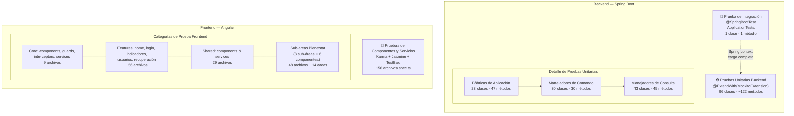
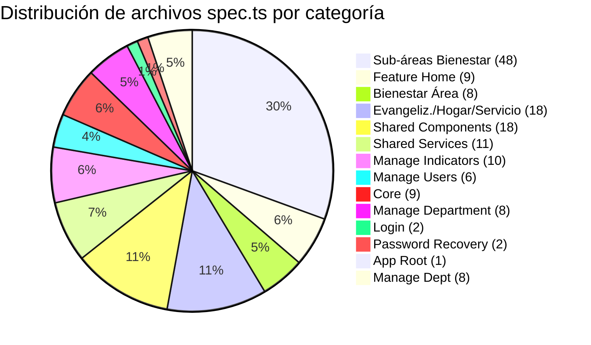
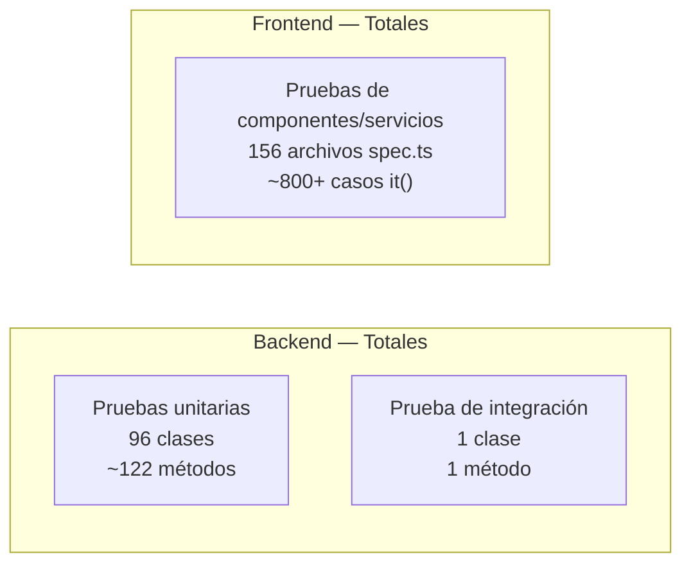

# Artefacto 32 — Pruebas Unitarias y de Integración del Proyecto SIBE

| Campo             | Valor                                                       |
|-------------------|-------------------------------------------------------------|
| **Artefacto**     | 32                                                          |
| **Nombre**        | Pruebas Unitarias y de Integración                          |
| **Proyecto**      | SIBE — Sistema de Información de Bienestar y Evangelización  |
| **Versión**       | 1.0                                                         |
| **Fecha**         | 2025-07-23                                                  |
| **Autor**         | Equipo de Desarrollo SIBE                                   |
| **Estado**        | Vigente                                                     |
| **Artefacto anterior** | Repositorio de Control de Versiones                  |

---

## Tabla de Contenido

- [Artefacto 32 — Pruebas Unitarias y de Integración del Proyecto SIBE](#artefacto-32--pruebas-unitarias-y-de-integración-del-proyecto-sibe)
  - [Tabla de Contenido](#tabla-de-contenido)
  - [1. Visión General](#1-visión-general)
  - [2. Estrategia de Pruebas](#2-estrategia-de-pruebas)
    - [Backend](#backend)
    - [Frontend](#frontend)
  - [3. Infraestructura de Pruebas](#3-infraestructura-de-pruebas)
    - [3.1 Backend — JUnit 5 + Mockito](#31-backend--junit-5--mockito)
      - [Dependencias de prueba en `build.gradle`](#dependencias-de-prueba-en-buildgradle)
    - [3.2 Frontend — Karma + Jasmine + Angular TestBed](#32-frontend--karma--jasmine--angular-testbed)
  - [4. Diagrama de Niveles de Prueba](#4-diagrama-de-niveles-de-prueba)
  - [5. Pruebas Unitarias — Backend](#5-pruebas-unitarias--backend)
    - [Patrón Común de las Pruebas Unitarias Backend](#patrón-común-de-las-pruebas-unitarias-backend)
    - [5.1 Pruebas de Fábricas de Aplicación (23 clases)](#51-pruebas-de-fábricas-de-aplicación-23-clases)
      - [Inventario Completo de Fábricas](#inventario-completo-de-fábricas)
    - [5.2 Pruebas de Manejadores de Comando (30 clases)](#52-pruebas-de-manejadores-de-comando-30-clases)
      - [Inventario Completo de Manejadores de Comando](#inventario-completo-de-manejadores-de-comando)
    - [5.3 Pruebas de Manejadores de Consulta (43 clases)](#53-pruebas-de-manejadores-de-consulta-43-clases)
      - [Inventario Completo de Manejadores de Consulta](#inventario-completo-de-manejadores-de-consulta)
  - [6. Pruebas de Integración — Backend](#6-pruebas-de-integración--backend)
    - [6.1 `ApplicationTests`](#61-applicationtests)
  - [7. Pruebas de Componentes y Servicios — Frontend](#7-pruebas-de-componentes-y-servicios--frontend)
    - [Marco de Referencia](#marco-de-referencia)
    - [7.1 Inventario Completo por Categoría](#71-inventario-completo-por-categoría)
    - [7.2 Componentes de Núcleo (Core)](#72-componentes-de-núcleo-core)
      - [`AppComponent` (`app.component.spec.ts`)](#appcomponent-appcomponentspects)
      - [`FooterComponent` (`footer.component.spec.ts`)](#footercomponent-footercomponentspects)
      - [`HeaderComponent` (`header.component.spec.ts`) — 16 pruebas](#headercomponent-headercomponentspects--16-pruebas)
    - [7.3 Guardias de Ruta](#73-guardias-de-ruta)
      - [`publicRouteGuard` (`public-route.guard.spec.ts`) — 5 pruebas](#publicrouteguard-public-routeguardspects--5-pruebas)
      - [`securityGuard` (`security.guard.spec.ts`) — 12 pruebas](#securityguard-securityguardspects--12-pruebas)
    - [7.4 Interceptores HTTP](#74-interceptores-http)
      - [`AuthInterceptor` (`auth-interceptor.spec.ts`) — 10 pruebas](#authinterceptor-auth-interceptorspects--10-pruebas)
      - [`ManejadorError` (`manejador-error.spec.ts`) — 8 pruebas](#manejadorerror-manejador-errorspects--8-pruebas)
      - [`TokenInterceptor` (`token-interceptor.spec.ts`) — 6 pruebas](#tokeninterceptor-token-interceptorspects--6-pruebas)
    - [7.5 Servicios de Núcleo](#75-servicios-de-núcleo)
      - [`HttpService` (`http.service.spec.ts`) — 17 pruebas](#httpservice-httpservicespects--17-pruebas)
    - [7.6 Feature — Home](#76-feature--home)
    - [7.7 Feature — Login](#77-feature--login)
      - [`LoginComponent` (`login.component.spec.ts`) — 11 pruebas](#logincomponent-logincomponentspects--11-pruebas)
      - [`LoginService` (`login.service.spec.ts`) — 3 pruebas](#loginservice-loginservicespects--3-pruebas)
    - [7.8 Feature — Gestión de Departamento](#78-feature--gestión-de-departamento)
    - [7.9 Feature — Gestión de Indicadores](#79-feature--gestión-de-indicadores)
      - [Componentes](#componentes)
      - [Servicios](#servicios)
    - [7.10 Feature — Gestión de Usuarios](#710-feature--gestión-de-usuarios)
      - [Componentes](#componentes-1)
      - [Servicios](#servicios-1)
    - [7.11 Feature — Recuperación de Contraseña](#711-feature--recuperación-de-contraseña)
      - [`PasswordRecoveryComponent` (`password-recovery.component.spec.ts`) — 35+ pruebas](#passwordrecoverycomponent-password-recoverycomponentspects--35-pruebas)
      - [`PasswordRecoveryService` (`password-reccovery.service.spec.ts`) — 7 pruebas](#passwordrecoveryservice-password-reccoveryservicespects--7-pruebas)
    - [7.12 Componentes Compartidos (Shared)](#712-componentes-compartidos-shared)
    - [7.13 Servicios Compartidos (Shared)](#713-servicios-compartidos-shared)
  - [8. Patrones de Prueba Utilizados](#8-patrones-de-prueba-utilizados)
    - [8.1 Patrón AAA (Arrange-Act-Assert) — Backend](#81-patrón-aaa-arrange-act-assert--backend)
    - [8.2 Patrón de Idempotencia — Fábricas](#82-patrón-de-idempotencia--fábricas)
    - [8.3 Patrón de Autorización Contextual — Consultas Filtradas](#83-patrón-de-autorización-contextual--consultas-filtradas)
    - [8.4 Patrón Spy Object + HTTP Testing — Frontend](#84-patrón-spy-object--http-testing--frontend)
    - [8.5 Patrón de Prueba de Componentes Complejos — Frontend](#85-patrón-de-prueba-de-componentes-complejos--frontend)
  - [9. Resumen Consolidado de Pruebas](#9-resumen-consolidado-de-pruebas)
    - [Resumen por Tipo](#resumen-por-tipo)
    - [Resumen Backend por Paquete](#resumen-backend-por-paquete)
    - [Resumen Frontend por Categoría](#resumen-frontend-por-categoría)
  - [10. Historial de Cambios](#10-historial-de-cambios)

---

## 1. Visión General

El proyecto SIBE implementa una estrategia de pruebas automatizadas en dos niveles principales:

- **Pruebas unitarias** en el backend (Spring Boot) que verifican el comportamiento aislado de cada clase del estrato de aplicación — fábricas, manejadores de comando y manejadores de consulta —, sin levantar contexto de Spring ni persistencia real.
- **Pruebas unitarias y de componentes** en el frontend (Angular), que verifican el comportamiento de componentes, servicios, guardias e interceptores usando el entorno de pruebas de Angular (`TestBed`) con dobles de prueba (spies y mocks).
- **Una prueba de integración** en el backend que verifica la carga correcta del contexto completo de la aplicación Spring Boot.

> **Nota:** La cobertura de código (métricas de líneas, ramas y métodos) se documenta en el **Artefacto 35**. Este artefacto se limita a describir la estructura, organización y comportamiento de las pruebas implementadas.

---

## 2. Estrategia de Pruebas

La estrategia de pruebas del proyecto SIBE sigue los principios de la arquitectura hexagonal (Puertos y Adaptadores) adoptada en el backend y la arquitectura modular por funcionalidad del frontend.

### Backend

Los tests del backend se concentran exclusivamente en la **capa de aplicación** (paquete `co.edu.uco.sibe.aplicacion`), que es donde reside la lógica de orquestación. Se toman las siguientes decisiones de diseño:

1. **Aislamiento total**: Las pruebas unitarias no cargan el contexto de Spring (`@SpringBootTest`). Cada clase se instancia manualmente con dependencias mockeadas usando Mockito.
2. **Contrato de comportamiento**: Las aserciones verifican tanto el valor de retorno como la interacción correcta con las dependencias (dobles de prueba), garantizando que el código invoque los puertos (repositorios y casos de uso) con los argumentos correctos.
3. **Convención de nombres**: Todos los métodos de prueba siguen la convención `deberia<Accion><Contexto>()` en español, alineada con los estándares de código del equipo.

### Frontend

Los tests del frontend siguen el modelo de **prueba de componentes con TestBed**, que verifica la integración entre la plantilla (template), la lógica del componente y sus dependencias. Se toman las siguientes decisiones:

1. **Spy Objects**: Las dependencias de servicio se remplazan con `jasmine.createSpyObj()`, lo que permite controlar las respuestas y verificar las llamadas.
2. **HTTP Mocking**: Todos los servicios HTTP se prueban con `HttpClientTestingModule` + `HttpTestingController`, eliminando la necesidad de servidores reales.
3. **NO_ERRORS_SCHEMA**: Se utiliza `NO_ERRORS_SCHEMA` en la mayoría de los módulos de prueba para desacoplar los componentes hijos de las pruebas del componente padre.

---

## 3. Infraestructura de Pruebas

### 3.1 Backend — JUnit 5 + Mockito

| Aspecto              | Detalle                                                                   |
|----------------------|---------------------------------------------------------------------------|
| **Framework**        | JUnit 5 (`junit-jupiter`)                                                 |
| **Mocking**          | Mockito (`mockito-core`, `mockito-junit-jupiter`)                         |
| **Extensión JUnit**  | `@ExtendWith(MockitoExtension.class)` en todas las clases de unit test    |
| **Inicialización**   | `@BeforeEach` con construcción manual: `new Clase(mock1, mock2, ...)`     |
| **Stubs**            | `Mockito.when(mock.metodo(args)).thenReturn(valor)`                       |
| **Verificación**     | `verify(mock).metodo(args)` — confirma que el collaborator fue invocado   |
| **Inyección**        | Constructor injection manual (no se usa `@InjectMocks`)                   |
| **Base de datos**    | No aplica — ningún test unitario accede a base de datos                   |
| **Ejecución**        | `./gradlew test`                                                          |
| **Reportes**         | JUnit XML en `build/test-results/` + HTML en `build/reports/tests/`      |
| **Configuración**    | `tasks.named('test') { useJUnitPlatform(); finalizedBy jacocoTestReport; ignoreFailures = true }` |

#### Dependencias de prueba en `build.gradle`

```groovy
testImplementation 'org.springframework.boot:spring-boot-starter-test'
// Incluye JUnit 5, Mockito, AssertJ, Hamcrest, JSONassert, JsonPath
```

### 3.2 Frontend — Karma + Jasmine + Angular TestBed

| Aspecto                 | Detalle                                                          |
|-------------------------|------------------------------------------------------------------|
| **Test Runner**         | Karma 6.4                                                        |
| **Framework**           | Jasmine 4.6                                                      |
| **Integración Angular** | `@angular/core/testing` — `TestBed`, `ComponentFixture`          |
| **HTTP Mocking**        | `HttpClientTestingModule` + `HttpTestingController`              |
| **Router Mocking**      | `RouterTestingModule`                                            |
| **Mocking de servicios**| `jasmine.createSpyObj('ServiceName', ['method1', 'method2'])`    |
| **Spies**               | `spyOn(objeto, 'metodo').and.returnValue(...)` / `.and.callFake(...)` |
| **Navegador**           | ChromeHeadless (CI) / Chrome (local)                             |
| **Ejecución**           | `ng test --browsers=ChromeHeadless --watch=false --code-coverage` |
| **Reportes**            | HTML en `coverage/sibe-frontend/`                                 |

---

## 4. Diagrama de Niveles de Prueba



---

## 5. Pruebas Unitarias — Backend

Todas las pruebas unitarias del backend se encuentran en:
`SIBEBackend/src/test/java/co/edu/uco/sibe/`

### Patrón Común de las Pruebas Unitarias Backend

Todas las 96 clases de prueba unitaria comparten el mismo patrón estructural:

```java
@ExtendWith(MockitoExtension.class)
class XxxTest {

    @Mock
    private DependenciaPuerto mockDependencia;

    private ClaseBajoTest sujeto;

    @BeforeEach
    void setUp() {
        sujeto = new ClaseBajoTest(mockDependencia);
    }

    @Test
    void deberiaAccionContexto() {
        // GIVEN — configurar stubs
        when(mockDependencia.metodo(arg)).thenReturn(valorEsperado);

        // WHEN — ejecutar sujeto
        var resultado = sujeto.ejecutar(comando);

        // THEN — verificar resultado e interacción
        assertEquals(valorEsperado, resultado);
        verify(mockDependencia).metodo(arg);
    }
}
```

---

### 5.1 Pruebas de Fábricas de Aplicación (23 clases)

Las fábricas de aplicación son responsables de construir objetos de dominio a partir de comandos de entrada. Sus pruebas verifican que:
- Los objetos se construyan correctamente desde los datos del comando.
- Se reutilice la instancia existente cuando ya existe en repositorio (idempotencia).
- Se cree una nueva instancia cuando no existe.
- Se lancen las excepciones apropiadas ante datos inválidos.

**Paquetes cubiertos:**
- `co.edu.uco.sibe.aplicacion.comando.fabrica` (22 clases)
- `co.edu.uco.sibe.infraestructura.configuracion.dataloader.fabrica` (1 clase)

#### Inventario Completo de Fábricas

| # | Clase de Prueba | Métodos de Prueba | Comportamientos Verificados |
|---|-----------------|-------------------|-----------------------------|
| 1 | `AccionFabricaTest` | `deberiaConstruirAccionDesdeComando`<br>`deberiaConstruirAccionParaActualizar` | Construcción desde comando CREATE; construcción para UPDATE con ID existente |
| 2 | `ActividadFabricaTest` | `deberiaConstruirActividad`<br>`deberiaConstruirActividadConFechas`<br>`deberiaConstruirActividadParaActualizar`<br>`deberiaConstruirActualizado` | Construcción básica; construcción con fechas programadas; actualización con repositorio; actualización completa |
| 3 | `AreaFabricaTest` | `deberiaConstruirAreaDesdeComando` | Construcción de área organizacional desde comando |
| 4 | `CentroCostosFabricaTest` | `deberiaConstruirNuevoCuandoNoExiste`<br>`deberiaRetornarExistenteCuandoYaExiste` | Creación cuando no existe en repo; devolución de instancia existente (idempotencia) |
| 5 | `CiudadResidenciaFabricaTest` | `deberiaConstruirNuevoCuandoNoExiste`<br>`deberiaRetornarExistenteCuandoYaExiste` | Creación de nuevo; reutilización de existente |
| 6 | `DireccionFabricaTest` | `deberiaConstruirDireccionDesdeComando` | Construcción de dirección organizacional |
| 7 | `EmpleadoFabricaTest` | `deberiaConstruirEmpleadoDesdeComando` | Construcción de empleado |
| 8 | `EstadoActividadFabricaTest` | `deberiaConstruirEstadoActividadDesdeComando` | Construcción de estado de actividad |
| 9 | `EstudianteFabricaTest` | `deberiaConstruirEstudianteDesdeComando` | Construcción de estudiante |
| 10 | `IdentificacionFabricaTest` | `deberiaConstruirNuevoCuandoNoExiste`<br>`deberiaRetornarExistenteCuandoYaExiste` | Creación de nueva identificación; reutilización |
| 11 | `IndicadorFabricaTest` | `deberiaConstruirIndicadorDesdeComando`<br>`deberiaConstruirIndicadorParaActualizar` | Construcción CREATE; construcción UPDATE |
| 12 | `ParticipanteFabricaTest` | `deberiaConstruirParticipante`<br>`deberiaConstruirParticipanteEstudiante`<br>`deberiaConstruirParticipanteEmpleado`<br>`deberiaConstruirParticipanteExterno`<br>`deberiaConstruirParticipanteConDatosCompletos`<br>`deberiaLanzarExcepcionCuandoTipoInvalido`<br>`deberiaLanzarExcepcionCuandoCarnetNoEncontrado` | Construcción por tipo (estudiante, empleado, externo); excepción tipo inválido; excepción carnet no encontrado |
| 13 | `PersonaFabricaTest` | `deberiaConstruirPersonaDesdeComando`<br>`deberiaConstruirPersonaParaActualizar` | Construcción CREATE; construcción UPDATE |
| 14 | `ProyectoFabricaTest` | `deberiaConstruirProyectoDesdeComando`<br>`deberiaConstruirProyectoParaActualizar` | Construcción CREATE; construcción UPDATE |
| 15 | `PublicoInteresFabricaTest` | `deberiaConstruirPublicoInteresDesdeComando` | Construcción de público de interés |
| 16 | `RelacionLaboralFabricaTest` | `deberiaConstruirNuevoCuandoNoExiste`<br>`deberiaRetornarExistenteCuandoYaExiste` | Creación de nueva relación laboral; reutilización |
| 17 | `SubareaFabricaTest` | `deberiaConstruirSubareaDesdeComando` | Construcción de subárea organizacional |
| 18 | `TemporalidadFabricaTest` | `deberiaConstruirTemporalidadDesdeComando` | Construcción de temporalidad |
| 19 | `TipoIdentificacionFabricaTest` | `deberiaConstruirTipoIdentificacionDesdeComando` | Construcción de tipo de identificación |
| 20 | `TipoIndicadorFabricaTest` | `deberiaConstruirTipoIndicadorDesdeComando` | Construcción de tipo de indicador |
| 21 | `TipoUsuarioFabricaTest` | `deberiaConstruirTipoUsuarioDesdeComando` | Construcción de tipo de usuario |
| 22 | `UsuarioFabricaTest` | `deberiaConstruirUsuarioDesdeComando`<br>`deberiaConstruirUsuarioParaActualizar` | Construcción CREATE; construcción UPDATE con hashing |
| 23 | `DatosTipoIndicadorFabricaTest` | `deberiaConstruirDatosDesdeListaCuandoExistenTiposValidos`<br>`deberiaConstruirDatosConTipoNoEncontradoEnRepositorio`<br>`deberiaConstruirDatosConListaVacia`<br>`deberiaConstruirDatosConListaNula`<br>`deberiaLanzarExcepcionCuandoRepositorioFalla`<br>`deberiaConstruirDatosSoloConTiposEncontrados` | Construcción completa; tipos no encontrados; lista vacía; lista nula; excepción del repositorio; filtrado de tipos encontrados |

**Total: 23 clases · 47 métodos de prueba**

---

### 5.2 Pruebas de Manejadores de Comando (30 clases)

Los manejadores de comando implementan la interfaz `ManejadorComando<C, R>` y orquestan los casos de uso de escritura. Cada manejador expone un único método `ejecutar(comando)`. Sus pruebas verifican que:
- El manejador delega correctamente al caso de uso o al repositorio correspondiente.
- El comando se transforma correctamente antes de la delegación.
- La respuesta retornada contiene el valor esperado.

**Paquete:** `co.edu.uco.sibe.aplicacion.comando.manejador`

**Patrón de aserción:**
```java
// Stub del caso de uso
when(casoDeUso.ejecutar(argumento)).thenReturn(valorEsperado);

// Ejecución
ComandoRespuesta<TipoResultado> resultado = manejador.ejecutar(comando);

// Verificación del valor de retorno
assertEquals(expectedUUID, resultado.getValor());

// Verificación de interacción
verify(casoDeUso).ejecutar(argumento);
```

#### Inventario Completo de Manejadores de Comando

| # | Clase de Prueba | Método `@Test` | Caso de Uso / Repositorio Mockeado | Tipo de Respuesta |
|---|-----------------|----------------|-------------------------------------|-------------------|
| 1 | `CancelarActividadManejadorTest` | `deberiaEjecutarCancelarActividad` | `CancelarActividadUseCase` | `ComandoRespuesta<UUID>` |
| 2 | `CargarMasivamenteEmpleadosManejadorTest` | `deberiaEjecutarCargarMasivamenteEmpleados` | `CargarMasivamenteEmpleadosUseCase` + `mock(MultipartFile.class)` | `ComandoRespuesta<UUID>` |
| 3 | `CargarMasivamenteEstudiantesManejadorTest` | `deberiaEjecutarCargarMasivamenteEstudiantes` | `CargarMasivamenteEstudiantesUseCase` + `mock(MultipartFile.class)` | `ComandoRespuesta<UUID>` |
| 4 | `EliminarPersonaManejadorTest` | `deberiaEjecutarEliminarPersona` | `EliminarPersonaUseCase` | `ComandoRespuesta<UUID>` |
| 5 | `FinalizarActividadManejadorTest` | `deberiaEjecutarFinalizarActividad` | `FinalizarActividadUseCase` | `ComandoRespuesta<UUID>` |
| 6 | `GuardarAccionManejadorTest` | `deberiaEjecutarGuardarAccion` | `GuardarAccionUseCase` | `ComandoRespuesta<UUID>` |
| 7 | `GuardarActividadManejadorTest` | `deberiaEjecutarGuardarActividad` | `GuardarActividadUseCase` | `ComandoRespuesta<UUID>` |
| 8 | `GuardarAreaManejadorTest` | `deberiaEjecutarGuardarArea` | `GuardarAreaUseCase` | `ComandoRespuesta<UUID>` |
| 9 | `GuardarDireccionManejadorTest` | `deberiaEjecutarGuardarDireccion` | `GuardarDireccionUseCase` | `ComandoRespuesta<UUID>` |
| 10 | `GuardarEstadoActividadManejadorTest` | `deberiaEjecutarGuardarEstadoActividad` | `GuardarEstadoActividadUseCase` | `ComandoRespuesta<UUID>` |
| 11 | `GuardarIndicadorManejadorTest` | `deberiaEjecutarGuardarIndicador` | `GuardarIndicadorUseCase` | `ComandoRespuesta<UUID>` |
| 12 | `GuardarProyectoManejadorTest` | `deberiaEjecutarGuardarProyecto` | `GuardarProyectoUseCase` | `ComandoRespuesta<UUID>` |
| 13 | `GuardarPublicoInteresManejadorTest` | `deberiaEjecutarGuardarPublicoInteres` | `GuardarPublicoInteresUseCase` | `ComandoRespuesta<UUID>` |
| 14 | `GuardarSubareaManejadorTest` | `deberiaEjecutarGuardarSubarea` | `GuardarSubareaUseCase` | `ComandoRespuesta<UUID>` |
| 15 | `GuardarTemporalidadManejadorTest` | `deberiaEjecutarGuardarTemporalidad` | `GuardarTemporalidadUseCase` | `ComandoRespuesta<UUID>` |
| 16 | `GuardarTipoIdentificacionManejadorTest` | `deberiaEjecutarGuardarTipoIdentificacion` | `GuardarTipoIdentificacionUseCase` | `ComandoRespuesta<UUID>` |
| 17 | `GuardarTipoIndicadorManejadorTest` | `deberiaEjecutarGuardarTipoIndicador` | `GuardarTipoIndicadorUseCase` | `ComandoRespuesta<UUID>` |
| 18 | `GuardarTipoUsuarioManejadorTest` | `deberiaEjecutarGuardarTipoUsuario` | `GuardarTipoUsuarioUseCase` | `ComandoRespuesta<UUID>` |
| 19 | `GuardarUsuarioManejadorTest` | `deberiaEjecutarGuardarUsuario` | `GuardarUsuarioUseCase` | `ComandoRespuesta<UUID>` |
| 20 | `IniciarActividadManejadorTest` | `deberiaEjecutarIniciarActividad` | `IniciarActividadUseCase` | `ComandoRespuesta<UUID>` |
| 21 | `LoginManejadorTest` | `deberiaEjecutarLogin` | `LoginUseCase` | `ComandoRespuesta<String>` (JWT) |
| 22 | `ModificarAccionManejadorTest` | `deberiaEjecutarModificarAccion` | `ModificarAccionUseCase` | `ComandoRespuesta<UUID>` |
| 23 | `ModificarActividadManejadorTest` | `deberiaEjecutarModificarActividad` | `ModificarActividadUseCase` | `ComandoRespuesta<UUID>` |
| 24 | `ModificarClaveManejadorTest` | `deberiaEjecutarModificarClave` | `ModificarClaveUseCase` | `ComandoRespuesta<UUID>` |
| 25 | `ModificarIndicadorManejadorTest` | `deberiaEjecutarModificarIndicador` | `ModificarIndicadorUseCase` | `ComandoRespuesta<UUID>` |
| 26 | `ModificarProyectoManejadorTest` | `deberiaEjecutarModificarProyecto` | `ModificarProyectoUseCase` | `ComandoRespuesta<UUID>` |
| 27 | `ModificarUsuarioManejadorTest` | `deberiaEjecutarModificarUsuario` | `ModificarUsuarioUseCase` | `ComandoRespuesta<UUID>` |
| 28 | `RecuperarClaveManejadorTest` | `deberiaEjecutarRecuperarClave` | `RecuperarClaveUseCase` | `ComandoRespuesta<UUID>` |
| 29 | `SolicitarCodigoManejadorTest` | `deberiaEjecutarSolicitarCodigo` | `SolicitarCodigoUseCase` | `ComandoRespuesta<UUID>` |
| 30 | `ValidarCodigoRecuperacionClaveManejadorTest` | `deberiaEjecutarValidarCodigo` | `ValidarCodigoRecuperacionClaveUseCase` | `ComandoRespuesta<Boolean>` |

> **Nota sobre archivos cargados masivamente:** Los tests `CargarMasivamenteEmpleadosManejadorTest` y `CargarMasivamenteEstudiantesManejadorTest` utilizan `mock(MultipartFile.class)` para simular el archivo subido, sin necesidad de cargar un archivo real ni Spring MVC.

> **Nota sobre respuesta booleana:** `ValidarCodigoRecuperacionClaveManejadorTest` es el único manejador cuya respuesta es `ComandoRespuesta<Boolean>`, y la aserción es `assertTrue(resultado.getValor())` en lugar de `assertEquals(uuid, ...)`.

**Total: 30 clases · 30 métodos de prueba**

---

### 5.3 Pruebas de Manejadores de Consulta (43 clases)

Los manejadores de consulta resuelven consultas de lectura, retornando DTOs o listas de DTOs. Sus pruebas verifican:
- Que el manejador delegue al repositorio o caso de uso correcto.
- Que el valor de retorno coincida exactamente con el valor devuelto por el collaborator.
- Para manejadores con lógica de autorización organizacional, que el filtrado por rol funcione correctamente (`ADMINISTRADOR_DIRECCION`, `ADMINISTRADOR_AREA`, `COLABORADOR`).

**Paquete:** `co.edu.uco.sibe.aplicacion.consulta` / `co.edu.uco.sibe.aplicacion.comando.manejador`

#### Inventario Completo de Manejadores de Consulta

| # | Clase de Prueba | Métodos `@Test` | Dependencia Mockeada | Tipo de Respuesta |
|---|-----------------|-----------------|----------------------|-------------------|
| 1 | `ConsultarAccionesManejadorTest` | `deberiaConsultarAcciones` | `AccionRepositorioConsulta` | `List<AccionDTO>` |
| 2 | `ConsultarActividadesPorAreaManejadorTest` | `deberiaConsultarActividadesPorArea` | `ConsultarActividadesPorAreaUseCase` | `List<ActividadDTO>` |
| 3 | `ConsultarActividadesPorDireccionManejadorTest` | `deberiaConsultarActividadesPorDireccion` | `ConsultarActividadesPorDireccionUseCase` | `List<ActividadDTO>` |
| 4 | `ConsultarActividadesPorSubareaManejadorTest` | `deberiaConsultarActividadesPorSubarea` | `ConsultarActividadesPorSubareaUseCase` | `List<ActividadDTO>` |
| 5 | `ConsultarAnnosEjecucionesFinalizadasManejadorTest` | `deberiaConsultarAnnos` | `ConsultarAnnosEjecucionesFinalizadasUseCase` | `List<String>` |
| 6 | `ConsultarAreaDetalladaManejadorTest` | `deberiaConsultarAreaDetallada` | `ConsultarAreaDetalladaUseCase` | `AreaDetalladaDTO` |
| 7 | `ConsultarAreaManejadorTest` | `deberiaConsultarAreas` | `AreaRepositorioConsulta` | `List<Area>` |
| 8 | `ConsultarAreaPorNombreDTOManejadorTest` | `deberiaConsultarAreaPorNombre` | `ConsultarAreaPorNombreDTOUseCase` | `AreaDTO` |
| 9 | `ConsultarAreasManejadorTest` | `deberiaRetornarTodasLasAreasParaAdminDireccion`<br>`deberiaFiltrarAreasPorIdParaNoAdmin` | `AreaRepositorioConsulta`<br>`AutorizacionContextoOrganizacionalServicio` | `List<AreaDTO>` |
| 10 | `ConsultarCentrosCostosEmpleadosEnEjecucionesFinalizadasManejadorTest` | `deberiaConsultarCentrosCostos` | `ConsultarCentrosCostosEmpleadosEnEjecucionesFinalizadasUseCase` | `List<String>` |
| 11 | `ConsultarDireccionDetalladaManejadorTest` | `deberiaConsultarDireccionDetallada` | `ConsultarDireccionDetalladaUseCase` | `DireccionDetalladaDTO` |
| 12 | `ConsultarDireccionesManejadorTest` | `deberiaRetornarTodasLasDireccionesParaAdminDireccion`<br>`deberiaFiltrarDireccionesPorIdParaNoAdmin` | `DireccionRepositorioConsulta`<br>`AutorizacionContextoOrganizacionalServicio` | `List<DireccionDTO>` |
| 13 | `ConsultarDireccionPorNombreDTOManejadorTest` | `deberiaConsultarDireccionPorNombre` | `ConsultarDireccionPorNombreDTOUseCase` | `DireccionDTO` |
| 14 | `ConsultarDireccionPorNombreManejadorTest` | `deberiaConsultarDireccionPorNombre` | `ConsultarDireccionPorNombreUseCase` | `Direccion` |
| 15 | `ConsultarEjecucionesPorActividadManejadorTest` | `deberiaConsultarEjecucionesPorActividad` | `ConsultarEjecucionesPorActividadUseCase` | `List<EjecucionActividadDTO>` |
| 16 | `ConsultarEstadisticasParticipantesPorEstructuraManejadorTest` | `deberiaConsultarEstadisticasPorEstructura` | `ConsultarEstadisticasParticipantesPorEstructuraUseCase` | `List<EstadisticaDTO>` |
| 17 | `ConsultarEstadisticasParticipantesPorMesManejadorTest` | `deberiaConsultarEstadisticasPorMes` | `ConsultarEstadisticasParticipantesPorMesUseCase` | `List<EstadisticaMesDTO>` |
| 18 | `ConsultarIndicadoresEnEjecucionesFinalizadasManejadorTest` | `deberiaConsultarIndicadoresEnEjecucionesFinalizadas` | `ConsultarIndicadoresEnEjecucionesFinalizadasUseCase` | `List<String>` |
| 19 | `ConsultarIndicadoresManejadorTest` | `deberiaConsultarIndicadores` | `IndicadorRepositorioConsulta` | `List<IndicadorDTO>` |
| 20 | `ConsultarIndicadoresParaActividadesManejadorTest` | `deberiaConsultarIndicadoresParaActividades` | `ConsultarIndicadoresParaActividadesUseCase` | `List<IndicadorDTO>` |
| 21 | `ConsultarMesesEjecucionesFinalizadasManejadorTest` | `deberiaConsultarMeses` | `ConsultarMesesEjecucionesFinalizadasUseCase` | `List<String>` |
| 22 | `ConsultarMiembroPorIdCarnetManejadorTest` | `deberiaConsultarMiembroPorIdCarnet` | `ConsultarMiembroPorIdCarnetUseCase` | `MiembroDTO` |
| 23 | `ConsultarMiembroPorIdentificacionManejadorTest` | `deberiaConsultarMiembroPorIdentificacion` | `ConsultarMiembroPorIdentificacionUseCase` | `MiembroDTO` |
| 24 | `ConsultarNivelesFormacionEstudiantesEnEjecucionesFinalizadasManejadorTest` | `deberiaConsultarNivelesFormacion` | `ConsultarNivelesFormacionEstudiantesEnEjecucionesFinalizadasUseCase` | `List<String>` |
| 25 | `ConsultarParticipantesPorEjecucionActividadManejadorTest` | `deberiaConsultarParticipantesPorEjecucion` | `ConsultarParticipantesPorEjecucionActividadUseCase` | `List<ParticipanteDTO>` |
| 26 | `ConsultarProgramasAcademicosEstudiantesEnEjecucionesFinalizadasManejadorTest` | `deberiaConsultarProgramas` | `ConsultarProgramasAcademicosEstudiantesEnEjecucionesFinalizadasUseCase` | `List<String>` |
| 27 | `ConsultarProyectosManejadorTest` | `deberiaConsultarProyectos` | `ProyectoRepositorioConsulta` | `List<ProyectoDTO>` |
| 28 | `ConsultarPublicosInteresManejadorTest` | `deberiaConsultarPublicosInteres` | `PublicoInteresRepositorioConsulta` | `List<PublicoInteresDTO>` |
| 29 | `ConsultarSemestresActividadesEnEjecucionesFinalizadasManejadorTest` | `deberiaConsultarSemestres` | `ConsultarSemestresActividadesEnEjecucionesFinalizadasUseCase` | `List<String>` |
| 30 | `ConsultarSubareaDetalladaManejadorTest` | `deberiaConsultarSubareaDetallada` | `ConsultarSubareaDetalladaUseCase` | `SubareaDetalladaDTO` |
| 31 | `ConsultarSubareaPorNombreDTOManejadorTest` | `deberiaConsultarSubareaPorNombre` | `ConsultarSubareaPorNombreDTOUseCase` | `SubareaDTO` |
| 32 | `ConsultarSubareasDTOManejadorTest` | `deberiaConsultarSubareasDTO` | `SubareaRepositorioConsulta` | `List<SubareaDTO>` |
| 33 | `ConsultarSubareasManejadorTest` | `deberiaRetornarTodasLasSubareasParaAdminDireccion`<br>`deberiaRetornarTodasLasSubareasParaAdminArea`<br>`deberiaFiltrarSubareasParaColaborador` | `SubareaRepositorioConsulta`<br>`AutorizacionContextoOrganizacionalServicio` | `List<Subarea>` |
| 34 | `ConsultarTemporalidadesManejadorTest` | `deberiaConsultarTemporalidades` | `TemporalidadRepositorioConsulta` | `List<TemporalidadDTO>` |
| 35 | `ConsultarTipoIdentificacionPorSiglaManejadorTest` | `deberiaConsultarTipoIdentificacionPorSigla` | `ConsultarTipoIdentificacionPorSiglaUseCase` | `TipoIdentificacion` |
| 36 | `ConsultarTiposIdentificacionManejadorTest` | `deberiaConsultarTiposIdentificacion` | `TipoIdentificacionRepositorioConsulta` | `List<TipoIdentificacionDTO>` |
| 37 | `ConsultarTiposIndicadorManejadorTest` | `deberiaConsultarTiposIndicador` | `TipoIndicadorRepositorioConsulta` | `List<TipoIndicadorDTO>` |
| 38 | `ConsultarTiposParticipantesEnEjecucionesFinalizadasManejadorTest` | `deberiaConsultarTiposParticipantes` | `ConsultarTiposParticipantesEnEjecucionesFinalizadasUseCase` | `List<String>` |
| 39 | `ConsultarTiposUsuarioManejadorTest` | `deberiaConsultarTiposUsuario` | `TipoUsuarioRepositorioConsulta` | `List<TipoUsuarioDTO>` |
| 40 | `ConsultarTipoUsuarioPorCodigoManejadorTest` | `deberiaConsultarTipoUsuarioPorCodigo` | `ConsultarTipoUsuarioPorCodigoUseCase` | `TipoUsuario` |
| 41 | `ConsultarUsuarioPorCorreoManejadorTest` | `deberiaConsultarUsuarioPorCorreo` | `ConsultarUsuarioPorCorreoUseCase` | `UsuarioDTO` |
| 42 | `ConsultarUsuarioPorIdentificadorManejadorTest` | `deberiaConsultarUsuarioPorIdentificador` | `ConsultarUsuarioPorIdentificadorUseCase` | `UsuarioDTO` |
| 43 | `ConsultarUsuariosManejadorTest` | `deberiaConsultarUsuarios` | `ConsultarUsuariosUseCase` | `List<UsuarioDTO>` |

> **Manejadores con lógica de autorización contextual** (usan `AutorizacionContextoOrganizacionalServicio`):
> - `ConsultarAreasManejadorTest` (2 tests): `ADMINISTRADOR_DIRECCION` → retorna todas; rol diferente → filtra por `areaId`.
> - `ConsultarDireccionesManejadorTest` (2 tests): `ADMINISTRADOR_DIRECCION` → retorna todas; rol diferente → filtra por `direccionId`.
> - `ConsultarSubareasManejadorTest` (3 tests): `ADMINISTRADOR_DIRECCION` → todas; `ADMINISTRADOR_AREA` → todas; `COLABORADOR` → filtra por `subareaId`.

> **Conversión UUID ↔ String en boundary de manejador:**
> Los tests de `ConsultarAreaDetalladaManejadorTest`, `ConsultarDireccionDetalladaManejadorTest` y `ConsultarSubareaDetalladaManejadorTest` verifican que el handler recibe el identificador como `String` y lo convierte a `UUID` antes de delegar al caso de uso.

**Total: 43 clases · 45 métodos de prueba**

---

## 6. Pruebas de Integración — Backend

### 6.1 `ApplicationTests`

| Aspecto          | Detalle                                                     |
|------------------|-------------------------------------------------------------|
| **Clase**        | `ApplicationTests`                                          |
| **Paquete**      | `co.edu.uco.sibe`                                           |
| **Archivo**      | `SIBEBackend/src/test/java/co/edu/uco/sibe/ApplicationTests.java` |
| **Anotación**    | `@SpringBootTest`                                           |
| **Método**       | `contextLoads()`                                            |
| **Descripción**  | Verifica que el contexto completo de la aplicación Spring Boot levante correctamente, incluyendo todos los beans, configuraciones, repositorios JPA y componentes de seguridad. |
| **Base de datos**| H2 en memoria (reemplaza PostgreSQL en el perfil de test mediante configuración de `application-test.properties`) |
| **Propósito**    | Detectar errores de configuración, beans faltantes o conflictos de inyección de dependencias que solo se manifiestan al levantar el contexto completo |

```java
@SpringBootTest
class ApplicationTests {

    @Test
    void contextLoads() {
        // Verifica que el contexto Spring Boot levante sin errores
    }
}
```

**Total: 1 clase · 1 método de prueba**

---

## 7. Pruebas de Componentes y Servicios — Frontend

Todas las pruebas del frontend se ubican en: `SIBEFrontend/src/`

### Marco de Referencia

```typescript
// Estructura estándar de un spec.ts en Angular
describe('NombreComponente', () => {

    let component: NombreComponente;
    let fixture: ComponentFixture<NombreComponente>;
    let mockServicio: jasmine.SpyObj<ServicioTipo>;

    beforeEach(async () => {
        mockServicio = jasmine.createSpyObj('ServicioTipo', ['metodo1', 'metodo2']);

        await TestBed.configureTestingModule({
            declarations: [NombreComponente],
            imports: [HttpClientTestingModule, RouterTestingModule],
            providers: [
                { provide: ServicioTipo, useValue: mockServicio }
            ],
            schemas: [NO_ERRORS_SCHEMA]
        }).compileComponents();

        fixture = TestBed.createComponent(NombreComponente);
        component = fixture.componentInstance;
        fixture.detectChanges();
    });

    it('should create', () => {
        expect(component).toBeTruthy();
    });
});
```

### 7.1 Inventario Completo por Categoría



| Categoría | # Archivos | Componentes / Servicios Clave |
|-----------|-----------|-------------------------------|
| App Root | 1 | `AppComponent` |
| Core — Components | 2 | `FooterComponent`, `HeaderComponent` |
| Core — Guards | 2 | `publicRouteGuard`, `securityGuard` |
| Core — Interceptors | 3 | `AuthInterceptor`, `ManejadorError`, `TokenInterceptor` |
| Core — Services | 2 | `CoreService`, `HttpService` |
| Feature — Home | 9 | `HomeComponent`, `ActivitiesComponent`, `AreasComponent`, `TopDataContainerComponent`, etc. |
| Feature — Bienestar (área) | 8 | `BienestarAreaComponent` + 7 sub-componentes |
| Feature — 8 Sub-áreas Bienestar | 48 | 8 sub-áreas × 6 componentes (Acompañamiento, Banda, Cancha, Deportes, Extensión, Gimnasio, Trabajo Social, Unidad) |
| Feature — Evangelización / Hogar / Servicio | 18 | 3 áreas × 6 componentes |
| Feature — Login | 2 | `LoginComponent`, `LoginService` |
| Feature — Manage Department | 8 | `ManageDepartmentComponent` + 7 sub-componentes (incluyendo `AreaStatisticsComponent`) |
| Feature — Manage Indicators | 10 | `ActionsComponent`, `IndicatorsComponent`, `ProjectsComponent`, `EditIndicatorComponent`, + 7 servicios |
| Feature — Manage Users | 6 | `ManageUsersComponent`, `AreaUsersComponent`, `DepartmentUsersComponent`, `EditUserComponent`, `RegisterNewUserComponent`, `UserNotificationService` |
| Feature — Password Recovery | 2 | `PasswordRecoveryComponent`, `PasswordRecoveryService` |
| Shared — Components | 18 | `ActivitiesTableComponent`, `AttendanceRecordComponent`, `EditActivityComponent`, `RegisterNewActivityComponent`, `UploadDatabaseComponent`, etc. |
| Shared — Services | 11 | `ActivityService`, `AreaService`, `DepartmentService`, `ExcelReportService`, `StateService`, `UserService`, etc. |
| **TOTAL** | **156** | |

---

### 7.2 Componentes de Núcleo (Core)

#### `AppComponent` (`app.component.spec.ts`)
| Prueba | Descripción |
|--------|-------------|
| `should create the app` | Verificación de instanciación del componente raíz |

**Imports de prueba**: `FormsModule`, `ReactiveFormsModule`, `HttpClientTestingModule`, `RouterTestingModule`

#### `FooterComponent` (`footer.component.spec.ts`)
| Prueba | Descripción |
|--------|-------------|
| `should create` | Instanciación del componente |
| `should render without errors` | Renderizado sin errores en template |

#### `HeaderComponent` (`header.component.spec.ts`) — 16 pruebas
| Prueba | Descripción |
|--------|-------------|
| `should create` | Instanciación |
| `should initialize userSession$ and isLogged$ on ngOnInit` | Inicialización de observables en `ngOnInit` |
| `should emit true from isLogged$ when session is logged` | `isLogged$` emite `true` cuando hay sesión activa |
| `should emit false when session is undefined` | `isLogged$` emite `false` cuando sesión es `undefined` |
| `should clear state and navigate to /login on logout` | Logout limpia el estado y navega a `/login` |
| `should toggle dropdown visibility` | Alternancia de visibilidad del dropdown |
| `should close dropdown on cerrarDropdown` | Cierre del dropdown |
| `should close dropdown when clicking outside` | Cierre al hacer click fuera |
| `should handle password update success flow` | Flujo exitoso de actualización de contraseña |
| `should set mensajeError when password update fails` | Error en actualización de contraseña |
| `should set mensajeError when user lookup fails` | Error en búsqueda de usuario |
| `should set mensajeError when user response has no identificador` | Respuesta de usuario sin identificador |
| `should set mensajeError when session has no correo` | Sesión sin correo |
| `should handle error.error as string` | Manejo de error como string |
| `should handle error.error.message` | Manejo de `error.error.message` |
| `should handle error.error.error as string` | Manejo de `error.error.error` |

**Mocks**: `jasmine.createSpyObj('StateService', ['select', 'deleteProperty'])`, `jasmine.createSpyObj('UserService', ['consultarUsuarioPorCorreo', 'modificarClave'])`

---

### 7.3 Guardias de Ruta

#### `publicRouteGuard` (`public-route.guard.spec.ts`) — 5 pruebas
| Prueba | Descripción |
|--------|-------------|
| `should allow access when no token exists` | Acceso permitido sin token |
| `should allow access when token is expired` | Acceso permitido con token expirado |
| `should clear expired token from sessionStorage` | Limpieza de token expirado |
| `should redirect to /home when token is valid` | Redirección a `/home` con token válido |
| `should allow access when token is malformed` | Acceso con token malformado |

**Estilo**: `TestBed.runInInjectionContext` para guardias funcionales.

#### `securityGuard` (`security.guard.spec.ts`) — 12 pruebas
| Prueba | Descripción |
|--------|-------------|
| `should block access to gestionar-direccion when rol is COLABORADOR` | Bloqueo por rol insuficiente |
| `should allow access to gestionar-direccion when ADMINISTRADOR_DIRECCION` | Acceso con rol correcto |
| `should block access to gestionar-usuarios when ADMINISTRADOR_AREA` | Bloqueo para gestión de usuarios |
| `should block access to gestionar-indicadores when ADMINISTRADOR_AREA` | Bloqueo para gestión de indicadores — solo ADMINISTRADOR_DIRECCION tiene acceso |
| `should allow access to home for all roles` | Home accesible para todos |
| `should redirect to login when no token` | Redirección a login sin token |
| `should allow access to /login when no token` | Acceso directo a login |
| `should allow access to /recuperar-contrasena when no token` | Acceso a recuperación sin token |
| `should redirect to login when token is expired and route is not public` | Redirección con token expirado en ruta privada |
| `should allow access to /login when token is expired` | Login accesible con token expirado |
| `should redirect to /home when valid token and accessing /login` | Redirección a home cuando token válido intenta acceder a login |
| `should treat malformed token as expired` | Token malformado tratado como expirado |

---

### 7.4 Interceptores HTTP

#### `AuthInterceptor` (`auth-interceptor.spec.ts`) — 10 pruebas
| Prueba | Descripción |
|--------|-------------|
| `should add Basic Authorization header when userdetails exist in sessionStorage` | Header Basic Auth desde sessionStorage |
| `should use Authorization from sessionStorage when no userdetails` | Usar Authorization guardado |
| `should not add Authorization header when no credentials exist` | Sin header cuando no hay credenciales |
| `should always add X-Requested-With header` | Header `X-Requested-With` siempre presente |
| `should add X-XSRF-TOKEN header when XSRF-TOKEN is in sessionStorage` | Token CSRF desde sessionStorage |
| `should remove userdetails from sessionStorage after intercept` | Limpieza de `userdetails` post-intercepción |
| `should save Authorization header from response to sessionStorage` | Guardar Auth header de respuesta |
| `should not overwrite Authorization in sessionStorage when response has no auth header` | No sobreescribir si respuesta sin header |
| `should handle 401 error without throwing` | Manejo de 401 sin excepción |
| `should handle non-401 error without throwing` | Manejo de otros errores sin excepción |

**Estilo**: `HTTP_INTERCEPTORS` provider + `HttpClientTestingModule` + `HttpTestingController`

#### `ManejadorError` (`manejador-error.spec.ts`) — 8 pruebas
| Prueba | Descripción |
|--------|-------------|
| `should be created` | Instanciación |
| `should log a string error to console` | Log de error string |
| `should log a generic Error to console` | Log de Error genérico |
| `should handle HttpErrorResponse when offline` | Manejo offline |
| `should handle HttpErrorResponse with known status code and no mensaje` | Status code conocido sin mensaje |
| `should handle HttpErrorResponse with error body containing mensaje` | Error body con mensaje |
| `should log error with date, path and message` | Log con fecha, ruta y mensaje |
| `should handle HttpErrorResponse with unknown status code` | Status code desconocido |

**Estilo**: Prueba pura sin TestBed; `spyOn(window.console, 'error')`, `spyOnProperty(navigator, 'onLine')`

#### `TokenInterceptor` (`token-interceptor.spec.ts`) — 6 pruebas
| Prueba | Descripción |
|--------|-------------|
| `should add Bearer token header when a valid token exists` | Header Bearer con token válido |
| `should pass request without Authorization when no token` | Sin header con token ausente |
| `should redirect to /login and throw error when token is expired` | Redirección y error con token expirado |
| `should logout and redirect on 401 response` | Logout y redirección en 401 |
| `should rethrow non-401 errors without redirecting` | Relanzar errores no-401 |
| `should treat a malformed token as expired` | Token malformado tratado como expirado |

---

### 7.5 Servicios de Núcleo

#### `HttpService` (`http.service.spec.ts`) — 17 pruebas
Cubre todos los métodos HTTP del servicio base utilizado por los servicios de funcionalidad:

| Grupo | Pruebas |
|-------|---------|
| CRUD básico | `doGet`, `doPost`, `doPut`, `doDelete` |
| Variantes GET | `doGetById`, `doGetByEmail`, `doGetParameters` |
| Variantes POST | `doPostWithOutBody`, `doPostWithOutBodyAndId`, `doRequestMapping` |
| Variantes PUT | `doPutWithOutBody` |
| Cabeceras | `setHeader`, default `Content-Type`, opciones por defecto, `doGetParameters` con params null, `Content-Type` automático |

---

### 7.6 Feature — Home

| Componente | Archivo | # Pruebas Destacadas |
|------------|---------|----------------------|
| `HomeComponent` | `home.component.spec.ts` | 4: inicialización de `filtersRequest`, actualización de filtros |
| `ActivitiesComponent` | `activities.component.spec.ts` | 6: valores predeterminados, `terminoBusqueda`, recarga de tabla |
| `AreasComponent` | `areas.component.spec.ts` | 5: 4 áreas definidas, propiedades requeridas, área Bienestar presente |
| `BottonDataContainerComponent` | `botton-data-container.component.spec.ts` | 3: valores de entrada |
| `DepartmentAttendanceRecordComponent` | `department-attendance-record.component.spec.ts` | 2: smoke test |
| `HomeFiltersComponent` | `home-filters.component.spec.ts` | 3: output `filtersChanged`, emisión con filtros |
| `HomePrimaryButtonsComponent` | `home-primary-buttons.component.spec.ts` | 7: generación de Excel (guarda, error, doble ejecución), scroll |
| `PrincipalHomeComponent` | `principal-home.component.spec.ts` | 2: smoke test |
| `TopDataContainerComponent` | `top-data-container.component.spec.ts` | 17: `ngOnChanges`, `updateChart`, `loadStatistics`, `getAreaIdentifier`, manejo de Cobertura, errores |

---

### 7.7 Feature — Login

#### `LoginComponent` (`login.component.spec.ts`) — 11 pruebas
| Prueba | Descripción |
|--------|-------------|
| `should create` | Instanciación |
| `should initialize the login form` | Inicialización del formulario reactivo |
| `should have required validators on userInput` | Validador requerido en campo usuario |
| `should have email validator on userInput` | Validador de email |
| `should accept valid email` | Email válido acepta la validación |
| `should have required validator on passwordInput` | Validador requerido en contraseña |
| `should clear error when userInput changes` | Limpieza de error al cambiar usuario |
| `should clear error when passwordInput changes` | Limpieza de error al cambiar contraseña |
| `should not call service when form is invalid` | Sin llamada al servicio con form inválido |
| `should call loginService with credentials when form is valid` | Llamada al servicio con credenciales válidas |
| `should set error message on login failure` | Mensaje de error en falla de login |

#### `LoginService` (`login.service.spec.ts`) — 3 pruebas
Verifica `validarLogin()`: creación del servicio, llamada GET, almacenamiento en `sessionStorage`.

---

### 7.8 Feature — Gestión de Departamento

| Componente | # Pruebas Destacadas |
|------------|----------------------|
| `ManageDepartmentComponent` | 2: smoke test |
| `AreaStatisticsComponent` | 30+: ngOnInit/ngOnChanges; carga de estadísticas para DIRECCION/AREA/SUBAREA; manejo de errores; `getAreaIdentifier` |
| `BienestarAreaComponent` | 2: smoke test |
| `DepartmentComponent` | 4: apertura de modales empleados/estudiantes, `onArchivoSeleccionado`, `onCargaCompleta` |
| `DepartmentAreasComponent` | 2: smoke test |
| `EvangelizacionAreaComponent` | 2: smoke test |
| `SantaMariaAreaComponent` | 2: smoke test |
| `ServicioAreaComponent` | 2: smoke test |

---

### 7.9 Feature — Gestión de Indicadores

#### Componentes

| Componente | # Pruebas Destacadas |
|------------|----------------------|
| `ManageIndicatorsComponent` | 2: creación, selector correcto |
| `ActionsComponent` | 11: carga de acciones, filtros, apertura de modal, actualización tras modificar, limpieza de selección |
| `EditActionComponent` | 20+: carga de datos, ngOnChanges, modificación con todas las variantes de error, emisión de eventos, limpieza |
| `EditIndicatorComponent` | 70+: carga de dropdowns; ngOnChanges; cargarDatosIndicador; modificarIndicador (todas las variantes de error); filterPublicoInteres; togglePublicoInteres; isPublicoInteresSelected; removePublicoInteres |
| `EditProjectComponent` | 40+: carga de acciones; cargarDatosProyecto; modificarProyecto; filterAcciones; isActionSelected; toggleAction; removeAction |
| `IndicatorsComponent` | 11: carga, filtros, modal, actualización post-modificación |
| `ProjectsComponent` | 11: carga, filtros, modal, proyectos modificados |
| `RegisterNewActionComponent` | 13: registro (loading guard, éxito, variantes de error), limpieza, cierre de modal |
| `RegisterNewIndicatorComponent` | 35+: carga de dropdowns, registrarIndicador, variantes de error, limpieza |
| `RegisterNewProjectComponent` | 55+: carga de acciones, registro, variantes de error, selección múltiple de acciones, limpieza, suscripciones |

#### Servicios

| Servicio | Pruebas |
|----------|---------|
| `ActionService` | Creación, GET acciones, POST nueva acción, PUT modificar acción |
| `FrequencyService` | Creación, GET frecuencias |
| `IndicatorTypeService` | Creación, GET tipos de indicador |
| `IndicatorService` | Creación, GET indicadores, GET para actividades, POST, PUT |
| `IndicatorsService` | Creación, GET indicadores, retorno de mocks |
| `InterestedPublicService` | Creación, GET públicos de interés |
| `ProjectService` | Creación, GET proyectos, POST, PUT |

---

### 7.10 Feature — Gestión de Usuarios

#### Componentes

| Componente | # Pruebas Destacadas |
|------------|----------------------|
| `ManageUsersComponent` | 10+: carga de departamentos/áreas/subáreas, asignación de usuario seleccionado, apertura de modal de edición |
| `AreaUsersComponent` | 15+: carga de usuarios, filtrado, emisión de evento `seleccionarUsuarioParaEditar`, confirmar/eliminar usuario (éxito y error), suscripción a notificaciones (crear/actualizar/eliminar), `ngOnDestroy` (unsubscribe) |
| `DepartmentUsersComponent` | 15+: similar a `AreaUsersComponent` con lógica de departamentos |
| `EditUserComponent` | 60+: carga de estructuras y tipos; `cargarDatosUsuario`; `esAdministradorDireccion`; `onTipoEstructuraChange`; `determinarTipoArea`; `validarFormulario`; `actualizarUsuario` (todas las variantes de error); `limpiarFormulario`; `abrirModal`/`cerrarModal` |
| `RegisterNewUserComponent` | 50+: carga de estructuras/tipos; `onTipoUsuarioChange`; validación de formulario; `registrarUsuario` (todas las variantes de error); `limpiarFormulario`; `cerrarModal`; emisión de `usuarioCreado` |

#### Servicios

| Servicio | Pruebas |
|----------|---------|
| `UserNotificationService` | Creación; emisión al crear usuario; emisión al actualizar usuario; emisión al eliminar usuario |

---

### 7.11 Feature — Recuperación de Contraseña

#### `PasswordRecoveryComponent` (`password-recovery.component.spec.ts`) — 35+ pruebas

El componente implementa un flujo de 3 pasos. Las pruebas cubren cada paso con escenarios de éxito y error:

| Paso | Pruebas Clave |
|------|---------------|
| **Paso 1 — Solicitar código** | Email vacío/inválido/válido; llamada al servicio; éxito; error 404; error de conexión |
| **Paso 2 — Validar código** | Código vacío; llamada con código y email; éxito; código inválido (400); manejo de error |
| **Paso 3 — Cambiar contraseña** | Contraseñas no coinciden; contraseña muy corta; llamada con contraseñas válidas; éxito con redirección; error de conexión |
| **Navegación** | `volverPaso`, `volverLogin`, transiciones entre pasos |
| **Variantes de error (12 adicionales)** | Errores 400/500/genérico para cada uno de los 3 pasos |

#### `PasswordRecoveryService` (`password-reccovery.service.spec.ts`) — 7 pruebas
Verifica `solicitarCodigo`, `validarCodigo`, `recuperarClave` y propagación de errores de cada endpoint.

---

### 7.12 Componentes Compartidos (Shared)

| Componente | # Pruebas | Descripción |
|------------|-----------|-------------|
| `ActivitiesTableComponent` | 75+ | Ciclo completo: ngOnInit, carga por tipo estructura (DIRECCION/AREA/SUBAREA), ordenamiento, recarga, calcular estado (PENDIENTE/FINALIZADO), abrir modal editar, fechas programadas, parseo de fechas |
| `ActivityInfoComponent` | 23 | @Input actividad; carga desde sessionStorage; formateo de fechas; detección de estado FINALIZADO; manejo de JSON inválido; construcción de ActivityInfo desde respuesta |
| `AreaButtonsComponent` | 8 | Navegación, scroll, generación de informe por tipo de estructura, prevención de doble ejecución, manejo de error |
| `AreaTopImageComponent` | 5 | Propiedades de entrada: `imageSrc`, `text` |
| `AttendanceRecordComponent` | 90+ | Iniciar actividad; buscar participante (carnet/documento/duplicado/externo); confirmar/cancelar participante externo; remover participante; finalizar actividad (todos los casos); cancelar actividad; autorización por rol; carga de participantes en actividad finalizada; normalización de texto |
| `ChangePasswordComponent` | 8 | Contraseñas no coinciden; nueva igual a actual; emisión de `contrasenaActualizada`; limpieza; bindings de entrada; manejo de modal |
| `CompletedActivitiesComponent` | 12 | Carga condicional, recarga en ngOnChanges, manejo de errores, `getAreaIdentifier` |
| `TotalParticipantsComponent` | 30+ | Carga de estadísticas; cobertura; recarga en cambios; forkJoin; errores; calcular cobertura con población 0 |
| `TotalParticipantsMonthsComponent` | 15+ | ngOnChanges, updateChart, `loadStatistics` por tipo de estructura, indicador Cobertura, errores |
| `DateSelectorComponent` | 40+ | ngOnInit/ngOnChanges, mapeo de ejecuciones, getStatusClass, parseo de fechas, guardar selección, normalización |
| `EditActivityComponent` | 100+ | ngOnInit/ngOnChanges; agregar/eliminar fechas; `determinarTipoArea`; validación de formulario (todas las ramas); carga de datos de actividad; `editarActividad` (todas las variantes de error); limpiar formulario; precarga de área |
| `ExternalParticipantComponent` | 6 | Emisión de `participanteAgregado`, limpieza de formulario |
| `FilterListComponent` | 45+ | Carga de filtros; exclusividad semestre/año; emisión de filtros; limpieza; manejo de errores para cada servicio; respuestas vacías/null |
| `GoToAreaButtonComponent` | 6 | Propiedades de entrada: texto, routerLink (string/array) |
| `PrimaryButtonComponent` | 6 | Propiedades de entrada, apertura de modal cuando existe/no existe en DOM |
| `RegisterNewActivityComponent` | 100+ | ngOnInit/ngOnChanges; `buscarYPrecargarArea` (direccion/area/subarea/error); agregar/eliminar fechas; `registrarActividad` (todas las variantes de error + fallback JWT + éxito con setTimeout); validación; limpiar |
| `SeparatorComponent` | 2 | Smoke test |
| `UploadDatabaseComponent` | 70+ | `onFileSelected` (xlsx/xls válidos, rechazo no-excel/tamaño/MIME); `cargarArchivo` (empleados/estudiantes, errores 400/401/403/500/genérico, éxito); modal operations; validaciones de tipo y tamaño |

---

### 7.13 Servicios Compartidos (Shared)

| Servicio | # Pruebas | Operaciones Verificadas |
|----------|-----------|-------------------------|
| `ActivityService` | 21 | POST crear actividad; GET consultar actividades; PUT modificar; GET ejecutar; PUT iniciar/cancelar/finalizar; POST contar (participantes, asistencias, ejecuciones); POST estadísticas por estructura/mes; POST población total; GET meses/años/semestres/centros de costos/tipos de participantes/programas académicos/niveles de formación/indicadores en ejecuciones finalizadas |
| `AreaService` | 4 | GET áreas; GET área por nombre; GET detalle de área |
| `DepartmentService` | 4 | GET departamentos; GET por nombre; GET detalle |
| `ExcelReportService` | 6 | Generación de informe Excel para dirección/área/subárea; alerta cuando sin actividades; procesamiento de actividades anidadas |
| `IdentificationTypeService` | 2 | GET tipos de identificación |
| `StateService` | 8 | Update/get estado; eliminar propiedad; observable `select`; valor `undefined` para propiedad no seteada; rehidratación desde `sessionStorage`; manejo de token corrupto |
| `SubAreaService` | 4 | GET subáreas; GET por nombre; GET detalle |
| `UniversityMemberService` | 3 | GET miembro por identificación; GET miembro por carnet |
| `UploadDatabaseService` | 7 | POST upload empleados/estudiantes; retry sin headers en 401 (empleados)/403 (estudiantes); propagación de errores no-auth; Bearer token con/sin prefijo |
| `UserTypeService` | 2 | GET tipos de usuario |
| `UserService` | 9 | GET usuarios; POST nuevo usuario; DELETE eliminar; PUT modificar; GET por identificador; GET por correo; PUT modificar contraseña; propagación de error en `modificarClave` |

---

## 8. Patrones de Prueba Utilizados

### 8.1 Patrón AAA (Arrange-Act-Assert) — Backend

Todas las pruebas del backend siguen el patrón **Arrange-Act-Assert**:

```java
@Test
void deberiaEjecutarGuardarAccion() {
    // ARRANGE — configurar stubs y datos
    UUID idEsperado = UUID.randomUUID();
    when(guardarAccionUseCase.ejecutar(any(AccionComando.class)))
        .thenReturn(idEsperado);

    // ACT — ejecutar el sujeto bajo prueba
    ComandoRespuesta<UUID> resultado = manejador.ejecutar(comando);

    // ASSERT — verificar resultado e interacción
    assertEquals(idEsperado, resultado.getValor());
    verify(guardarAccionUseCase).ejecutar(any(AccionComando.class));
}
```

### 8.2 Patrón de Idempotencia — Fábricas

Las fábricas que buscan entidades en repositorio antes de crear siguen el patrón de **idempotencia**:

```java
// Prueba: retornar existente cuando ya existe
@Test
void deberiaRetornarExistenteCuandoYaExiste() {
    CentroCostos existente = mock(CentroCostos.class);
    when(repositorio.buscarPorCodigo("CC01")).thenReturn(Optional.of(existente));
    
    CentroCostos resultado = fabrica.construir("CC01");
    
    assertSame(existente, resultado);
    verify(repositorio).buscarPorCodigo("CC01");
}

// Prueba: crear nuevo cuando no existe
@Test
void deberiaConstruirNuevoCuandoNoExiste() {
    when(repositorio.buscarPorCodigo("CC02")).thenReturn(Optional.empty());
    
    CentroCostos resultado = fabrica.construir("CC02");
    
    assertNotNull(resultado);
    verify(repositorio).buscarPorCodigo("CC02");
}
```

### 8.3 Patrón de Autorización Contextual — Consultas Filtradas

Para manejadores con lógica de control de acceso por rol:

```java
// Prueba: administrador de dirección ve todas las áreas
@Test
void deberiaRetornarTodasLasAreasParaAdminDireccion() {
    AutorizacionContexto contexto = mock(AutorizacionContexto.class);
    when(autorizacionServicio.obtenerContexto()).thenReturn(contexto);
    when(contexto.getRol()).thenReturn(RolUsuario.ADMINISTRADOR_DIRECCION);
    when(areaRepositorio.consultarDTOs()).thenReturn(listaCompleta);
    
    List<AreaDTO> resultado = manejador.ejecutar();
    
    assertEquals(listaCompleta, resultado);
}

// Prueba: colaborador solo ve su área
@Test
void deberiaFiltrarAreasPorIdParaNoAdmin() {
    when(contexto.getRol()).thenReturn(RolUsuario.COLABORADOR);
    when(contexto.getAreaId()).thenReturn(areaId);
    when(areaRepositorio.consultarDTOs()).thenReturn(listaCompleta);
    
    List<AreaDTO> resultado = manejador.ejecutar();
    
    assertEquals(1, resultado.size());
    assertEquals(areaId.toString(), resultado.get(0).getIdentificador());
}
```

### 8.4 Patrón Spy Object + HTTP Testing — Frontend

Para servicios Angular con llamadas HTTP:

```typescript
describe('UserService', () => {
    let service: UserService;
    let httpMock: HttpTestingController;

    beforeEach(() => {
        TestBed.configureTestingModule({
            imports: [HttpClientTestingModule],
            providers: [UserService]
        });
        service = TestBed.inject(UserService);
        httpMock = TestBed.inject(HttpTestingController);
    });

    afterEach(() => {
        httpMock.verify(); // asegura que no queden solicitudes pendientes
    });

    it('should GET users', () => {
        const mockUsers = [{ identificador: '1' }];
        service.consultarUsuarios().subscribe(users => {
            expect(users).toEqual(mockUsers);
        });
        const req = httpMock.expectOne('/api/usuarios');
        expect(req.request.method).toBe('GET');
        req.flush(mockUsers);
    });
});
```

### 8.5 Patrón de Prueba de Componentes Complejos — Frontend

Para componentes con múltiples dependencias y flujos de error:

```typescript
describe('EditActivityComponent', () => {
    let mockIndicatorService: jasmine.SpyObj<IndicatorService>;
    let mockUserService: jasmine.SpyObj<UserService>;

    beforeEach(async () => {
        mockIndicatorService = jasmine.createSpyObj('IndicatorService',
            ['consultarIndicadores', 'consultarIndicadoresParaActividades']);
        mockUserService = jasmine.createSpyObj('UserService',
            ['consultarUsuarios', 'consultarUsuarioPorCorreo']);

        // Configurar respuestas por defecto
        mockIndicatorService.consultarIndicadores.and.returnValue(of([]));
        mockUserService.consultarUsuarios.and.returnValue(of([]));

        await TestBed.configureTestingModule({
            declarations: [EditActivityComponent],
            providers: [
                { provide: IndicatorService, useValue: mockIndicatorService },
                { provide: UserService, useValue: mockUserService }
            ],
            schemas: [NO_ERRORS_SCHEMA]
        }).compileComponents();
    });

    it('should handle error in cargarIndicadores', () => {
        mockIndicatorService.consultarIndicadores.and.returnValue(
            throwError(() => new Error('Network error'))
        );
        fixture.detectChanges();
        expect(component.mensajeError).toBeTruthy();
    });
});
```

---

## 9. Resumen Consolidado de Pruebas



### Resumen por Tipo

| Tipo de Prueba | Tecnología | # Clases/Archivos | # Métodos Aproximados |
|----------------|------------|-------------------|-----------------------|
| **Unitarias Backend — Fábricas** | JUnit 5 + Mockito | 23 | 47 |
| **Unitarias Backend — Manejadores Comando** | JUnit 5 + Mockito | 30 | 30 |
| **Unitarias Backend — Manejadores Consulta** | JUnit 5 + Mockito | 43 | 45 |
| **Integración Backend** | JUnit 5 + @SpringBootTest | 1 | 1 |
| **Frontend — Componentes y Servicios** | Karma + Jasmine + TestBed | 156 | ~800+ |
| **TOTAL** | | **253** | **~923+** |

### Resumen Backend por Paquete

| Paquete | # Clases de Prueba | Tipo |
|---------|--------------------|------|
| `co.edu.uco.sibe.aplicacion.comando.fabrica` | 22 | Unitaria |
| `co.edu.uco.sibe.infraestructura.configuracion.dataloader.fabrica` | 1 | Unitaria |
| `co.edu.uco.sibe.aplicacion.comando.manejador` | 30 | Unitaria |
| `co.edu.uco.sibe.aplicacion.consulta` | 43 | Unitaria |
| `co.edu.uco.sibe` | 1 | Integración |

### Resumen Frontend por Categoría

| Categoría Frontend | # Archivos spec.ts |
|--------------------|--------------------|
| App Root | 1 |
| Core (componentes, guardias, interceptores, servicios) | 9 |
| Feature — Home (incluye 8 sub-áreas Bienestar × 6 componentes) | 57 |
| Feature — Evangelización / Hogar / Servicio (3 áreas × 6 componentes) | 18 |
| Feature — Login | 2 |
| Feature — Gestión de Departamento | 8 |
| Feature — Gestión de Indicadores | 10 |
| Feature — Gestión de Usuarios | 6 |
| Feature — Recuperación de Contraseña | 2 |
| Shared — Componentes | 18 |
| Shared — Servicios | 11 |
| Bienestar — Área principal | 8 |
| **TOTAL** | **156** |

---

## 10. Historial de Cambios

| Versión | Fecha | Autor | Descripción |
|---------|-------|-------|-------------|
| 1.0 | 2025-07-23 | Equipo de Desarrollo SIBE | Creación inicial del artefacto. Documentación de 96 clases de prueba unitaria backend, 1 prueba de integración y 156 archivos spec.ts del frontend. |
