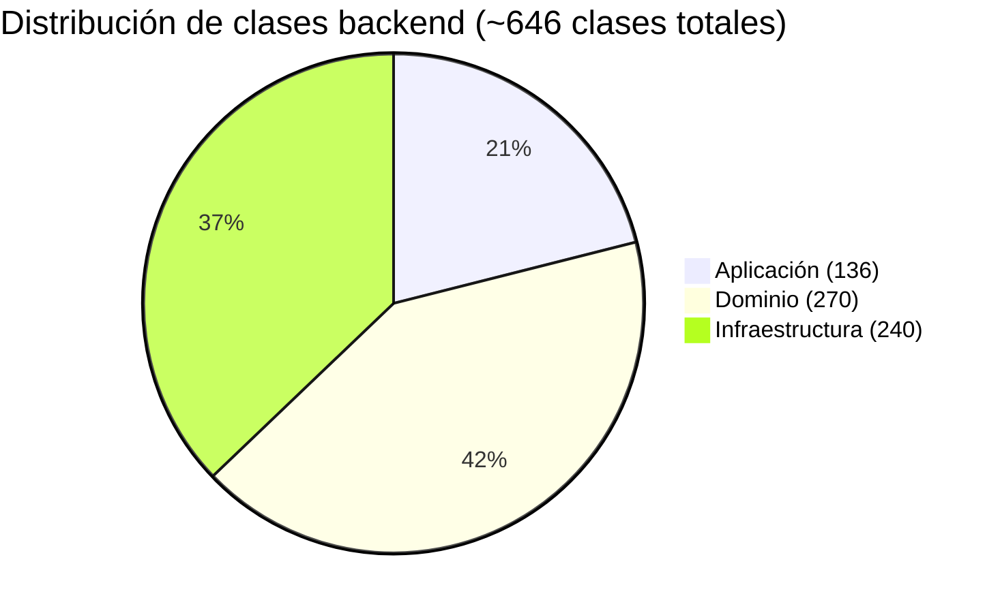
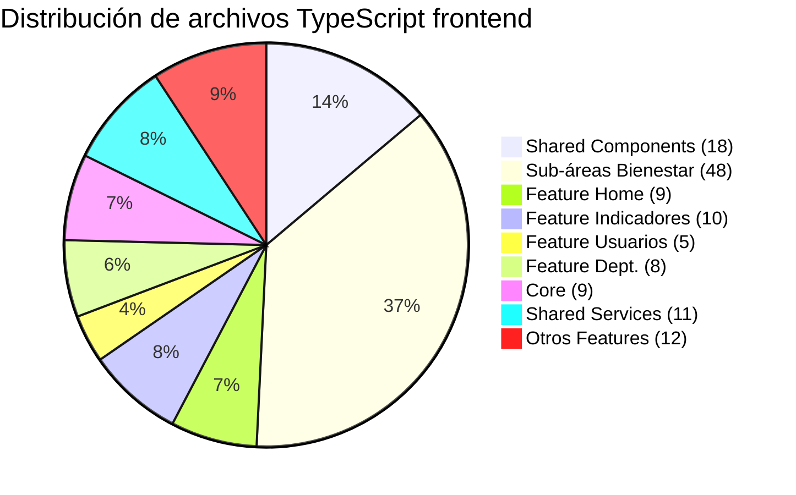
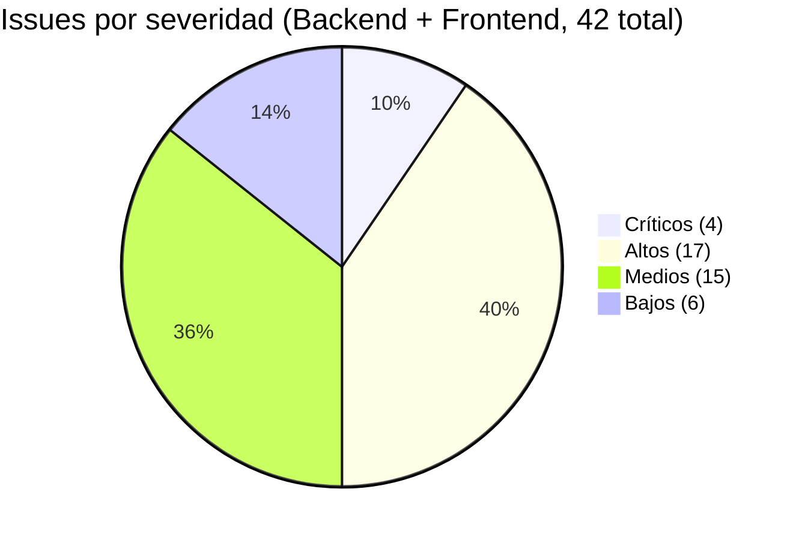
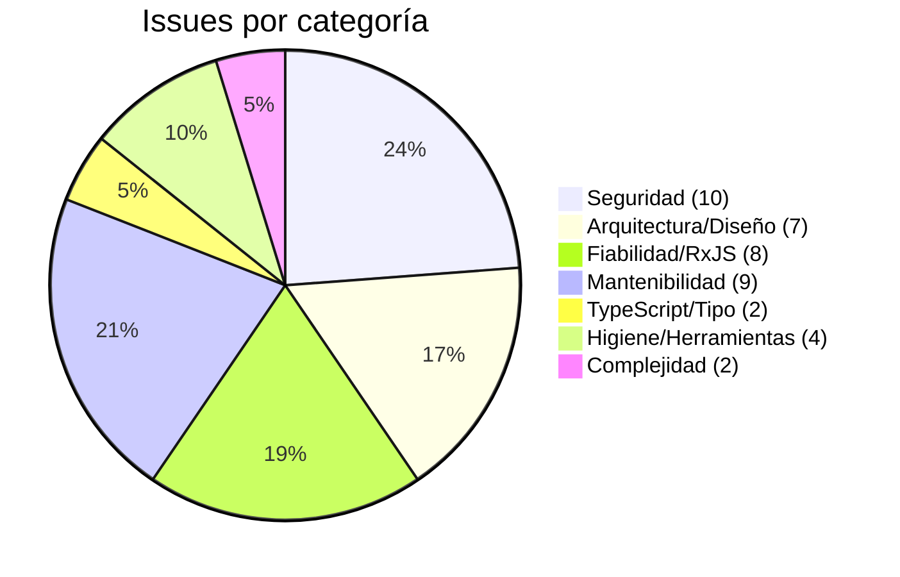
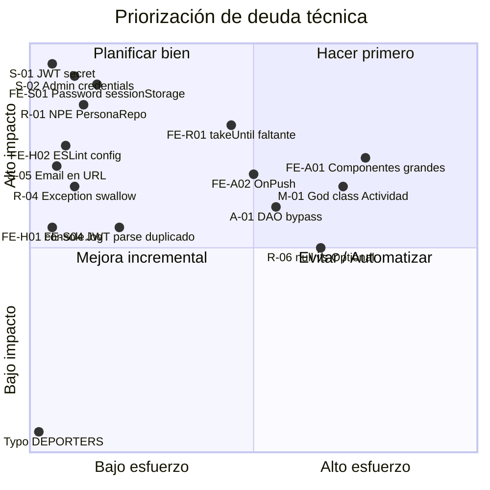

# Artefacto 33 — Análisis de Calidad de Código y Deuda Técnica

| Campo              | Valor                                                         |
|--------------------|---------------------------------------------------------------|
| **Artefacto**      | 33                                                            |
| **Nombre**         | Análisis de Calidad de Código y Deuda Técnica                 |
| **Proyecto**       | SIBE — Sistema de Información de Bienestar y Evangelización    |
| **Versión**        | 1.0                                                           |
| **Fecha**          | 2026-03-27                                                    |
| **Autor**          | Equipo de Desarrollo SIBE                                     |
| **Estado**         | Vigente                                                       |
| **Artefacto anterior** | Pruebas Unitarias y de Integración|

---

## Tabla de Contenido

1. [Visión General](#1-visión-general)
2. [Herramientas de Análisis Estático](#2-herramientas-de-análisis-estático)
3. [Estructura del Código Fuente](#3-estructura-del-código-fuente)
4. [Análisis de Calidad — Backend (Java / Spring Boot)](#4-análisis-de-calidad--backend-java--spring-boot)
   - 4.1 [Problemas de Seguridad](#41-problemas-de-seguridad)
   - 4.2 [Problemas de Fiabilidad](#42-problemas-de-fiabilidad)
   - 4.3 [Problemas de Arquitectura](#43-problemas-de-arquitectura)
   - 4.4 [Problemas de Mantenibilidad](#44-problemas-de-mantenibilidad)
   - 4.5 [Complejidad](#45-complejidad)
   - 4.6 [Buenas Prácticas Identificadas](#46-buenas-prácticas-identificadas)
5. [Análisis de Calidad — Frontend (Angular / TypeScript)](#5-análisis-de-calidad--frontend-angular--typescript)
   - 5.1 [Problemas de Seguridad](#51-problemas-de-seguridad)
   - 5.2 [Problemas de Arquitectura y Diseño](#52-problemas-de-arquitectura-y-diseño)
   - 5.3 [Problemas de Seguridad de Tipos (TypeScript)](#53-problemas-de-seguridad-de-tipos-typescript)
   - 5.4 [Problemas de RxJS y Ciclo de Vida](#54-problemas-de-rxjs-y-ciclo-de-vida)
   - 5.5 [Higiene y Mantenibilidad](#55-higiene-y-mantenibilidad)
   - 5.6 [Buenas Prácticas Identificadas](#56-buenas-prácticas-identificadas)
6. [Inventario Consolidado de Deuda Técnica](#6-inventario-consolidado-de-deuda-técnica)
7. [Diagrama de Distribución de Issues](#7-diagrama-de-distribución-de-issues)
8. [Plan de Remediación Priorizado](#8-plan-de-remediación-priorizado)
9. [Historial de Cambios](#9-historial-de-cambios)

---

## 1. Visión General

Este artefacto documenta el análisis estático de calidad del código fuente del proyecto SIBE, tanto en el backend (Java 17 / Spring Boot 3.5) como en el frontend (Angular 16 / TypeScript 5.1). El análisis se realizó según los estándares de la industria para cada tecnología:

- **Backend**: Criterios equivalentes a los de **SonarQube** (fiabilidad, seguridad, mantenibilidad, complejidad y duplicaciones).
- **Frontend**: Criterios equivalentes a los de **ESLint** con plugins `@typescript-eslint` y `@angular-eslint` (reglas de TypeScript estricto, patrones Angular recomendados y prácticas de RxJS).

> **Nota:** Las métricas de cobertura de código se documentan en el **Artefacto 35**. Este artefacto se limita estrictamente a la calidad del código y la deuda técnica.

El análisis identificó un total de **26 issues en backend** y **28 issues en frontend**, clasificados por severidad (Crítica, Alta, Media, Baja).

---

## 2. Herramientas de Análisis Estático

### Backend — Estado de Herramientas

| Herramienta | Estado en el Proyecto | Observación |
|-------------|----------------------|-------------|
| **SonarQube / SonarCloud** | ❌ No configurado | No se encontró plugin `id 'org.sonarqube'` en `build.gradle` ni archivo `sonar-project.properties`. El análisis de este artefacto simula los criterios SonarQube mediante revisión manual. |
| **Checkstyle** | ❌ No configurado | No se encontró plugin Checkstyle en `build.gradle` |
| **SpotBugs** | ❌ No configurado | No se encontró plugin SpotBugs / FindBugs |
| **JaCoCo** | ✅ Configurado | Plugin `jacoco` aplicado, genera reportes XML/HTML. Ver Artefacto 35. |
| **Compiler (`-Xlint`)** | ✅ Implícito | Java 17 `toolchain` con compilación estricta por defecto |

**Recomendación urgente:** Integrar SonarQube (Community Edition gratuita o SonarCloud) al pipeline CI/CD. Configurar el quality gate mínimo estándar: 0 bloqueantes, 0 críticos, >80% nuevas líneas cubiertas por pruebas.

```groovy
// build.gradle — agregar:
plugins {
    id 'org.sonarqube' version '4.4.1.3373'
}
sonar {
    properties {
        property 'sonar.projectKey', 'sibe-backend'
        property 'sonar.host.url', System.getenv('SONAR_HOST_URL')
        property 'sonar.login', System.getenv('SONAR_TOKEN')
    }
}
```

### Frontend — Estado de Herramientas

| Herramienta | Estado en el Proyecto | Observación |
|-------------|----------------------|-------------|
| **ESLint** | ❌ No configurado | No existe `.eslintrc.json`, `.eslintrc.js` ni `eslint.config.js`. Esta es la deuda técnica de herramientas más urgente del frontend. |
| **`@typescript-eslint`** | ❌ No instalado | No aparece en `devDependencies` de `package.json` |
| **`@angular-eslint`** | ❌ No instalado | No aparece en `devDependencies` ni en `angular.json` bajo `lint` target |
| **TypeScript strict mode** | ✅ Habilitado | `"strict": true`, `"noImplicitReturns": true`, `"noFallthroughCasesInSwitch": true`, `"noImplicitOverride": true`, `"strictTemplates": true` en `tsconfig.json` |
| **Karma / Jasmine** | ✅ Configurado | Para pruebas. Ver Artefacto 33. |

**Recomendación urgente:** Instalar y configurar ESLint con Angular ESLint:

```bash
ng add @angular-eslint/schematics
# Genera automáticamente .eslintrc.json con reglas recomendadas para Angular 16
```

Agregar el script de lint en `package.json`:
```json
"lint": "ng lint",
"lint:fix": "ng lint --fix"
```

---

## 3. Estructura del Código Fuente

### Backend — Distribución de Clases por Capa



| Capa | Sub-paquete | # Clases |
|------|-------------|----------|
| **`aplicacion`** | `comando/` (DTOs de comando) | 22 |
| | `comando/fabrica/` | 22 |
| | `comando/manejador/` | 30 |
| | `consulta/` (manejadores de consulta) | 55 |
| | `puerto/servicio/` | 2 |
| | `transversal/` | 5 |
| | **Subtotal aplicacion** | **136** |
| **`dominio`** | `dto/` | 31 |
| | `enums/` (TipoArea, TipoInterno, TipoParticipante, TipoPrograma) | 4 |
| | `modelo/` | 31 |
| | `puerto/comando/` | 19 |
| | `puerto/consulta/` | 24 |
| | `puerto/servicio/` | 3 |
| | `regla/implementacion/` | 28 |
| | `regla/fabrica/implementacion/` | 28 |
| | `regla/motor/` + `regla/` | 3 |
| | `service/` | 7 |
| | `transversal/constante/` | 12 |
| | `transversal/excepcion/` | 8 |
| | `transversal/utilitarios/` | 5 |
| | `usecase/comando/` | 31 |
| | `usecase/consulta/` | 34 |
| | **Subtotal dominio** | **270** |
| **`infraestructura`** | `adaptador/dao/` | 44 |
| | `adaptador/entidad/` | 44 |
| | `adaptador/mapeador/` | 46 |
| | `adaptador/repositorio/comando/` | 19 |
| | `adaptador/repositorio/consulta/` | 24 |
| | `adaptador/servicio/` | 6 |
| | `configuracion/bean/` + `configuracion/dataloader/` | 24 |
| | `controlador/` | 22 |
| | `error/` | 2 |
| | `seguridad/` | 8 |
| | **Subtotal infraestructura** | **~239** |
| | **TOTAL BACKEND** | **~645** |

### Frontend — Distribución de Componentes y Servicios



| Categoría | # Componentes / Servicios |
|-----------|--------------------------|
| Core (components, guards, interceptors, services) | 9 |
| Feature — Home + sub-áreas Bienestar | 57 |
| Feature — Login | 2 |
| Feature — Gestión de Departamento | 8 |
| Feature — Gestión de Indicadores | 10 |
| Feature — Gestión de Usuarios | 5 |
| Feature — Recuperación de Contraseña | 2 |
| Shared Components | 18 |
| Shared Services | 11 |
| **TOTAL** | **~122** |

---

## 4. Análisis de Calidad — Backend (Java / Spring Boot)

### Criterios SonarQube aplicados

Los siguientes **tipos de regla SonarQube** fueron aplicados al análisis manual:

| Tipo SonarQube | Descripción |
|----------------|-------------|
| `hotspot` | Punto de seguridad que requiere revisión manual |
| `bug` | Defecto que puede causar comportamiento incorrecto |
| `code_smell` | Código que dificulta la mantenibilidad |
| `vulnerability` | Defecto de seguridad explotable |

---

### 4.1 Problemas de Seguridad

#### 🔴 S-01 — Secreto JWT hardcodeado en código fuente

| Campo | Detalle |
|-------|---------|
| **Tipo SonarQube** | `vulnerability` |
| **Severidad** | **Crítica** |
| **Archivo** | [dominio/transversal/constante/SeguridadConstante.java](../../SIBEBackend/src/main/java/co/edu/uco/sibe/dominio/transversal/constante/SeguridadConstante.java) |
| **Línea aprox.** | 6 |
| **Regla SonarQube** | `java:S6418` — Hard-coded credentials |

**Código comprometido:**
```java
public static final String JWT_KEY = "jxgEQeXHuPq8VdbyYFNkANdudQ53YUn4";
```

**Descripción:** La clave HMAC-SHA utilizada para firmar y verificar todos los tokens JWT está escrita en texto plano en el código fuente. Cualquier persona con acceso al repositorio puede forjar tokens válidos para cualquier usuario, incluyendo administradores — equivale a una vulnerabilidad de elusión de autenticación total.

**Remediación:**
```java
// application.properties
app.jwt.secret=${JWT_SECRET}

// En la clase de configuración
@Value("${app.jwt.secret}")
private String jwtSecret;
```

---

#### 🔴 S-02 — Credenciales de administrador por defecto hardcodeadas

| Campo | Detalle |
|-------|---------|
| **Tipo SonarQube** | `vulnerability` |
| **Severidad** | **Crítica** |
| **Archivo** | [dominio/transversal/constante/DatoConstante.java](../../SIBEBackend/src/main/java/co/edu/uco/sibe/dominio/transversal/constante/DatoConstante.java) |
| **Líneas aprox.** | 61–65 |
| **Regla SonarQube** | `java:S2068` — Hard-coded passwords |

**Código comprometido:**
```java
public static final String NUMERO_ID_ADMIN  = "1111111111";
public static final String NOMBRE_ADMIN     = "Administrador";
public static final String APELLIDO_ADMIN   = "UCO";
public static final String EMAIL_ADMIN      = "administrador@uco.net.co";
public static final String CLAVE_ADMIN      = "Administrador123";
```

**Descripción:** Los datos del usuario administrador inicial (incluyendo contraseña en texto claro) están expuestos en el repositorio. Cualquier atacante conoce la contraseña predeterminada que aplicará BCrypt al hacer el seed de la base de datos en cualquier nuevo despliegue.

**Remediación:** Mover a `application.properties` con perfil `local` o usar variables de entorno. Nunca almacenar contraseñas predeterminadas en código fuente.

---

#### 🟠 S-03 — Tiempo de vida de JWT excesivamente largo

| Campo | Detalle |
|-------|---------|
| **Tipo SonarQube** | `hotspot` |
| **Severidad** | **Alta** |
| **Archivos** | [dominio/transversal/constante/NumeroConstante.java](../../SIBEBackend/src/main/java/co/edu/uco/sibe/dominio/transversal/constante/NumeroConstante.java) / [infraestructura/seguridad/filter/JWTTokenGeneratorFilter.java](../../SIBEBackend/src/main/java/co/edu/uco/sibe/infraestructura/seguridad/filter/JWTTokenGeneratorFilter.java) |
| **Regla SonarQube** | `java:S5659` — JWT signing validation |

**Código:**
```java
public static final int TREINTA_MILLONES = 30000000; // ms = 8.33 horas
// En JWTTokenGeneratorFilter:
.setExpiration(new Date((new Date()).getTime() + TREINTA_MILLONES))
```

**Descripción:** Los tokens JWT con vida de 8.33 horas y sin mecanismo de revocación (no hay lista negra de tokens, no hay endpoint de logout que invalide el token del lado servidor) exponen al sistema a un riesgo elevado de abuso de tokens robados durante toda esa ventana de tiempo.

**Remediación:** Reducir a 15–30 minutos. Implementar un endpoint de refresh token. Considerar una lista negra en Redis para tokens invalidados por logout.

---

#### 🟠 S-04 — Fuga de información técnica en respuestas de error

| Campo | Detalle |
|-------|---------|
| **Tipo SonarQube** | `vulnerability` |
| **Severidad** | **Alta** |
| **Archivo** | [infraestructura/error/ManejadorError.java](../../SIBEBackend/src/main/java/co/edu/uco/sibe/infraestructura/error/ManejadorError.java) |
| **Líneas aprox.** | 24, 37 |
| **Regla SonarQube** | `java:S1989` — Exception exposure |

**Código comprometido:**
```java
CODIGOS_ESTADO.put(NullPointerException.class.getSimpleName(), HttpStatus.BAD_REQUEST.value());
// ...
String excepcionNombre = exception.getClass().getSimpleName(); // "NullPointerException"
String mensaje         = exception.getMessage();               // mensaje interno de la JVM
Error error = new Error(excepcionNombre, mensaje);             // ← enviado al cliente
```

**Descripción:** El handler global de excepciones expone el nombre de la clase Java interna (`NullPointerException`, `ValorObligatorioExcepcion`) y el mensaje raw de la excepción en el cuerpo HTTP de la respuesta. Esto filtra información sobre la estructura interna del sistema (nombres de módulos, paths de código, convenciones de nomenclatura) que facilita la enumeración de vulnerabilidades.

**Remediación:** Usar un enum de códigos de error de negocio (`VALOR_OBLIGATORIO`, `VALOR_DUPLICADO`, etc.) para la respuesta al cliente. El mensaje técnico solo debe registrarse en el servidor (logger).

---

#### 🟠 S-05 — Correo electrónico (PII) expuesto en URL de ruta

| Campo | Detalle |
|-------|---------|
| **Tipo SonarQube** | `hotspot` |
| **Severidad** | **Alta** |
| **Archivo** | [infraestructura/controlador/comando/UsuarioComandoControlador.java](../../SIBEBackend/src/main/java/co/edu/uco/sibe/infraestructura/controlador/comando/UsuarioComandoControlador.java) |
| **Línea aprox.** | 47 |
| **Regla SonarQube** | `java:S4684` — Sensitive data in URL |

**Código:**
```java
@PostMapping(SOLICITAR_CODIGO_PATH)
public ComandoRespuesta<UUID> solicitarCodigo(@PathVariable String correo) {
```

**Descripción:** La dirección de correo electrónico (dato de carácter personal según GDPR/Ley 1581) se transmite como variable de ruta en la URL. Esto hace que el email quede registrado en logs de acceso del servidor, historial del navegador y proxies de red en texto plano.

**Remediación:** Recibir el correo en el cuerpo del `@RequestBody` de la petición POST.

---

#### 🟠 S-06 — CORS hardcodeado a localhost

| Campo | Detalle |
|-------|---------|
| **Tipo SonarQube** | `hotspot` |
| **Severidad** | **Alta** |
| **Archivo** | [infraestructura/seguridad/configuration/ProjectSecurityConfig.java](../../SIBEBackend/src/main/java/co/edu/uco/sibe/infraestructura/seguridad/configuration/ProjectSecurityConfig.java) |
| **Regla SonarQube** | `java:S5122` — CORS permissiveness |

**Código:**
```java
config.setAllowedOrigins(List.of("http://localhost:4200")); // hardcoded
```

**Descripción:** El origen permitido por CORS está fijado a `http://localhost:4200`, lo que funciona únicamente en desarrollo local. En un despliegue de producción, el valor debe cambiarse manualmente en el código y redesplegar la aplicación, lo cual es propenso a errores. Adicionalmente, la URL usa `http://` (sin TLS).

**Remediación:**
```java
// application.properties
app.cors.allowed-origins=${FRONTEND_URL:http://localhost:4200}

// ProjectSecurityConfig.java
@Value("${app.cors.allowed-origins}")
private String allowedOrigins;
config.setAllowedOrigins(List.of(allowedOrigins));
```

---

### 4.2 Problemas de Fiabilidad

#### 🔴 R-01 — Riesgo de NullPointerException en PersonaRepositorioConsultaImplementacion

| Campo | Detalle |
|-------|---------|
| **Tipo SonarQube** | `bug` |
| **Severidad** | **Crítica** |
| **Archivo** | [infraestructura/adaptador/repositorio/consulta/PersonaRepositorioConsultaImplementacion.java](../../SIBEBackend/src/main/java/co/edu/uco/sibe/infraestructura/adaptador/repositorio/consulta/PersonaRepositorioConsultaImplementacion.java) |
| **Líneas aprox.** | 44, 58, 75, 93, 113 |
| **Regla SonarQube** | `java:S2259` — Null dereference |

**Código comprometido:**
```java
var usuarioEntidad = this.usuarioDAO.findByCorreo(entidad.getCorreo()); // puede retornar null
if (!usuarioEntidad.isEstaActivo()) { return null; }  // NPE si usuarioEntidad == null
```

**Descripción:** El método `findByCorreo` en el DAO no está definido con `Optional<>`, retorna `null` cuando no encuentra el registro. La línea siguiente llama a `.isEstaActivo()` sin verificar nulidad. Este patrón se repite en 5 métodos del mismo archivo. Una inconsistencia de datos (registro en `persona` sin su correspondiente en `usuario`) provocaría un `NullPointerException` en producción.

**Remediación:**
```java
var usuarioEntidad = this.usuarioDAO.findByCorreo(entidad.getCorreo());
if (esNulo(usuarioEntidad) || !usuarioEntidad.isEstaActivo()) { return null; }
```

---

#### 🟠 R-02 — Campo muerto (dead code) en LoginUseCase

| Campo | Detalle |
|-------|---------|
| **Tipo SonarQube** | `code_smell` |
| **Severidad** | **Alta** |
| **Archivo** | [dominio/usecase/comando/LoginUseCase.java](../../SIBEBackend/src/main/java/co/edu/uco/sibe/dominio/usecase/comando/LoginUseCase.java) |
| **Líneas aprox.** | 12, 14 |
| **Regla SonarQube** | `java:S1068` — Unused private fields |

**Código:**
```java
public class LoginUseCase {
    private final PersonaRepositorioConsulta personaRepositorioConsulta;
    private final EncriptarClaveServicio encriptarClaveServicio; // NUNCA SE USA
```

**Descripción:** `encriptarClaveServicio` es inyectado vía constructor y almacenado, pero nunca referenciado en ningún método del caso de uso. Además de ser código muerto, induce a error al revisor (sugiere falsamente que la verificación de clave ocurre aquí).

**Remediación:** Eliminar el campo y el parámetro correspondiente del constructor.

---

#### 🟠 R-03 — Consulta doble a base de datos en LoginUseCase

| Campo | Detalle |
|-------|---------|
| **Tipo SonarQube** | `bug` |
| **Severidad** | **Alta** |
| **Archivo** | [dominio/usecase/comando/LoginUseCase.java](../../SIBEBackend/src/main/java/co/edu/uco/sibe/dominio/usecase/comando/LoginUseCase.java) |
| **Líneas aprox.** | 19–23 |
| **Regla SonarQube** | `java:S4144` — Redundant method call |

**Código:**
```java
public UUID ejecutar(String correo) {
    validarSiNoExisteUsuarioConCorreo(correo);   // → consultarUsuarioPorCorreo() — Query 1, resultado descartado
    return personaRepositorioConsulta
        .consultarUsuarioPorCorreo(correo)       // → Query 2, mismo dato
        .getIdentificador();
}
```

**Descripción:** La misma consulta a base de datos se ejecuta dos veces para el mismo argumento. El resultado de la primera consulta es descartado por completo, aumentando innecesariamente la carga sobre la base de datos.

**Remediación:**
```java
public UUID ejecutar(String correo) {
    var persona = personaRepositorioConsulta.consultarUsuarioPorCorreo(correo);
    if (esNulo(persona)) throw new AuthorizationException(USUARIO_O_CLAVE_INCORRECTO);
    return persona.getIdentificador();
}
```

---

#### 🟠 R-04 — Excepción silenciada (exception swallowing)

| Campo | Detalle |
|-------|---------|
| **Tipo SonarQube** | `bug` |
| **Severidad** | **Alta** |
| **Archivo** | [infraestructura/adaptador/repositorio/consulta/ActividadRepositorioConsultaImplementacion.java](../../SIBEBackend/src/main/java/co/edu/uco/sibe/infraestructura/adaptador/repositorio/consulta/ActividadRepositorioConsultaImplementacion.java) |
| **Líneas aprox.** | ~410–416 |
| **Regla SonarQube** | `java:S2221` — Exception eaten |

**Código:**
```java
try {
    // ... parseo del nombre de mes a número ...
    parametros.put(PARAM_MES_VALOR, numeroMes);
} catch (Exception ignored) {  // silenciado sin registro
}
```

**Descripción:** Si el campo `mes` del filtro contiene un valor malformado o no reconocido, el parseo falla silenciosamente. El filtro de mes se omite y la consulta retorna resultados sin restricción de mes, potencialmente devolviendo un conjunto de datos mucho mayor del esperado. Este comportamiento es invisible para el cliente y para el desarrollador.

**Remediación:** Validar el campo `mes` en la capa de comando/controlador antes de llegue al repositorio. Registrar al menos un `log.warn()` si la excepción es tolerable.

---

#### 🟡 R-05 — Llamada sin efecto (dead statement)

| Campo | Detalle |
|-------|---------|
| **Tipo SonarQube** | `code_smell` |
| **Severidad** | **Media** |
| **Archivo** | [infraestructura/seguridad/filter/JWTTokenGeneratorFilter.java](../../SIBEBackend/src/main/java/co/edu/uco/sibe/infraestructura/seguridad/filter/JWTTokenGeneratorFilter.java) |
| **Línea aprox.** | 62 |
| **Regla SonarQube** | `java:S2201` — Return value ignored |

**Código:**
```java
authentication.getPrincipal(); // ← retorno ignorado, ningún efecto secundario
```

**Descripción:** `getPrincipal()` es un getter que retorna un objeto. El valor retornado nunca se asigna ni se usa. La sentencia no tiene ningún efecto y es claramente un artefacto de depuración.

**Remediación:** Eliminar la línea.

---

#### 🟡 R-06 — Retorno null en lugar de Optional a través de ~24 repositorios

| Campo | Detalle |
|-------|---------|
| **Tipo SonarQube** | `code_smell` |
| **Severidad** | **Media** |
| **Archivos** | Todos los `*RepositorioConsultaImplementacion.java` (~24 clases) |
| **Regla SonarQube** | `java:S2789` — Null returns should use Optional |

**Código representativo:**
```java
var entidad = this.actividadDAO.findById(identificador).orElse(null);
if (esNulo(entidad)) { return null; }
return this.actividadMapeador.construirModelo(entidad);
```

**Descripción:** Los métodos de los puertos de repositorio retornan `null` para señalar "no encontrado". Esto obliga a cada llamador a realizar una verificación de nulidad, y omitir una sola produce un `NullPointerException` en producción (como ocurre en R-01). `Optional<T>` es la alternativa type-safe idiomática en Java 8+.

**Remediación:** Cambiar firmas de puerto a `Optional<Actividad> consultarPorIdentificador(UUID id)`.

---

### 4.3 Problemas de Arquitectura

#### 🟠 A-01 — Filtro de seguridad accede directamente a DAOs (violación hexagonal)

| Campo | Detalle |
|-------|---------|
| **Tipo SonarQube** | `code_smell` |
| **Severidad** | **Alta** |
| **Archivos** | [infraestructura/seguridad/filter/JWTTokenGeneratorFilter.java](../../SIBEBackend/src/main/java/co/edu/uco/sibe/infraestructura/seguridad/filter/JWTTokenGeneratorFilter.java) / [infraestructura/seguridad/configuration/ProjectSecurityConfig.java](../../SIBEBackend/src/main/java/co/edu/uco/sibe/infraestructura/seguridad/configuration/ProjectSecurityConfig.java) |
| **Regla** | Violación de Arquitectura Hexagonal — acceso directo a adaptadores desde otro adaptador |

**Código:**
```java
import co.edu.uco.sibe.infraestructura.adaptador.dao.UsuarioDAO;
import co.edu.uco.sibe.infraestructura.adaptador.dao.UsuarioOrganizacionDAO;
// ...
new JWTTokenGeneratorFilter(usuarioOrganizacionDAO, usuarioDAO)
```

**Descripción:** El filtro de seguridad genera tokens JWT mediante acceso directo a dos interfaces DAO JPA, saltando completamente los puertos de dominio definidos en `dominio/puerto/consulta/`. Esto viola la arquitectura hexagonal: la capa de infraestructura (filtro de seguridad) depende de otra capa de infraestructura (DAOs) en lugar de depender de los puertos de dominio, eludiendo toda la lógica de mapeo y validación de negocio.

**Remediación:** Inyectar `PersonaRepositorioConsulta` y `UsuarioOrganizacionRepositorioConsulta` (puertos de dominio) en lugar de los DAOs directamente.

---

#### 🟠 A-02 — Repositorio de Actividad agrega responsabilidades de múltiples agregados

| Campo | Detalle |
|-------|---------|
| **Tipo SonarQube** | `code_smell` |
| **Severidad** | **Alta** |
| **Archivo** | [infraestructura/adaptador/repositorio/consulta/ActividadRepositorioConsultaImplementacion.java](../../SIBEBackend/src/main/java/co/edu/uco/sibe/infraestructura/adaptador/repositorio/consulta/ActividadRepositorioConsultaImplementacion.java) |
| **Líneas aprox.** | 39–44 |
| **Regla** | Violación del Principio de Responsabilidad Única (SRP) |

**Código:**
```java
public class ActividadRepositorioConsultaImplementacion implements ActividadRepositorioConsulta {
    private final DireccionDAO direccionDAO;  // ← responsabilidad de DireccionRepositorio
    private final AreaDAO areaDAO;            // ← responsabilidad de AreaRepositorio
    private final SubareaDAO subareaDAO;      // ← responsabilidad de SubareaRepositorio
```

**Descripción:** El repositorio de consulta de actividades inyecta tres DAOs pertenecientes a otros agregados independientes (`Direccion`, `Area`, `Subarea`) para realizar traversal de jerarquía organizacional y cálculo de estadísticas. Esto fusiona múltiples responsabilidades y crea acoplamiento cruzado de agregados.

**Remediación:** Extraer la lógica de estadísticas a una clase `EstadisticaRepositorioConsultaImplementacion` que posea esos DAOs y sea inyectada donde se necesite.

---

### 4.4 Problemas de Mantenibilidad

#### 🟠 M-01 — Clase God (ActividadRepositorioConsultaImplementacion, 510 líneas)

| Campo | Detalle |
|-------|---------|
| **Tipo SonarQube** | `code_smell` |
| **Severidad** | **Alta** |
| **Archivo** | [infraestructura/adaptador/repositorio/consulta/ActividadRepositorioConsultaImplementacion.java](../../SIBEBackend/src/main/java/co/edu/uco/sibe/infraestructura/adaptador/repositorio/consulta/ActividadRepositorioConsultaImplementacion.java) |
| **Regla SonarQube** | `java:S6829` — Classes should not be too large |

**Descripción:** Con **510 líneas**, es la clase más grande del backend. Gestiona simultáneamente: consultas CRUD de actividades, consultas de ejecuciones, consultas de participantes, cálculo de estadísticas por estructura organizacional, construcción dinámica de JPQL, conteo de población total y traversal de jerarquía organizacional. Cada una de estas responsabilidades debería ser una clase independiente.

**Remediación sugerida:**
```
ActividadRepositorioConsultaImplementacion     → consultas core (CRUD/ejecuciones)
EstadisticaRepositorioConsultaImplementacion   → estadísticas y agrupaciones
PoblacionRepositorioConsultaImplementacion     → conteo de población
```

---

#### 🟠 M-02 — Métodos de alta complejidad ciclomática

| Campo | Detalle |
|-------|---------|
| **Tipo SonarQube** | `code_smell` |
| **Severidad** | **Alta** |
| **Archivos** | `ActividadRepositorioConsultaImplementacion.java` (CC≈13 en `contarPoblacionTotal`), `AutorizacionContextoOrganizacionalServicio.java` (CC≈10 en `validarAccesoAActividad`) |
| **Regla SonarQube** | `java:S3776` — Cognitive Complexity (umbral recomendado: ≤15) |

| Método | Clase | CC Estimada | Líneas |
|--------|-------|-------------|--------|
| `contarPoblacionTotal` | `ActividadRepositorioConsultaImplementacion` | ~13 | ~80 |
| `ejecutarConsultaDinamica` | `ActividadRepositorioConsultaImplementacion` | ~11 | ~80 |
| `validarAccesoAActividad` | `AutorizacionContextoOrganizacionalServicio` | ~10 | ~35 |

**Remediación:** Extraer cada bloque de rol en `validarAccesoAActividad` a su propio método privado. Extraer el bloque POSTGRADO/PREGRADO a un helper `agregarFiltroProgramaAcademico`.

---

#### 🟡 M-03 — Anotación JPA incorrecta en entidad de Actividad

| Campo | Detalle |
|-------|---------|
| **Tipo SonarQube** | `bug` |
| **Severidad** | **Media** |
| **Archivo** | [infraestructura/adaptador/entidad/ActividadEntidad.java](../../SIBEBackend/src/main/java/co/edu/uco/sibe/infraestructura/adaptador/entidad/ActividadEntidad.java) |
| **Líneas aprox.** | 41–44 |
| **Regla SonarQube** | `java:S3899` — JPA annotations |

**Código comprometido:**
```java
@JoinColumn(name = CAMPO_COLABORADOR, nullable = false)
private UUID colaborador;  // ← UUID simple, sin @ManyToOne ni @OneToOne

@JoinColumn(name = CAMPO_CREADOR, nullable = false)
private UUID creador;
```

**Descripción:** `@JoinColumn` es una anotación de relación JPA diseñada para usarse con `@ManyToOne`, `@OneToOne`, etc. Aplicada sobre un campo `UUID` plano sin anotación de relación, su comportamiento es indefinido/dependiente del proveedor JPA. La restricción `nullable = false` puede o no reflejarse en el DDL.

**Remediación:** Reemplazar con `@Column(name = CAMPO_COLABORADOR, nullable = false)`.

---

#### 🟡 M-04 — Lógica JPQL duplicada en constantes de dominio

| Campo | Detalle |
|-------|---------|
| **Tipo SonarQube** | `code_smell` |
| **Severidad** | **Media** |
| **Archivos** | `ActividadRepositorioConsultaImplementacion.java`, `PersistenciaConstante.java` |
| **Regla SonarQube** | `java:S4144` — Duplicated code |

**Descripción:** Fragmentos JPQL de filtrado POSTGRADO/PREGRADO aparecen inline en múltiples bloques de `contarPoblacionTotal`, a pesar de que las constantes `AND_POSTGRADO`/`AND_PREGRADO` ya existen en `PersistenciaConstante`. Las versiones inline no reutilizan esas constantes. Además, `PersistenciaConstante` mezcla nombres de tabla/columna con cadenas JPQL completas (hasta 200 caracteres por línea), mezclando responsabilidades de dominio con conocimiento de infraestructura JPA.

**Remediación:** Usar `AND_POSTGRADO`/`AND_PREGRADO` de manera consistente. Mover las cadenas JPQL a las interfaces DAO (mediante `@Query`) y reservar `PersistenciaConstante` solo para nombres de tabla y columna.

---

#### 🟡 M-05 — Clase de configuración excessivamente grande (UseCaseBean, 472 líneas)

| Campo | Detalle |
|-------|---------|
| **Tipo SonarQube** | `code_smell` |
| **Severidad** | **Media** |
| **Archivo** | [infraestructura/configuracion/bean/UseCaseBean.java](../../SIBEBackend/src/main/java/co/edu/uco/sibe/infraestructura/configuracion/bean/UseCaseBean.java) |
| **Regla SonarQube** | `java:S6829` — Classes should not be too large |

**Descripción:** Una única clase `@Configuration` de 472 líneas registra manualmente todos los ~65 beans de casos de uso. Aunque el patrón de DI explícita es correcto en arquitectura hexagonal, tener toda la configuración en un solo archivo genera conflictos de merge frecuentes en trabajo en equipo y baja legibilidad.

**Remediación:** Dividir en múltiples clases de configuración temáticas: `UsuarioUseCaseBeanConfig`, `ActividadUseCaseBeanConfig`, `EstadisticaUseCaseBeanConfig`, etc.

---

#### 🟡 M-06 — NPE mapeado a HTTP 400 en manejador de errores

| Campo | Detalle |
|-------|---------|
| **Tipo SonarQube** | `code_smell` |
| **Severidad** | **Media** |
| **Archivo** | [infraestructura/error/ManejadorError.java](../../SIBEBackend/src/main/java/co/edu/uco/sibe/infraestructura/error/ManejadorError.java) |
| **Línea aprox.** | 22–28 |
| **Regla SonarQube** | `java:S1983` — Exception handling |

**Código:**
```java
CODIGOS_ESTADO.put(NullPointerException.class.getSimpleName(), HttpStatus.BAD_REQUEST.value());
```

**Descripción:** `NullPointerException` es un error de programador (bug lógico), no un error de validación de entrada de usuario. Mapearlo a `400 BAD_REQUEST` confunde a los clientes API haciéndoles creer que enviaron datos inválidos cuando en realidad es un defecto del servidor. Adicionalmente, el mapa usa `getSimpleName()` como clave string, sin seguridad en tiempo de compilación.

**Remediación:** Eliminar `NullPointerException` del mapa de excepciones conocidas. Usar un handler genérico `500 INTERNAL_SERVER_ERROR` para excepciones no controladas.

---

#### 🔵 M-07 — Typo en nombre de constante

| Campo | Detalle |
|-------|---------|
| **Tipo SonarQube** | `code_smell` |
| **Severidad** | **Baja** |
| **Archivo** | [dominio/transversal/constante/DatoConstante.java](../../SIBEBackend/src/main/java/co/edu/uco/sibe/dominio/transversal/constante/DatoConstante.java) |
| **Línea aprox.** | 36 |

**Código:**
```java
public static final String NOMBRE_SUB_AREA_DEPORTERS = "Deportes";
//                                             ↑ anglicismo incorrecto
```

**Remediación:** Renombrar a `NOMBRE_SUB_AREA_DEPORTES`.

---

#### 🔵 M-08 — Carácter acentuado en nombre de archivo fuente Java

| Campo | Detalle |
|-------|---------|
| **Tipo SonarQube** | `code_smell` |
| **Severidad** | **Baja** |
| **Archivo** | `infraestructura/adaptador/repositorio/comando/PublicoInteresRepositorioComandoImplementación.java` |
| **Regla SonarQube** | `java:S100` — Naming conventions |

**Descripción:** El nombre de archivo usa `ó` acentuada, mientras que todas las demás implementaciones usan `Implementacion` sin acento. Puede causar problemas en sistemas de archivos Linux (case-sensitive), clonación Git cross-platform e indexación de IDE.

**Remediación:** Renombrar a `PublicoInteresRepositorioComandoImplementacion.java`.

---

### 4.5 Complejidad

#### 🟡 C-01 — Constructor dinámico de JPQL via StringBuilder

| Campo | Detalle |
|-------|---------|
| **Tipo SonarQube** | `code_smell` |
| **Severidad** | **Media** |
| **Archivo** | [infraestructura/adaptador/repositorio/consulta/ActividadRepositorioConsultaImplementacion.java](../../SIBEBackend/src/main/java/co/edu/uco/sibe/infraestructura/adaptador/repositorio/consulta/ActividadRepositorioConsultaImplementacion.java) |
| **Líneas aprox.** | 66–510 |
| **Regla SonarQube** | `java:S1192` — Cognitive complexity |

**Descripción:** Múltiples métodos construyen sentencias JPQL dinámicamente usando concatenación de `StringBuilder`. Aunque se usan named parameters (no hay riesgo de inyección JPQL), el patrón dificulta el análisis estático, la revisión de código y el mantenimiento. Se mezclan ramas de lógica de negocio con construcción de strings de consulta.

**Remediación:** Evaluar el uso de `JpaSpecificationExecutor<T>` (Spring Data Specifications) o Querydsl para consultas dinámicas type-safe.

---

#### 🔵 C-02 — Inicialización estática eager de 28 motores de reglas

| Campo | Detalle |
|-------|---------|
| **Tipo SonarQube** | `code_smell` |
| **Severidad** | **Baja** |
| **Archivo** | [dominio/regla/fabrica/MotoresFabrica.java](../../SIBEBackend/src/main/java/co/edu/uco/sibe/dominio/regla/fabrica/MotoresFabrica.java) |
| **Líneas aprox.** | 31–58 |

**Descripción:** 28 instancias de motor de reglas son inicializadas eagerly en un bloque `static {}`. Cualquier excepción durante la inicialización produce un `ExceptionInInitializerError` que crashea la JVM con un mensaje de error confuso al arrancar.

**Remediación:** La prueba de integración (`ApplicationTests::contextLoads`) actualmente actúa como red de seguridad para detectar estos fallos de inicialización. Es suficiente en el estado actual, pero el patrón debería evolucionar hacia inicialización lazy conforme el número de motores crezca.

---

### 4.6 Buenas Prácticas Identificadas

El backend muestra un nivel de madurez arquitectónico alto en varias dimensiones:

| Práctica | Descripción |
|----------|-------------|
| ✅ **Dominio sin Spring** | Los modelos, use cases y reglas de dominio no tienen ninguna anotación de Spring. Pureza total de dominio. |
| ✅ **Puertos hexagonales consistentes** | ~130 clases de aplicación usan exclusivamente interfaces de dominio (`XxxRepositorioConsulta`, `XxxRepositorioComando`). |
| ✅ **DI explícita via UseCaseBean** | Ningún `@Component` en la capa de dominio. El grafo de objetos está totalmente controlado. |
| ✅ **Motor de Reglas reutilizable** | Patrón `MotorRegla<T>` / `Regla<T>` bien diseñado. Validaciones centralizadas por entidad en `XxxRegla`. |
| ✅ **Fábricas estáticas en modelos** | Constructor `private` + `static construir(...)` en todos los modelos de dominio. |
| ✅ **BCrypt para contraseñas** | `BCryptPasswordEncoder` usado correctamente. |
| ✅ **Constants classes exhaustivas** | Prácticamente cero literals mágicos en el código de lógica. |
| ✅ **CQRS end-to-end** | Separación comando/consulta mantenida desde controlador hasta repositorio. |
| ✅ **@PreAuthorize** | Seguridad de método aplicada consistentemente en todos los endpoints mutantes. |
| ✅ **JPQL parametrizado** | Todos los `@Query` usan named parameters (`:param`). Cero riesgo de inyección SQL/JPQL. |

---

## 5. Análisis de Calidad — Frontend (Angular / TypeScript)

### Criterios ESLint aplicados

Los siguientes **grupos de reglas ESLint** fueron aplicados al análisis:

| Grupo de Reglas ESLint | Descripción |
|------------------------|-------------|
| `@typescript-eslint` | Reglas de TypeScript estricto |
| `@angular-eslint/component-selector` | Convenciones de componentes Angular |
| `rxjs/no-ignored-observable` | Gestión de subscripciones RxJS |
| `security/*` | Prácticas de seguridad frontend |

---

### 5.1 Problemas de Seguridad

#### 🔴 FE-S01 — Contraseña almacenada en sessionStorage

| Campo | Detalle |
|-------|---------|
| **Regla ESLint equiv.** | `security/detect-non-literal-fs-filename` / revisión manual |
| **Severidad** | **Crítica** |
| **Archivo** | [core/interceptor/auth-interceptor.ts](../../SIBEFrontend/src/app/core/interceptor/auth-interceptor.ts) |

**Código:**
```typescript
// El interceptor lee userdetails de sessionStorage
// userdetails contiene: { username: "correo@uco.net.co", password: "Contraseña123" }
const userDetails = JSON.parse(sessionStorage.getItem('userdetails') || '{}');
const credentials = btoa(`${userDetails.username}:${userDetails.password}`);
// Se usa para generar Basic Auth header
```

**Descripción:** La contraseña del usuario se almacena en texto base64 en `sessionStorage`, accesible desde cualquier script JavaScript de la página (XSS). Si un atacante inyecta código JS (XSS), puede exfiltrar credenciales directamente.

**Remediación:** No almacenar contraseñas en ningún almacenamiento del navegador. Usar únicamente tokens de corta duración (JWT Bearer) en cookies `HttpOnly; Secure; SameSite=Strict`.

---

#### 🟠 FE-S02 — Dos interceptores HTTP con estrategias de token incompatibles

| Campo | Detalle |
|-------|---------|
| **Severidad** | **Alta** |
| **Archivos** | [core/interceptor/auth-interceptor.ts](../../SIBEFrontend/src/app/core/interceptor/auth-interceptor.ts) + [core/interceptor/token-interceptor.ts](../../SIBEFrontend/src/app/core/interceptor/token-interceptor.ts) |

**Descripción:** El sistema tiene dos interceptores HTTP registrados simultáneamente con estrategias de autenticación incompatibles:

| Interceptor | Dónde lee el token | Estrategia |
|-------------|-------------------|------------|
| `auth-interceptor.ts` | `sessionStorage.getItem('userdetails')` | Basic Auth (username:password en Base64) |
| `token-interceptor.ts` | `CookieService.get('token')` | Bearer JWT |

Ambos pueden agregar `Authorization` en la misma petición. No existe un contrato compartido para el logout (cada uno limpia cosas diferentes). La guardia de ruta `security.guard.ts` lee de `sessionStorage.getItem('Authorization')` — una tercera fuente.

**Remediación:** Consolidar en un único interceptor que use JWT Bearer almacenado en cookie `HttpOnly`. Eliminar el interceptor de Basic Auth.

---

#### 🟠 FE-S03 — Ruta de navegación protegida solo en cliente

| Campo | Detalle |
|-------|---------|
| **Severidad** | **Alta** |
| **Archivo** | [core/guard/security.guard.ts](../../SIBEFrontend/src/app/core/guard/security.guard.ts) |
| **Regla ESLint equiv.** | Revisión manual de seguridad |

**Descripción:** `security.guard.ts` implementa autorización por rol leyendo el JWT desde `sessionStorage` y comparando el rol (`COLABORADOR`, `ADMINISTRADOR_AREA`, etc.) con rutas permitidas. Modificar el valor `Authorization` en `sessionStorage` desde la consola del navegador puede eludir la guardia completamente. La validación real de autorización **solo existe en el backend** (`@PreAuthorize`); la guardia del frontend es únicamente una mejora de experiencia de usuario.

**Situación aceptable si:** el backend valida el rol en cada petición, lo cual sí hace con `@PreAuthorize`. Documentar explícitamente que la guardia es UX-only.

---

#### 🟠 FE-S04 — Lógica de parseo JWT duplicada en 4+ archivos

| Campo | Detalle |
|-------|---------|
| **Regla ESLint equiv.** | `sonarjs/no-duplicate-string` |
| **Severidad** | **Alta** |
| **Archivos** | `auth-interceptor.ts`, `token-interceptor.ts`, `security.guard.ts`, `state.service.ts` |

**Código duplicado (aparece 4 veces):**
```typescript
const payload = JSON.parse(atob(token.split('.')[1]));
const isExpired = payload.exp * 1000 < Date.now();
```

**Descripción:** El parseo del JWT (split, atob, JSON.parse, comprobación de `exp`) está copiado y pegado en cuatro archivos distintos sin ninguna utilidad compartida. No se verifica la firma ni la estructura del token. Un token con estructura JSON inválida en el payload provocaría una excepción no controlada.

**Remediación:**
```typescript
// Crear shared/utils/jwt.utils.ts
export function isTokenExpired(token: string): boolean {
  try {
    const payload = JSON.parse(atob(token.split('.')[1]));
    return payload.exp * 1000 < Date.now();
  } catch {
    return true; // token malformado = expirado
  }
}
```

---

### 5.2 Problemas de Arquitectura y Diseño

#### 🟠 FE-A01 — Componentes muy grandes que violan SRP

| Campo | Detalle |
|-------|---------|
| **Regla ESLint equiv.** | `max-lines` (umbral recomendado: 200–300 líneas) |
| **Severidad** | **Alta** |

| Componente | Líneas | Deps inyectadas | Responsabilidades mezcladas |
|------------|--------|-----------------|------------------------------|
| `attendance-record.component.ts` | **625** | 2 | Inicio/fin actividad, búsqueda RFID/DNI, gestión participantes, orquestación de modales Bootstrap, ejecuciones |
| `edit-activity.component.ts` | **591** | 6 | Carga indicadores/usuarios/estructuras, formulario edición, gestión fechas, manipulación DOM Bootstrap |
| `edit-user.component.ts` | **398** | 7 | Carga tipos/estructuras organizacionales, validación formulario, notificaciones, modales |
| `register-new-indicator.component.ts` | **289** | 5 | Carga dropdowns, filtro público interés, registro |

**Remediación:** Extraer lógica de carga de datos a servicios facade. Extraer gestión de modales a un servicio `ModalService`. Dividir componentes complejos en sub-componentes focalizados.

---

#### 🟠 FE-A02 — Sin strategy `ChangeDetectionStrategy.OnPush` en ningún componente

| Campo | Detalle |
|-------|---------|
| **Regla ESLint equiv.** | `@angular-eslint/prefer-on-push-component-change-detection` |
| **Severidad** | **Alta** |
| **Alcance** | **Todos los ~120 componentes** |

**Descripción:** El 100% de los componentes usa la estrategia de detección de cambios por defecto (`Default`). En Angular, la estrategia `Default` re-evalúa todos los componentes de la vista en cada evento del navegador (click, teclado, timer, HTTP response). Con la cantidad de componentes presente (~120), esto genera ciclos de detección de cambios innecesarios que degradan el rendimiento de la aplicación, especialmente en la sección de estadísticas con gráficos Chart.js.

**Remediación:** Migrar gradualmente a `ChangeDetectionStrategy.OnPush` comenzando por los componentes de presentación pura (leaf nodes).

---

#### 🟠 FE-A03 — Manipulación directa del DOM para gestión de modales Bootstrap

| Campo | Detalle |
|-------|---------|
| **Regla ESLint equiv.** | `@angular-eslint/no-host-metadata-property` / revisión manual |
| **Severidad** | **Alta** |
| **Archivos** | `attendance-record.component.ts`, `edit-activity.component.ts`, `edit-user.component.ts`, `register-new-indicator.component.ts` y más |
| **Ocurrencias globales** | 20+ usos de `document.getElementById` en código de producción |

**Código representativo:**
```typescript
// Patrón repetido en 4+ componentes:
const modal = document.getElementById('edit-activity-modal');
if (modal) {
    (window as any).bootstrap.Modal.getInstance(modal)?.hide();
    document.body.classList.remove('modal-open');
    document.body.style.paddingRight = '';
    document.body.style.overflow = '';
    document.querySelectorAll('.modal-backdrop').forEach(el => el.remove());
}
```

**Descripción:** El acceso directo a `document.getElementById` y la manipulación de `document.body` acoplan el componente a la estructura DOM del template. Esta es una violación del principio de encapsulación de Angular. El código detectado en `edit-activity.component.ts` elimina manualmente el `modal-backdrop` de Bootstrap porque la integración Angular + Bootstrap no se está manejando correctamente.

**Remediación:** Crear un `ModalService` centralizado que encapsule la interacción con Bootstrap. Usar `@ViewChild` para referencias al template en lugar de `document.getElementById`.

---

#### 🟡 FE-A04 — Ausencia de `trackBy` en listas con `*ngFor`

| Campo | Detalle |
|-------|---------|
| **Regla ESLint equiv.** | `@angular-eslint/template/use-track-by-function` |
| **Severidad** | **Media** |
| **Ocurrencias con trackBy** | Solo 4 de ~30+ templates con `*ngFor` |

**Descripción:** Sin `trackBy`, Angular destruye y re-crea todos los elementos DOM de una lista en cada ciclo de detección de cambios, incluso si solo cambió un elemento. En tablas de actividades con docenas de filas, esto genera trabajo DOM innecesario.

**Remediación:**
```typescript
// En el componente:
trackByActividad(index: number, actividad: ActividadDTO): string {
    return actividad.identificador;
}
```
```html
<!-- En el template: -->
<tr *ngFor="let actividad of actividades; trackBy: trackByActividad">
```

---

#### 🟡 FE-A05 — Métodos HTTP mixtos en ActivityService

| Campo | Detalle |
|-------|---------|
| **Severidad** | **Media** |
| **Archivo** | [shared/service/activity.service.ts](../../SIBEFrontend/src/app/shared/service/activity.service.ts) |
| **Línea aprox.** | `consultarActividades()` — línea ~35 |

**Descripción:** La mayoría de métodos de `ActivityService` usan `HttpService` (la abstracción base), pero `consultarActividades()` llama directamente a `this.http.get()` leyendo `localStorage.getItem('token')` por sí mismo. Otros métodos como `iniciarActividad`, `cancelarActividad`, y las estadísticas también bypasean el `HttpService`. El servicio tiene 3 estrategias de autenticación diferentes dentro de la misma clase.

**Remediación:** Unificar todos los métodos para usar exclusivamente `HttpService`. El interceptor es responsable de agregar el header de autenticación.

---

#### 🟡 FE-A06 — Carga paralela no aprovechada en FilterListComponent

| Campo | Detalle |
|-------|---------|
| **Regla ESLint equiv.** | `rxjs/no-async-subscribe` |
| **Severidad** | **Media** |
| **Archivo** | [shared/components/filter-list/filter-list.component.ts](../../SIBEFrontend/src/app/shared/components/filter-list/filter-list.component.ts) |

**Código:**
```typescript
ngOnInit(): void {
    this.loadYears();        // HTTP request independiente
    this.loadMonths();       // HTTP request independiente
    this.loadSemesters();    // HTTP request independiente
    this.loadAcademicRelations();  // HTTP request independiente
    this.loadCostCenters();        // HTTP request independiente
    this.loadAcademicPrograms();   // HTTP request independiente
    this.loadProgramTypes();       // HTTP request independiente
    this.loadIndicators();         // HTTP request independiente
}
```

**Descripción:** 8 peticiones HTTP independientes lanzadas secuencialmente en `ngOnInit`. Con `forkJoin` se ejecutarían en paralelo, reduciendo el tiempo de carga total al de la más lenta en lugar de la suma de todas.

**Remediación:**
```typescript
ngOnInit(): void {
    forkJoin({
        years: this.activityService.consultarAnnosEjecuciones(),
        months: this.activityService.consultarMesesEjecuciones(),
        semesters: this.activityService.consultarSemestresActividades(),
        // ...
    }).subscribe({ next: (results) => { /* asignar */ }, error: (err) => { /* manejar */ } });
}
```

---

### 5.3 Problemas de Seguridad de Tipos (TypeScript)

#### 🟠 FE-T01 — Uso de tipo `any` en código de producción

| Campo | Detalle |
|-------|---------|
| **Regla ESLint** | `@typescript-eslint/no-explicit-any` |
| **Severidad** | **Alta** |
| **Ocurrencias** | 20+ en archivos de producción (no-spec) |

| Patrón | Ocurrencias | Archivos afectados |
|--------|-------------|-------------------|
| `@Input() actividad: any` | 2 | `attendance-record.component.ts` |
| `Map<StateProps, any>` | 2 | `state.service.ts` |
| `(window as any).bootstrap` | múltiples | `edit-activity`, `edit-user`, `attendance-record` |
| `identificador: null as any` | 3 | `edit-activity.component.ts` |
| `EventEmitter<any>` | 4+ | múltiples componentes |
| `HttpRequest<any>`, `HttpEvent<any>` | 3 | `auth-interceptor.ts` |

**Descripción:** El uso de `any` anula las garantías de TypeScript estricto que ya está habilitado en `tsconfig.json`. Los `@Input()` sin tipo impiden que el compilador detecte uso incorrecto de propiedades.

**Remediación:** Definir interfaces para todas las entidades de API (`ActividadDTO`, `UsuarioLogueadoDTO`) y tipar todos los `@Input()` y `EventEmitter<T>`.

---

#### 🟡 FE-T02 — Aserciones non-null (`!`) innecesarias

| Campo | Detalle |
|-------|---------|
| **Regla ESLint** | `@typescript-eslint/no-non-null-assertion` |
| **Severidad** | **Media** |
| **Archivos** | `edit-activity.component.ts` (3 ocurrencias), otros |

**Código:**
```typescript
this.actividad!.indicador  // asume que actividad nunca es null/undefined
this.actividad!.colaborador
```

**Descripción:** Las aserciones `!` deshabilitan la verificación de nulidad para ese expresión. Si `actividad` es `null`, se produce un error en tiempo de ejecución difícil de trazar. El operador de encadenamiento opcional `?.` es más seguro.

**Remediación:** Reemplazar `this.actividad!.prop` con `this.actividad?.prop` o agregar una guardia de tipo explícita.

---

### 5.4 Problemas de RxJS y Ciclo de Vida

#### 🟠 FE-R01 — Subscripciones sin gestión de ciclo de vida (`takeUntil` inexistente)

| Campo | Detalle |
|-------|---------|
| **Regla ESLint** | `rxjs/no-ignored-subscription` |
| **Severidad** | **Alta** |
| **Alcance** | **0 de ~20+ componentes con subscripciones** usan `takeUntil` |

**Estadísticas globales:**

| Métrica | Valor |
|---------|-------|
| Ocurrencias de `subscribe(` en producción | 20+ |
| Usos de `takeUntil` | **0** |
| Implementaciones de `ngOnDestroy` | Solo **4** archivos de producción |
| Usos de `async pipe` para subscripciones en template | No relevado |

**Descripción:** Las subscripciones activas cuando se destruye un componente continúan ejecutándose en segundo plano, causando actualizaciones de componentes destruidos (memory leaks, advertencias de Angular) y potencialmente efectos secundarios no deseados (llamadas HTTP que modifican estado de componentes ya desmontados).

Los 4 únicos `ngOnDestroy` presentes son en: `area-users.component.ts`, `department-users.component.ts`, `register-new-project.component.ts`, `register-new-indicator.component.ts`.

**Remediación:**
```typescript
// Patrón recomendado con Angular 16+:
@Component({...})
export class MiComponente implements OnInit, OnDestroy {
    private readonly destroy$ = new Subject<void>();

    ngOnInit(): void {
        this.servicio.getData().pipe(
            takeUntil(this.destroy$)
        ).subscribe(data => this.data = data);
    }

    ngOnDestroy(): void {
        this.destroy$.next();
        this.destroy$.complete();
    }
}
// O con Angular 16 DestroyRef (sin ngOnDestroy):
private destroyRef = inject(DestroyRef);
// .pipe(takeUntilDestroyed(this.destroyRef))
```

---

#### 🟡 FE-R02 — Patrón fire-and-forget sin manejo de errores centralizado

| Campo | Detalle |
|-------|---------|
| **Regla ESLint** | `rxjs/no-implicit-any-catch` |
| **Severidad** | **Media** |
| **Ocurrencias** | 20+ `console.error` en callbacks de error de subscriptions |

**Código común:**
```typescript
this.activityService.consultarActividades(filtro).subscribe({
    next: (data) => this.actividades = data,
    error: (err) => console.error('Error al cargar actividades:', err)
    // ← fuga de detalles de error a la consola del navegador
});
```

**Descripción:** El patrón de `console.error` repetido en cada callback de error (20+ ocurrencias) no notifica al usuario, no registra el error en ningún sistema de monitoreo centralizado, y expone detalles de la API en la consola del navegador (visibles para cualquier usuario con DevTools abierto).

**Remediación:** Crear un `ErrorHandlingService` o un `ToastNotificationService` centralizado. Usar `catchError` en el pipe de los Observables.

---

### 5.5 Higiene y Mantenibilidad

#### 🟠 FE-H01 — `console.log` de depuración en código de producción

| Campo | Detalle |
|-------|---------|
| **Regla ESLint** | `no-console` |
| **Severidad** | **Alta** |
| **Directamente en** | `edit-user.component.ts` (9 ocurrencias explícitamente marcadas `// Debug log`) y 20+ en el resto del proyecto |

**Código:**
```typescript
console.log('ngOnChanges triggered, usuarioAEditar:', this.usuarioAEditar); // Debug log
console.log('UsuarioAEditar cambió:', this.usuarioAEditar);                // Debug log
console.log('Datos cargados en el formulario');                            // Debug log
```

**Descripción:** Los `console.log` marcados con comentario `// Debug log` confirman inequívocamente que son artefactos de desarrollo olvidados. Exponen información de estado interno al navegador, lo cual es relevante desde el punto de vista de seguridad y profesionalismo del producto.

**Remediación:** Eliminar todos los `console.log` de producción. Activar la regla ESLint `no-console` que detectaría automáticamente nuevas adiciones.

---

#### 🔵 FE-H02 — ESLint no configurado (deuda de herramientas)

| Campo | Detalle |
|-------|---------|
| **Severidad** | **Alta** (impacto acumulado) |
| **Archivos afectados** | Todos los `.ts` y `.html` del proyecto |

**Descripción:** No existe ningún archivo de configuración ESLint en el proyecto frontend (`.eslintrc.json`, `.eslintrc.js`, `eslint.config.js`). Los paquetes `@angular-eslint` y `@typescript-eslint` no están instalados. En consecuencia, **ninguno de los issues listados en esta sección es detectado automáticamente durante el desarrollo o el CI/CD**. Los desarrolladores pueden introducir los mismos anti-patrones indefinidamente sin retroalimentación inmediata.

**Remediación:**
```bash
ng add @angular-eslint/schematics
```
Esto genera automáticamente `.eslintrc.json` con la configuración recomendada para Angular 16. Agregar `ng lint` al pipeline CI como paso obligatorio.

---

#### 🔵 FE-H03 — Dependencia `xlsx` desactualizada con vulnerabilidades conocidas

| Campo | Detalle |
|-------|---------|
| **Severidad** | **Media** |
| **Archivo** | `package.json` línea `"xlsx": "^0.18.5"` |
| **Regla** | Gestión de dependencias |

**Descripción:** La librería `xlsx` v0.18.5 tiene vulnerabilidades conocidas de Prototype Pollution en versiones anteriores a 0.19.x. La versión `^0.18.5` puede instalar 0.18.x con vulnerabilidades sin avisar. Además, la librería fue archivada y su mantenimiento continúa bajo `SheetJS Pro` (comercial). El archivo `@types/xlsx` instalado como devDependency también indica el paquete de tipos legacy.

**Remediación:** Evaluar migración a `exceljs` (libre, activamente mantenida) o actualizar a la versión de pago de SheetJS si la funcionalidad es crítica.

---

### 5.6 Buenas Prácticas Identificadas

| Práctica | Descripción |
|----------|-------------|
| ✅ **TypeScript strict mode** | `strict: true`, `noImplicitReturns`, `noFallthroughCasesInSwitch`, `strictTemplates` habilitados. La mayoría del código tipado correctamente. |
| ✅ **Arquitectura modular** | Feature modules bien separados (`home`, `login`, `manage-*`). `shared/` y `core/` correctamente diferenciados. |
| ✅ **HttpService abstraction** | Clase base `HttpService` centraliza la creación de headers HTTP para la mayoría de servicios. |
| ✅ **Jasmine SpyObjects** | Pruebas bien estructuradas con `jasmine.createSpyObj` — aislamiento correcto en pruebas. |
| ✅ **HttpClientTestingModule** | Uso correcto de `HttpTestingController` en pruebas de servicios. |
| ✅ **Lazy loading modules** | Los módulos de las sub-áreas utilizan lazy loading vía módulos de Angular Router. |
| ✅ **trackBy** en 4 componentes | `edit-activity`, `register-new-activity`, `date-selector` y `activities-table` ya usan `trackBy`. |
| ✅ **Functional guards** | `security.guard.ts` y `public-route.guard.ts` usan el patrón moderno de guardias funcionales (`inject()`) de Angular 14+. |
| ✅ **catchError en subscriptions** | Varios componentes usan `catchError + of(null)` en el pipe del observable correctamente. |

---

## 6. Inventario Consolidado de Deuda Técnica

### Backend

| ID | Severidad | Tipo | Descripción | Archivo Principal |
|----|-----------|------|-------------|-------------------|
| S-01 | 🔴 Crítica | Security | JWT secret hardcodeado | `SeguridadConstante.java` |
| S-02 | 🔴 Crítica | Security | Credenciales admin en código | `DatoConstante.java` |
| R-01 | 🔴 Crítica | Reliability | NPE en PersonaRepositorioConsulta (5 métodos) | `PersonaRepositorioConsultaImplementacion.java` |
| S-03 | 🟠 Alta | Security | JWT lifetime 8.33h sin revocación | `NumeroConstante.java` |
| S-04 | 🟠 Alta | Security | Info técnica expuesta en respuestas HTTP | `ManejadorError.java` |
| S-05 | 🟠 Alta | Security | Email PII en URL (@PathVariable) | `UsuarioComandoControlador.java` |
| S-06 | 🟠 Alta | Security | CORS hardcodeado a localhost | `ProjectSecurityConfig.java` |
| A-01 | 🟠 Alta | Arquitectura | Filtro JWT bypass puertos hexagonales | `JWTTokenGeneratorFilter.java` |
| A-02 | 🟠 Alta | Arquitectura | ActividadRepositorio agrega 3 agregados ajenos | `ActividadRepositorioConsultaImplementacion.java` |
| R-02 | 🟠 Alta | Reliability | Campo muerto `encriptarClaveServicio` | `LoginUseCase.java` |
| R-03 | 🟠 Alta | Reliability | Consulta doble a BD en Login | `LoginUseCase.java` |
| R-04 | 🟠 Alta | Reliability | Excepción silenciada en filtro de mes | `ActividadRepositorioConsultaImplementacion.java` |
| M-01 | 🟠 Alta | Mantenibilidad | God class 510 líneas (7 responsabilidades) | `ActividadRepositorioConsultaImplementacion.java` |
| M-02 | 🟠 Alta | Mantenibilidad | Complejidad ciclomática CC≈11-13 | `ActividadRepositorioConsultaImplementacion.java` |
| M-03 | 🟡 Media | Mantenibilidad | `@JoinColumn` en campo UUID sin relación | `ActividadEntidad.java` |
| M-04 | 🟡 Media | Mantenibilidad | JPQL duplicado, no usa constantes propias | `ActividadRepositorioConsultaImplementacion.java` |
| M-05 | 🟡 Media | Mantenibilidad | Clase config 472 líneas | `UseCaseBean.java` |
| M-06 | 🟡 Media | Mantenibilidad | NPE mapeado a HTTP 400 | `ManejadorError.java` |
| R-05 | 🟡 Media | Reliability | Dead statement sin efecto | `JWTTokenGeneratorFilter.java` |
| R-06 | 🟡 Media | Reliability | null en lugar de Optional (24 repos) | Todos `*RepositorioConsultaImpl` |
| C-01 | 🟡 Media | Complejidad | JPQL dinámico con StringBuilder | `ActividadRepositorioConsultaImplementacion.java` |
| M-07 | 🔵 Baja | Mantenibilidad | Typo `DEPORTERS` | `DatoConstante.java` |
| M-08 | 🔵 Baja | Mantenibilidad | Carácter acentuado en nombre de archivo | `PublicoInteresRepositorioComandoImpl*.java` |
| C-02 | 🔵 Baja | Complejidad | Init estático eager de 28 motores | `MotoresFabrica.java` |

### Frontend

| ID | Severidad | Tipo | Descripción | Archivo Principal |
|----|-----------|------|-------------|-------------------|
| FE-S01 | 🔴 Crítica | Security | Contraseña en sessionStorage | `auth-interceptor.ts` |
| FE-S02 | 🟠 Alta | Security | 2 interceptores incompatibles | `auth-interceptor.ts` + `token-interceptor.ts` |
| FE-S03 | 🟠 Alta | Security | Guard solo en cliente — ROM-only | `security.guard.ts` |
| FE-S04 | 🟠 Alta | Security | Parseo JWT duplicado 4 veces | 4 archivos |
| FE-A01 | 🟠 Alta | Arquitectura | Componentes >300 líneas, SRP violado (625, 591, 398, 289) | `attendance-record`, `edit-activity`, `edit-user` |
| FE-A02 | 🟠 Alta | Arquitectura | Sin `OnPush` en ningún componente | Todos (~120) |
| FE-A03 | 🟠 Alta | Arquitectura | Manipulación DOM directa (document.getElementById) | 4+ componentes |
| FE-T01 | 🟠 Alta | TypeScript | `any` en 20+ lugares de producción | Múltiples |
| FE-R01 | 🟠 Alta | RxJS | Sin `takeUntil`/`ngOnDestroy` — memory leaks | Todos los componentes |
| FE-H01 | 🟠 Alta | Higiene | `console.log` de debug en producción | `edit-user.component.ts` + 20+ |
| FE-H02 | 🟠 Alta | Herramientas | ESLint no configurado | `package.json` / proyecto |
| FE-A04 | 🟡 Media | Angular | Sin `trackBy` en 26+ listas `*ngFor` | Múltiples templates |
| FE-A05 | 🟡 Media | Angular | Acceso HTTP directo en ActivityService | `activity.service.ts` |
| FE-A06 | 🟡 Media | RxJS | 8 HTTP requests secuenciales (forkJoin oportunidad) | `filter-list.component.ts` |
| FE-T02 | 🟡 Media | TypeScript | Non-null assertions `!` innecesarios | `edit-activity.component.ts` |
| FE-R02 | 🟡 Media | RxJS | Error handling via console.error (20+) | Múltiples |
| FE-A07 | 🟡 Media | Angular | `doPostWithOutBody` envía opts como body | `http.service.ts` |
| FE-H03 | 🔵 Media | Dependencias | `xlsx` v0.18.x con vuln. conocidas | `package.json` |

---

## 7. Diagrama de Distribución de Issues

### Por Severidad



### Por Categoría



### Comparativa Backend vs Frontend

```mermaid
xychart-beta
    title "Issues por capa y severidad"
    x-axis ["Crítica", "Alta", "Media", "Baja"]
    y-axis "# Issues" 0 --> 10
    bar [3, 9, 9, 3]
    bar [1, 8, 6, 3]
```



> _Barras: Azul = Backend, Rojo = Frontend_

### Flujo de priorización (Cuadrante Impacto vs Esfuerzo)



---

## 8. Plan de Remediación Priorizado

### Sprint 1 — Remediaciones Críticas de Seguridad (Urgente)

| # | Issue | Tarea | Responsable sugerido |
|---|-------|-------|----------------------|
| 1 | S-01 | Externalizar JWT secret a variable de entorno | Backend Dev |
| 2 | S-02 | Mover credenciales admin a `application.properties` / secrets manager | Backend Dev |
| 3 | R-01 | Agregar null check para `usuarioEntidad` en 5 métodos de `PersonaRepositorioConsultaImplementacion` | Backend Dev |
| 4 | FE-S01 | Eliminar almacenamiento de contraseña en `sessionStorage`; migrar a cookie `HttpOnly` | Frontend Dev |
| 5 | S-05 | Cambiar `@PathVariable String correo` a `@RequestBody` en endpoint de solicitar código | Backend Dev |
| 6 | FE-H02 | Ejecutar `ng add @angular-eslint/schematics` y configurar reglas base | Frontend Dev |
| 7 | FE-H01 | Eliminar todos los `console.log` marcados con `// Debug log` en `edit-user.component.ts` + otros | Frontend Dev |

### Sprint 2 — Remediaciones de Alta Prioridad de Fiabilidad y Arquitectura

| # | Issue | Tarea |
|---|-------|-------|
| 8 | R-02, R-03 | Refactorizar `LoginUseCase`: eliminar campo muerto, unificar consulta doble |
| 9 | R-04 | Agregar validación del campo `mes` antes del repositorio; eliminar `catch (Exception ignored)` |
| 10 | S-03 | Reducir JWT lifetime a 30 minutos; diseñar endpoint de refresh token |
| 11 | S-06 | Externalizar CORS allowed-origins a variable de entorno por perfil |
| 12 | FE-S04 | Crear `jwt.utils.ts` con la función `isTokenExpired()` y reemplazar las 4 copias |
| 13 | FE-R01 | Implementar patrón `takeUntil + destroy$` en todos los componentes con subscripciones activas |
| 14 | FE-T01 | Crear interfaces TypeScript para DTOs de API; eliminar `@Input() actividad: any` |
| 15 | A-01 | Reemplazar DAOs directos en `JWTTokenGeneratorFilter` por puertos de dominio |

### Sprint 3 — Mejoras de Mantenibilidad y Rendimiento

| # | Issue | Tarea |
|---|-------|-------|
| 16 | M-01, M-02 | Dividir `ActividadRepositorioConsultaImplementacion` en 3 clases |
| 17 | M-05 | Dividir `UseCaseBean.java` en configs temáticas |
| 18 | M-06 | Eliminar `NullPointerException` del mapa de excepciones conocidas |
| 19 | S-04 | Reemplazar exposición de clase Java en respuesta HTTP por enum de códigos de negocio |
| 20 | FE-A02 | Migrar leaf components a `ChangeDetectionStrategy.OnPush` |
| 21 | FE-A03 | Crear `ModalService` que encapsule interacción Bootstrap; eliminar `document.getElementById` |
| 22 | FE-A04 | Agregar `trackBy` a los `*ngFor` de tablas con datos dinámicos |
| 23 | FE-A06 | Refactorizar `FilterListComponent.ngOnInit` para usar `forkJoin` |

### Sprint 4 — Deuda Técnica de Baja Prioridad

| # | Issue | Tarea |
|---|-------|-------|
| 24 | M-03 | Reemplazar `@JoinColumn` por `@Column` en `ActividadEntidad` |
| 25 | M-04 | Usar constantes `AND_POSTGRADO/AND_PREGRADO` consistentemente; mover JPQL a DAOs |
| 26 | R-06 | Migrar firmas de repositorios a `Optional<T>` de manera incremental |
| 27 | M-07 | Renombrar `NOMBRE_SUB_AREA_DEPORTERS` → `NOMBRE_SUB_AREA_DEPORTES` |
| 28 | M-08 | Renombrar archivo con carácter acentuado en `PublicoInteresRepositorioComandoImplementación` |
| 29 | FE-H03 | Evaluar migración de `xlsx` a `exceljs` |
| 30 | FE-A05 | Unificar `ActivityService` para usar exclusivamente `HttpService` |

---

## 9. Historial de Cambios

| Versión | Fecha | Autor | Descripción |
|---------|-------|-------|-------------|
| 1.0 | 2026-03-27 | Equipo de Desarrollo SIBE | Creación inicial. Análisis de ~645 clases backend y ~122 componentes/servicios frontend. Se documentaron 42 issues distribuidos en 4 niveles de severidad. |
