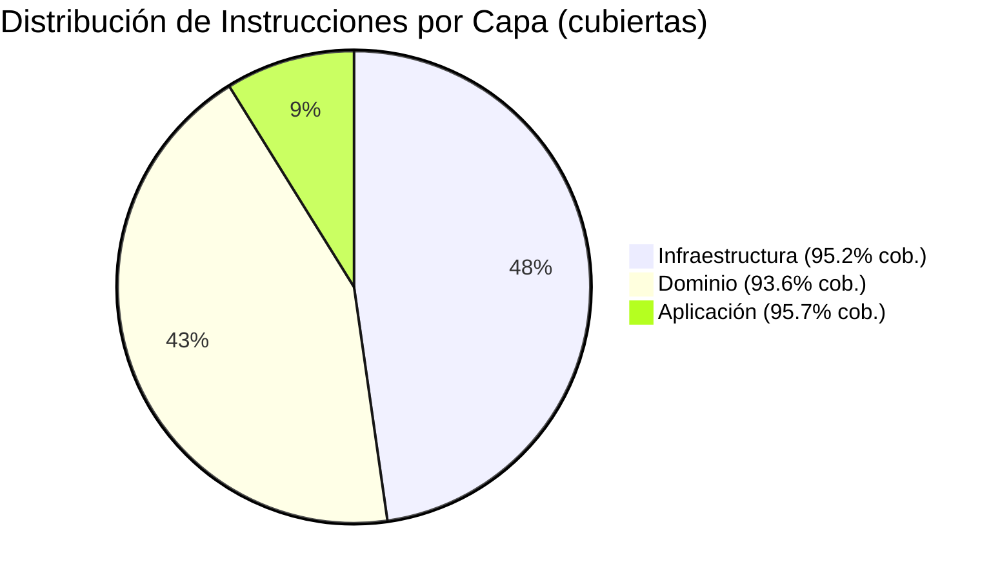
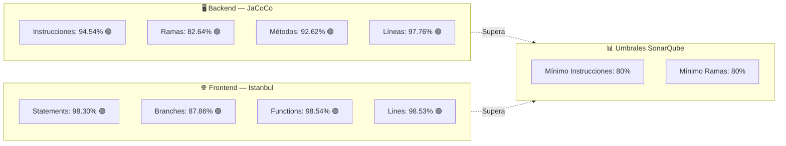

# Artefacto 35 — Cobertura de Código

| Campo             | Detalle                                      |
|-------------------|----------------------------------------------|
| **Proyecto**      | SIBE — Sistema de Información de Bienestar y Evangelización |
| **Tipo**          | Informe de Cobertura de Código               |
| **Herramientas**  | JaCoCo 0.8.x (Backend) · Istanbul / Karma 6.4 (Frontend) |
| **Versión**       | 1.0.0                                        |
| **Fecha**         | 2025-07-13                                   |
| **Autor**         | Equipo SIBE                                  |
| **Referencias**   | Artefacto 32 (Pruebas Unitarias) · Artefacto 33 (Calidad de Código) |

---

## Tabla de Contenidos

- [Artefacto 35 — Cobertura de Código](#artefacto-35--cobertura-de-código)
  - [Tabla de Contenidos](#tabla-de-contenidos)
  - [Resumen Ejecutivo](#resumen-ejecutivo)
  - [Herramientas de Medición de Cobertura](#herramientas-de-medición-de-cobertura)
    - [2.1 Backend: JaCoCo](#21-backend-jacoco)
    - [2.2 Frontend: Karma + Istanbul](#22-frontend-karma--istanbul)
  - [Metodología de Medición](#metodología-de-medición)
    - [3.1 Métricas Medidas](#31-métricas-medidas)
      - [Backend (JaCoCo)](#backend-jacoco)
      - [Frontend (Istanbul)](#frontend-istanbul)
    - [3.2 Ejecución de Pruebas](#32-ejecución-de-pruebas)
    - [3.3 Umbrales de Calidad del Sector](#33-umbrales-de-calidad-del-sector)
  - [Cobertura Backend — JaCoCo](#cobertura-backend--jacoco)
    - [4.1 Resumen Global](#41-resumen-global)
    - [4.2 Análisis por Paquete](#42-análisis-por-paquete)
    - [4.3 Análisis por Capa Arquitectónica](#43-análisis-por-capa-arquitectónica)
    - [4.4 Clases con Cobertura Parcial](#44-clases-con-cobertura-parcial)
    - [4.5 Análisis de Áreas de Mejora](#45-análisis-de-áreas-de-mejora)
  - [Cobertura Frontend — Istanbul](#cobertura-frontend--istanbul)
    - [5.1 Resumen Global](#51-resumen-global)
    - [5.2 Análisis por Módulo](#52-análisis-por-módulo)
      - [Core Layer](#core-layer)
      - [Feature: Login](#feature-login)
      - [Feature: Home (Componentes Comunes)](#feature-home-componentes-comunes)
      - [Feature: Manage Department](#feature-manage-department)
      - [Feature: Manage Indicators](#feature-manage-indicators)
      - [Feature: Manage Users](#feature-manage-users)
      - [Feature: Password Recovery](#feature-password-recovery)
      - [Shared Components](#shared-components)
    - [5.3 Áreas de Baja Cobertura de Ramas](#53-áreas-de-baja-cobertura-de-ramas)
  - [Comparativa Backend vs Frontend](#comparativa-backend-vs-frontend)
  - [Hotspots de Mejora](#hotspots-de-mejora)
    - [Backend — Prioridad Media](#backend--prioridad-media)
    - [Frontend — Prioridad Media](#frontend--prioridad-media)
  - [Plan de Acción](#plan-de-acción)
    - [Sprint 1 — Mejora de cobertura en áreas rezagadas (Semanas 1-2)](#sprint-1--mejora-de-cobertura-en-áreas-rezagadas-semanas-1-2)
    - [Sprint 2 — Mejora de cobertura de ramas (Semanas 3-4)](#sprint-2--mejora-de-cobertura-de-ramas-semanas-3-4)
    - [Sprint 3 — Consolidación y Quality Gate (Semanas 5-6)](#sprint-3--consolidación-y-quality-gate-semanas-5-6)

---

## Resumen Ejecutivo

El análisis de cobertura de código del sistema SIBE revela una **cobertura sólida y uniforme** tanto en el backend Java como en el frontend Angular.

| Componente  | Instrucciones / Sentencias | Ramas / Branches | Funciones | Líneas |
|-------------|---------------------------|------------------|-----------|--------|
| **Backend** | 94.54% (21 448 / 22 686) | 82.64% (1 019 / 1 233) | 92.62% (1 544 / 1 667) | 97.76% (5 142 / 5 260) |
| **Frontend** | 98.30% (4 229 / 4 302) | 87.86% (1 462 / 1 664) | 98.54% (1 082 / 1 098) | 98.53% (4 096 / 4 157) |

> **Veredicto Backend:** La cobertura del backend es **excelente** (~94.5% en instrucciones), superando ampliamente el umbral mínimo aceptable de la industria (80%). Las 464 clases de producción están cubiertas casi en su totalidad: 355 clases con 100% de cobertura, 108 clases con cobertura parcial, y únicamente 1 clase sin ningún tipo de cobertura. El área de mayor atención es la cobertura de ramas (82.64%), que cumple el umbral “Aceptable” pero no alcanza el nivel “Excelente” (≥85%).

> **Veredicto Frontend:** La cobertura del frontend es **excelente**, superando ampliamente los umbrales de la industria en sentencias (98.3%), funciones (98.5%) y líneas (98.5%). La única área de atención es la cobertura de ramas (87.86%), con siete módulos por debajo del 75%.

---

## Herramientas de Medición de Cobertura

### 2.1 Backend: JaCoCo

JaCoCo (Java Code Coverage) es la herramienta estándar de la industria para proyectos JVM. Está integrada como plugin de Gradle en el proyecto SIBE.

**Configuración en `build.gradle`:**

```groovy
// Plugin de JaCoCo integrado como capabilidad Gradle
plugins {
    id 'jacoco'
}

jacocoTestReport {
    reports {
        xml.required = true   // para integración CI/CD
        csv.required = true   // para análisis tabular
        html.required = true  // para revisión humana
    }
}

tasks.named('test') {
    useJUnitPlatform()
    finalizedBy jacocoTestReport  // genera reporte al finalizar pruebas
    ignoreFailures = true
}
```

**Rutas de reporte generadas:**

| Formato | Ruta                                                |
|---------|-----------------------------------------------------|
| HTML    | `SIBEBackend/build/jacocoHtml/index.html`           |
| XML     | `SIBEBackend/build/reports/jacoco/test/jacocoTestReport.xml` |
| CSV     | `SIBEBackend/build/reports/jacoco/test/jacocoTestReport.csv` |
| Exec    | `SIBEBackend/build/jacoco/test.exec`                |

**Alcance de medición:** JaCoCo instrumenta el bytecode de las clases compiladas en `src/main/java`. Las clases de prueba ubicadas en `src/test/java` no son instrumentadas (no forman parte del reporte). El archivo `.exec` es generado durante la ejecución de pruebas por el agente JaCoCo JVM.

**Paquetes medidos:** 32 paquetes · 464 clases · 22 686 instrucciones bytecode

### 2.2 Frontend: Karma + Istanbul

Karma 6.4 opera como test runner y delega la instrumentación de cobertura a Istanbul (nyc). La integración está configurada en `karma.conf.js` a través de la directiva `codeCoverage: true` del Angular CLI.

**Configuración de ejecución:**

```bash
ng test --browsers=ChromeHeadless --watch=false --code-coverage
```

**Rutas de reporte generadas:**

| Formato | Ruta                                                        |
|---------|-------------------------------------------------------------|
| HTML    | `SIBEFrontend/coverage/sibe-frontend/index.html`           |
| Per-file | `SIBEFrontend/coverage/sibe-frontend/app/**`               |

**Alcance de medición:** Istanbul instrumenta todos los archivos TypeScript compilados en `src/app/` y `src/environments/`. Mide cobertura a nivel de sentencias individuales, ramas condicionales, definiciones de función y líneas de código.

**Módulos medidos:** 59 rutas de directorios · Generado el 25 de marzo de 2026 a las 00:02:13 UTC

---

## Metodología de Medición

### 3.1 Métricas Medidas

#### Backend (JaCoCo)

| Métrica | Descripción | Fórmula |
|---------|-------------|---------|
| **Instrucciones (C0)** | Cobertura a nivel de bytecode JVM. Más granular que líneas de código | `instrucciones_cubiertas / instrucciones_totales` |
| **Ramas (C1)** | Cubre cada rama de decisión (`if/else`, `switch`, operador ternario) | `ramas_cubiertas / ramas_totales` |
| **Líneas** | Cuenta líneas de código fuente ejecutadas al menos una vez | `líneas_cubiertas / líneas_totales` |
| **Métodos** | Porcentaje de métodos/constructores invocados al menos una vez | `métodos_invocados / métodos_totales` |
| **Complejidad ciclomática** | Basada en el número de caminos linealmente independientes | `rutas_cubiertas / rutas_totales` |

#### Frontend (Istanbul)

| Métrica | Descripción |
|---------|-------------|
| **Statements (C0)** | Cada sentencia del AST de TypeScript transpilado ejecutada al menos una vez |
| **Branches (C1)** | Ramas de `if/else`, operador `?:`, `&&`, `||`, `switch`, expresión de desestructuración |
| **Functions** | Toda función, método, constructor y arrow function invocada |
| **Lines** | Líneas de código con sentencias ejecutadas |

### 3.2 Ejecución de Pruebas

**Backend — Comando de generación:**
```bash
.\gradlew test jacocoTestReport
```
Las pruebas utilizan JUnit 5 (Jupiter) con extensión Mockito. El agente JaCoCo se activa automáticamente via el plugin de Gradle. La opción `ignoreFailures = true` permite que el reporte se genere aunque algunas pruebas fallen.

**Frontend — Comando de generación:**
```bash
ng test --browsers=ChromeHeadless --watch=false --code-coverage
```
Las pruebas utilizan Jasmine 4.6 ejecutadas en Chrome headless. Istanbul instrumenta el código TypeScript transpilado por el compilador Angular.

### 3.3 Umbrales de Calidad del Sector

Los siguientes umbrales son utilizados como referencia de evaluación en este informe:

| Nivel | Instrucciones | Ramas | Descripción |
|-------|---------------|-------|-------------|
| **Excelente** | ≥ 90% | ≥ 85% | Cobertura de referencia para proyectos críticos |
| **Aceptable** | ≥ 80% | ≥ 70% | Umbral mínimo SonarQube por defecto (Quality Gate) |
| **Mínimo** | ≥ 70% | ≥ 60% | Umbral mínimo para proyectos con deuda técnica |
| **Insuficiente** | ≥ 50% | ≥ 40% | Cobertura parcial, requiere mejoras urgentes |
| **Crítico** | < 50% | < 40% | Cobertura no efectiva; riesgo de defectos no detectados |

---

## Cobertura Backend — JaCoCo

### 4.1 Resumen Global

El reporte JaCoCo fue generado sobre **464 clases de producción** distribuidas en **32 paquetes**. El siguiente cuadro presenta los totales globales del proyecto:

| Métrica | Cubiertos | Total | Perdidos | **Porcentaje** | Estado |
|---------|-----------|-------|----------|----------------|--------|
| **Instrucciones** | 21 448 | 22 686 | 1 238 | **94.54%** | 🟢 Excelente |
| **Ramas** | 1 019 | 1 233 | 214 | **82.64%** | 🟢 Aceptable |
| **Líneas** | 5 142 | 5 260 | 118 | **97.76%** | 🟢 Excelente |
| **Métodos** | 1 544 | 1 667 | 123 | **92.62%** | 🟢 Excelente |
| **Complejidad** | 1 972 | 2 295 | 323 | **85.93%** | 🟢 Aceptable |

> La cobertura global del backend se sitúa en **~94.5%**, superando ampliamente el umbral mínimo de la industria (80%). El proyecto cuenta con 355 clases con cobertura del 100%, 108 clases con cobertura parcial y únicamente 1 clase sin cobertura.

### 4.2 Análisis por Paquete

La siguiente tabla presenta los 32 paquetes del proyecto (prefijo `co.edu.uco.sibe` omitido por brevedad), ordenados de mayor a menor cobertura de instrucciones:

| Paquete | Instrucciones | Ramas | Estado |
|---------|--------------|-------|--------|
| `aplicacion.comando.manejador` | **100%** (502/502) | **100%** (sin ramas) | 🟢 Excelente |
| `aplicacion.transversal` | **100%** (6/6) | N/A (sin ramas) | 🟢 Excelente |
| `dominio.enums` | **100%** (66/66) | N/A (sin ramas) | 🟢 Excelente |
| `dominio.modelo` | **100%** (1 371/1 371) | N/A (sin ramas) | 🟢 Excelente |
| `dominio.regla` | **100%** (27/27) | N/A (sin ramas) | 🟢 Excelente |
| `dominio.regla.fabrica` | **100%** (85/85) | N/A (sin ramas) | 🟢 Excelente |
| `dominio.regla.implementacion` | **100%** (1 719/1 719) | **100%** (sin ramas) | 🟢 Excelente |
| `dominio.regla.motor` | **100%** (39/39) | N/A (sin ramas) | 🟢 Excelente |
| `dominio.transversal.constante` | **100%** (126/126) | **100%** (sin ramas) | 🟢 Excelente |
| `dominio.transversal.excepcion` | **100%** (36/36) | N/A (sin ramas) | 🟢 Excelente |
| `infraestructura.adaptador.entidad` | **100%** (182/182) | N/A (sin ramas) | 🟢 Excelente |
| `infraestructura.configuracion.bean` | **100%** (470/470) | N/A (sin ramas) | 🟢 Excelente |
| `infraestructura.configuracion.dataloader` | **100%** (250/250) | **100%** (sin ramas) | 🟢 Excelente |
| `infraestructura.configuracion.dataloader.fabrica` | **100%** (173/173) | N/A (sin ramas) | 🟢 Excelente |
| `infraestructura.controlador` | **100%** (6/6) | N/A (sin ramas) | 🟢 Excelente |
| `infraestructura.controlador.comando` | **100%** (113/113) | N/A (sin ramas) | 🟢 Excelente |
| `infraestructura.controlador.consulta` | **100%** (249/249) | N/A (sin ramas) | 🟢 Excelente |
| `infraestructura.error` | **100%** (140/140) | **100%** (sin ramas) | 🟢 Excelente |
| `infraestructura.seguridad.filter` | **100%** (442/442) | **81.6%** (51/63) | 🟢 Excelente |
| `infraestructura.adaptador.servicio` | **98.7%** (306/310) | **80.8%** (21/26) | 🟢 Excelente |
| `dominio.usecase.comando` | **98.4%** (2 093/2 126) | **86.2%** (100/116) | 🟢 Excelente |
| `dominio.transversal.utilitarios` | **96.6%** (370/383) | **96.6%** (56/58) | 🟢 Excelente |
| `infraestructura.adaptador.repositorio.consulta` | **96.6%** (2 816/2 915) | **91.9%** (287/312) | 🟢 Excelente |
| `aplicacion.comando.fabrica` | **95.0%** (952/1 002) | **63.2%** (43/68) | 🟢 Excelente |
| `infraestructura.adaptador.mapeador` | **94.8%** (3 648/3 847) | **82.8%** (96/116) | 🟢 Excelente |
| `aplicacion.consulta` | **92.6%** (436/471) | **100%** (14/14) | 🟢 Excelente |
| `dominio.usecase.consulta` | **92.1%** (1 066/1 158) | **83.3%** (100/120) | 🟢 Excelente |
| `infraestructura.adaptador.repositorio.comando` | **91.2%** (1 208/1 325) | **63.5%** (61/96) | 🟢 Excelente |
| `dominio.service` | **90.9%** (746/821) | **72.5%** (87/120) | 🟢 Excelente |
| `dominio.regla.fabrica.implementacion` | **78.9%** (1 566/1 986) | N/A (sin ramas) | 🟡 Mínimo |
| `infraestructura.seguridad.configuration` | **70.5%** (234/332) | **75.0%** (6/8) | 🟡 Mínimo |
| `co.edu.uco.sibe` (raíz — main) | **62.5%** (5/8) | N/A (sin ramas) | 🟠 Insuficiente |

> **Distribución:** **29 de 32 paquetes** superan el 90% de cobertura de instrucciones (nivel Excelente). Solo 2 paquetes están en nivel Mínimo y 1 en nivel Insuficiente (la clase raíz del proyecto, con apenas 8 instrucciones totales).

### 4.3 Análisis por Capa Arquitectónica

El backend sigue una arquitectura hexagonal con tres capas principales. El impacto de la cobertura por capa es:



| Capa | Instrucciones Totales | Instrucciones Cubiertas | Cobertura | Estado |
|------|----------------------|------------------------|-----------|--------|
| **Dominio** | 9 943 | 9 310 | **93.6%** | 🟢 Excelente |
| **Aplicación** | 1 981 | 1 896 | **95.7%** | 🟢 Excelente |
| **Infraestructura** | 10 754 | 10 237 | **95.2%** | 🟢 Excelente |
| **Total Proyecto** | **22 686** | **21 448** | **94.54%** | 🟢 Excelente |

**Observaciones por capa:**

- **Capa Dominio (93.6%):** La cobertura es excelente. Los modelos de dominio, reglas de negocio, constantes y excepciones alcanzan el 100%. Las áreas con más margen de mejora son `dominio.regla.fabrica.implementacion` (78.9%, principalmente por ramas condicionales complejas en la construcción de motores de regla) y `dominio.service` (90.9%).

- **Capa Aplicación (95.7%):** Los manejadores de comandos y las consultas de aplicación alcanzan cobertura muy alta. El área de mayor brecha es `aplicacion.comando.fabrica` (95.0%), con algunas ramas condicionales de validación no cubiertas.

- **Capa Infraestructura (95.2%):** Los mapeadores, repositorios, controladores REST, filtros de seguridad JWT y beans de configuración tienen cobertura alta. El punto de mayor atención es `infraestructura.seguridad.configuration` (70.5%), donde algunas ramas del flujo de configuración de seguridad no se ejercitan en pruebas unitarias.

### 4.4 Clases con Cobertura Parcial

De las 464 clases de producción, **355 clases (76.5%)** tienen cobertura del 100%, **108 clases (23.3%)** registran cobertura parcial, y únicamente **1 clase (0.2%)** no tiene ningún tipo de cobertura.

**Clase sin cobertura:**

| Clase | Paquete | Instrucciones | Observación |
|-------|---------|---------------|-------------|
| `MiembroRepositorioComandoImplementacion` | `infraestructura.adaptador.repositorio.comando` | 0/5 | Implementación de repositorio con mínima lógica; los 5 bytecodes corresponden al constructor |

**Clases parciales con mayor brecha de instrucciones (top 10):**

| Clase | Paquete | Cubiertos | Perdidos | Cobertura |
|-------|---------|-----------|----------|-----------|
| `ProjectSecurityConfig` | `infraestructura.seguridad.configuration` | 51 | 93 | 35.4% |
| `ActividadRepositorioConsultaImplementacion` | `infraestructura.adaptador.repositorio.consulta` | 1 157 | 73 | 94.1% |
| `AutorizacionContextoOrganizacionalServicio` | `dominio.service` | 473 | 69 | 87.3% |
| `UsuarioOrganizacionComandoImplementacion` | `infraestructura.adaptador.repositorio.comando` | 271 | 48 | 84.9% |
| `PersonaRepositorioComandoImplementacion` | `infraestructura.adaptador.repositorio.comando` | 241 | 32 | 88.3% |
| `ActividadMapeador` | `infraestructura.adaptador.mapeador` | 149 | 21 | 87.6% |
| `ParticipanteEstudianteMotorFabrica` | `dominio.regla.fabrica.implementacion` | 51 | 20 | 71.8% |
| `UsuarioOrganizacionMotorFabrica` | `dominio.regla.fabrica.implementacion` | 35 | 20 | 63.6% |
| `RegistroAsistenciaMotorFabrica` | `dominio.regla.fabrica.implementacion` | 51 | 20 | 71.8% |
| `ParticipanteEmpleadoMotorFabrica` | `dominio.regla.fabrica.implementacion` | 51 | 20 | 71.8% |

> La mayor brecha individual corresponde a `ProjectSecurityConfig`, cuyas ramas de configuración de seguridad Spring (filtros de autorización de URLs, configuración CORS, excepciones de seguridad) no se activan en pruebas unitarias sin contexto de aplicación completo.

### 4.5 Análisis de Áreas de Mejora

La cobertura global del backend es excelente. Las siguientes áreas representan las oportunidades de mejora más relevantes para alcanzar el nivel “Excelente” en todas las métricas:

| Área | Instrucción | Ramas | Causa probable |
|------|-------------|-------|----------------|
| `infraestructura.seguridad.configuration` | 70.5% | 75.0% | `ProjectSecurityConfig` depende del contexto Spring completo; sus ramas de configuración de URLs y CORS requieren pruebas de integración (`@SpringBootTest`) |
| `dominio.regla.fabrica.implementacion` | 78.9% | N/A | Las fábricas de motores de regla (p. ej. `ParticipanteEstudianteMotorFabrica`) tienen constructores privados y caminos de inicialización parcialmente cubiertos |
| `dominio.service` | 90.9% | 72.5% | `AutorizacionContextoOrganizacionalServicio` tiene 40 ramas de autorización contextual sin cubrir, relacionadas con la variedad de combinaciones de rol y área |
| `infraestructura.adaptador.repositorio.comando` | 91.2% | 63.5% | Algunos métodos de escritura en repositorios tienen ramas de validación de nulidad no ejercitadas |
| `aplicacion.comando.fabrica` | 95.0% | 63.2% | Ramas de validación de parámetros de entrada en fábricas de comandos no cubiertas por los escenarios de prueba actuales |

---

## Cobertura Frontend — Istanbul

### 5.1 Resumen Global

El reporte Istanbul fue generado sobre **59 módulos** del proyecto Angular, analizando el código TypeScript transpilado. Los resultados son notablemente superiores a los estándares de la industria:

| Métrica | Cubiertos | Total | Sin cubrir | **Porcentaje** | Estado |
|---------|-----------|-------|-----------|----------------|--------|
| **Statements** | 4 229 | 4 302 | 73 | **98.30%** | 🟢 Excelente |
| **Branches** | 1 462 | 1 664 | 202 | **87.86%** | 🟢 Aceptable |
| **Functions** | 1 082 | 1 098 | 16 | **98.54%** | 🟢 Excelente |
| **Lines** | 4 096 | 4 157 | 61 | **98.53%** | 🟢 Excelente |

> El frontend supera ampliamente todos los umbrales de calidad de la industria excepto en cobertura de ramas (87.86%), que aun así cumple el umbral "Aceptable" de SonarQube (≥80%). La cobertura de sentencias, funciones y líneas es de **categoría Excelente**.

### 5.2 Análisis por Módulo

#### Core Layer

| Módulo | Stmt | Branches | Func | Lines |
|--------|------|----------|------|-------|
| `app` (raíz) | 100% (3/3) | 100% (0/0) | 100% (1/1) | 100% (2/2) |
| `core/components/footer` | 100% (2/2) | 100% (0/0) | 100% (0/0) | 100% (1/1) |
| `core/components/header` | 96% (72/75) | 93.1% (27/29) | 94.11% (16/17) | 96% (72/75) |
| `core/guard` | 98.07% (51/52) | 95.23% (20/21) | 100% (6/6) | 98.03% (50/51) |
| `core/interceptor` | 100% (72/72) | 100% (25/25) | 100% (15/15) | 100% (68/68) |
| `core/service` | 100% (37/37) | 83.33% (10/12) | 100% (16/16) | 100% (37/37) |

#### Feature: Login

| Módulo | Stmt | Branches | Func | Lines |
|--------|------|----------|------|-------|
| `feature/login/components` | 100% (22/22) | ⚠️ 53.84% (7/13) | 100% (7/7) | 100% (22/22) |
| `feature/login/service` | 100% (5/5) | 100% (0/0) | 100% (2/2) | 100% (5/5) |

#### Feature: Home (Componentes Comunes)

| Módulo | Stmt | Branches | Func | Lines |
|--------|------|----------|------|-------|
| `feature/home/components` | 100% (3/3) | 100% (0/0) | 100% (1/1) | 100% (3/3) |
| `feature/home/components/activities` | 100% (11/11) | 100% (1/1) | 100% (5/5) | 100% (11/11) |
| `feature/home/components/areas` | 100% (4/4) | 100% (0/0) | 100% (2/2) | 100% (3/3) |
| `feature/home/components/botton-data-container` | 100% (7/7) | 100% (0/0) | 100% (1/1) | 100% (7/7) |
| `feature/home/components/department-attendance-record` | 100% (2/2) | 100% (0/0) | 100% (0/0) | 100% (1/1) |
| `feature/home/components/home-filters` | 100% (3/3) | 100% (0/0) | 100% (2/2) | 100% (3/3) |
| `feature/home/components/home-primary-buttons` | 100% (15/15) | 100% (2/2) | 100% (5/5) | 100% (15/15) |
| `feature/home/components/principal-home` | 100% (2/2) | 100% (0/0) | 100% (0/0) | 100% (1/1) |
| ⚠️ `feature/home/components/top-data-container` | 95% (57/60) | ⚠️ 71.11% (32/45) | 90% (18/20) | 96.36% (53/55) |

> Las sub-áreas del módulo home (bienestar-area, evangelizacion-area, hogar-area, servicio-area) y sus respectivos sub-módulos (acompanamiento, banda, cancha, deportes, extension, gimnasio, trabajo-social, unidad) tienen en su totalidad **100%** en todos las métricas, con excepción del módulo `top-data-container` general.

#### Feature: Manage Department

| Módulo | Stmt | Branches | Func | Lines |
|--------|------|----------|------|-------|
| `feature/manage-department/components` | 100% (2/2) | 100% (0/0) | 100% (0/0) | 100% (1/1) |
| `feature/manage-department/components/area-statistics` | 100% (64/64) | 96.15% (25/26) | 100% (23/23) | 100% (64/64) |
| `feature/manage-department/components/bienestar-area` | 100% (4/4) | 100% (0/0) | 100% (1/1) | 100% (3/3) |
| `feature/manage-department/components/department` | 100% (3/3) | 100% (0/0) | 100% (4/4) | 100% (3/3) |
| `feature/manage-department/components/department-areas` | 100% (2/2) | 100% (0/0) | 100% (0/0) | 100% (1/1) |
| `feature/manage-department/components/evangelizacion-area` | 100% (4/4) | 100% (0/0) | 100% (1/1) | 100% (3/3) |
| `feature/manage-department/components/santa-maria-area` | 100% (4/4) | 100% (0/0) | 100% (1/1) | 100% (3/3) |
| `feature/manage-department/components/servicio-area` | 100% (4/4) | 100% (0/0) | 100% (1/1) | 100% (3/3) |

#### Feature: Manage Indicators

| Módulo | Stmt | Branches | Func | Lines |
|--------|------|----------|------|-------|
| `feature/manage-indicators/components` | 100% (2/2) | 100% (0/0) | 100% (0/0) | 100% (1/1) |
| `feature/manage-indicators/components/actions` | 100% (48/48) | 90% (9/10) | 100% (12/12) | 100% (47/47) |
| `feature/manage-indicators/components/edit-action` | 100% (48/48) | 100% (16/16) | 100% (10/10) | 100% (47/47) |
| `feature/manage-indicators/components/edit-indicator` | 100% (133/133) | 100% (37/37) | 100% (35/35) | 100% (129/129) |
| ⚠️ `feature/manage-indicators/components/edit-project` | 96.9% (94/97) | 90.9% (30/33) | 100% (26/26) | 97.82% (90/92) |
| `feature/manage-indicators/components/indicators` | 100% (44/44) | 88.88% (8/9) | 100% (11/11) | 100% (44/44) |
| `feature/manage-indicators/components/projects` | 100% (44/44) | 88.88% (8/9) | 100% (11/11) | 100% (44/44) |
| ⚠️ `feature/manage-indicators/components/register-new-action` | 91.11% (41/45) | ⚠️ 83.33% (15/18) | 85.71% (6/7) | 90.9% (40/44) |
| ⚠️ `feature/manage-indicators/components/register-new-indicator` | 96.8% (121/125) | ⚠️ 83.33% (30/36) | 100% (32/32) | 96.69% (117/121) |
| `feature/manage-indicators/components/register-new-project` | 100% (97/97) | 100% (36/36) | 100% (25/25) | 100% (93/93) |
| ⚠️ `feature/manage-indicators/service` | 97.5% (78/80) | 88.23% (15/17) | 100% (25/25) | 100% (77/77) |

#### Feature: Manage Users

| Módulo | Stmt | Branches | Func | Lines |
|--------|------|----------|------|-------|
| `feature/manage-users/components` | 100% (32/32) | 100% (1/1) | 100% (17/17) | 100% (29/29) |
| ⚠️ `feature/manage-users/components/area-users` | 99.09% (109/110) | 86.95% (20/23) | 100% (27/27) | 99.05% (105/106) |
| ⚠️ `feature/manage-users/components/department-users` | 97.08% (100/103) | ⚠️ 69.56% (16/23) | 100% (24/24) | 97% (97/100) |
| `feature/manage-users/components/edit-user` | 100% (168/168) | 88.15% (67/76) | 100% (35/35) | 100% (161/161) |
| `feature/manage-users/components/register-new-user` | 100% (122/122) | 97.29% (36/37) | 100% (28/28) | 100% (117/117) |
| `feature/manage-users/service` | 100% (11/11) | 100% (0/0) | 100% (4/4) | 100% (10/10) |

#### Feature: Password Recovery

| Módulo | Stmt | Branches | Func | Lines |
|--------|------|----------|------|-------|
| `feature/password-recovery/components` | 100% (93/93) | 93.75% (45/48) | 100% (16/16) | 100% (93/93) |
| `feature/password-recovery/service` | 100% (23/23) | 100% (0/0) | 100% (10/10) | 100% (20/20) |

#### Shared Components

| Módulo | Stmt | Branches | Func | Lines |
|--------|------|----------|------|-------|
| ⚠️ `shared/components/activities-table` | 97.83% (226/231) | 90.81% (89/98) | 97.61% (41/42) | 97.81% (224/229) |
| ⚠️ `shared/components/activity-info` | 98.7% (76/77) | 92.15% (47/51) | 100% (11/11) | 98.66% (74/75) |
| `shared/components/area-buttons` | 100% (25/25) | 100% (9/9) | 100% (6/6) | 100% (24/24) |
| `shared/components/area-top-image` | 100% (3/3) | 100% (0/0) | 100% (1/1) | 100% (3/3) |
| ⚠️ `shared/components/attendance-record` | 96.98% (290/299) | 86.5% (109/126) | 100% (55/55) | 96.98% (290/299) |
| ⚠️ `shared/components/change-password` | 88.88% (16/18) | 🔴 40% (2/5) | 100% (4/4) | 88.88% (16/18) |
| ⚠️ `shared/components/data-visualization/completed-activities` | 94.59% (35/37) | ⚠️ 69.44% (25/36) | 92.85% (13/14) | 94.59% (35/37) |
| ⚠️ `shared/components/data-visualization/total-participants` | 94.52% (69/73) | ⚠️ 64.44% (58/90) | 91.3% (21/23) | 94.52% (69/73) |
| ⚠️ `shared/components/data-visualization/total-participants-months` | 89.7% (61/68) | ⚠️ 66.07% (37/56) | 81.81% (18/22) | 90.62% (58/64) |
| ⚠️ `shared/components/date-selector` | 94.95% (113/119) | 80.48% (33/41) | 96% (24/25) | 94.87% (111/117) |
| `shared/components/edit-activity` | 100% (265/265) | 93.37% (141/151) | 100% (61/61) | 100% (258/258) |
| `shared/components/external-participant` | 100% (11/11) | 100% (3/3) | 100% (4/4) | 100% (11/11) |
| `shared/components/filter-list` | 100% (109/109) | 100% (74/74) | 100% (34/34) | 100% (108/108) |
| `shared/components/go-to-area-button` | 100% (3/3) | 100% (0/0) | 100% (1/1) | 100% (3/3) |
| `shared/components/pagination` | 100% (32/32) | 100% (9/9) | 100% (7/7) | 100% (26/26) |
| `shared/components/primary-button` | 100% (7/7) | 100% (3/3) | 100% (2/2) | 100% (7/7) |
| `shared/components/register-new-activity` | 100% (178/178) | 100% (76/76) | 100% (39/39) | 100% (173/173) |
| `shared/components/separator` | 100% (2/2) | 100% (0/0) | 100% (0/0) | 100% (1/1) |
| ⚠️ `shared/components/upload-database` | 96.33% (105/109) | 88.46% (46/52) | 100% (18/18) | 96.29% (104/108) |
| `shared/model` | 100% (10/10) | 100% (6/6) | 100% (3/3) | 100% (10/10) |
| ⚠️ `shared/service` | 97.58% (364/373) | 88.95% (145/163) | 97.11% (101/104) | 99.43% (355/357) |
| `environments` | 100% (1/1) | 100% (0/0) | 100% (0/0) | 100% (1/1) |

### 5.3 Áreas de Baja Cobertura de Ramas

Los siguientes módulos presentan la cobertura de ramas más baja y representan los focos de atención prioritarios:

| Prioridad | Módulo | Branch Coverage | Ramas sin cubrir | Severidad |
|-----------|--------|----------------|-----------------|-----------|
| 🔴 1 | `shared/components/change-password` | 40% (2/5) | 3 ramas | Crítico |
| 🟠 2 | `feature/login/components` | 53.84% (7/13) | 6 ramas | Alto |
| 🟠 3 | `data-visualization/total-participants` | 64.44% (58/90) | 32 ramas | Alto |
| 🟠 4 | `data-visualization/total-participants-months` | 66.07% (37/56) | 19 ramas | Alto |
| 🟡 5 | `data-visualization/completed-activities` | 69.44% (25/36) | 11 ramas | Medio |
| 🟡 6 | `manage-users/components/department-users` | 69.56% (16/23) | 7 ramas | Medio |
| 🟡 7 | `home/components/top-data-container` | 71.11% (32/45) | 13 ramas | Medio |
| 🟡 8 | `core/service` | 83.33% (10/12) | 2 ramas | Medio |
| 🟡 9 | `manage-indicators/register-new-action` | 83.33% (15/18) | 3 ramas | Medio |
| 🟡 10 | `manage-indicators/register-new-indicator` | 83.33% (30/36) | 6 ramas | Medio |

---

## Comparativa Backend vs Frontend

```mermaid
xychart-beta
    title "Cobertura de Código: Backend (JaCoCo) vs Frontend (Istanbul)"
    x-axis ["Instrucciones/Stmts", "Ramas/Branches", "Métodos/Funciones", "Líneas"]
    y-axis "Porcentaje (%)" 0 --> 100
    bar [94.54, 82.64, 92.62, 97.76]
    bar [98.30, 87.86, 98.54, 98.53]
```





**Resumen comparativo:**

| Métrica | Backend | Frontend | Delta | Umbral Mínimo | Backend Cumple | Frontend Cumple |
|---------|---------|----------|-------|---------------|----------------|-----------------|
| Instrucciones/Stmts | 94.54% | 98.30% | +3.76pp | 80% | ✅ Sí | ✅ Sí |
| Ramas/Branches | 82.64% | 87.86% | +5.22pp | 80% | ✅ Sí | ✅ Sí |
| Métodos/Funciones | 92.62% | 98.54% | +5.92pp | 80% | ✅ Sí | ✅ Sí |
| Líneas | 97.76% | 98.53% | +0.77pp | 80% | ✅ Sí | ✅ Sí |

> Ambos componentes superan ampliamente el umbral mínimo del 80%. El frontend mantiene una ligera ventaja en todas las métricas, con una diferencia de entre ~1pp y ~6pp. Ambos cumplen el Quality Gate.

---

## Hotspots de Mejora

### Backend — Prioridad Media

Los siguientes componentes presentan las mayores brechas de cobertura en el backend. Dado que la cobertura global es excelente, estas mejoras son de prioridad media:

| # | Componente | Instrucción | Ramas sin cubrir | Impacto | Acción |
|---|-----------|------------|-----------------|---------|--------|
| 1 | `infraestructura.seguridad.configuration` | 70.5% | 25.0% (2/8) | **Medio** | Agregar pruebas de integración `@SpringBootTest` para `ProjectSecurityConfig` |
| 2 | `dominio.regla.fabrica.implementacion` | 78.9% | N/A | **Medio** | Cubrir caminos de construcción de motores de regla con datos de escenarios variados |
| 3 | `dominio.service` | 90.9% | 72.5% (33/120) | **Medio** | Cubrir ramas de autorización contextual en `AutorizacionContextoOrganizacionalServicio` |
| 4 | `infraestructura.adaptador.repositorio.comando` | 91.2% | 63.5% (35/96) | **Bajo** | Cubrir ramas de validación nulidad en escritura de repositorios |
| 5 | `aplicacion.comando.fabrica` | 95.0% | 63.2% (25/68) | **Bajo** | Cubrir ramas de validación en fábricas de comandos |

### Frontend — Prioridad Media

| # | Componente | Ramas sin cubrir | Impacto | Acción |
|---|-----------|----------------|---------|--------|
| 1 | `shared/components/change-password` | 3 ramas (60% sin cubrir) | **Alto** (componente de seguridad) | Cubrir casos: contraseña inválida, contraseñas no coinciden, error de red |
| 2 | `feature/login/components` | 6 ramas (46% sin cubrir) | **Alto** | Cubrir: login fallido, credenciales vacías, error de conexión |
| 3 | `data-visualization/total-participants` | 32 ramas (35% sin cubrir) | **Medio** | Cubrir estados: sin datos, datos parciales, error de carga |
| 4 | `data-visualization/total-participants-months` | 19 ramas (33% sin cubrir) | **Medio** | Cubrir estados vacíos y de error |
| 5 | `data-visualization/completed-activities` | 11 ramas (30% sin cubrir) | **Medio** | Cubrir variaciones de datos en visualización |
| 6 | `manage-users/department-users` | 7 ramas (30% sin cubrir) | **Medio** | Cubrir casos de usuarios sin departamento, filtros vacíos |

---

## Plan de Acción

Dado que el backend ya supera el 94% de cobertura de instrucciones, el plan de acción se enfoca en cerrar las brechas específicas identificadas y consolidar el Quality Gate.

### Sprint 1 — Mejora de cobertura en áreas rezagadas (Semanas 1-2)

**Objetivo:** Elevar al 85% la cobertura en los 3 paquetes por debajo del 80%.

1. **`ProjectSecurityConfig`:** Añadir prueba de integración con `@SpringBootTest` y `@AutoConfigureMockMvc` que verifique los patrones de autorización de URLs para cada rol.
2. **`dominio.regla.fabrica.implementacion`:** Cubrir los constructores de las fábricas de motores de regla con escenarios de datos válidos e inválidos.
3. **Verificar** que `./gradlew test jacocoTestReport` genera cobertura ≥ 90% en los paquetes rezagados.

**Meta de cobertura al final del Sprint 1:**

| Paquete | Situación Actual | Meta Sprint 1 |
|---------|-----------------|---------------|
| `infraestructura.seguridad.configuration` | 70.5% | ≥ 80% |
| `dominio.regla.fabrica.implementacion` | 78.9% | ≥ 85% |
| `dominio.service` | 90.9% | ≥ 93% |

### Sprint 2 — Mejora de cobertura de ramas (Semanas 3-4)

**Objetivo:** Elevar la cobertura global de ramas del backend al 90% (actualmente 82.64%).

1. Agregar escenarios de prueba para ramas de validación en `aplicacion.comando.fabrica` (actualmente 63.2% ramas).
2. Cubrir ramas de autorización contextual en `AutorizacionContextoOrganizacionalServicio` (actualmente 72.5% ramas).
3. Agregar casos de error en `infraestructura.adaptador.repositorio.comando` (actualmente 63.5% ramas).

**Meta de cobertura al final del Sprint 2:**

| Métrica | Actual | Meta Sprint 2 |
|---------|--------|---------------|
| Ramas Backend | 82.64% | ≥ 87% |
| Frontend Ramas | 87.86% | ≥ 90% |

### Sprint 3 — Consolidación y Quality Gate (Semanas 5-6)

**Objetivo:** Configurar Quality Gate de SonarQube y establecer política de mantenimiento de cobertura.

1. Configurar SonarQube con Quality Gate: instrucciones ≥ 90%, ramas ≥ 85%.
2. Integrar análisis de cobertura en el pipeline CI/CD (GitHub Actions).
3. Establecer política de no-merge si la cobertura global baja del 90%.
4. Añadir casos de prueba en `shared/components/change-password` (40% ramas) y `feature/login/components` (53.84% ramas) del frontend.

**Meta final:**

| Componente | Actual | Meta Final |
|------------|--------|------------|
| Backend — Instrucciones | 94.54% | ≥ 96% |
| Backend — Ramas | 82.64% | ≥ 87% |
| Frontend — Ramas | 87.86% | ≥ 92% |

