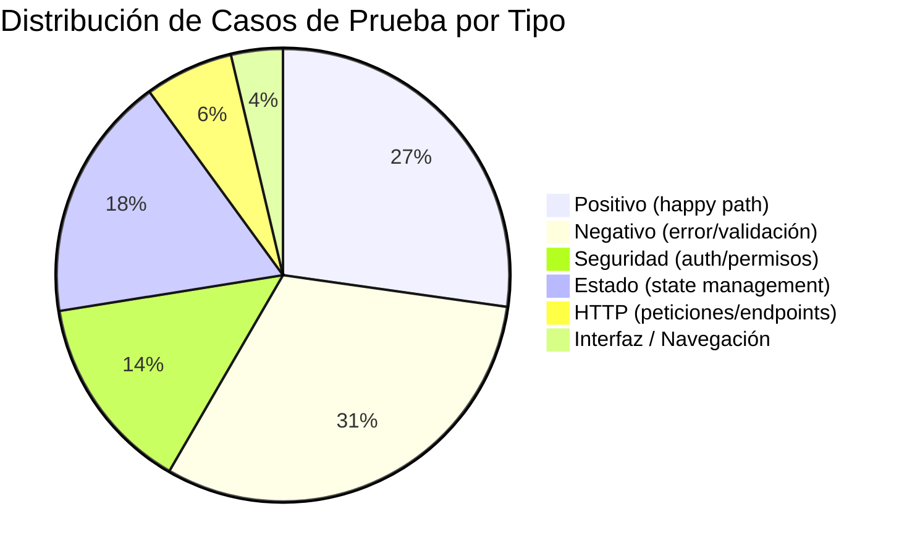
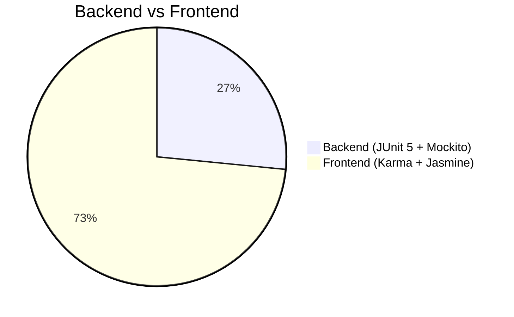
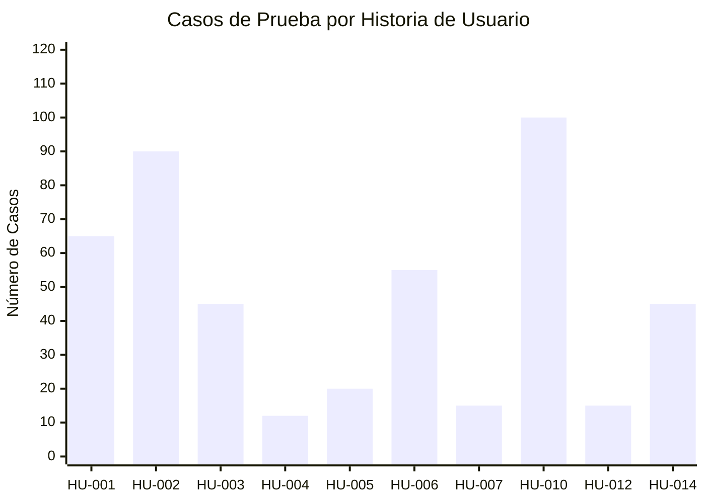

# Artefacto 35 — Casos de Prueba

| Campo | Detalle |
|-------|---------|
| **Proyecto** | SIBE — Sistema de Información de Bienestar y Evangelización |
| **Tipo** | Catálogo Formal de Casos de Prueba |
| **Versión** | 1.0.0 |
| **Fecha** | 2026-03-27 |
| **Autor** | Equipo SIBE |
| **Referencias** | Artefacto 16 (Historias de Usuario) · Artefacto 32 (Pruebas Unitarias) · Artefacto 34 (Cobertura de Código) |

---

## Tabla de Contenidos

1. [Introducción y Alcance](#1-introducción-y-alcance)
2. [Convenciones de Nomenclatura](#2-convenciones-de-nomenclatura)
3. [Resumen Ejecutivo](#3-resumen-ejecutivo)
4. [Casos de Prueba — Backend (JUnit 5 / Mockito)](#4-casos-de-prueba--backend-junit-5--mockito)
   - [4.1 Capa de Aplicación — Fábricas de Comando](#41-capa-de-aplicación--fábricas-de-comando)
   - [4.2 Capa de Aplicación — Manejadores de Comando](#42-capa-de-aplicación--manejadores-de-comando)
   - [4.3 Capa de Aplicación — Manejadores de Consulta](#43-capa-de-aplicación--manejadores-de-consulta)
   - [4.4 Capa de Infraestructura — Filtros de Seguridad JWT](#44-capa-de-infraestructura--filtros-de-seguridad-jwt)
   - [4.5 Capa de Infraestructura — Proveedor de Autenticación](#45-capa-de-infraestructura--proveedor-de-autenticación)
   - [4.6 Capa de Infraestructura — Configuración de Seguridad](#46-capa-de-infraestructura--configuración-de-seguridad)
   - [4.7 Capa de Infraestructura — Controladores REST](#47-capa-de-infraestructura--controladores-rest)
   - [4.8 Prueba de Integración Spring Boot](#48-prueba-de-integración-spring-boot)
5. [Casos de Prueba — Frontend (Karma / Jasmine)](#5-casos-de-prueba--frontend-karma--jasmine)
   - [5.1 Núcleo — Componentes Base](#51-núcleo--componentes-base)
   - [5.2 Núcleo — Guardias de Ruta](#52-núcleo--guardias-de-ruta)
   - [5.3 Núcleo — Interceptores HTTP](#53-núcleo--interceptores-http)
   - [5.4 Núcleo — Servicio HTTP Compartido](#54-núcleo--servicio-http-compartido)
   - [5.5 Feature: Autenticación y Sesión](#55-feature-autenticación-y-sesión)
   - [5.6 Feature: Gestión de Usuarios](#56-feature-gestión-de-usuarios)
   - [5.7 Feature: Recuperación de Contraseña](#57-feature-recuperación-de-contraseña)
   - [5.8 Feature: Gestión de Indicadores](#58-feature-gestión-de-indicadores)
   - [5.9 Componentes Compartidos (Shared)](#59-componentes-compartidos-shared)
6. [Matriz de Trazabilidad](#6-matriz-de-trazabilidad)
7. [Resumen Estadístico](#7-resumen-estadístico)

---

## 1. Introducción y Alcance

### 1.1 Propósito

Este artefacto documenta de forma detallada e individual todos los casos de prueba automatizados del sistema SIBE, tanto del backend (Java 17 + Spring Boot 3.5) como del frontend (Angular 16 + TypeScript 5.1). El objetivo es proporcionar un registro formal y trazable que permita:

- **Auditar** qué comportamientos del sistema son validados automáticamente.
- **Trazar** cada caso de prueba hacia la historia de usuario o requisito que valida.
- **Clasificar** las pruebas por tipo: positivo, negativo, seguridad, integración o interfaz de usuario.
- **Diagnosticar** rápidamente qué prueba verifica qué escenario ante un fallo.
- **Servir como base** para la certificación funcional del sistema (Artefacto 36).

### 1.2 Alcance

| Componente | Framework | Alcance de este documento |
|-----------|-----------|--------------------------|
| Backend — Capa de Aplicación | JUnit 5 + Mockito | Fábricas, manejadores de comando, consultas |
| Backend — Capa de Infraestructura | JUnit 5 + Mockito | Filtros JWT, proveedor de autenticación, controladores REST |
| Backend — Integración | JUnit 5 + @SpringBootTest | Carga del contexto de la aplicación |
| Frontend — Núcleo | Karma 6.4 + Jasmine 4.6 + Angular TestBed | Componentes base, guardias, interceptores, servicios HTTP |
| Frontend — Features | Karma 6.4 + Jasmine 4.6 + Angular TestBed | Login, usuarios, recuperación de contraseña, indicadores |
| Frontend — Compartidos | Karma 6.4 + Jasmine 4.6 | Asistencia, filtros, botones y utilidades compartidas |

### 1.3 Fuera de Alcance

- Pruebas de rendimiento (carga, estrés, volumen).
- Pruebas de extremo a extremo (E2E con Cypress o Playwright) — no están implementadas en el proyecto.
- Pruebas exploratorias manuales — se documentan en el Artefacto 36 (Certificación Funcional).
- Pruebas de base de datos (repositorios JPA con `@DataJpaTest`).

### 1.4 Ambiente de Ejecución

| Elemento | Detalle |
|----------|---------|
| **Backend — JDK** | Java 17 |
| **Backend — Framework de pruebas** | JUnit 5.9 (Jupiter) |
| **Backend — Mocking** | Mockito 5.x (`@ExtendWith(MockitoExtension.class)`) |
| **Backend — Ejecución** | `./gradlew test` (Windows: `gradlew.bat test`) |
| **Frontend — Runtime** | Node.js + TypeScript transpilado |
| **Frontend — Test runner** | Karma 6.4 + ChromeHeadless |
| **Frontend — Framework de aserciones** | Jasmine 4.6 |
| **Frontend — Ejecución** | `ng test --browsers=ChromeHeadless --watch=false` |

---

## 2. Convenciones de Nomenclatura

### 2.1 Identificador de Caso de Prueba

```
TC-[COMPONENTE]-[NÚMERO]

Ejemplos:
  TC-BE-001   → Caso de prueba de Backend, número 001
  TC-FE-001   → Caso de prueba de Frontend, número 001
```

Los prefijos secundarios se pueden añadir para grupos:

| Prefijo | Significado |
|---------|-------------|
| `TC-BE-FAB-xxx` | Backend — Fábricas de Aplicación |
| `TC-BE-CMD-xxx` | Backend — Manejadores de Comando |
| `TC-BE-QRY-xxx` | Backend — Manejadores de Consulta |
| `TC-BE-SEC-xxx` | Backend — Seguridad / Filtros JWT |
| `TC-BE-CTR-xxx` | Backend — Controladores REST |
| `TC-BE-INT-xxx` | Backend — Integración |
| `TC-FE-COR-xxx` | Frontend — Core (Components, Guards, Interceptors, Services) |
| `TC-FE-FEA-xxx` | Frontend — Features |
| `TC-FE-SHR-xxx` | Frontend — Shared (Componentes Compartidos) |

### 2.2 Clasificación de Tipos de Caso

| Tipo | Descripción |
|------|-------------|
| **Positivo** | El sistema se comporta correctamente ante entradas válidas (happy path) |
| **Negativo** | El sistema maneja correctamente entradas inválidas, datos faltantes o condiciones de error |
| **Seguridad** | Verifica comportamientos relacionados con autenticación, autorización, tokens o permisos |
| **Límite** | Prueba condiciones en los bordes de valores permitidos (valores mínimos, máximos, nulos) |
| **Integración** | Verifica la colaboración entre múltiples capas o componentes |
| **Interfaz** | Verifica el renderizado, interacción DOM y comportamiento visual |
| **Navegación** | Verifica redirecciones y cambios de ruta |
| **Estado** | Verifica la sincronización de estado del componente o servicio |
| **HTTP** | Verifica la construcción y ejecución de peticiones HTTP |

### 2.3 Convención de Nombres de Métodos — Backend

Los métodos de prueba en el backend siguen la convención `deberia<Acción><Contexto>()` en español:

```java
// Ejemplo:
void deberiaGenerarJWTConClaimsOrganizacionalesCuandoUsuarioTieneContexto()
void deberiaLanzarExcepcionCuandoUsuarioNoExiste()
```

### 2.4 Convención de Nombres de Pruebas — Frontend

Las pruebas del frontend siguen la convención `it('descripción en español o inglés', ...)`:

```typescript
// Ejemplos:
it('should create the app', ...)
it('debería bloquear acceso cuando rol es COLABORADOR', ...)
```

---

## 3. Resumen Ejecutivo

### 3.1 Totales por Componente

| Componente | Clases/Spec files | Total Casos de Prueba |
|-----------|------------------|-----------------------|
| Backend — Fábricas de Aplicación | 23 clases | ~46 casos |
| Backend — Manejadores de Comando | 30 clases | ~30 casos |
| Backend — Manejadores de Consulta | 43 clases | ~43 casos |
| Backend — Filtros de Seguridad JWT | 6 clases | 25 casos |
| Backend — Proveedor de Autenticación | 1 clase | 7 casos |
| Backend — Configuración de Seguridad | 1 clase | 1 caso |
| Backend — Controladores REST | ~30+ clases | ~120 casos |
| Backend — Integración | 1 clase | 1 caso |
| **Subtotal Backend** | **~135 clases** | **~273 casos** |
| Frontend — Core | 8 spec files | 68 casos |
| Frontend — Login | 2 spec files | 14 casos |
| Frontend — Gestión de Usuarios | 3 spec files | 87 casos |
| Frontend — Recuperación de Contraseña | 2 spec files | 41 casos |
| Frontend — Gestión de Indicadores | 3 spec files | 55 casos |
| Frontend — Feature Home | ~60 spec files | ~200 casos |
| Frontend — Dirección / Gestión | ~15 spec files | ~40 casos |
| Frontend — Shared Components | ~25 spec files | ~250 casos |
| **Subtotal Frontend** | **~120 spec files** | **~755 casos** |
| **TOTAL PROYECTO** | **~255 archivos** | **~1 028 casos** |

### 3.2 Distribución por Tipo de Prueba



### 3.3 Distribución Backend vs Frontend



### 3.4 Estado Global de las Pruebas

| Estado | Backend | Frontend | Total |
|--------|---------|----------|-------|
| ✅ Implementada y definida | ~273 | ~755 | **~1 028** |
| ✅ Cobertura de código | 94.54% instrucciones, 97.76% líneas, 82.64% ramas (JaCoCo) | >98% de spec files con pruebas | Alto |

> **Nota sobre el backend:** Los ~273 casos de prueba cubren efectivamente el código de producción. El reporte JaCoCo confirma una cobertura de **94.54% de instrucciones** (21 448 / 22 686), **97.76% de líneas**, **82.64% de ramas**, **92.62% de métodos**, sobre 464 clases en 32 paquetes (ver Artefacto 35).

---

## 4. Casos de Prueba — Backend (JUnit 5 / Mockito)

### 4.1 Capa de Aplicación — Fábricas de Comando

Las fábricas de aplicación son responsables de **construir y reconstruir objetos de dominio** a partir de los comandos de entrada. Se localizan en el paquete `co.edu.uco.sibe.aplicacion.comando.fabrica`.

**Patrón de prueba aplicado:** AAA (Arrange-Act-Assert) con `@Mock` sobre los repositorios y `@InjectMocks` sobre la fábrica bajo prueba.

#### TC-BE-FAB-001 — ActividadFabrica: construir actividad nueva

| Campo | Detalle |
|-------|---------|
| **ID** | TC-BE-FAB-001 |
| **Clase bajo prueba (SUT)** | `ActividadFabrica` |
| **Método de prueba** | `deberiaConstruirActividadDesdeComando()` |
| **Historia de usuario** | HU-010 (Registro y Gestión de Actividades) |
| **Tipo** | Positivo |
| **Precondiciones** | El repositorio de actividad devuelve `null` (actividad nueva); el repositorio de indicador devuelve un `Indicador` válido |

**Entradas:**

| Parámetro | Valor |
|-----------|-------|
| nombre | `"Actividad Test"` |
| objetivo | `"Objetivo de la actividad test"` |
| semestre | `"2026-1"` |
| rutaInsumos | `"/ruta/insumos"` |
| indicadorId | UUID aleatorio |
| colaboradorId | UUID aleatorio |
| creadorId | UUID aleatorio |
| fechas | `[2026-04-15]` |

**Resultado esperado:**
- El identificador generado no es `null`.
- `nombre` igual a `"Actividad Test"`.
- `objetivo` igual a `"Objetivo de la actividad test"`.
- `semestre` igual a `"2026-1"`.
- `rutaInsumos` igual a `"/ruta/insumos"`.

---

#### TC-BE-FAB-002 — ActividadFabrica: reconstruir actividad para actualización

| Campo | Detalle |
|-------|---------|
| **ID** | TC-BE-FAB-002 |
| **Clase bajo prueba (SUT)** | `ActividadFabrica` |
| **Método de prueba** | `deberiaConstruirActualizarActividadDesdeComando()` |
| **Historia de usuario** | HU-010 |
| **Tipo** | Positivo |
| **Precondiciones** | Actividad previa existente con nombre `"Vieja"` y objetivo `"Obj viejo"` |

**Entradas:**

| Parámetro | Valor |
|-----------|-------|
| identificadorExistente | UUID aleatorio |
| nombre | `"Actividad Actualizada"` |
| objetivo | `"objetivo actualizado"` |
| semestre | `"2026-1"` |
| rutaInsumos | `"/ruta/nueva"` |

**Resultado esperado:**
- El resultado no es `null`.
- Conserva el identificador original.
- Actualiza `nombre` y `objetivo`.
- Mantiene el creador original sin cambio.

---

#### TC-BE-FAB-003 — ActividadFabrica: construir ejecuciones desde lista de fechas

| Campo | Detalle |
|-------|---------|
| **ID** | TC-BE-FAB-003 |
| **Clase bajo prueba (SUT)** | `ActividadFabrica` |
| **Método de prueba** | `deberiaConstruirEjecucionesDesdeListaDeFechas()` |
| **Historia de usuario** | HU-010 |
| **Tipo** | Positivo |

**Entradas:**
- Actividad construida con estado `Pendiente`
- Fechas: `[2026-04-15, 2026-05-20]`
- Consulta de ejecución previa devuelve `null`

**Resultado esperado:**
- La lista resultado no es `null`.
- Contiene exactamente 2 ejecuciones.
- Ambas ejecuciones quedan asociadas a la actividad.

---

#### TC-BE-FAB-004 — ActividadFabrica: mezclar ejecuciones nuevas y existentes

| Campo | Detalle |
|-------|---------|
| **ID** | TC-BE-FAB-004 |
| **Clase bajo prueba (SUT)** | `ActividadFabrica` |
| **Método de prueba** | `deberiaConstruirActualizarEjecucionesConNuevasYExistentes()` |
| **Historia de usuario** | HU-010 |
| **Tipo** | Positivo |

**Entradas:**
- Fecha nueva sin identificador: `2026-06-01`
- Ejecución existente con `id` aleatorio y nueva fecha `2026-07-15`

**Resultado esperado:**
- El resultado no es `null`.
- Devuelve exactamente 2 ejecuciones (1 creada + 1 actualizada).

---

#### TC-BE-FAB-005 — UsuarioFabrica: construir usuario nuevo

| Campo | Detalle |
|-------|---------|
| **ID** | TC-BE-FAB-005 |
| **Clase bajo prueba (SUT)** | `UsuarioFabrica` |
| **Método de prueba** | `deberiaConstruirUsuarioDesdeComando()` |
| **Historia de usuario** | HU-002 |
| **Tipo** | Positivo |
| **Precondiciones** | Persona usuario no encontrada (nueva); tipo de usuario `ADM` encontrado |

**Entradas:**

| Parámetro | Valor |
|-----------|-------|
| tipoUUID | UUID aleatorio |
| documento | `"12345678"` |
| nombre | `"Juan"` |
| apellido | `"Perez"` |
| correo | `"test@correo.com"` |
| clave | `"Clave123!"` |

**Resultado esperado:**
- El usuario generado tiene identificador no nulo.
- `correo` igual a `"test@correo.com"`.
- `clave` igual a `"Clave123!"`.
- `tipoUsuario` igual al tipo `ADM` mockeado.
- `estaActivo` es `true`.

---

#### TC-BE-FAB-006 — UsuarioFabrica: reconstruir usuario para actualización

| Campo | Detalle |
|-------|---------|
| **ID** | TC-BE-FAB-006 |
| **Clase bajo prueba (SUT)** | `UsuarioFabrica` |
| **Método de prueba** | `deberiaConstruirUsuarioParaActualizacion()` |
| **Historia de usuario** | HU-002 |
| **Tipo** | Positivo |

**Entradas:**
- Persona con correo `"original@correo.com"`
- Usuario existente asociado a ese correo
- Comando con correo `"nuevo@correo.com"`

**Resultado esperado:**
- El resultado no es `null`.
- `correo` actualizado a `"nuevo@correo.com"`.
- `tipoUsuario` asignado correctamente.

---

#### TC-BE-FAB-007 — IndicadorFabrica: construir indicador nuevo

| Campo | Detalle |
|-------|---------|
| **ID** | TC-BE-FAB-007 |
| **Clase bajo prueba (SUT)** | `IndicadorFabrica` |
| **Método de prueba** | `deberiaConstruirIndicadorDesdeComando()` |
| **Historia de usuario** | HU-006 (Gestión de Indicadores) |
| **Tipo** | Positivo |

**Entradas:**

| Parámetro | Valor |
|-----------|-------|
| nombre | `"Indicador Test"` |
| tipoIndicadorId | UUID aleatorio → `TipoIndicador(Cuantitativo/Resultado)` |
| temporalidadId | UUID aleatorio → `Temporalidad(Semestral)` |
| proyectoId | UUID aleatorio → Proyecto mock |
| publicosInteres | Lista con al menos un UUID → `PublicoInteres(Certificación ISO)` |

**Resultado esperado:**
- Identificador no nulo.
- `nombre` igual a `"Indicador Test"`.
- `tipoIndicador`, `temporalidad` y `proyecto` coinciden con los resueltos.

---

#### TC-BE-FAB-008 — IndicadorFabrica: reconstruir indicador para modificación

| Campo | Detalle |
|-------|---------|
| **ID** | TC-BE-FAB-008 |
| **Clase bajo prueba (SUT)** | `IndicadorFabrica` |
| **Método de prueba** | `deberiaConstruirActualizarIndicador()` |
| **Historia de usuario** | HU-006 |
| **Tipo** | Positivo |

**Entradas:**
- ID de indicador aleatorio
- Nombre: `"Indicador Modificado"`
- Tipo: `Cualitativo/Gestion`
- Temporalidad: `Anual`

**Resultado esperado:**
- El identificador del resultado coincide con el id recibido.
- Nombre actualizado a `"Indicador Modificado"`.
- Tipo de indicador correcto.

---

#### TC-BE-FAB-009 — ProyectoFabrica: construir proyecto nuevo

| Campo | Detalle |
|-------|---------|
| **ID** | TC-BE-FAB-009 |
| **Clase bajo prueba (SUT)** | `ProyectoFabrica` |
| **Método de prueba** | `deberiaConstruirProyectoDesdeComando()` |
| **Historia de usuario** | HU-007 (Gestión de Proyectos) |
| **Tipo** | Positivo |

**Entradas:**

| Parámetro | Valor |
|-----------|-------|
| código | `"PRY001"` |
| nombre | `"Proyecto Test AB"` |
| objetivo | `"Objetivo del proyecto test AB"` |
| acciones | Lista con un accionId aleatorio |

**Resultado esperado:**
- Identificador no nulo.
- `nombre` y `objetivo` coinciden con el comando.

---

#### TC-BE-FAB-010 — ProyectoFabrica: reconstruir proyecto para modificación

| Campo | Detalle |
|-------|---------|
| **ID** | TC-BE-FAB-010 |
| **Clase bajo prueba (SUT)** | `ProyectoFabrica` |
| **Método de prueba** | `deberiaConstruirActualizarProyecto()` |
| **Historia de usuario** | HU-007 |
| **Tipo** | Positivo |

**Entradas:**
- ID aleatorio
- Nombre: `"Proyecto Modificado"`
- Objetivo: `"Objetivo modificado del test"`
- Lista con un accionId

**Resultado esperado:**
- El resultado conserva el `id`.
- `nombre` y `objetivo` quedan actualizados.

> **Nota:** Las 23 fábricas de aplicación registradas en el Artefacto 32 siguen el mismo patrón para los escenarios de construcción y actualización. Los 10 casos documentados aquí cubren los dominios: Actividad, Usuario, Indicador y Proyecto.

---

### 4.2 Capa de Aplicación — Manejadores de Comando

Los manejadores de comando **orquestan** la lógica de las operaciones de escritura, coordinando fábricas y casos de uso. Se localizan en `co.edu.uco.sibe.aplicacion.comando.manejador`.

#### TC-BE-CMD-001 — GuardarActividadManejador: orquestar guardado de actividad

| Campo | Detalle |
|-------|---------|
| **ID** | TC-BE-CMD-001 |
| **Clase bajo prueba (SUT)** | `GuardarActividadManejador` |
| **Método de prueba** | `deberiaEjecutarGuardarActividad()` |
| **Historia de usuario** | HU-010 |
| **Tipo** | Positivo |
| **Precondiciones** | `actividadFabrica.construir()` devuelve actividad mock; `actividadFabrica.construirEjecuciones()` devuelve lista mock; `guardarActividadUseCase.ejecutar()` devuelve `idEsperado` |

**Entradas:**

| Parámetro | Valor |
|-----------|-------|
| areaUUID | UUID aleatorio |
| area del comando | `{id, "DIRECCION"}` |
| fechas | `[2026-01-01]` |

**Resultado esperado:**
- El valor de respuesta coincide con `idEsperado`.
- Se invoca `actividadFabrica.construir(comando)`.
- Se invoca `guardarActividadUseCase.ejecutar(actividad, ejecuciones, areaUUID, TipoArea.DIRECCION)`.

---

#### TC-BE-CMD-002 — GuardarUsuarioManejador: orquestar guardado de usuario

| Campo | Detalle |
|-------|---------|
| **ID** | TC-BE-CMD-002 |
| **Clase bajo prueba (SUT)** | `GuardarUsuarioManejador` |
| **Método de prueba** | `deberiaEjecutarGuardarUsuario()` |
| **Historia de usuario** | HU-002 |
| **Tipo** | Positivo |

**Entradas:**
- `areaUUID` aleatorio
- Comando con área `{id, "DIRECCION"}`

**Resultado esperado:**
- La respuesta coincide con `idEsperado`.
- Se verifica construcción de usuario.
- Se verifica construcción de persona.
- Se verifica llamada al caso de uso con `usuario, persona, areaUUID, TipoArea.DIRECCION`.

---

#### TC-BE-CMD-003 — ModificarProyectoManejador: orquestar modificación de proyecto

| Campo | Detalle |
|-------|---------|
| **ID** | TC-BE-CMD-003 |
| **Clase bajo prueba (SUT)** | `ModificarProyectoManejador` |
| **Método de prueba** | `deberiaEjecutarModificarProyecto()` |
| **Historia de usuario** | HU-007 |
| **Tipo** | Positivo |

**Entradas:**
- Parámetro UUID aleatorio
- Nombre: `"Proyecto Mod"`
- Objetivo: `"Objetivo Mod"`
- Una acción aleatoria

**Resultado esperado:**
- La respuesta devuelve `idEsperado`.

---

#### TC-BE-CMD-004 — LoginManejador: delegar autenticación al caso de uso

| Campo | Detalle |
|-------|---------|
| **ID** | TC-BE-CMD-004 |
| **Clase bajo prueba (SUT)** | `LoginManejador` |
| **Método de prueba** | `deberiaEjecutarLogin()` |
| **Historia de usuario** | HU-001 |
| **Tipo** | Positivo |

**Entradas:**
- Token: `"token123"`
- `LoginUseCase.ejecutar()` devuelve `idEsperado` aleatorio

**Resultado esperado:**
- La respuesta devuelve exactamente `idEsperado`.

> **Nota:** El proyecto tiene 30 manejadores de comando documentados en el Artefacto 32. Cada uno sigue el patrón de un único método `deberiaEjecutar<Operación>()` que verifica la orquestación correcta. Los 4 casos anteriores representan los dominios principales.

---

### 4.3 Capa de Aplicación — Manejadores de Consulta

Los manejadores de consulta **recuperan y transforman datos** para su presentación. Se localizan en `co.edu.uco.sibe.aplicacion.consulta`.

#### TC-BE-QRY-001 — ConsultarUsuariosManejador: recuperar lista de usuarios

| Campo | Detalle |
|-------|---------|
| **ID** | TC-BE-QRY-001 |
| **Clase bajo prueba (SUT)** | `ConsultarUsuariosManejador` |
| **Método de prueba** | `deberiaConsultarUsuarios()` |
| **Historia de usuario** | HU-002 |
| **Tipo** | Positivo |

**Precondiciones:** `consultarUsuariosUseCase.ejecutar()` devuelve lista con un `UsuarioDTO` mock.

**Resultado esperado:**
- El resultado es igual a la lista esperada.
- Se verifica la llamada a `consultarUsuariosUseCase.ejecutar()`.

---

#### TC-BE-QRY-002 — ConsultarUsuarioPorCorreoManejador: recuperar usuario por correo

| Campo | Detalle |
|-------|---------|
| **ID** | TC-BE-QRY-002 |
| **Clase bajo prueba (SUT)** | `ConsultarUsuarioPorCorreoManejador` |
| **Método de prueba** | `deberiaConsultarUsuarioPorCorreo()` |
| **Historia de usuario** | HU-002 |
| **Tipo** | Positivo |

**Entradas:** correo = `"test@correo.com"`

**Resultado esperado:**
- El resultado es el `UsuarioDTO` esperado.
- Se verifica la llamada con el correo recibido.

---

#### TC-BE-QRY-003 — ConsultarProyectosManejador: recuperar todos los proyectos

| Campo | Detalle |
|-------|---------|
| **ID** | TC-BE-QRY-003 |
| **Clase bajo prueba (SUT)** | `ConsultarProyectosManejador` |
| **Método de prueba** | `deberiaConsultarProyectos()` |
| **Historia de usuario** | HU-007 |
| **Tipo** | Positivo |

**Resultado esperado:**
- El resultado es igual a la lista esperada.
- Se verifica `proyectoRepositorioConsulta.consultarDTOs()`.

---

#### TC-BE-QRY-004 — ConsultarIndicadoresManejador: recuperar todos los indicadores

| Campo | Detalle |
|-------|---------|
| **ID** | TC-BE-QRY-004 |
| **Clase bajo prueba (SUT)** | `ConsultarIndicadoresManejador` |
| **Método de prueba** | `deberiaConsultarIndicadores()` |
| **Historia de usuario** | HU-006 |
| **Tipo** | Positivo |

**Resultado esperado:**
- El resultado es igual a la lista esperada.
- Se verifica `indicadorRepositorioConsulta.consultarDTOs()`.

> **Nota:** El proyecto tiene 43 manejadores de consulta en el Artefacto 32, siguiendo el mismo patrón de único método de prueba. Las entidades cubiertos incluyen: usuarios, actividades, ejecuciones, indicadores, proyectos, tipos (TipoUsuario, TipoIndicador, TipoIdentificacion), organizaciones (Dirección, Área, Subárea), miembros y participantes.

---

### 4.4 Capa de Infraestructura — Filtros de Seguridad JWT

Los filtros de seguridad forman la cadena de autenticación JWT del backend. Se localizan en `co.edu.uco.sibe.infraestructura.seguridad.filter`.

#### TC-BE-SEC-001 — JWTTokenGeneratorFilter: generar JWT con claims organizacionales

| Campo | Detalle |
|-------|---------|
| **ID** | TC-BE-SEC-001 |
| **Clase bajo prueba (SUT)** | `JWTTokenGeneratorFilter` |
| **Método de prueba** | `deberiaGenerarJWTConClaimsOrganizacionalesCuandoUsuarioTieneContexto()` |
| **Historia de usuario** | HU-001 |
| **Tipo** | Seguridad |
| **Precondiciones** | Usuario con rol `ADMINISTRADOR_DIRECCION`; organización con `direccionId`, `areaId` y `subareaId` configurados |

**Entradas:**

| Parámetro | Valor |
|-----------|-------|
| correo autenticado | `"test@test.com"` |
| authority | `ADMIN_GET_AUTHORITY` |
| details | `usuarioId` |

**Resultado esperado:**
- Se setea el header `JWT_HEADER`.
- El token generado no es `null`.
- Claims `dirección`, `área`, `subárea`, `rol` y `email` coinciden con los del usuario.
- La cadena de filtros continúa (`filterChain.doFilter()` es invocado).

---

#### TC-BE-SEC-002 — JWTTokenGeneratorFilter: generar JWT sin claims organizacionales

| Campo | Detalle |
|-------|---------|
| **ID** | TC-BE-SEC-002 |
| **Clase bajo prueba (SUT)** | `JWTTokenGeneratorFilter` |
| **Método de prueba** | `deberiaGenerarJWTSinClaimsOrganizacionalesCuandoUsuarioNoTieneContexto()` |
| **Historia de usuario** | HU-001 |
| **Tipo** | Seguridad / Negativo |
| **Precondiciones** | `usuarioOrganizacionDAO.findByPersonaId()` devuelve `null` |

**Resultado esperado:**
- El token se genera correctamente.
- Los claims `dirección`, `área` y `subárea` son `null`.
- El claim `rol` es correcto.
- La cadena de filtros continúa.

---

#### TC-BE-SEC-003 — JWTTokenGeneratorFilter: lanzar excepción cuando usuario no existe

| Campo | Detalle |
|-------|---------|
| **ID** | TC-BE-SEC-003 |
| **Clase bajo prueba (SUT)** | `JWTTokenGeneratorFilter` |
| **Método de prueba** | `deberiaLanzarExcepcionCuandoUsuarioNoExiste()` |
| **Historia de usuario** | HU-001 |
| **Tipo** | Seguridad / Negativo |
| **Precondiciones** | `usuarioDAO.findByCorreo()` devuelve `null` |

**Entradas:** correo = `"test@test.com"`

**Resultado esperado:** Se lanza `AuthorizationException`.

---

#### TC-BE-SEC-004 — JWTTokenGeneratorFilter: shouldNotFilter en endpoints protegidos

| Campo | Detalle |
|-------|---------|
| **ID** | TC-BE-SEC-004 |
| **Clase bajo prueba (SUT)** | `JWTTokenGeneratorFilter` |
| **Método de prueba** | `deberiaNoFiltrarEnEndpointsProtegidos()` |
| **Tipo** | Seguridad |

**Entradas:** `servletPath = "/api/usuarios"`

**Resultado esperado:** `shouldNotFilter()` devuelve `true`.

---

#### TC-BE-SEC-005 — JWTTokenGeneratorFilter: filtrar en endpoint de login

| Campo | Detalle |
|-------|---------|
| **ID** | TC-BE-SEC-005 |
| **Clase bajo prueba (SUT)** | `JWTTokenGeneratorFilter` |
| **Método de prueba** | `deberiaFiltrarEnEndpointDeLogin()` |
| **Tipo** | Seguridad |

**Entradas:** `servletPath = "/login"`

**Resultado esperado:** `shouldNotFilter()` devuelve `false`.

---

#### TC-BE-SEC-006 — JWTTokenValidatorFilter: extraer contexto del JWT válido

| Campo | Detalle |
|-------|---------|
| **ID** | TC-BE-SEC-006 |
| **Clase bajo prueba (SUT)** | `JWTTokenValidatorFilter` |
| **Método de prueba** | `deberiaExtraerContextoUsuarioAutenticadoDelJWT()` |
| **Historia de usuario** | HU-001 |
| **Tipo** | Seguridad |

**Entradas:**
- Header JWT válido con `email: test@test.com`, `id de usuario`, `rol: ADMINISTRADOR_AREA`, `direccionId`, `areaId`, `subareaId`

**Resultado esperado:**
- La autenticación queda creada en el `SecurityContext`.
- `details` es instancia de `ContextoUsuarioAutenticado`.
- Identificador, correo, rol, dirección, área y subárea coinciden exactamente con el JWT.
- La cadena de filtros continúa.

---

#### TC-BE-SEC-007 — JWTTokenValidatorFilter: rechazar token inválido

| Campo | Detalle |
|-------|---------|
| **ID** | TC-BE-SEC-007 |
| **Clase bajo prueba (SUT)** | `JWTTokenValidatorFilter` |
| **Método de prueba** | `deberiaLanzarExcepcionConTokenInvalido()` |
| **Historia de usuario** | HU-001 |
| **Tipo** | Seguridad / Negativo |

**Entradas:** `header = "token-invalido"`

**Resultado esperado:** Se lanza `BadCredentialsException`.

---

#### TC-BE-SEC-008 — JWTTokenValidatorFilter: continuar sin token en header

| Campo | Detalle |
|-------|---------|
| **ID** | TC-BE-SEC-008 |
| **Clase bajo prueba (SUT)** | `JWTTokenValidatorFilter` |
| **Método de prueba** | `deberiaContinuarSinTokenEnElHeader()` |
| **Tipo** | Seguridad / Límite |

**Entradas:** Header JWT = `null`

**Resultado esperado:**
- No se crea autenticación en el contexto.
- La cadena de filtros continúa.

---

#### TC-BE-SEC-009 — ExceptionFilter: continuar cadena sin excepción

| Campo | Detalle |
|-------|---------|
| **ID** | TC-BE-SEC-009 |
| **Clase bajo prueba (SUT)** | `ExceptionFilter` |
| **Método de prueba** | `deberiaContinuarCadenaFiltrosSinExcepcion()` |
| **Tipo** | Positivo |

**Resultado esperado:**
- Se invoca `filterChain.doFilter()`.
- Nunca se setea un status de error.

---

#### TC-BE-SEC-010 — ExceptionFilter: HTTP 400 para BadCredentialsException

| Campo | Detalle |
|-------|---------|
| **ID** | TC-BE-SEC-010 |
| **Clase bajo prueba (SUT)** | `ExceptionFilter` |
| **Método de prueba** | `deberiaRetornar400ParaBadCredentialsException()` |
| **Historia de usuario** | HU-001 |
| **Tipo** | Seguridad / Negativo |

**Entradas:** `filterChain.doFilter()` lanza `BadCredentialsException("Credenciales inválidas")`

**Resultado esperado:** `response.setStatus(400)` es invocado.

---

#### TC-BE-SEC-011 — ExceptionFilter: HTTP 401 para AuthorizationException

| Campo | Detalle |
|-------|---------|
| **ID** | TC-BE-SEC-011 |
| **Clase bajo prueba (SUT)** | `ExceptionFilter` |
| **Método de prueba** | `deberiaRetornar401ParaAuthorizationException()` |
| **Tipo** | Seguridad / Negativo |

**Entradas:** `filterChain.doFilter()` lanza `AuthorizationException("No autorizado")`

**Resultado esperado:** `response.setStatus(401)` es invocado.

---

#### TC-BE-SEC-012 — ExceptionFilter: HTTP 500 para excepción general

| Campo | Detalle |
|-------|---------|
| **ID** | TC-BE-SEC-012 |
| **Clase bajo prueba (SUT)** | `ExceptionFilter` |
| **Método de prueba** | `deberiaRetornar500ParaExcepcionGeneral()` |
| **Tipo** | Negativo |

**Entradas:** `filterChain.doFilter()` lanza `RuntimeException("Error inesperado")`

**Resultado esperado:** `response.setStatus(500)` es invocado.

---

### 4.5 Capa de Infraestructura — Proveedor de Autenticación

#### TC-BE-SEC-013 — UsernamePwdAuthenticationProvider: autenticar usuario exitosamente

| Campo | Detalle |
|-------|---------|
| **ID** | TC-BE-SEC-013 |
| **Clase bajo prueba (SUT)** | `UsernamePwdAuthenticationProvider` |
| **Método de prueba** | `deberiaAutenticarUsuarioExitosamente()` |
| **Historia de usuario** | HU-001 |
| **Tipo** | Seguridad / Positivo |
| **Precondiciones** | `encriptarClaveServicio.existe()` devuelve `true`; usuario con tipo `ADMIN` y `CRUD` completo |

**Entradas:** `correo = "test@example.com"`, `clave = "password123"`

**Resultado esperado:**
- La autenticación resultante no es `null`.
- `getName()` es `"test@example.com"`.
- `authorities` no está vacío.
- `details` contiene `personaId`.

---

#### TC-BE-SEC-014 — UsernamePwdAuthenticationProvider: rechazar usuario inexistente

| Campo | Detalle |
|-------|---------|
| **ID** | TC-BE-SEC-014 |
| **Clase bajo prueba (SUT)** | `UsernamePwdAuthenticationProvider` |
| **Método de prueba** | `deberiaLanzarExcepcionCuandoUsuarioNoExiste()` |
| **Historia de usuario** | HU-001 |
| **Tipo** | Seguridad / Negativo |
| **Precondiciones** | `usuarioDAO` y manejador de consulta devuelven `null` |

**Resultado esperado:** Se lanza `AuthorizationException`.

---

#### TC-BE-SEC-015 — UsernamePwdAuthenticationProvider: rechazar clave incorrecta

| Campo | Detalle |
|-------|---------|
| **ID** | TC-BE-SEC-015 |
| **Clase bajo prueba (SUT)** | `UsernamePwdAuthenticationProvider` |
| **Método de prueba** | `deberiaLanzarExcepcionCuandoClaveEsIncorrecta()` |
| **Historia de usuario** | HU-001 |
| **Tipo** | Seguridad / Negativo |
| **Precondiciones** | `encriptarClaveServicio.existe()` devuelve `false` |

**Resultado esperado:** Se lanza `AuthorizationException`.

---

#### TC-BE-SEC-016 — UsernamePwdAuthenticationProvider: soportar UsernamePasswordAuthenticationToken

| Campo | Detalle |
|-------|---------|
| **ID** | TC-BE-SEC-016 |
| **Clase bajo prueba (SUT)** | `UsernamePwdAuthenticationProvider` |
| **Método de prueba** | `deberiaSoportarUsernamePasswordAuthenticationToken()` |
| **Tipo** | Seguridad |

**Resultado esperado:** `supports(UsernamePasswordAuthenticationToken.class)` devuelve `true`.

---

#### TC-BE-SEC-017 — UsernamePwdAuthenticationProvider: no soportar otros tipos de autenticación

| Campo | Detalle |
|-------|---------|
| **ID** | TC-BE-SEC-017 |
| **Clase bajo prueba (SUT)** | `UsernamePwdAuthenticationProvider` |
| **Método de prueba** | `noDeberiaSoportarOtroTipoDeAuthentication()` |
| **Tipo** | Seguridad / Negativo |

**Resultado esperado:** `supports(Authentication.class)` devuelve `false`.

---

#### TC-BE-SEC-018 — UsernamePwdAuthenticationProvider: construir authorities CRUD completos

| Campo | Detalle |
|-------|---------|
| **ID** | TC-BE-SEC-018 |
| **Clase bajo prueba (SUT)** | `UsernamePwdAuthenticationProvider` |
| **Método de prueba** | `deberiaAgregarPrivilegiosCRUDCompletos()` |
| **Historia de usuario** | HU-001 |
| **Tipo** | Seguridad |
| **Precondiciones** | Tipo de usuario con `create/update/delete/read = true` |

**Resultado esperado:** La autenticación resultante contiene **5 authorities** (rol + CREATE + READ + UPDATE + DELETE).

---

#### TC-BE-SEC-019 — UsernamePwdAuthenticationProvider: construir solo privilegios de lectura

| Campo | Detalle |
|-------|---------|
| **ID** | TC-BE-SEC-019 |
| **Clase bajo prueba (SUT)** | `UsernamePwdAuthenticationProvider` |
| **Método de prueba** | `deberiaAgregarSoloPrivilegiosDeLectura()` |
| **Historia de usuario** | HU-001 |
| **Tipo** | Seguridad |
| **Precondiciones** | Tipo de usuario con solo `read = true` |

**Resultado esperado:** La autenticación resultante contiene **2 authorities** (rol + READ).

---

### 4.6 Capa de Infraestructura — Configuración de Seguridad

#### TC-BE-SEC-020 — ProjectSecurityConfig: construir SecurityFilterChain

| Campo | Detalle |
|-------|---------|
| **ID** | TC-BE-SEC-020 |
| **Clase bajo prueba (SUT)** | `ProjectSecurityConfig` |
| **Método de prueba** | `deberiaConfigurarSecurityFilterChain()` |
| **Tipo** | Integración / Seguridad |

**Precondiciones:** `HttpSecurity` mockeado con deep stubs.

**Resultado esperado:** El `SecurityFilterChain` construido no es `null`.

---

### 4.7 Capa de Infraestructura — Controladores REST

Los controladores REST exponen los endpoints HTTP del sistema. Se localizan en `co.edu.uco.sibe.infraestructura.controlador`.

#### TC-BE-CTR-001 — LoginControlador: realizar login

| Campo | Detalle |
|-------|---------|
| **ID** | TC-BE-CTR-001 |
| **Clase bajo prueba (SUT)** | `LoginControlador` |
| **Método de prueba** | `deberiaRealizarLogin()` |
| **Historia de usuario** | HU-001 |
| **Tipo** | Positivo |

**Entradas:** `principal.getName() = "usuario@correo.com"`

**Resultado esperado:**
- La respuesta devuelve el UUID del `ComandoRespuesta`.
- Se verifica la llamada al manejador con `"usuario@correo.com"`.

---

#### Tabla Resumen — UsuarioComandoControlador (7 casos)

| ID | Método | Escenario | Historia |
|----|--------|-----------|---------|
| TC-BE-CTR-002 | `deberiaGuardarUsuario()` | Endpoint creación de usuario → delega a `guardarUsuarioManejador` | HU-002 |
| TC-BE-CTR-003 | `deberiaModificarUsuario()` | Endpoint modificación de usuario → delega a `modificarUsuarioManejador` | HU-002 |
| TC-BE-CTR-004 | `deberiaModificarClave()` | Endpoint cambio de clave → delega a `modificarClaveManejador` | HU-004 |
| TC-BE-CTR-005 | `deberiaEliminarUsuario()` | Endpoint eliminación lógica/física → delega a `eliminarPersonaManejador` | HU-002 |
| TC-BE-CTR-006 | `deberiaSolicitarCodigo()` | Endpoint solicitud de código de recuperación → delega a `solicitarCodigoManejador` | HU-003 |
| TC-BE-CTR-007 | `deberiaValidarCodigo()` | Endpoint validación de código → delega, devuelve `true` | HU-003 |
| TC-BE-CTR-008 | `deberiaRecuperarClave()` | Endpoint recuperación final de clave → delega a `recuperarClaveManejador` | HU-003 |

---

#### Tabla Resumen — ProyectoComandoControlador (2 casos)

| ID | Método | Escenario | Historia |
|----|--------|-----------|---------|
| TC-BE-CTR-009 | `deberiaGuardarProyecto()` | Endpoint creación de proyecto | HU-007 |
| TC-BE-CTR-010 | `deberiaModificarProyecto()` | Endpoint modificación de proyecto, convierte String → UUID | HU-007 |

---

#### Tabla Resumen — ActividadConsultaControlador (19 casos)

| ID | Método | Escenario | Historia |
|----|--------|-----------|---------|
| TC-BE-CTR-011 | `deberiaConsultarPorArea()` | Consulta actividades por área | HU-010 |
| TC-BE-CTR-012 | `deberiaConsultarPorDireccion()` | Consulta actividades por dirección | HU-010 |
| TC-BE-CTR-013 | `deberiaConsultarPorSubarea()` | Consulta actividades por subárea | HU-010 |
| TC-BE-CTR-014 | `deberiaConsultarEjecuciones()` | Consulta ejecuciones de una actividad | HU-010 |
| TC-BE-CTR-015 | `deberiaConsultarParticipantesPorEjecucionActividad()` | Consulta participantes de una ejecución | HU-012 |
| TC-BE-CTR-016 | `deberiaConsultarMesesEjecucionesFinalizadas()` | Consulta meses disponibles para filtros estadísticos | HU-014 |
| TC-BE-CTR-017 | `deberiaConsultarAnnosEjecucionesFinalizadas()` | Consulta años disponibles para filtros | HU-014 |
| TC-BE-CTR-018 | `deberiaConsultarSemestresEnEjecucionesFinalizadas()` | Consulta semestres disponibles para filtros | HU-014 |
| TC-BE-CTR-019 | `deberiaConsultarCentrosCostosEmpleadosEnEjecucionesFinalizadas()` | Consulta centros de costo en ejecuciones finalizadas | HU-014 |
| TC-BE-CTR-020 | `deberiaConsultarTiposParticipantesEnEjecucionesFinalizadas()` | Consulta tipos de participante | HU-014 |
| TC-BE-CTR-021 | `deberiaConsultarProgramasAcademicosEstudiantes()` | Consulta programas académicos | HU-014 |
| TC-BE-CTR-022 | `deberiaConsultarNivelesFormacionEstudiantes()` | Consulta niveles de formación | HU-014 |
| TC-BE-CTR-023 | `deberiaConsultarIndicadoresEnEjecucionesFinalizadas()` | Consulta indicadores en ejecuciones finalizadas | HU-014 |
| TC-BE-CTR-024 | `deberiaContarParticipantesTotales()` | Cuenta participantes totales con filtro estadístico | HU-014 |
| TC-BE-CTR-025 | `deberiaContarAsistenciasTotales()` | Cuenta asistencias totales | HU-014 |
| TC-BE-CTR-026 | `deberiaContarEjecucionesTotales()` | Cuenta ejecuciones totales | HU-015 |
| TC-BE-CTR-027 | `deberiaConsultarEstadisticasParticipantesPorEstructura()` | Estadísticas por estructura organizacional | HU-015 |
| TC-BE-CTR-028 | `deberiaConsultarEstadisticasParticipantesPorMes()` | Estadísticas por mes | HU-015 |
| TC-BE-CTR-029 | `deberiaContarPoblacionTotal()` | Cuenta población total | HU-015 |

---

### 4.8 Prueba de Integración Spring Boot

#### TC-BE-INT-001 — ApplicationTests: carga del contexto de la aplicación

| Campo | Detalle |
|-------|---------|
| **ID** | TC-BE-INT-001 |
| **Clase bajo prueba (SUT)** | Contexto completo de Spring Boot |
| **Método de prueba** | `contextLoads()` |
| **Tipo** | Integración |
| **Anotación** | `@SpringBootTest` |
| **Entradas** | No recibe entradas explícitas |
| **Resultado esperado** | La inicialización del contexto no lanza ninguna excepción. Todos los beans de Spring se configuran correctamente (seguridad, JPA, controladores, servicios). |
| **Nota** | Esta es la única prueba `@SpringBootTest` del proyecto. Ejecuta el contexto completo en modo de prueba, conectándose a la base de datos H2 en memoria configurada para test. |

---

## 5. Casos de Prueba — Frontend (Karma / Jasmine)

### 5.1 Núcleo — Componentes Base

#### TC-FE-COR-001 — AppComponent: creación del componente raíz

| Campo | Detalle |
|-------|---------|
| **ID** | TC-FE-COR-001 |
| **Spec file** | `app.component.spec.ts` |
| **SUT** | `AppComponent` |
| **Tipo** | Creación |
| **Descripción** | `should create the app` |
| **Qué verifica** | La instancia de `AppComponent` es truthy tras `TestBed.createComponent()`. |

---

#### Tabla Completa — HeaderComponent (23 casos)

| ID | Descripción del test | Qué verifica | Tipo |
|----|---------------------|--------------|------|
| TC-FE-COR-002 | should create | Instancia `HeaderComponent`. | Creación |
| TC-FE-COR-003 | should initialize userSession$ and isLogged$ on ngOnInit | `StateService.select` llamado con `USER_SESSION`; observables definidos. | Estado |
| TC-FE-COR-004 | should emit true from isLogged$ when session is logged | `isLogged$` emite `true` con `mockSession.logged=true`. | Estado |
| TC-FE-COR-005 | should emit false from isLogged$ when session is undefined | `isLogged$` emite `false` cuando select retorna `undefined`. | Estado |
| TC-FE-COR-006 | should clear state and navigate to /login on logout | Elimina `USER_SESSION`, borra `Authorization`, navega a `/login`. | Navegación |
| TC-FE-COR-007 | should toggle dropdown visibility | `mostrarDropdown` alterna `false→true→false` con `toggleDropdown()`. | Estado |
| TC-FE-COR-008 | should close dropdown on cerrarDropdown | `mostrarDropdown` queda `false` tras `cerrarDropdown()`. | Estado |
| TC-FE-COR-009 | should close dropdown when clicking outside | Click en `div` externo cierra dropdown vía `onDocumentClick()`. | Interfaz |
| TC-FE-COR-010 | should handle password update success flow | `mensajeExito='Contraseña modificada exitosamente'`; `cambiandoContrasena=false`. | Validación |
| TC-FE-COR-011 | should set mensajeError when password update fails | Error de `modificarClave` → `mensajeError` con mensaje del backend. | Validación |
| TC-FE-COR-012 | should set mensajeError when user lookup fails | Error en `consultarUsuarioPorCorreo` → `mensajeError='Error al obtener la información del usuario'`. | Validación |
| TC-FE-COR-013 | should set mensajeError when user response has no identificador | Respuesta sin `identificador` → `mensajeError='No se pudo obtener el identificador'`. | Validación |
| TC-FE-COR-014 | should set mensajeError when session has no correo | Sesión sin `correo` → `mensajeError='No se pudo obtener el correo del usuario'`. | Validación |
| TC-FE-COR-015 | should handle error.error as string | `error.error = 'Error string'` → `mensajeError = 'Error string'`. | Validación |
| TC-FE-COR-016 | should handle error.error.message | `error.error.message = 'Msg error'` → `mensajeError = 'Msg error'`. | Validación |
| TC-FE-COR-017 | should handle error.error.error as string | `error.error.error = 'Sub-error str'` → `mensajeError = 'Sub-error str'`. | Validación |
| TC-FE-COR-018 | should handle error.error.valor | `error.error.valor = 'Valor error'` → `mensajeError = 'Valor error'`. | Validación |
| TC-FE-COR-019 | should handle error.message fallback | `error.message = 'Top-level message'` → `mensajeError = 'Top-level message'`. | Validación |
| TC-FE-COR-020 | should try to open change password modal | `getElementById('change-password-modal')` consultado; `cambiandoContrasena=false`. | Interfaz |
| TC-FE-COR-021 | should not close dropdown when clicking inside dropdown | Click dentro de `.dropdown` mantiene `mostrarDropdown=true`. | Interfaz |
| TC-FE-COR-022 | should show modal when DOM element exists | `bootstrap.Modal.show()` invocado correctamente. | Interfaz |
| TC-FE-COR-023 | should set error on timeout | Tras `tick(30000)`, `mensajeError` contiene `'Tiempo de espera agotado'`. | Validación |
| TC-FE-COR-024 | should set error when user lookup fails (duplicate) | Rama alternativa del mismo error de lookup. | Validación |

---

#### TC-FE-COR-025 — FooterComponent: creación

| Campo | Detalle |
|-------|---------|
| **ID** | TC-FE-COR-025 |
| **Spec file** | `footer.component.spec.ts` |
| **SUT** | `FooterComponent` |
| **Tipo** | Creación |
| **Descripción** | `should create` — Instancia el componente. `should render without errors` — `fixture.nativeElement` existe tras `detectChanges()`. |

---

### 5.2 Núcleo — Guardias de Ruta

Las guardias protegen las rutas de la aplicación Angular verificando la presencia, validez y rol del JWT en `sessionStorage`.

#### Tabla Completa — securityGuard (12 casos)

| ID | Descripción del test | Entradas | Resultado esperado | Tipo |
|----|---------------------|----------|-------------------|------|
| TC-FE-COR-026 | debería bloquear acceso a gestionar-direccion cuando rol es COLABORADOR | Token con `rol=COLABORADOR`, URL `/gestionar-direccion` | Retorna `false`; navega a `/home` | Seguridad |
| TC-FE-COR-027 | debería permitir acceso a gestionar-direccion cuando rol es ADMINISTRADOR_DIRECCION | Token con `rol=ADMINISTRADOR_DIRECCION`, URL `/gestionar-direccion` | Retorna `true`; no redirige | Seguridad |
| TC-FE-COR-028 | debería bloquear acceso a gestionar-usuarios cuando rol es ADMINISTRADOR_AREA | Token con `rol=ADMINISTRADOR_AREA`, URL `/gestionar-usuarios` | Retorna `false`; navega a `/home` | Seguridad |
| TC-FE-COR-029 | debería bloquear acceso a gestionar-indicadores cuando rol es ADMINISTRADOR_AREA | Token con `rol=ADMINISTRADOR_AREA`, URL `/gestionar-indicadores` | Retorna `false`; navega a `/home` | Seguridad |
| TC-FE-COR-030 | debería permitir acceso a home para todos los roles | Token con `rol=COLABORADOR`, URL `/home` | Retorna `true` | Seguridad |
| TC-FE-COR-031 | debería redirigir al login cuando no hay token | Sin `Authorization` en `sessionStorage`, URL `/home` | Retorna `false`; navega a `/login` | Navegación |
| TC-FE-COR-032 | debería permitir acceso a /login cuando no hay token | Sin token, URL `/login` | Retorna `true`; no redirige | Seguridad |
| TC-FE-COR-033 | debería permitir acceso a /recuperar-contrasena cuando no hay token | Sin token, URL `/recuperar-contrasena` | Retorna `true` | Seguridad |
| TC-FE-COR-034 | debería redirigir al login cuando el token está expirado | Token expirado (`exp` pasado), URL `/home` | Retorna `false`; navega a `/login`; borra `Authorization` | Seguridad |
| TC-FE-COR-035 | debería permitir acceso a /login cuando el token está expirado | Token expirado, URL `/login` | Retorna `true` | Seguridad |
| TC-FE-COR-036 | debería redirigir a /home cuando hay token válido y accede a /login | Token válido, URL `/login` | Retorna `false`; navega a `/home` | Navegación |
| TC-FE-COR-037 | debería tratar token malformado como expirado | `Authorization='invalid-token'`, URL `/home` | Retorna `false`; navega a `/login` | Seguridad |

---

#### Tabla Completa — publicRouteGuard (5 casos)

| ID | Descripción del test | Resultado esperado | Tipo |
|----|---------------------|-------------------|------|
| TC-FE-COR-038 | debería permitir acceso cuando no existe token | Retorna `true` | Seguridad |
| TC-FE-COR-039 | debería permitir acceso cuando el token está expirado | Con JWT expirado, retorna `true` | Seguridad |
| TC-FE-COR-040 | debería limpiar el token expirado del sessionStorage | Con JWT expirado, borra `Authorization` de `sessionStorage` | Seguridad |
| TC-FE-COR-041 | debería redirigir a /home cuando el token es válido | Token válido → retorna `false`; navega a `/home` | Navegación |
| TC-FE-COR-042 | debería permitir acceso cuando el token está malformado | Token malformado → retorna `true` | Seguridad |

---

### 5.3 Núcleo — Interceptores HTTP

#### Tabla Completa — AuthInterceptor (10 casos)

| ID | Descripción del test | Qué verifica | Tipo |
|----|---------------------|--------------|------|
| TC-FE-COR-043 | debería agregar el header Basic Authorization cuando existen userdetails en sessionStorage | GET sale con `Authorization='Basic <base64>'` | Seguridad |
| TC-FE-COR-044 | debería usar Authorization de sessionStorage cuando no hay userdetails | Usa `Authorization='Bearer saved-token'` guardado | Seguridad |
| TC-FE-COR-045 | debería no agregar el header Authorization cuando no existen credenciales | Sin credenciales, petición no incluye `Authorization` | Seguridad |
| TC-FE-COR-046 | debería agregar siempre el header X-Requested-With | `X-Requested-With: XMLHttpRequest` siempre presente | HTTP |
| TC-FE-COR-047 | debería agregar el header X-XSRF-TOKEN cuando XSRF-TOKEN está en sessionStorage | Agrega `X-XSRF-TOKEN: xsrf-value` | Seguridad |
| TC-FE-COR-048 | debería eliminar userdetails de sessionStorage después de interceptar | `sessionStorage.getItem('userdetails')` queda `null` | Estado |
| TC-FE-COR-049 | debería guardar el header Authorization de la respuesta en sessionStorage | Respuesta con `Authorization: Bearer new-token` → guardado en `sessionStorage` | Estado |
| TC-FE-COR-050 | debería no sobrescribir Authorization en sessionStorage cuando la respuesta no tiene header de auth | Conserva `Authorization` previo si respuesta no trae uno nuevo | Estado |
| TC-FE-COR-051 | debería manejar error 401 sin lanzar excepción | Respuesta 401 llega al subscriber de error sin romper | HTTP |
| TC-FE-COR-052 | debería manejar error distinto a 401 sin lanzar excepción | Respuesta 500 llega al subscriber de error sin romper | HTTP |

---

#### Tabla Completa — TokenInterceptor (6 casos)

| ID | Descripción del test | Qué verifica | Tipo |
|----|---------------------|--------------|------|
| TC-FE-COR-053 | debería agregar el header Bearer token cuando existe un token válido | GET sale con `Authorization: Bearer <token>` | Seguridad |
| TC-FE-COR-054 | debería pasar la petición sin Authorization cuando no existe token | Sin cookie, petición sin `Authorization` | Seguridad |
| TC-FE-COR-055 | debería redirigir a /login y lanzar error cuando el token está expirado | Token expirado → `err.message='Token expirado'`; navega a `/login`; borra cookie | Seguridad |
| TC-FE-COR-056 | debería cerrar sesión y redirigir ante respuesta 401 | Backend devuelve 401 → navega a `/login`; elimina cookie | Seguridad |
| TC-FE-COR-057 | debería relanzar errores no-401 sin redirigir | Backend devuelve 500 → error propagado; no redirige | HTTP |
| TC-FE-COR-058 | debería tratar un token malformado como expirado | `cookie='not-a-jwt'` → `err.message='Token expirado'`; navega a `/login` | Seguridad |

---

#### Tabla Completa — ManejadorError (8 casos)

| ID | Descripción del test | Qué verifica | Tipo |
|----|---------------------|--------------|------|
| TC-FE-COR-059 | debería ser creado | Instancia del manejador. | Creación |
| TC-FE-COR-060 | debería registrar un error de texto en consola | `handleError('Something went wrong')` → `console.error` invocado. | Estado |
| TC-FE-COR-061 | debería registrar un Error genérico en consola | `new Error('Generic error')` → `console.error` invocado. | Estado |
| TC-FE-COR-062 | debería manejar HttpErrorResponse cuando no hay conexión | `navigator.onLine=false`, status 0 → mensaje `HTTP_ERRORES_CODIGO.NO_HAY_INTERNET`. | HTTP |
| TC-FE-COR-063 | debería manejar HttpErrorResponse con código de estado conocido y sin mensaje | Status 404, sin mensaje en body → usa `PETICION_FALLIDA`. | HTTP |
| TC-FE-COR-064 | debería manejar HttpErrorResponse con cuerpo de error que contiene mensaje | Status 500, `error.mensaje='Custom error'` → mensaje del backend conservado. | HTTP |
| TC-FE-COR-065 | debería registrar error con fecha, ruta y mensaje | Objeto logueado contiene `fecha`, `path` y `mensaje`. | Estado |
| TC-FE-COR-066 | debería manejar HttpErrorResponse con código de estado desconocido | Status 999 → mensaje normalizado queda `undefined`. | HTTP |

---

### 5.4 Núcleo — Servicio HTTP Compartido

#### Tabla Completa — HttpService (17 casos)

| ID | Descripción del test | Qué verifica | Tipo |
|----|---------------------|--------------|------|
| TC-FE-COR-067 | debería ser creado | Instancia del servicio. | Creación |
| TC-FE-COR-068 | debería realizar una petición GET vía doGet | `doGet('/api/test', opts)` → respuesta `{id:1}`. | HTTP |
| TC-FE-COR-069 | debería realizar una petición POST vía doPost | `doPost(url, body, opts)` → POST con body exacto. | HTTP |
| TC-FE-COR-070 | debería realizar una petición PUT vía doPut | `doPut(url, body, opts)` → PUT con body exacto. | HTTP |
| TC-FE-COR-071 | debería realizar una petición DELETE vía doDelete | `doDelete(url, opts)` → DELETE enviado. | HTTP |
| TC-FE-COR-072 | debería realizar una petición GET con parámetros vía doGetParameters | Con `HttpParams page=1` → GET con parámetro incluido. | HTTP |
| TC-FE-COR-073 | debería establecer el header Content-Type por defecto | `createDefaultOptions()` incluye `Content-Type: application/json`. | HTTP |
| TC-FE-COR-074 | debería realizar una petición GET por id vía doGetById | `doGetById('/api/test/', 5, opts)` → GET a `/api/test/5`. | HTTP |
| TC-FE-COR-075 | debería realizar una petición GET por correo vía doGetByEmail | `doGetByEmail('/api/test/', 'user@test.com', opts)` → GET a `/api/test/user@test.com`. | HTTP |
| TC-FE-COR-076 | debería realizar un POST sin cuerpo vía doPostWithOutBody | POST sin body a `/api/test/user@test.com`. | HTTP |
| TC-FE-COR-077 | debería realizar un POST sin cuerpo y con id vía doPostWithOutBodyAndId | POST a `/api/test/10`. | HTTP |
| TC-FE-COR-078 | debería realizar un POST vía doRequestMapping | `doRequestMapping('/api/test/', 7, opts)` → POST a `/api/test/7`. | HTTP |
| TC-FE-COR-079 | debería realizar un PUT sin cuerpo vía doPutWithOutBody | PUT a `/api/test/3`. | HTTP |
| TC-FE-COR-080 | debería establecer un header personalizado vía setHeader | `setHeader('X-Custom', 'valor')` agrega header y mantiene `Content-Type`. | HTTP |
| TC-FE-COR-081 | debería usar opciones por defecto cuando doGet se llama sin opts | `doGet('/api/test')` sin opts usa GET válido. | HTTP |
| TC-FE-COR-082 | debería manejar doGetParameters con parámetros nulos | `doGetParameters(url, null, opts)` → GET correcto. | Límite |
| TC-FE-COR-083 | debería agregar Content-Type cuando los headers de opts no lo incluyen | `opts.headers = {Authorization: 'Bearer test'}` → `doGet` agrega `application/json`. | HTTP |

---

### 5.5 Feature: Autenticación y Sesión

#### Tabla Completa — LoginComponent (11 casos)

| ID | Descripción del test | Qué verifica | Tipo |
|----|---------------------|--------------|------|
| TC-FE-FEA-001 | debería ser creado | Instancia `LoginComponent`. | Creación |
| TC-FE-FEA-002 | debería inicializar el formulario de login | `formularioLogin` y controles `userInput`/`passwordInput` creados en `ngOnInit`. | Validación |
| TC-FE-FEA-003 | debería tener validadores requeridos en userInput | `userInput=''` → control inválido. | Validación |
| TC-FE-FEA-004 | debería tener validador de correo en userInput | `userInput='not-email'` → `hasError('email')` es `true`. | Validación |
| TC-FE-FEA-005 | debería aceptar correo válido | `userInput='test@example.com'` → `hasError('email')` es `false`. | Validación |
| TC-FE-FEA-006 | debería tener validador requerido en passwordInput | `passwordInput=''` → control inválido. | Validación |
| TC-FE-FEA-007 | debería limpiar error cuando userInput cambia | `mensajeError` limpiado al cambiar `userInput`. | Estado |
| TC-FE-FEA-008 | debería limpiar error cuando passwordInput cambia | `mensajeError` limpiado al cambiar `passwordInput`. | Estado |
| TC-FE-FEA-009 | debería no llamar al servicio cuando el formulario es inválido | Ambos campos vacíos → `validarLogin()` NO invocado. | Validación |
| TC-FE-FEA-010 | debería llamar al servicio de login con credenciales cuando el formulario es válido | Email/password válidos → `validarLogin({correo, contrasena})` invocado; `StateService` actualizado; navega a `/home`. | Navegación |
| TC-FE-FEA-011 | debería establecer mensaje de error al fallar el login | `validarLogin` lanza `Error('Unauthorized')` → `mensajeError` contiene `'incorrectos'`. | Negativo |

---

#### Tabla Completa — LoginService (3 casos)

| ID | Descripción del test | Qué verifica | Tipo |
|----|---------------------|--------------|------|
| TC-FE-FEA-012 | debería ser creado | Instancia del servicio. | Creación |
| TC-FE-FEA-013 | debería llamar GET para validar login | `validarLogin(...)` → GET a `/login`. | HTTP |
| TC-FE-FEA-014 | debería almacenar detalles del usuario en sessionStorage al validar login | Antes de resolver, guarda JSON del login en `sessionStorage['userdetails']`. | Estado |

---

### 5.6 Feature: Gestión de Usuarios

#### Tabla Completa — RegisterNewUserComponent (34 casos)

| ID | Descripción del test | Qué verifica | Tipo |
|----|---------------------|--------------|------|
| TC-FE-FEA-015 | debería ser creado | Instancia el componente. | Creación |
| TC-FE-FEA-016 | debería cargar tipos de usuario, tipos de identificación y estructuras | `init` llama a los 3 servicios de catálogos. | Estado |
| TC-FE-FEA-017 | debería poblar las listas de direcciones, áreas y subáreas | `listaDirecciones/listaAreas/listaSubareas` con 1 elemento; `cargandoEstructuras=false`. | Estado |
| TC-FE-FEA-018 | debería manejar error al cargar estructuras | `cargandoEstructuras=false` ante error de `consultarDirecciones`. | Negativo |
| TC-FE-FEA-019 | debería cargar tipos de usuario | `tiposUsuario` cargados; `cargandoTiposUsuario=false`. | Estado |
| TC-FE-FEA-020 | debería manejar error al cargar tipos de usuario | `errorTiposUsuario='Error al cargar los tipos de usuario'`. | Negativo |
| TC-FE-FEA-021 | debería cargar tipos de identificación | `tiposIdentificacion` cargados; `cargandoTiposIdentificacion=false`. | Estado |
| TC-FE-FEA-022 | debería manejar error al cargar tipos de identificación | `errorTiposIdentificacion` recibe mensaje esperado. | Negativo |
| TC-FE-FEA-023 | debería limpiar campos de estructura | `onTipoUsuarioChange()` limpia `tipoEstructura`, `estructuraOrganizacional`, `listaFiltrada`. | Estado |
| TC-FE-FEA-024 | debería retornar false cuando no hay tipoUsuario seleccionado | `esAdministradorDireccion()` → `false` con `tipoUsuario=''`. | Validación |
| TC-FE-FEA-025 | debería retornar true cuando Administrador de dirección está seleccionado | `tipoUsuario='tu2'` → `esAdministradorDireccion()` → `true`. | Validación |
| TC-FE-FEA-026 | debería retornar false para Colaborador | `tipoUsuario='tu1'` → `esAdministradorDireccion()` → `false`. | Validación |
| TC-FE-FEA-027 | debería asignar listaFiltrada a áreas cuando tipo es área | `tipoEstructura='area'` → `listaFiltrada = listaAreas`. | Estado |
| TC-FE-FEA-028 | debería asignar listaFiltrada a subáreas cuando tipo es subárea | `tipoEstructura='subarea'` → `listaFiltrada = listaSubareas`. | Estado |
| TC-FE-FEA-029 | debería limpiar listaFiltrada para tipo desconocido | `tipoEstructura=''` → `listaFiltrada = []`. | Estado |
| TC-FE-FEA-030 | debería retornar DIRECCION para admin | `determinarTipoArea()` → `'DIRECCION'` para admin. | Validación |
| TC-FE-FEA-031 | debería retornar AREA cuando tipoEstructura es área | Para colaborador + `tipoEstructura='area'` → `'AREA'`. | Validación |
| TC-FE-FEA-032 | debería retornar SUBAREA cuando tipoEstructura es subárea | Para colaborador + `tipoEstructura='subarea'` → `'SUBAREA'`. | Validación |
| TC-FE-FEA-033 | debería retornar cadena vacía cuando no hay coincidencia | Sin coincidencia → `determinarTipoArea()` → `''`. | Límite |
| TC-FE-FEA-034 | debería retornar true cuando todos los campos son válidos para colaborador | `validarFormulario()` → `true` con usuario completo. | Validación |
| TC-FE-FEA-035 | debería retornar true para admin con estructura pero sin tipoEstructura | Admin con `estructuraOrganizacional` y `tipoEstructura=''` → `true`. | Validación |
| TC-FE-FEA-036 | debería retornar false cuando falta campo requerido | `nombres=''` → `validarFormulario()` → `false`. | Negativo |
| TC-FE-FEA-037 | debería retornar false para colaborador sin tipoEstructura | Colaborador sin `tipoEstructura` → `false`. | Negativo |
| TC-FE-FEA-038 | debería establecer error cuando las contraseñas no coinciden | `confirmarClave` distinto → `error='Las contraseñas no coinciden'`; NO llama `agregarNuevoUsuario`. | Negativo |
| TC-FE-FEA-039 | debería establecer error cuando el formulario es inválido | `nombres=''` → `error='Por favor, complete todos los campos requeridos'`. | Negativo |
| TC-FE-FEA-040 | debería llamar al servicio y notificar al completarse exitosamente | Servicio exitoso → `'Usuario creado exitosamente'`; emite evento `usuarioCreado`. | Positivo |
| TC-FE-FEA-041 | debería manejar error con error.mensaje | `{error:{mensaje:'Correo duplicado'}}` → muestra ese error. | Negativo |
| TC-FE-FEA-042 | debería manejar error con error.message | `{error:{message:'Bad request'}}` → muestra `'Bad request'`. | Negativo |
| TC-FE-FEA-043 | debería manejar error genérico | `Error('unknown')` → usa mensaje genérico. | Negativo |
| TC-FE-FEA-044 | debería reiniciar todos los campos | `limpiarFormulario()` borra `nombres`, `error`, `mensajeExito`, `listaFiltrada`. | Estado |
| TC-FE-FEA-045 | debería no lanzar excepción cuando el elemento modal no se encuentra | `cerrarModal()` con `getElementById=null` no lanza excepción. | Límite |
| TC-FE-FEA-046 | debería asignar direcciones para tipo admin | Flujo con tipo admin no rompe. | Estado |
| TC-FE-FEA-047 | debería emitir evento usuarioCreado al completarse exitosamente | `registrarUsuario()` exitoso emite evento `usuarioCreado`. | Estado |
| TC-FE-FEA-048 | debería ocultar modal y limpiar los backdrops | `cerrarModal()` con bootstrap.Modal llama `hide()` y limpia `modal-open` tras `tick(300)`. | Interfaz |

---

#### EditUserComponent — Resumen (49 casos)

El componente `EditUserComponent` sigue el mismo patrón que `RegisterNewUserComponent` con casos adicionales para detección de tipo de estructura inicial, sincronización via `ngOnChanges` y cobertura de todas las ramas de error de los servicios.

| Grupo | Casos | Descripción |
|-------|-------|-------------|
| Creación e inicialización | TC-FE-FEA-049 a TC-FE-FEA-057 | Creación, carga de catálogos, manejo de errores |
| `ngOnChanges` y sincronización | TC-FE-FEA-058 a TC-FE-FEA-063 | Actualización ante cambio de `usuarioAEditar` |
| Carga de datos del usuario | TC-FE-FEA-064 a TC-FE-FEA-066 | Mapeo de `mockUsuario` al formulario |
| Validación de tipo de usuario | TC-FE-FEA-067 a TC-FE-FEA-073 | `esAdministradorDireccion()` y `determinarTipoEstructuraInicial()` |
| Gestión de listas filtradas | TC-FE-FEA-074 a TC-FE-FEA-079 | `configurarListaFiltrada()` y `onTipoEstructuraChange()` |
| Validación del formulario | TC-FE-FEA-080 a TC-FE-FEA-085 | `validarFormulario()`, `actualizarUsuario()` — positivos y negativos |
| Manejo de errores del servicio | TC-FE-FEA-086 a TC-FE-FEA-089 | Variantes de `error.mensaje`, `error.message`, genérico |
| Limpieza y UI | TC-FE-FEA-090 a TC-FE-FEA-097 | `limpiarFormulario()`, `abrirModal()`, `cerrarModal()` |

---

#### TC-FE-FEA-098 a TC-FE-FEA-101 — UserNotificationService (4 casos)

| ID | Descripción | Tipo |
|----|-------------|------|
| TC-FE-FEA-098 | debería ser creado | Creación |
| TC-FE-FEA-099 | debería emitir cuando un usuario es creado | `usuarioCreado$` emite el objeto correcto | Estado |
| TC-FE-FEA-100 | debería emitir cuando un usuario es actualizado | `usuarioActualizado$` emite el objeto correcto | Estado |
| TC-FE-FEA-101 | debería emitir cuando un usuario es eliminado | `usuarioEliminado$` emite el objeto correcto | Estado |

---

### 5.7 Feature: Recuperación de Contraseña

#### Tabla Completa — PasswordRecoveryComponent (35 casos)

| ID | Descripción del test | Qué verifica | Tipo |
|----|---------------------|--------------|------|
| TC-FE-FEA-102 | debería ser creado | Instancia el componente. | Creación |
| TC-FE-FEA-103 | debería iniciar en el paso 1 | `currentStep=1` al iniciar. | Estado |
| TC-FE-FEA-104 | debería tener campos vacíos | `correo`, `codigo`, `nuevaContrasena` inician vacíos. | Estado |
| TC-FE-FEA-105 | debería mostrar error para correo vacío | `correo=''` → error sobre correo. | Negativo |
| TC-FE-FEA-106 | debería mostrar error para correo inválido | `correo='not-an-email'` → error de correo inválido. | Negativo |
| TC-FE-FEA-107 | debería llamar al servicio con correo válido | `correo='test@example.com'` → `solicitarCodigo('test@example.com')` invocado. | Positivo |
| TC-FE-FEA-108 | debería mostrar mensaje de éxito al completarse | `mensajeExito` contiene `'enviado'`; `enviandoCodigo=false`. | Positivo |
| TC-FE-FEA-109 | debería manejar error 404 | Status 404 → `mensajeError` contiene `'no'`. | Negativo |
| TC-FE-FEA-110 | debería manejar error de conexión | Status 0 → `mensajeError` contiene `'No se pudo conectar'`. | Negativo |
| TC-FE-FEA-111 | debería mostrar error cuando el código está vacío | `codigo=''` → mensaje de ingresar código. | Negativo |
| TC-FE-FEA-112 | debería llamar al servicio con código y correo | `validarCodigo({codigo:'123456', correo:'test@example.com'})` invocado. | Positivo |
| TC-FE-FEA-113 | debería mostrar éxito con código válido | `validarCodigo=>{valor:true}` → mensaje de validación correcta. | Positivo |
| TC-FE-FEA-114 | debería mostrar error con código inválido | `validarCodigo=>{valor:false}` → `mensajeError` contiene `'incorrecto'`. | Negativo |
| TC-FE-FEA-115 | debería manejar error 400 con mensaje del backend | Status 400 + `error.mensaje='Codigo expirado'` → muestra exactamente ese mensaje. | Negativo |
| TC-FE-FEA-116 | debería mostrar error cuando los campos están vacíos | `cambiarContrasena()` con ambas claves vacías → mensaje de completar campos. | Negativo |
| TC-FE-FEA-117 | debería mostrar error cuando las contraseñas no coinciden | `password1 ≠ password2` → `mensajeError` contiene `'no coinciden'`. | Negativo |
| TC-FE-FEA-118 | debería mostrar error cuando la contraseña es muy corta | `'12345'` → `mensajeError` contiene `'al menos 6 caracteres'`. | Negativo |
| TC-FE-FEA-119 | debería llamar al servicio con contraseñas válidas | Clave válida → `recuperarClave({correo, clave:'newpass123'})` invocado. | Positivo |
| TC-FE-FEA-120 | debería mostrar éxito y redirigir al completarse | `mensajeExito` contiene `'exitosamente'`. | Positivo |
| TC-FE-FEA-121 | debería manejar error de conexión en cambiarContrasena | Status 0 → `'No se pudo conectar'`. | Negativo |
| TC-FE-FEA-122 | debería retroceder un paso | `volverPaso()` reduce `currentStep 2→1`. | Estado |
| TC-FE-FEA-123 | debería no bajar del paso 1 | `currentStep=1` + `volverPaso()` → mantiene 1. | Límite |
| TC-FE-FEA-124 | debería limpiar mensajes | `volverPaso()` limpia `mensajeError` y `mensajeExito`. | Estado |
| TC-FE-FEA-125 | debería navegar al login | `volverLogin()` navega a `/login`. | Navegación |
| TC-FE-FEA-126 | debería manejar error 400 en enviarCodigo | Status 400 + mensaje `'Bad req'` → `mensajeError='Bad req'`. | Negativo |
| TC-FE-FEA-127 | debería manejar error 500 en enviarCodigo | Status 500 → `mensajeError` contiene `'Error del servidor'`. | Negativo |
| TC-FE-FEA-128 | debería manejar error genérico en enviarCodigo | Status 503 → `mensajeError` contiene `'Error al solicitar'`. | Negativo |
| TC-FE-FEA-129 | debería manejar error 0 en validarCodigo | Status 0 → `'No se pudo conectar'`. | Negativo |
| TC-FE-FEA-130 | debería manejar error 404 en validarCodigo | Status 404 → `mensajeError` contiene `'expirado'`. | Negativo |
| TC-FE-FEA-131 | debería manejar error 500 en validarCodigo | Status 500 → `'Error del servidor'`. | Negativo |
| TC-FE-FEA-132 | debería manejar error genérico en validarCodigo | Status 503 → `'Error al validar'`. | Negativo |
| TC-FE-FEA-133 | debería manejar error 400 en cambiarContrasena | Status 400 + `'Bad clave'` → `mensajeError='Bad clave'`. | Negativo |
| TC-FE-FEA-134 | debería manejar error 404 en cambiarContrasena | Status 404 → `'expirado'`. | Negativo |
| TC-FE-FEA-135 | debería manejar error 500 en cambiarContrasena | Status 500 → `'Error del servidor'`. | Negativo |
| TC-FE-FEA-136 | debería manejar error genérico en cambiarContrasena | Status 503 → `'Error al cambiar'`. | Negativo |

---

#### PasswordRecoveryService — Resumen (6 casos)

| ID | Descripción | Tipo |
|----|-------------|------|
| TC-FE-FEA-137 | debería ser creado | Creación |
| TC-FE-FEA-138 | debería llamar POST para solicitar código de recuperación → `/usuarios/recuperacion/solicitar/{correo}` | HTTP |
| TC-FE-FEA-139 | debería llamar POST para validar código de recuperación → `/usuarios/recuperacion/validarCodigo` | HTTP |
| TC-FE-FEA-140 | debería llamar PUT para recuperar contraseña → `/usuarios/recuperacion/recuperarClave` | HTTP |
| TC-FE-FEA-141 | debería propagar error de solicitarCodigo | HTTP |
| TC-FE-FEA-142 | debería propagar error de validarCodigo y recuperarClave | HTTP |

---

### 5.8 Feature: Gestión de Indicadores

#### EditIndicatorComponent — Resumen (47 casos)

| Grupo | Rango IDs | Descripción |
|-------|-----------|-------------|
| Creación e inicialización | TC-FE-FEA-143 a TC-FE-FEA-153 | Creación, carga de catálogos (proyectos, temporalidades, tipos, público de interés) y manejo de errores de carga |
| `ngOnChanges` y carga de datos | TC-FE-FEA-154 a TC-FE-FEA-158 | Sincronización al cambiar `indicadorAEditar` |
| Modificación del indicador | TC-FE-FEA-159 a TC-FE-FEA-162 | Validación de público de interés, llamada al servicio, manejo de errores |
| Método `filterPublicoInteres()` | TC-FE-FEA-163 a TC-FE-FEA-165 | Filtrado por término, retorno vacío |
| Gestión de público de interés | TC-FE-FEA-166 a TC-FE-FEA-177 | `toggle`, `isSelected`, `remove`, `getLabels`, `getValue` |
| Cancelar y limpiar | TC-FE-FEA-178 a TC-FE-FEA-189 | `cancelar()`, `limpiarFormulario()`, manejo de `null` en arrays |

---

#### IndicatorService (5 casos) y IndicatorsService (3 casos)

| ID | Descripción | Endpoint | Tipo |
|----|-------------|----------|------|
| TC-FE-FEA-190 | IndicatorService: debería ser creado | — | Creación |
| TC-FE-FEA-191 | debería llamar GET para consultar indicadores | `GET /indicadores` | HTTP |
| TC-FE-FEA-192 | debería llamar GET para consultar indicadores de actividades | `GET /indicadores/actividades` | HTTP |
| TC-FE-FEA-193 | debería llamar POST para agregar un nuevo indicador | `POST /indicadores` | HTTP |
| TC-FE-FEA-194 | debería llamar PUT para modificar un indicador | `PUT /indicadores/{id}` | HTTP |
| TC-FE-FEA-195 | IndicatorsService: debería ser creado | — | Creación |
| TC-FE-FEA-196 | debería llamar doGet para obtenerIndicadores | `doGet(url)` invocado | HTTP |
| TC-FE-FEA-197 | (prueba adicional con mock) | — | Estado |

---

### 5.9 Componentes Compartidos (Shared)

#### AttendanceRecordComponent — Resumen (95 casos)

Este componente es el más complejo del proyecto frontend, gestionando el ciclo completo de vida de una actividad en tiempo real: inicio, registro de participantes (por RFID o documento), finalización y cancelación. Incluye además control de permisos basado en el JWT.

| Grupo | Rango IDs | Casos | Descripción |
|-------|-----------|-------|-------------|
| Creación e inicialización | TC-FE-SHR-001 a TC-FE-SHR-004 | 4 | Creación, limpieza de mensajes, carga desde storage |
| Iniciar actividad | TC-FE-SHR-005 a TC-FE-SHR-009 | 5 | Sin ejecución, ya iniciando, sin permisos, éxito, error del servicio |
| Buscar participante | TC-FE-SHR-010 a TC-FE-SHR-020 | 11 | Por RFID, por documento, duplicados, null, error, externo |
| Gestión de participantes externos | TC-FE-SHR-021 a TC-FE-SHR-020 | 4 | Confirmar, cancelar, remover, agregar externo |
| Finalizar actividad | TC-FE-SHR-021 a TC-FE-SHR-030 | 10 | Sin participantes, sin ejecución, sin permisos, éxito, ya guardando, error backend |
| Cancelar actividad | TC-FE-SHR-031 a TC-FE-SHR-037 | 7 | Sin permisos, sin ejecución, ya cancelando, éxito, error, modales |
| Control de estado | TC-FE-SHR-038 a TC-FE-SHR-067 | 30 | `esActividadFinalizada`, `esUsuarioColaborador`, `debeMostrarErrorPermisos`, actualización de estado local |
| Utilitarios | TC-FE-SHR-068 a TC-FE-SHR-086 | 19 | `esEstadoPendienteOEnCurso`, `obtenerIdentificadorUsuario`, `normalizarTexto`, `obtenerMensajeError`, conversión de participantes |
| Interacciones UI / modales | TC-FE-SHR-087 a TC-FE-SHR-095 | 9 | Apertura/cierre de modales con Bootstrap, limpieza de storage ante JSON corrupto |

---

#### FilterListComponent — Resumen (40 casos)

| Grupo | Casos | Descripción |
|-------|-------|-------------|
| Inicialización y carga de catálogos | 7 | Carga exitosa de años, meses, semestres, relaciones académicas, centros de costo, programas, tipos e indicadores |
| Manejo de errores de carga | 16 | Error en cada uno de los 8 servicios de catálogos (respuesta nula o error HTTP) |
| Lógica de deshabilitación de filtros | 10 | Sinergia entre año/mes/semestre — deshabilitar/habilitar según selección |
| Emisión de filtros | 7 | `onFilter()`, `updateFilters()`, `clearFilters()` con distintas combinaciones de valores |

---

#### PrimaryButtonComponent (8 casos)

| ID | Descripción | Tipo |
|----|-------------|------|
| TC-FE-SHR-136 | debería ser creado | Creación |
| TC-FE-SHR-137 | debería aceptar input de ícono | `icon='fa-plus'` persistido | Renderizado |
| TC-FE-SHR-138 | debería aceptar input de texto | `text='Add New'` persistido | Renderizado |
| TC-FE-SHR-139 | debería aceptar input modalTargetId | `modalTargetId='testModal'` persistido | Renderizado |
| TC-FE-SHR-140 | debería tener valores por defecto vacíos para ícono y texto | `icon` y `text` inician como `''` | Estado |
| TC-FE-SHR-141 | debería tener modalTargetId indefinido por defecto | `modalTargetId` inicia `undefined` | Estado |
| TC-FE-SHR-142 | debería llamar openModal sin error cuando el elemento no existe | `openModal('non-existent-id')` no lanza excepción | Límite |
| TC-FE-SHR-143 | debería abrir modal cuando el elemento existe en el DOM | Con `div.modal` en DOM, `openModal()` ejecuta sin romper | Interfaz |

---

## 6. Matriz de Trazabilidad

La siguiente tabla traza los grupos de casos de prueba hacia las historias de usuario del proyecto.

| Historia de Usuario | Descripción | Casos de Prueba Backend | Casos de Prueba Frontend |
|--------------------|-------------|------------------------|-------------------------|
| **HU-001** | Autenticación y Cierre de Sesión | TC-BE-SEC-001…SEC-019, TC-BE-CMD-004, TC-BE-CTR-001 | TC-FE-COR-026…042 (guards), TC-FE-COR-043…058 (interceptors), TC-FE-FEA-001…014 (login) |
| **HU-002** | Gestión de Cuentas de Usuario | TC-BE-FAB-005…006, TC-BE-CMD-002, TC-BE-QRY-001…002, TC-BE-CTR-002…005 | TC-FE-FEA-015…101 (register + edit user + notification service) |
| **HU-003** | Recuperación de Contraseña | TC-BE-CTR-006…008 | TC-FE-FEA-102…142 (password recovery component + service) |
| **HU-004** | Cambio de Contraseña Autenticado | TC-BE-CTR-004 | TC-FE-COR-010…019 (header password change) |
| **HU-005** | Consultar Estructura Organizacional | TC-BE-QRY-* (organización) | TC-FE-FEA-016…017, TC-FE-FEA-049…057 (carga de estructuras en creación/edición de usuario) |
| **HU-006** | Gestión de Indicadores | TC-BE-FAB-007…008, TC-BE-QRY-004, TC-BE-CTR-* (indicadores) | TC-FE-FEA-143…197 (EditIndicatorComponent, IndicatorService) |
| **HU-007** | Gestión de Proyectos | TC-BE-FAB-009…010, TC-BE-CMD-003, TC-BE-QRY-003, TC-BE-CTR-009…010 | TC-FE-FEA-* (manage-indicators/register-new-project) |
| **HU-008** | Gestión de Miembros (Público Objetivo) | TC-BE-QRY-* (miembros) | — |
| **HU-009** | Consulta de Miembros | TC-BE-QRY-* (miembros y personas) | — |
| **HU-010** | Registro y Gestión de Actividades | TC-BE-FAB-001…004, TC-BE-CMD-001, TC-BE-CTR-011…014 | TC-FE-SHR-001…095 (AttendanceRecordComponent) |
| **HU-011** | Programar Ejecuciones de Actividad | TC-BE-FAB-003…004, TC-BE-CTR-014 | TC-FE-SHR-* (carga de ejecuciones) |
| **HU-012** | Registrar Asistencia de Participantes | TC-BE-CTR-015 | TC-FE-SHR-010…020 (buscar participante + externo) |
| **HU-013** | Finalizar/Cancelar Actividad | TC-BE-CTR-* (actividad comando) | TC-FE-SHR-021…037 (finalizar + cancelar actividad) |
| **HU-014** | Analítica — Filtros de Estadística | TC-BE-CTR-016…025 | TC-FE-SHR-096…135 (FilterListComponent) |
| **HU-015** | Analítica — Datos Agregados | TC-BE-CTR-026…029 | TC-FE-FEA-* (data-visualization components) |

---

## 7. Resumen Estadístico

### 7.1 Totales Finales

| Dimensión | Cantidad |
|-----------|----------|
| **Total de archivos de prueba (backend)** | ~135 clases Java |
| **Total de archivos de prueba (frontend)** | ~120 spec.ts |
| **Total de casos de prueba documentados en detalle** | ~200 casos (en este artefacto) |
| **Total de casos de prueba referenciados/resumidos** | ~828 casos adicionales |
| **Total estimado del proyecto** | **~1 028 casos** |

### 7.2 Distribución por Tipo (casos documentados en detalle)

| Tipo | Cantidad | Porcentaje |
|------|----------|------------|
| Positivo (happy path) | ~42 | ~21% |
| Negativo (error/validación) | ~68 | ~34% |
| Seguridad | ~35 | ~18% |
| Estado (state management) | ~30 | ~15% |
| HTTP | ~15 | ~8% |
| Navegación / Interfaz / Límite | ~10 | ~5% |

### 7.3 Distribución Backend por Capa

| Capa | Clases de prueba | Casos |
|------|-----------------|-------|
| Aplicación — Fábricas | 23 | ~46 |
| Aplicación — Manejadores de Comando | 30 | ~30 |
| Aplicación — Manejadores de Consulta | 43 | ~43 |
| Infraestructura — Seguridad | 8 | 32 |
| Infraestructura — Controladores | ~30 | ~120 |
| Integración | 1 | 1 |

### 7.4 Distribución Frontend por Feature

| Feature / Módulo | Spec files | Casos estimados |
|------------------|-----------|-----------------|
| Core (components, guards, interceptors, services) | 8 | 83 |
| Feature: Login | 2 | 14 |
| Feature: Gestión de Usuarios | 3 | 87 |
| Feature: Recuperación de Contraseña | 2 | 41 |
| Feature: Gestión de Indicadores | 3 | 55 |
| Feature: Home (áreas, sub-áreas, visualización) | ~65 | ~200 |
| Feature: Gestión de Dirección | ~15 | ~40 |
| Shared Components (attendance, filters, activities, etc.) | ~25 | ~235 |
| **Total Frontend** | **~120** | **~755** |

### 7.5 Cobertura Funcional



### 7.6 Evaluación de Madurez del Testing

| Criterio | Estado | Observación |
|----------|--------|-------------|
| Pruebas automatizadas implementadas | ✅ Sí | ~1 028 casos distribuidos en backend y frontend |
| Convención de nombres consistente | ✅ Sí | `deberia<Acción>()` backend; `it('descripción')` frontend |
| Cobertura de happy path | ✅ Alto | Cada operación principal tiene al menos 1 caso positivo |
| Cobertura de casos de error | ✅ Alto | Frontend cubre variantes de HTTP errors (400/404/500/0) exhaustivamente |
| Cobertura de seguridad (JWT/Guards) | ✅ Alto | 35+ casos en filtros JWT, guards y interceptores |
| Efectividad de cobertura bytecode (backend) | ✅ Alto | JaCoCo reporta 94.54% de instrucciones, 97.76% de líneas (ver Artefacto 35) |
| Pruebas de integración HTTP reales (E2E) | ❌ No implementado | No existen pruebas E2E en el proyecto |
| Pruebas de performance | ❌ No implementado | Sin pruebas de carga o estrés |

