# Artefacto 39 — Manual de Instalación y de Configuración

| Campo | Detalle |
|-------|---------|
| **Proyecto** | SIBE — Sistema de Información de Bienestar y Evangelización |
| **Tipo** | Manual de Instalación y de Configuración |
| **Versión** | 2.0.0 |
| **Fecha** | 2026-04-27 |
| **Autor** | Equipo SIBE |
| **Referencias** | Plan de Despliegue y Puesta en Operación · Diagrama de Despliegue · `DEPLOY.md` |

---

## Tabla de Contenidos

- [Artefacto 38 — Manual de Instalación y de Configuración](#artefacto-38--manual-de-instalación-y-de-configuración)
  - [Tabla de Contenidos](#tabla-de-contenidos)
  - [1. Introducción y Propósito](#1-introducción-y-propósito)
  - [2. Relación con el Plan de Despliegue](#2-relación-con-el-plan-de-despliegue)
  - [3. Resumen de la Arquitectura del Sistema](#3-resumen-de-la-arquitectura-del-sistema)
  - [4. Prerrequisitos de Instalación](#4-prerrequisitos-de-instalación)
    - [4.1 Backend (Java / Spring Boot)](#41-backend-java--spring-boot)
    - [4.2 Frontend (Angular)](#42-frontend-angular)
    - [4.3 Base de Datos (PostgreSQL)](#43-base-de-datos-postgresql)
  - [5. Obtención del Código Fuente](#5-obtención-del-código-fuente)
  - [6. Instalación y Configuración del Backend](#6-instalación-y-configuración-del-backend)
    - [6.1 Estructura de Directorios del Backend](#61-estructura-de-directorios-del-backend)
    - [6.2 Configuración de `application.properties`](#62-configuración-de-applicationproperties)
    - [6.3 Configuración del Pool de Conexiones y JPA](#63-configuración-del-pool-de-conexiones-y-jpa)
    - [6.4 Configuración del Correo Electrónico (SMTP)](#64-configuración-del-correo-electrónico-smtp)
    - [6.5 Configuración Asíncrona (@EnableAsync)](#65-configuración-asíncrona-enableasync)
    - [6.6 Construcción del Proyecto](#66-construcción-del-proyecto)
  - [7. Configuración del Módulo de Seguridad (Backend)](#7-configuración-del-módulo-de-seguridad-backend)
    - [7.1 Visión General del Sistema de Seguridad](#71-visión-general-del-sistema-de-seguridad)
    - [7.2 Cadena de Filtros de Seguridad](#72-cadena-de-filtros-de-seguridad)
    - [7.3 Flujo completo de Autenticación y Autorización](#73-flujo-completo-de-autenticación-y-autorización)
    - [7.4 Configuración JWT](#74-configuración-jwt)
    - [7.5 Configuración CORS](#75-configuración-cors)
    - [7.6 Roles y Autoridades del Sistema](#76-roles-y-autoridades-del-sistema)
    - [7.7 Endpoints Públicos vs. Protegidos](#77-endpoints-públicos-vs-protegidos)
    - [7.8 Encriptación de Contraseñas (BCrypt)](#78-encriptación-de-contraseñas-bcrypt)
    - [7.9 Proveedor de Autenticación Personalizado](#79-proveedor-de-autenticación-personalizado)
  - [8. Configuración de Beans y Cableado de Dependencias (Backend)](#8-configuración-de-beans-y-cableado-de-dependencias-backend)
    - [8.1 EncriptarClaveBean](#81-encriptarclavebean)
    - [8.2 ServiceBean](#82-servicebean)
    - [8.3 UseCaseBean](#83-usecasebean)
  - [9. Configuración del Manejo de Errores (Backend)](#9-configuración-del-manejo-de-errores-backend)
  - [10. Instalación y Configuración del Frontend](#10-instalación-y-configuración-del-frontend)
    - [10.1 Estructura de Directorios del Frontend](#101-estructura-de-directorios-del-frontend)
    - [10.2 Instalación de Dependencias](#102-instalación-de-dependencias)
    - [10.3 Configuración de Entornos (environment)](#103-configuración-de-entornos-environment)
    - [10.4 Módulo Raíz (AppModule)](#104-módulo-raíz-appmodule)
    - [10.5 Módulo Core (CoreModule)](#105-módulo-core-coremodule)
    - [10.6 Módulo Shared (SharedModule)](#106-módulo-shared-sharedmodule)
    - [10.7 Módulos de Feature (Lazy Loading)](#107-módulos-de-feature-lazy-loading)
  - [11. Configuración de Interceptores HTTP (Frontend)](#11-configuración-de-interceptores-http-frontend)
    - [11.1 AuthInterceptor — Credenciales e Inyección de Token](#111-authinterceptor--credenciales-e-inyección-de-token)
    - [11.2 TokenInterceptor — Validación de Expiración](#112-tokeninterceptor--validación-de-expiración)
    - [11.3 ManejadorError — Gestión Global de Errores](#113-manejadorerror--gestión-global-de-errores)
    - [11.4 Flujo de Interceptores en una Petición HTTP](#114-flujo-de-interceptores-en-una-petición-http)
  - [12. Configuración de Guards de Rutas (Frontend)](#12-configuración-de-guards-de-rutas-frontend)
    - [12.1 securityGuard — Rutas Protegidas](#121-securityguard--rutas-protegidas)
    - [12.2 publicRouteGuard — Rutas Públicas](#122-publicrouteguard--rutas-públicas)
    - [12.3 Lógica de Navegación y Control de Acceso](#123-lógica-de-navegación-y-control-de-acceso)
  - [13. Configuración del Servicio HTTP (Frontend)](#13-configuración-del-servicio-http-frontend)
  - [14. Configuración del Proxy de Desarrollo (Frontend)](#14-configuración-del-proxy-de-desarrollo-frontend)
  - [15. Configuración de Pruebas](#15-configuración-de-pruebas)
    - [15.1 Pruebas Backend (JUnit 5 + JaCoCo)](#151-pruebas-backend-junit-5--jacoco)
    - [15.2 Pruebas Frontend (Karma + Jasmine)](#152-pruebas-frontend-karma--jasmine)
  - [16. Diagrama de Dependencias entre Capas](#16-diagrama-de-dependencias-entre-capas)
  - [17. Problemas Comunes y Soluciones](#17-problemas-comunes-y-soluciones)
    - [17.1 Backend](#171-backend)
    - [17.2 Frontend](#172-frontend)
    - [17.3 Integración (Backend + Frontend)](#173-integración-backend--frontend)


---

## 1. Introducción y Propósito

Este manual describe en detalle los procedimientos de **instalación técnica, configuración de componentes y parametrización del sistema SIBE** tanto para el entorno de desarrollo como para un entorno de producción. Está dirigido a:

- **Desarrolladores:** que necesiten configurar el entorno de desarrollo local.
- **Administradores de sistemas (DevOps):** responsables de la instalación en servidores.
- **Nuevos integrantes del equipo:** que requieran un ambiente de trabajo funcional rápidamente.

A diferencia del Plan de Despliegue y Puesta en Operación, que define el *qué* y el *cuándo* del despliegue, este manual documenta el *cómo* de cada configuración, explicando las decisiones técnicas implementadas en el código fuente.

---

## 2. Relación con el Plan de Despliegue

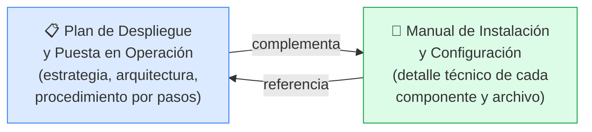

| Aspecto | Plan de Despliegue | Manual de Instalación |
|---------|-------------|-------------|
| **Enfoque** | Proceso de despliegue end-to-end | Configuración técnica detallada por componente |
| **Audiencia** | DevOps, PO, QA | Desarrolladores, DevOps |
| **Contenido** | Comandos de despliegue, rollback, checklist | Estructura de archivos, parámetros, diagramas, explicación de clases |
| **Nivel** | Procedimental | Técnico-explicativo |

---

## 3. Resumen de la Arquitectura del Sistema

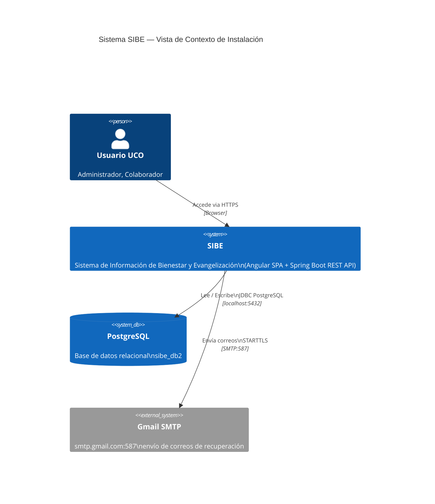

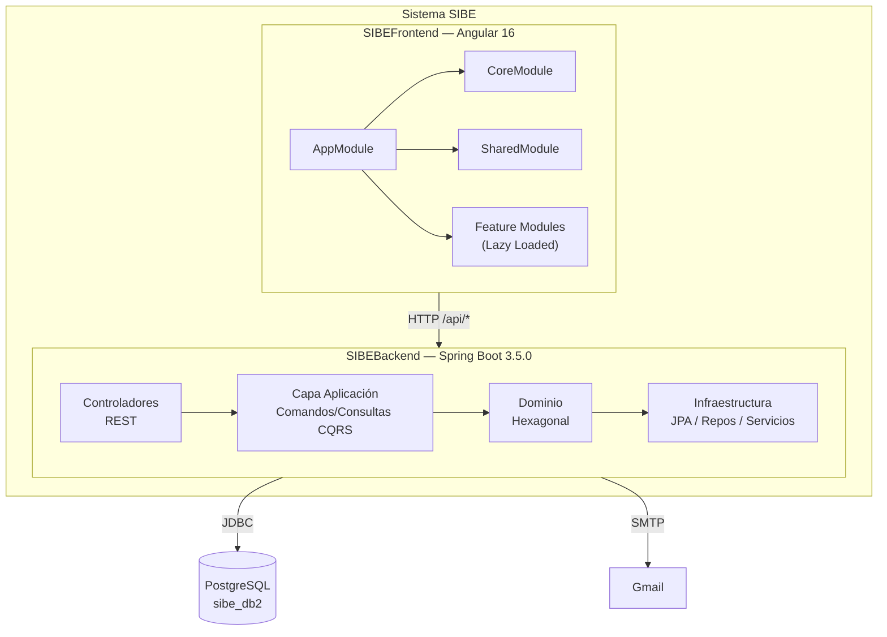

---

## 4. Prerrequisitos de Instalación

### 4.1 Backend (Java / Spring Boot)

| Herramienta | Versión mínima | Versión recomendada | Instalación |
|------------|--------------|---------------------|-------------|
| **JDK** | Java 17 | Eclipse Temurin 17 LTS | [adoptium.net](https://adoptium.net) |
| **Gradle** | 8.x (via wrapper) | — (wrapper incluido) | No requiere instalación separada |
| **Git** | 2.x | 2.43+ | [git-scm.com](https://git-scm.com) |
| **IDE** | — | IntelliJ IDEA (recomendado) | [jetbrains.com](https://www.jetbrains.com) |

> **Nota:** El proyecto incluye `gradlew` (Linux/macOS) y `gradlew.bat` (Windows). No es necesario instalar Gradle globalmente. El wrapper descarga Gradle 8.13 automáticamente.

**Verificación:**
```bash
java -version
# openjdk version "17.x.x" 2024-xx-xx
# OpenJDK Runtime Environment Temurin-17...

# Linux/macOS
./gradlew --version
# Gradle 8.13

# Windows
.\gradlew.bat --version
# Gradle 8.13
```

### 4.2 Frontend (Angular)

| Herramienta | Versión mínima | Versión recomendada | Instalación |
|------------|--------------|---------------------|-------------|
| **Node.js** | 18 LTS | 20 LTS | [nodejs.org](https://nodejs.org) |
| **npm** | 9.x | 10.x | Incluido con Node.js |
| **Angular CLI** | 16.2.13 | 16.2.13 | `npm install -g @angular/cli@16.2.13` |
| **IDE** | — | Visual Studio Code | [code.visualstudio.com](https://code.visualstudio.com) |

**Extensiones de VS Code recomendadas:**
- Angular Language Service
- TypeScript Importer
- Prettier - Code formatter

**Verificación:**
```bash
node --version     # v20.x.x
npm --version      # 10.x.x
ng version         # Angular CLI: 16.2.13
```

### 4.3 Base de Datos (PostgreSQL)

| Herramienta | Versión mínima | Versión recomendada |
|------------|--------------|---------------------|
| **PostgreSQL** | 12 | 16 LTS |
| **pgAdmin** (opcional) | 7.x | 8.x |

**Instalación en Ubuntu 22.04:**
```bash
sudo apt install -y postgresql postgresql-contrib
sudo systemctl enable --now postgresql
```

**Instalación en Windows:**
Descargar el instalador desde [postgresql.org/download/windows](https://www.postgresql.org/download/windows/). Incluye pgAdmin y psql.

**Verificación:**
```bash
psql --version
# psql (PostgreSQL) 16.x
```

### 4.4 Docker (Despliegue Containerizado)

| Herramienta | Versión mínima | Verificación |
|------------|--------------|-------------|
| **Docker** | 20.10+ | `docker --version` |
| **Docker Compose** | 2.0+ | `docker compose version` |

> **Nota:** Para el despliegue Docker **no se requiere** instalar Java, Node.js, npm, Angular CLI ni PostgreSQL localmente. Docker construye todo dentro de los contenedores. Solo se necesitan Docker, Docker Compose y Git.

---

## 5. Obtención del Código Fuente

```bash
# Clonar el repositorio
git clone <URL_DEL_REPOSITORIO> SIBE
cd SIBE

# Estructura del proyecto
SIBE/
├── docker-compose.yml          ← Orquestación Docker (3 servicios)
├── .env.example                ← Plantilla de variables de entorno
├── DEPLOY.md                   ← Guía rápida de despliegue Docker
├── SIBEBackend/          ← Proyecto Spring Boot (Gradle)
│   ├── Dockerfile        ← Build multi-stage backend
│   ├── gradlew           ← Wrapper Gradle (Linux/macOS)
│   ├── gradlew.bat       ← Wrapper Gradle (Windows)
│   ├── build.gradle      ← Dependencias y configuración de build
│   ├── settings.gradle   ← Nombre del proyecto: 'sibe'
│   └── src/
│       ├── main/java/co/edu/uco/sibe/    ← Código fuente
│       └── main/resources/               ← application.properties
├── SIBEFrontend/         ← Proyecto Angular (npm)
│   ├── Dockerfile        ← Build multi-stage frontend
│   ├── nginx.conf        ← Configuración Nginx (SPA + proxy)
│   ├── package.json      ← Dependencias npm
│   ├── angular.json      ← Configuración Angular CLI
│   ├── proxy.conf.json   ← Proxy de desarrollo
│   └── src/
│       └── environments/
│           ├── environment.ts      ← Desarrollo (endpoint absoluto)
│           └── environment.prod.ts ← Producción (endpoint relativo /api)
└── docs/                 ← Documentación del proyecto
    └── artifacts/        ← Artefactos de documentación
```

---

## 6. Instalación y Configuración del Backend

### 6.1 Estructura de Directorios del Backend

```
SIBEBackend/src/main/java/co/edu/uco/sibe/
│
├── Application.java                          ← Clase principal (@SpringBootApplication + @EnableAsync)
│
├── aplicacion/                               ← CAPA DE APLICACIÓN (CQRS)
│   ├── comando/                              33 comandos (DTOs de escritura)
│   │   └── fabrica/                          22 fábricas Comando → Modelo Dominio
│   ├── comando/manejador/                    29 manejadores de comando (@Component)
│   ├── consulta/                             55 manejadores de consulta (@Component)
│   ├── puerto/servicio/                      2 interfaces de servicio de aplicación
│   └── transversal/                          ComandoRespuesta<T> genérico
│
├── dominio/                                  ← CAPA DE DOMINIO (HEXAGONAL)
│   ├── modelo/                               31 agregados/entidades (sin JPA, sin Spring)
│   ├── dto/                                  31 DTOs de salida (read-only)
│   ├── enums/                                4 enumeraciones de dominio
│   ├── puerto/comando/                       19 interfaces de repositorio escritura
│   ├── puerto/consulta/                      24 interfaces de repositorio lectura
│   ├── puerto/servicio/                      3 interfaces de servicios de dominio
│   ├── usecase/comando/                      30 casos de uso escritura (POJO, sin @Component)
│   ├── usecase/consulta/                     34 casos de uso lectura
│   ├── regla/                                Motor de reglas de negocio
│   ├── service/                              7 servicios de dominio
│   └── transversal/
│       ├── constante/                        12 clases de constantes
│       ├── excepcion/                        8 excepciones de dominio
│       └── utilitarios/                      5 clases utilitarias
│
└── infraestructura/                          ← CAPA DE INFRAESTRUCTURA
    ├── adaptador/dao/                        45 Spring Data JPA interfaces
    ├── adaptador/entidad/                    44 @Entity JPA
    ├── adaptador/mapeador/                   44 mapeadores Entity↔Dominio↔DTO
    ├── adaptador/repositorio/comando/        19 @Repository (implementan puertos dominio)
    ├── adaptador/repositorio/consulta/       24 @Repository (implementan puertos dominio)
    ├── adaptador/servicio/                   6 @Component servicios (BCrypt, SMTP, Excel, JWT ctx)
    ├── configuracion/bean/                   3 @Configuration (EncriptarClaveBean, ServiceBean, UseCaseBean)
    ├── configuracion/dataloader/             DataLoader abstracto + 10 cargadores de datos semilla
    ├── controlador/                          LoginControlador
    ├── controlador/comando/                  6 @RestController escritura
    ├── controlador/consulta/                 15 @RestController lectura
    ├── error/                                ManejadorError (@ControllerAdvice)
    └── seguridad/
        ├── configuration/                    ProjectSecurityConfig + UsernamePwdAuthenticationProvider
        └── filter/                           6 filtros JWT/seguridad
```

### 6.2 Configuración de `application.properties`

El archivo de configuración principal está en:
```
SIBEBackend/src/main/resources/application.properties
```

**Contenido actual (con variables de entorno externalizadas):**
```properties
# ─── Nombre de la aplicación ────────────────────────────────────────
spring.application.name=${APP_NAME:SIBE}

# ─── Servidor ───────────────────────────────────────────────────────
server.port=${SERVER_PORT:8080}
server.servlet.context-path=/api
# Todos los endpoints se sirven bajo el prefijo /api
# Ejemplo: GET http://localhost:8080/api/tipos_usuario

# ─── Datasource PostgreSQL ─────────────────────────────────────────
spring.datasource.url=${DB_URL:jdbc:postgresql://localhost:5432/sibe_db2}
spring.datasource.username=${DB_USERNAME:postgres}
spring.datasource.password=${DB_PASSWORD:admin1234}
spring.datasource.driver-class-name=org.postgresql.Driver
# Patrón ${VAR:default}: si la variable de entorno VAR existe, usa su valor;
# si no, usa el valor por defecto después de los dos puntos.
# En Docker, las variables se inyectan vía docker-compose.yml.

# ─── JPA / Hibernate ───────────────────────────────────────────────
spring.jpa.properties.hibernate.dialect=org.hibernate.dialect.PostgreSQLDialect
spring.jpa.open-in-view=false
spring.jpa.hibernate.ddl-auto=${DDL_AUTO:update}
# 'update': Hibernate actualiza el esquema al iniciar.
# En producción estable cambiar a 'validate' vía variable DDL_AUTO.

# ─── Spring Beans ─────────────────────────────────────────────────
spring.main.allow-bean-definition-overriding=true
# Necesario porque UseCaseBean y ServiceBean definen manualmente los beans
# de dominio fuera del escaneo automático de Spring.

# ─── CORS ───────────────────────────────────────────────────────────
app.cors.allowed-origins=${CORS_ALLOWED_ORIGINS:http://localhost:4200,http://localhost}
# Orígenes separados por coma. En producción: https://sibe.midominio.com

# ─── Correo SMTP ────────────────────────────────────────────────────
spring.mail.host=${MAIL_HOST:smtp.gmail.com}
spring.mail.port=${MAIL_PORT:587}
spring.mail.username=${MAIL_USERNAME:sibeapplicationuco@gmail.com}
spring.mail.password=${MAIL_PASSWORD:atsiysuskgnqccrk}
spring.mail.properties.mail.smtp.auth=true
spring.mail.properties.mail.smtp.starttls.enable=true
# Protocolo: SMTP sobre STARTTLS (TLS explícito en puerto 587)
```

> **Nota sobre externalización:** Todos los valores sensibles y configurables usan el patrón `${VARIABLE_ENTORNO:valor_por_defecto}` de Spring. En desarrollo local funcionan con los valores por defecto sin necesidad de configurar nada. En Docker, las variables se inyectan a través de `docker-compose.yml` y/o el archivo `.env`.

**Parámetros explicados:**

| Parámetro | Valor por defecto | Descripción |
|-----------|-------------------|-------------|
| `server.servlet.context-path` | `/api` | Prefijo de todos los endpoints REST. El frontend usa `/api` como base. |
| `spring.jpa.open-in-view` | `false` | Evita el anti-patrón "Open Session in View" que causa consultas N+1. |
| `spring.jpa.hibernate.ddl-auto` | `update` | Hibernate crea/actualiza tablas automáticamente. Configurable vía `DDL_AUTO`. |
| `spring.main.allow-bean-definition-overriding` | `true` | Permite que `UseCaseBean` y `ServiceBean` sobreescriban definiciones existentes sin error de contexto. |
| `app.cors.allowed-origins` | `http://localhost:4200,http://localhost` | Orígenes CORS permitidos. Configurable vía `CORS_ALLOWED_ORIGINS`. |

### 6.3 Configuración del Pool de Conexiones y JPA

El pool de conexiones usa **HikariCP** (incluido por Spring Boot automáticamente). No hay configuración manual adicional, por lo que aplican los valores predeterminados de HikariCP:

| Parámetro HikariCP | Valor por defecto |
|-------------------|------------------|
| `maximumPoolSize` | 10 conexiones |
| `minimumIdle` | 10 conexiones |
| `connectionTimeout` | 30 000 ms |
| `idleTimeout` | 600 000 ms |
| `maxLifetime` | 1 800 000 ms |

Para ajustar en producción, agregar en `application-prod.properties`:
```properties
spring.datasource.hikari.maximum-pool-size=20
spring.datasource.hikari.minimum-idle=5
spring.datasource.hikari.connection-timeout=20000
spring.datasource.hikari.idle-timeout=300000
```

### 6.4 Configuración del Correo Electrónico (SMTP)

El servicio de correo se usa exclusivamente para el flujo de **recuperación de contraseña** (los tres endpoints públicos de `/api/usuarios/recuperacion/...`).

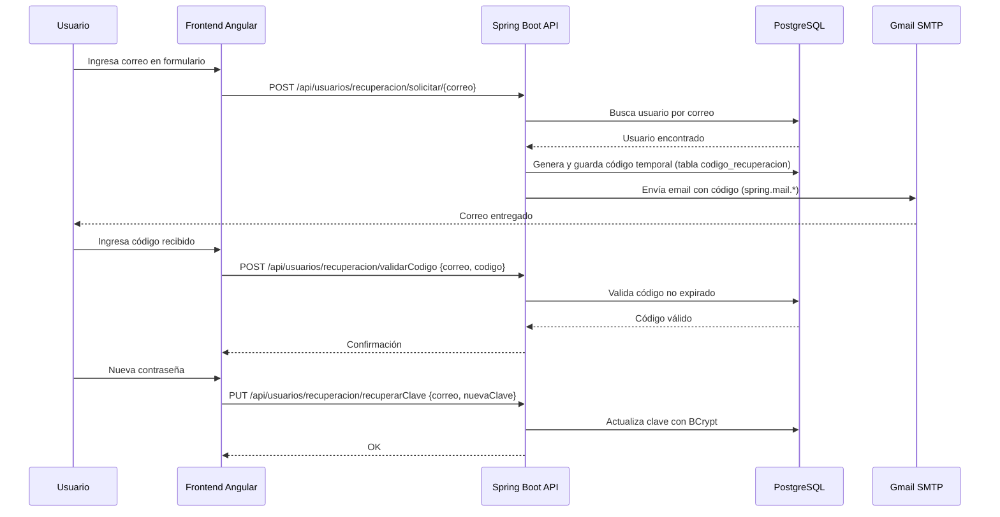

**Clase responsable de envío:**
`co.edu.uco.sibe.infraestructura.adaptador.servicio.EnviarCorreoElectronicoServiceMailSender`

Implementa el puerto de dominio `EnviarCorreoElectronicoService`, que es inyectado en los casos de uso de recuperación.

### 6.5 Configuración Asíncrona (@EnableAsync)

```java
// Application.java
@SpringBootApplication
@EnableAsync   // ← Habilita el procesamiento asíncrono de Spring
public class Application {
    public static void main(String[] args) {
        SpringApplication.run(Application.class, args);
    }
}
```

La anotación `@EnableAsync` permite el uso de `@Async` en métodos de servicio. En SIBE se usa para procesar el envío de correos electrónicos de forma no bloqueante, evitando que el usuario espere la respuesta del servidor SMTP.

### 6.6 Construcción del Proyecto

```bash
# Desde el directorio SIBEBackend/

# ─── Compilar y crear JAR ────────────────────────────────────────────
./gradlew clean build

# ─── Compilar omitiendo tests (para desarrollo rápido) ──────────────
./gradlew clean build -x test

# ─── Ejecutar en modo desarrollo ───────────────────────────────────
./gradlew bootRun

# ─── Solo ejecutar tests ────────────────────────────────────────────
./gradlew test

# ─── Generar reporte JaCoCo de cobertura ────────────────────────────
./gradlew test jacocoTestReport
# Reporte en: build/jacocoHtml/index.html

# ─── Windows PowerShell ─────────────────────────────────────────────
.\gradlew.bat clean build -x test
.\gradlew.bat bootRun
```

**Resultado del build:**
```
SIBEBackend/build/libs/
└── sibe-0.0.1-SNAPSHOT.jar    ← Fat JAR ejecutable (~60-80 MB)
```

---

## 7. Configuración del Módulo de Seguridad (Backend)

### 7.1 Visión General del Sistema de Seguridad

El sistema de seguridad del backend está implementado en:
```
infraestructura/seguridad/
├── configuration/
│   ├── ProjectSecurityConfig.java           ← Configuración central Spring Security
│   └── UsernamePwdAuthenticationProvider.java ← Validación de credenciales contra BD
└── filter/
    ├── ExceptionFilter.java                 ← Manejo de excepciones en filtros
    ├── RequestValidationBeforeFilter.java   ← Validación del esquema de autenticación
    ├── AuthoritiesLoggingAtFilter.java      ← Log durante autenticación
    ├── JWTTokenValidatorFilter.java         ← Validación de JWT en peticiones
    ├── BasicAuthenticationFilter.java       ← (Spring built-in) Login usuario/contraseña
    ├── AuthoritiesLoggingAfterFilter.java   ← Log después de autenticación
    └── JWTTokenGeneratorFilter.java         ← Generación de JWT post-login
```

**Clases de configuración relevantes:**
```
dominio/transversal/constante/
├── SeguridadConstante.java    ← JWT_KEY, JWT_HEADER, roles, autoridades
└── ApiEndpointConstante.java  ← Rutas de la API (/api/usuarios, /api/login, etc.)
```

### 7.2 Cadena de Filtros de Seguridad

```mermaid
flowchart TD
    REQ["HTTP Request\n(cualquier endpoint)"]
    
    REQ --> F1["1️⃣ ExceptionFilter\nextends OncePerRequestFilter\n\nCaptura excepciones de TODOS\nlos filtros posteriores y devuelve\nuna respuesta HTTP apropiada"]
    
    F1 --> F2["2️⃣ RequestValidationBeforeFilter\nimplements Filter\n\nValida que el header Authorization\ntenga el prefijo correcto\n('Basic' para login)"]
    
    F2 --> F3["3️⃣ AuthoritiesLoggingAtFilter\n(posición AT BasicAuthFilter)\n\nRegistra en log las autoridades\ndurante el proceso de autenticación"]
    
    F3 --> F4["4️⃣ JWTTokenValidatorFilter\nextends OncePerRequestFilter\n\nSi hay header Authorization con JWT:\n• Extrae y valida el token\n• Crea SecurityContext con usuario\nSe omite en /api/login"]
    
    F4 --> F5["5️⃣ BasicAuthenticationFilter\n(Spring built-in)\n\nProcesa credenciales usuario:contraseña\nvía HTTP Basic Auth (solo /api/login)\nDelega a UsernamePwdAuthenticationProvider"]
    
    F5 --> F6["6️⃣ AuthoritiesLoggingAfterFilter\nextends OncePerRequestFilter\n\nRegistra autoridades del usuario\nuna vez completada la autenticación"]
    
    F6 --> F7["7️⃣ JWTTokenGeneratorFilter\nextends OncePerRequestFilter\n\nDespués del login exitoso:\n• Genera JWT firmado con HMAC-SHA\n• Lo agrega al header 'Authorization'\n• El cliente lo almacena en sessionStorage\nSe ejecuta SOLO en /api/login"]
    
    F7 --> CTRL["🎯 Controlador REST\n(@PreAuthorize verifica autoridades\npor método)"]
    
    style REQ fill:#fef9c3,stroke:#ca8a04
    style CTRL fill:#dcfce7,stroke:#16a34a
    style F1 fill:#fee2e2,stroke:#ef4444
    style F4 fill:#dbeafe,stroke:#3b82f6
    style F5 fill:#ede9fe,stroke:#7c3aed
    style F7 fill:#d1fae5,stroke:#059669
```

### 7.3 Flujo completo de Autenticación y Autorización

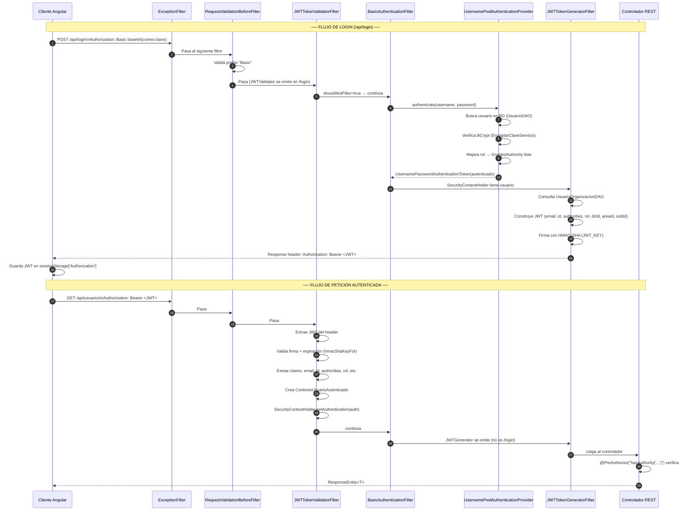

### 7.4 Configuración JWT

**Constantes de seguridad (`SeguridadConstante.java`):**

| Constante | Valor | Descripción |
|-----------|-------|-------------|
| `JWT_KEY` | `"jxgEQeXHuPq8VdbyYFNkANdudQ53YUn4"` | Clave secreta HMAC-SHA ⚠️ **Hardcodeada — debe externalizarse antes de producción** |
| `JWT_HEADER` | `"Authorization"` | Header HTTP que contiene el token |
| `APP_NAME` | `"Login"` | Issuer del JWT |
| `JWT_TOKEN` | `"JWT Token"` | Subject del JWT |

**Claims del JWT generado:**

| Claim | Parámetro | Tipo | Descripción |
|-------|-----------|------|-------------|
| `email` | `EMAIL_PARAMETER` | String | Correo del usuario autenticado |
| `id` | `ID_PARAMETER` | UUID String | Identificador único del usuario |
| `authorities` | `AUTHORITIES_PARAMETER` | String CSV | Autoridades separadas por coma |
| `rol` | `ROL_PARAMETER` | String | Tipo de usuario (ADMINISTRADOR_DIRECCION, etc.) |
| `direccionId` | `DIRECCION_ID_PARAMETER` | UUID String | ID de dirección (si aplica) |
| `areaId` | `AREA_ID_PARAMETER` | UUID String | ID de área (si aplica) |
| `subareaId` | `SUBAREA_ID_PARAMETER` | UUID String | ID de subárea (si aplica) |
| `iss` | Issuer | String | `"Login"` (APP_NAME) |
| `sub` | Subject | String | `"JWT Token"` |
| `iat` | IssuedAt | Date | Fecha de emisión |
| `exp` | Expiration | Date | Fecha de expiración (iat + 14 400 000 ms ≈ 4 horas) |

**Ciclo de vida del JWT:**

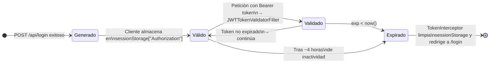

**Tiempo de expiración:**
```java
// NumeroConstante.java
public static final long CATORCE_MILLONES_CUATROCIENTOS_MIL = 14_400_000L;   // milisegundos
// 14.400.000 ms = 14.400 s = 240 min = 4 horas
```

### 7.5 Configuración CORS

La configuración CORS fue actualizada para ser **parametrizable** mediante la propiedad `app.cors.allowed-origins` en `application.properties`. Ya no se usa la constante hardcodeada `LOCAL_FRONT_URL`.

```java
// ProjectSecurityConfig.java — configuración CORS (actualizado)
private final Environment environment; // Inyectado vía @AllArgsConstructor

// Dentro del bean corsConfigurationSource:
String allowedOrigins = environment.getProperty("app.cors.allowed-origins", "http://localhost:4200");
config.setAllowedOrigins(Arrays.asList(allowedOrigins.split(",")));
config.setAllowedMethods(Collections.singletonList("*")); // GET, POST, PUT, DELETE, OPTIONS
config.setAllowCredentials(true);
config.setAllowedHeaders(Collections.singletonList("*")); // Todos los headers
config.setExposedHeaders(List.of(JWT_HEADER));            // Expone "Authorization" al cliente
config.setMaxAge(TRES_MIL_SEICIENTOS_LONG);               // 3600 segundos de caché preflight
```

**Implicaciones de configuración:**

| Configuración | Valor actual | Impacto en producción |
|--------------|-------------|----------------------|
| `allowedOrigins` | Leído de `app.cors.allowed-origins` (default: `http://localhost:4200,http://localhost`) | Configurable vía variable `CORS_ALLOWED_ORIGINS` en `.env`. Cambiar a `https://sibe.midominio.com` en producción. |
| `allowCredentials` | `true` | Permite cookies y credentials headers |
| `exposedHeaders` | `Authorization` | Necesario para que el cliente Angular pueda leer el JWT del header de respuesta |
| `maxAge` | `3600s` | El navegador cachea el preflight CORS por 1 hora |

### 7.6 Roles y Autoridades del Sistema

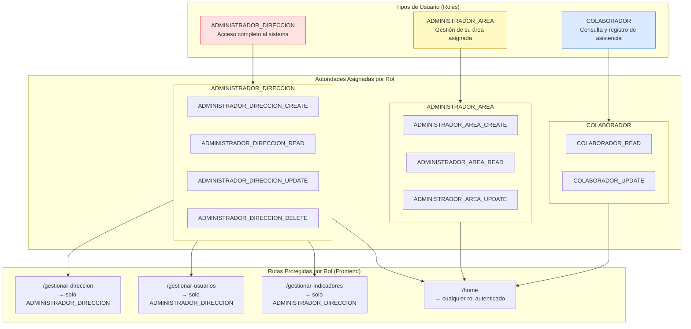

**Uso de autoridades en controladores (`@PreAuthorize`):**

```java
// Ejemplo: AccionComandoControlador.java
@PreAuthorize("hasAuthority('ADMINISTRADOR_AREA_CREATE') or hasAuthority('ADMINISTRADOR_DIRECCION_CREATE')")
@PostMapping
public ResponseEntity<ComandoRespuesta<UUID>> registrar(@RequestBody AccionComando comando) { ... }

// Ejemplo: UsuarioComandoControlador.java
@PreAuthorize("hasAuthority('ADMINISTRADOR_DIRECCION_CREATE')")
@PostMapping
public ResponseEntity<ComandoRespuesta<UUID>> registrar(@RequestBody UsuarioComando comando) { ... }
```

Las siguientes expresiones de autoridad combinada están definidas en `SeguridadConstante`:

| Constante | Expresión | Descripción |
|-----------|-----------|-------------|
| `HAS_ADMIN_CREATE_AUTHORITY` | `hasAuthority('ADMINISTRADOR_DIRECCION_CREATE')` | Solo admin dirección puede crear |
| `HAS_AREA_ADMIN_OR_ADMIN_CREATE_AUTHORITY` | `hasAuthority('...') or hasAuthority('...')` | Admin o área admin puede crear |
| `HAS_USER_OR_AREA_ADMIN_OR_ADMIN_GET_AUTHORITY` | Tres autoridades combinadas | Cualquier rol puede consultar |
| `HAS_AREA_ADMIN_OR_ADMIN_UPDATE_AUTHORITY` | Dos autoridades combinadas | Admin o área admin puede actualizar |

### 7.7 Endpoints Públicos vs. Protegidos

```java
// ProjectSecurityConfig.java — reglas de autorización
.authorizeHttpRequests(auth -> auth
    // Recuperación de contraseña — PÚBLICOS (sin token)
    .requestMatchers(HttpMethod.POST, "/usuarios/recuperacion/solicitar/{correo}").permitAll()
    .requestMatchers(HttpMethod.POST, "/usuarios/recuperacion/validarCodigo").permitAll()
    .requestMatchers(HttpMethod.PUT,  "/usuarios/recuperacion/recuperarClave").permitAll()
    // Login — requiere autenticación Basic (usuario/contraseña)
    .requestMatchers("/login").authenticated()
    // Todo lo demás — requiere token JWT válido
    .anyRequest().authenticated()
)
```

**Resumen de accesibilidad:**

| Endpoint | Método | Auth requerida | Descripción |
|----------|--------|---------------|-------------|
| `/api/usuarios/recuperacion/solicitar/{correo}` | POST | ❌ Pública | Solicitar código de recuperación |
| `/api/usuarios/recuperacion/validarCodigo` | POST | ❌ Pública | Validar código recibido por email |
| `/api/usuarios/recuperacion/recuperarClave` | PUT | ❌ Pública | Establecer nueva contraseña |
| `/api/login` | POST | Basic Auth | Login (usuario:contraseña → JWT) |
| `/api/**` (todos los demás) | ANY | JWT Bearer | Requieren token válido |

### 7.8 Encriptación de Contraseñas (BCrypt)

```java
// EncriptarClaveBean.java
@Configuration
public class EncriptarClaveBean {
    @Bean
    public PasswordEncoder EncriptarClave() {
        return new BCryptPasswordEncoder();
    }
}
```

**Configuración BCrypt:**
- **Algoritmo:** BCrypt con factor de costo 10 (valor por defecto de Spring).
- **Función:** `BCryptPasswordEncoder.encode(rawPassword)` genera un hash único por cada llamada.
- **Verificación:** `BCryptPasswordEncoder.matches(rawPassword, encodedPassword)` — usado en `UsernamePwdAuthenticationProvider`.
- **Seguridad:** BCrypt es resistente a ataques de fuerza bruta y arco iris gracias al salt aleatorio embebido.

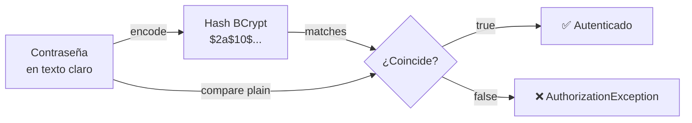

El puerto de dominio `EncriptarClaveServicio` se implementa en `EncriptarClaveServicioEncoder`:
```java
// EncriptarClaveServicioEncoder.java
@Component
public class EncriptarClaveServicioEncoder implements EncriptarClaveServicio {
    @Autowired
    private PasswordEncoder passwordEncoder;

    @Override
    public String encriptar(String clave) { return passwordEncoder.encode(clave); }

    @Override
    public boolean existe(String claveTextoClaro, String claveEncriptada) {
        return passwordEncoder.matches(claveTextoClaro, claveEncriptada);
    }
}
```

### 7.9 Proveedor de Autenticación Personalizado

`UsernamePwdAuthenticationProvider` implementa `AuthenticationProvider` de Spring Security y realiza los siguientes pasos:

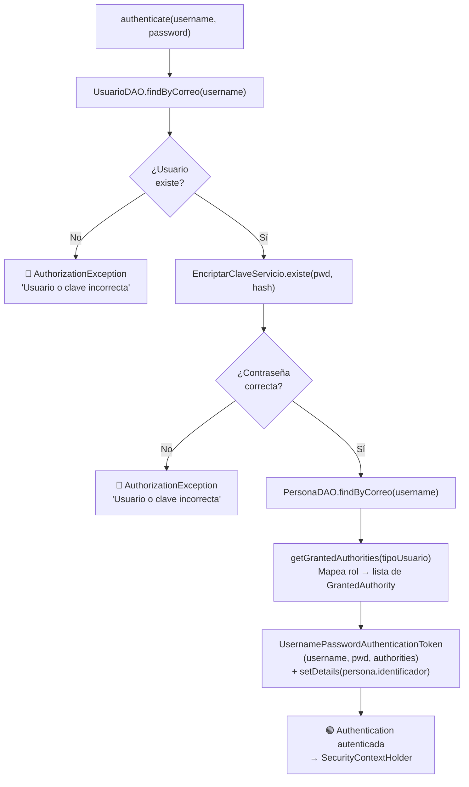

**Mapeo de rol a autoridades:**
```java
// UsernamePwdAuthenticationProvider — getGrantedAuthorities()
// Para ADMINISTRADOR_DIRECCION → crea autoridades:
// "ADMINISTRADOR_DIRECCION_CREATE", "ADMINISTRADOR_DIRECCION_READ",
// "ADMINISTRADOR_DIRECCION_UPDATE", "ADMINISTRADOR_DIRECCION_DELETE",
// "CREATE", "READ", "UPDATE", "DELETE"

// Para ADMINISTRADOR_AREA → crea autoridades:
// "ADMINISTRADOR_AREA_CREATE", "ADMINISTRADOR_AREA_READ", "ADMINISTRADOR_AREA_UPDATE",
// "CREATE", "READ", "UPDATE"

// Para COLABORADOR → crea autoridades:
// "COLABORADOR_READ", "COLABORADOR_UPDATE", "READ", "UPDATE"
```

---

## 8. Configuración de Beans y Cableado de Dependencias (Backend)

El patrón de arquitectura hexagonal del proyecto implica que los casos de uso del dominio **no son componentes de Spring** y deben cablearse manualmente mediante clases `@Configuration`.

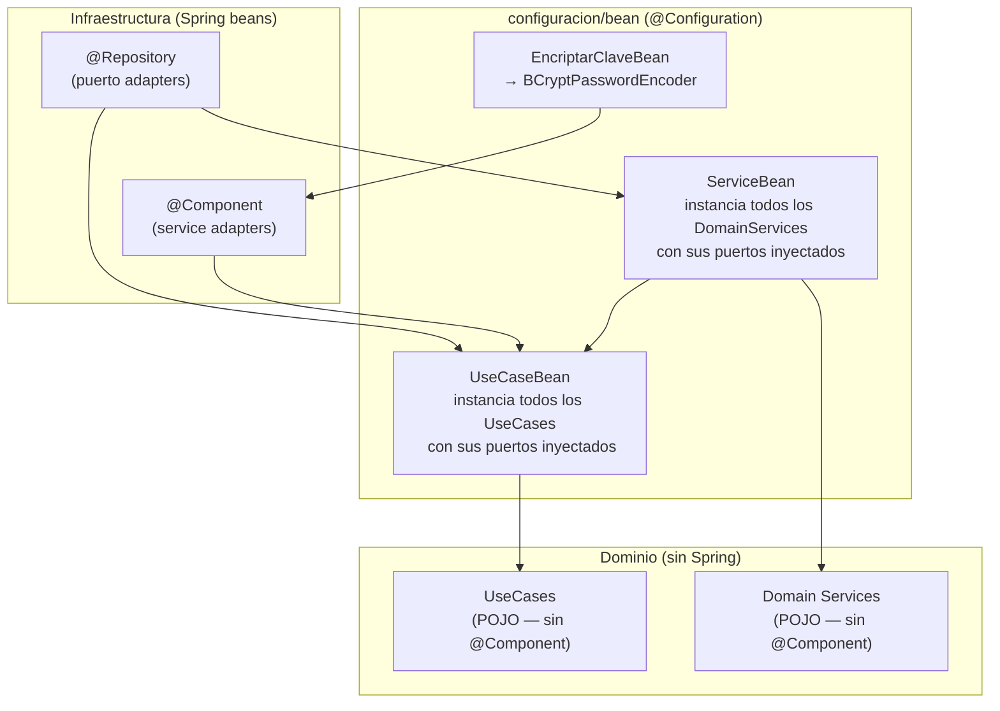

### 8.1 EncriptarClaveBean

**Archivo:** `infraestructura/configuracion/bean/EncriptarClaveBean.java`

```java
@Configuration
public class EncriptarClaveBean {
    @Bean
    public PasswordEncoder EncriptarClave() {
        return new BCryptPasswordEncoder();
    }
}
```

Este bean provee el `PasswordEncoder` de Spring Security que es inyectado en:
1. `EncriptarClaveServicioEncoder` (adapter de infraestructura).
2. `UsernamePwdAuthenticationProvider` (via `EncriptarClaveServicio`).

### 8.2 ServiceBean

**Archivo:** `infraestructura/configuracion/bean/ServiceBean.java`

Instancia manualmente los **7 servicios de dominio** que no tienen `@Component`:

| Servicio | Descripción | Dependencias inyectadas |
|---------|-------------|------------------------|
| `VincularUsuarioConAreaService` | Vincula usuario a área/subárea | `UsuarioOrganizacionComando` |
| `ModificarVinculacionUsuarioConAreaService` | Modifica vínculo usuario-área | `UsuarioOrganizacionComando` |
| `VincularActividadConAreaService` | Vincula actividad a estructura organizacional | 3 repos comando |
| `ModificarVinculacionActividadConAreaService` | Modifica vínculo actividad-área | 6 repos + `VincularActividadConAreaService` |
| `RegistrarParticipanteService` | Registra asistencia de participantes | 2 repos participante |
| `ContarUsuariosPorOrganizacionService` | Cuenta usuarios por dirección/área/subárea | `UsuarioOrganizacionConsulta` |
| `AutorizacionContextoOrganizacionalServicio` | Valida que el usuario opera dentro de su ámbito | `ContextoUsuarioProveedorServicio` |

### 8.3 UseCaseBean

**Archivo:** `infraestructura/configuracion/bean/UseCaseBean.java`

Instancia los **64 casos de uso** (30 comando + 34 consulta) del dominio. Cada caso de uso recibe sus dependencias (puertos) vía constructor.

**Ejemplo de cableado:**
```java
// UseCaseBean.java (extracto)
@Bean
public RegistrarActividadUseCase registrarActividadUseCase(
        ActividadRepositorioComando actividadRepositorioComando,
        VincularActividadConAreaService vincularActividadConAreaService,
        IndicadorRepositorioConsulta indicadorRepositorioConsulta) {
    return new RegistrarActividadUseCase(
        actividadRepositorioComando,
        vincularActividadConAreaService,
        indicadorRepositorioConsulta);
}
```

**Razón del diseño:** los casos de uso no tienen ninguna anotación de Spring para mantener el dominio completamente independiente del framework. Este patrón garantiza que el dominio pueda ser testeado sin contexto Spring y cumple el principio de inversión de dependencias.

---

## 9. Configuración del Manejo de Errores (Backend)

**Archivo:** `infraestructura/error/ManejadorError.java`

```java
@ControllerAdvice   // Intercepta excepciones de todos los @RestController
public class ManejadorError extends ResponseEntityExceptionHandler {
```

**Mapa de excepciones → códigos HTTP:**

| Excepción de Dominio | Código HTTP | Descripción |
|---------------------|------------|-------------|
| `ValorObligatorioExcepcion` | `400 Bad Request` | Campo requerido no provisto |
| `LongitudExcepcion` | `400 Bad Request` | Longitud de campo fuera de rango |
| `PatronExcepcion` | `400 Bad Request` | Formato inválido (regex) |
| `ValorDuplicadoExcepcion` | `400 Bad Request` | Valor ya existe en BD |
| `ValorInvalidoExcepcion` | `400 Bad Request` | Valor no cumple regla de negocio |
| `NullPointerException` | `400 Bad Request` | Valor nulo inesperado |
| `AuthorizationException` | `403 Forbidden` | Sin autorización para la operación |
| `TecnicoExcepcion` | `500 Internal Server Error` | Error técnico interno |
| `UnsupportedOperationException` | `500 Internal Server Error` | Operación no soportada |
| Cualquier otra `Exception` | `500 Internal Server Error` | Error no catalogado (se loguea con SLF4J) |

**Formato de la respuesta de error:**
```json
{
  "excepcionNombre": "ValorObligatorioExcepcion",
  "mensaje": "El correo electrónico es obligatorio"
}
```

**Clase** `Error.java` (body de respuesta):
```java
// infraestructura/error/Error.java
public record Error(String excepcionNombre, String mensaje) {}
```

---

## 10. Instalación y Configuración del Frontend

### 10.1 Estructura de Directorios del Frontend

```
SIBEFrontend/src/
│
├── index.html                           ← Punto de entrada HTML (base href="/")
├── main.ts                              ← Bootstrapping Angular (platformBrowserDynamic)
├── styles.scss                          ← Estilos globales
│
├── environments/
│   ├── environment.ts                   ← DEV: production=false, endpoint=localhost:8080/api
│   └── environment.prod.ts              ← PROD: (debe crearse) production=true
│
└── app/
    ├── app.module.ts                    ← Módulo raíz
    ├── app.component.ts                 ← Componente raíz (<app-root>)
    ├── app-routing.module.ts            ← Definición de rutas principales
    │
    ├── core/                            ← Módulo singleton (servicios y providers globales)
    │   ├── core.module.ts               ← Registra interceptores y servicios HTTP
    │   ├── components/
    │   │   ├── header/                  ← Componente header con navegación
    │   │   └── footer/                  ← Componente footer
    │   ├── guard/
    │   │   ├── security.guard.ts        ← Protege rutas que requieren autenticación
    │   │   └── public-route.guard.ts    ← Protege rutas que no requieren autenticación
    │   ├── interceptor/
    │   │   ├── auth-interceptor.ts      ← Inyección de credenciales (Basic + Bearer)
    │   │   ├── token-interceptor.ts     ← Validación de expiración del token
    │   │   ├── manejador-error.ts       ← ErrorHandler global de Angular
    │   │   └── http-codigo-error.ts     ← Mensajes de error por código HTTP
    │   ├── model/
    │   │   ├── usuario.model.ts         ← Interfaz Usuario (campos del formulario de login)
    │   │   ├── options.model.ts         ← Interfaz Options para HttpService
    │   │   └── menu-item.model.ts       ← Interfaz MenuItem (navegación header)
    │   └── service/
    │       └── http.service.ts          ← Servicio HTTP genérico (wrapper de HttpClient)
    │
    ├── shared/                          ← Módulo compartido (componentes reutilizables)
    │   ├── shared.module.ts
    │   ├── components/                  ← 16 componentes compartidos
    │   └── service/
    │       └── state.service.ts         ← Servicio de estado compartido
    │
    └── feature/                         ← Módulos de funcionalidad (lazy loaded)
        ├── login/
        ├── home/
        │   └── modules/
        │       ├── bienestar-area/       ← Área Bienestar (8 subáreas)
        │       ├── evangelizacion-area/  ← Área Evangelización
        │       ├── hogar-area/           ← Área Hogar Juvenil
        │       └── servicio-area/        ← Área Servicio y Atención
        ├── manage-department/
        ├── manage-users/
        ├── manage-indicators/
        └── password-recovery/
```

### 10.2 Instalación de Dependencias

```bash
# Desde el directorio SIBEFrontend/

# Instalar dependencias (primera vez o tras cambios en package.json)
npm install
# Alternativa reproducible (recomendada en CI/CD):
npm ci

# Verificar que no hay vulnerabilidades críticas
npm audit

# Iniciar servidor de desarrollo
npm start
# Equivalente a: ng serve --proxy-config proxy.conf.json -o
# URL: http://localhost:4200
```

**Dependencias principales instaladas:**

| Grupo | Paquete | Versión | Propósito |
|-------|---------|---------|-----------|
| **Framework** | `@angular/core` | ^16.2.0 | Framework Angular |
| **Framework** | `@angular/router` | ^16.2.0 | Enrutamiento SPA |
| **Framework** | `@angular/forms` | ^16.2.0 | Formularios reactivos y por plantilla |
| **Framework** | `@angular/common/http` | ^16.2.0 | HttpClient, interceptores |
| **UI** | `bootstrap` | ^5.3.6 | Framework CSS |
| **UI** | `bootstrap-icons` | ^1.13.1 | Iconos SVG |
| **Gráficas** | `chart.js` | ^4.5.0 | Biblioteca de gráficos |
| **Gráficas** | `chartjs-plugin-datalabels` | ^2.2.0 | Etiquetas en gráficas |
| **Auth** | `jwt-decode` | ^4.0.0 | Decodificar JWT en cliente |
| **Cookies** | `ngx-cookie-service` | ^16.1.0 | Gestión de cookies (usado por TokenInterceptor) |
| **Excel** | `xlsx` | ^0.18.5 | Exportación de datos a Excel |
| **Carrusel** | `swiper` | ^11.2.10 | Componente slider/carrusel |
| **Reactivo** | `rxjs` | ~7.8.0 | Programación reactiva |

### 10.3 Configuración de Entornos (environment)

**Archivo actual — `src/environments/environment.ts` (desarrollo):**
```typescript
export const environment = {
  production: false,
  endpoint: 'http://localhost:8080/api'
  // Apunta directamente al backend de desarrollo.
  // En desarrollo, el proxy (proxy.conf.json) redirige /api → localhost:8080,
  // por lo que también se podría usar solo '/api'.
};
```

**Archivo — `src/environments/environment.prod.ts` (producción):**  
> ✅ Este archivo **ya existe** en el proyecto y se usa automáticamente en el build de producción.

```typescript
export const environment = {
  production: true,
  endpoint: '/api'
  // Rutas relativas: nginx en producción (Docker) hace proxy_pass
  // de /api/* → Spring Boot backend:8080/api/*
};
```

**Configuración de `fileReplacements` en `angular.json`** (ya configurada — el build de producción usa `environment.prod.ts` automáticamente):
```json
"configurations": {
  "production": {
    "fileReplacements": [
      {
        "replace": "src/environments/environment.ts",
        "with": "src/environments/environment.prod.ts"
      }
    ]
  }
}
```

**Uso en componentes y servicios:**
```typescript
import { environment } from '../../../environments/environment';

// En el servicio de login:
const url = `${environment.endpoint}/login`;  // → http://localhost:8080/api/login (dev)
                                               // → /api/login (prod)
```

### 10.4 Módulo Raíz (AppModule)

**Archivo:** `src/app/app.module.ts`

```typescript
@NgModule({
  declarations: [AppComponent],
  imports: [
    BrowserModule,      // Módulo base del browser (DOM, eventos)
    AppRoutingModule,   // Rutas principales de la app
    CoreModule,         // Header, Footer, interceptores, HttpService
    SharedModule        // Componentes reutilizables
  ],
  providers: [
    CookieService,      // ngx-cookie-service — acceso a cookies del navegador
    // Los interceptores están registrados en CoreModule, no aquí
    // (comentados en AppModule para evitar duplicados)
    // { provide: HTTP_INTERCEPTORS, useClass: AuthInterceptor, multi: true },
    // { provide: HTTP_INTERCEPTORS, useClass: TokenInterceptor, multi: true }
  ],
  bootstrap: [AppComponent]
})
export class AppModule {}
```

> ⚠️ Los interceptores `AuthInterceptor` y `TokenInterceptor` están **comentados** en `AppModule` porque ya están correctamente registrados en `CoreModule`. Registrarlos en ambos módulos causaría ejecución doble de cada interceptor por petición.

### 10.5 Módulo Core (CoreModule)

**Archivo:** `src/app/core/core.module.ts`

El `CoreModule` es el módulo de infraestructura del frontend. Se importa **una sola vez** en AppModule y provee todos los servicios y providers globales.

```typescript
@NgModule({
  declarations: [FooterComponent, HeaderComponent],
  exports: [FooterComponent, HeaderComponent],
  imports: [CommonModule, HttpClientModule, AppRoutingModule, SharedModule],
  providers: [
    HttpService,             // Servicio HTTP genérico (wrapper de HttpClient)
    {
      provide: HTTP_INTERCEPTORS,
      useClass: TokenInterceptor,   // 1️⃣ Primero: valida expiración del JWT
      multi: true
    },
    {
      provide: HTTP_INTERCEPTORS,
      useClass: AuthInterceptor,    // 2️⃣ Segundo: inyecta credenciales (Basic o Bearer)
      multi: true
    },
    {
      provide: ErrorHandler,
      useClass: ManejadorError      // Reemplaza el ErrorHandler predeterminado de Angular
    }
  ]
})
export class CoreModule {}
```

**Orden de interceptores:** En Angular, los interceptores se aplican en el mismo orden en que están registrados en el array `providers`. En este caso: `TokenInterceptor` → `AuthInterceptor`.

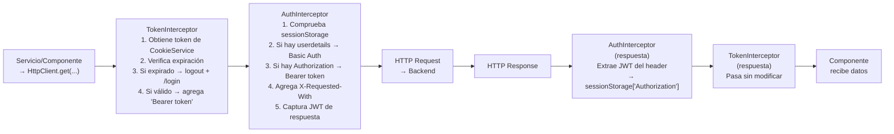

### 10.6 Módulo Shared (SharedModule)

**Archivo:** `src/app/shared/shared.module.ts`

Exporta 16 componentes reutilizables y 1 servicio:

| Componente | Descripción |
|-----------|-------------|
| `GoToAreaButtonComponent` | Botón de navegación hacia un área |
| `SeparatorComponent` | Separador visual entre secciones |
| `PrimaryButtonComponent` | Botón principal con estilos SIBE |
| `AreaTopImageComponent` | Imagen cabecera de área |
| `AreaButtonsComponent` | Grid de botones de subáreas |
| `RegisterNewActivityComponent` | Formulario registro de nueva actividad |
| `ActivityInfoComponent` | Vista detalle de actividad |
| `AttendanceRecordComponent` | Registro de asistencia (búsqueda por identificación/carnet) |
| `ActivitiesTableComponent` | Tabla paginada de actividades |
| `FilterListComponent` | Filtros de búsqueda para tablas |
| `EditActivityComponent` | Formulario edición de actividad |
| `ChangePasswordComponent` | Formulario cambio de contraseña |
| `UploadDatabaseComponent` | Subida de archivo Excel (carga masiva) |
| `ExternalParticipantComponent` | Registro de participante externo |
| `TotalParticipantsComponent` | Gráfica Chart.js de participantes totales |
| `CompletedActivitiesComponent` | Gráfica de actividades completadas |
| `TotalParticipantsMonthsComponent` | Gráfica de participantes por mes |

**StateService:** maneja el estado compartido entre componentes (datos de actividad activa, filtros, etc.) vía inyección de dependencias compartida dentro del módulo Shared.

### 10.7 Módulos de Feature (Lazy Loading)

Todos los módulos de feature se cargan de forma **perezosa** (`loadChildren`), mejorando el tiempo de carga inicial:

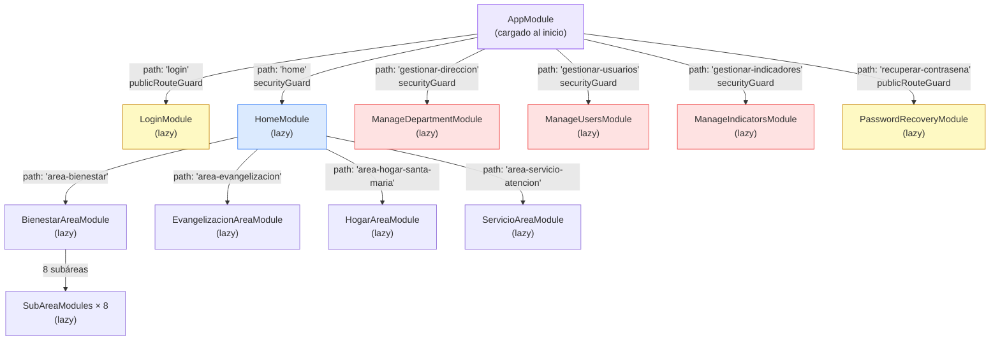

**Beneficios del lazy loading:**
- El bundle inicial solo contiene `AppModule` + `CoreModule` + `SharedModule`.
- Los módulos de feature se descargan solo cuando el usuario navega a esa ruta.
- En producción, Angular genera un chunk JS separado por cada módulo lazy.

---

## 11. Configuración de Interceptores HTTP (Frontend)

### 11.1 AuthInterceptor — Credenciales e Inyección de Token

**Archivo:** `src/app/core/interceptor/auth-interceptor.ts`

Este interceptor maneja **dos modos** de autenticación:

**Modo 1 — Login inicial (Basic Auth):**
- Cuando el usuario va a hacer login, el formulario guarda temporalmente `{correo, contrasena}` en `sessionStorage['userdetails']`.
- El interceptor detecta `userdetails` y construye el header `Authorization: Basic base64(correo:contrasena)`.
- Después de inyectar el header, limpia `userdetails` de sessionStorage por seguridad.

**Modo 2 — Petición autenticada (Bearer Token):**
- Para peticiones normales (post-login), lee el JWT de `sessionStorage['Authorization']`.
- Inyecta `Authorization: Bearer <token>`.

**Captura del JWT de respuesta:**
- Monitorea las respuestas HTTP con `tap()`.
- Si la respuesta contiene un header `Authorization`, lo guarda en `sessionStorage['Authorization']`.
- Esto ocurre en el login: el backend devuelve el JWT en la respuesta al `POST /api/login`.

```typescript
// Headers adicionales inyectados por AuthInterceptor
httpHeaders.append('X-Requested-With', 'XMLHttpRequest');
// → Identifica la petición como AJAX (no directa desde navegador)
// → Ayuda a prevenir ataques CSRF en algunos contextos
```

### 11.2 TokenInterceptor — Validación de Expiración

**Archivo:** `src/app/core/interceptor/token-interceptor.ts`

Este interceptor actúa **antes** de `AuthInterceptor` (se registra primero en `CoreModule`). Opera con el token almacenado en **`sessionStorage['Authorization']`**, unificado con el resto de la aplicación:

```typescript
// TokenInterceptor — lógica de validación
const token = sessionStorage.getItem('Authorization');   // Lee token de sessionStorage

if (token && this.isTokenExpired(token)) {
    this.logout();                    // Limpia sessionStorage + localStorage
    this.router.navigate(['/login']); // Redirige al login
    return throwError(() => new Error('Token expirado')); // Cancela la petición
}
```

**Método `isTokenExpired`:**
```typescript
private isTokenExpired(token: string): boolean {
    // Decodifica el payload del JWT (parte central, base64)
    const payload = JSON.parse(atob(token.split('.')[1]));
    const exp = payload.exp * 1000; // exp del JWT está en segundos → ms
    return Date.now() > exp;
}
```

**Mecanismo de almacenamiento unificado:**

| Componente | Mecanismo | Operación |
|-----------|-----------|-----------|
| `AuthInterceptor` | `sessionStorage['Authorization']` | Escribe el JWT tras login exitoso |
| `AuthInterceptor` | `sessionStorage['Authorization']` | Lee el JWT para inyectar en peticiones |
| `TokenInterceptor` | `sessionStorage['Authorization']` | Lee el JWT para verificar expiración |
| `securityGuard` | `sessionStorage['Authorization']` | Lee el JWT para proteger rutas |

**Nota:** El backend envía el JWT crudo (sin prefijo `Bearer`) en el header de respuesta al hacer login. `AuthInterceptor` lo almacena tal cual en `sessionStorage` y lo inyecta igual en peticiones posteriores.

**Método `logout`:**
```typescript
private logout(): void {
    sessionStorage.clear();             // Limpia sessionStorage (incluye JWT)
    localStorage.clear();               // Limpia localStorage
}
```

### 11.3 ManejadorError — Gestión Global de Errores

**Archivo:** `src/app/core/interceptor/manejador-error.ts`

Implementa `ErrorHandler` de Angular y reemplaza el manejador predeterminado:

```typescript
@Injectable()
export class ManejadorError implements ErrorHandler {
  handleError(error: string | Error): void {
    const mensajeError = this.mensajePorDefecto(error);
    this.imprimirErrorConsola(mensajeError); // Solo imprime si !environment.production
  }
}
```

**Comportamiento en producción (`environment.production = true`):**
- Los errores son procesados pero **no se imprimen en consola** (para no exponer información sensible).
- En desarrollo sí se muestran con `window.console.error(...)`.

**Códigos HTTP manejados (`http-codigo-error.ts`):**

| Código | Mensaje para el usuario |
|--------|------------------------|
| `NO_HAY_INTERNET` | "Lo sentimos, no se detecta conexión a internet" |
| `PETICION_FALLIDA` | "Error inesperado en la petición" |
| `400` | "El servidor no puede procesar la petición por un error de sintaxis del cliente." |
| `403` | "Acceso denegado." |
| `404` | "No se encuentra la petición." |
| `405` | "Se ha hecho una petición con un recurso no soportado por ese recurso." |
| `500` | "Error inesperado en el servidor." |
| `501` | "El servidor no reconoce el método de la petición." |
| `503` | "El servidor no está disponible." |
| `504` | "El tiempo de espera para la petición se ha excedido." |

### 11.4 Flujo de Interceptores en una Petición HTTP

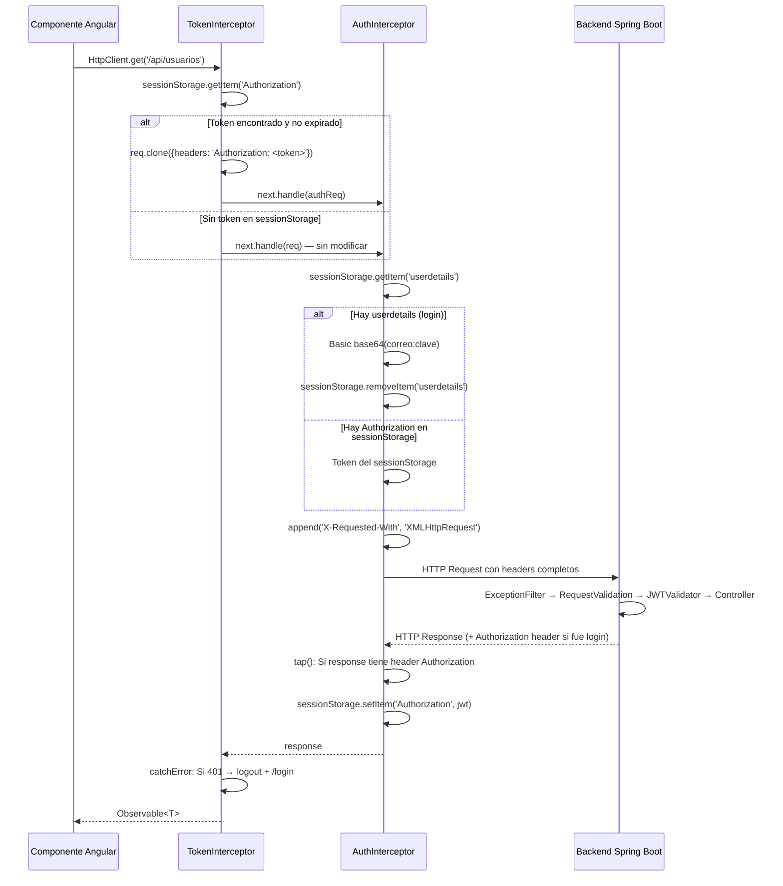

---

## 12. Configuración de Guards de Rutas (Frontend)

### 12.1 securityGuard — Rutas Protegidas

**Archivo:** `src/app/core/guard/security.guard.ts`

Protege las rutas que requieren autenticación (`home`, `gestionar-*`). Implementa `CanActivateFn`:

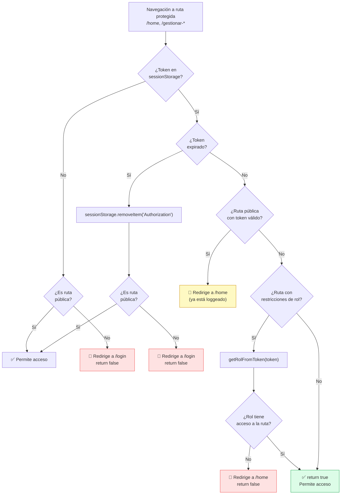

**Mapa de rutas restringidas por rol:**
```typescript
const ROLE_ROUTES: Record<string, string[]> = {
  '/gestionar-direccion': ['ADMINISTRADOR_DIRECCION'],
  '/gestionar-usuarios':  ['ADMINISTRADOR_DIRECCION'],
  '/gestionar-indicadores': ['ADMINISTRADOR_DIRECCION'],
};
// Rutas no presentes en este mapa → accesibles para cualquier rol autenticado
```

### 12.2 publicRouteGuard — Rutas Públicas

**Archivo:** `src/app/core/guard/public-route.guard.ts`

Protege las rutas que **no** deben ser accesibles cuando el usuario ya está autenticado (`login`, `recuperar-contrasena`):

```typescript
export const publicRouteGuard: CanActivateFn = (route, state) => {
  const token = sessionStorage.getItem('Authorization');

  if (!token) return true;                          // Sin token → puede acceder a /login

  if (tokenExpired(token)) {
    sessionStorage.removeItem('Authorization');
    return true;                                    // Token expirado → puede acceder (sesión terminó)
  }

  router.navigate(['/home']);
  return false;                                     // Token válido → ya está loggeado → redirige a /home
};
```

**Función `tokenExpired` (compartida entre guards):**
```typescript
function tokenExpired(token: string): boolean {
  try {
    const expiry = JSON.parse(atob(token.split('.')[1])).exp;
    return Math.floor(Date.now() / 1000) >= expiry;
  } catch {
    return true;   // Token malformado → tratarlo como expirado
  }
}
```

### 12.3 Lógica de Navegación y Control de Acceso

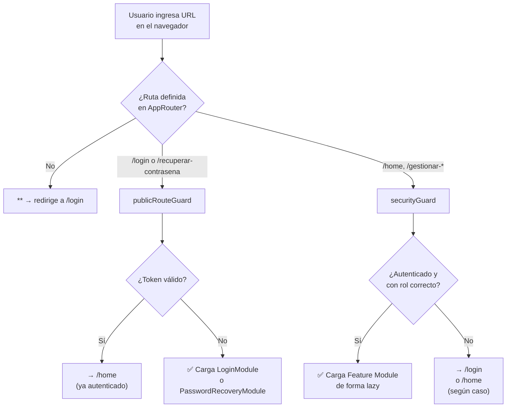

---

## 13. Configuración del Servicio HTTP (Frontend)

**Archivo:** `src/app/core/service/http.service.ts`

`HttpService` es un wrapper genérico de `HttpClient` que estandariza las peticiones HTTP en toda la aplicación:

| Método | Descripción | Firma simplificada |
|--------|-------------|-------------------|
| `doGet<T>` | GET básico | `doGet(url, opts?)` |
| `doGetById<T>` | GET con ID numérico | `doGetById(url, id, opts)` |
| `doGetByEmail<T>` | GET con correo | `doGetByEmail(url, email, opts)` |
| `doGetParameters<T>` | GET con parámetros query | `doGetParameters(url, params, opts)` |
| `doPost<T,R>` | POST con cuerpo | `doPost(url, body, opts)` |
| `doPostWithOutBody<T>` | POST sin cuerpo (solo email) | `doPostWithOutBody(url, email, opts)` |
| `doPostWithOutBodyAndId<T>` | POST sin cuerpo (con ID) | `doPostWithOutBodyAndId(url, id, opts)` |
| `doPut<T,R>` | PUT con cuerpo | `doPut(url, body, opts)` |
| `doPutWithOutBody<R>` | PUT sin cuerpo (con ID) | `doPutWithOutBody(url, id, opts)` |
| `doDelete<R>` | DELETE | `doDelete(url, opts)` |

**Interfaz `Options`:**
```typescript
// core/model/options.model.ts
export interface Options {
  headers?: HttpHeaders;
  params?: HttpParams;
}
```

**Encabezado por defecto:**
```typescript
public createDefaultOptions(): Options {
  return {
    headers: new HttpHeaders({ 'Content-Type': 'application/json' }),
  };
}
```

---

## 14. Configuración del Proxy de Desarrollo (Frontend)

**Archivo:** `SIBEFrontend/proxy.conf.json`

```json
{
  "/api": {
    "target": "http://localhost:8080",
    "secure": false,
    "changeOrigin": true,
    "logLevel": "debug"
  }
}
```

| Parámetro | Valor | Descripción |
|-----------|-------|-------------|
| `/api` | — | Las peticiones cuya URL empiece con `/api` serán redirigidas |
| `target` | `http://localhost:8080` | Servidor backend de desarrollo |
| `secure` | `false` | No verificar certificado SSL (localhost no tiene TLS) |
| `changeOrigin` | `true` | Cambia el header `Host` al del target (necesario para CORS) |
| `logLevel` | `debug` | Muestra en consola todas las peticiones proxiadas |

**Flujo en desarrollo:**
```
ng serve (localhost:4200)
    │
    ├── GET /  → Servido directamente por Angular CLI dev server
    └── GET /api/usuarios → Proxy → http://localhost:8080/api/usuarios
```

**Uso:** El proxy se activa automáticamente con `npm start` (equivale a `ng serve --proxy-config proxy.conf.json`).

> **¿Por qué se necesita?** La política Same-Origin del navegador prohíbe peticiones de `localhost:4200` a `localhost:8080` sin CORS habilitado en el servidor. El proxy evita esta restricción en desarrollo sin cambiar la configuración CORS del backend.

---

## 15. Configuración de Pruebas

### 15.1 Pruebas Backend (JUnit 5 + JaCoCo)

**Configuración en `build.gradle`:**
```groovy
tasks.named('test') {
    useJUnitPlatform()
    finalizedBy jacocoTestReport    // Genera cobertura automáticamente post-test
    ignoreFailures = true           // El build no falla si hay tests fallidos
}

jacoco {
    toolVersion = "0.8.12"
    reportsDirectory = layout.buildDirectory.dir('jacocoHtml')
}

jacocoTestReport {
    reports {
        xml.required = false
        csv.required = false
        html.outputLocation = layout.buildDirectory.dir('jacocoHtml')
    }
}
```

**Ejecutar pruebas:**
```bash
# Ejecutar todas las pruebas
./gradlew test

# Ejecutar con reporte de cobertura
./gradlew test jacocoTestReport

# Ver reporte HTML
# Abrir: SIBEBackend/build/jacocoHtml/index.html

# Ejecutar una clase de prueba específica
./gradlew test --tests "co.edu.uco.sibe.dominio.regla.IndicadorReglaTest"
```

**Dependencias de prueba:**
```groovy
testImplementation 'org.springframework.boot:spring-boot-starter-test'
// Incluye: JUnit 5, Mockito, AssertJ, Hamcrest, Spring Test
testImplementation 'org.springframework.security:spring-security-test'
// SecurityMockMvcConfigurer para pruebas de seguridad
runtimeOnly   'com.h2database:h2'
// Base de datos en memoria para pruebas (no usa PostgreSQL real)
```

**Código fuente de pruebas:**
```
SIBEBackend/src/test/java/co/edu/uco/sibe/
├── infraestructura/
│   ├── configuracion/bean/       UseCaseBeanTest, ServiceBeanTest, EncriptarClaveBeanTest
│   ├── seguridad/configuration/  ProjectSecurityConfigTest, UsernamePwdAuthenticationProviderTest
│   └── seguridad/filter/         ExceptionFilterTest, JWTTokenGeneratorFilterTest,
│                                  JWTTokenValidatorFilterTest, RequestValidationBeforeFilterTest
└── dominio/regla/                IndicadorReglaTest, TipoIndicadorReglaTest
```

> **Estado actual de cobertura:** 94.54% de cobertura de instrucciones en el backend (82.64% de ramas, 97.76% de líneas, 92.62% de métodos). Las 96 clases de prueba se ejecutan correctamente con ~273 tests y 100% de tasa de éxito. Los tests cubren las capas de dominio, aplicación e infraestructura.

### 15.2 Pruebas Frontend (Karma + Jasmine)

**Karma (`angular.json` + `karma.conf.js`):**
```json
"test": {
  "builder": "@angular-devkit/build-angular:karma",
  "options": {
    "polyfills": ["zone.js", "zone.js/testing"],
    "tsConfig": "tsconfig.spec.json",
    "inlineStyleLanguage": "scss",
    "assets": ["src/favicon.ico", "src/assets"],
    "styles": ["...bootstrap...", "src/styles.scss"],
    "scripts": []
  }
}
```

**Ejecutar pruebas:**
```bash
# Modo watch (desarrollo)
ng test

# CI/CD — una sola ejecución con Chrome headless + cobertura
npm test
# Equivalente a: ng test --browsers=ChromeHeadless --watch=false --code-coverage

# Ver reporte de cobertura
# Abrir: SIBEFrontend/coverage/sibe-frontend/index.html
```

**Prerrequisito para CI/CD (Linux):**
```bash
# Google Chrome o Chromium debe estar instalado
sudo apt install -y chromium-browser
export CHROMIUM_FLAGS="--no-sandbox"  # En entornos sin display (CI)
```

**Estructura de pruebas:**
```
SIBEFrontend/src/app/
├── core/
│   ├── interceptor/*.spec.ts       AuthInterceptor, TokenInterceptor, ManejadorError
│   ├── guard/*.spec.ts             securityGuard, publicRouteGuard
│   └── service/*.spec.ts          HttpService, CoreService
├── shared/**/*.spec.ts             Componentes compartidos
└── feature/**/*.spec.ts            Componentes de feature
```

---

## 16. Diagrama de Dependencias entre Capas

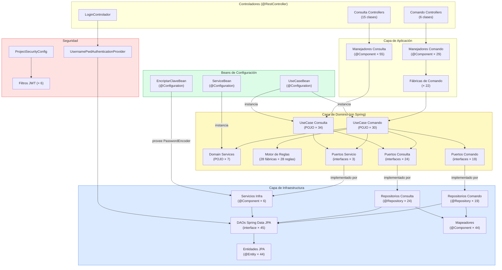

---

## 17. Problemas Comunes y Soluciones

### 17.1 Backend

| Problema | Causa probable | Solución |
|----------|---------------|---------|
| `Connection refused` al iniciar Spring Boot | PostgreSQL no está corriendo | `sudo systemctl start postgresql` |
| `password authentication failed for user "postgres"` | Contraseña incorrecta en `application.properties` | Verificar contraseña o crear usuario correcto |
| `relation "X" already exists` | Conflicto en `ddl-auto=update` | Verificar esquema manual o usar `ddl-auto=create-drop` en dev |
| `CORS policy: blocked` | `LOCAL_FRONT_URL` no coincide con el origen real | Cambiar `SeguridadConstante.LOCAL_FRONT_URL` al origen correcto |
| `io.jsonwebtoken.security.SignatureException` | JWT firmado con clave diferente | Verificar que `JWT_KEY` no ha cambiado entre reinicios |
| `Bean of type X is expected single matching bean but found: [A, B]` | Definición duplicada de bean | Verificar `allow-bean-definition-overriding=true` en `application.properties` |
| `Executing failed: gradlew permission denied` | `gradlew` no tiene permisos de ejecución | `chmod +x gradlew` |
| Puerto 8080 ya en uso | Otro proceso escucha en 8080 | `lsof -i :8080` → `kill -9 <PID>` o cambiar `server.port` |
| Mail: `AuthenticationFailedException` | App Password inválido o expirado | Generar nuevo App Password en cuenta Gmail |
| Tests fallan con `DataSource` | H2 no está en runtime scope | Verificar `runtimeOnly 'com.h2database:h2'` en `build.gradle` |

### 17.2 Frontend

| Problema | Causa probable | Solución |
|----------|---------------|---------|
| `ENOENT: package.json not found` | Directorio incorrecto | `cd SIBEFrontend` antes de `npm install` |
| `Port 4200 is already in use` | Otro proceso en el puerto | `ng serve --port 4201` o matar proceso con `lsof -i :4200` |
| `Cannot find module '@angular/core'` | Dependencias no instaladas | `npm ci` |
| `net::ERR_CONNECTION_REFUSED /api/*` | Backend no está corriendo | Iniciar backend con `./gradlew bootRun` |
| `0 returned from CORS` en petición | Proxy no activo | Usar `npm start` (no `ng serve` directamente) |
| `Uncaught SyntaxError: Unexpected token '<'` | La SPA recibe HTML (404) en lugar de JSON | Verificar la URL del endpoint en `environment.ts` |
| `NG0200: Circular dependency` | Módulos Angular con referencias circulares | Revisar imports entre módulos de feature y shared |
| Token no se almacena en sessionStorage | `AuthInterceptor` no captura el header | Verificar que el backend expone `Authorization` en `Access-Control-Expose-Headers` |
| Guard redirige a `/login` aunque el token es válido | `tokenExpired()` falla al parsear el JWT | Verificar que el JWT no está corrupto; revisar `atob()` en el guard |
| `ChunkLoadError` al navegar | Bundle lazy no encontrado | Limpiar `dist/` y reconstruir con `ng build` |

### 17.3 Integración (Backend + Frontend)

| Problema | Causa | Solución |
|----------|-------|---------|
| Login falla con `401` pero credenciales son correctas | Header `Authorization` no llega al backend | Verificar `AuthInterceptor` está registrado en `CoreModule` |
| JWT recibido pero no funciona en peticiones posteriores | `sessionStorage['Authorization']` no se guarda | Verificar que el backend expone el header `Authorization` (ver §7.5) |
| Todas las peticiones devuelven `403` | Rol del usuario no tiene la autoridad requerida | Revisar `@PreAuthorize` en el controlador y el mapeo de autoridades |
| `400 Bad Request` en formularios | Validaciones de dominio fallando | Revisar respuesta JSON: campo `mensaje` contiene el detalle |
| Sesión expira inmediatamente | Reloj del servidor desincronizado | Sincronizar NTP, verificar timezone del servidor |

