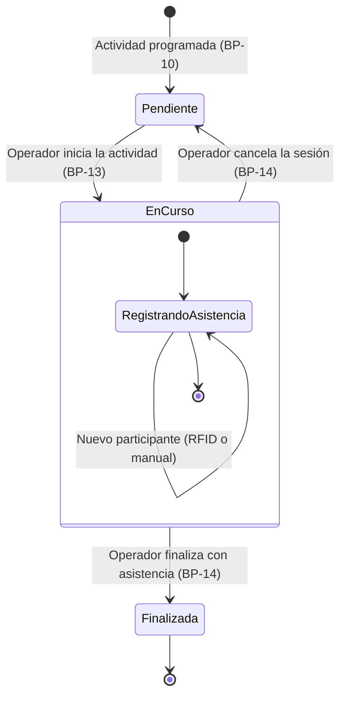
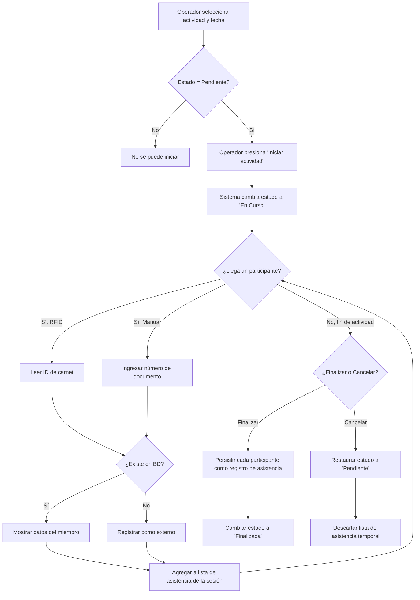

# Modelo de Procesos del Negocio — SIBE

---

## 1. Descripción General

El presente documento describe los procesos de negocio que el sistema SIBE soporta para la Dirección de Bienestar y Evangelización de la Universidad Católica de Oriente. Los procesos se organizan en macroprocesos que agrupan actividades relacionadas, y cada proceso se documenta con su objetivo, actores, flujo de actividades, reglas de negocio y trazabilidad hacia los requerimientos funcionales e historias de usuario.

### 1.1 Contexto Organizacional

La Dirección de Bienestar y Evangelización gestiona actividades orientadas a la comunidad universitaria a través de la siguiente estructura jerárquica:

```
Dirección de Bienestar y Evangelización
├── Área de Bienestar
│   ├── Subárea de Deportes
│   ├── Subárea de Cancha Sintética
│   ├── Subárea de Gimnasio
│   ├── Subárea de Extensión Cultural
│   ├── Subárea de Banda Sinfónica
│   ├── Subárea de Unidad de Salud
│   ├── Subárea de Acompañamiento Psicosocial
│   └── Subárea de Trabajo Social
├── Área de Evangelización
├── Área de Hogar Santa María
└── Área de Servicio y Atención al Usuario
```

### 1.2 Roles del Negocio

| Rol | Descripción |
| --- | ----------- |
| Administrador de Dirección | Responsable global de la Dirección. Gestiona usuarios, supervisa todas las áreas, configura indicadores estratégicos, realiza la carga masiva de empleados y estudiantes, y consulta analítica consolidada. |
| Administrador de Área | Responsable de un área o subárea específica. Gestiona actividades, registra asistencia y consulta analítica de su ámbito. |
| Colaborador | Personal operativo asignado a ejecutar actividades. Registra asistencia en campo y consulta actividades programadas de su área. |
| Participante | Miembro de la comunidad universitaria (estudiante, empleado) o externo que asiste a las actividades. No accede al sistema directamente. |

---

## 2. Mapa de Macroprocesos

```
┌─────────────────────────────────────────────────────────────────────┐
│                     MACROPROCESOS SIBE                              │
├─────────────────────────────────────────────────────────────────────┤
│                                                                     │
│  ┌─────────────────┐  ┌─────────────────┐  ┌─────────────────────┐ │
│  │  MP-01           │  │  MP-02           │  │  MP-03              │ │
│  │  Gestión de      │  │  Configuración   │  │  Administración de  │ │
│  │  Acceso y        │  │  Estratégica y   │  │  Participantes      │ │
│  │  Cuentas         │  │  Organizacional  │  │  (Público Objetivo) │ │
│  └─────────────────┘  └─────────────────┘  └─────────────────────┘ │
│                                                                     │
│  ┌─────────────────────────────────────┐  ┌─────────────────────┐  │
│  │  MP-04                               │  │  MP-05              │  │
│  │  Ciclo de Vida de Actividades        │  │  Analítica y        │  │
│  │  (Core del Negocio)                  │  │  Explotación de     │  │
│  │                                       │  │  Datos              │  │
│  └─────────────────────────────────────┘  └─────────────────────┘  │
│                                                                     │
└─────────────────────────────────────────────────────────────────────┘
```

---

## 3. Detalle de Procesos

---

### MP-01 — Gestión de Acceso y Cuentas

#### BP-01: Autenticación y Control de Sesión

| Atributo | Descripción |
| -------- | ----------- |
| **Objetivo** | Permitir el acceso seguro al sistema mediante credenciales y gestionar el ciclo de vida de la sesión del usuario. |
| **Actores** | Todos los usuarios del sistema (Administrador de Dirección, Administrador de Área, Colaborador). |
| **Evento disparador** | El usuario accede a la URL del sistema. |
| **Trazabilidad** | RF-001-B, RF-013 → HU-001 |

**Flujo de actividades:**

| # | Actividad | Responsable | Descripción |
| - | --------- | ----------- | ----------- |
| 1 | Ingresar credenciales | Usuario | El usuario ingresa correo electrónico y contraseña en el formulario de login. |
| 2 | Validar credenciales | Sistema | El sistema verifica las credenciales contra la base de datos. La contraseña se valida usando BCrypt. |
| 3 | Generar token JWT | Sistema | Si las credenciales son válidas, el sistema genera un token JWT que contiene: email, identificador, authorities (permisos CRUD), rol, direccionId, areaId, subareaId. Vigencia: 30 minutos. |
| 4 | Establecer sesión | Sistema | El token se almacena en sessionStorage del navegador. El sistema reconstituye la sesión del usuario (rehidratación) a partir del token en cada recarga. |
| 5 | Redirigir según rol | Sistema | El sistema redirige al usuario a la página principal (Home). Las rutas protegidas validan el rol: `/gestionar-direccion` y `/gestionar-usuarios` requieren ADMINISTRADOR_DIRECCION; `/gestionar-indicadores` requiere ADMINISTRADOR_DIRECCION o ADMINISTRADOR_AREA. |
| 6 | Cerrar sesión | Usuario | El usuario cierra sesión desde el menú del header. El sistema elimina el token de sessionStorage y redirige al login. |

**Reglas de negocio:**

- RN-01: Si el token JWT ha expirado, el sistema redirige automáticamente al login y limpia la sesión.
- RN-02: Si un usuario autenticado intenta acceder al login, se redirige automáticamente al Home.
- RN-03: Si un usuario intenta acceder a una ruta restringida sin el rol adecuado, se redirige al Home.

---

#### BP-02: Gestión de Cuentas de Usuario

| Atributo | Descripción |
| -------- | ----------- |
| **Objetivo** | Administrar el ciclo de vida de las cuentas de usuario: creación, modificación y eliminación/deshabilitación. |
| **Actores** | Administrador de Dirección. |
| **Evento disparador** | Se necesita dar de alta, modificar o dar de baja a un usuario. |
| **Trazabilidad** | RF-002, RF-003, RF-003-B, RF-005, RF-013 → HU-002 |

**Flujo de actividades — Creación:**

| # | Actividad | Responsable | Descripción |
| - | --------- | ----------- | ----------- |
| 1 | Acceder al módulo de usuarios | Administrador de Dirección | Navega a `/gestionar-usuarios`. |
| 2 | Abrir formulario de registro | Administrador de Dirección | Activa el modal de registro de nuevo usuario. |
| 3 | Completar datos del usuario | Administrador de Dirección | Ingresa: nombres, apellidos, tipo de identificación, número de identificación, correo electrónico, contraseña, tipo de usuario (rol), estructura organizacional (Dirección, Área o Subárea). |
| 4 | Validar reglas de unicidad | Sistema | Verifica que no exista otro usuario con el mismo correo ni con el mismo número de documento. |
| 5 | Validar autorización contextual | Sistema | Verifica que el administrador tenga acceso a la estructura organizacional seleccionada. |
| 6 | Encriptar contraseña | Sistema | Cifra la contraseña con BCrypt antes de persistir. |
| 7 | Crear usuario y vincular organización | Sistema | Persiste la persona, el usuario con rol, y la vinculación con la estructura organizacional correspondiente. |

**Flujo de actividades — Modificación:**

| # | Actividad | Responsable | Descripción |
| - | --------- | ----------- | ----------- |
| 1 | Seleccionar usuario | Administrador de Dirección | Desde la tabla de usuarios, selecciona el usuario a editar. |
| 2 | Modificar datos | Administrador de Dirección | Actualiza nombres, apellidos, tipo/número de documento, correo, tipo de usuario o estructura organizacional. |
| 3 | Validar no duplicidad | Sistema | Verifica que el nuevo correo o documento no colisione con otro usuario existente. |
| 4 | Persistir cambios | Sistema | Actualiza los datos del usuario y, si cambió la estructura organizacional, actualiza la vinculación. |

**Flujo de actividades — Eliminación/Deshabilitación:**

| # | Actividad | Responsable | Descripción |
| - | --------- | ----------- | ----------- |
| 1 | Solicitar eliminación | Administrador de Dirección | Solicita eliminar un usuario desde la tabla. |
| 2 | Verificar actividades asociadas | Sistema | Evalúa si el usuario tiene actividades registradas como colaborador o creador. |
| 3a | Eliminar (sin actividades) | Sistema | Si no tiene actividades asociadas, elimina el registro permanentemente. |
| 3b | Deshabilitar (con actividades) | Sistema | Si tiene actividades asociadas, marca el usuario como inactivo (`estaActivo = false`) para preservar el historial. |

**Reglas de negocio:**

- RN-04: El sistema debe mantener al menos dos Administradores de Dirección activos.
- RN-05: Un correo electrónico solo puede estar asociado a un único usuario.
- RN-06: Un número de identificación solo puede estar asociado a una única persona.
- RN-07: El Administrador de Área solo visualiza los usuarios de su propio ámbito organizacional (área y subáreas).

---

#### BP-03: Recuperación de Contraseña

| Atributo | Descripción |
| -------- | ----------- |
| **Objetivo** | Permitir a un usuario restablecer su contraseña cuando la ha olvidado, mediante un flujo seguro de verificación por correo electrónico. |
| **Actores** | Cualquier usuario registrado (no autenticado). |
| **Evento disparador** | El usuario no recuerda su contraseña. |
| **Trazabilidad** | HU-003 |

**Flujo de actividades:**

| # | Actividad | Responsable | Descripción |
| - | --------- | ----------- | ----------- |
| 1 | Solicitar recuperación | Usuario | Desde la pantalla de login, accede a `/recuperar-contrasena` e ingresa su correo electrónico. |
| 2 | Validar existencia | Sistema | Verifica que el correo corresponda a un usuario registrado. |
| 3 | Generar código | Sistema | Genera un código aleatorio de 6 caracteres, lo cifra con BCrypt y registra la petición con marca temporal. |
| 4 | Enviar correo | Sistema | Envía un correo electrónico con plantilla HTML institucional (logo incluido) conteniendo el código en texto plano. |
| 5 | Ingresar código | Usuario | Ingresa el código recibido en el formulario de validación. |
| 6 | Validar código y vigencia | Sistema | Compara el código ingresado contra el cifrado almacenado. Verifica que no hayan transcurrido más de 5 minutos desde la generación. |
| 7 | Establecer nueva contraseña | Usuario | Ingresa y confirma la nueva contraseña. |
| 8 | Persistir nueva contraseña | Sistema | Cifra la nueva contraseña con BCrypt y actualiza el registro del usuario. Elimina la petición de recuperación. |

**Reglas de negocio:**

- RN-08: El código de recuperación tiene una vigencia máxima de 5 minutos.
- RN-09: Si el código es incorrecto o ha expirado, se rechaza la solicitud y el usuario debe reiniciar el proceso.

---

#### BP-04: Cambio de Contraseña (Usuario Autenticado)

| Atributo | Descripción |
| -------- | ----------- |
| **Objetivo** | Permitir a un usuario autenticado cambiar su contraseña de forma autónoma. |
| **Actores** | Cualquier usuario autenticado. |
| **Evento disparador** | El usuario desea cambiar su contraseña actual. |
| **Trazabilidad** | RF-004-B → HU-004 |

**Flujo de actividades:**

| # | Actividad | Responsable | Descripción |
| - | --------- | ----------- | ----------- |
| 1 | Abrir modal de cambio | Usuario | Desde el menú del header, selecciona "Cambiar contraseña". |
| 2 | Ingresar contraseñas | Usuario | Ingresa la contraseña actual, la nueva contraseña y la confirmación de la nueva contraseña. |
| 3 | Validar contraseña actual | Sistema | Verifica que la contraseña actual sea correcta comparando con BCrypt. |
| 4 | Validar que sea diferente | Sistema | Verifica que la nueva contraseña no sea igual a la actual. |
| 5 | Persistir cambio | Sistema | Cifra la nueva contraseña y actualiza el registro. |

---

### MP-02 — Configuración Estratégica y Organizacional

#### BP-05: Consulta de Estructura Organizacional

| Atributo | Descripción |
| -------- | ----------- |
| **Objetivo** | Proveer la estructura jerárquica (Dirección → Áreas → Subáreas) como base para la asignación de actividades, usuarios e indicadores. |
| **Actores** | Administrador de Dirección, Administrador de Área. |
| **Evento disparador** | El sistema necesita desplegar opciones de asignación organizacional o el usuario navega entre áreas. |
| **Trazabilidad** | RF-006 → HU-005 |

**Flujo de actividades:**

| # | Actividad | Responsable | Descripción |
| - | --------- | ----------- | ----------- |
| 1 | Acceder al Home | Usuario | Tras autenticarse, el sistema muestra el dashboard principal con la Dirección. |
| 2 | Navegar a un área | Usuario | Selecciona una de las 4 áreas (Bienestar, Evangelización, Hogar Santa María, Servicio y Atención). |
| 3 | Navegar a una subárea | Usuario | Dentro de un área (ej: Bienestar), selecciona una subárea (ej: Deportes, Gimnasio, Banda Sinfónica, etc.). |
| 4 | Visualizar actividades del contexto | Sistema | Carga y muestra las actividades correspondientes al nivel organizacional seleccionado. |

**Reglas de negocio:**

- RN-10: Cada usuario solo visualiza las áreas y subáreas a las que tiene acceso según su vinculación organizacional.
- RN-11: El Administrador de Dirección tiene acceso a todas las áreas y subáreas.

---

#### BP-06: Gestión de Proyectos del Plan de Desarrollo

| Atributo | Descripción |
| -------- | ----------- |
| **Objetivo** | Administrar los proyectos del plan de desarrollo institucional y sus acciones, que sirven como marco estratégico para vincular indicadores a las actividades. |
| **Actores** | Administrador de Dirección. |
| **Evento disparador** | Se necesita crear o modificar un proyecto del plan de desarrollo. |
| **Trazabilidad** | HU-006 |

**Flujo de actividades:**

| # | Actividad | Responsable | Descripción |
| - | --------- | ----------- | ----------- |
| 1 | Acceder a gestión de indicadores | Administrador | Navega a `/gestionar-indicadores`. |
| 2 | Crear proyecto | Administrador | Ingresa: número de proyecto, nombre, objetivo y una o más acciones (cada acción con detalle y objetivo). |
| 3 | Validar unicidad | Sistema | Verifica que no exista otro proyecto con el mismo número. |
| 4 | Persistir proyecto | Sistema | Guarda el proyecto con sus acciones asociadas. |
| 5 | Modificar proyecto | Administrador | Actualiza nombre, objetivo o acciones del proyecto existente. |

**Reglas de negocio:**

- RN-12: El número de proyecto debe ser único en el sistema.
- RN-13: Un proyecto puede tener múltiples acciones asociadas.

---

#### BP-07: Gestión de Indicadores Estratégicos

| Atributo | Descripción |
| -------- | ----------- |
| **Objetivo** | Administrar los indicadores que permiten medir el impacto de las actividades, vinculándolos con los proyectos del plan de desarrollo, temporalidades, tipos de indicador y públicos de interés. |
| **Actores** | Administrador de Dirección. |
| **Evento disparador** | Se necesita crear o modificar un indicador para asociar a actividades. |
| **Trazabilidad** | HU-007 |

**Flujo de actividades:**

| # | Actividad | Responsable | Descripción |
| - | --------- | ----------- | ----------- |
| 1 | Acceder a gestión de indicadores | Administrador | Navega a `/gestionar-indicadores`. |
| 2 | Crear indicador | Administrador | Ingresa: nombre del indicador, tipo de indicador (naturaleza + tipología), temporalidad, proyecto asociado y uno o más públicos de interés. |
| 3 | Validar unicidad | Sistema | Verifica que no exista otro indicador con el mismo nombre. |
| 4 | Persistir indicador | Sistema | Guarda el indicador con todas sus relaciones. |
| 5 | Modificar indicador | Administrador | Actualiza los datos del indicador existente. |

**Reglas de negocio:**

- RN-14: El nombre del indicador debe ser único en el sistema.
- RN-15: Los indicadores de tipo global (ej: "Cobertura") no se listan como opción al crear actividades, pero sí se usan en el módulo de analítica.

---

### MP-03 — Administración de Participantes (Público Objetivo)

#### BP-08: Carga Masiva de Estudiantes

| Atributo | Descripción |
| -------- | ----------- |
| **Objetivo** | Actualizar semestralmente la base de datos de estudiantes mediante carga de un archivo Excel proporcionado por la universidad, para alimentar el sistema de registro de asistencia RFID. |
| **Actores** | Administrador de Dirección. |
| **Evento disparador** | Inicio de nuevo semestre académico o actualización de la base de datos estudiantil. |
| **Trazabilidad** | RF-014 → HU-008 |

**Flujo de actividades:**

| # | Actividad | Responsable | Descripción |
| - | --------- | ----------- | ----------- |
| 1 | Obtener archivo Excel | Administrador | Obtiene el archivo .xlsx con la información de estudiantes activos de la universidad. |
| 2 | Abrir módulo de carga | Administrador | Accede al componente de carga masiva y selecciona tipo "Estudiantes". |
| 3 | Seleccionar archivo | Administrador | Carga el archivo Excel desde su equipo. |
| 4 | Validar archivo | Sistema | Verifica: extensión (.xlsx o .xls), tipo MIME válido, tamaño máximo 40 MB. |
| 5 | Procesar archivo | Sistema | El motor de procesamiento Excel (Apache POI) lee la primera hoja, mapea columnas por nombre de encabezado y extrae los datos de cada fila. |
| 6 | Ejecutar upsert por estudiante | Sistema | Para cada estudiante: si ya existe (por número de identificación), actualiza sus datos; si no existe, crea un nuevo registro. Datos procesados: nombre completo, número de identificación, ID carnet, fecha de nacimiento, sexo, nacionalidad, estado civil, correos, programa académico, facultad, año de ingreso, semestre actual, créditos aprobados, promedio, estado académico, modalidad, tiempo de llegada, medio de transporte, ciudad de residencia. |
| 7 | Reportar resultado | Sistema | Retorna la lista de identificadores procesados. |

**Reglas de negocio:**

- RN-16: La identificación del estudiante (número de documento) es la clave para determinar si se crea o actualiza un registro.
- RN-17: Las filas vacías del archivo se ignoran automáticamente.

---

#### BP-09: Carga Masiva de Empleados

| Atributo | Descripción |
| -------- | ----------- |
| **Objetivo** | Actualizar semestralmente la base de datos de empleados de la universidad para alimentar el registro de asistencia. |
| **Actores** | Administrador de Dirección. |
| **Evento disparador** | Inicio de nuevo semestre o actualización de nómina universitaria. |
| **Trazabilidad** | RF-014 → HU-009 |

**Flujo de actividades:**

| # | Actividad | Responsable | Descripción |
| - | --------- | ----------- | ----------- |
| 1 | Obtener archivo Excel | Administrador | Obtiene el archivo .xlsx con la información de empleados activos. |
| 2 | Abrir módulo de carga | Administrador | Accede al componente de carga masiva y selecciona tipo "Empleados". |
| 3 | Seleccionar y validar archivo | Sistema | Mismas validaciones que BP-08 (extensión, MIME, tamaño). |
| 4 | Procesar archivo | Sistema | Extrae datos por mapeo de columnas: nombre, género, identificación, ID carnet, clasificación, relación laboral, centro de costos, ciudad de residencia. |
| 5 | Ejecutar upsert por empleado | Sistema | Si el empleado ya existe, actualiza; si no, crea nuevo registro. |
| 6 | Reportar resultado | Sistema | Retorna la lista de identificadores procesados. |

**Reglas de negocio:**

- RN-18: La identificación del empleado (número de documento) es la clave para determinar si se crea o actualiza.
- RN-19: La relación laboral y el centro de costos se crean o reutilizan según los códigos proporcionados en el archivo.

---

### MP-04 — Ciclo de Vida de Actividades (Core del Negocio)

#### BP-10: Creación y Programación de Actividades

| Atributo | Descripción |
| -------- | ----------- |
| **Objetivo** | Registrar nuevas actividades en el sistema con la información necesaria para su planificación, incluyendo la asignación de fechas programadas, indicador, colaborador responsable y vinculación organizacional. |
| **Actores** | Administrador de Dirección, Administrador de Área. |
| **Evento disparador** | Se planifica una nueva actividad de la Dirección para el semestre actual. |
| **Trazabilidad** | RF-001, RF-004 → HU-010 |

**Flujo de actividades:**

| # | Actividad | Responsable | Descripción |
| - | --------- | ----------- | ----------- |
| 1 | Abrir formulario de nueva actividad | Administrador | Desde la vista del área/subárea, abre el modal de registro de actividad. |
| 2 | Completar datos de la actividad | Administrador | Ingresa: nombre, objetivo, semestre (ej: "2025-1"), ruta de insumos (enlace a archivos), indicador estratégico, colaborador responsable, estructura organizacional destino (Dirección/Área/Subárea). |
| 3 | Programar fechas de ejecución | Administrador | Agrega una o más fechas programadas para la actividad. |
| 4 | Validar semestre y fechas | Sistema | Verifica que las fechas programadas correspondan al semestre indicado: semestre 01 → enero a junio; semestre 02 → julio a diciembre. |
| 5 | Validar unicidad por semestre | Sistema | Verifica que no exista otra actividad con el mismo nombre en el mismo semestre dentro de la misma estructura organizacional. |
| 6 | Validar autorización | Sistema | Verifica que el administrador tenga acceso a la estructura organizacional seleccionada. |
| 7 | Persistir actividad y ejecuciones | Sistema | Crea la actividad, vincula con la estructura organizacional, y crea una ejecución de actividad por cada fecha programada con estado "Pendiente". |

**Reglas de negocio:**

- RN-20: No puede existir dos actividades con el mismo nombre en el mismo semestre dentro de la misma estructura organizacional.
- RN-21: Las fechas programadas deben ser futuras o del día actual y pertenecer al rango del semestre seleccionado.
- RN-22: Cada fecha programada genera una ejecución independiente con estado inicial "Pendiente".

---

#### BP-11: Edición de Actividades

| Atributo | Descripción |
| -------- | ----------- |
| **Objetivo** | Modificar los datos de una actividad existente, incluyendo la posibilidad de agregar, modificar o gestionar sus fechas programadas. |
| **Actores** | Administrador de Dirección, Administrador de Área. |
| **Evento disparador** | Se necesita corregir o actualizar la información de una actividad o sus fechas. |
| **Trazabilidad** | RF-004 → HU-010 |

**Flujo de actividades:**

| # | Actividad | Responsable | Descripción |
| - | --------- | ----------- | ----------- |
| 1 | Seleccionar actividad | Administrador | Desde la tabla de actividades, selecciona la actividad a editar. |
| 2 | Modificar datos | Administrador | Puede actualizar: nombre, objetivo, semestre, ruta de insumos, indicador, colaborador, estructura organizacional y fechas programadas. Las modificaciones dependen del estado de las ejecuciones (ver reglas de negocio). |
| 3 | Validar reglas | Sistema | Aplica las mismas validaciones que BP-10 (unicidad, semestre, autorización). Además verifica restricciones según el estado de las ejecuciones. |
| 4 | Persistir cambios | Sistema | Actualiza la actividad y sus ejecuciones según las restricciones de estado. |

**Reglas de negocio:**

- RN-23: Si la actividad tiene al menos una ejecución en estado "En Curso", no se puede modificar ningún campo de la actividad.
- RN-24: Si la actividad tiene al menos una ejecución en estado "Finalizada" (pero ninguna "En Curso"), solo se puede modificar el **colaborador** y agregar nuevas **fechas programadas**.
- RN-25: Si todas las ejecuciones están en estado "Pendiente", se pueden modificar todos los campos de la actividad.

---

#### BP-12: Consulta de Actividades Programadas

| Atributo | Descripción |
| -------- | ----------- |
| **Objetivo** | Visualizar las actividades programadas en el contexto organizacional del usuario, con sus fechas, estados y detalles. |
| **Actores** | Administrador de Dirección, Administrador de Área, Colaborador. |
| **Evento disparador** | El usuario navega a un nivel organizacional para consultar sus actividades. |
| **Trazabilidad** | RF-001, RF-004, RF-006 → HU-011 |

**Flujo de actividades:**

| # | Actividad | Responsable | Descripción |
| - | --------- | ----------- | ----------- |
| 1 | Navegar al contexto | Usuario | Accede a una Dirección, Área o Subárea específica. |
| 2 | Cargar actividades | Sistema | Consulta las actividades asociadas al nivel organizacional seleccionado, aplica autorización contextual. |
| 3 | Visualizar tabla | Usuario | Visualiza la tabla de actividades con columnas: nombre, objetivo, semestre, indicador, colaborador, fecha de creación, próxima fecha programada. Soporta ordenamiento y búsqueda. |
| 4 | Consultar fechas programadas | Usuario | Selecciona una actividad para ver el modal con todas sus fechas programadas y sus estados (Pendiente, En Curso, Finalizada). |

---

#### BP-13: Registro de Asistencia en Vivo (Kiosco RFID)

| Atributo | Descripción |
| -------- | ----------- |
| **Objetivo** | Registrar la asistencia de los participantes durante la ejecución de una actividad, utilizando lectura RFID del carnet universitario o ingreso manual del número de documento. Este es el proceso central del negocio que reemplaza las planillas de asistencia en papel. |
| **Actores** | Administrador de Dirección, Administrador de Área, Colaborador (operador del kiosco). |
| **Evento disparador** | Se inicia la ejecución de una actividad programada. |
| **Trazabilidad** | RF-011, RF-014 → HU-012 |

**Flujo de actividades:**

| # | Actividad | Responsable | Descripción |
| - | --------- | ----------- | ----------- |
| 1 | Seleccionar actividad y fecha | Operador | Desde la vista del área, selecciona la actividad y la fecha programada con estado "Pendiente". |
| 2 | Iniciar ejecución | Operador | Presiona "Iniciar actividad". El sistema actualiza el estado a "En Curso" y registra la hora de inicio. |
| 3 | Registrar asistencia RFID | Operador/Participante | El participante pasa su carnet por el lector RFID. El sistema lee el ID del carnet y busca al miembro en la base de datos por ID de carnet. |
| 4 | Registrar asistencia manual | Operador | Si el participante no tiene carnet disponible, el operador ingresa el número de documento. El sistema busca al miembro por número de identificación. |
| 5 | Identificar y mostrar datos | Sistema | Si el miembro existe, muestra su nombre completo, programa académico (si es estudiante) y correo institucional. El participante se agrega a la lista de asistencia de la sesión. |
| 6 | Registrar participante externo | Operador | Si el participante no existe en la base de datos (externo), el operador abre el modal de participante externo e ingresa documento y nombre completo. |
| 7 | Repetir para cada participante | Operador | El proceso se repite para cada participante que asiste a la actividad. |

**Reglas de negocio:**

- RN-26: La búsqueda por RFID se realiza primero por ID de carnet; si no se encuentra, se intenta por número de identificación.
- RN-27: Un participante solo puede registrarse una vez por ejecución de actividad en el mismo semestre.
- RN-28: Los participantes internos se registran con una instantánea (snapshot) de sus datos al momento de la asistencia, de modo que cambios futuros en la base de miembros no afecten los registros históricos.

---

#### BP-14: Finalización y Cierre de Actividad

| Atributo | Descripción |
| -------- | ----------- |
| **Objetivo** | Cerrar la ejecución de una actividad en curso, persistiendo los participantes registrados y completando los datos temporales de la sesión. |
| **Actores** | Administrador de Dirección, Administrador de Área, Colaborador. |
| **Evento disparador** | La actividad ha concluido y se desea cerrar el registro de asistencia. |
| **Trazabilidad** | RF-011 → HU-013 |

**Flujo de actividades:**

| # | Actividad | Responsable | Descripción |
| - | --------- | ----------- | ----------- |
| 1 | Solicitar finalización | Operador | Presiona "Finalizar actividad" desde la pantalla de registro de asistencia. |
| 2 | Validar estado | Sistema | Verifica que la ejecución esté "En Curso". |
| 3 | Persistir participantes | Sistema | Para cada participante en la lista: busca si ya existe un registro de participante para ese miembro en el semestre; si no, crea un nuevo participante (snapshot). Luego crea el registro de asistencia vinculando participante con ejecución. |
| 4 | Actualizar ejecución | Sistema | Registra la fecha de realización (hoy), la hora de fin (ahora) y actualiza el estado a "Finalizada". |

**Flujo alternativo — Cancelación:**

| # | Actividad | Responsable | Descripción |
| - | --------- | ----------- | ----------- |
| 1 | Solicitar cancelación | Operador | Presiona "Cancelar actividad" mientras la ejecución está "En Curso". |
| 2 | Revertir estado | Sistema | Devuelve la ejecución al estado "Pendiente", descartando la hora de inicio. Los participantes registrados no se persisten. |

**Reglas de negocio:**

- RN-29: Solo se puede finalizar una ejecución que está "En Curso".
- RN-30: La cancelación revierte al estado "Pendiente", permitiendo reiniciarla en otro momento.
- RN-31: Un mismo miembro solo puede tener un registro de asistencia por ejecución; intentos duplicados se rechazan.

---

### MP-05 — Analítica y Explotación de Datos

#### BP-15: Visualización de Métricas en Dashboard

| Atributo | Descripción |
| -------- | ----------- |
| **Objetivo** | Mostrar métricas de participación consolidadas e interactivas que permitan evaluar el desempeño de las actividades de la Dirección y cada una de sus áreas. |
| **Actores** | Administrador de Dirección, Administrador de Área, Colaborador. |
| **Evento disparador** | El usuario accede al Home o a la vista de un área/subárea. |
| **Trazabilidad** | RF-007, RF-008, RF-009 → HU-015 |

**Flujo de actividades:**

| # | Actividad | Responsable | Descripción |
| - | --------- | ----------- | ----------- |
| 1 | Acceder a la vista | Usuario | Ingresa al Home (nivel Dirección) o navega a un Área/Subárea específica. |
| 2 | Cargar métricas iniciales | Sistema | Carga automáticamente: total de participantes únicos, total de asistencias, total de actividades finalizadas, y gráfico de barras de participantes/asistencias por mes. |
| 3 | Aplicar filtros | Usuario | Selecciona filtros desde el panel: año, semestre, mes, programa académico, tipo de programa académico, centro de costos, relación laboral, indicador. Los filtros son mutuamente excluyentes entre semestre y mes/año. |
| 4 | Recalcular métricas | Sistema | Consulta las estadísticas filtradas: obtiene el identificador de la estructura organizacional por nombre, construye el objeto de filtro completo y consulta los endpoints de conteo y estadísticas. |
| 5 | Visualizar cobertura | Usuario | Si selecciona el indicador "Cobertura", el sistema calcula el porcentaje de participantes vs. población total y muestra un indicador de cobertura en lugar de los conteos estándar. |

**Reglas de negocio:**

- RN-32: Las métricas solo se calculan sobre ejecuciones con estado "Finalizada".
- RN-33: Los filtros dinámicos (años, meses, programas, centros de costos, etc.) se populan con valores reales extraídos de ejecuciones finalizadas existentes.
- RN-34: El indicador "Cobertura" requiere el cálculo de población total para generar el porcentaje.

---

#### BP-16: Generación de Reporte Excel

| Atributo | Descripción |
| -------- | ----------- |
| **Objetivo** | Generar y descargar un reporte detallado en formato Excel (.xlsx) con los datos de actividades, ejecuciones y participantes de una Dirección, Área o Subárea, para uso en auditorías y análisis externos. |
| **Actores** | Administrador de Dirección, Administrador de Área. |
| **Evento disparador** | El usuario necesita un reporte exportable para análisis fuera del sistema. |
| **Trazabilidad** | HU-014 |

**Flujo de actividades:**

| # | Actividad | Responsable | Descripción |
| - | --------- | ----------- | ----------- |
| 1 | Solicitar reporte | Administrador | Desde la vista del nivel organizacional, solicita la generación del informe. |
| 2 | Consultar detalle | Sistema | Obtiene el detalle completo de la estructura: actividades con sus ejecuciones y participantes de cada ejecución. |
| 3 | Procesar datos | Sistema | Itera sobre cada actividad, cada ejecución y cada participante, construyendo filas con: nombre de dirección, nombre de área, nombre de subárea, nombre de actividad, objetivo, semestre, indicador, fecha programada, fecha de realización, estado, tipo de participante, nombre del participante, número de identificación, programa académico, relación laboral, centro de costos. |
| 4 | Generar archivo Excel | Sistema | Crea el archivo .xlsx con la librería XLSX y dispara la descarga automática en el navegador. |

---

## 4. Matriz de Trazabilidad Procesos ↔ Requerimientos ↔ Historias

| Proceso | Código | Requerimientos | Historias de Usuario |
| ------- | ------ | -------------- | -------------------- |
| Autenticación y Control de Sesión | BP-01 | RF-001-B, RF-013 | HU-001 |
| Gestión de Cuentas de Usuario | BP-02 | RF-002, RF-003, RF-003-B, RF-005, RF-013 | HU-002 |
| Recuperación de Contraseña | BP-03 | — | HU-003 |
| Cambio de Contraseña | BP-04 | RF-004-B | HU-004 |
| Consulta de Estructura Organizacional | BP-05 | RF-006 | HU-005 |
| Gestión de Proyectos del Plan de Desarrollo | BP-06 | — | HU-006 |
| Gestión de Indicadores Estratégicos | BP-07 | — | HU-007 |
| Carga Masiva de Estudiantes | BP-08 | RF-014 | HU-008 |
| Carga Masiva de Empleados | BP-09 | RF-014 | HU-009 |
| Creación y Programación de Actividades | BP-10 | RF-001, RF-004 | HU-010 |
| Edición de Actividades | BP-11 | RF-004 | HU-010 |
| Consulta de Actividades Programadas | BP-12 | RF-001, RF-004, RF-006 | HU-011 |
| Registro de Asistencia en Vivo (Kiosco RFID) | BP-13 | RF-011, RF-014 | HU-012 |
| Finalización y Cierre de Actividad | BP-14 | RF-011 | HU-013 |
| Visualización de Métricas en Dashboard | BP-15 | RF-007, RF-008, RF-009 | HU-015 |
| Generación de Reporte Excel | BP-16 | — | HU-014 |

---

## 5. Diagrama de Ciclo de Vida — Ejecución de Actividad

El siguiente diagrama representa las transiciones de estado del proceso central del negocio: la ejecución de una actividad programada.



### Descripción de los estados:

| Estado | Descripción |
| ------ | ----------- |
| **Pendiente** | Estado inicial de la ejecución. La fecha está programada pero no se ha iniciado. También es el estado al que se retorna cuando se cancela una ejecución "En Curso". |
| **En Curso** | La actividad se está ejecutando. El operador está registrando asistencia. |
| **Finalizada** | La actividad concluyó exitosamente. Los participantes se persistieron. El estado es irreversible. |

---

## 6. Diagrama de Flujo — Proceso de Registro de Asistencia



---

## 7. Glosario del Proceso

| Término | Definición |
| ------- | ---------- |
| **Actividad** | Unidad de trabajo planificada por la Dirección o un Área, vinculada a un indicador estratégico, con una o más fechas de ejecución programadas. |
| **Ejecución de Actividad** | Instancia concreta de una actividad en una fecha específica. Tiene su propio ciclo de vida (Pendiente → En Curso → Finalizada). Cancelar una ejecución "En Curso" la devuelve a "Pendiente". |
| **Participante** | Persona (interna o externa) que asiste a una ejecución de actividad. Puede ser Estudiante, Empleado o Externo. |
| **Miembro** | Registro de la comunidad universitaria (estudiante o empleado) en la base de datos SIBE, cargado masivamente desde archivos Excel institucionales. |
| **Kiosco RFID** | Dispositivo compuesto por un computador con el sistema SIBE abierto y un lector de tarjetas RFID, ubicado en el punto de acceso de la actividad. |
| **Snapshot de participante** | Copia de los datos del miembro al momento del registro de asistencia. Garantiza la integridad histórica: si los datos del miembro cambian después, el registro refleja el estado al momento de la asistencia. |
| **Semestre** | Período académico (01: enero-junio; 02: julio-diciembre) que agrupa las actividades y define las reglas de unicidad. |
| **Indicador estratégico** | Métrica vinculada al plan de desarrollo institucional que permite medir el impacto de las actividades (ej: Cobertura, Retención, Participación). |
| **Autorización contextual** | Mecanismo de seguridad que restringe el acceso a recursos según la vinculación organizacional del usuario (Dirección/Área/Subárea). |

---

## 8. Historial de Cambios

| Versión | Fecha | Autor | Descripción |
| ------- | ----- | ----- | ----------- |
| 1.0 | 2025-01-21 | Equipo SIBE | Creación inicial del documento a partir del análisis de código y documentación existente. |