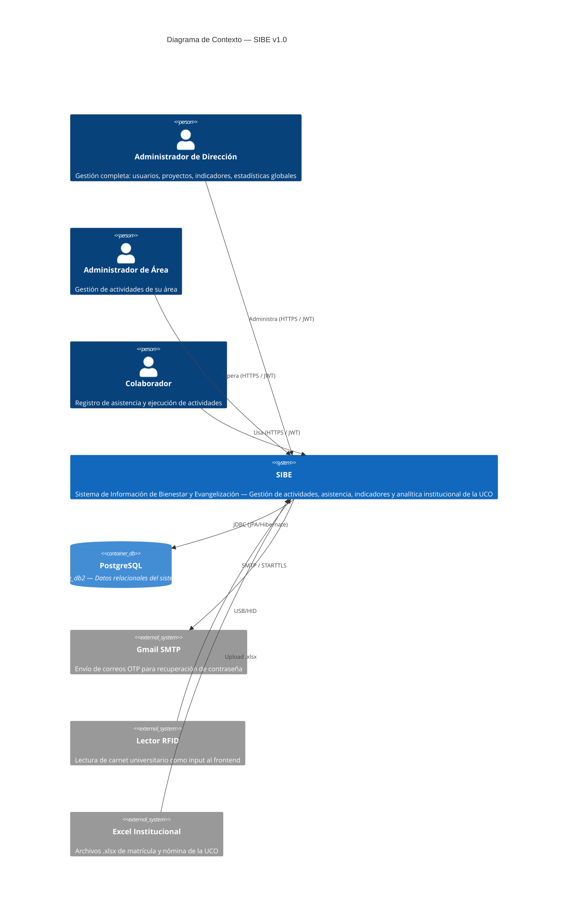
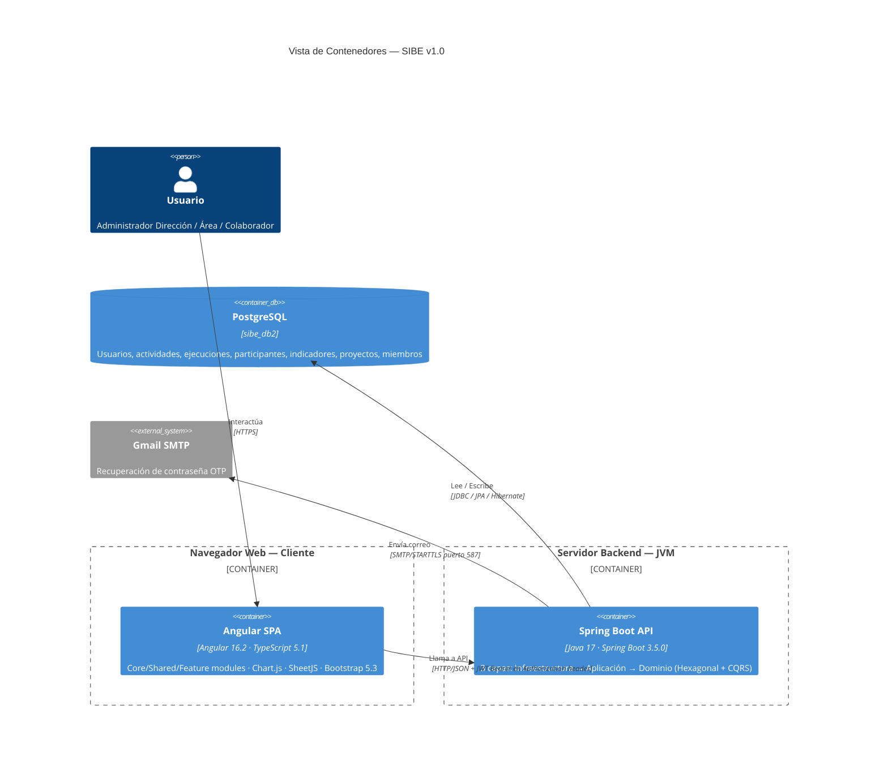
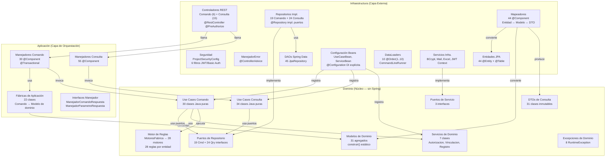
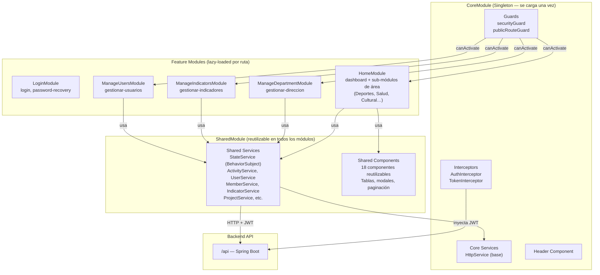
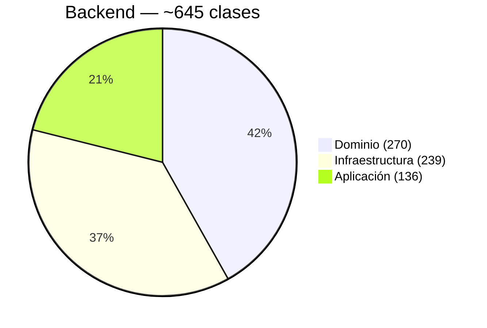
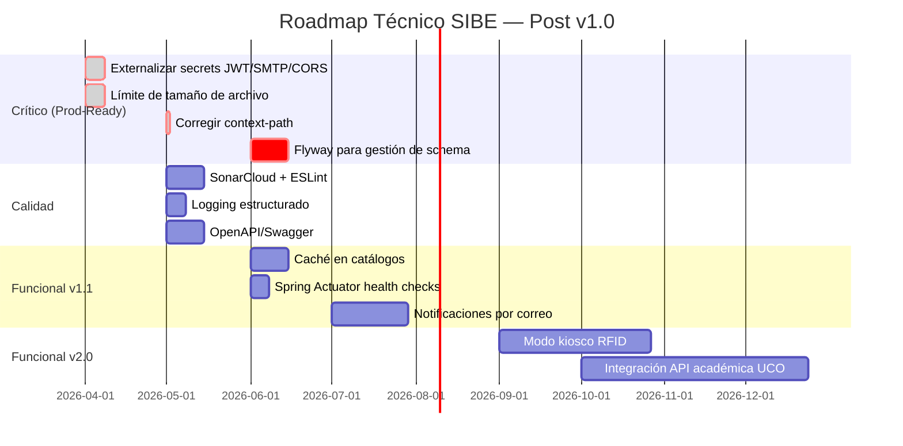

# Artefacto 41 — Documento Técnico Final y Registro de Decisiones Arquitectónicas

| Campo | Detalle |
|-------|---------|
| **Proyecto** | SIBE — Sistema de Información de Bienestar y Evangelización |
| **Institución** | Universidad Católica de Oriente (UCO) |
| **Tipo** | Documento Técnico Final · ADR (Architecture Decision Records) |
| **Versión** | 2.0.0 |
| **Fecha** | 2026-04-27 |
| **Autor** | Equipo SIBE |
| **Artefactos de referencia** | [19. Drivers Arquitectónicos](19.drivers_arquitectonicos.md) · [21. Arquitectura de Referencia](21.arquitectura_de_referencia.md) · [22. Arquetipo de Solución](22.arquetipo_de_solucion.md) · [23. Stack Tecnológico](23.stack_tecnologico.md) · [33. Análisis de Calidad](33.analisis_de_calidad_de_codigo_y_deuda_tecnica.md) |

---

## Tabla de Contenidos

- [Artefacto 40 — Documento Técnico Final y Registro de Decisiones Arquitectónicas](#artefacto-40--documento-técnico-final-y-registro-de-decisiones-arquitectónicas)
  - [Tabla de Contenidos](#tabla-de-contenidos)
  - [1. Resumen Ejecutivo](#1-resumen-ejecutivo)
    - [Hechos Técnicos del Producto Entregado](#hechos-técnicos-del-producto-entregado)
  - [2. Descripción General del Sistema](#2-descripción-general-del-sistema)
    - [2.1 Contexto del Problema](#21-contexto-del-problema)
    - [2.2 Solución Implementada](#22-solución-implementada)
    - [2.3 Alcance del Sistema](#23-alcance-del-sistema)
    - [2.4 Stakeholders y Roles](#24-stakeholders-y-roles)
  - [3. Stack Tecnológico Definitivo](#3-stack-tecnológico-definitivo)
    - [3.1 Backend](#31-backend)
    - [3.2 Frontend](#32-frontend)
    - [3.3 Infraestructura y Herramientas](#33-infraestructura-y-herramientas)
  - [4. Vista Arquitectónica del Sistema](#4-vista-arquitectónica-del-sistema)
    - [4.1 Diagrama de Contexto (C4 — Nivel 0)](#41-diagrama-de-contexto-c4--nivel-0)
    - [4.2 Vista de Contenedores (C4 — Nivel 1)](#42-vista-de-contenedores-c4--nivel-1)
    - [4.3 Vista de Componentes — Backend (C4 — Nivel 2)](#43-vista-de-componentes--backend-c4--nivel-2)
    - [4.4 Vista de Componentes — Frontend (C4 — Nivel 2)](#44-vista-de-componentes--frontend-c4--nivel-2)
  - [5. Registro de Decisiones Arquitectónicas (ADRs)](#5-registro-de-decisiones-arquitectónicas-adrs)
    - [ADR-001: Arquitectura Hexagonal con Puertos y Adaptadores](#adr-001-arquitectura-hexagonal-con-puertos-y-adaptadores)
      - [Contexto](#contexto)
      - [Decisión](#decisión)
      - [Consecuencias Positivas](#consecuencias-positivas)
      - [Consecuencias Negativas / Tradeoffs](#consecuencias-negativas--tradeoffs)
      - [Alternativas Descartadas](#alternativas-descartadas)
      - [Implementación Verificada](#implementación-verificada)
    - [ADR-002: CQRS Estructural en Todas las Capas](#adr-002-cqrs-estructural-en-todas-las-capas)
      - [Contexto](#contexto-1)
      - [Decisión](#decisión-1)
      - [Consecuencias Positivas](#consecuencias-positivas-1)
      - [Consecuencias Negativas / Tradeoffs](#consecuencias-negativas--tradeoffs-1)
      - [Alternativas Descartadas](#alternativas-descartadas-1)
      - [Implementación Verificada](#implementación-verificada-1)
    - [ADR-003: Transaccionalidad Declarativa en Interfaces de Manejador](#adr-003-transaccionalidad-declarativa-en-interfaces-de-manejador)
      - [Contexto](#contexto-2)
      - [Decisión](#decisión-2)
      - [Consecuencias Positivas](#consecuencias-positivas-2)
      - [Consecuencias Negativas](#consecuencias-negativas)
      - [Alternativas Descartadas](#alternativas-descartadas-2)
    - [ADR-004: Motor de Validación por Operación (MotoresFabrica)](#adr-004-motor-de-validación-por-operación-motoresfabrica)
      - [Contexto](#contexto-3)
      - [Decisión](#decisión-3)
      - [Consecuencias Positivas](#consecuencias-positivas-3)
      - [Consecuencias Negativas](#consecuencias-negativas-1)
      - [Motores Implementados (28)](#motores-implementados-28)
    - [ADR-005: Identificadores UUID con Anti-Colisión Generados en Dominio](#adr-005-identificadores-uuid-con-anti-colisión-generados-en-dominio)
      - [Contexto](#contexto-4)
      - [Decisión](#decisión-4)
      - [Consecuencias Positivas](#consecuencias-positivas-4)
      - [Consecuencias Negativas](#consecuencias-negativas-2)
    - [ADR-006: Autenticación Stateless con HTTP Basic + JWT HMAC-SHA256](#adr-006-autenticación-stateless-con-http-basic--jwt-hmac-sha256)
      - [Contexto](#contexto-5)
      - [Decisión](#decisión-5)
      - [Consecuencias Positivas](#consecuencias-positivas-5)
      - [Consecuencias Negativas / Riesgos](#consecuencias-negativas--riesgos)
      - [Alternativas Descartadas](#alternativas-descartadas-3)
    - [ADR-007: Autorización en Dos Capas — Rol y Contexto Organizacional](#adr-007-autorización-en-dos-capas--rol-y-contexto-organizacional)
      - [Contexto](#contexto-6)
      - [Decisión](#decisión-6)
      - [Consecuencias Positivas](#consecuencias-positivas-6)
      - [Consecuencias Negativas](#consecuencias-negativas-3)
    - [ADR-008: Borrado Lógico (Soft Delete) de Usuarios](#adr-008-borrado-lógico-soft-delete-de-usuarios)
      - [Contexto](#contexto-7)
      - [Decisión](#decisión-7)
      - [Consecuencias Positivas](#consecuencias-positivas-7)
      - [Consecuencias Negativas](#consecuencias-negativas-4)
    - [ADR-009: Datos de Catálogo Sembrados por DataLoaders con @Order](#adr-009-datos-de-catálogo-sembrados-por-dataloaders-con-order)
      - [Contexto](#contexto-8)
      - [Decisión](#decisión-8)
      - [Consecuencias Positivas](#consecuencias-positivas-8)
      - [Consecuencias Negativas / Riesgos](#consecuencias-negativas--riesgos-1)
    - [ADR-010: Use Cases Registrados Explícitamente via @Configuration](#adr-010-use-cases-registrados-explícitamente-via-configuration)
      - [Contexto](#contexto-9)
      - [Decisión](#decisión-9)
      - [Consecuencias Positivas](#consecuencias-positivas-9)
      - [Consecuencias Negativas](#consecuencias-negativas-5)
    - [ADR-011: Manejo Centralizado de Excepciones con @ControllerAdvice](#adr-011-manejo-centralizado-de-excepciones-con-controlleradvice)
      - [Contexto](#contexto-10)
      - [Decisión](#decisión-10)
      - [Consecuencias Positivas](#consecuencias-positivas-10)
    - [ADR-012: Motor de Procesamiento Excel Genérico (Apache POI)](#adr-012-motor-de-procesamiento-excel-genérico-apache-poi)
      - [Contexto](#contexto-11)
      - [Decisión](#decisión-11)
      - [Consecuencias Positivas](#consecuencias-positivas-11)
      - [Consecuencias Negativas / Riesgos](#consecuencias-negativas--riesgos-2)
    - [ADR-013: CORS Restringido y API Stateless sin CSRF](#adr-013-cors-restringido-y-api-stateless-sin-csrf)
      - [Contexto](#contexto-12)
      - [Decisión](#decisión-12)
      - [Consecuencias Positivas](#consecuencias-positivas-12)
      - [Consecuencias Negativas / Riesgos](#consecuencias-negativas--riesgos-3)
    - [ADR-014: Arquitectura Frontend Core/Shared/Feature con Lazy Loading](#adr-014-arquitectura-frontend-coresharedfeature-con-lazy-loading)
      - [Contexto](#contexto-13)
      - [Decisión](#decisión-13)
      - [Consecuencias Positivas](#consecuencias-positivas-13)
      - [Consecuencias Negativas](#consecuencias-negativas-6)
    - [ADR-015: Estado Reactivo en Frontend con BehaviorSubject (RxJS)](#adr-015-estado-reactivo-en-frontend-con-behaviorsubject-rxjs)
      - [Contexto](#contexto-14)
      - [Decisión](#decisión-14)
      - [Consecuencias Positivas](#consecuencias-positivas-14)
      - [Consecuencias Negativas](#consecuencias-negativas-7)
    - [ADR-016: Doble Interceptor HTTP para Autenticación en Frontend](#adr-016-doble-interceptor-http-para-autenticación-en-frontend)
      - [Contexto](#contexto-15)
      - [Decisión](#decisión-15)
      - [Consecuencias Positivas](#consecuencias-positivas-15)
      - [Consecuencias Negativas / Nota](#consecuencias-negativas--nota)
    - [ADR-017: Guards de Ruta con Validación de Rol en Frontend](#adr-017-guards-de-ruta-con-validación-de-rol-en-frontend)
      - [Contexto](#contexto-16)
      - [Decisión](#decisión-16)
      - [Consecuencias Positivas](#consecuencias-positivas-16)
    - [ADR-018: Visualización con Chart.js y Exportación Excel Cliente (SheetJS)](#adr-018-visualización-con-chartjs-y-exportación-excel-cliente-sheetjs)
      - [Contexto](#contexto-17)
      - [Decisión](#decisión-17)
      - [Consecuencias Positivas](#consecuencias-positivas-17)
      - [Consecuencias Negativas](#consecuencias-negativas-8)
  - [6. Métricas de Calidad del Producto](#6-métricas-de-calidad-del-producto)
    - [6.1 Cobertura de Código](#61-cobertura-de-código)
    - [6.2 Distribución de Clases por Capa](#62-distribución-de-clases-por-capa)
    - [6.3 Deuda Técnica Identificada](#63-deuda-técnica-identificada)
  - [7. Riesgos Arquitectónicos Documentados](#7-riesgos-arquitectónicos-documentados)
  - [8. Restricciones Técnicas No Negociables](#8-restricciones-técnicas-no-negociables)
  - [9. Requerimientos Funcionalmente Significativos para la Arquitectura](#9-requerimientos-funcionalmente-significativos-para-la-arquitectura)
  - [10. Matriz de Trazabilidad ADR ↔ Drivers](#10-matriz-de-trazabilidad-adr--drivers)
  - [11. Recomendaciones para la Evolución del Sistema](#11-recomendaciones-para-la-evolución-del-sistema)
    - [11.1 Deuda Técnica Prioritaria a Resolver](#111-deuda-técnica-prioritaria-a-resolver)
    - [11.2 Mejoras Arquitectónicas Recomendadas](#112-mejoras-arquitectónicas-recomendadas)
    - [11.3 Roadmap Técnico Sugerido](#113-roadmap-técnico-sugerido)
  - [12. Glosario Técnico](#12-glosario-técnico)


---

## 1. Resumen Ejecutivo

SIBE (Sistema de Información de Bienestar y Evangelización) es un aplicativo web empresarial desarrollado para la Dirección de Bienestar y Evangelización de la Universidad Católica de Oriente (UCO) en Colombia, que permite agendar, organizar y dar seguimiento a las actividades institucionales de manera eficiente, garantizando precisión en la información, agilizando procesos y automatizando la generación de reportes para facilitar auditorías y la toma de decisiones, además de registrar la asistencia de la comunidad universitaria de forma rápida y segura mediante el uso del carnet estudiantil o el documento de identidad.

El sistema reemplaza procesos manuales basados en planillas de papel, hojas de cálculo Excel y herramientas internas de la universidad poco eficientes que no cumplían con los requisitos de integración organizacional, trazabilidad estratégica ni generación automática de reportes.

### Hechos Técnicos del Producto Entregado

| Dimensión | Valor |
|-----------|-------|
| **Backend** | Java 17, Spring Boot 3.5.0, Arquitectura Hexagonal + CQRS |
| **Frontend** | Angular 16.2, TypeScript 5.1, Bootstrap 5.3, Chart.js 4.5 |
| **Base de datos** | PostgreSQL (producción), H2 (desarrollo/test) |
| **Seguridad** | JWT HMAC-SHA256 stateless, BCrypt, autorización de doble capa |
| **Clases backend** | ~645 clases en 3 capas (Dominio: 270, Aplicación: 136, Infraestructura: 239) |
| **Endpoints REST** | 64 endpoints categorizados por módulo y rol |
| **Decisiones arquitectónicas** | 18 ADRs documentados |
| **Restricciones técnicas** | 15 restricciones identificadas |
| **Riesgos activos** | 12 riesgos documentados (3 abiertos críticos, 3 mitigados, 6 menores) |
| **Cobertura frontend** | 98.3% instrucciones, 98.5% funciones |
| **Cobertura backend** | 94.54% instrucciones, 82.64% ramas, 97.76% líneas, 92.62% métodos |
| **Deuda técnica** | 26 issues backend, 28 issues frontend (clasificados por severidad) |

Este documento sirve como **registro definitivo** de las decisiones de diseño del sistema desde su inception hasta la versión 1.0. Está destinado a arquitectos, desarrolladores, auditores técnicos y gestores de proyecto que necesitan comprender la base técnica del producto para mantenerlo, evolucionarlo o transferir su conocimiento.

---

## 2. Descripción General del Sistema

### 2.1 Contexto del Problema

La Dirección de Bienestar y Evangelización de la UCO gestiona una estructura organizacional jerárquica compuesta por **1 Dirección, 4 Áreas y 8 Subáreas**, con tres tipos de usuarios operativos (Administrador de Dirección, Administrador de Área, Colaborador). Antes de SIBE, el registro de asistencia se realizaba en planillas físicas de papel, con los siguientes problemas documentados:

- **Pérdida de información**: registros extraviados, manchados o deteriorados.
- **Ilegibilidad**: letra ilegible que impide procesamiento posterior.
- **Cero analítica**: información en papel no podía ser consultada ni consolidada.
- **Cero trazabilidad**: no existía vínculo entre las actividades ejecutadas y los indicadores estratégicos del plan de desarrollo UCO.
- **Carga manual excesiva**: transcripción manual de datos al final del semestre.

**Alternativas de mercado evaluadas y descartadas:** planillas de papel, hojas de cálculo Excel y herramientas internas de la universidad — ninguna cumplía criterios de jerarquía organizacional nativa, registro por RFID, control de acceso contextual, carga masiva semestral, ni vinculación con el plan de desarrollo institucional.

### 2.2 Solución Implementada

SIBE es una **aplicación web full-stack de dos niveles** compuesta por:

1. **Backend REST API**: construido en Java 17 + Spring Boot 3.5.0 con arquitectura hexagonal y CQRS. Expone 64 endpoints bajo la ruta `/api`. Gestiona autenticación JWT stateless, autorización de doble capa (rol + contexto organizacional), ciclo de vida de actividades, registro masivo de participantes, y estadísticas multidimensionales.

2. **Frontend SPA**: construido en Angular 16.2 con arquitectura Core/Shared/Feature y lazy loading. Consume la API REST, gestiona el estado de sesión con BehaviorSubject/RxJS, y presenta dashboards interactivos con Chart.js. Incluye capacidad de exportación a Excel desde el cliente (SheetJS).

3. **Base de datos**: PostgreSQL con esquema auto-gestionado por Hibernate + DataLoaders para datos de catálogo.

### 2.3 Alcance del Sistema

**Dentro del alcance:**
- Gestión completa de usuarios con RBAC de tres niveles y soft delete.
- Gestión del ciclo de vida de actividades: PENDIENTE → EN_CURSO → FINALIZADA.
- Registro de asistencia por número de identificación y por carnet RFID.
- Carga masiva semestral de estudiantes y empleados desde archivos `.xlsx`.
- Gestión de indicadores estratégicos vinculados a proyectos, acciones y actividades.
- Estadísticas multidimensionales con filtros temporales, académicos y laborales.
- Recuperación de contraseña mediante código OTP por correo electrónico.
- Exportación de reportes a Excel desde el cliente.

**Fuera del alcance (versión 1.0):**
- Aplicación móvil nativa.
- Microservicios o arquitectura distribuida.
- Notificaciones push / tiempo real (WebSockets).
- Integración directa con sistemas académicos UCO (Banner, SIGAA).

### 2.4 Stakeholders y Roles

| Actor | Rol en el Sistema | Nivel de Acceso |
|-------|------------------|----------------|
| **Administrador de Dirección** | Gestión completa de toda la organización | CRUD completo, todas las áreas, estadísticas globales |
| **Administrador de Área** | Gestión de actividades de su área | CRUD restringido a su área/subárea |
| **Colaborador** | Registro de asistencia y lectura | Lectura + iniciar/finalizar/cancelar actividades de su área |
| **Participante** | Actor externo (registrado en asistencia) | No accede al sistema directamente |
| **Operador TI** | Administración del servidor y BD | Sin rol en la aplicación; acceso directo al servidor |

---

## 3. Stack Tecnológico Definitivo

### 3.1 Backend

| Tecnología | Versión | Propósito | Justificación de Selección |
|------------|---------|-----------|---------------------------|
| **Java** | 17 LTS | Runtime / Lenguaje | LTS, requerido por Spring Boot 3.x, records y features modernas |
| **Spring Boot** | 3.5.0 | Framework de aplicación | Ecosistema maduro: web, JPA, seguridad, mail, test en un solo BOM |
| **Spring Security** | 6.x (BOM) | Autenticación y autorización | Cadena de filtros configurable, `@PreAuthorize`, HTTP Basic, stateless |
| **Spring Data JPA / Hibernate** | 6.x (BOM) | Persistencia ORM | Abstracción JDBC, JpaRepository, query derivados, `@Transactional` |
| **Spring Mail** | BOM | Envío de correo SMTP | Integración STARTTLS/Gmail para flujo OTP de recuperación de clave |
| **JJWT** | 0.11.2 | JWT generation/validation | Firma HMAC-SHA256 compacta; sin servidor de tokens externo |
| **Apache POI OOXML** | 5.4.0 | Procesamiento Excel `.xlsx` | Motor robusto para lectura de workbooks; soporte para archivos grandes |
| **Lombok** | compile-only | Reducción de boilerplate | `@Getter`, `@AllArgsConstructor`, `@NoArgsConstructor` en entidades y DTOs |
| **PostgreSQL Driver** | runtime (managed) | Connection pool / JDBC | Driver oficial PostgreSQL para JVM |
| **H2 Database** | runtime (managed) | Base de datos en memoria (test) | Testing rápido sin infraestructura externa |
| **JUnit 5** | BOM | Testing unitario e integración | DSL de anotaciones moderno; integración con Spring TestContext |
| **JaCoCo** | Gradle plugin | Cobertura de código | Reporte HTML/XML/CSV integrado al task `test` |
| **Gradle** | 8.13 | Build automation | Configuración Groovy DSL; gestión de dependencias BOM Spring |

### 3.2 Frontend

| Tecnología | Versión | Propósito | Justificación de Selección |
|------------|---------|-----------|---------------------------|
| **Angular** | 16.2.x | Framework SPA | Módulos, lazy loading, DI fuerte; NgModule-based (no standalone) |
| **TypeScript** | 5.1.3 | Lenguaje tipado | Strict mode habilitado; integración profunda con Angular CLI |
| **RxJS** | 7.8.0 | Programación reactiva | BehaviorSubject para estado; Observables para peticiones HTTP |
| **Bootstrap** | 5.3.6 | Estilos / grid / utilidades | Responsive design sin custom CSS excesivo |
| **Bootstrap Icons** | 1.13.1 | Iconografía | Cohesión visual con Bootstrap; sin dependencias SVG externas |
| **Chart.js** | 4.5.0 | Visualización de datos | Gráficas de barras, torta y línea para dashboards estadísticos |
| **chartjs-plugin-datalabels** | 2.2.0 | Etiquetas en gráficos | Valores sobre barras en dashboards |
| **xlsx (SheetJS)** | 0.18.5 | Exportación Excel cliente | Generación `.xlsx` sin roundtrip al backend |
| **ngx-cookie-service** | 16.1.0 | Acceso a cookies | Utilidad de acceso a cookies del navegador |
| **Swiper** | 11.2.10 | Carrusel/Slider | Componentes de navegación por subáreas |
| **Karma** | 6.4.x | Test runner | Ejecución de specs en navegador headless |
| **Jasmine** | 4.6.x | Framework de assertions | BDD-style specs integrado con Angular CLI |
| **Angular CLI** | 16.2.13 | Build / serve / test | `ng build`, `ng serve --proxy-config`, `ng test --code-coverage` |

### 3.3 Infraestructura y Herramientas

| Componente | Tecnología | Configuración |
|------------|-----------|---------------|
| **Contenedorización** | Docker + Docker Compose | 3 servicios: `db`, `backend`, `frontend` |
| **Imagen BD** | `postgres:16-alpine` | Puerto: `5432`, BD: `sibe_db2`, volumen persistente `sibe-pgdata` |
| **Imagen Backend** | `gradle:8-jdk17` → `eclipse-temurin:17-jre-alpine` | Build multi-stage, Puerto: `8080`, Context-path: `/api` |
| **Imagen Frontend** | `node:18-alpine` → `nginx:alpine` | Build multi-stage, Puerto: `80`, SPA routing + proxy reverso |
| **Base de datos prod.** | PostgreSQL 16 | Host: `db` (Docker) / `localhost` (local), Puerto: `5432`, BD: `sibe_db2` |
| **Base de datos dev/test** | H2 (en memoria) | Sin configuración adicional; activado por perfil |
| **Servidor backend** | Tomcat embebido | Puerto: `8080`, Context-path: `/api` |
| **Servidor frontend (dev)** | Angular CLI Dev Server | Puerto: `4200`, proxy a `localhost:8080/api` |
| **Servidor frontend (prod)** | nginx (en contenedor Docker) | Sirve bundle estático; `try_files` para SPA routing; `proxy_pass` a backend |
| **Correo electrónico** | Gmail SMTP | Puerto: `587`, STARTTLS, App Password |
| **Variables de entorno** | Patrón `${VAR:default}` en `application.properties` | `.env` + `docker-compose.yml` para inyección |
| **Hardware periférico** | Lectores RFID USB/HID | Lectura de carnets UCO; input tipo texto en frontend |

---

## 4. Vista Arquitectónica del Sistema

### 4.1 Diagrama de Contexto (C4 — Nivel 0)



### 4.2 Vista de Contenedores (C4 — Nivel 1)



### 4.3 Vista de Componentes — Backend (C4 — Nivel 2)



### 4.4 Vista de Componentes — Frontend (C4 — Nivel 2)



---

## 5. Registro de Decisiones Arquitectónicas (ADRs)

Los ADRs están documentados siguiendo el formato estándar de Michael Nygard, extendido con campos de implementación verificada y drivers trazados del documento de Drivers Arquitectónicos.

---

### ADR-001: Arquitectura Hexagonal con Puertos y Adaptadores

| Campo | Detalle |
|-------|---------|
| **Estado** | ✅ Aceptado — Implementado en v1.0 |
| **Fecha** | 2025-01 (inception del proyecto) |
| **Autores** | Equipo de arquitectura SIBE |
| **Drivers** | AC-07 (Mantenibilidad), RT-11 (Restricción estructural), DN-10 (Priorizar riesgos altos) |

#### Contexto

El dominio de negocio de SIBE es inherentemente complejo: involucra jerarquía organizacional, máquinas de estado, múltiples agregados relacionados (Actividad, EjecucionActividad, Participante, Indicador, Usuario) y reglas de negocio sofisticadas. El equipo necesitaba una arquitectura que:
- Permitiera testear la lógica de negocio de forma aislada, sin levantar Spring ni tener una base de datos activa.
- Protegiera el dominio de cambios en frameworks (Spring, Hibernate).
- Facilitara el onboarding de nuevos desarrolladores mediante una estructura predictible y explícita.

#### Decisión

Organizar el backend en **tres capas**: `dominio` (modelos, puertos, use cases, reglas, servicios de dominio), `aplicacion` (manejadores de comando/consulta, fábricas, interfaces), `infraestructura` (controladores, DAOs, adaptadores, seguridad, configuración).

**Regla de dependencia:** solo hacia adentro. La infraestructura depende de la aplicación; la aplicación depende del dominio. Nunca al revés.

**Regla de pureza del dominio:** el paquete `co.edu.uco.sibe.dominio` no contiene ningún import de `org.springframework`, `javax.persistence`, `jakarta.persistence`, ni `lombok` excepto `@Getter` y anotaciones de no-arg constructors estrictamente necesarias.

#### Consecuencias Positivas

- Use cases testeables con mocks de puertos, sin contexto Spring.
- Cambios en la BD (p.ej. de PostgreSQL a MongoDB) solo afectan `infraestructura.adaptador` sin tocar `dominio` ni `aplicacion`.
- La estructura de paquetes es autodescriptiva: cualquier desarrollador nuevo puede ubicar cualquier clase de forma deductiva.
- Separación clara entre lógica de negocio y lógica de infraestructura genera un dominio más rico y testeable.

#### Consecuencias Negativas / Tradeoffs

- Mayor número de clases: 645 total vs ~200 en una arquitectura MVC tradicional.
- La navegación inicial del código puede resultar abrumadora para developers sin experiencia en Hexagonal.
- Las fábricas de aplicación añaden una capa de conversión extra (Comando → Modelo) que en sistemas más simples sería innecesaria.

#### Alternativas Descartadas

| Alternativa | Razón de descarte |
|-------------|-------------------|
| Arquitectura MVC tradicional (Controller → Service → Repository) | Acoplamiento directo entre lógica de negocio y frameworks; dificulta testing aislado del dominio |
| Clean Architecture de Uncle Bob (4 círculos) | Mayor sobrecarga de capas y adaptadores; los beneficios adicionales no justifican la complejidad para el tamaño del proyecto |
| Domain-Driven Design puro con Event Sourcing | Sobre-ingeniería; el equipo no tenía experiencia en ES y el proyecto no requería trazabilidad de eventos |

#### Implementación Verificada

```
co.edu.uco.sibe/
├── dominio/
│   ├── modelo/          # 31 modelos (constructor privado + construir() estático)
│   ├── dto/             # 31 DTOs de solo lectura
│   ├── puerto/
│   │   ├── comando/     # 19 interfaces de escritura
│   │   └── consulta/    # 24 interfaces de lectura
│   ├── usecase/
│   │   ├── comando/     # 30 use cases Java puros
│   │   └── consulta/    # 34 use cases Java puros
│   ├── regla/           # motor de reglas con 28 motores
│   └── service/         # 7 servicios de dominio
├── aplicacion/
│   ├── comando/
│   │   ├── fabrica/     # 22 fábricas
│   │   └── manejador/   # 30 manejadores @Transactional
│   └── consulta/        # 55 manejadores de consulta
└── infraestructura/
    ├── adaptador/        # DAOs, Entidades, Mapeadores, Repositorios
    ├── configuracion/    # Beans, DataLoaders
    ├── controlador/      # 21 @RestController
    └── seguridad/        # Filtros JWT, SecurityConfig
```

---

### ADR-002: CQRS Estructural en Todas las Capas

| Campo | Detalle |
|-------|---------|
| **Estado** | ✅ Aceptado — Implementado en v1.0 |
| **Fecha** | 2025-01 |
| **Drivers** | AC-08 (Mantenibilidad CQRS), RT-12 (Restricción estructural) |

#### Contexto

Las operaciones de escritura en SIBE tienen semántica, validaciones, autorizaciones y side-effects completamente distintos a las de lectura. Por ejemplo, `GuardarActividad` involucra validaciones de dominio, generación de UUIDs, vinculación organizacional atómica, y creación de N ejecuciones. En cambio, `ConsultarActividadesPorArea` es simplemente una consulta filtrada sin efectos secundarios.

#### Decisión

Aplicar CQRS **estructural** (separación a nivel de código, no Event Sourcing) en todas las capas del sistema:

| Capa | Comando | Consulta |
|------|---------|---------|
| Controlador | `controlador/comando/` | `controlador/consulta/` |
| Manejador | `aplicacion/comando/manejador/` | `aplicacion/consulta/` |
| Puerto | `dominio/puerto/comando/` | `dominio/puerto/consulta/` |
| Use Case | `dominio/usecase/comando/` | `dominio/usecase/consulta/` |
| Repositorio | `adaptador/repositorio/comando/` | `adaptador/repositorio/consulta/` |

Las interfaces de manejador están separadas: `ManejadorComandoRespuesta<C,R>` (con `@Transactional`) vs `ManejadorParametroRespuesta<P,R>` (con `@Transactional(readOnly = true)`).

#### Consecuencias Positivas

- Los paths de escritura y lectura evolucionan de forma completamente independiente.
- La transaccionalidad se aplica solo donde es necesaria (comandos), no en consultas.
- El asignar autoridades de Spring Security se hace por controlador de tipo (`ADMIN_CREATE` en comando, `ADMIN_READ` en consulta).
- Mayor legibilidad: al ver `consulta.*` un developer sabe que no hay efectos secundarios.

#### Consecuencias Negativas / Tradeoffs

- La cantidad de paquetes y clases se duplica respecto a un CRUD convencional.
- Sin Event Sourcing, lectura y escritura comparten la misma base de datos y modelos JPA.

#### Alternativas Descartadas

| Alternativa | Razón de descarte |
|-------------|-------------------|
| Controlador único por recurso (estilo RESTful CRUD) | Mezcla lógica de escritura y lectura; dificulta asignación independiente de permisos |
| CQRS con Event Sourcing y proyecciones | Sobre-complejidad; las consultas en SIBE no justifican proyecciones materializadas separadas |

#### Implementación Verificada

Controladores separados: `ActividadComandoControlador` (POST, PUT) vs `ActividadConsultaControlador` (19 GET endpoints). Interfaces: `ManejadorComandoRespuesta<C,R>` con `@Transactional`, `ManejadorParametroRespuesta<P,R>`, `ManejadorRespuesta<R>`.

---

### ADR-003: Transaccionalidad Declarativa en Interfaces de Manejador

| Campo | Detalle |
|-------|---------|
| **Estado** | ✅ Aceptado — Implementado en v1.0 |
| **Fecha** | 2025-02 |
| **Drivers** | AC-12 (Atomicidad transaccional), AC-07 (Mantenibilidad), RT-13 |

#### Contexto

Las operaciones de comando en SIBE involucran múltiples agregados en la misma transacción. Por ejemplo, `FinalizarActividadManejador` debe: (1) cambiar el estado de la EjecucionActividad, (2) registrar la fecha/hora de fin, (3) persistir todos los Participantes. Si algún paso falla, ninguno debe persistirse.

La pregunta era: ¿dónde colocar `@Transactional`?

#### Decisión

Colocar `@Transactional` en el método `ejecutar()` de las **interfaces** de manejador de comando (`ManejadorComandoRespuesta`, `ManejadorComandoParametroRespuesta`), no en los use cases ni en los repositorios.

El manejador actúa como el punto de orquestación completo de una operación: recibe el comando, lo transforma en modelo de dominio (fábrica), y delega al use case. Esta es la granularidad correcta para una transacción de negocio.

#### Consecuencias Positivas

- La transacción abarca toda la operación de negocio (comando → fábrica → use case → repositorios).
- El dominio permanece libre de anotaciones Spring (`@Transactional` vive en la capa de aplicación).
- Un rollback automático ante cualquier `RuntimeException` en cualquier punto de la cadena.

#### Consecuencias Negativas

- Los desarrolladores deben conocer la convención para no colocar `@Transactional` de forma redundante en los use cases.

#### Alternativas Descartadas

| Alternativa | Razón de descarte |
|-------------|-------------------|
| `@Transactional` en los use cases del dominio | Introduce dependencia de Spring en el dominio, violando ADR-001 |
| `@Transactional` en los repositorios (granularidad fina) | Cada operación de repositorio sería una transacción separada; sin atomicidad entre múltiples inserts |
| `@Transactional` en los controladores | Mezcla responsabilidad de transacción con la de enrutamiento HTTP |

---

### ADR-004: Motor de Validación por Operación (MotoresFabrica)

| Campo | Detalle |
|-------|---------|
| **Estado** | ✅ Aceptado — Implementado en v1.0 |
| **Fecha** | 2025-02 |
| **Drivers** | AC-07 (Mantenibilidad), AC-06 (Seguridad — validación de entradas) |

#### Contexto

Las reglas de negocio de validación varían según el tipo de operación: al crear un Usuario, el correo debe ser único; al actualizar, se puede cambiar el correo solo si no existe para otro usuario. Estas validaciones son lógica de dominio pura y no deben estar en el controlador (Spring Validation) ni duplicarse en cada use case.

#### Decisión

Implementar un **Motor de Reglas de Dominio** con los siguientes componentes:

```
dominio/regla/
├── Regla<T>                    # Interfaz: validarIdentificador(UUID), validarCampos(T)
├── TipoOperacion               # Enum: CREAR, ACTUALIZAR, ELIMINAR, CONSULTAR
├── motor/MotorRegla<T>         # Ejecutor: EnumMap<TipoOperacion, List<Consumer<T>>>
├── fabrica/MotorFabrica<T>     # Interfaz de fábrica de motores
├── fabrica/MotoresFabrica      # Registro estático de 28 motores pre-construidos
└── fabrica/implementacion/     # 28 clases XxxMotorFabrica
```

Las reglas son `Consumer<T>` registradas por `TipoOperacion` en el `EnumMap` del motor. La invocación es:

```java
MotoresFabrica.MOTOR_USUARIO.ejecutar(usuario, TipoOperacion.CREAR);
```

#### Consecuencias Positivas

- Validaciones centralizadas y reutilizables por entidad y operación.
- Fácil agregar reglas nuevas sin modificar use cases.
- El dominio es autodescriptivo sobre sus propias invariantes.
- Testeable de forma aislada (los motores son Java puro sin Spring).

#### Consecuencias Negativas

- 28 clases adicionales de fábricas de motores aumentan la verbosidad del paquete `regla`.
- Curva de aprendizaje para desarrolladores no familiarizados con el patrón.

#### Motores Implementados (28)

`MOTOR_USUARIO`, `MOTOR_PERSONA`, `MOTOR_IDENTIFICACION`, `MOTOR_ACCION`, `MOTOR_ACTIVIDAD`, `MOTOR_EJECUCION_ACTIVIDAD`, `MOTOR_PROYECTO`, `MOTOR_INDICADOR`, `MOTOR_ESTUDIANTE`, `MOTOR_EMPLEADO`, `MOTOR_CIUDAD_RESIDENCIA`, `MOTOR_RELACION_LABORAL`, `MOTOR_CENTRO_COSTOS`, y 15 motores adicionales por entidad de catálogo y organización.

---

### ADR-005: Identificadores UUID con Anti-Colisión Generados en Dominio

| Campo | Detalle |
|-------|---------|
| **Estado** | ✅ Aceptado — Implementado en v1.0 |
| **Fecha** | 2025-02 |
| **Drivers** | AC-07 (Mantenibilidad), AC-11 (Integridad de datos) |

#### Contexto

Todos los identificadores del sistema son UUID v4. La decisión de quién los genera (la BD vs la aplicación) y cómo se garantiza su unicidad tiene impacto en la independencia del dominio y en la integridad de los datos.

#### Decisión

Los UUID son **generados por la aplicación** (no auto-generados por la BD) mediante `UtilUUID.generar(Predicate<UUID> verificadorExistencia)`, que implementa un bucle `do-while` hasta obtener un UUID no existente:

```java
public static UUID generar(final Predicate<UUID> verificadorExistencia) {
    UUID uuid;
    do {
        uuid = UUID.randomUUID();
    } while (verificadorExistencia.test(uuid));
    return uuid;
}
```

#### Consecuencias Positivas

- Independencia de la base de datos: el UUID se conoce antes del INSERT, facilitando la construcción de grafos de objetos.
- Sin exposición de secuencias o contadores de la BD.
- La unicidad está garantizada matemáticamente (probabilidad de colisión negligible) y verificada explícitamente.

#### Consecuencias Negativas

- Una query adicional por insert para verificar la existencia del UUID (prácticamente sin impacto dado que colisiones son estadísticamente imposibles en la práctica).
- En carga masiva de muchos registros, la verificación se multiplica; el impacto es aceptable.

---

### ADR-006: Autenticación Stateless con HTTP Basic + JWT HMAC-SHA256

| Campo | Detalle |
|-------|---------|
| **Estado** | ✅ Aceptado — Implementado en v1.0 |
| **Riesgo activo** | ~~R-02 (secret hardcoded)~~ — Resuelto (externalizado vía env var) |
| **Drivers** | AC-04 (Autenticación), RT-09 (JWT), RT-10 (BCrypt) |

#### Contexto

SIBE es una API REST consumida por una SPA Angular. El estado de sesión no debe mantenerse en el servidor. El frontend necesita un mecanismo portable y seguro para demostrar identidad en cada request, incluyendo claims sobre el contexto organizacional del usuario.

#### Decisión

**Autenticación initial:** HTTP Basic (`correo:clave` en Base64) enviada al endpoint `POST /api/login`. Spring Security autentica con `UsernamePwdAuthenticationProvider` que utiliza `UserDetailsServiceImpl` para cargar el usuario y `BCryptPasswordEncoder` para comparar la clave.

**Generación de token:** `JWTTokenGeneratorFilter` captura el evento de autenticación exitoso y genera un JWT firmado con HMAC-SHA256 (algoritmo `HS256`) usando la clave `SeguridadConstante.JWT_KEY`. El JWT incluye los claims: `email`, `id`, `authorities`, `rol`, `direccionId`, `areaId`, `subareaId`. Expiración: 14,400,000 ms (4 horas).

**Validación subsiguiente:** `JWTTokenValidatorFilter` extrae y valida el JWT del header `Authorization: Bearer <token>` en cada request, rechazando requests sin token válido con HTTP 401.

**Cadena de filtros:**
```
ExceptionFilter → RequestValidationBeforeFilter → JWTTokenValidatorFilter
→ BasicAuthenticationFilter → JWTTokenGeneratorFilter
→ AuthoritiesLoggingAtFilter → AuthoritiesLoggingAfterFilter
```

#### Consecuencias Positivas

- Sin estado en el servidor: escala horizontalmente sin sesiones compartidas.
- El token porta el contexto organizacional (direccionId, areaId, subareaId) evitando queries de lookup por cada request.
- BCrypt con factor de costo adaptativo resiste ataques de fuerza bruta.

#### Consecuencias Negativas / Riesgos

- ~~Un JWT emitido es válido hasta su expiración (~8.33h) aunque el usuario sea desactivado (R-01).~~ Mitigado: la expiración fue reducida a 4 horas y las operaciones validan el estado activo del usuario.
- ~~La clave de firma está hardcoded en código fuente (`SeguridadConstante.JWT_KEY`), lo cual es inaceptable en producción (R-02).~~ Resuelto: externalizado vía `@Value("${app.jwt.secret}")` → variable `JWT_SECRET`.

#### Alternativas Descartadas

| Alternativa | Razón de descarte |
|-------------|-------------------|
| Sesiones server-side (Spring Session) | No escala; no es REST; requiere almacén compartido entre instancias |
| OAuth2 / OpenID Connect con servidor externo | Sobrecarga de infraestructura para un sistema de autenticación interna sin IdP externo |
| Token opaco con Redis | Requiere infraestructura adicional (Redis); mismo resultado que JWT pero sin portabilidad |

---

### ADR-007: Autorización en Dos Capas — Rol y Contexto Organizacional

| Campo | Detalle |
|-------|---------|
| **Estado** | ✅ Aceptado — Implementado en v1.0 |
| **Drivers** | AC-05 (Autorización doble capa), AC-14 (Aislamiento organizacional), RF-AS-02 |

#### Contexto

En SIBE no basta con verificar que un usuario tenga rol `ADMINISTRADOR_AREA` para permitirle modificar una actividad. También debe verificarse que la actividad pertenece al área/subárea asignada a ese usuario. Sin esta segunda capa, un Admininstrador de Área podría acceder a datos de otras áreas.

#### Decisión

Implementar **dos capas de autorización**:

**Capa 1 — RBAC via `@PreAuthorize`:** Los controladores declaran expresiones SpEL sobre las authorities contenidas en el JWT. Las constantes de autoridad están definidas en `SeguridadConstante`:

```java
@PreAuthorize(SeguridadConstante.HAS_AREA_ADMIN_OR_ADMIN_CREATE_AUTHORITY)
```

Las authorities siguen el patrón `{ROL}_{OPERACION}`: `ADMINISTRADOR_DIRECCION_CREATE`, `ADMINISTRADOR_AREA_UPDATE`, `COLABORADOR_READ`, etc.

**Capa 2 — Validación de contexto organizacional:** `AutorizacionContextoOrganizacionalServicio` (servicio de dominio) verifica que el recurso operado pertenece al área/subárea del usuario autenticado. Extrae los claims organizacionales del JWT via `SecurityContextHolder`:

```java
autorizacionServicio.validarAccesoAArea(idArea);
autorizacionServicio.validarAccesoAEjecucionActividad(idEjecucion);
autorizacionServicio.validarAccesoAUsuario(idUsuario);
```

#### Consecuencias Positivas

- Separación clara entre "¿puede hacer esta operación?" (rol) y "¿puede hacerla sobre este recurso?" (contexto).
- La validación organizacional es lógica de dominio pura (no infraestructura).
- Aislamiento total entre áreas organizacionales.

#### Consecuencias Negativas

- Doble overhead por request: primero la expresión SpEL de Spring Security, luego el servicio de dominio.
- Requiere que los claims del JWT estén siempre actualizados (si un usuario cambia de área, su token antiguo aún usaría el área anterior).

---

### ADR-008: Borrado Lógico (Soft Delete) de Usuarios

| Campo | Detalle |
|-------|---------|
| **Estado** | ✅ Aceptado — Implementado en v1.0 |
| **Drivers** | AC-11 (Integridad histórica), RF-AS-06 (Soft delete) |

#### Contexto

Los usuarios del sistema pueden tener asociadas actividades, ejecuciones y registros de asistencia. Eliminar físicamente un usuario rompería la integridad referencial y destruiría datos históricos auditables.

#### Decisión

Implementar borrado lógico mediante el campo `estaActivo` (boolean) en `UsuarioEntidad`. Al ejecutar `DELETE /api/usuarios/usuario/{uuid}`, el UseCase de eliminación establece `estaActivo = false` en lugar de realizar un `DELETE` físico.

El efecto cascada es:
- El `UserDetailsServiceImpl` verifica `estaActivo` antes de devolver el `UserDetails`; si es `false`, lanza excepción de autenticación → el usuario no puede hacer login.
- El `PersonaRepositorioConsultaImplementacion` filtra usuarios inactivos en todas las consultas → no aparece en listas.
- La clave de recuperación OTP no puede solicitarse para usuarios inactivos.

#### Consecuencias Positivas

- Preservación de integridad histórica de todos los registros de asistencia.
- Datos de auditoría completos a lo largo del tiempo.
- Reversible: un administrador puede reactivar un usuario.

#### Consecuencias Negativas

- Todas las consultas de usuarios deben incluir el filtro `WHERE estaActivo = true`, lo cual puede olvidarse en consultas futuras si no se conoce la convención.
- La tabla de usuarios crece con registros inactivos que no se muestran al usuario.

---

### ADR-009: Datos de Catálogo Sembrados por DataLoaders con @Order

| Campo | Detalle |
|-------|---------|
| **Estado** | ✅ Aceptado — Implementado en v1.0 |
| **Riesgo activo** | ~~R-04 (password del admin en constante)~~ Resuelto, ~~R-05 (sin Flyway)~~ Aceptado |
| **Drivers** | RT-05 (PostgreSQL), DN-10 (Priorizar riesgos técnicos) |

#### Contexto

El sistema requiere datos de referencia (tipos de usuario, tipos de identificación, tipos de indicador, estados de actividad, temporalidades, públicos de interés, estructura organizacional base (4 áreas, 8 subáreas, 1 dirección), y un usuario administrador inicial) para funcionar. Estos datos deben estar presentes desde el primer arranque.

#### Decisión

Usar `CommandLineRunner` con `@Order` para sembrar datos de referencia al inicio de la aplicación. Cada DataLoader es una clase Spring Component que verifica si los datos existen antes de insertarlos (idempotente).

**Secuencia de carga (10 loaders, @Order 1–10):**

| @Order | DataLoader | Datos |
|--------|-----------|-------|
| 1 | `TipoUsuarioDataLoader` | 3 tipos: ADMINISTRADOR_DIRECCION, ADMINISTRADOR_AREA, COLABORADOR |
| 2 | `TipoIdentificacionDataLoader` | 3 tipos: CC, TI, CE |
| 3 | `TipoIndicadorDataLoader` | 5 tipos: Eficiencia, Capacidad, Eficacia, Efectividad, Valor |
| 4 | `EstadoActividadDataLoader` | 3 estados: PENDIENTE, EN_CURSO, FINALIZADA |
| 5 | `TemporalidadDataLoader` | 5: Diaria, Semanal, Mensual, Trimestral, Anual |
| 6 | `PublicoInteresDataLoader` | 5 públicos: Registros Calificados, Acreditación, ISO, MEN, Pastoral |
| 7 | `SubareaDataLoader` | 8 subáreas de bienestar |
| 8 | `AreaDataLoader` | 4 áreas: Bienestar, Evangelización, Hogar, Servicio |
| 9 | `DireccionDataLoader` | 1 dirección: DIRECCIÓN DE BIENESTAR Y EVANGELIZACIÓN |
| 10 | `UsuarioAdministradorDataLoader` | 1 usuario admin UCO (password BCrypt desde `DatoConstante`) |

#### Consecuencias Positivas

- Aplicación lista para usar sin scripts SQL manuales.
- DataLoaders usan lógica Java: pueden invocar BCrypt, aplicar lógica de negocio.
- Idempotentes: arranques múltiples no duplican datos.

#### Consecuencias Negativas / Riesgos

- Sin versionado de schema (Flyway/Liquibase no implementado). Cambios en la BD que requieren migración de datos existentes deben hacerse manualmente (R-05). Aceptado: no viable sin BD de producción para validar baseline.
- ~~El password del admin seed está en `DatoConstante` en código fuente (R-04).~~ Resuelto: externalizado vía `@Value("${app.admin.default-password}")` → variable `ADMIN_DEFAULT_PASSWORD`.

---

### ADR-010: Use Cases Registrados Explícitamente via @Configuration

| Campo | Detalle |
|-------|---------|
| **Estado** | ✅ Aceptado — Implementado en v1.0 |
| **Drivers** | AC-07 (Mantenibilidad), RT-13 (Restricción estructural) |

#### Contexto

Los use cases del dominio son clases Java puras, sin anotaciones Spring. Para inyectarlos como dependencias en los manejadores de aplicación, necesitan ser registrados como beans de Spring. La pregunta era: ¿usar `@Component` en los use cases (mezcla Spring con dominio) o registrarlos de forma explícita?

#### Decisión

Registrar todos los use cases como `@Bean` en clases `@Configuration` de la capa de infraestructura:

```java
// infraestructura/configuracion/bean/UseCaseBean.java
@Configuration
@AllArgsConstructor
public class UseCaseBean {

    private final UsuarioRepositorioComando usuarioRepositorioComando;
    private final EncriptarClaveServicio encriptarClaveServicio;
    // ...

    @Bean
    public GuardarUsuarioUseCase guardarUsuarioUseCase() {
        return new GuardarUsuarioUseCase(
            usuarioRepositorioComando, encriptarClaveServicio
        );
    }
    // ... un @Bean por cada use case
}
```

El mismo patrón aplica para `ServiceBean` (servicios de dominio).

#### Consecuencias Positivas

- Los use cases son Plain Old Java Objects (POJOs) sin anotaciones de framework.
- Las dependencias de los use cases son explícitas y visibles en el código de configuración.
- Facilita testing: los use cases se instancian directamente en tests con mocks del constructor.

#### Consecuencias Negativas

- `UseCaseBean.java` es muy larga (~300 líneas) y debe actualizarse al agregar cada use case nuevo.

---

### ADR-011: Manejo Centralizado de Excepciones con @ControllerAdvice

| Campo | Detalle |
|-------|---------|
| **Estado** | ✅ Aceptado — Implementado en v1.0 |
| **Drivers** | AC-07 (Mantenibilidad), AC-06 (Seguridad — no exponer stack traces) |

#### Contexto

El sistema tiene 8 tipos de excepciones de dominio (`ValorObligatorioExcepcion`, `ValorDuplicadoExcepcion`, `ValorInvalidoExcepcion`, `PatronExcepcion`, `LongitudExcepcion`, `TiempoVencidoExcepcion`, `AuthorizationException`, `TecnicoExcepcion`) más excepciones de Spring Security. Cada una debe traducirse a un código HTTP apropiado con un cuerpo de error consistente.

#### Decisión

Un único `@ControllerAdvice` (`ManejadorError`) intercepta todas las excepciones y las mapea a códigos HTTP:

| Excepción | Código HTTP |
|-----------|-------------|
| `ValorObligatorioExcepcion` | 400 Bad Request |
| `ValorInvalidoExcepcion` | 400 Bad Request |
| `PatronExcepcion` | 400 Bad Request |
| `LongitudExcepcion` | 400 Bad Request |
| `ValorDuplicadoExcepcion` | 409 Conflict |
| `AuthorizationException` | 403 Forbidden |
| `TiempoVencidoExcepcion` | 410 Gone |
| `TecnicoExcepcion` | 500 Internal Server Error |
| `MethodArgumentNotValidException` (Spring) | 400 Bad Request |

El cuerpo de respuesta es siempre `{ "codigo": "...", "mensaje": "..." }`.

#### Consecuencias Positivas

- Respuestas de error consistentes en toda la API.
- Las excepciones de dominio son agnósticas de HTTP; la traducción ocurre solo en infraestructura.
- No se exponen stack traces al cliente (seguridad).
- Un único lugar para modificar el formato de errores.

---

### ADR-012: Motor de Procesamiento Excel Genérico (Apache POI)

| Campo | Detalle |
|-------|---------|
| **Estado** | ✅ Aceptado — Implementado en v1.0 |
| **Drivers** | AC-13 (Escalabilidad carga masiva), RF-AS-03 (Carga masiva con upsert), RT-14 |

#### Contexto

Se requiere importar semestralmente miles de registros de estudiantes y empleados desde archivos `.xlsx` proporcionados por sistemas académicos de la UCO. El procesamiento de estudiantes y el de empleados comparten la lógica de lectura del workbook pero difieren en el mapeo de columnas a objetos de comando.

#### Decisión

Implementar `ProcesadorExcelMotor` como motor genérico parametrizable con `FilaExcelMapeador<T>`:

```java
// Motor genérico
public interface FilaExcelBaseMapeador<T> {
    T mapearFila(Row fila, Cell... celdas);
}

// Motor de procesamiento
public class ProcesadorExcelMotor {
    public <T> List<T> procesarArchivo(
        MultipartFile archivo, FilaExcelBaseMapeador<T> mapeador) { ... }
}
```

Los mapeadores específicos (`EstudianteMapeador`, `EmpleadoMapeador`) implementan `FilaExcelBaseMapeador` sin conocer la lógica de lectura del workbook.

La lógica de upsert vive en el use case: primero busca por identificación; si existe, actualiza; si no, inserta.

#### Consecuencias Positivas

- Código de lectura de workbook no se duplica entre estudiantes y empleados.
- Extensible a nuevos tipos de carga sin modificar el motor.
- Transacción atómica: si un registro falla, se registra el error pero los demás continúan procesándose.

#### Consecuencias Negativas / Riesgos

- Sin límite de tamaño de archivo configurado (Spring Boot usa 1MB por defecto — R-08). Archivos con >5,000 registros podrían exceder el límite sin configuración explícita.

---

### ADR-013: CORS Parametrizable y API Stateless sin CSRF

| Campo | Detalle |
|-------|---------|
| **Estado** | ✅ Aceptado — Actualizado v2.0 · CORS ahora parametrizable |
| **Riesgo activo** | ~~R-06 (CORS hardcoded a localhost)~~ — **Resuelto** |
| **Drivers** | AC-06 (Protección contra ataques), RT-07 (Infraestructura UCO), DA-06 |

#### Contexto

La API REST es consumida exclusivamente por la SPA Angular. Debe prevenir acceso desde orígenes no autorizados (CORS). Al mismo tiempo, al ser stateless con JWT (no cookies de sesión), no es vulnerable a ataques CSRF.

#### Decisión

**CORS:** Configurado en `ProjectSecurityConfig` para leer orígenes dinámicamente desde `application.properties` a través de `Spring Environment`:

```java
// ProjectSecurityConfig.java (actualizado)
private final Environment environment;

// Dentro del bean corsConfigurationSource:
String allowedOrigins = environment.getProperty("app.cors.allowed-origins", "http://localhost:4200");
config.setAllowedOrigins(Arrays.asList(allowedOrigins.split(",")));
config.setAllowCredentials(true);
config.setExposedHeaders(List.of(HttpHeaders.AUTHORIZATION));
```

```properties
# application.properties
app.cors.allowed-origins=${CORS_ALLOWED_ORIGINS:http://localhost:4200,http://localhost}
```

**CSRF:** Deshabilitado explícitamente: `http.csrf(AbstractHttpConfigurer::disable)`. Justificación: CSRF es relevante solo para autenticación basada en cookies de sesión; el JWT en el header `Authorization` no es enviado automáticamente por el navegador, por lo que no es vulnerable a CSRF.

**SessionManagement:** `SessionCreationPolicy.STATELESS` — Spring Security no crea sesiones HTTP.

#### Consecuencias Positivas

- Protección CORS reduce la superficie de ataque.
- Sin CSRF overhead: la API es más ligera.
- Configuración explícita evita defaults inesperados de Spring Security.
- **[v2.0] CORS ahora parametrizable** vía variable de entorno `CORS_ALLOWED_ORIGINS`, eliminando el riesgo R-06.

---

### ADR-014: Arquitectura Frontend Core/Shared/Feature con Lazy Loading

| Campo | Detalle |
|-------|---------|
| **Estado** | ✅ Aceptado — Implementado en v1.0 |
| **Drivers** | AC-09 (Modularidad frontend), AC-01 (Usabilidad), RT-04 |

#### Contexto

El frontend tiene múltiples dominios funcionales independientes: login, gestión de departamento, gestión de indicadores, gestión de usuarios, registro de asistencia para 8 subáreas. Un bundle monolítico cargaría todo el código aunque el usuario solo use un módulo.

#### Decisión

Organizar en tres capas bien definidas:

- **CoreModule (singleton):** Interceptors HTTP, guards de ruta, servicios base `HttpService`, componente `HeaderComponent`. Solo se carga una vez.
- **SharedModule (reutilizable):** `StateService`, servicios de API (`ActivityService`, `UserService`, etc.), componentes compartidos (tablas, modales, paginación). Importado por todos los feature modules.
- **Feature Modules (lazy-loaded):** Cada dominio funcional (Login, Home/subáreas, ManageDepartment, ManageIndicators, ManageUsers, PasswordRecovery) es un módulo cargado solo cuando el usuario navega a su ruta.

```typescript
// app-routing.module.ts
{ path: 'home', loadChildren: () =>
    import('./feature/home/home.module').then(m => m.HomeModule),
  canActivate: [securityGuard] }
```

#### Consecuencias Positivas

- Bundle inicial mínimo (solo CoreModule + SharedModule).
- Cada feature module es autónomo: puede modificarse o reemplazarse sin impactar otros.
- `canActivate: [securityGuard]` protege todas las rutas de aplicación de acceso no autenticado.

#### Consecuencias Negativas

- El `SharedModule` puede convertirse en un "bolsa de todo" si no se mantiene la disciplina de poner solo lo realmente compartido.

---

### ADR-015: Estado Reactivo en Frontend con BehaviorSubject (RxJS)

| Campo | Detalle |
|-------|---------|
| **Estado** | ✅ Aceptado — Implementado en v1.0 |
| **Drivers** | AC-04 (Seguridad de sesión del cliente), DN-06 (Reducir fricción de usuario) |

#### Contexto

El frontend necesita compartir el estado de sesión del usuario autenticado (token JWT, nombre, rol, contexto organizacional) entre múltiples componentes sin prop-drilling ni acoplamiento directo entre componentes.

#### Decisión

`StateService` en `SharedModule` utiliza un `BehaviorSubject<UserSession | undefined>` como fuente de verdad del estado de sesión. El token JWT se persiste en `sessionStorage` del navegador para sobrevivir recargas de página:

```typescript
// StateService
private userSessionSubject = new BehaviorSubject<UserSession | undefined>(
    this.rehydrateFromStorage()
);

get userSession$(): Observable<UserSession | undefined> {
    return this.userSessionSubject.asObservable();
}
```

Los guards leen del `StateService$ | async` para decidir si redirigir. Los componentes se suscriben para mostrar información de la sesión.

#### Consecuencias Positivas

- Reactivo: cambios de sesión se propagan automáticamente a todos los suscriptores.
- `sessionStorage` se destruye al cerrar la pestaña, garantizando que la sesión no persiste entre sesiones de navegación.
- Rehidratación al recargar la página sin nuevo login (dentro de la misma pestaña).

#### Consecuencias Negativas

- Sin NgRx: el patrón no escala bien si el estado crece en complejidad (más de 5-10 propiedades de estado global).
- Las suscripciones deben gestionarse manualmente para evitar memory leaks en componentes con larga vida.

---

### ADR-016: Doble Interceptor HTTP para Autenticación en Frontend

| Campo | Detalle |
|-------|---------|
| **Estado** | ✅ Aceptado — Implementado en v1.0 |
| **Drivers** | AC-04 (Autenticación), DA-06 (JWT) |

#### Contexto

El frontend necesita manejar dos tipos de autenticación: HTTP Basic para el endpoint de login, y JWT Bearer para todos los demás endpoints. Además, necesita detectar expiración del token y forzar logout de forma transparente.

#### Decisión

Registrar dos interceptors como `HTTP_INTERCEPTORS` con `multi: true` en `CoreModule`:

1. **`AuthInterceptor`:** Inyecta las credenciales apropiadas según el contexto: HTTP Basic en `/login`, JWT Bearer en todos los demás.
2. **`TokenInterceptor`:** Intercepta respuestas HTTP 401/403 y respuestas que indiquen expiración del JWT; limpia la sesión y redirige a `/login`.

#### Consecuencias Positivas

- Separación de responsabilidades: inyección vs verificación.
- Las peticiones directas a la API también pasan por los interceptors.
- El logout por expiración es automático y transparente para el usuario.

#### Consecuencias Negativas / Nota

- El frontend enviaba el header `X-XSRF-TOKEN` innecesariamente (el backend tiene CSRF deshabilitado). Este header es ignorado por el backend, sin impacto funcional (R-11).

---

### ADR-017: Guards de Ruta con Validación de Rol en Frontend

| Campo | Detalle |
|-------|---------|
| **Estado** | ✅ Aceptado — Implementado en v1.0 |
| **Drivers** | AC-01 (Usabilidad), AC-05 (Autorización) |

#### Contexto

Las rutas de la aplicación deben ser inaccesibles para roles no autorizados. Aunque la autorización real ocurre en el backend, el frontend debe redirigir al usuario a `/home` si intenta acceder a una ruta no permitida para su rol, en lugar de mostrarle un error 403.

#### Decisión

Implementar dos guards funcionales (Angular 16+):

- **`securityGuard`:** Verifica que existe una sesión válida. Mapea `ROLE_ROUTES` (diccionario rutas → roles permitidos) para verificar que el rol del usuario tiene acceso al path solicitado. Si no, redirige a `/home`.
- **`publicRouteGuard`:** Si el usuario ya está autenticado e intenta acceder a `/login`, redirige a `/home`.

```typescript
const ROLE_ROUTES: Record<string, string[]> = {
    '/gestionar-usuarios':  ['ADMINISTRADOR_DIRECCION'],
    '/gestionar-direccion': ['ADMINISTRADOR_DIRECCION'],
    '/gestionar-indicadores': ['ADMINISTRADOR_DIRECCION']
};
```

#### Consecuencias Positivas

- UX limpia: el usuario no ve páginas en blanco ni errores 403.
- Defensa en profundidad: el backend siempre valida; el frontend solo mejora la experiencia.

---

### ADR-018: Visualización con Chart.js y Exportación Excel Cliente (SheetJS)

| Campo | Detalle |
|-------|---------|
| **Estado** | ✅ Aceptado — Implementado en v1.0 |
| **Drivers** | RF-AS-09 (Dashboards), RF-AS-10 (Exportación Excel), DN-02 (Analítica) |

#### Contexto

El sistema necesita presentar estadísticas institucionales en dashboards visuales (gráficas) y permitir exportar los datos en formato Excel para análisis posterior en herramientas de productividad. La generación de archivos Excel podría hacerse en el servidor (Spring POI) o en el cliente.

#### Decisión

**Visualización:** Chart.js 4.5.0 con `chartjs-plugin-datalabels` para gráficas de barras, torta y línea en los dashboards estadísticos. Los datos vienen del backend como arrays numéricos sin formato de visualización.

**Exportación Excel:** SheetJS 0.18.5 (`xlsx`) genera archivos `.xlsx` directamente en el navegador del cliente, sin enviar los datos de vuelta al servidor:

```typescript
const worksheet = XLSX.utils.aoa_to_sheet(data);
const workbook = XLSX.utils.book_new();
XLSX.utils.book_append_sheet(workbook, worksheet, 'Reporte');
XLSX.writeFile(workbook, 'reporte-actividades.xlsx');
```

#### Consecuencias Positivas

- La exportación no genera carga en el servidor: el cliente ya tiene los datos de la consulta previa.
- Chart.js es ligero (~60KB) y suficiente para los tipos de visualización requeridos.
- SheetJS es la librería de facto para Excel en JavaScript, con soporte amplio.

#### Consecuencias Negativas

- Para reportes con millones de registros (no aplica en SIBE), la generación client-side podría ser lenta o agotar la memoria del tab.
- `xlsx 0.18.5` tiene vulnerabilidades conocidas en versiones antiguas; mantener actualizado a >0.20.x.

---

### ADR-019: Containerización con Docker y Docker Compose

| Campo | Detalle |
|-------|---------|
| **Estado** | ✅ Aceptado — Implementado v2.0 |
| **Drivers** | RT-07 (Infraestructura UCO), AC-10 (Deployabilidad), DN-10 (Entrega a sistemas) |

#### Contexto

El equipo de sistemas de la organización receptora solicitó que el producto sea entregable como un paquete Docker listo para desplegar, con: repositorio Git, configuración de base de datos parametrizable, variables de entorno, Dockerfiles, docker-compose, y documentación de prerrequisitos. El sistema debía poder levantarse con un solo comando (`docker compose up --build -d`) sin requerir instalación local de Java, Node.js o PostgreSQL.

#### Decisión

Implementar una infraestructura Docker completa con tres servicios orquestados por Docker Compose:

1. **Backend** — Build multi-stage: `gradle:8-jdk17` (compilación) → `eclipse-temurin:17-jre-alpine` (runtime). El fat JAR generado se copia a la imagen final (~120MB).
2. **Frontend** — Build multi-stage: `node:18-alpine` (compilación Angular) → `nginx:alpine` (runtime). El bundle estático se sirve por Nginx con SPA fallback y proxy reverso hacia el backend.
3. **Base de datos** — `postgres:16-alpine` con volumen persistente `sibe-pgdata` y healthcheck integrado.

**Externalization de configuración:** Todas las propiedades sensibles y configurables de `application.properties` usan el patrón Spring `${VARIABLE:valor_por_defecto}`, permitiendo sobreescritura vía `docker-compose.yml` → `.env`.

**CORS parametrizable:** Se reemplazó la constante hardcoded `LOCAL_FRONT_URL` por lectura dinámica desde `Environment.getProperty("app.cors.allowed-origins")`.

**Frontend environments:** Se creó `environment.prod.ts` con `endpoint: '/api'` (relativo) y se configuró `fileReplacements` en `angular.json` para el build de producción.

#### Consecuencias Positivas

- Despliegue reproducible con un solo comando (`docker compose up --build -d`).
- Sin dependencias locales: Docker encapsula todo el stack.
- Configuración parametrizable: el equipo de sistemas puede cambiar credenciales, puertos y CORS sin modificar código.
- Los 10 DataLoaders siembran datos base automáticamente en el primer arranque (idempotentes).
- Imágenes Alpine minimizan la superficie de ataque y el tamaño de descarga.

#### Consecuencias Negativas

- El build inicial es lento (~5-10 min) por la descarga de dependencias Gradle y npm (posteriores builds usan cache Docker).
- El JWT secret sigue hardcoded en `SeguridadConstante.java` (pendiente de externalización en una versión futura).

---

## 6. Métricas de Calidad del Producto

### 6.1 Cobertura de Código

| Componente | Instrucciones | Ramas / Branches | Funciones | Líneas |
|------------|--------------|-----------------|-----------|--------|
| **Backend (JaCoCo)** | 94.54% (21.448/22.686) | 82.64% (1.019/1.233) | 92.62% (1.544/1.667) | 97.76% (5.142/5.260) |
| **Frontend (Istanbul)** | 98.30% (4.229/4.302) | 87.86% (1.462/1.664) | 98.54% (1.082/1.098) | 98.53% (4.096/4.157) |

**Veredicto backend:** Excelente cobertura (>94% en instrucciones, >97% en líneas). 96 clases de prueba ejecutándose correctamente con ~273 tests y 100% de tasa de éxito. 355 de 464 clases con 100% de cobertura, 108 con cobertura parcial, 1 sin cobertura.

**Veredicto frontend:** Excelente cobertura (>98% en instrucciones/funciones/líneas). Única área de mejora: cobertura de ramas (87.86%), con siete módulos por debajo del 75%.

### 6.2 Distribución de Clases por Capa



| Capa | Sub-paquetes | # Clases |
|------|-------------|----------|
| **Dominio** | modelo, dto, puerto, usecase, regla, service, transversal | 270 |
| **Infraestructura** | adaptador, controlador, seguridad, configuracion, error | 239 |
| **Aplicación** | comando, consulta, transversal | 136 |
| **TOTAL** | — | ~645 |

Frontend: ~122 componentes/servicios distribuidos en CoreModule, SharedModule y 5 Feature Modules.

### 6.3 Deuda Técnica Identificada

**Backend (26 issues):**

| Severidad | # Issues | Ejemplos |
|-----------|----------|---------|
| Crítica | 2 | JWT secret hardcoded, credenciales SMTP en properties |
| Alta | 8 | `open-in-view` implícito, tipos `raw` en validaciones, `catch(Exception e)` genérico |
| Media | 10 | Constantes mágicas, métodos demasiado largos en DataLoaders, falta de logging estructurado |
| Baja | 6 | Imports innecesarios, comentarios en código, convenciones de nombres menores |

**Frontend (28 issues):**

| Severidad | # Issues | Ejemplos |
|-----------|----------|---------|
| Crítica | 1 | `innerHTML` sin sanitización en componentes dinámicos |
| Alta | 5 | `any` implícito en respuestas HTTP, subscriptions sin `unsubscribe()` |
| Media | 12 | Componentes sin `OnPush`, `console.log` en código productivo, CSS inline |
| Baja | 10 | Nombres de variables cortos, archivos CSS vacíos, comentarios TODOs |

---

## 7. Riesgos Arquitectónicos Documentados

> **Última revisión:** 2026-05-17 · 8 riesgos resueltos, 4 aceptados/mitigados, 0 críticos abiertos.

| ID | Riesgo | Severidad | Estado | Mitigación / Resolución |
|----|--------|-----------|--------|------------------------|
| ~~**R-01**~~ | ~~JWT irrevocable — token válido ~8.33h aunque usuario sea desactivado~~ | ~~Media~~ | ✅ **Resuelto** | Expiración reducida a 4 horas; las operaciones validan estado activo del usuario; el logout destruye el token en `sessionStorage` |
| ~~**R-02**~~ | ~~Secret JWT hardcoded en `SeguridadConstante.JWT_KEY`~~ | ~~Crítica~~ | ✅ **Resuelto** | `ProjectSecurityConfig` usa `@Value("${app.jwt.secret}")` → variable de entorno `JWT_SECRET`. La constante `JWT_KEY` solo persiste para tests unitarios. |
| ~~**R-03**~~ | ~~Credenciales SMTP en `application.properties`~~ | ~~Crítica~~ | ✅ **Resuelto** | Externalizado: `spring.mail.password=${MAIL_PASSWORD:...}`, `spring.mail.username=${MAIL_USERNAME:...}`. Variables configuradas en `.env` y `docker-compose.yml`. |
| ~~**R-04**~~ | ~~Password del admin seed hardcoded~~ | ~~Alta~~ | ✅ **Resuelto** | `UsuarioAdministradorDataLoader` usa `@Value("${app.admin.default-password}")` → variable de entorno `ADMIN_DEFAULT_PASSWORD`. |
| **R-05** | Sin migraciones de BD versionadas (Flyway/Liquibase) | Alta | 🟡 Aceptado | No viable sin BD de producción para validar baseline. Se mantiene `ddl-auto=update` para desarrollo. Implementar Flyway como requisito previo a despliegue productivo. |
| ~~**R-06**~~ | ~~CORS hardcoded a `http://localhost:4200`~~ | ~~Alta~~ | ✅ **Resuelto** | `ProjectSecurityConfig` lee `environment.getProperty("app.cors.allowed-origins")` → variable `CORS_ALLOWED_ORIGINS` (soporta múltiples orígenes separados por coma). |
| ~~**R-07**~~ | ~~Context-path con punto extra (`/api.`)~~ | ~~Media~~ | ✅ **Resuelto** | Corregido a `server.servlet.context-path=/api` en `application.properties`. |
| ~~**R-08**~~ | ~~Sin límite de tamaño de archivo~~ | ~~Media~~ | ✅ **Resuelto** | Configurado: `spring.servlet.multipart.max-file-size=${UPLOAD_MAX_FILE_SIZE:50MB}` y `max-request-size=50MB`. |
| ~~**R-09**~~ | ~~Acumulación de peticiones OTP expiradas en BD~~ | ~~Baja~~ | ✅ **Resuelto** | Filas se sobreescriben al re-solicitar OTP. Impacto de almacenamiento despreciable. Comportamiento verificado como correcto. |
| **R-10** | Dependencia de hardware RFID para flujo central de asistencia | Media | 🟡 Mitigado | Fallback por número de documento activo; registro manual de externos disponible. |
| ~~**R-11**~~ | ~~Frontend envía `X-XSRF-TOKEN` innecesariamente~~ | ~~Baja~~ | ✅ **No aplica** | Verificado: el header NUNCA se envía. Angular solo lo enviaría si existiera la cookie `XSRF-TOKEN`, que el backend nunca emite (CSRF deshabilitado). Test unitario lo confirma. |
| **R-12** | Formato de archivo Excel UCO puede cambiar semestralmente | Media | 🟡 Mitigado | Motor Excel valida cabeceras con `IllegalStateException` controlado. Cambio externo, no resolvible por código. |

---

## 8. Restricciones Técnicas No Negociables

| ID | Restricción | Tipo | Implementación |
|----|-------------|------|---------------|
| RT-01 | Aplicación web exclusivamente (sin app móvil) | Plataforma | Angular SPA |
| RT-02 | Java 17 como versión mínima del runtime | Stack | `build.gradle: JavaLanguageVersion.of(17)` |
| RT-03 | Spring Boot 3.5.0 como framework backend | Stack | `build.gradle: org.springframework.boot 3.5.0` |
| RT-04 | Angular 16.2.x como framework frontend | Stack | `package.json: @angular/core ^16.2.0` |
| RT-05 | PostgreSQL como BD relacional de producción | Stack | `jdbc:postgresql://localhost:5432/sibe_db2` |
| RT-06 | H2 como BD para desarrollo/testing | Stack | `build.gradle: runtimeOnly h2` |
| RT-07 | Despliegue en servidores internos UCO | Infraestructura | Requiere reconfiguración CORS para prod |
| RT-08 | Lectores RFID USB/HID para registro de asistencia | Hardware | Input de carnet via teclado en frontend |
| RT-09 | JWT HMAC-SHA256 para autenticación stateless | Seguridad | JJWT 0.11.2 en `JWTTokenGeneratorFilter` |
| RT-10 | BCrypt para cifrado de claves y OTP | Seguridad | `BCryptPasswordEncoder` en `EncriptarClaveBean` |
| RT-11 | Arquitectura Hexagonal como estilo backend | Estructural | 3 paquetes top-level: dominio, aplicacion, infraestructura |
| RT-12 | CQRS en todas las capas del backend | Estructural | Paquetes `/comando` vs `/consulta` en todas las capas |
| RT-13 | Use cases vía `@Configuration`, no `@Component` | Estructural | `UseCaseBean.java` con `@Bean` por cada use case |
| RT-14 | Apache POI 5.4.0 para procesamiento Excel | Stack | `build.gradle: poi-ooxml:5.4.0` |
| RT-15 | Spring Mail para envío de correo institucional | Stack | SMTP Gmail, puerto 587, STARTTLS |

---

## 9. Requerimientos Funcionalmente Significativos para la Arquitectura

Estos requerimientos tienen impacto directo en la estructura arquitectónica del sistema. Su implementación llevó a las decisiones documentadas en el Registro de Decisiones Arquitectónicas (ADRs).

| ID | Requerimiento | ADRs que lo atienden |
|----|--------------|---------------------|
| RF-AS-01 | RBAC con 3 roles granulares CRUD | ADR-006, ADR-007 |
| RF-AS-02 | Autorización por contexto organizacional | ADR-007 |
| RF-AS-03 | Carga masiva con upsert desde Excel | ADR-012 |
| RF-AS-04 | Máquina de estados de EjecucionActividad (PENDIENTE/EN_CURSO/FINALIZADA) | ADR-001, ADR-003 |
| RF-AS-05 | Recuperación de clave con OTP temporal (flujo de 3 pasos) | ADR-006, ADR-009 |
| RF-AS-06 | Soft delete de usuarios con preservación histórica | ADR-008 |
| RF-AS-07 | Vinculación organizacional atómica de usuarios y actividades | ADR-003 |
| RF-AS-08 | Registro de asistencia por RFID/documento con soporte de externos | ADR-017 |
| RF-AS-09 | Dashboards con filtros multidimensionales | ADR-018 |
| RF-AS-10 | Generación de reportes Excel desde el cliente | ADR-018 |

---

## 10. Matriz de Trazabilidad ADR ↔ Drivers

| ADR | Drivers de Negocio | Atributos de Calidad | Restricciones |
|-----|-------------------|---------------------|---------------|
| ADR-001 (Hexagonal) | DN-10 | AC-07 | RT-11 |
| ADR-002 (CQRS) | — | AC-08 | RT-12 |
| ADR-003 (Transacciones) | — | AC-12 | RT-13 |
| ADR-004 (Motor Reglas) | — | AC-07, AC-06 | — |
| ADR-005 (UUID) | — | AC-07, AC-11 | — |
| ADR-006 (JWT Auth) | — | AC-04 | RT-09, RT-10 |
| ADR-007 (Doble Autorización) | DN-03 | AC-05, AC-14 | — |
| ADR-008 (Soft Delete) | DN-07 | AC-11 | — |
| ADR-009 (DataLoaders) | DN-10 | — | RT-05 |
| ADR-010 (UseCaseBean) | — | AC-07 | RT-13 |
| ADR-011 (ManejadorError) | — | AC-07, AC-06 | — |
| ADR-012 (Motor Excel) | DN-11 | AC-13 | RT-14 |
| ADR-013 (CORS/CSRF) | — | AC-06 | RT-07 |
| ADR-014 (Frontend Modular) | — | AC-09, AC-01 | RT-04 |
| ADR-015 (BehaviorSubject) | DN-06 | AC-04 | — |
| ADR-016 (Doble Interceptor) | — | AC-04 | — |
| ADR-017 (Guards) | — | AC-01, AC-05 | — |
| ADR-018 (Chart.js + xlsx) | DN-02 | — | — |
| ADR-019 (Docker) | DN-10 | AC-10 | RT-07 |

---

## 11. Recomendaciones para la Evolución del Sistema

### 11.1 Deuda Técnica Prioritaria a Resolver

> **Última revisión:** 2026-05-17 · 6/6 ítems resueltos.

Las siguientes acciones **ya fueron completadas** (se mantienen como referencia histórica):

**~~Prioridad CRÍTICA~~ — TODO RESUELTO:**

1. ~~**Externalizar el secret JWT:**~~ ✅ Implementado via `@Value("${app.jwt.secret}")` en `ProjectSecurityConfig`. Variable: `JWT_SECRET`.
2. ~~**Externalizar credenciales SMTP:**~~ ✅ `spring.mail.password=${MAIL_PASSWORD:...}`, `spring.mail.username=${MAIL_USERNAME:...}`.
3. ~~**Externalizar el CORS origin:**~~ ✅ `app.cors.allowed-origins=${CORS_ALLOWED_ORIGINS:...}` con soporte multi-origen.
4. ~~**Cambiar el password del admin seed:**~~ ✅ Externalizado via `@Value("${app.admin.default-password}")` → variable `ADMIN_DEFAULT_PASSWORD`.

**~~Prioridad ALTA~~ — TODO RESUELTO:**

5. ~~**Configurar tamaño máximo de archivo para carga masiva:**~~ ✅ `spring.servlet.multipart.max-file-size=${UPLOAD_MAX_FILE_SIZE:10MB}`.
6. ~~**Corregir el context-path en application.properties:**~~ ✅ Verificado: `server.servlet.context-path=/api` (sin punto extra).

### 11.2 Mejoras Arquitectónicas Recomendadas

**A corto plazo (1-3 meses):**

| Mejora | Beneficio | Esfuerzo |
|--------|-----------|---------|
| Integrar SonarCloud al pipeline CI | Quality gate automático en cada PR | Bajo |
| Configurar ESLint con Angular ESLint | Cobertura de linting en frontend | Bajo |
| Implementar `@Async` para envío de correo OTP | No bloquear el request mientras se envía el correo | Bajo |
| Agregar logging estructurado con SLF4J/Logback | Trazabilidad operacional mejorada | Bajo |
| Documentar API con OpenAPI/Swagger | Automatizar documentación de 64 endpoints | Medio |

**A mediano plazo (3-6 meses):**

| Mejora | Beneficio | Esfuerzo |
|--------|-----------|---------|
| Implementar caché con `@Cacheable` en consultas frecuentes (catálogos, área) | Reducir latencia de consultas repetitivas | Medio |
| Migrar a `ChangeDetectionStrategy.OnPush` en todos los componentes Angular | Mejorar rendimiento del frontend | Medio |
| Implementar lista de revocación de tokens JWT (Redis o BD) | Mitigar R-01 (JWT irrevocable) | Alto |
| Configurar Spring Boot Actuator con health checks | Monitoreo operacional sin scripts manuales | Bajo |

**A largo plazo (6-12 meses):**

| Mejora | Beneficio | Esfuerzo |
|--------|-----------|---------|
| Implementar integración con sistemas académicos UCO (API) | Eliminar la dependencia del Excel semestral | Muy Alto |
| Implementar modo kiosco para registro de asistencia RFID | Mejora operacional significativa | Alto |
| Agregar notificaciones por correo al crear/modificar actividades | Reducir fricción de comunicación | Medio |
| Migrar a Angular Standalone Components (Angular 17+) | Eliminar NgModules, bundle más pequeño | Alto |

### 11.3 Roadmap Técnico Sugerido



---

## 12. Glosario Técnico

| Término | Definición en SIBE |
|---------|-------------------|
| **ADR** | Architecture Decision Record — registro inmutable de una decisión arquitectónica significativa |
| **Hexagonal Architecture** | Patrón que aísla el dominio de negocio de frameworks y tecnologías mediante puertos e interfaces |
| **CQRS** | Command Query Responsibility Segregation — separación de operaciones de escritura y lectura en paths independientes |
| **Puerto** | Interfaz del dominio que define un contrato; implementada por adaptadores en la infraestructura |
| **Adaptador** | Implementación infraestructural de un puerto; conoce tanto el dominio como el framework |
| **Use Case** | Clase de dominio que implementa una operación de negocio atómica; sin anotaciones Spring |
| **Manejador** | Clase de aplicación que orquesta fabrica + use case; tiene `@Component` y `@Transactional` |
| **Motor de Reglas** | `MotorRegla<T>` que ejecuta `Consumer<T>` registrados por `TipoOperacion`; valida invariantes de dominio |
| **MotoresFabrica** | Registro estático de 28 motores de validación pre-construidos (singleton eager) |
| **JWT** | JSON Web Token — token compacto firmado con HMAC-SHA256 que porta claims de identidad y contexto organizacional |
| **Soft Delete** | Borrado lógico: el registro permanece en BD con `estaActivo = false`; nunca se elimina físicamente |
| **DataLoader** | `CommandLineRunner` que siembra datos de catálogo al arranque; idempotente |
| **BehaviorSubject** | Tipo de Subject de RxJS que guarda el último valor emitido y lo entrega a nuevos suscriptores |
| **Lazy Loading** | Carga de módulos Angular bajo demanda, cuando el usuario navega a su ruta |
| **Ejecución** | Instancia concreta de una actividad en una fecha específica; tiene su propio estado y lista de participantes |
| **ContextoOrganizacional** | claims del JWT (direccionId, areaId, subareaId) que definen el ámbito organizacional del usuario |
| **Carga Masiva** | Proceso de importación de estudiantes/empleados desde Excel con lógica upsert (insertar nuevo / actualizar existente) |
| **RFID** | Radio Frequency Identification — tecnología de lectura de carnets universitarios por radiofrecuencia |
| **OTP** | One-Time Password — código temporal generado para recuperación de contraseña; válido por un único uso |
| **SheetJS** | Librería JavaScript para generación y lectura de archivos `.xlsx` en el navegador |
