# Modelo de Dominio Anémico — SIBE

---

## 1. Descripción General

El presente documento describe el modelo de dominio anémico del sistema SIBE, diseñado bajo los principios de Domain-Driven Design (DDD). Se denomina "anémico" porque los objetos de dominio actúan como contenedores de datos (atributos y relaciones) sin lógica de negocio encapsulada; la lógica reside en los casos de uso de la capa de aplicación.

El modelo se organiza en **5 subdominios** que agrupan los objetos según su responsabilidad funcional:

| # | Subdominio | Objetos | Descripción |
| - | ---------- | ------- | ----------- |
| 1 | Gestión de Usuarios y Autenticación | 6 | Identidad de las personas, cuentas de usuario, roles y vinculación organizacional. |
| 2 | Estructura Organizacional | 3 | Jerarquía institucional: Dirección → Área → Subárea. |
| 3 | Comunidad Universitaria (Miembros) | 6 | Miembros de la comunidad (estudiantes, empleados, externos) cargados desde fuentes institucionales. |
| 4 | Configuración Estratégica | 6 | Indicadores, proyectos del plan de desarrollo y catálogos de medición. |
| 5 | Actividades y Asistencia | 7 | Core del negocio: ciclo de vida de actividades, ejecuciones, participantes y registros de asistencia. |

**Total de objetos de dominio:** 28

---

## 2. Diagrama del Modelo de Dominio

```mermaid
classDiagram
    direction TB

    %% ──────────────────────────────────────────────
    %% SUBDOMINIO 1: Gestión de Usuarios
    %% ──────────────────────────────────────────────

    class Persona {
    }
    class Identificacion {
    }
    class TipoIdentificacion {
    }
    class Usuario {
    }
    class TipoUsuario {
    }
    class UsuarioOrganizacion {
    }

    Persona "1..1" -- "1..1" Identificacion : tiene ▸
    Identificacion "0..*" -- "1..1" TipoIdentificacion : tiene ▸
    Usuario "1..1" -- "1..1" Persona : es ▸
    TipoUsuario "1..1" -- "0..*" Usuario : ◂ pertenece
    Usuario "1..1" -- "1..1" UsuarioOrganizacion : está en ▸

    %% ──────────────────────────────────────────────
    %% SUBDOMINIO 2: Estructura Organizacional
    %% ──────────────────────────────────────────────

    class Direccion {
    }
    class Area {
    }
    class Subarea {
    }

    Direccion "1..1" -- "0..*" Area : tiene ▸
    Area "1..1" -- "0..*" Subarea : tiene ▸

    UsuarioOrganizacion "1..*" -- "0..1" Direccion : pertenece ▸
    UsuarioOrganizacion "0..*" -- "0..1" Area : pertenece ▸
    UsuarioOrganizacion "0..*" -- "0..1" Subarea : pertenece ▸

    %% ──────────────────────────────────────────────
    %% SUBDOMINIO 3: Comunidad Universitaria
    %% ──────────────────────────────────────────────

    class Miembro {
    }
    class Externo {
    }
    class Interno {
    }
    class Estudiante {
    }
    class Empleado {
    }
    class CiudadResidencia {
    }
    class RelacionLaboral {
    }
    class CentroCostos {
    }

    Miembro <|-- Externo : es ▸
    Miembro <|-- Interno : es ▸
    Interno <|-- Estudiante : es ▸
    Interno <|-- Empleado : es ▸

    Interno "0..*" -- "1..1" CiudadResidencia : tiene ▸
    Empleado "0..*" -- "1..1" RelacionLaboral : tiene ▸
    Empleado "0..*" -- "1..1" CentroCostos : tiene ▸

    %% ──────────────────────────────────────────────
    %% SUBDOMINIO 4: Configuración Estratégica
    %% ──────────────────────────────────────────────

    class Indicador {
    }
    class TipoIndicador {
    }
    class Temporalidad {
    }
    class PublicoInteres {
    }
    class Proyecto {
    }
    class Accion {
    }

    Indicador "0..*" -- "1..1" TipoIndicador : pertenece ▸
    Indicador "0..*" -- "1..1" Temporalidad : pertenece ▸
    Indicador "0..*" -- "1..*" PublicoInteres : tiene ▸
    Indicador "0..*" -- "1..1" Proyecto : pertenece ▸
    Proyecto "1..1" -- "1..*" Accion : tiene ▸

    %% ──────────────────────────────────────────────
    %% SUBDOMINIO 5: Actividades y Asistencia
    %% ──────────────────────────────────────────────

    class Actividad {
    }
    class EjecucionActividad {
    }
    class EstadoActividad {
    }
    class RegistroAsistencia {
    }
    class Participante {
    }
    class ParticipanteExterno {
    }
    class ParticipanteInterno {
    }
    class ParticipanteEstudiante {
    }
    class ParticipanteEmpleado {
    }

    Direccion "0..1" -- "0..*" Actividad : tiene ▸
    Area "0..1" -- "0..*" Actividad : tiene ▸
    Subarea "0..1" -- "0..*" Actividad : tiene ▸

    Actividad "1..1" -- "0..*" EjecucionActividad : tiene ▸
    Actividad "0..*" -- "1..1" Indicador : pertenece ▸
    EjecucionActividad "0..*" -- "1..1" EstadoActividad : tiene ▸
    EjecucionActividad "1..1" -- "0..*" RegistroAsistencia : tiene ▸
    RegistroAsistencia "0..*" -- "1..1" Participante : tiene ▸

    Participante <|-- ParticipanteExterno : es ▸
    Participante <|-- ParticipanteInterno : es ▸
    ParticipanteInterno <|-- ParticipanteEstudiante : es ▸
    ParticipanteInterno <|-- ParticipanteEmpleado : es ▸

    ParticipanteInterno "0..*" -- "1..1" CiudadResidencia : tiene ▸
    ParticipanteEmpleado "0..*" -- "1..1" RelacionLaboral : tiene ▸
    ParticipanteEmpleado "0..*" -- "1..1" CentroCostos : tiene ▸

    Miembro "1..1" -- "0..*" Participante : es ▸
```



---

## 3. Catálogo de Objetos de Dominio

### 3.1 Subdominio: Gestión de Usuarios y Autenticación

| Objeto | Tipo | Descripción |
| ------ | ---- | ----------- |
| **Persona** | Entidad | Representa a una persona física con datos básicos de identidad (nombres, apellidos). Es la raíz de identidad compartida entre Usuario y Miembro. |
| **Identificacion** | Objeto de Valor | Documento de identificación de una persona, compuesto por un número y un tipo de identificación. |
| **TipoIdentificacion** | Catálogo | Tipo de documento de identidad (ej: Cédula de Ciudadanía, Tarjeta de Identidad, Pasaporte). |
| **Usuario** | Entidad | Cuenta de acceso al sistema asociada a una Persona. Contiene credenciales (correo, contraseña cifrada) y estado activo/inactivo. |
| **TipoUsuario** | Catálogo / Enumeración | Rol del usuario en el sistema: `ADMINISTRADOR_DIRECCION`, `ADMINISTRADOR_AREA` o `COLABORADOR`. |
| **UsuarioOrganizacion** | Entidad Asociativa | Vinculación de un Usuario con exactamente un nivel de la estructura organizacional (Dirección, Área o Subárea). Define el alcance de autorización contextual. |

### 3.2 Subdominio: Estructura Organizacional

| Objeto | Tipo | Descripción |
| ------ | ---- | ----------- |
| **Direccion** | Entidad | Nivel raíz de la jerarquía organizacional. Representa a la Dirección de Bienestar y Evangelización. |
| **Area** | Entidad | Segundo nivel jerárquico. Pertenece a una Dirección. Ejemplos: Bienestar, Evangelización, Hogar Santa María, Servicio y Atención al Usuario. |
| **Subarea** | Entidad | Tercer nivel jerárquico. Pertenece a un Área. Ejemplos: Deportes, Gimnasio, Extensión Cultural, Banda Sinfónica, Unidad de Salud, etc. |

### 3.3 Subdominio: Comunidad Universitaria (Miembros)

| Objeto | Tipo | Descripción |
| ------ | ---- | ----------- |
| **Miembro** | Entidad (Raíz de herencia) | Persona de la comunidad universitaria registrada en la base de datos SIBE. Se especializa en Externo o Interno. Contiene nombre completo y documento de identificación. |
| **Externo** | Entidad (Especialización) | Miembro que no pertenece a la comunidad universitaria interna. Se registra con datos mínimos (nombre, documento). |
| **Interno** | Entidad (Especialización) | Miembro de la comunidad universitaria. Se especializa en Estudiante o Empleado. Tiene ciudad de residencia asociada. |
| **Estudiante** | Entidad (Especialización) | Interno matriculado en un programa académico. Contiene: programa, facultad, año de ingreso, semestre, créditos, promedio, estado académico, modalidad, medio de transporte. |
| **Empleado** | Entidad (Especialización) | Interno vinculado laboralmente a la universidad. Contiene: relación laboral y centro de costos. |
| **CiudadResidencia** | Catálogo | Ciudad donde reside un miembro interno o participante interno. |
| **RelacionLaboral** | Catálogo | Tipo de vinculación contractual del empleado (ej: Planta, Contrato, Temporal). |
| **CentroCostos** | Catálogo | Unidad contable a la que está adscrito un empleado. |

### 3.4 Subdominio: Configuración Estratégica

| Objeto | Tipo | Descripción |
| ------ | ---- | ----------- |
| **Indicador** | Entidad | Métrica estratégica que permite medir el impacto de las actividades. Se asocia con un tipo de indicador, una temporalidad, uno o varios públicos de interés y un proyecto del plan de desarrollo. |
| **TipoIndicador** | Catálogo | Clasificación del indicador por naturaleza y tipología (ej: Gestión, Impacto, Cobertura). |
| **Temporalidad** | Catálogo | Frecuencia de medición del indicador (ej: Mensual, Semestral, Anual). |
| **PublicoInteres** | Catálogo | Población objetivo del indicador (ej: Estudiantes pregrado, Empleados administrativos). |
| **Proyecto** | Entidad | Proyecto del plan de desarrollo institucional, identificado por un número único. Marco estratégico al que se vinculan los indicadores. |
| **Accion** | Entidad | Acción concreta dentro de un Proyecto, con detalle y objetivo específico. Un proyecto puede tener múltiples acciones. |

### 3.5 Subdominio: Actividades y Asistencia

| Objeto | Tipo | Descripción |
| ------ | ---- | ----------- |
| **Actividad** | Entidad | Actividad planificada de la Dirección, asociada a un nivel organizacional (Dirección, Área o Subárea), un indicador estratégico, un colaborador responsable y un semestre. Tiene nombre, objetivo y ruta de insumos. |
| **EjecucionActividad** | Entidad | Instancia concreta de una Actividad en una fecha programada. Tiene su propio ciclo de vida (estado), hora de inicio, hora de fin y fecha de realización. |
| **EstadoActividad** | Catálogo / Enumeración | Estado de una ejecución: `Pendiente`, `En Curso` o `Finalizada`. |
| **RegistroAsistencia** | Entidad Asociativa | Registro que vincula un Participante con una EjecucionActividad. Representa la asistencia confirmada de una persona a una sesión. |
| **Participante** | Entidad (Raíz de herencia) | Snapshot de los datos de un miembro al momento de registrar asistencia. Se especializa en ParticipanteExterno o ParticipanteInterno. Garantiza integridad histórica. |
| **ParticipanteExterno** | Entidad (Especialización) | Participante que no pertenece a la comunidad universitaria. Datos mínimos: nombre y documento. |
| **ParticipanteInterno** | Entidad (Especialización) | Participante interno de la comunidad universitaria. Se especializa en ParticipanteEstudiante o ParticipanteEmpleado. Tiene ciudad de residencia. |
| **ParticipanteEstudiante** | Entidad (Especialización) | Snapshot de un estudiante al momento de la asistencia. Conserva: programa académico, facultad, semestre, promedio, etc. |
| **ParticipanteEmpleado** | Entidad (Especialización) | Snapshot de un empleado al momento de la asistencia. Conserva: relación laboral y centro de costos. |

---

## 4. Relaciones entre Objetos

### 4.1 Asociaciones

| Origen | Cardinalidad | Destino | Cardinalidad | Verbo | Descripción |
| ------ | :----------: | ------- | :----------: | ----- | ----------- |
| Persona | 1..1 | Identificacion | 1..1 | tiene | Una persona tiene exactamente un documento de identificación. |
| Identificacion | 0..* | TipoIdentificacion | 1..1 | tiene | Cada identificación es de exactamente un tipo. |
| Usuario | 1..1 | Persona | 1..1 | es | Relación 1:1. Cada usuario es exactamente una persona. |
| Usuario | 0..* | TipoUsuario | 1..1 | pertenece a | Cada usuario tiene exactamente un rol asignado. |
| Usuario | 1..1 | UsuarioOrganizacion | 1..1 | está en | Cada usuario tiene exactamente una vinculación organizacional. |
| UsuarioOrganizacion | 1..* | Direccion | 0..1 | pertenece a | Un usuario puede estar vinculado a nivel de Dirección. |
| UsuarioOrganizacion | 0..* | Area | 0..1 | pertenece a | Un usuario puede estar vinculado a nivel de Área. |
| UsuarioOrganizacion | 0..* | Subarea | 0..1 | pertenece a | Un usuario puede estar vinculado a nivel de Subárea. |
| Direccion | 1..1 | Area | 0..* | tiene | Una dirección agrupa múltiples áreas. |
| Area | 1..1 | Subarea | 0..* | tiene | Un área agrupa múltiples subáreas. |
| Direccion | 0..1 | Actividad | 0..* | tiene | Una actividad puede asignarse a nivel de dirección. |
| Area | 0..1 | Actividad | 0..* | tiene | Una actividad puede asignarse a nivel de área. |
| Subarea | 0..1 | Actividad | 0..* | tiene | Una actividad puede asignarse a nivel de subárea. |
| Actividad | 0..* | Indicador | 1..1 | pertenece a | Cada actividad tiene exactamente un indicador estratégico. |
| Actividad | 1..1 | EjecucionActividad | 0..* | tiene | Una actividad tiene múltiples ejecuciones (fechas programadas). |
| EjecucionActividad | 0..* | EstadoActividad | 1..1 | tiene | Cada ejecución tiene exactamente un estado. |
| EjecucionActividad | 1..1 | RegistroAsistencia | 0..* | tiene | Una ejecución puede tener múltiples registros de asistencia. |
| RegistroAsistencia | 0..* | Participante | 1..1 | tiene | Cada registro referencia a exactamente un participante. |
| Miembro | 1..1 | Participante | 0..* | es | Un miembro puede generar múltiples snapshots de participante. |
| Indicador | 0..* | TipoIndicador | 1..1 | pertenece a | Cada indicador tiene un tipo. |
| Indicador | 0..* | Temporalidad | 1..1 | pertenece a | Cada indicador tiene una temporalidad. |
| Indicador | 0..* | PublicoInteres | 1..* | tiene | Cada indicador apunta a uno o varios públicos de interés. |
| Indicador | 0..* | Proyecto | 1..1 | pertenece a | Cada indicador está vinculado a un proyecto del plan de desarrollo. |
| Proyecto | 1..1 | Accion | 1..* | tiene | Un proyecto tiene una o múltiples acciones. |
| Interno | 0..* | CiudadResidencia | 1..1 | tiene | Cada miembro interno tiene una ciudad de residencia. |
| Empleado | 0..* | RelacionLaboral | 1..1 | tiene | Cada empleado tiene una relación laboral. |
| Empleado | 0..* | CentroCostos | 1..1 | tiene | Cada empleado está adscrito a un centro de costos. |
| ParticipanteInterno | 0..* | CiudadResidencia | 1..1 | tiene | El snapshot conserva la ciudad de residencia al momento de la asistencia. |
| ParticipanteEmpleado | 0..* | RelacionLaboral | 1..1 | tiene | El snapshot conserva la relación laboral. |
| ParticipanteEmpleado | 0..* | CentroCostos | 1..1 | tiene | El snapshot conserva el centro de costos. |

### 4.2 Generalizaciones (Herencia)

El modelo presenta dos jerarquías de herencia que reflejan la naturaleza dual del manejo de personas en SIBE: los **Miembros** (datos maestros actualizables) y los **Participantes** (snapshots inmutables de asistencia).

#### Jerarquía de Miembros (datos maestros)

```
Miembro
├── Externo
└── Interno
    ├── Estudiante
    └── Empleado
```

| Padre | Hijo | Descripción |
| ----- | ---- | ----------- |
| Miembro | Externo | Persona externa a la comunidad universitaria. |
| Miembro | Interno | Persona de la comunidad universitaria (estudiante o empleado). |
| Interno | Estudiante | Estudiante matriculado en un programa académico. |
| Interno | Empleado | Personal vinculado laboralmente a la institución. |

#### Jerarquía de Participantes (snapshots de asistencia)

```
Participante
├── ParticipanteExterno
└── ParticipanteInterno
    ├── ParticipanteEstudiante
    └── ParticipanteEmpleado
```

| Padre | Hijo | Descripción |
| ----- | ---- | ----------- |
| Participante | ParticipanteExterno | Snapshot de un externo al registrar asistencia. |
| Participante | ParticipanteInterno | Snapshot de un interno al registrar asistencia. |
| ParticipanteInterno | ParticipanteEstudiante | Snapshot de un estudiante al registrar asistencia. |
| ParticipanteInterno | ParticipanteEmpleado | Snapshot de un empleado al registrar asistencia. |

> **Patrón de diseño:** La dualidad Miembro/Participante implementa un patrón de **snapshot temporal**. Cuando un miembro asiste a una actividad, se crea un Participante que copia los datos relevantes del Miembro en ese instante. Esto garantiza que los registros históricos de asistencia conserven los datos tal como eran en el momento de la asistencia, independientemente de cambios posteriores en los datos maestros del miembro.

---

## 5. Reglas Estructurales del Modelo

| # | Regla | Objetos involucrados |
| - | ----- | -------------------- |
| RE-01 | Un `UsuarioOrganizacion` se vincula a **exactamente uno** de los tres niveles organizacionales: Dirección, Área o Subárea (exclusión mutua parcial con `0..1` en cada uno). | UsuarioOrganizacion, Direccion, Area, Subarea |
| RE-02 | Una `Actividad` se asigna a **exactamente uno** de los tres niveles organizacionales: Dirección, Área o Subárea (exclusión mutua parcial con `0..1` en cada uno). | Actividad, Direccion, Area, Subarea |
| RE-03 | La jerarquía organizacional es estricta: `Direccion` → `Area` → `Subarea`. Un Área pertenece a una única Dirección; una Subárea pertenece a una única Área. | Direccion, Area, Subarea |
| RE-04 | La herencia de `Miembro` es excluyente: un Miembro es **Externo** o **Interno**, nunca ambos. Y un Interno es **Estudiante** o **Empleado**, nunca ambos. | Miembro, Externo, Interno, Estudiante, Empleado |
| RE-05 | La herencia de `Participante` replica la estructura de `Miembro` como snapshot inmutable. No se modifica una vez creado. | Participante, ParticipanteExterno, ParticipanteInterno, ParticipanteEstudiante, ParticipanteEmpleado |
| RE-06 | Los catálogos compartidos (`CiudadResidencia`, `RelacionLaboral`, `CentroCostos`) son referenciados tanto por la jerarquía de Miembros (datos maestros) como por la jerarquía de Participantes (snapshots). | CiudadResidencia, RelacionLaboral, CentroCostos |
| RE-07 | `EjecucionActividad` es la entidad que conecta el mundo de las actividades con el de la asistencia. Cada ejecución representa una fecha programada concreta de una actividad. | Actividad, EjecucionActividad, RegistroAsistencia |

---

## 6. Diagrama de Contexto por Subdominio

```mermaid
flowchart LR
    subgraph SD1["Gestión de Usuarios"]
        Persona
        Identificacion
        TipoIdentificacion
        Usuario
        TipoUsuario
        UsuarioOrganizacion
    end

    subgraph SD2["Estructura Organizacional"]
        Direccion
        Area
        Subarea
    end

    subgraph SD3["Comunidad Universitaria"]
        Miembro
        Externo
        Interno
        Estudiante
        Empleado
        CiudadResidencia
        RelacionLaboral
        CentroCostos
    end

    subgraph SD4["Configuración Estratégica"]
        Indicador
        TipoIndicador
        Temporalidad
        PublicoInteres
        Proyecto
        Accion
    end

    subgraph SD5["Actividades y Asistencia"]
        Actividad
        EjecucionActividad
        EstadoActividad
        RegistroAsistencia
        Participante
    end

    SD1 -->|UsuarioOrganización vincula| SD2
    SD2 -->|asigna actividades a| SD5
    SD4 -->|Indicador se asocia a| SD5
    SD3 -->|Miembro genera| SD5
    SD5 -->|Participante referencia catálogos de| SD3
```



---

## 7. Historial de Cambios

| Versión | Fecha | Autor | Descripción |
| ------- | ----- | ----- | ----------- |
| 1.0 | 2026-03-26 | Equipo SIBE | Migración del diagrama draw.io a documentación Markdown estructurada. |